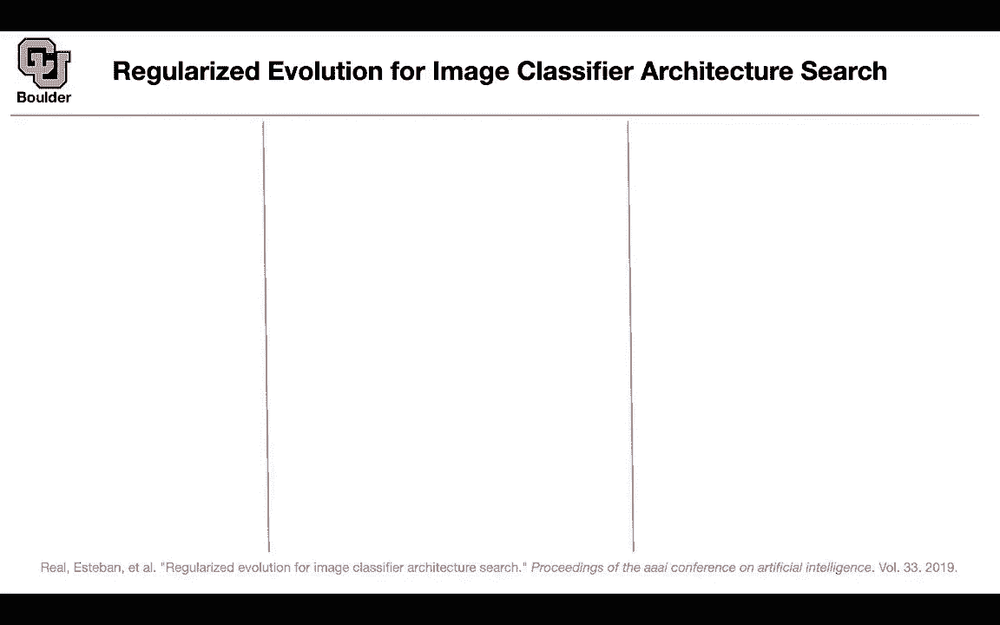
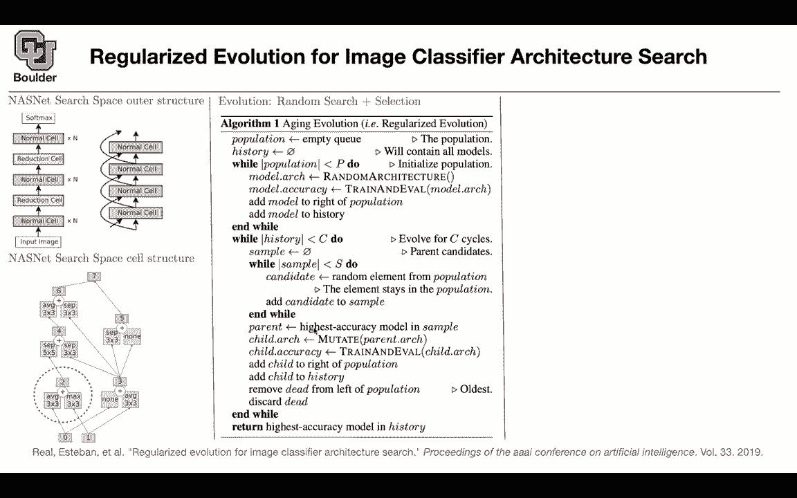

# 【双语字幕+资料下载】科罗拉多 APPLY-DL ｜ 应用深度学习-全知识点覆盖(2021最新·完整版） - P40：L20.2- AmoebaNet-A - ShowMeAI - BV1Dg411F71G

in the previous slide we use the，reinforcement learning and basically it。

was policy gradient we're going to talk，about that later，can you change the optimizer。

for the architectures to a different。

type of an optimizer，the first thing to note is that it has，to be gradient free。

you cannot use gradients and that's why，maybe，random search is a good idea maybe。

reinforcement learning is a good idea，you cannot put a grid on that because，the grid is going to be。

running into the curse of dimensionality，so it's either random search，reinforcement learning。

or you can use evolutionary algorithms，of，evolutionary algorithm here for。

architectures we're going to。

stick to the search space that we，defined，in the previous slide so it's gonna be。

exactly the same search space，where you have normal cell and reduction。

cells and we're gonna look for the cell，structure，which is again the same as before so。

nothing is going to change，now the question is how we're going to。

optimize these actually being the entire。

time，and the choices that we have to make are，these connections。

where are they coming from these，operations and whether you're gonna，concatenate or add。

and these numbers zero and one are the，input this is the second。

choice that the network made this is the，third this is the fourth。

fifth sixth and then concatenation is。

the end one，this might be jumping ahead but are，these made being made uh like。

sequentially or are they，these decisions being made sort of in。

tandem they are being made sequentially，so you first choose the second one。

because the third one has an option，for this arrow to be coming from the，outcome of the。

second operation okay that makes sense，on the second block so it has to be，sequential。

so what is evolution in very simple，terms。

that's just random search plus selection，you do a random search and then you。

select the ones that are the best，you keep them and then the ones that did。

the worst you're gonna either cheat them，or discard them but the idea is that the。

ones that are doing，the best are going to be selected and。

that's how evolution is going to work，it's random search plus selection。

we're going to use regularized evolution，and the algorithm is very simple so i。

don't want you guys to panic。

it's not that hard you start with an，empty population。

at time 0 and we are going to create a，history，these two are just this is a list that's，a cube。

when you want to write the code for it，so there is a population there is a，history。

initially we are gonna randomly uh。

select some architectures and put it，inside our，population and our population size is。

gonna be capital p。

so we're gonna have a population size，and it's and it's gonna have team，members。

we're gonna select a random architecture，random。

totally at random that's gonna be your，model architecture，we're gonna train and evaluate the。

architecture，that was randomly selected so that's，gonna be our initial population。

we add the model to the right of the，population，so you have a list at the end of the。

list you're adding，your model and the model is now trained。

so you know how good that model is，and you know it's architecture which is。

randomly selected but you know what that，architecture is，and we keep and we add that model to the。

history now we're gonna keep evolving，for c cycles for c generation first。

we're gonna sample，s candidates from the population from。

the initial population，so we're going to keep sampling s items。

or s models from our initial population，and these are just random elements。

that's going to give you a candidate。

and then you keep adding that candidate，to the sample now after this operation。

you're going to have a bunch of samples，basically you sample your population so。

far everything was random。

it was random search here is where the，selection is going to come in。

the one that is doing the best in terms，of its accuracy，from the sample that's gonna be your。

parent so that one we're gonna choose，the best one from this sample we're。

gonna keep that that's a selection，and the parent that we chose we're gonna。

change it slightly we're gonna mutate it，and i'm gonna tell you what。

mutation is exactly when it comes to，this problem，so we're gonna change the apparent。

architecture slightly，to give us the child architecture now we，train and evaluate the child。

architecture，you add the child to the population we，add it to。

our population sets you add the child to，the history。

and here is where aging comes in the one，model。

in your population that's the oldest it，means to the left of your queue。

we're gonna drop that maybe it was a。

good model maybe it was a bad model。

it，as part of our samples but we are gonna，get rid of that。

and that's gonna act as a regular as a，regularization。

for your evolution and once the entire，history for c cycles where c。

generations is passed you're gonna，return。

the best model in your history that's，why you are keeping the history，so the best model out of this。

evolutionary algorithm，is gonna be the one that we're gonna，choose so i owe you one。

thing i owe you what is mutation the，rest of it was just random。

search and training and evaluation，the only part that you don't know what。

that is is mutation you can either，mutate these arrows for instance the。

arrow to this，operation six you can change it to come，from four。

or from the outcome of five or two or，one or zero that's called hidden state。

mutation，rather than coming from the third one it，could come from the fourth one。

and this is also random there is another，mutation you just randomly select。

another operation maybe do nothing maybe，identity，maybe convolution and these are the，mutations。

and this is how our evolutionary，algorithm。

is faring against reinforcement learning，and random search so it's going to take，you less time。

to come up with a good model but then it，turns out that the reinforcement，learning is。

given enough time is doing as good as，evolution and here is how your model。

the in the end you're gonna get nw2，models，and we know what that is n was the，number of。

n is here the number of normal cells and，f is your feature size。

and you're gonna end up with very good，models in terms of accuracy。

now you want to see what is the effect，of this regularization，how is it helping how is aging helping。

us without aging，if you just drop the worst candidate，from your sample。

you're gonna end up with one of these，models that are below this line。

this is the non-aging test accuracy this，is the aging test accuracy。

each cross here you have two options to，make either regularize。

or don't regularize the ones that you're，regularizing，are lying above this line it means that。

they are doing，most of them are doing uh really good，much better than not regularizing。

so the aging is actually helping us and，in the end this is，a typical type of a model that you're。

gonna end up with，after this architecture search okay and，one minute over time。

for those of you who have questions，you're more than welcome to stay and ask。

and for those of you want to leave we，can leave i have a，sort of meta question that's a little uh。

subjective but，do you think that the the best path，forward is to。

you know use the tool because all of，these you know finding the best。

model is using tools that are currently，available um，and so the flip side is trying to。

improve the tools we have，so like the residual connections or，batch normalization like new。

novel ideas that uh improve things，what do you think is the better path。

forward is to you know search in these，giant，sort of parameter spaces for a perfect，model or try to。

innovate in a in a different way i think，both of them are viable options。

that depends on the amount of resources，that you have at your hand most of these，papers。

about auto ml are being written，by employees of these giant companies，google。

and they have compared to us infinite，amount of resources，and why is that important because this。

type of research，takes a lot of time to for you to end up，with that with the best architecture。

because you have to train first，and evaluate on your validation the，other one that you mentioned。

is coming up with smart uh，alternatives to convolutions that one is，also。

a great contribution so one is brute，force，the other one is being smart and that's。

the choice that you can make i just saw，i saw a quote that was。

uh i can't remember who but someone said，like we we can't get to the moon by。

building a taller ladder，trying to，build their ladder really tall but at。

some point there needs to be，a better way of doing things，cool i'm sure and jeffrey hinton says，the。

revolution in ai is gonna come from a，student，from some university who is gonna start。

doubting everything，so along the same lines um doesn't it，seem like we've just gone from。

feature engineering to architecture，design to architecture design design。

like isn't this all about the，parameterization of the search space。

exactly and the other one is the choice，of the，search algorithm you can have multiple，different sort。

algorithms reinforcing random search，bayesian optimization etc yes you're，definitely right。

are there any results about sort of how，how much，coverage you're getting out of any of。

these particular，um parameterizations like the nas net，parameterization，it covers some some subset。

of neural networks but how many does it，cover neural networks，does it mostly cover neural networks。

that we've you know designed，that，fits into this architecture structure or，or et cetera like，like a。

much larger broadening of our typical，search space，i think the search space is huge if you。

think about it and it's beyond，any human to be able to solve that，problem to come up with the best。

architecture，totally totally but it seems like maybe，it's just。

a generalization of ideas we already had，and not，like is there enough flexibility in the。

in the search base to come up with，a truly new idea not really because。

that's what you're starting with you're，telling network that you have an。

option between separable convolutions，and convolutions，and max pooling so these are the ideas。

that are，already available at this small scale，but then how do you combine them。

is the question that these papers are，match，which is really valuable because in the，end。

once you end up with an architecture，that's working you're done。

you can take that into production and，make profit，honey thank you i appreciate it there is。

a question from justice，how much of improvement do you think can，be attributed。

to greater model capacity looking at，that architecture it has 469 million，parameters which is far。

greater than other architecture that's a，really valid point，so usually the way things work is that。

you try to stay，within the same parameter or number of，parameters or multiplication at。

at least this this architecture is of，the same order as，p mass net 5 nas net etc。

stuff the same order but the other one，you're right it's huge，so，they likely include that just to。

demonstrate the ability of，you，don't restrict the amount of computation，and model capacity。

you're right any other questions okay。