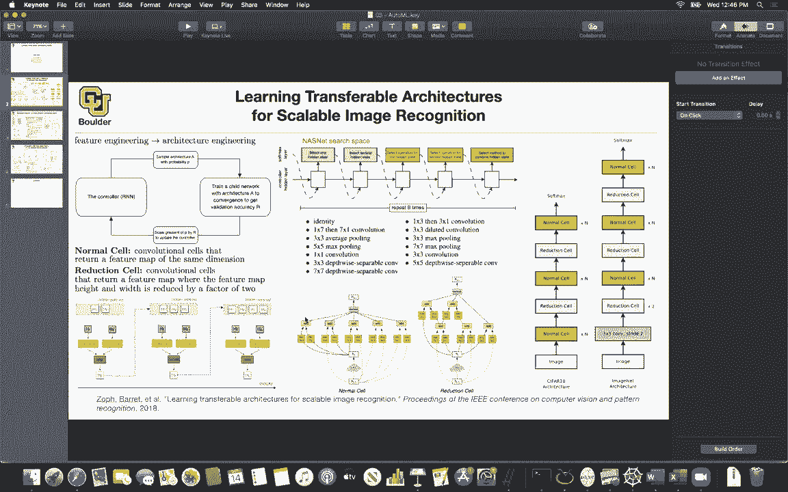
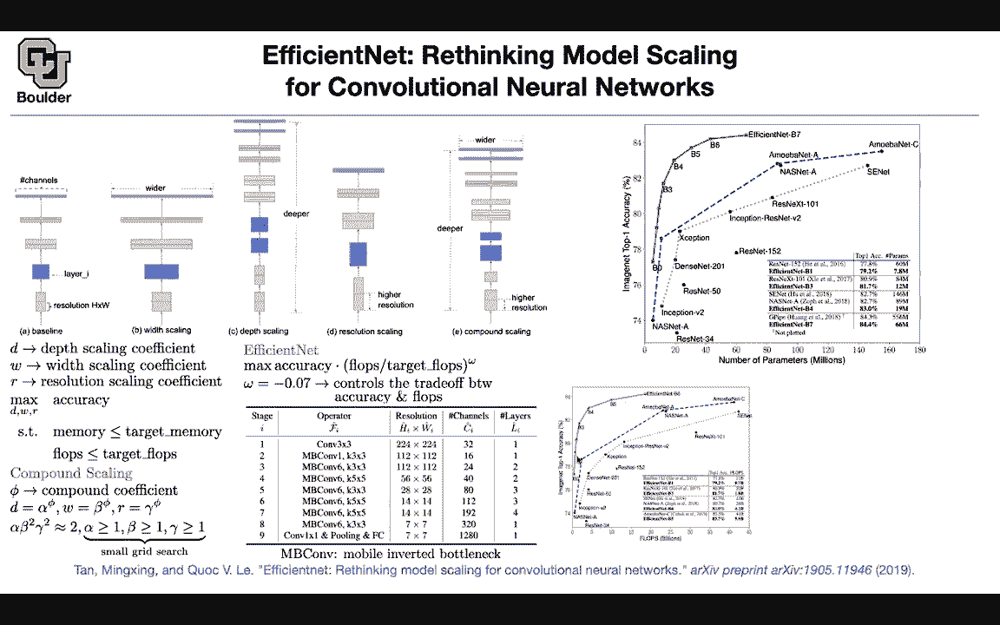
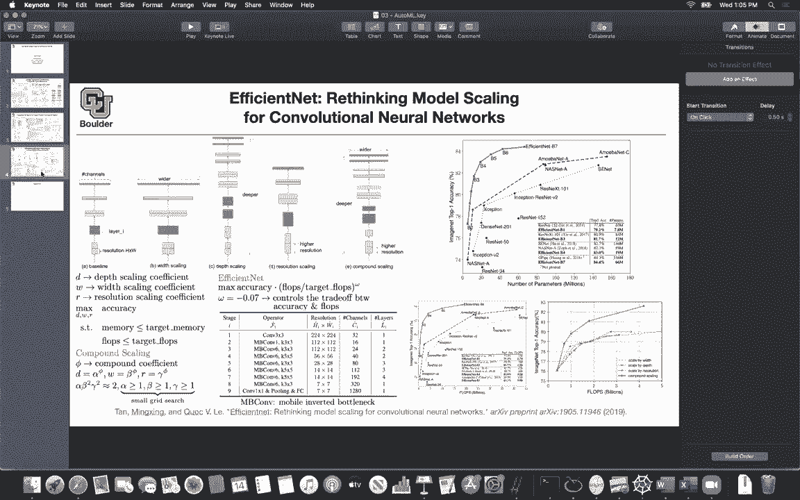

# 【双语字幕+资料下载】科罗拉多 APPLY-DL ｜ 应用深度学习-全知识点覆盖(2021最新·完整版） - P41：L21.1- EfficientNet - ShowMeAI - BV1Dg411F71G

okay perfect let's get started then now，we are in the realm of automatic machine，learning。

and the last session we covered，the nas net architecture specifically，the nasnet。

search space and then we have two，options once you have a search space。

to optimize over that search space one，is，actually you have multiple options you。

can do random search，the other，option is to use genetic algorithms，there is also another option。

bayesian optimization etc so all of，these methods are gradient free。

and why is that the reason is because，you don't have the gradients，you just evaluate your network。

on the validation part of your data set，you get a number and that's going to be。

the feedback that you have，the other problem is that your input is。

discrete for instance you have a choice，between，three by three convolution or five by。

five max pooling，so i think we covered enough about，automatic machine learning，what the。

literature is trying to do there is also，another paper that i want to discuss。

before moving to the next topic，the idea is that you usually start with，the baseline。

and let's see what type of modifications，we can do，we can change the resolution increase。

the resolution，we can make our blocks，wider basically have more channels we，can have more layers。

you can，make to the architecture so we saw some，papers that we're trying to do。

to make their network wider we had some，networks，or some works that were trying to。

increase the depth of the network，and make their network bigger and the，idea was that。

by making it deeper you're，increasing the receptive field and，you're seeing at the end of the。

last layer you're able to see perhaps，the entire image，by making it deeper the other idea is，just。

use higher resolution this paper is，saying that there is a delicate。

balance between uh all three of these，changes that you can make to your。

architecture and there is a delicate，balance，if you do only one of them you're not，gonna achieve。

as much as doing a combination of all，the things no matter how deep you do。

you go you'll you still need to make，your network a little bit wider。

and you still need to increase the，resolution slightly，so there is a delicate balance we need。

to do them all，but how are we going to parameterize the，search space so for that let's introduce。

some notation，let's say d is a depth scaling，coefficient，so we for instance the depth scaling。

coefficient here，is two so each one of these we are，copied and we are copying them two times。

this one we are making it two times so，that's a depth，scaling coefficient you can have a width。

scaling coefficient，which is gonna multiply the number of，channels by w。

to make it wider or even you might want，to make it less white，it's just a depth coefficient it could。

be less than one or bigger than one，the resolution scaling we are going to，call it r。

and this is our problem not only we care，about accuracy，of the model and we want to change we。

want to optimize over，depth of scaling with the scaling and，resolution scaling parameters。

but also we want to remain within our，memory budget so this is our budget our。

memory should be less than or equal to，the target memory，and we have a budget for the floating。

device，and the idea is to maximize that subject，is to these two constraints。

and we are changing d w and r so the，paper is smart，they introduce a compounding scaling，coefficient。

and let's call it fee and，this is how you can strike a balance，between d w。

and r so there are four parameters alpha，beta and gamma that you can find。

easily by grid search by trending on a，smaller data set and training a smaller，network。

and then if you want to make your，network larger，all you need to do is to play around。

with v and as you change v，d w and r are gonna change and we want，to have。

this relationship between alpha beta，and gamma and this has to do with the，computational cost。

let's see what we are doing alpha，correspond to the depth，so the amount of computations that you，do。

model，because you only have one for loop on，the depth so this case linearly。

so there is alpha to the power of one，because it's a linear，relationship then you have beta let's。

see beta corresponds to w，w corresponds to width that's your width，and because you're doing matrix。

multiplication the computational cost，of increasing the width is a quadratic，function。

of w that's why you see a two here，because you have two for loops now。

when you increase the width a similar，story is for，gamma gamma corresponds to the。

resolution and the resolution you have，two of it，that's why you have a two here so this。

is a computational cost，and if you set fee to be one that's the，entire computational cost。

of your baseline network which has a，baseline alpha baseline beta and，baseline gamma。

so you start with the network it has，alpha beta and gamma，the computational cost is gonna be a。

function of，alpha beta squared gamma squared and how，do you find alpha beta and gamma。

the optimal ones you you just do a small，grid search these are，three parameters you put the grid in。

r3 and then you find the best alpha beta，and gamma，you choose alpha beta and gamma on your。

grid you train your network，it's going to give you a validation。

accuracy that's going to be the number，that you're going to try to optimize。

and then you find the best alpha be，tying down on a smaller data set。

and your network is going to be small，because fee we are assuming it to be 1。

initially yes so it's gonna be an，exhaustive grid search，any other questions okay then now let's。

see what is efficient net，solving this problem is tough maximize。

the accuracy subjected to constraints，maybe we can do some sacrifices because。

in the end it's going to be a，multi-objective optimization and，multi-objective optimization is tough。

so what are we going to maximize instead，we want to come up with a single loss。

function and the idea is that you can，maximize your accuracy，times flops over the target so we're。

gonna ignore memory for now，so it's gonna flop over the targets and，then this。

omega parameter is gonna balance，the trade-off between accuracy and you，trying to make this。

as close as possible to one or you try，to minimize the flux，so this is basically how you find alpha。

beta and gamma，and this is going to be your efficient，net the base。

structure you're going to have a three，by three convolution，with this many channels and you have one。

layer of that，and then mbcon stands for mobile，saw that，in mobilenet version two and inverted。

bottleneck we saw it in mobile version，two and，gamma，this is your structure that we are gonna。

start with the cool thing about this，is that now you can change a fee。

and come up with different architectures，depending on the choice of your。

fee and i think this is a good wrap up，to，what we have been covering so far with，respect to。

efficient networks small networks large，networks，and the networks discovered by automl，of them。

so we cover this quiz and excitation，network，it has a lot of parameters and it's，giving you。

that much accuracy we have res next is，lying here，these are human designed networks。

inception resnet v2，exception we covered that we covered，this we covered that。

we covered dense nets we covered resnet，50，and inception v2 these are human design。

networks and as you can see there is a，pareto frontier，because it's a multi-objective。

optimization the idea in multi-objective，this，curve up to the left up and left。

so you want to push it to the next curve，and this is what happened。

with neural architecture set neural，architecture，search net nas net this one we covered，in。

automl and again as net，this is the paper that we covered last，session and this is the other one and。

these are all of the efficient nets，and the change that you see here these，different dots。

when you have more parameters，corresponds to this fee，so you're changing only one parameter。

and phi is not optimized over but，alpha b times gamma are optimized over。

fee is just going to help you，give you one parameter to explore the，fair the pareto frontier。

and give you different architectures，depending on your，target device you're going to choose。

either b0，b1 b2 b3 or b7 that one was for a number，of parameters you can have a similar。

plot for number of blocks floating point，operations。

and you're going to have a singular plot，now the point is the point of this paper。

is that you need to strike a balance，between the bit the width of your。

network the depth of your network and，the resolution，if you keep increasing let's look at。

this yellow，width，that's going to be your pareto frontier，and you're saturating i don't know。

around 80 percent，accuracy if you keep making your network，deeper and deeper。

you're going to saturate around again 80，accuracy if you keep increasing the，resolution。

that's what you get but if you balance，it with，v the parameter the compound coefficient，parameter。

this is what you're gonna get in the end，so the question is should i make my。

network deeper should i make it wider，should i increase the resolution the，answer is do all of them。

and this is an empirical evidence of，that and if you compare resnet。

152 with efficient net you have much，fewer parameters，you have the same structure here much。

fewer parameters，squeeze and excitation network much，fewer parameters but the accuracy is。

similar any questions，before i move to the next topic no，questions。

was everything clear okay perfect so，let's close the chapter of automatic，machine learning。

the literature is growing and we are not，going to be able to cover everything。

but these were the most important papers，in that field，and it should be enough to get you。

started if you want to do，research or you want to do work in that。

field now you know。