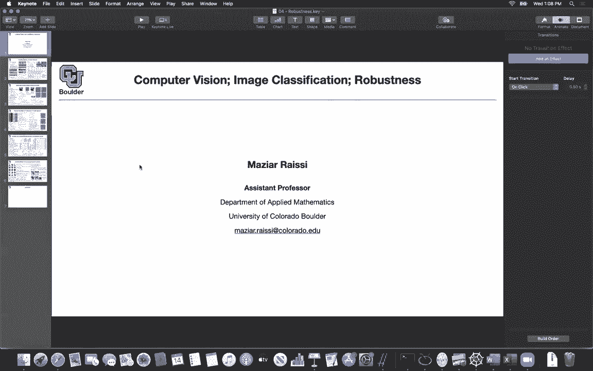
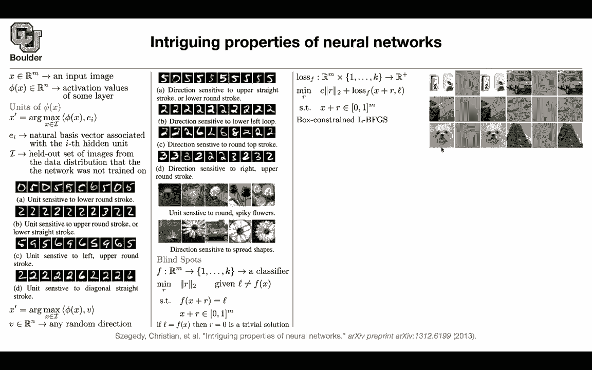

# 【双语字幕+资料下载】科罗拉多 APPLY-DL ｜ 应用深度学习-全知识点覆盖(2021最新·完整版） - P42：L21.2- 对抗学习示例 - ShowMeAI - BV1Dg411F71G

so what is robustness let's go back to，deep learning the concept of deep，learning in general。

our data was our source code then we，designed models，either had engineered our models or。

automatically，found them we tried to make them more，efficient，by taking into consideration the。

computational capacity of our devices，we trained our model using mostly，stochastic gradient descent。

that was our compiler now we end up with，a，software that you can put it in your，drone。

you can put it in your self-driving cars，you can put it in your smart devices or。

you can put it in your robots，or you can put it on the on your home，page to do something interesting。

as soon as an image comes in you're，it，so now you're taking your the resulting，algorithm。

that's coming out of deep learning and，you want to put it into production。

and whenever you take something to，production bad things could happen。

there could be attacks on that algorithm，there could be viruses that could there，could be。

adversarial attacks on your device，and you want your target application to，be as robust as possible。

and that's why we're gonna cover，robustness because it's very important。

in the end the objective of deep，learning is to give us an algorithm。

that we're gonna use it in production，and we don't want the algorithm to fail，attacks。

or even on targeted attacks or even，random events，so let's start with the first paper that。

started it all，and try to study robustness and how，things are going to work。

so many people confuse generative，adversarial neural networks with，adversarial attacks。

these are two separate topics they have，this similar names，adversarial but the aim is totally。

different，in one of them the aim is to generate，and come up with generative models。

generate images for creative work for，instance，and for learning the underlying。

distribution adversarial neural networks，or adversarial attacks are about，robustness。

of our networks so these are two，separate topics with similar，names okay let's get started let's say。

you have an input image，x it's m dimensional so we are，concatenating。

or flattening an image and it's going to，give you，m for the total number of pixels so。

that's your input image，and we're gonna take a look at the，activation。

value of some particular layer inside，our network so that's going to be a，of。

x and the values are going to be，n-dimensional，we can take a look at the units of fee，and try to see。

what the network learn what is the，network learning what features。

is it coming out with so we remember we，are not doing feature engineering by，hand anymore。

we are letting the network to find the，feature for us，and now let's say you want to interpret。

those features and people were trying to，do that，and how would they one way of，interpreting that。

or coming up with an interpretation this，fee is，n-dimensional you can take a look at。

one of the dimensions so you can take a，slice，and that's basically the inner product。

with a unit vector，in your coordinate system and that's，gonna pick out a single value。

so this is gonna be one dimensional and，it's gonna pick out only one of these，dimensions。

one of the one out of the n dimension of，your feature，and let's try to study that now that you。

have a single，value you can optimize it you can say i，want to find。

the arc max of the over some images，that i haven't trained on before and as，soon as you find it。

it's gonna give you the image that's，gonna，activate that particular feature。

the most so there is a question from，theodore，are we maximizing over all x and all e i。

no you pick an e i you choose it you are，interested in，the tenth feature for instance you。

choose e ten，now you maximize over x so i'm being，careful here，it's r max over x only and that's a。

great question so this one is fixed，you pick it you fix it you want to see，what image。

in your data set is gonna activate this，particular，neuron the most so it's going to give。

you a way to visualize what type of，images，this particular neuron is sensitive to，and as i said ei。

is just a natural basis vector it's a，vector that's，one and then zero everywhere else and。

it's one at the eighth location，so we are only picking out one of these。

n dimensions so we are picking out that，hidden unit，the i've hidden unit and what is i where。

are we searching over our images，we are searching it in a held out set of，images。

that we haven't trained on so we haven't，trained the network on this。

set of images so i is not part of our，training data，and people started interpreting that i，said okay。

this unit seems to be sensitive，one，this one this one so these are lower，round strokes。

so now we are interpreting that，particular unit this other unit，seems to be sensitive to upper round。

strokes，so there is a round stroke on top or it，could be lower round。

i mean lower straight strokes this unit，is sensitive to left，upper round stroke so it's left upper。

round stroke，sensitive to diagonal straight line，but then not there is nothing intriguing。

about this but what is intriguing，and hence the name of this paper is that。

there is nothing special about ei and，that's exactly，going back to theodore's question and。

that's why i say it's a great question，so there is nothing special about ei。

you can change ei to any random，vector in rn so any random vector。

you can do the same exercise and then，you can start interpreting，you can say all of these。

images are sensitive to upper straight，strokes，or a lower round stroke you can do the。

same interpretation for，loop，so there is a loop here direction，sensitive to。

round top stroke direction sensitive to，right，upper round stroke so you can start，interpreting them。

similarly you don't not only you see it，for，the numbers and digits you're gonna see，it for。

images if you pick ei you can say that，this unit，insensitive to round spiky。

flowers these are round and spiky，flowers you can say，whenever i say direction there is a。

random direction，and whenever i say unit that's just one，of these eis。

you can interpret a random direction，in a similar fashion for instance this，image。

or this set of images are sensitive to，spread shapes so it's a flower that one，is spread。

i think that's a fan this is a wheel，flower etc do they，pick just really just random vectors。

and find these images which maximize，this inner product，and then stare at what they get and then。

try to interpret the meaning of the，vector v，um or is there something systematic that。

they're looking for，or like a priori feeding into this no，that's exactly what i've been doing。

you phi one of your units you maximize，that over a set of images。

and then you report those images you，all，share this property and so these like，are more。

like a human based interpretation of the，commonality，exactly okay that's correct and they，make sense。

the other way around the other way，around is when you are doing hand，engineering。

you have engineer some features for，features，you can in your images you can look for。

direction sensitive to upper，right upper straight stroke and that，could be a column in your data set。

and once you have your data set in a，tabular format，a classical machine learning technique。

can do it got it okay，yeah but now you have some features you，want to interpret them。

yeah and this is what people were doing，with the features，with that particular hidden unit but。

then this paper came along and said，uh there is nothing special about that，can。

start interpreting that this is it's，actually a question i've had。

like throughout this class is um like is，there a way of，looking at like these these digit。

classifiers that output a number，or a soft max with a probability of the，different digits。

is there a way of feeding the network，backwards so passing in like digit 10。

and seeing what image the network，generates or is then this，kind of seems like a not exactly that。

but like a kind of a proxy of doing that，figuring out which which images uh。

in this case activate a certain neuron，is there a way of looking at which，images activate。

um or like what what back propagating，from，a 10 a digit 10 or a digit 9 or a digit，8 would。

would generate as an input image yes，so we are going to go through that when，we study。

some papers that try to analyze，what the network is doing and we，visualize it where the network is。

focusing on，etc and we are going to see that cool，here，it's uh you pick the neuron what type of。

images activate that neuron the most，and this is sort of going backward but。

yes we are going to see all of that，later on thank you but now this is an，intriguing property。

and the interpretation is that no，specific direction has any particular。

meaning it's actually the space of，the space spanned by this function that，is having a meaning。

so it's the entire space or the entire，manifold，that you're finding and all of them all。

together they have a meaning，yes you're finding some features but，each single one of them。

may or may not be meaningful but it's，the entire space，there is another intriguing property any。

question so far because i'm changing the，topic slightly，okay perfect now let's look at the，networks。

and these networks seem to have some，blind spots，let's take a classifier you take an。

image and then you classify it，among one of these k options classified。

as a number 1 or as a number 10，or image number 1 or image number 1000。

in the case of imagenet so you have a，classifier，and we are looking for blind spots what，is that。

we are going to take x our input perturb，it a little bit，with another vector r push it through。

our neural network，and we want to classify it as label l，and i'm going to tell you what is l and。

we want this perturbation to be as small，as possible，so the objective is to find an image x。

plus r that is as close as possible to x，and classified wrong by the network。

so it means that if you can solve that，problem these are counter examples。

to what the classifier is supposed to do，so if an image，is perturbed slightly we should still。

the network should still，predict the same outcome and basically，problem。

these are small perturbation what's the，rationale behind，that bottom condition is that saying。

that x plus r needs to be binary，or just some number between zero and one，uh x plus r。

what does this mean that's a great，that，you still have to be an image so that's。

is that the that's the interval zero to，one，no it's interval zero to one because，these images x。

are normalized yeah from zero to one，yeah now you want whatever that you're，adding not to。

escape your domain you don't want it to，be from zero to one point。

one of the pixels have a value bigger，than one or smaller than。

zero and the other objective is you want，it to be，minimized you want to be as a smaller。

perturbation as possible and，why l should be not equal to f of x the，reason is that。

let's go backwards if it is equal what's，gonna happen，then r equals zero is a trivial solution。

so that one has a trivial solution and，we don't want trivial solution。

and we want our network to actually make，mistakes so you pick l，let's say you want number two to be。

classified as number six，so you pick six that's gonna be your l，your network is。

currently and correctly，giving you a two but now you want to，confuse a network。

you want to attack it it turns out that，solving that problem is not easy。

this is high dimensional and enforcing，this constraint is not easy。

you can just enforce it through a loss，function so you introduce your last。

function and your loss function takes，input as，and takes as input and image gets the，image。

push it through the neural network f，it's going to give you，the prediction of the neural network。

you're going to know the ground truth，and your loss is going to give you a。

number that you can optimize over，and rather than solving that problem。

we're trying to solve this problem，we still want to minimize the norm of r。

and we want the prediction of the，network to be as close as possible to，the label。

that we wanted and this one is just not，it，if it escapes your domain you can cut it，to the boundary。

so that's going to be your objective，function the second part is trying to，enforce this part。

but now things are differentiable and，you can，take derivatives and try to optimize。

that and the optimization that we are，going to use is going to be box。

constraint lb fgs it's just lbfcs，and it's box constraint and it's box。

constraint because you want it to be，read in the box，once you use that you will come up with。

your perturbation so a small，perturbation，can make your network confused so these，two images are。

indistinguishable the perturbation is，very small，but the network is going to get confused。

it's going to give you another，prediction，similar thing here a similar thing here，so to human eye。

it's very easy we know that it's the。

same dock，or that's the same car school bus this，is intriguing。

and something even more intriguing it's，not for this particular network。

and for this particular structure of the，network these adversarial examples。

actually mess up with the predictions，of totally different neural network。

structures for instance you can design，your adversarial examples for a fully。

connected neural network with 10 layers，and it's going to make 100 mistakes 100，percent mistakes。

you take the same examples you feed a，fully connected，you，fit it into another network structure。

and you're still，confusing the network so these，adversarial examples that that's why。

this problem is huge，and very intriguing is that they are，universal you design them for a。

particular network，and for a particular data set but，they're gonna mess up with the，predictions of。

uh and another type of network trend on，another type of，data set so the conclusion is that。

adversarial examples，are hard even for models trained with，different hyper parameters。

i think we are one minute over time for，those of you who want to stay and ask，questions。

i'll be around and for those of you who，to，if you add these adversarial examples to。

the training data，do you end up with a new set of，adversarial examples that still，generalize。

uh say the game so so you come up with a，set of adversarial examples right you。

come up with your perturbations you，now have perturbed images that are，misclassified。

and you can retrain your network，that you got these perturbations these，perturbed images from。

using the perturbed images but with the，correct labels，so you can just add these to your。

training data right，yeah so now you are thinking ahead of，yourself which is great。

now you saw a problem and now you want，to fix it，and we are going to fix it in the next，paper。

is that is it is the next one just a gan，paper basically，no okay cool but for now we are。

investigating the problem we see that，there is a problem，and the problem generalizes it's not。

only for this particular network and，this particular data set，it's actually universal when you say。

that the problem generalizes，does that mean that each network，architecture with its own data set。

has a set of images which would get，misclassified like you see here。

or do you mean that like this particular，dog that you've，figured out is miss classified would be。

misclassified generally by all of the，networks exactly，it's the second thing that you mentioned。

that's amazing you take this image，and that image is wrongly classified by，this network。

but then there is 11。7 percent chance，that the same image is gonna get。

confused it's gonna confuse another，network trying totally differently so if。

you build an adversarial example，for one network it's still roughly，well。

exactly this is an adversarial example，for this image，but then that adversarial example is not。

only gonna confuse this network，it's gonna confuse multiple other，networks that's fascinating。

yeah it's generalizing so it's not even，like a special case of taking advantage。

of this one architecture there's，something about that，image yeah that's that's fascinating。

yeah it's amazing and parker is saying，it makes sense though，all these networks have the same。

objectives and training data no，that's the whole point we are changing，the in i think there is one。

part here that i'm not mentioning i'm，gonna mention it，next session even if you change your。

training data，you train your network on totally，different training data sets。

it's still gonna get confused there is a，high chance at the same adversarial，method。

so you're saying that even if i take，an adversarial image for a network that。

was trained on the non-perturbed image，have，that image in the training data then。

that adversarial image may，still get clock misclassified exactly。

okay that's pretty wild that's why yes，that's a serious problem，yes yeah it's definitely intriguing。

and there is another question from，brandon，are there any papers that explain why。

certain data networks are more robust，than others，what subfield would this be so it's。

exactly the topic of our discussions in，the class，for i think one week or two and then，once i'm done。

you should be on a good ground if you，want to do research in this。

you're gonna have enough background and，i'm gonna tell you what other papers to。

read if you are interested，so i'm thinking as a cynic now um。

looking at these misclassification areas，like it's always 100 percent，um uh it's a 100。

adversarial for the network it was，designed，to be adversarial for and then it's 11，or 22。

for the other networks is that any worse，than just，the background misclassification。

rate and if it's if it's making the same，error rate as it would for any image can。

we even say that that's an adversarial，image，no these networks most of them are，making around。

less than one percent error okay or less，than two percent error and now。

it is ten times worse or twenty times，worse okay yeah，and as you make them deeper you'll give，more。

power they're gonna make less mistakes，it's a little bit more robust to these，attacks。

yeah okay it looks like that this，uh auto encoder architecture is more，robust。

but still something else i noticed，that's interesting to me is that the，adversarial。

image for the third line the fc10，one whatever that network means seems to。

be the most adversarial across the board，for all the other networks。

so i'm curious about what properties you，learn to exploit，of that network which are then like the。

most bad，compared to the other networks i see，that's a great question i need to。

see that that's a great observation like，whatever whatever blind spot。

fc101 has seems to be a very strong，blind spot for all the rest，is bigger。

so the magnitude of this r is bigger，oh it's one yeah it's more noise maybe。

it's more noticeable to human eyes，it could be yeah like it's it's most。

adversarial just because it um。