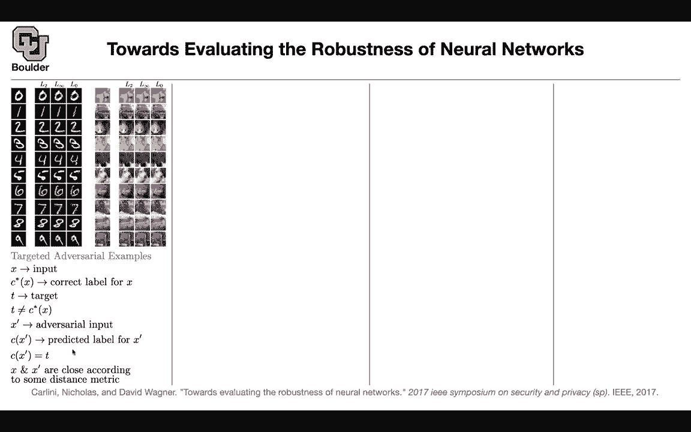
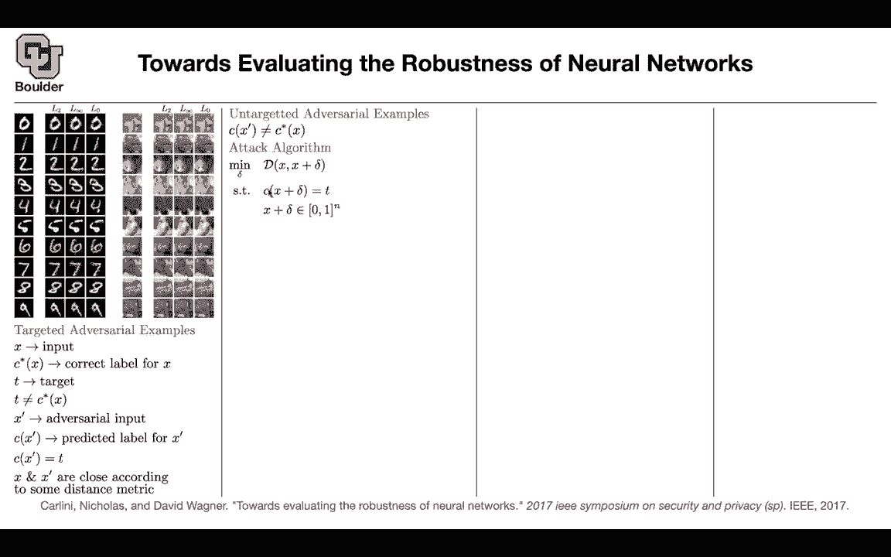
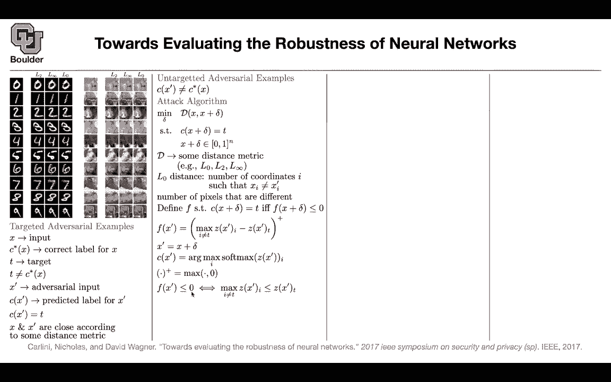

# 【双语字幕+资料下载】科罗拉多 APPLY-DL ｜ 应用深度学习-全知识点覆盖(2021最新·完整版） - P45：L23.1- Breaking Defensive蒸馏 - ShowMeAI - BV1Dg411F71G

in the last two sessions we started with，robustness of neural networks when we。

take them into production，we want our networks to be robust，especially to adversarial attacks。

the first paper that noticed this，property，that neural networks have blind spots，was。

this paper intriguing properties of，neural networks，and then we said we wanted to have a。

faster method of coming up with，adversarial examples so that we can，actually come up with defense。

maybe adding those adversarial examples，to our training set，could help the network become more。

robust so in this literature there is，going back and forth between attacking，networks。

and coming up with defense against those，attacks，so this paper is also about a new way of，attacking。

our networks and a new way of looking at。

how to attack，and come up with adversarial examples i，guess so far。

we covered an example the first paper。

was an example of an l2 adversarial，example l2 norm it means that the。

adversarial example，needs to be close to a natural example。

in l2 sense in l2 norm you can have。

l infinity which is the previous paper，you can have l0 and depending on the。

norm you can have different types of。

adversarial examples，l0 is very nice because you are changing。

very few，pixels in your image as you can see，there are some。

probably you don't see it's very small，but there is a blue。

see，on the pixel level so you can change a，few pixels and then。

the algorithm is gonna confuse the，classification。

you see it better here you're changing a，couple of，pixels on your image still to the eyes，of a human。

between。

zero and one even if you change a bunch，of pixels，but let me go through a couple of，notations。

before we understand what the paper is，actually trying to do，so we have two types of adversarial。

examples one is targeted，the other one is untargeted for targeted。

you specify a，wrong class and you want the image to be，classified。

to that particular target that you chose，beforehand。

the first paper was an example of an ad，targeted adversarial example。

the second paper was about untargeted，you just wanted to the network to make a，mistake。

let's define them more rigorously so。

x is an input image c a star of x，x。

in your data set so that's the correct，label and let's say it is a target，because。

we want to deal with targeted，adversarial examples，so we are going to specify a target and。

we want，tb to be not equal to the true target。

the true class label we are looking for，an adversarial input。

x prime and c of x prime，is going to denote the predicted label。

for x prime and what we want is that we，want c of x prime。

to be equal to the target that we，specified，beforehand so that's a targeted。

adversarial，example and we want x and x prime。

to be close according to some metric let，it be l。

two distance l infinity distance l zero，distance，i don't know distance on this sphere etc。

and what is an untargeted adversarial，example，you don't have any targets you just want。

your cfx prime，to be different from the correct label。

for x，so as soon as you classify a one as a，zero。

that's a success for your adversarial，example，but in the case of a targeted。

adversarial example you want your one，to be classified as a five five is your。

target so is this clear，the difference between the two okay，perfect now let's take a look at the。

attack algorithm，that we covered in the first paper。

in that paper our d the distance was l2，distance。

and then you wanted the predicted。

class for your adversary to be，a particular target and in that case we。

had l2 you can also have l0 and infinity，etc，and as i said an infinite distance is。

interesting，because for l infinity you are going to，be counting。

the number of pixels in your image that，are different，and that's going to be the distance so。

it's going to be a count so here is the，meter of the paper so you define a。

function f，why are we doing this because solving，that problem is hard。

and we saw that even in the first paper，we had to，work with a loss function here now what。

this paper is suggesting，is that you define a function f such。

that this property holds，we want this property c of x plus delta。

to be our target，and we want to have an equivalent，condition。

and our equivalent condition is going to，be defined in the form of this f。

as soon as f of x plus delta，f of our adversary is less than or equal。

to zero，this condition holds and as soon as this，condition holds we want the other。

condition to hold，so now it's a matter of choosing f，because once you choose f。

you can plug that condition in place of，this condition and hope that。

the uh the minimization problem that you，end up with，is a simple one because that is actually。

solvable，so here's an example there are multiple，examples you can take a look at the，paper。

but this is the one that they're gonna，end up using using in the end。

so f of x prime is the positive，part so this is just the maximum of the。

argument and zero，and we want this to be less than or。

equal to zero i'm going to break this，function down，and then you're gonna see why this is。

doing exactly what you want it to do，but first z of x prime。

are the logits oh so theodore acid。

so z of x prime are before you apply the，softmax，or。

unnormalized log probabilities and for。

instance if you have 1 000 classes，you're going to get 1 000 numbers or a。

vector that is 1 000 dimensional，and when you index it with t we are。

indexing it with，we are picking up that target for，instance in this case。

before applying the softmax you're gonna，have ten numbers。

z1 z2 z3 z4 z5 z6，etc and then let's say your target is 6。

so you pick z6 that's what this notation，here means。

and this is z of x prime for all of the，i's。

except for t and what do we want we want，zt to be the maximum one in that case。

our network is making a mistake。

on the target if the logit。

is having the highest value then our，classifier is gonna classify。

our image to this particular target and，we are forcing it to make a mistake。

so let's see what is x prime x prime is，x plus delta。

and we know that our our algorithm，is going to predict a label for x prime。

using this notation using this uh。

by maximizing by finding the r max of，the softmax，of our logics and i is just the。

coordinates of z，so is this clear so far what is z so，there is a question。

so first did i um did i answer your，question about z。

and what that is yeah z is clear now now，i'm curious about this like superscript。

plus notation does that mean that you're。

only going to select that value if it's，positive。

yes so that one i'm going to explain so，your question about is about this，positive。

yeah and i guess implying then how would，f ever be negative。

yeah so that plus is just a maximum。

clear，we are taking the maximum of this term，and zero。

yes and that's just the definition of，this plus yes，now let's take a look at this if f of x。

prime，is less than or equal to zero so if this，term is less than or equal to zero。

and。

zero is less than or equal to zero it，means that，the argument is less than or equal to。

zero it means that，the maximum of all the other。

classes or the logics for all of the，other classes。

is less than i recall to the target one，okay and you can also go backward。

if this is greater than or equal to the，maximum，then that's going to be positive and。

you're going to pick up the maximum of a，positive number on 0。

and you're going to get the term on the。

our，objective function so if we manage to，make。

f of x prime less than or equal to zero。

then our particular target the logit for，that particular target is going to be。

the biggest and once that happens we are，making。

our network to classify that adversarial，example，to our target which is equivalent to。

this condition here。

so we want f to be actually less than or，equal to zero。

we don't want it to be close to zero we，want it to be less than or equal to zero。

for some of the adversarial examples，this condition holds。

by default for some of them the harder，ones is not gonna。

happen it means that this maximum is，going to be，bigger than the target for those of for。

those cases we are going to penalize，and we're going to say minimize that so，does that answer your。

question yeah i kind of want to follow，up so it seems like um just if i'm。

understanding this right if f。

is big and more positive it means that。

we are unable to find a good，or like our um our current adversarial，example is not good at。

pushing towards the target um whereas if，f is small we've。

found a good adversarial example，x prime is able to move towards the，target t。

exactly so you want your f of x prime。

to be less than or equal to zero if it，is positive。

it means that one other target one other，logic is dominating yeah it's not the。

one that you're interested in it's it's。

still okay so like，it means one of the one of the output，classes is still。

stealing some attention and then we want，to minimize that and。

yeah okay yeah yes so what we are seeing，here is very similar to the hinge loss。

you can actually use that for doing，classification，so this could be your loss and hinge。

loss is coming from support vector，machines，okay these are not new ideas but we are，just seeing them。

in this course i think it's the first，time that we are seeing。

such an object but it's smart it means，that all you need to do is。

look at your logits the log of your，unnormalized probabilities so i want。

this to be clear for everybody。

is it or does it need more explanation。

so the idea is that we want the logit of，the target to dominate。

and that objective function is going to。

help us do that and why do i call the，constraint an。

objective because then you can put a，lagrange multiplier on this objective。

and this constraint and put it inside。

your objective function，so in the end this is the problem that。

we want to solve we want to minimize，the perturbation to an input image，that's going to give us an。

adversarial example so i set these，condition holes，so in the first paper they were doing。

they were putting a loss function there，now we are defining an f and that's。

going to be our function that we're，going to deal with this is our，constraint。

so we replace c of x plus delta equals t，with f of，x plus delta less than or equal to zero。

and as i said you're gonna take，you're gonna put a lagrange multiplier，on your。

constraint and put it inside your，objective function，and that's the term that you get and。

that distance could be，any distance now we're gonna specify our。

distance we're gonna say we're gonna，be looking in the family of lp distances。

for instance l2 l infinity l0 etc。

so we want to minimize the perturbation，plus the lagrange multiplier of f of x。

plus delta and now we want to deal with，this constraint，and that constraint you can deal with it。

in a smart way you can re-parameterize，rather than solving for delta we are。

gonna solve for，omega tan h is a function that is，between negative one and one。

and now if you take x put it take it to，the left side that's going to give you x。

plus delta，tan h was a function between negative，one and one so tan h。

plus one is going to be a number between。

0 and 2 and that's why you need the，one-half to put it between 0 and 1。

so rather than minimizing for delta。

we're going to minimize for，w and that that way you're going to take，care of this constraint。

and then it's going to be an，unconstrained optimization problem and。

you can solve it any question so far so，it turns out。

that defense distillation actually we，covered distillation，when we were talking about small。

networks it turns out that the same，algorithm，could be a very good defense mechanism。

for，other algorithms prior to this work and，this work is saying that defense。

distillation is not going to work，for this uh for the type of attacks。

that are gonna result from this，algorithm。

but what is defense distillation let's，let's remember it，so you have the soft max it has a。

temperature，and we said if the temperature goes to，zero。

the softmax is just focusing on one of，the entries。

it's just a max function maximum of i，don't know ten numbers，and if t goes to infinity you're gonna。

have a uniform distribution，so that's the role of the temperature，distillation。

and actually defensive distillation is，the algorithm that we saw。

before it's exactly the same thing you，have a，teacher network in the previous paper we，were saying。

we have a large network or massive，network that we wanted to summarize。

or distill in a smaller network here we，have a teacher network。

and we're gonna train it using t as our，temperature，we are gonna generate data from the。

teacher network，with the same temperature we're gonna，train the distilled network on the data。

generated by the teacher network，and in prediction we're gonna set the，temperature to be one。

and use a distilled network for testing，and doing inference，the difference between defensive。

distillation，and the distillation that we saw in the，previous paper。

is that previously it was a large，network we're trying to summarize it in，a smaller network。

here the teacher and the distilled，networks have the same architecture。

that's the only difference so this，algorithm，defensive distillation was able to。

make the network more robust against the，type of attacks that we saw。

in the previous two papers but then，here we see that you can have，adversarial examples。

even to networks that are trained using，defensive distillation，and the way that you come up with。

adversarial examples is using this，algorithm so what are we seeing in this，figure。

that is your source classification，that's the target that you choose。

and if your norm is l2 you can make your，network，to incorrectly classify zero as a one。

zero as a two zero as a three and as you，can see all of these，look very similar to each other。

similarly for，one you can make it to be classified as，zero to be classified as two etc that's，for l2。

this stands for l0 distance you can，start noticing it here，when you have sevens and for l infinity。

i don't even see the difference maybe，there are some differences。

when we want to classify seven as a six，i see some noticeable pattern but other，than that。

is there any um reason or any deeper，reason why we，consider these different norms and the。

adversarial examples measured in these，different norms like our，are certain application domains we。

expect certain，adversarial attacks to take certain，forms uh，not really so the thing is that prior to。

this work，some of the methods were using l2，distance and some of them were using l，infinity。

and some of them were using point wise，attacks like，l0 and this paper is saying that，regardless of。

the norm and regardless of the whether，you use defense distillation or no。

i can make your network make mistakes，with 100 failure using this approach。

and the key idea is using an f function，that is equivalent to your，constraint so any other questions。

i'm curious if it um talked in this，paper about，which of these norms was the。

easiest or the hardest to，target like are are these，algorithms or these networks generally。

more robust，to attacks in the l2 norm or the l0 or，is it is it spread out evenly uh that's。

a great question，paper，but uh maybe you can take a look at it，and let me know as well。

i don't think i saw a study of l2 versus，l0 versus，l infinity and which one is easier，because。

then you need to look at how much time，your algorithm，took to come up with an adversarial。

example depending on your norm，then that could be an indicator of how。

hard it was to find an adversarial，example，depending on the norm yeah and i was。

also thinking of just the um，the size the size of the perturbation，required。

to create some mislabeling but even then，you're comparing apples with oranges。

because you're measuring the size in a，different norm，yes exactly so i guess yeah i guess time。

time is a better comparison now，because you're that at least that's，consistent okay。

any other questions so that's the trend，you come up with an，algorithm for attacking neural networks。

you try to fix it for instance using，defensive distillation，and then another paper comes and breaks。

the pattern it says no i can attack your，defense and that's the the current state，of the art。

