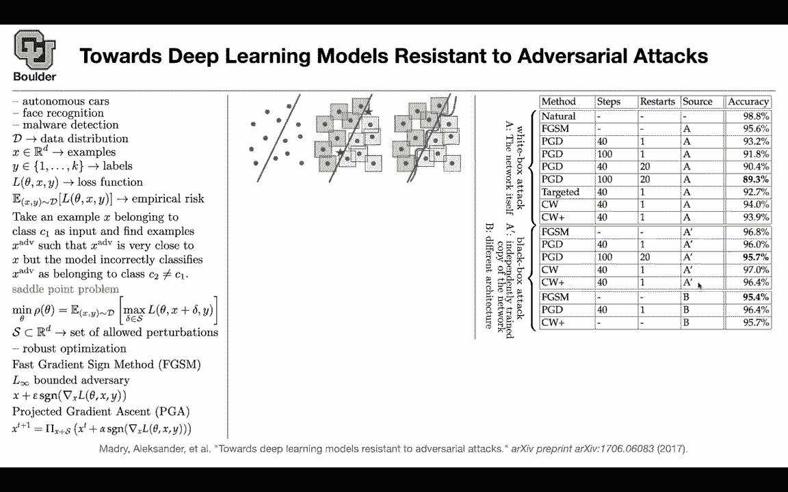
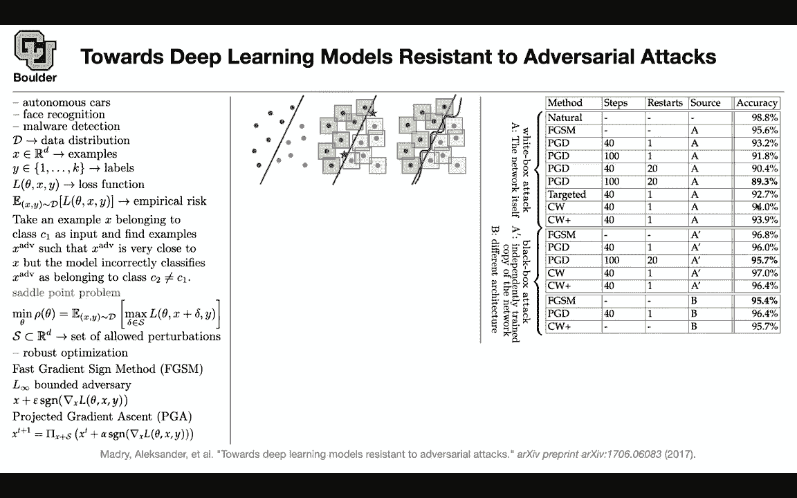

# 【双语字幕+资料下载】科罗拉多 APPLY-DL ｜ 应用深度学习-全知识点覆盖(2021最新·完整版） - P47：L24.1- 稳健优化 [续] - ShowMeAI - BV1Dg411F71G

let's get started uh let's see an，overview of where we are，we started with this paper intriguing。

properties of neural networks，and we saw that networks have some，have some blind spots。

but then to find those blunt spots and，adversarial examples，we needed to solve an optimization，said。

i'm looking for a cheaper way of，generating adversarial examples。

and it came up with the idea of gradient，sine methods，or fast gradient sine method and now。

that you have a fast method of creating，adversarial examples you can add those。

examples to your training set，or you can modify your objective，function this way that's equivalent。

so the first one was an attack the，second one is trying to mitigate the，attack。

then there were a couple of papers，claiming that，defensive distillation or actually。

distillation is a good way，to defend against adversarial examples。

this paper came along and said if i，change the objective function to，for。

finding adverse early examples to，something else then，even defensive distillation is not going，to do。

any good then we started this paper last。

session，and this is an extension to fast，gradient sine method。

for fast gradient sine method we are，apparently taking a step。

in the direction of gradients gradients，of your objective function with respect，to input。

that was the observation that this paper，started with。

and if that's the case it seems like you，are optimizing an objective。

and then we introduce a couple of，notations our last。

function the empirical risk and then we，said。

okay now that fast gradient sine method，is taking a step in the direction of。

a gradient of our loss function maybe we，are actually optimizing something。

and maybe this should be our，optimization function maybe we have a，saddle point problem。

where the adversarial examples are being，generated。

by maximizing our loss function with，respect to，a perturbation and this perturbation has，to be。

in a set of allowable perturbations。

norm，then these perturbations need to be，small enough in。

a infinity norm or in l2 nor or in l1 or。

etc and then we saw that yes indeed fast，gradient sine method，is trying to take a step in the。

direction of maximizing，this loss function and our s for that。

particular，method is defined by l infinity。

it's going to define the boxes around，our observations，so the idea of this paper is that you。

can have multiple iterations。

of gradient ascent it is gradient ascent，because we want to maximize our loss。

but then we have to project it for us to，respect，this uh condition because it's a。

constraint optimization problem we don't，want our，perturbations to become too big so。

rather than taking。

one step we are taking multiple steps，and after each step we are。

x。

of our original data point and this was，trying to give us an intuition of。

what is actually happening in practice。

so this figure is just to give us an，intuition and the idea is that you're。

adding，more data and you're basically，augmenting your data set。

and now that you have more data set a，much bigger data set。

you're gonna have to come up your，algorithm has to come up with a。

more complicated decision boundary，for it to respect and be robust to。

perturbations of your data points，so now if you take this data point and，perturb it a little bit。

that decision boundary is going to，respect it if you take a data point here。

for instance this is star，this red decision boundary is gonna，respect and it's gonna classify that。

correctly。

fail。

and this is going to be an adversarial，example to this classifier so let's see，some results。

these results are a little bit different，to what you're used to。

now you have a network that is uh，trained using projected gradient asset。

so it's it is adversarially trained and，basically we are using this objective，function。

attack，is more effective against a network，trained this way so our network is。

already trying to be robust。

because we are solving this objective，function rather than the empirical risk。

so our network is already including，these boxes，around the data and now we want to。

attack it using different methods，you take natural images and ask the。

adversarially trained network，to classify it it's going to give you。

98。8 percent accuracy so this we，there is no surprise because uh。

if you take a natural image it's already，one of these。

images in the box it's actually this，blue dot，and we're comparing it against this。

decision boundary the more complicated，one and it's giving us 98。8 percent。

accuracy，so these are real images natural images。

now you can take your images，and attack them using fast gradient sine，method。

so for each image you're going to have，an adversarial，example you take that example and ask。

the robust，the robustly trained network。

to classify it and yes the accuracy is，going to drop but it's not that bad。

if you do projected gradient ascent to，attack this network，it's going to be 93。2 percent accurate。

so this network is robust。

that's the idea the accuracy is still，high if you do。

more rounds of iteration basically take，more steps of your projected gradient，ascent。

to come up with an example the accuracy，is going to drop a little bit but。

still the network is robust and you can，do pgd with multiple restarts。

so each time you're gonna have a random。

restart to your initial perturbation and，as you can see these are。

becoming more costly natural images。

there is no cost，cost to it to come up with adversarial，example you just feed in your natural。

images，fast gradient sign method is really，cheap。

this one is more expensive because you，have to take 40 steps this one is even。

more expensive and this one has restarts。

for it to become a more effective attack，against this network。

and what does this a mean a means uh，you're doing a whitebox attack it means。

that you have，access to your network to the parameters。

of the network to the hyper parameters，to the structure of the network so these。

are wi-fi white box attacks。

you can have a targeted attack and the，most effective attack。

in this result seems to be pgd，with 100 steps and 20 restarts，when you have access to the network。

itself and cw。

is the attack from the previous paper，let's see yeah it's called cw because of。

the name of the authors，it's carlini and wagner so it's cw，it's this paper now let's go to the next。

part of these results。

and try to interpret them a prime means。

you have a black box attack what does it，mean。

you have an independently trained copy，of the network and you train it。

independently you have a copy of the。

network you train it independently，and what does b mean b is a different。

architecture it's a totally different，architecture you use a totally different，architecture。

to come up with attacks to come up with，perturbations of the images，so for a prime everything that。

you see here is a black box attack and，the most effective。

one is the steel pgd and we know that，our network is being trained。

using projected gradient ascent can i。

ask a quick clarifying question，sure um so in this second。

set of uh results here are the，adversarial。

attacks being developed on the original，network，or are they being developed on this。

independently trained network。

so they are being generated using the，independently trained network it's a。

copy of the original network。

you don't have access to the original，network but you know that the network。

is i don't know a google net that is，this many。

that has this many layers and it's this，that much wide et cetera so you know the，details。

you make a copy and you train it，yourself but if you're training the，adversarial。

i like if you're coming up with the。

adversarial examples，on the independently trained network and。

then attacking the independently trained，network with those adversarial examples。

shouldn't you be getting the same。

accuracy as with，the the other set of examples where we。

trained it no you come up with，adversarial examples，using the copy of the network but then。

you're attacking the，target network oh okay the original one，okay。

yes okay that makes sense thanks and so，when you say it's a copy。

does that mean they're the exact same，structure but just trained。

sort of independently yes exactly okay。

the exact same structure trained，independent，and i believe the data set is the same。

day but also so that's just showing that，the slight sort of non deterministic。

sort of structure of training doesn't，affect it as much。

yes so in the best case scenario，if you are an adversary you want to have。

access to the network，itself because then you're going to come，up with the most effective。

attacks that's going to be a white box，attack for a black box attack you don't。

have access to the network but you know。

what network，that particular company is using in，their production。

you create your adversarial examples，using this network。

and use that to classify to attack your，original network，does that make sense yeah and b is the。

case that yes it's a black box attack，you actually don't have any information。

about the architecture，that they are using wouldn't you expect，that with。

uh using b the sort of，degradation of accuracy should be much。

lower but it's actually better than，a prime like how are they able to use。

a totally different architecture but，then get a。

better success rate in being adversarial。

see this fgsm here is having 95。6。

accuracy and this fgsm attack，is having 96 the pgd let's compare apple，to apples。

for a prime this one is more successful，it's nothing more successful it's。

rate，but these are actually less successful，at it at。

attacking this network let's look at，this pgd。

and there is another one here i guess，you can compare this to that。

this is 89。3 this is 95。7，so it's actually these numbers are。

higher it means that the attacks，are a black box attack is less。

effective because then you need to look，was。

more effective at lowering the accuracy，and the black box attack is less。

effective so i think it should be more，clear now，yes so i don't see any contradictions so。

does this make sense，same thing is for cw there's cw here cw。

here you can compare apple to apples。

this is 97 this is 94。 so a white box，attack is more effective if you have，access to the。

original network you are going to come，up with better。

adversarial examples more effective and，it's going to drop the accuracy more。

compared to when you don't have access。

to it so to be fully transparent，prime。

we don't have access to a we generate，examples。

using a prime and we are attacking a so，you generate the example using b。

and you attack a so are we all on the。

same page yes this table is a，slightly different compared to what we。

are used to，because we usually attack networks and，we want。

and the network is never trained to be，robust，now these networks are trained to be。

robust and we are still attacking them，and same thing for here this number is。

lower than this number，i guess uh let's look at pgd。

4d1 b pgd41。

a prime so this one makes sense so we，are being less effective。

cw plus i think they don't have any，steps，probably you cannot compare these two。

together fgsm is a little bit，out of the pattern but it's just an。

example this is this could be，just an outlier the way the networks are。

being trained but it turns out that。

among these methods fgsm is the most，effective one。

at attacking our network that is trying，to be robust，when you don't have access to the。

network and it's a black box attack，and you're using a totally different，architecture how do you get。

a。

so you just use the gradients of b yes，you use the，gradients of b yeah i'm still i feel，like it。

seems like that would work less well um，but for some reason it works better i'm。

still a little not fully understanding，why that is。

this one is an outlier so i wouldn't，count too much on this，okay the rest of the pattern is clear。

well it could be that the any the a and，the a-prime。

architecture are designed with this，diagram on the left where you're。

including a region in a box around every，single example and so you're。

training the network to recognize images，and also their neighborhoods and if b，was a。

network which didn't train that way，where you were just。

finding a boundary right in between，examples and not necessarily including，their neighborhoods then。

any kind of attack could be more，effective because，uh they're just they're not built to be。

robust to attack but we're，i thought we were still attacking a，which was trained sort of with the。

curved line but just using examples from，b。

uh，have an example in mind that's gonna，clarify things。

uh and the example is for。

a self-driving car there is a company，that has created a self-driving car or，the system behind it。

and the vision system behind that，self-driving car。

and let's say they are using uh resnet，100 for their vision and that one that，network。

is trained to be robust because the，attacks。

so that network is fixed now let's say，we are the adversary。

and we want to attack that network we，want to，change the images that the car sees on，the fly。

so we want to add noise to the images，that the car sees and，i don't know maybe make a mistake when。

it comes to the stop signs，and then it's going to lead to accidents。

now what are we going to do as，adversaries there is a network that is，fixed that is mounted。

on the machine on the car now we want to，attack it。

let's say we are a very effective，adversary and we have access。

to the architecture of the network and，we have access to the data that the，company used。

to come up with that architecture that's，going to be a whitebox attack。

and that's by construction is going to。

be the most effective one，because you have access to every single。

detail now you come up with that virtual，examples，the。

system on the car and you're able to，lower the accuracy。

it means that that car is sometimes，making mistakes，in recognizing stop signs it's not 100。

effective but，you managed to hurt the system now let's，say。

you don't have access to the，architecture you have access to the，architecture of the network。

that is mounted on the system but you，are going to train your network，independently。

from scratch and there are going to be，some random。

effects going on because maybe your data，sets are different maybe the way you are。

training it is different。

this is going to be a black box attack，but remember we are still。

attacking a network that is trying to be。

robust and is already in production，so this is going to be black box attacks，black box attacks。

because you don't have as much，information as white box attacks are，going to be less effective。

and the thing is that you cannot compare，this 96 to that 98 i guess there was a。

mistake here，we should compare fgsm to fgsm，and now you see that this is less。

effective you should compare pgd，to pgd we should compare apples to。

apples so it's the same attack，but you came up with these attacks using。

your own version of the network but then，things could be even。

worse your life as an adversarial，as an adversary could be even more，complicated。

maybe you don't even have access to the，architecture that you are using maybe。

they are using inception maybe they are。

using resnet，100 you can on your own computer。

come up with inception you train，inception on your own data。

you generate some images or the，perturbations to the images，and then you attack your original。

network does that make sense now，i want to hear yeah i think yes it makes，sense。

if you ignore that uh fgsm line，i think it makes sense but that one is。

still confusing me but，but this could also be reasonable。

you're right because you don't have，enough information，this one should be lower or should be。

higher the thing is that we don't know，maybe our inception network is a more。

powerful network that those guys are，using in production。

i wouldn't read too much into this if，this could be an outlier or this could，just be。

a phenomena because of the type of a。

network that they're using，and we should remember that these，adversarial。

examples are general we saw that。

in the first paper and that's why there，are serious problems，regardless of the architecture and。

regardless of your training data，your universal so their generic examples，i think。

we spent a good amount of time，understanding this table。

and now it should make sense everything，should be clear，this is a similar table to the previous。

one for the previous one we were using，epsilon this epsilon here to be 0。03。

here we are using a bigger epsilon and，as you can see these numbers drop，from 98 to 87。

 so now we are，making the space of perturbations a，little bit bigger。

and now these attacks are becoming even，more successful，and by the way the network the robust。

network，is trained using epsilon being，0。3 and we were attacking it with the，same magnitude。

of an attack in this table here we are，attack，these are bigger perturbations so does。

this make sense and a nat here is a copy，of the original network。

trained on natural examples so if you，train on natural examples they are going，to be less effective。

and let's see how important is this，epsilon，when it comes to attacks i'm going to。

take a look at the blue，curves and this is epsilon the network，that is mounted on the。

car is trained using projected gradient，ascent，with epsilon of 0。3 so that's this，horizontal line。

so attacks with the epsilon less stuff，less than that number are less effective。

compared to when you increase the，magnitude of your attack so it's the，story of this。

this table compared to this table and，you see the，so that one goes for l infinity nor you。

can change the，to l to norm these are for mnist you are，gonna have a similar pattern。

now your epsilon is i don't know around，eight and you are，having a network that is trained on r。

c410 this is l，infinity norm l two norm and the blue，curve is the one that i'm interested in，about。

this paper before i move so just make，sure as a as epsilon gets。

super high the image becomes just pretty，much noise at some point right so it。

makes sense why would drop to，almost zero yeah so if given enough，noise。

any system can break but these are smart，noise，each image is gonna have its。

