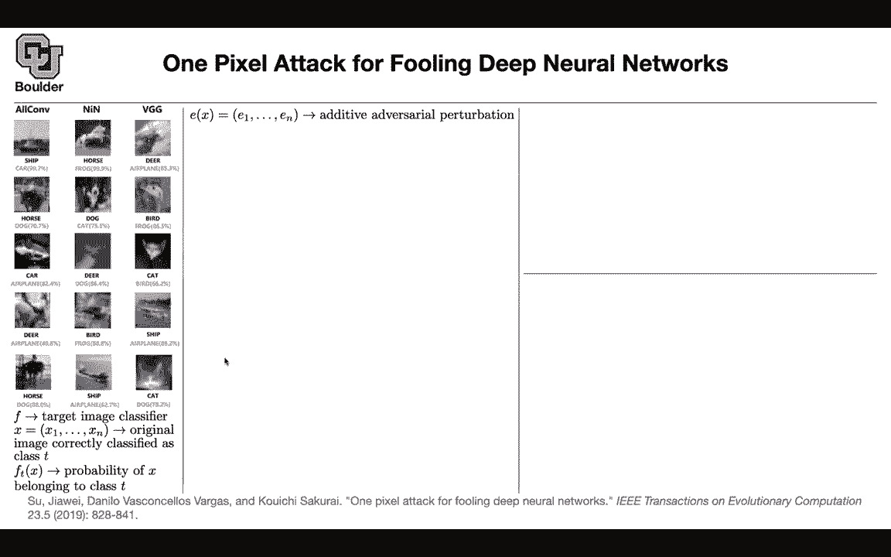
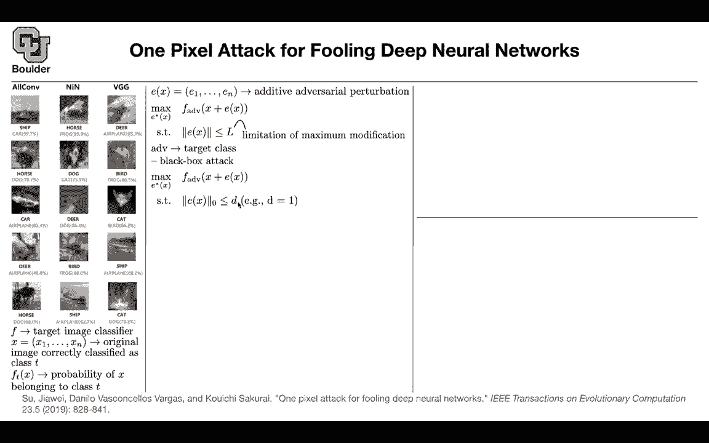

# 【双语字幕+资料下载】科罗拉多 APPLY-DL ｜ 应用深度学习-全知识点覆盖(2021最新·完整版） - P48：L24.2- 单像素攻击 - ShowMeAI - BV1Dg411F71G

So this last paper in this robustasness is actually very interesting。 It takes it the extreme。

 It says that you can actually change one pixel and it's gonna fool your network。

 So it turns out that one pixel is enough。 And let's see a couple of examples。 That's a ship。

 You change this pixel and it's gonna be classified as a car with this confidence That's a horse。

 you change a pixel。 it's gonna become a f。 That's a deer。 you change one pixel。

 it's gonna become an airplane horse， it's gonna become a do。

 and these are the confidence that the network is gonna have。 You can change a ship to an airplane。

 a cat to a dock。 We only changing one pixel。 That's insane。 Yes， so what's the idea behind it。

 And how is it different from the aar Lx that we saw before。 So F is your target classifier。

 I'm going through some notation。 These are the notations of the paper。

 We are gonna need that to understand what's going on。 So you have an original image。

And it's being correctly classified as target as class T so in previous papers I was using T to denote the target here T denotes the actual classified image it's correct class so we have to be careful here a little bit if you look at F of F is going be a vector if you look at the T component it's going to be the probability of that x belonging to that particular class T so F of Tx is going to denote our probability we want to come up with an adversarial example and that's going to be an additive adversarial example because we add that to the original image now what we want to do we pick a target that's going to be for instance an airplane and you can maximize the probability of the perttu image being an airplane so x is there is the perturbation and ADV is our airplane so we want to maximize。

That logic of our network or that probability of a network subject to a constraint。

 We don't want the perturbation to be too big。 So you have a limit and the maximum modification that you can do Otherwise it's gonna be easy to detect now ADV is our target class where we want to attack So a little bit of notation and we have to be careful T is dear ADV is airplane is our target。

 we want our network to make that mistake and we're gonna in this paper look at black box attack and we spend it quite a lot of time discussing what is a blackwa attack and what is a white box attack on the previous table So now we know what we mean by black box attack if you change a norm to be L0 youre basically counting your pixel you're counting the number of pixels that are different the L zero norm is gonna say which one of these is positive which one is zero and we want to have only one change。

So we said D to B1 that's gonna to be only one pixel solving that problem is tough because you are not gonna have gradients to do gradient decent because of the L0 and nor So how are we going to solve it whenever you don't have gradients you can do reinforcement learning or you can do evolutionary algorithms So this paper uses differential evolution and what is that it's a populationbased optimization algorithm and it's used for solving complex complex multimodal optimization problem like what you have here and it's just an evolutionary algorithm I'm going to tell you exactly what the algorithm is going to look like for this particular example So let's see what is the candidate solution This is the space of candidate solutions and what are our options x1 y1 is a pixel maybe x1 is the10 pixel and the X direction and in the y direction is the fit and that's going to be this point and what is the color。

For that particular pixel we are gonna to say it has a red component。

 green component and blue component So this is the space of candidate solutions that we can change。

 we are looking for a change and we are changing one of these you initialize your population you say X I Y I and you sample it in the case of a c4 10 from a uniform distribution from one to 32 because you have 32 pixels。

 32 pixels in the x direction 32 pixels in the y direction for imagine that you have more pixels that you can change and how do you specify red green blue you sample it from normal distribution with this mean and that variance So that's how you initialize your population and that's going to give you parent population and let's say you sample 400 points so your candidate solutions are going to have a size of 400 and the children are also going to be 400 and I guess I'm going to stop here because we are out of time and continue x time for。

of you who have questions， you're more than welcome to stay and ask and for those of you who want to leave it can be。

Thanks for spending the time on that last paper as far as had so many questions。

No， that was great thanks for asking， this is crazy a single pixel。It's crazy。

IHave a good one， yeah， you do。