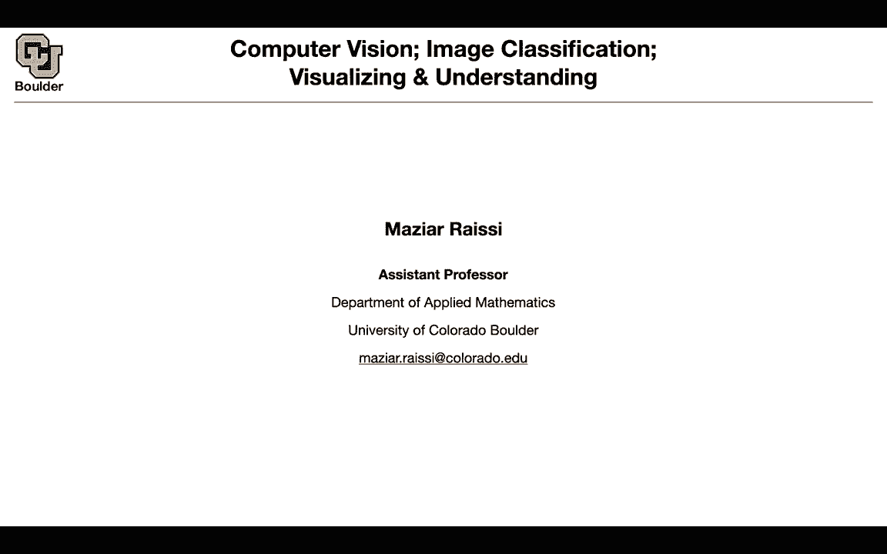

# 【双语字幕+资料下载】科罗拉多 APPLY-DL ｜ 应用深度学习-全知识点覆盖(2021最新·完整版） - P50：L25.2- CNN可视化与理解 - ShowMeAI - BV1Dg411F71G

so what have we done so far let's recap，a little bit。

before i go to the slides we said that，uh，our data is gonna be our source code for，deep learning。

then we came up with models which would，be large network，which has only one objective of，maximizing。

the accuracy or you can design your，network，to have two objectives in mind to be as。

accurate as possible，and at the same time be efficient when，you want to store them when you want to。

put them on smaller devices like drones，etc，your cell phones this was a human。

doing the work coming up with the model，we can actually，automate that using automl so whatever。

that you do，you start with your data then you come，up with a model，then you train the model which is。

basically compiling it，using a stochastic great and decent once。

you do that you're going to end up with，an executable code，that you can use it in production but if。

you want to use that in production，your network has to be robust you don't。

want it to be prone to adversarial，attacks，you want your network to be as robust as。

possible to make as few，mistakes as possible and now it's time，to go back。

if we saw that the network is not robust，if we saw that the network is making，mistakes。

on particular types of images or a，particular type of examples then it's，time to debug。

we have to debug our code and if you，want to debug it，you have to take a look at your data set。

and at the same time take a look at your，network，what's happening inside it so now it's。

time to open the black box，and try to understand what the network，is doing。

what is it looking at and how is it，making decisions，so that's why it's important to be able。

to visualize，and understand what a network is doing，so yes，these are really important topics it's。

time to debug，and we're gonna cover a couple of papers，it's a huge literature i'm not gonna。

have time，you're not gonna have time to study all，of them but some of you are gonna be。

really interested and are going to，become expert in this view let us start，with the first paper。

that try to look at convolutional neural，networks and try to understand and，visualize it。

this paper came right after imagenet，so their architecture is going to be，exactly imageness。

architecture sorry it's going to be，alexnet's architecture，and they're going to make some。

improvements on that architecture，one is that rather than using filter，size of。

11 they're gonna use a filter size of，seven，and rather than having a stride of four。

they're gonna have a stride of two，but how did they come up with these，changes it's not random。

they actually took a look at their，network and their data，to make these two changes and managed to。

improve the results，the accuracy over alexander but how are，we gonna take a look at。

the features in your network forget，about this part，for now let's take a look at the upside。

this part should be easy for you there，is a layer，below your food maps actually it's。

layered below pools maps these are，there was a pulled operation and it's。

giving you a bunch of features，now in this layer you're gonna do a，convolution。

it's gonna give you a bunch of feature，maps you take those feature maps。

you apply relu on it your activation，function，you're gonna end up with some rectified，feature maps。

then you're going to do a max pooling，it's going to give you your pool。

maps that you're going to take to the，next layer so it's，as if you can keep continue。

keep continuing this figure so it's，going to have a very similar structure，from that point on。

and below it it has a very similar，structure so this is what we are doing。

all the time in alexnet we actually，quickly look at the weights。

and actually our filters and we plotted，them，now we want to actually take a look at。

the feature maps because of these pooled，operations，they're going to have a lower resolution。

that's one observation，but they're going to have a structure，similar to an image they're going to。

have some resolution，a height and a width and it's going to，have a couple of channels we are going。

to pick one of those channels，channel，could be the most active channel you can，take a look at the。

sum of the activations and that's going，to give you the most，active channel you have c channels you。

can pick the most active one，and try to visualize that so how are we，going to do that。

there is a pulled operation here cooling，operation with some stride。

and let's say your stride is two and now，it's time to take a look at this figure，down here。

so this is exactly when you're doing max，pooling and this is when we are doing，max pulling here。

we are doing max pooling with a straight，up two so we take windows of size two by。

two and then let's try it，to the next one so we are sliding a。

window of two by two with a strider two，in this blue region the maximum。

activation is here when you do pulling，that's gonna go here，this is the maximum one you're gonna。

pull it you're gonna put it here etc，but when you do that you also store，these locations。

of the maximums and that's actually，these maximums，for instance in the red region this was。

the maximum value，we are going to store the index in the，green region。

this is where the index of the maximum，was so we're going to store that。

etc so these are going to be called our，switches，now we go back here these are our。

switches from layer above，there is some reconstruction coming in，and we want to do a max。

unpooling operation here because these，feature maps have a lower resolution。

and we want to increase the resolution，go to the image，and then plot that activation in the。

image space we want to uncool，when you want to unpool from the layer，above these were the。

values you copy those values and paste，them in the correct location。

according to your switches so the，switches are going to give you the，locations。

and this is how you are going to do max，pooling the rest of it is zero then，you're going to do a。

rectified linear activation on that，then the rest of it is just another。

convolution but there is no training，going on here，you take the filter from your。

convolution and you transpose it，and that's gonna give you a，deconvolution in the end you're gonna。

get a reconstruction and you keep，repeating that，until you reach the space of your input，image so。

no training is gonna go on these values，you're gonna know，and you're able to increase the，one。

in your deconvolution become left layer，is the goal on the left hand side，network。

like take an output classification and，back propagate it，or um like feed it back through the。

network to figure out what kind of image，induced that class uh you're right so。

it's going to be a backward，it's exactly in your computational graph。

when you have a convolution you're doing，a forward operation，so back propagation you're going to end。

up with，f transpose okay so convolving with f，transpose is the inverse of the forward，convolution。

function，on the backwards side are we doing like，an inverse，inverse rectified function and the。

positive，when you come here you want your values，to be positive got it。

and then last question in general do we，store these max locations。

anyway or is this just specific to this，paper where you're trying to visualize，the the activation。

do you don't you need the max locations，when you're doing，back propagation through max pooling。

when you're doing the um，the gradients don't they depend on the。

location of where the maximum occurred，yes okay thank you any other questions。

yeah i had a question um i'm sorry if i，missed this but i'm trying to follow。

this figure on the bottom，and why do the the bars switch like why，is the yellow and green have dark。

there，this is coming from the layer above so，it's a reconstruction from the lighter。

above it's similar to here，nets，you're going to end up with a bunch of。

reconstructions that are gonna go to the，next layer，which is a similar pattern to here so。

that's a great observation and they have，different values，so it's not these values it's some other。

different values done coming from，the convolution from layer above okay so。

it's showing that it's like an，approximation that you're not going to，recover it exactly。

no you're not done these switches are，the only thing that you're going to。

copy and paste from the forward pass to，the backward pass，in addition to your convolution filter。

because you need to transpose it，so the idea of the network was this the，back propagation。

is gonna be uh corresponding，to a deconvolution so it's the inverse，of your forward pass。

it's going to give you the backward pass，but then the problem was the resolution。

and the resolution you're going to，handle it，by memorizing where these maximum。

happens any other questions，and this convolutional filtering is just，flipping each。

filter vertically and horizontally，that's what these operations，we are gonna learn more about the。

convolutions later on，but for now this should be good enough，that it's a transpose。

and the problem is always this case that，you start with a high resolution image。

and you keep shrinking the resolution，you make it smaller and smaller。

now you have to recover it back which，you can do using，pulling。

using these switches so what do you get，why did the paper decide to。

modify alexnet and make the following，two modifications make this try two。

and make a filter size seven rather than，eleven so what you are seeing here。

is a visualization of the first feature，snaps，it looks a little bit blurry because。

there is probably one feature，that is dominating the values so the，rest of them are。

looking smaller compared to that value，the other observation is that you have a，lot of dead。

feature maps so these are all dead，feature maps so that was one observation。

in the first layer if you plot the，feature，maps of the second layer you again see a，lot of。

dead features like here and you don't，see much pattern，but now compare this to when you are，using。

stride of two and a stride and a filter，size of seven，those dead feature maps are gone so you。

don't see many dead feature maps，all of them are colorful it means that，there is no single。

feature map that's dominating that's for，the first layer，and for the second layer the features of。

the second layer，you start to see more pattern and you，don't have that。

dead features anymore so what is the，idea visualizing your feature maps。

is gonna help you modify your network，and that's exactly what this paper did。

the rest of the paper is exactly the，rest of the architecture in this paper。

is exactly alex that except for the，first layer，smaller stride and filter size of seven。

and we know that after this paper，most of the networks are sticking to a。

stride of two and seven by seven for the。

first layer，we saw that when we were covering large，networks，in this class and the next one is very。

interesting so far we were looking at，the architecture，you can actually take a look at your。

data but before we do that，let's take a look at a visualization，of layer five of our network this is。

layer five，this is the strongest feature map which，is basically you're summing。

the activations of all of your neurons，the activations，of all of your pixels these are going to。

give you，c numbers c is a number of channels and，you pick the maximum of that。

that's going to be your strongest，feature map，and we are at layer 5 and because we are。

at layer 5 we are going to be able to，see more，patterns about the class in。

in layers 1 up until 2 3 or 5 you are，seeing，general patterns there is an edge there，is a color。

but as you go deeper you're gonna start，seeing，patterns that correspond to your label，this box here。

is corresponding to this image and we，see that the network，or the strongest feature map is focusing。

on the face of，that dock these other visualizations are，for other plots。

of similar images of similar docs so，it's not for this image，this box here corresponds to this image。

but the rest of it doesn't，the strongest feature map is，focusing on a letter and a number。

when it comes to this car the strongest，feature map，in layer 5 is focusing on the face of。

the woman here and these are，visualizations of other，cases other examples but what is nice。

about this paper，is that you can actually take a look at，your input image you can，of your。

image so we are hiding some parts of the，image and we are gonna take that box。

and slide it over the image to specify，to understand what is the most important。

part for that particular image，we know that from the visualization that。

it's probably the face of the dock，but let's see if it's actually the case，as you keep sliding that。

occlusion over your image and you keep，plotting the strongest feature map。

you see that most of the activation are，here and the activation is going to drop。

suddenly if you slide the box over the，face of your dock，if you look at the classifier。

probability for the correct class，as you slide your window over the image，you are。

with 90 percent accuracy，classifying that dog correctly but as，soon as that box。

goes over the face of the dog it's gonna，get classified incorrectly。

the probability of the correct class，drops and if you look at the most，probable class。

as you keep sliding that box over your，window，it's going to become classified as the，dock。

if you're sliding any place other than，the face of the dot，but then as soon as you occlude that。

it's going to get classified，as a tennis ball or a fakenz etc。

a similar exercise is happening here and，this is an anomaly because。

the network is focusing on the face but，uh，probably the most important feature，should have been the。

face of the dog any questions i think，i'm finishing right on time。

so for all of these um like looking at，the top row with the pomeranian。

e b is showing the amount of activation，for the entire like sum of the channel，or i guess the。

the feature channel yes c，c is showing you exactly what the sh。

what the filter looks like or rather the，pixels in the original image which are，then。

corresponding to the activation of the，of the filter，uh so this visualization is coming from。

the decal，net is it is it a picture of the filter，or the feature in layer 5 or is it a。

like i don't understand what the map，projections means is it，is it a subset of the original image。

which is then，generating the activation or is it the，filter itself。

in layer five and let's see what happens，we take the image of the dog。

we push it through the convolutions in a，forward，fashion up until layer five so now we，are at layer。

5 and while we are doing it we are，storing the switches，now at layer 5 we take the strongest。

feature map，which is going to be only a matrix it's，not going to be a tensor。

and it's a it's a matrix whose um，total sum of all the entries is the，largest。

yes like largest for benious norm or，something like that or，l1 so each pixel is going to give you an。

activation，activated value and because you're after，the rectifier。

most of all of them are positive you can，just take a look at the sum of those，values。

and that's a measure to compare how，strong that feature is，so it's the feature that's the feature。

whose total sum is the biggest that's，the most activated one，yes so that's the front feature map you。

take that，it's a matrix where it's a tensor of uh，dimension one at the end you store the，switches。

and then you keep max pulling you，increase the resolution from one layer，to the next one。

and you use your transpose of the，convolutions and then in the end you're，gonna end up with an image。

ah so you take you take that that small，dimensional filter and then back，propagate it and。

unpool and on convolve and you end up，with something of the same dimension。

that you started with and then you can，visualize it，and，see where the network is looking at it's。

looking at the face of the dock，got it okay and just so b and d，aren't really showing um features。

themselves，showing like a distribution of where the，location of the filter would be most。

important within the original image，yes so b d and e，are ways for the paper to validate its，results。

the result is that the face of the dog，is the most important，part of the image according to the。

network and then how we're going to，validate it you can actually，have a box slide it over the。

original image take a look at the，feature now yeah this is cool。

and you see the face of the dog is the，most important one also so you are，looking for the same。

uh conclusion using two different，methods yeah，um in that top image um where it's like。

the smaller stride，the，first layers features if you were using。

a like what what is a versus b versus c，versus d，in the in the top right so in a these，are the top。

activated ones or a sub sample of the，most activated，ones because you cannot plot all of them。

in one single plot，and that's the first layer or the the，first layer after the input。

eventually there are 96 of them but，i don't know how many one two three four，five six。

seven eight nine nine times uh it might，be all of them，probably it's all of them yeah so there。

are 96 of them and you're plotting them，and you see that some of them are dying。

and it's exactly the way that you，plotted this so the same method。

you're using it to plot those those，features okay for the first layer。

you do the same thing for the next layer，whether，these are 256 features but you do the，same thing。

for the second layer and you visualize，them this is for alex snaps but then。

there were some observations that you，have that features，that feature maps and some values are。

dominating，your features same thing here there are，some dead features。

and then the paper said the reason is，because your，filter size is too big and you're。

striding too big，it's killing it's a lot of information，is destroyed。

in the first layer don't do that reduce，the stride and reduce your filter size。

cool and you end up with nicer features，are，a and b showing the same thing but b is，with a，different。

network a is alex net c is alex，b and d are the modified alex。

and are c and d still the first layer or，is that a deeper layer because those。

those features themselves look higher，dimensional or more complex。

yeah this is the second layer perfect，okay the first layer，secondly yeah do you know is this the。

first paper to，because this is showing the idea that，there's like a hierarchy of features。

right you go from like basic edges to，faces，this is the first paper to really show。

that no actually alex neves showed that，and probably before that the paper by。

jan lacon but they visualized the，the weights these people are visualizing。

the actual features these are not your，filters these are your features。

but they came to the same conclusion，that the，first few layers are focusing on more，generic。

properties of the image and as you go，deeper，it's going to focus on more。

discriminative features like，and is the difference the difference。

you're making between visualizing the，weights and visualizing the features。

when you're visualizing what the weights，you would be looking at like one of the，dimensions，this。

back propagation type projection where，you're doing the unpooling and the。

unrectifying and the unconvolutioning，uh and then you end up back in an image。

of the original dimension is that the，distinction you're making between，features and。

weights yes so what is the distinction，between features and weights。

weights are these windows that you keep，sliding over your，image they have a size of seven by seven。

by three by ninety six，but what is the size of your features，they're gonna be。

uh i think after this layer you're gonna，end up with，110 yes it's 110 by 110 by 96。

one of them is four four-dimensional，tensor this is a three-dimensional，tensor。

yeah so that's the distinction between a，weight and a feature，feature map feature is like a property。

of the original image，that causes activation of the certain，weights with a certain filter。

actually the output of any layer，is going to give you a feature map but，the internal。

operations of the layer is going to give，you the weights，got it future amounts is the output of。

