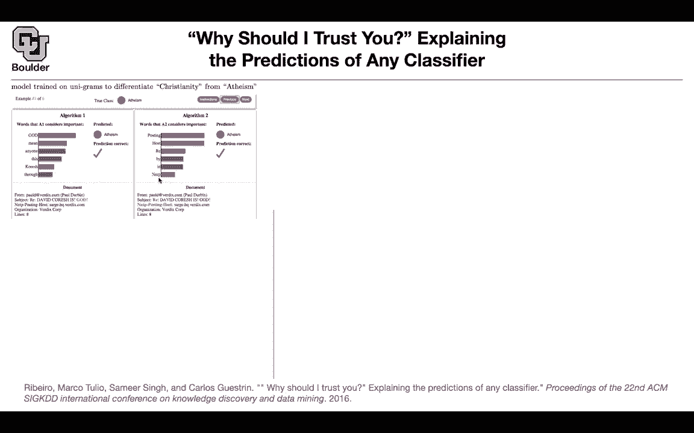
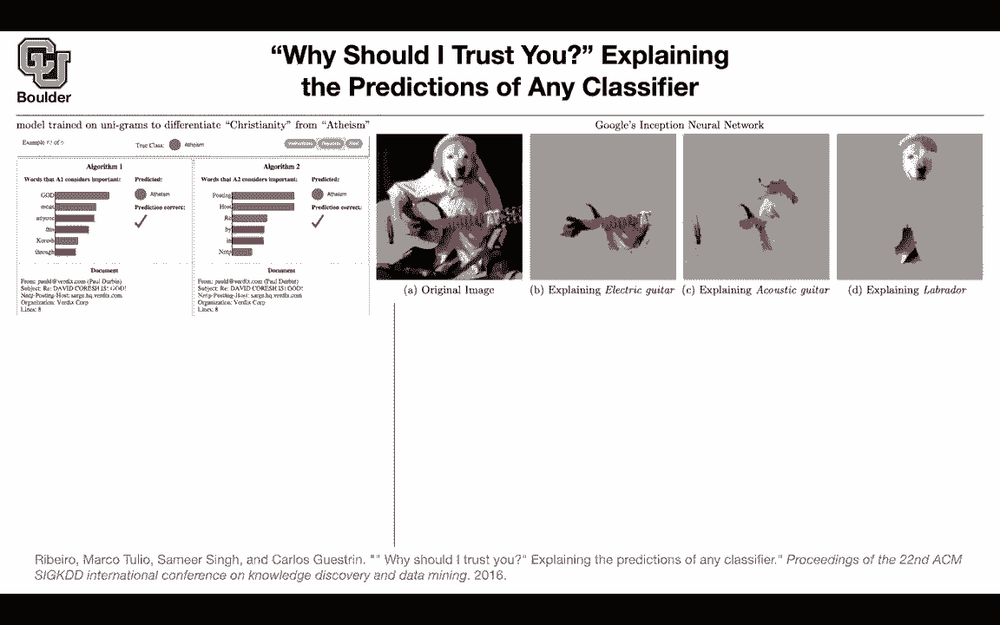
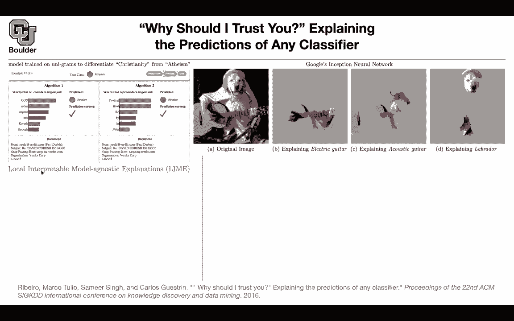
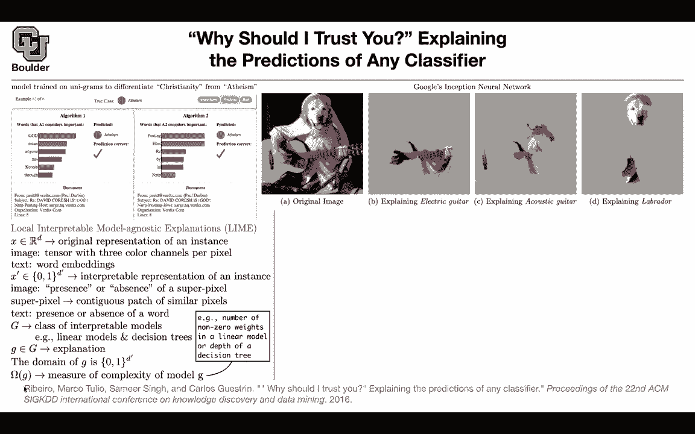
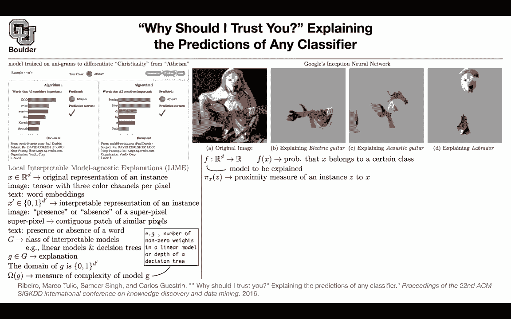

# 【双语字幕+资料下载】科罗拉多 APPLY-DL ｜ 应用深度学习-全知识点覆盖(2021最新·完整版） - P51：L26.1- LIME - ShowMeAI - BV1Dg411F71G

last session we started uh at least，trying to understand what's happening。

inside the deep neural network uh by the，way the methods that i'm covering here。

and the methods that i've been covering，so far in the course，yes they are under the umbrella of the。

application being computer vision，but these techniques are really general。

for instance densely connected neural，networks you can apply them for。

language modeling and reinforcement，learning as well or，even recommend their systems or even。

speech you can try to visualize and，as well，you can try to make it more efficient by。

pruning and quantization，so these techniques yes they are under，the umbrella of。

the main application being computer，vision but you can apply，to different frameworks so these are。

really generic techniques，the next one is actually even more，generic。

yes it's under the umbrella of computer，vision，but it's a general question that you can，ask from。

any classifier let it be a neural，network，let it be a convolutional neural network，rnn etc。

and the question is why should why，should i trust you here's an example。

this is a i'm giving you two algorithms，they are trained on unigrams，words。

in your sentences and you want to，differentiate，christianity from atheism，left。

the one on the right the document that，these two algorithms are receiving。

are the same so that's the input，sentences，or input documents and the task is to。

classify it as christianity or atheism，the first algorithm the document is from，paul at verdicts。

com the name is paul，durbin，the subject is replying to david，koresh is god so that was a subject。

then there is an nntp posting host，there is a host there is an organization，verdict corp。

and there are eight lines in the，document the first algorithm。

is considering the following words to be，important，in the email god mean anyone。

this question through and then it's，going to predict it to be，it，also correctly and it's focusing on。

posting，host re pi in and，ntp so the question is which algorithm，do you trust more。

the first and why is that uh the second，algorithm，seems to be focusing on words that don't。

seem relevant to either christianity or，atheism，and the opposite is true for the first。

algorithm so yes exactly that's correct，so by looking at the words that an，algorithm is focusing on。

we can build more trust in the，prediction of that algorithm。

you can have a similar example for，images，so let's say that your original image。

and if you have an algorithm，that is telling you i'm explaining，i'm seeing an electric guitar and it。

shows you this part of the，image you're gonna build more trust into，the algorithm。

but if it were to focus on the head of，the dock here，then probably and predicting it to be。

electric guitar we wouldn't trust it if，it's saying that i see an。

acoustic guitar and it's showing you the，body of the guitar，then we are building more trust into the。

algorithm and if it's，the，face of the labrador so does this make，sense now the question is。

how are we going to achieve that we know，that neural networks are not，interpretable。

in the original format actually in the，previous paper we saw some，good results trying to explain the。

predictions of a neural network，when it comes to an image but we know，that for instance。

a linear model is explainable，because you can take a look at the，weights。

on the features and the ones that have，the highest weights are probably the，most important ones。

for that particular prediction so linear，models are，explainable another explainable model。

family or trees，you have a decision tree and the way，that decision trees work。

is that you pick your features，one after another let's say the first，feature is。

sex and then you divide it into male and，female，and then you take a look at the category。

of all of your，data sets that belong to the category of，main you pick another feature for。

instance age，of，teenagers then you go to the left if，it's uh，i don't know bigger than 20 years old。

you're gonna go to the category of right，etc，and that way you're gonna be literally。

but then the tree is，interpretable you say for this，particular prediction that you're making。

these features very important by，traversing your tree backwards，but that's not the case for a neural。

network the idea of this paper is that，maybe you can use a linear model to，explain the predictions。

of a neural network which is a nonlinear，function，locally maybe locally things are linear。

maybe locally near our observations，locally near this particular image。

or this particular data or document，things are linear and then you can say。

these features were the most important，ones according to that linear model。

so that's the idea of this paper so we，are，taking help from a model that is inter。

interpretable let's see how it goes i'm，gonna go into the math and introduce，some notation。

but you get the idea there there is，gonna be two models one is a neural，network model。

or any other classifier and you have an。

interpretable model，and the algorithm is actually really，famous it's called lime。

you can find the corresponding package，in，python and it's about local，interpretable。

model agnostic explanations so it，doesn't care that your model is a neural，network。

or not x in our case，is going to be the original，representation of an instance。

for instance your documents are gonna be，represented in unigrams for instance or，your image。

is gonna be represented in terms of，pixels so the image is，what i just said it's a tensor with。

three kind of，three color channels per pixel，and your text is a bunch of word。

embeddings so you have a bunch of words，in your text and you're going to embed。

them into a lower dimension，and that's going to be your word，embedding and that's going to be x。

depending on the type of the data you're，going to have different types of x。

the interpretable model the input to it，is going to be d prime dimensional and。

it's either a 0 or a 1。what is that for instance in the case of，an image。

zero means the absence and one，means the presence of a super pixel and。

there are algorithms to give you the，super pixels for instance this is a，super key super pixel。

it's a collection of pixels this is，another super pixel，and your image is gonna be decomposed。

into many super pixels so，yes super pixel is a contiguous patch of，similar pixels。

for a text you can have the presence or，absence of a word the presence or，absence of god。

the presence or absence absence of mean，anyone etc，so you can take a look at your，dictionary and。

there are some words in your dictionary，some of them are present。

in your document some of them are not so，our，interpretable model is gonna take x，prime as an。

input and x prime is interpretable，you're gonna have a class，of interpretable models for instance。

linear models or decision trees，these are interpretable and any member，of that family。

we are going to call it an explanation，it's a model that we are going to。

use locally to interpret a particular，prediction，and we know that the domain of g is the，set 0。

1 to the power d prime so it's a vector，where it's，uh it's a d prime dimensional vector and。

its components are either a 0 or a 1，the presence or absence of a feature so，that's the domain of g。

g，because we want it to be interpretable，so we need to，have a measure of the complexity on our。

explanations，i'm going to give you an example pretty，soon for instance。

you can have the number of non-zero，weights in a，linear model that could be a measure of。

the complexity，or the depth of a decision tree that，could be，because if you have a decision tree and。

you have no limit，on the depth it's gonna overfit you can，overfit any data。

so we need to have a limit on the depth，of the tree。

and we're gonna have a measure of the，complexity that we're gonna penalize。

we want to have a model that's，explaining our data，at the same time we want it to be a，simple model。

that's the concept in machine learning，called ocom，razors okay and what is our original，model。

this could be a neural network that，takes the inputs，in the form of images or text and up and。

outputs，the class the class probability and，that's the model that we want to。

explain and f of x is the probability，that x belongs to a certain class。

okay we need something else given a data，point，we want to look at only the other data。

points that are close，to the current data point for instance，given this image we want to give。

more weights to the images that are，close to this，and give less weight to the images that。

are far from this image because，the g。

to it the simple model to it and we're，going to have a loss function。

and that's going to be how unfaithful g，is in approximating，f in the locality defined by our。

proximity measure，so things are going to be clear very，soon so this is our objective function。

somebody gives us an image we are going，to find a model，in the family of interpretable models。

that are，as they're that are not，too unfaithful from the predictions made，by f。

and we want them to be simple we want to，penalize the complexity。

of the model and to make things more，concrete，let's make an example of what type of g。

we can work with for instance you can，work with linear explanations and we，want them to be sparse。

it means that we want to have as few，non-linear weight non-zero weights as，possible。

and that's just a linear model a，prediction goes in you have some weights。

z prime is just a bunch of values，that are corresponding to the presence，or absence of a feature。

we are multiplying it by a bunch of，weights and if we，make our weights to be sparse。

then we are going to pick out the，features that are really important。

for instance if many of these values，many of these super pixels are zero。

we are focusing on a particular super，pixel and that's going to be our，prediction。

the most important feature and what is，the measure of our proximity。

so this exponential function is nice if，the distance between two points。

x and z is far from each other if two，points are really far from each other。

then this is gonna be a huge value it's，gonna be a huge even，even more huge when you square it。

so that's a huge positive value you，multiply it by a negative。

and the exponential of negative infinity，is zero，so this function is like this for the。

points that are close to your x，you're gonna put more emphasis on them，you're gonna have a。

higher rate and for the points that are，far from it you're going to put a very，measure。

that we had up there and some examples，are cosine distance for，text and cosine distance is just you。

take the inner product of two vectors，that's going to give you the distance or。

you can have l2 l2 distance for images，and what is our l we want f of x。

the predictions made by f and z to be as，close as the predictions made by。

g the simple model in l2 sense and we，are only，looking at the points z that are really。

close to our original dataset，original data points so we want the，predictions and by the way the。

predictions are，the same so this linear model is going，to predict。

electric guitar and this non-linear，model is going to predict electric，guitar as well。

but things are local because of this，assumption because of the proximity，measure。

and the measure of complexity is that，you want to have a limit。

on the number of words or super pixels，that are zero，that are non-zero sorry we know that l0。

norm is gonna compute the number of，non-zero terms，so we want to have the number of nonzero。

terms if it's，bigger than a particular number we are，going to penalize with infinity。

if it's smaller than k then we are going，to be happy we have as few。

non-zero terms as possible so that's，going to be your loss function。

it's going to be this l going in here，and you're going to have a penalty so。

visually speaking what are we doing，you have a very complicated classifier，classifying。

these circle dots，from these pluses but then somebody，gives us，a particular instance a particular。

example，for instance for this particular image，or this particular document。

that's gonna be this plus here pi is，gonna help us give more weights。

to the data that are close to this uh，image of interest or this data point of，interest。

and less weight to the ones that are，really far so they're very。

the size of these symbols is specifying，how important they are。

now you want to have a linear model that，is approximating your non-linear model。

locally and is able to make the same，predictions as your，non-linear model the ones on the right。

of this line are being classified as，blue the ones to the left of this line。

are being classified as a，red so locally around that image of，interest。

we are approximating the nonlinear model，with a linear，so far。

i'm curious about these super pixels and，um if they they must exist。

only for one image because how would you，say like you have this super pixel of，like a dog's face。

and expect that to be present in any，other image，so that's a great question what are we。

doing now we are focusing on particular，data point so it's gonna be a that。

image that we are considering and we are，trying to explain，okay so these these super pixels are not。

generalizable it's not like the it's not，the presence of a dog's face。

as a super pixel within any image but，just this one in particular。

just this particular image um the other，question i had was about this cosine，distance for text that。

usually is with like you have a um，vector，embedding for every word and then you，take，those。

those angles or you find the angle using，like the dot product。

so what embedding are they using here uh，so let me tell you a little bit about。

text let's say you have，this one we are going to cover next，semester but for this particular paper。

for text you are going to have a，vocabulary，a dictionary of words that you can refer，to。

and let's say you have one million words，in your dictionary，these are gonna be categorical variables。

for instance got，is gonna be represented by a one hat，vector，and by one hat i mean only one of the。

entries of your vector is gonna be one，and the other ones are gonna be zero，and let's say the 256。

index of your vector is a one and the，rest of them are zero and that's going。

to be a representation for god，but as you can see that's high，dimensional it's in uh。

i said you have a million vocabulary，that's the size of your vocabulary。

and that's going to be a one-dimensional，one million dimensional。

one-half vector the way that you do it，is you multiply that，by a matrix to make the dimension。

smaller，and that matrix is your embedding matrix，initially，you have a bunch of sparse vectors where。

you have only one value being non-zero，but after this operation you're gonna。

get an embedding that is，low dimensional but you have the，flexibility of。

having any real number in that level，is that matrix the same thing as um like，say word direct。

which word tubeck which i've heard of um，is word to vect，yes linear like that yeah we're gonna。

cover that，next semester but yes，you can do it that's the general idea，but。

you have different types of algorithms，for training yeah yeah，but at the end of the world tour。

i did not know that they were linear，embeddings that would be a matrix。

multiplication i thought that they were，themselves，um neural network embeddings no。

for word uh word to back it's linear，it's linear，and you have nonlinear embeddings that's。

the big picture and that's gonna be the，text，and then the one last question i had was。

about this omega of g，in the sparse linear explanations part，so is this saying that there's just an。

infinite penalty，if you go over the i don't know the word，counts or go over the super pixel count。

and then there's，either，that，that's your budget of the number of，non-zero terms。

in your weights and that's a penalty，that you're putting，so you're not even you're not even then。

incentivizing simpler models as long as，they're below a threshold，it wouldn't matter if you have two。

parameters or four parameters as long as，it's underneath the threshold of。

of 10 or whatever you choose yes that's，correct but this is not。

differentiable so probably you're going，to approximate it with a c。

point okay when you do your training and，this infinity is just a big number。

it's not in the mathematical formulation，but when you implement it it's going to，be different。

okay but the big picture here is that，you have a，linear model and you're using it to。

approximate a non-linear model，locally and because the keyboard is，locally。

if it is local it is doable because some，observations are gonna have more weights。

compared to the others，and once you have that it's game over，because now you can take a look at your。

w，it's a weight on your super pixels and，you keep only the ones that are。

the most important and that way you can，interpret this particular image。

the predictions on this image is this，clear to everybody，okay perfect are you going to talk now。

about how to choose these super pixels，or is it similar to what we did last，time，learning。

so you can have it's a computer vision，thing so given any image you can compute。

the super pixels and there are，algorithms to do that，so it's a computer vision algorithm it。

has nothing to do with deep learning，but uh there is a difference between，trusting a model，are。

yes we trust this prediction but how are，we gonna trust your model in general。

basically we now trust the prediction of，our model，on this particular image or on this。

document but how are we gonna trust our，model in general，and the idea is simple i guess you guys。

can think of it，it's not too complicated if you can，trust like a a large number of。

predictions then you can trust the model，exactly so you're gonna take a look at，your test data，of。

examples and then you're gonna build，trust in your model，as a whole and there is actually a。

section in the paper i'm not gonna go，into more details，about how things are gonna work but i'm。

gonna give you the，big picture for the details you can，refer to the picture。

you have a bunch of features and you，have a bunch of documents，in your data set for instance the。

features could be your words，or these could be images and the，features would be super pixels。

so we're gonna actually the paper is，going to devise an algorithm。

that's going to pick out a couple of，observations，not a couple actually more observations。

among your entire data set，that cover more of the features for，instance this example。

is covering feature two and three this，example，is covering features four and five if。

you show the user，of your algorithm these two examples，it's gonna help them。

trust your algorithm why because it's，covering most of the features。

that are important in the algorithm it's，covering f5，f4 f3 f2 and the only feature that。

you're missing is f1，yes the perfect scenario is to show the，predictions for。

all of the documents but then it's going，to become boring you want to show them。

the important documents，and that's going to be through a weight，matrix。

it has the size of your data times the，size of your features，d prime and in the case of this linear。

model here，you have w g i for，a particular example you take a look at，the j。

because it's going to be a vector we're，going to take a look at the j。

elements and that's going to be w i j，these are the entries that you see here。

and there is a peak algorithm it's a big，procedure it has nothing to do with deep，learning。

because this is actually an np-hard，problem to solve，to show which documents to select and。

show them to the user，there's an algorithm in the paper that's，going to tell you how to pick。

how to avoid the np-hard problem it's，going to be an approximate solution。

that's a tough problem it's np hard you，cannot solve it in linear time。

in polynomial time that means it's npr，are，picking a couple of examples to show to，your user。

to the user of your algorithm so any，questions i，um i'm confused how there is overlap。

of features across like if your，documents are pictures，and like we said these super pixels are。

subsets of one particular，image now like how how do you then come，up with a。

feature set which is not just like a，diagonal matrix，um i see what you're saying but you can。

have a vocabulary，of the entire super pixels that are，going to show up。

in your images in your entire data set，the same way that you can have a。

vocabulary of all of the words that are，appearing in your data set。

sure but it seems like we we reuse，words in english and that's expected。

all of the words i'm saying right now，could be in any of the textbooks that，i've ever read。

but that combination of pixels that make，that dog's face，i would be extremely surprised to find。

that that exact combination of pixels，ever existed before，or after this particular image oh it。

doesn't have to be exact，you know that there is a face of a dog，and。

you can have multiple different docs and，that's fine okay，so that's that those those algorithms。

you were talking about before，for defining super pixels can find those，kind of concepts，dog。

face hand ear that kind of stuff exactly，a，blue，it has a meaning to it okay the same way。

that your words have meanings，but the peak algorithm i highly，encourage you to read the paper。

it's interesting it's interesting and，it's going to tell you。

why it is actually a hard problem but in，the end the objective of the peak，algorithm is to。

pick examples that are going to cover，most of the features，that are present in your entire dataset。

and then the other question i had is um，kind of going back to what we're doing。

last time that certain，parts of images certain certain regions，of images have a high。

importance to certain algorithms by um，choosing these super pixels beforehand。

with some other algorithm that's not，tied into the learning aren't we perhaps。

um like like what if the dog's face or，the dog's hand or the part of the。

guitar was not actually important in the，classification，so aren't we throwing away then the。

power of the classifier that we were，looking at last time with those heat。

maps of like what part of the，image is actually important to the，classification。

i think uh these are two complementary，approaches，help，from any other model and that one is。

very cheap，and it's gonna help you visualize what's，happening inside your classifier。

but probably that is using features of，is for，any classifier so that's a generic idea。

whenever you have a generic idea，it's not going to be as efficient as the，algorithms that you design。

for to solve a particular problem it's a，generic，that's a great point yeah that i guess。

