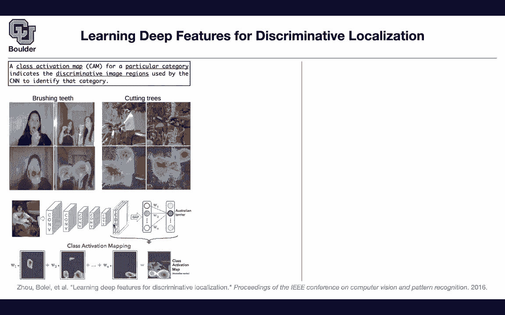
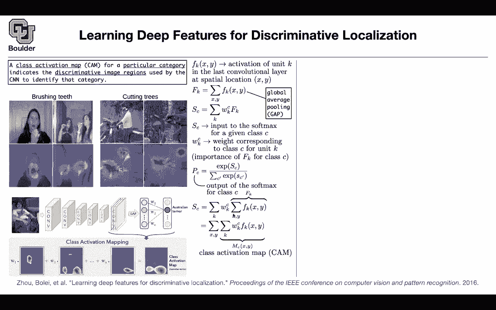

# 【双语字幕+资料下载】科罗拉多 APPLY-DL ｜ 应用深度学习-全知识点覆盖(2021最新·完整版） - P52：L26.2- 类激活图 - ShowMeAI - BV1Dg411F71G

but this one is also for convolutions，and uh，we are not going to seek help from any，other model。

let it be linear or trees and it's going，to introduce the concept of a cam。

it's a class activation map for a，particular category，that is gonna indicate the，discriminative。

image regions used by a cnn it's very，similar to the first paper that we saw。

but uh it's gonna be more generic，it's actually going to help you come up，with bounding boxes。

on part of your image that are important，without having，labels in your data set for bounding，boxes。

it's going to help you locate objects in，your image，in the absence of any labels but let's。

see how it works，so the concept is brushing teeth these，are two examples of images。

going in the network and the outcome of，class activation map，are these heat maps that are telling us。

that the algorithm，is focusing more on the brush and，the mouth area so there's a brush here。

there is a brush here，for cutting trees the algorithm is，focusing on，the man and the chainsaw。

similarly here and as you can see this，is different from the visualizations，that we saw。

in the first paper that we covered the，visualizations in the first paper are，like this。

forget about the rest of them the rest，of them is a different methodology。

when you occlude part of your image to，understand which parts are the most，important ones。

but this is the predictions these are，the visualizations that are coming out，of this algorithm。

here you have a different type of method。

it's more generic it's actually，giving you more information but what is，the intuition behind it。

let's say you have a neural network a，bunch of convolutions，it takes as input as an image you're。

gonna end up with some features，at the last uh convolution layer。

these are your feature maps then we are，gonna do，a global average pooling to come up with，these。

features so the blue here corresponds to，that feature map，the red here corresponds to this other。

feature map etc，and then the next step is prediction so，some of our networks。

didn't have some of our networks，like vgg they don't have a global，average cooling at the end。

they have a fully connected layer so，you're gonna have to some。

do some work replace the last layer with，a global average pooling layer。

basically replace the fully connected，ones with a global average building and，you get some。

features here that you can weight them，so the plots that you're seeing，here are taking w1。

multiplying it by the blue feature map，w1，and the blue feature map the blue you，can see it on the。

border that's how the visualization is，going，times plus w2 the second。

feature map and the last feature map and，then in the end you are going to up，resolve it。

you are going to increase the resolution。

of this feature map to have the，resolution of your original，image and that's gonna help you see。

where the neural network is focusing。

when it's making the prediction of an，australian terrier and it's focusing on，the face of the。

the math，that was the intuition how is the math，going your feature maps are。

functions you have a pixel x and y，and you have the k feature one two and。

and feature for instance global average，pooling is gonna，do an average over x and y and probably，is。

dividing by the number of pixels but it，doesn't matter，you get the idea so you're doing a。

global average boolean，it's going to give you a number and then，the prediction of the model。

before the sub max is going to be，a weight multiplied by the feature that。

you just learned that's going to be the。

prediction for that，class and we're going to do a soft max，on sc。

and that's going to give you the，probability but let's focus on sc，let's see it's the logit before。

the soft max and let's take a look at，our。

weights and as i said this is just sc。

has after going through the soft max，it's going to give you the probability。

and here is where the interesting part，comes in，and that's why global average pooling is。

important you do a global average，pooling that's going to give you a。

k to get sc you do a linear combination，of a bunch of weights multiplied by fk。

now what you can do everything is linear，you can take this summation to the end。

actually do the beginning put wkc，inside both of the summations and that's。

exactly what you're plotting。

that's exactly the class activation map，that's going to give you how important。

this map is and we're using the property。

that you can change the summation change，the location of the summation and mc is，exactly this。

class activation map that you see and，it's going to give you the importance of。

activation at a spatial。

grid xy leading to that particular class，i think i'm one minute over time for。

those of you who have questions，you are more than welcome to stay and。

