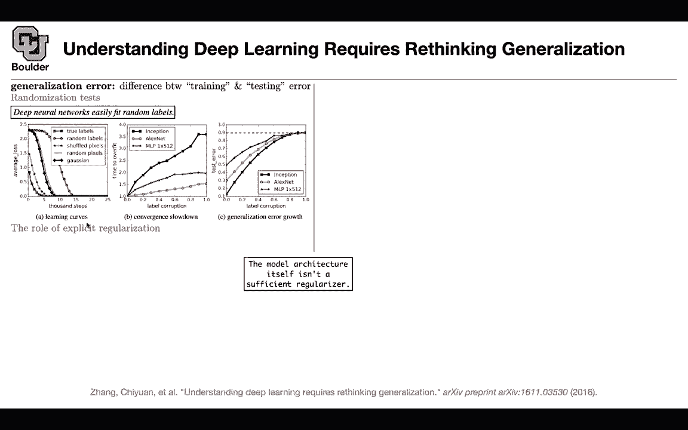
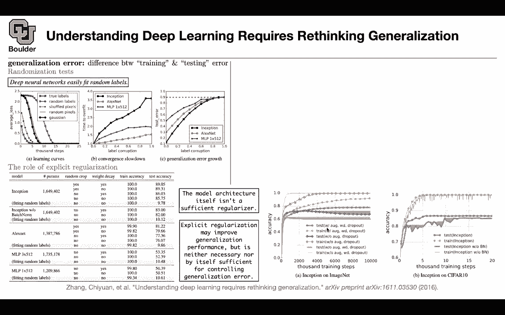
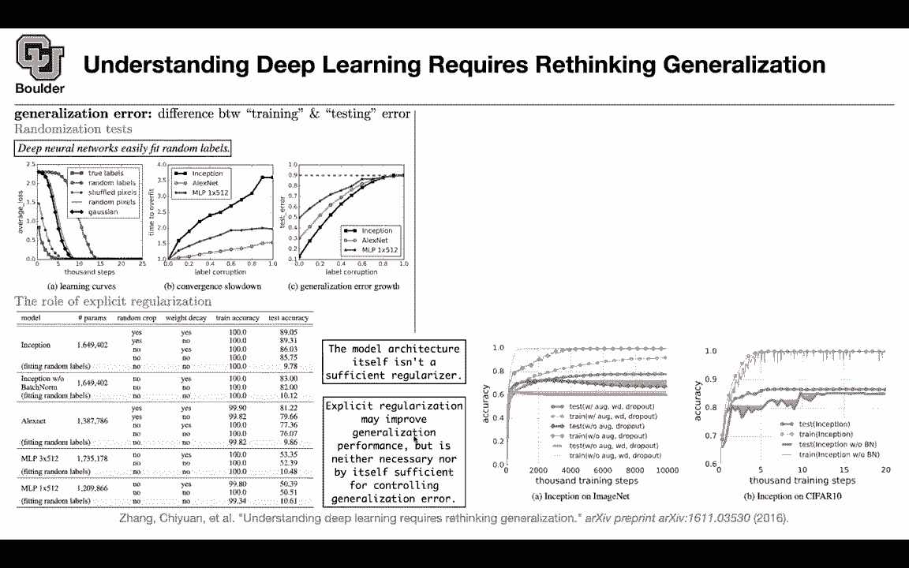
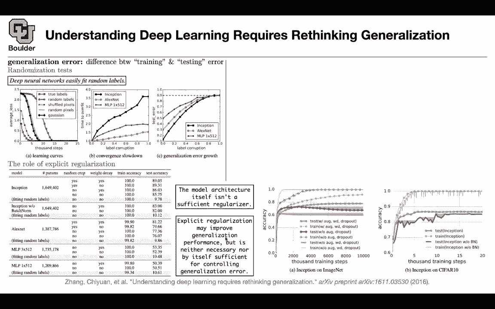
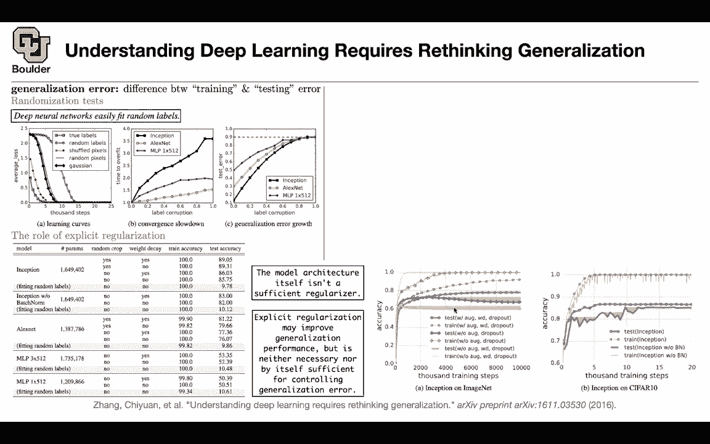
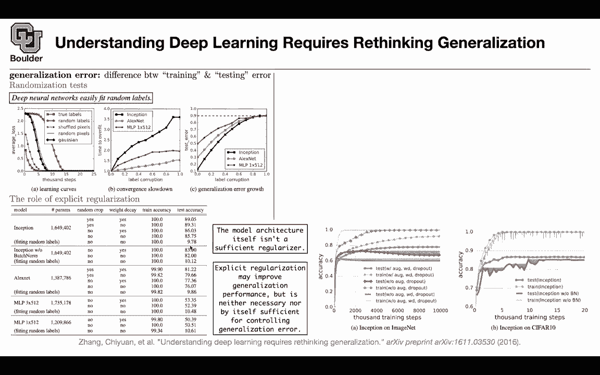

# 【双语字幕+资料下载】科罗拉多 APPLY-DL ｜ 应用深度学习-全知识点覆盖(2021最新·完整版） - P54：L27.2- 有限样本表示性 - ShowMeAI - BV1Dg411F71G

so so far we're trying to visualize the，predictions。

of a network now let's try to understand，it first of all what does the title of，the paper means。

understanding deep learning requires，rethinking。

generalization what is generalization，error。

so you train your network on your，training data set，you're gonna make some error there but。

you don't care about your training data，you want to use your algorithm in，production。

and you want to test it first on your，test data。

and there is usually a discrepancy，between the amount of error，that you are making on your training。

data and the amount of error you are，making on your testing data。

and that difference is the，generalization error so that's the。

definition so there is this question，of why neural networks generalize。

you have a lot of parameters in your，network you are trending it on your。

data on trending data why isn't it，overfitting。

what what's the reason that they，generalize，to your test data so that's still an，open question。

and this paper tries to answer that a，little bit。

or it's at least moving in the direction，of answering it or maybe opening up。

room for some new questions so you can，start with the randomization test。

and the observation is that deep neural，networks。

can easily fit random labels，so they are powerful enough to overfit。

even to random labels，so let's take your imagenet each image，has a label。

now let's replace those labels with，random stuff。

your labels are from one to one thousand，just replace it with random stuff。

and train your network and that random，labels this is your training data。

and if you do that there is no hope that，your network is gonna。

generalize am i correct for instance if，you have 10 labels，and you randomize your labels and your。

network overfit，and your trending data when you take it，to testing，it's gonna be as bad as random。

predictions。

just pick something at random when it，comes to an image pick a label at。

random and that's gonna be reported as。

your prediction，is it not going to learn exactly the，same thing but we're just kind of。

changing what we're calling things，like if you randomly change the label of，dog to computer。

it's still going to find all the dogs，it's just going to call them all，computers。

i suppose my like my objection is that。

it's not，it's not completely random or stochastic，it's just being。

told the wrong names for things but it's，still discerning。

patterns right i think so rush has a，good answer，for all of us so very random it means。

it's going to be random for example。

saying，we have a neural network that's 100，accurate where each of our training。

examples has its own。

random label yes okay so now let's see，what happens，um and we are gonna make things more。

complicated as we go，one thing to notice is that you're gonna，do your training。

for a couple thousand steps and all of，these losses。

the average losses are going to zero so，you're over fitting on random labels。

there is a question from kevin how can，you be sure that random labels。

induce random patterns in images for。

instance maybe the subject is always，near the middle of the frame i think the。

paper answered my question because，they're also testing on random pixels。

random，some other labeled real images but what，is the true test here。

you are saying that our network we are，trying to understand。

generalization so that's an objective，and there is a difference between，training and testing。

and the idea is that on random labels，your network，is powerful enough to overfit。

even random labels now the question is。

where is this generalization，of the neural network coming from if，your network can overfit on random。

labels，it's gonna be able to overfit on，non-random labels。

but then why is it generalizing when it，comes to testing。

so let's see but aren't we like when，we're training the network aren't we，like。

actively attempting to prevent，overfitting by using these，regular regularization techniques。

and yes by not training for like，infinite time。

that's a great question what we're gonna，do is break down，and try to understand where this。

generalization is coming from，is it coming from the network structure。

that's the first question that we have，is something special about deep neural，networks。

that make them generalized and then we，are gonna go into。

regularization maybe regularization has，an effect，and then we are gonna even turn that。

down as an explanation，okay so we are now making a hypothesis。

and the first hypothesis that we are，trying to reject。

is that or maybe accept is that，there is something special about neural。

networks so you can have your true。

labels，and yes your network is going to train，faster and you're going to overfit。

not overfit you're going to basically，make your loss be zero after a couple。

thousand steps，take，longer to converge but eventually they，are gonna conversion zero。

so eventually you're gonna be able to，fit random labels，and then as you said you're gonna make。

things more complicated，as you go along you can make your you，can shuffle your pixels。

still you're gonna you're able to，overfit you can have random pixels。

or you can random pixels with gaussian，distribution just random noise。

so random pixels you still have the same，pixels，as your original image but you are。

randomizing their location，and then you have gaussian so question。

what data set where the networks in，these graphs，trained on i think it's c410 and you。

have a couple of other，observations so the more corruptions you，make。

it's gonna take longer to overfit。

for different networks inception alex，net or，multi-layer perceptron a fully connected，network。

and the test error we know that if you，have more corruptions。

there is not much correlation between，your training data and testing data。

do as，bad as a random guess so if you want。

if you have 10 labels and if you make a，random guess。

you are going to make an error with 10，probability，i mean 90 percent error and you're going。

time，if you make your guess random so，eventually。

you're gonna approach random guessing。

what is the observation now the，observation。

is that the model architecture in itself，isn't a sufficient regularizer why。

overfit，so does this make sense so far yeah this。

makes it now the other observation is，exactly what i think and the question，was uh。

how about regularization usually we have，early stopping in our networks we have，dropouts。

these are explicit regularization yes。

the observation is that they may improve，generalization performance but it is，neither necessary。

nor sufficient for controlling。

generalization error yes it helps but，it's not sufficient and it's neither，necessary。

and what type of regularizations，explicit regularization do we use。

we can have data augmentation like。

random crops of your images you can have，weight decay it is basically l2。

normalization of your weights。

and these are explicit regularizations，and。

on most of them you're able to achieve，training accuracy of around 100 percent。

but when it comes to testing accuracy，and in particular when it comes to，fitting random labels。

you're still doing as bad as，random guessing so that's this。

observation diet may improve，generalization，but it's neither necessary nor。

sufficient so any questions so far，and here is another way of looking at。

the same observation，this one is now on imagenet and c410。

now we are looking at accuracy and we，are making the argument that。

yes regularization，is gonna help with the performance this。

is without，this is with data augmentation weight，decay。

and dropout and this is for testing and，that's for training so your training is。

always going to be above your testing。

now we are considering the effect of，readout，data augmentation that's going to be，this red one。

and the gap is expanding so the gap，between the blue curves。

was smaller that's the generalization，error，compared to the gap between these red。

predictions one of them is training the，other one is testing。

and if you remove uh actually if you，include，weight decay it's not helping that much。

us some，but that's a big picture that。

generalization performance is gonna，improve。

if you do explicit regularization and，what is we also have implicit，regularization going on。

that one seems to be more effective and，that's when you have early establishment。

while training you are going to look at。

the your validation error，and as soon as your validations error。

starts going up，you're going to stop training that's，called implicit regularization。

and that one seems to be helping more，but it's still it's not enough。

so any questions so far i guess this，seems to me，like the plots just seem to be saying。

that yeah the generalization。

error is worse if you don't regular，regularize which is like the first，sentence in that second box。

but the the second sentence says that，regularization。

isn't necessary and isn't sufficient for，controlling that error。

so but is that saying that and i guess。

maybe that's where the implicit，regularization comes in，but like we could we can develop a。

network where we never use any，regularization techniques。

but we can still get like theoretically，a uh，zero generalization error uh。

i don't think you can push the，generalization error to be zero。

you're really i do you're always to，perform better on your training data，compared to your testing。

unless your model is under-feeding which，is a bad thing，also you are not using the full capacity。

of your model，i guess it just seems like this is，trying to say something more than what。

it seems like it's saying it just seems。

like it's saying that，regularization helps no it's exactly。

that sentence that i wrote here，it's regularization helps but it's。

neither necessary，nor sufficient it's neither necessary，it's not necessary because。

this model is already doing good without，any regularization。

that's not a bad prediction，regularization is helping a little bit。

so that's why it's not necessary and，it's not sufficient because you can。

still make your network with all of its，regularizations，to overfit on the random labels and。

basically。

make the generalization error to be its，worst case scenario。

so i broke down these terms yes it，improves。

these are signs of improvements it's not，necessary，because this network is already doing，good enough。

without augmentation or without dropouts，but。

and the other term that it's not，sufficient because you can make your。

generalization error to be as bad as，possible okay that's what you mean。

thank you but the main reason that i'm，covering this paper is because of what。

i'm about to tell you now，and i hope you have enough time to cover，it so you know that。

neural networks are universal function，approximators。

i'm sure you have heard of it that one，is for approximating any function。

and that one is for the infinite，dimensional case，there is a nice theorem in this paper。

that they found really interesting，that's for finite dimensional phase or。

finite number of data points so it's a，universal function approximators when。

you have fine examples，what does it mean if somebody gives you。

finite samples you can design a network，that's going to overfit those samples。

it's going to overfit your data points。

and in that sense it's universal，approximator，but for that we are going to need a。

lemma let's say you have two，sequences the sequence of b and the，sequence of。

x and they are interleaving it means，that b1 is less than，x1 x1 is less than b2 b2 is less than x1。

x2 and etc until bn is less than，xn so they are interleaving out of that，you're gonna get。

a matrix that is n by m，and you're getting it from subtracting x。

i minus b j those are going to be your，entries，of that matrix and we are going to have。

a max of that entry，and 0。 so these are the entries of a the，observation is that this a，and its。

smallest eigenvalue is uh the，minimum of x i minus bi so please note，the notation where it's x。

i minus b j and that's giving us a i，j so that has to do with the eigen，let's see。

it's going to be strictly lower，triangular just by the，construction of this interleaving。

sequence am i reading that correctly，perfect okay a is lower triangular。

because of this max operation and，because of this assumption，that x1 minus b1 is。

positive x2 minus b1 is positive，etc and the other way around it's going，to give you zeros。

so yes a is lower triangular and if it，is lower triangular it's going to be，full rank。

if and only if all the diagonal entries，are nonzero，so now let's see whether this is true，are the or。

all of the diagonal entries not zero，for the diagonal entries we are going to，use this assumption。

that we made x i is bigger than the i so，the maximum is positive。

on the diagonal so they are non-zero and，a is invertible，and we know that a lower that lower。

triangular matrix，has its eigenvalues on the main diagonal，so we are all set if all of the。

eigenvalues are on the diagonal，then its smallest is the minimum。

of the entries on the diagonal of that，matrix，so is everything here now this is。

equivalent to universal function，approximator，but you can say it's finite sample，expressivity。

how do you build your network this is，our network you're gonna have c of x。

you're gonna multiply x by a vector，that's the inner product，and x could be in rd a is in rd。

and the inner product is a number it's a，scalar we are going to subtract bj。

we are going to have n of them as many，of them as the number of samples。

this is where the max is coming in and，we are going to have，some weights that's the construction of。

our network，and this network is gonna overfit our，data why is that。

so this is our data z1 up until zn，and we're gonna try to find w b and a，such that y i is c of z i。

so how can we do that because if we get，if we manage to do that our network is，over fit。

you can choose a and b in this fashion，this is just a definition，you're gonna say my x i is a times。

zi so it's that there and that's going，to be a scalar，that's going to give you your x i's in。

the lemma and then you can choose，bis you have a lot of options with them，as long as they satisfy。

this inequalities we are fine so this，one was just a definition。

this is as soon as you choose a you are，going to be able to choose b's。

and you have infinitely many options for，your b's so it's doable。

now we are going to invoke that lemma，because now you have your xi's you have，your bis。

you have to solve the system and that，system this matrix，maximum of x i minus b j。

is exactly that matrix that you have，over there and you're going to be able。

to solve it because it is invertible，two，layer neural network with relu，activation this is really。

activation that's gonna be able to，overfit，any end data points so somebody gives。

you n data points and you're going to，design your network such that you can。

overfit it and then how do you make it，deeper you can trade your width with the。

depth and that's going to give you a，deep neural network so a two layer deep。

neural network is able to，overfit any finite sample of size n，is part of this proof the assumption。

that you can always find this vector a，so that given n samples，z you can find a um。

i guess is that ranking necessarily，a，and then all of the inputs take an。

interproduct with a and then you can，rearrange those numbers however you want，like the。

inputs z1 through zn don't necessarily，need to match up with the，ordering x1 through xn so before i。

answer your question，i think we are over time for those of，you who want to leave you can leave。

and for those of you have a question you，can stay on us and，let's answer your question i guess it。

has something to do with a，i mean we are not that free with the。

you because there's no ties there's no，there's no，equalities between x's but as long as，they're all。

unequal is that good enough because then，we can just say okay we'll。

order them now according to whatever，ranking came out，yes so that's gonna be fun okay because。

yes you're right，the ordering here doesn't really matter，whether it's x1。

x2 x3 or you can have different，perturbations of them，yeah so yeah just as long as they're all。

distinct values，exactly then you can sort them and then，you can choose your。

eyes accordingly these are easy to，choose then，and then you have a system that you know，you can。

solve because of that fear i'm about，with dilemma，yes and what you're solving for is you。

are solving for these w's，yeah and the message is that you can，overfit any。

uh sample of finite size got it so it's，it's just a proof theoretically that。

this is possible not just that it's，observed but that it's，guaranteed yes the figure on the left we。

said that，we had an observation that if your，labels are random。

you're gonna be able to overfit now this，is a proof，that yes it is actually possible the。

other question i had is about the，significance in this，table of the um fitting with random，labels um。

i'm just i guess i'm unclear on what，they're exactly illuminating by this。

like random label training doing the，accuracy，of 10 which is random guess it's it。

seems to me like we've，um gone around full circle like we know，that's gonna happen。

if something's exactly perfected at，uh classifying randomness it's going to。

give us randomness but this is different，now you have a neural network and you。

are making an assumption that there is，something special about neural networks。

that they generalize now you have a，counter example to that，you say i'm gonna randomize my labels。

and your network if it manages to，overfit，then there is no hope for generalization。

because of the problem set up，and it actually happens you train that，network on random labels。

and it overfits so i think the main，problem is that，the network is overfitting and if it。

over fits there is no hope for，generalization，counter example route so i'm gonna claim。

that the model architecture is a，sufficient regularizer，and that's my explanation for。

generalization error，so i'm going to claim that the model，architecture。

is a sufficient regularizer and that，random test，is going to be a counter example to my。

clan because that's exactly what they，want to do，they say that the model architecture，itself。

isn't a sufficient regularizer and，that's a counter example，to the argument that it is a sufficient。

