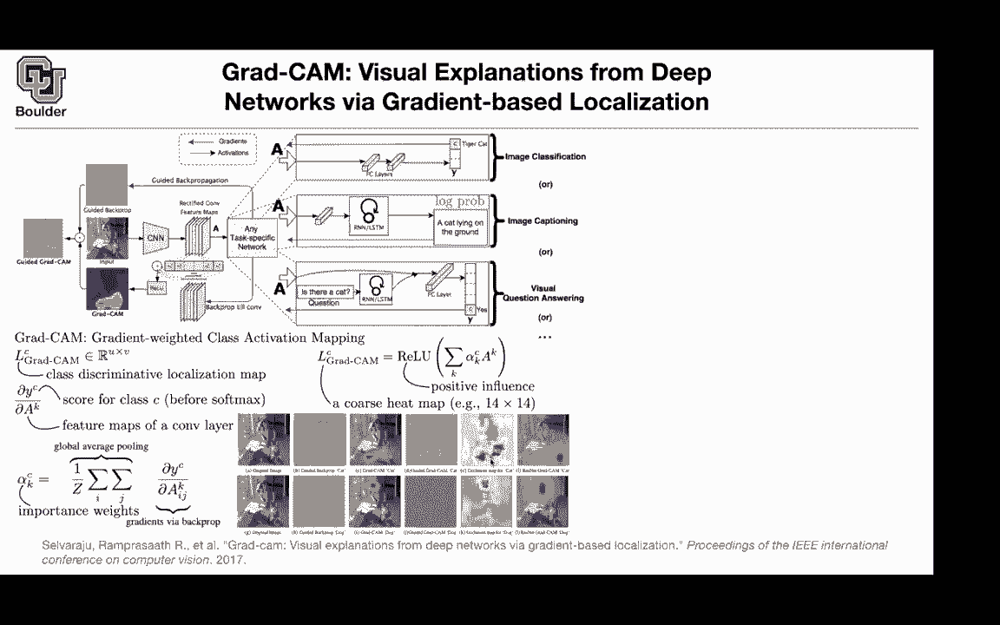
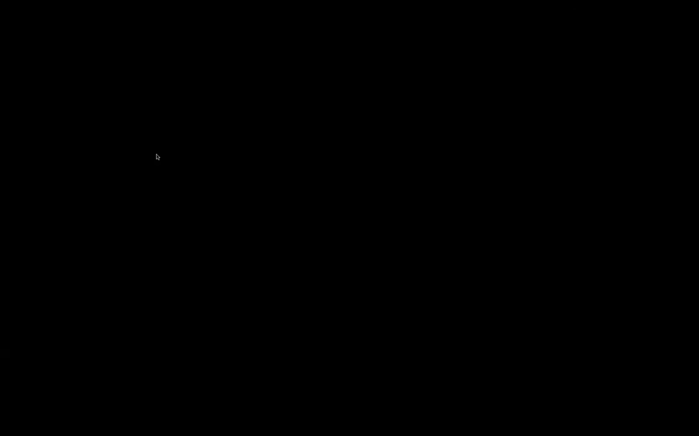
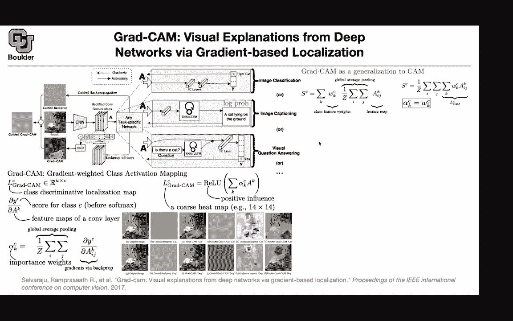

# 【双语字幕+资料下载】科罗拉多 APPLY-DL ｜ 应用深度学习-全知识点覆盖(2021最新·完整版） - P56：L28.2- Grad-CAM - ShowMeAI - BV1Dg411F71G

actually before i go to this paper let's，go back here，and here we introduced class activation，maps。

but to get the class activation map we，have to，change the architecture the last few。

layers of the architecture remove the，non-linearities，to end up with a linear structure at the。

end but then this one is going to need a，little bit of fine tuning。

so you need to do retraining a little，bit once the training is done。

then you can start visualizing the next，paper is going to come and say you don't，even need to。

linearize the last part of your network，this could be still，fully connected with a bunch of。

non-linearities，after the last convolution and you still，are able to visualize。

and how can we do that so i don't want，to be i want，i don't want you to panic when you see。

this figure，because i'm going to break this apart，and the way to read this figure is this。

there is an input image you have your，convolutional，part of your neural network you take the。

input you push it through convolutions，and in the end you're gonna get。

a bunch of convolutional feature maps，and these are your convolutional feature，maps after。

applying railway so these are rectified，so we are here now，the previous paper had a global average。

pooling here，now we are going to have different tasks，and let's focus on image classification。

for now，for image classification you use it you，usually have a bunch of fully connected。

layers for instance in vgg type of，networks，that we covered you have these fully，the。

classification score for each of your，targets，now what you can do is pick a target。

take the derivative of，that with respect to these feature maps。

here this is a one dimensional function，taking a high dimensional input and。

outputting a single scaler，so you can take its uh derivative using，back propagation。

so you're gonna back propagate and in，the end you're gonna，end up with a matrix with actually a。

tensor，that's gonna have the same size as your，rectified，convolutional feature maps and that one。

is being plotted here，so you're gonna back propagate till this，point。

and that's gonna give you these now what，you can do is you can do a global，average pulling。

on each of these uh back propagated，feature maps，and you can end up with a bunch of。

scalars now you take those，scalars multiply them by your original，feature map。

add them together apply a rail u and，that's going to give you your。

grad cam so let's go through the math so，don't worry about the rest of the。

figure i'm gonna explain that later on，so what does grad，cam stand for it stands for gradient。

weighted class activation mapping so，grad stands for gregan，and in the end we are going to end up。

with a class discriminative，localization map which is this plot that，you're seeing here。

but how do we get to that you take the，derivative of one of your，classes the score for one of your。

classes，for instance the tiger cat and you take，the derivative with respect to the，feature map。

and that's going to give you a bunch of，derivatives and these derivatives。

correspond to this part of the figure，now to get，alpha ck alpha ck is these w1。

ck w ic case so there is a discrepancy，between the figure and。

the notation but it's not that big of a，mistake，it's just a typo so these alpha cks are，w。

c k's and they're coming from doing the，global average pooling and these，derivatives。

to give you these scalars once you get，the scalars，you can do a linear combination of those。

scalars and your，feature maps the original feature maps，you do a summation that summation。

corresponds to this part of the figure，you do a ray u because you are。

interested in the positive influence，of that particular pixel on the class。

and that's going to give you the，visualization that you're interested in。

so that's going to give you this，after uh you increase the resolution。

because the resolution is going to be 14，by 14 then you have to increase the。

resolution to the original resolution of，the image，now we are interested in a target cat。

and in the end we are focusing on the，target cat，yes go ahead um so here you talked about。

this positive influence，and so that's like where the the heat，map is strongest that means that is。

like very important for this class，exactly and would negative influence。

just be that it's very unimportant for，that class，but we just don't care about that yes，okay and。

maybe that window over there is gonna，have a negative influence，but we don't care about it okay okay。

perfect，we need to ask that again so if you had，a negative gradient it'd be something，where like the。

presence of this part of the picture，detracts from the probability that it's。

a dog or detracts from the probability，that it's a cat，yes that's correct okay actually that's。

a good exercise，if i were writing this paper i would，visualize that as well。

because it seems like both are important，like positive positive evidence towards，one class but also。

making the other probabilities in that，soft max，smaller so that the one that you care，about is。

larger in comparison yes that's correct，so i think that's also important to，visualize that as well。

but for now we want to see which parts，are having a positive，test。

and that's doing the correct thing now，you can see that it's visualizing the，correct part。

of the image now let's see some more，examples this is the original image。

this guided back propagation is very，similar in terms of concept to the。

visualizations that we saw here，so there is going to be back propagating，through the，level。

because these operations are nothing but，pass，this is the backward pass and that's，exactly。

what we are visualizing here these are，guided back propagation for the cat。

or the class cap the id back propagation，for dog，and that's this part i know it's a。

little bit blurry，but the guided back propagation，is giving equal emphasis to the face of，the。

dog and the body of the cat now if you，take that，and multiply it literally you are，multiplying。

point by point pixel by pixel you are，going to be able，to pick up the cat and that's going to。

be guided，graph camp so this is guided back，cam，it's exactly this lc of grad cam that。

you're visualizing here，for the class cat for the class dog now，if you take that。

multiply it by b basically you are，multiplying b，and c and that's going to give you your。

guided graph which is focusing on the，chat and the other one is focusing on。

the doc and this is just，another way of doing visualization this，corresponds to。

what this corresponds to this plot here，where you have，your occlusion your square and then you。

are sliding it over your，image so that's exactly what we are，seeing here and。

not only it works for vgg it's gonna，work for，resnet and other types of networks and。

you don't have to retrain，what else we covered the classification。

before we move to image captioning and，visual question answering。

why is graphcam a generalization of cam，this is their score corresponding to a，class。

when you have cap basically global，average pooling，now if you take derivative of sc with。

respect to the future map，you're gonna end up with these w's and，if you remember，the。

summations to give us lc cam and，in the end grad cam is a generalization，of cam。

where you have your alphas to be w's so，is this clear，if everything is linear and global。

average cooling is linear，then these derivatives there is no，non-linearity and。

alpha ck is going to become equal to wck，and that's why this typo is not that big，of deal because。

in the end they are going to end up，being the same thing if your model is，linear from this point off。

now you can do image captioning and。

visual question answering as well，for image captioning the output of your。

convolution is going to go through a，fully connected layer，and then it's going to go to a through a。

recurrent or lstm，which is going to give you the，probability of this sentence。

and this probability you are going to，break it down using the chain rule for。

probabilities so don't worry about it，but in the end you're gonna get a log。

probability you can take the derivative，of the log probability with respect to，the feature maps。

and that's gonna give you your，derivatives，with respect to the feature maps that。

you can use to obtain，alphas and your graphcam indian now if，your caption。

for this image is a group of people，flying kites on the beach then your，network。

is gonna focus on these kites there's a，kite here there is another one here。

there's another one here so it's，focusing on the kite，and it's also focusing on the beach and。

this part of the beach if you're，underlying，caption isn't mine is sitting at the，table with a pizza。

then your network is going to focus more，on the math and it's going to focus on，the pizza as well。

you can do visual question answering for，visual question answering there is a，question。

that goes in and the question is is，there a cat，you push it through a recurrent neural。

network or lstm you get some features，you get the features of your convolution，you concatenate them。

you push them through a fully connected，layer and in the end you answer your，question。

is there a cat in this picture and the，of，yes and back propagate it to get these，features。

that then you can use to visualize for，instance if，this image and this question goes in so。

what is the man doing，and if your answer is surfing then the，network is going to focus on the。

man and some parts of the way and what，he's shooting，she's having a baseball path and then。

it's going to focus on the baseball bat，what is that and that's an elephant if，that's the answer。

it's going to focus on the element what，is that if your answer is zebra it's。

going to focus on the zebra so any，questions about visualization and，understanding。

before i move on to the next one which，is about transfer learning。

for the um the question answering ones，and the image captioning do they have to，prescribe。

a set of output，sentences kind of like with um when we，were doing image classification there。

was like 100，classes that were prescribed beforehand，what does it，does it learn that the actual task。

is learning it for instance the actual，task is going to tell you。

if you ask your network what is the man，doing it's going to give more，probability to survey。

but when you want to go backwards you，have to specify，the outcome the same way that you were。

specifying the target cast，yeah you are doing your visualization，for the target chat。

the forward pass is gonna do it it's，gonna if you tell it what is the man。

doing it's gonna tell you it's surfing，or he's surfing，but when you want to visualize it you。

need to say okay，i believe your answer is based on that，i'm gonna give you baseball bat。

and now you tell me where you are，focusing i want to understand。

why you gave me this answer okay yeah，but then like the，like all of the other networks if we。

gave it something like a task which was，outside of，the um outside of the like in this case。

they're all activities they're surfing，or eating a pizza，if we gave it a new whatever kind of。

thing was happening skateboarding，they wouldn't know the word，skateboarding those。

those labels of the activities have to，be，provided in the training data right yes。

okay but the image caption you can do，with any caption，you can yeah you have to but you have to。

provide it a bunch of captions so then，it learns like a corpora。

of captions that are plausible yes okay，that makes sense any other questions so。

this is really interesting，your network is predicting something now。

your question is why did you give me，that answer what did you see in the，image。

that makes you think that the guy is，surfing，and then that's what the image is saying。

the network is seeing，it's seeing a guy and it's seeing some，wave。

and then he's telling you that the guy，is serving because of this，so it's no more a black box you're。

seeing what the network is thinking，that's what i was saying neural networks，are no more black boxes。

you can actually open the black box they，can look and，uh yes they were black boxes in the。

