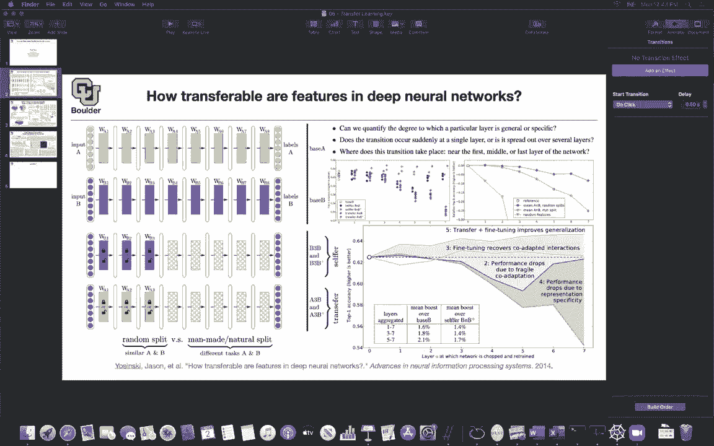
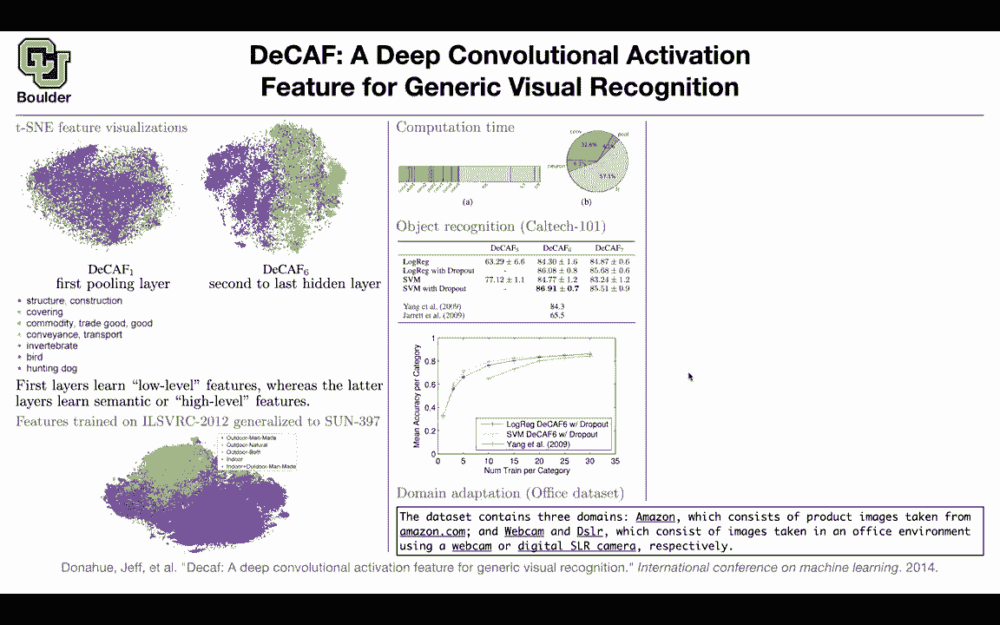

# 【双语字幕+资料下载】科罗拉多 APPLY-DL ｜ 应用深度学习-全知识点覆盖(2021最新·完整版） - P58：L29.1- DeCAF - ShowMeAI - BV1Dg411F71G

so we started learning about transfer，learning，and to be honest the rest of this course，most of it。

is going to be about transfer learning，but these are the first few papers。

at least in computer vision that i，started noticing that they can use the，features。

that a neural network learns and apply，those features to new data sets。

or new tasks the first paper was trying，to approach it in a systematic fashion。

and try to explain what type of behavior，we might see，the next ones the next two ones are。

really practical。

but i'm gonna go through them really，fast and let's start with。

this one you're gonna hear decaf a lot，why because you're gonna see that it's，getting cited。

whenever people talk about transfer，learning，and i want you to be familiar with it so，the caf is a。

neural network similar to alexnet，but that doesn't really matter we are，gonna take the last features。

of a convolutional neural network and，use that to do，new tasks and do transfer learning so。

let's start with the visualization，tsme is a visualization technique i'm，not gonna go。

through the details of how it works but，it's a paper written by jeffrey hinton。

so it's not about deep learning it's，mostly about visualization。

and what we are doing is visualizing the，features，in the first pulling layer and that's。

going to be decaf，one and the second to last hidden layer，and that's going to be decaf 6。

and these are going to be high，dimensional features and these，being。

pushed through your neural network and，you are taking a look at the first，pulling layer。

the values of your neural network at the，first full pulling layer。

this is going to be high dimensional to，visualize that in 2d，you're going to use tsne and that's。

going to help you visualize your，features，your images you can do the same thing，for。

deeper into the neural network near the，labels so these labels that you're，seeing。

are the ground truth that you're using，to color code，so let's see let's take a look at for。

instance hunting dog，and for hunting dog in app for decaf，one you see that these classes were，these。

big classes of categories it's hard to，distinguish them，in this visualization but deeper into。

the network，these are gonna become more，discriminative so you're gonna be able，to discriminate。

a haunted dog from structure，from covering the yellow ones from，birds from in vertebrate。

this blue the light blue one but here，all of them are，getting clustered together and each dot。

that you see is an observation the color，is going to be the corresponding class。

now you see these are getting more，discriminated，in the deeper layer and this observation，we already。

saw it in previous papers also，the first few layers are going to detect，edges colors etc。

the last layers are going to learn more，that，there is a face of a dock there is there。

is some discriminative features，and they are going to be more meaningful，this is another way of get。

arriving at the same conclusion so first，layers are learning low level features。

and the later layers or the latter，layers are learning，semantic or high level features in your。

neural network，now how transferable are those features，that one was。

this study was being done on the same，data set that the network was trained on。

now let's change the data set from，imagenet to，images of indoor scenes indoor and，outdoor scenes。

and you can see that these features for，decaf 6，are still discriminative in a new data。

set without any training，you can see that there is outdoor，man-made the red ones。

are being discriminated from outdoor，natural and man-made and these are all，indoor。

so outdoor and indoor are clearly，separated apart，from those features on a new data set。

without any training，so this is encouraging can i ask a quick，question。

yes should we attribute any importance，to the，the spatial location of these two like，point clouds。

like i see that these outdoor，i guess i mean should we should we，associate where。

invertebrate and bird are in the point，cloud，and then look at where that would be on。

this next point cloud and see if there's，like any connection，uh so no the location doesn't matter。

because these things could rotate，okay it's the relative location and。

the fact that there is a boundary，between the two，okay cool thank you but we need to take。

this into account that we are，doing a projection in 2d and this is，high dimensional i don't know。

more than 100 dimensional and even more，and you are projecting it to be in 2d。

and the fact that there is some，discrimination going on，that's impressive but one might say that。

these deep neural networks are not cheap，to give you the features and you want to。

use them on the fly，and then do i don't know support vector，machine。

or a logistic regression at the end，maybe they're not cheap，the answer to that is that most of the。

computational cost，is in the fully connected layers that's，going to take 57。

of the time so that's the computational，time also，in terms of storage they are gonna use a。

lot of memory，but the thing is that we usually cut the，network at this point。

right after the convolution and this，d-cap is the second to last hidden layer，from the convolution。

one，that's gonna help you come up with，features that are less expensive。

now let's take the same features and，apply that to different tasks。

for instance caltech 101 101 stands for，you have only one or one。

categories so what i want you guys to do，is to download these data sets。

they are not as big as imagenet，and take a look at them and see why。

they're different from imagenet so you，have different options。

these are going to give you the features，peak f5 decaf67，i think seven is right after the fully。

connected seven，d cap six is here and decaf dcaf5，should be here so these are the options。

that you have for your features，and on those features you can do。

different algorithms you can do logistic，regression logistic regression with，dropout。

support vector machine software vector，machine with dropouts，and these are some classical techniques。

of giving you features，and decaf6 seems to be giving you the，best features for these tasks that's。

giving you the best accuracy，that one this table is when you have，that this。

is not a large data set you have 101，categories，30 data points on average per category。

and that's not much，for training a neural network from，scratch but what you can do is triangle。

neural network on imagenet，where you have massive amounts of data，and transfer the features to。

caltech101 now here is a study of the，size of the，data set 30 per category 25 per category。

20 15 5 10 and 5 and this，is also another indication that support，vector machine。

using the caf6 with dropouts，is giving you better results compared to，logistic regression。

and we also saw that here so that's a，new task you can have a。

domain adaptation task are the features，so there is a question，are the features just the various。

weights，convolutional channels uh no，you take an image you push it through，the network。

and you're gonna end up with a tensor，those are gonna be the features。

and those features are cut at the，particular layer，of a network they are not weights they。

are actually what you get，out of all of those operations out of。

matrix multiplication and out of your，non-linearities out of max pooling etc。

so you said that there was an advantage，to this because perhaps the full。

network was expensive um and doing，i don't know svn or doing logistic，regression might be。

cheaper but it seems like you still need，to use the entire network to generate，your features。

yes that's correct so what where where，is the computational savings like aren't，the last couple。

layers themselves generally smaller than，the big dense，convolutional bulk of the network uh no。

here is an indication that they are not，the convolution is taking 32 percent of。

the time compared to 57 percent，so that's that's what that diagram okay。

so you do save a good amount of time，and then instead of doing the fully，connected classification。

at the end you just pass it to something，else like an svm yes。

but the thing that you are seeing here d，cap 6 this is also to answer solutions，question。

uh it's happening here right after the，fully connected so there is still some。

fully connected going on，dca 5 is fully convolutional and decaf 7。

is here right after the fully connected，so there is no point in using the half，seven compared to。

six because it's more expensive and，worse yes，but still if you compare it to previous。

state of the art，for featurizing caltech 101 this is，really impressive。

and you are not doing any fun tuning on，these layers，on celtic 101 anymore you just take。

those features and use them，wait is that a number of train per，category just a number of examples。

like your data set yes that's really，small right，yeah that's a small data that's crazy so，i want you。

to take a look at these data sets from，this point on in the course，so far we were only dealing with。

imagenet c510 etc，but from now on you're gonna hear a lot，about new datasets。

so i want you to download them and take，a look at them do，eda exploratory data analysis on them so。

that's really important，how about a totally different task，it's not only a different data set but。

it's a different task and what is the，task，you have data collected from three，domains。

amazon these are product images，taken from amazon。com you're gonna have，webcam。

and dslr these are images，taken from products in an office，environment。

and you're using your webcam or your，digital slr camera，so the ones on amazon are going to have。

a higher quality。

compared to a webcam or a camera so what，is the task，the task is you have some data set you。

collected some data set，on amazon and you want to classify，images using the webcam what are you。

allowed to do，you are allowed to take the features you，are allowed to train。

on the amazon data set and s here，stands for source t stands for target。

s snt stands for source and target so，this is your source data set。

that's your target data set and you want，to adapt the domain，whatever you're allowed to do in the s。

regime you're only allowed to，train on amazon so you are allowed to，triangular。

logistic regression or support vector，machine on data sets collected，from amazon。

com but then you are going，to use it to test，on images from taken from using webcam。

and the features could be decaf6 pcap7，and surf，surf is not a deep learning method but。

these two are coming from deep learning，and you can see a huge boost without any，training on webcam。

you have a huge boost in terms of your，accuracy，if you are allowed to train on the。

target of course you're gonna，increase the accuracy even more if。

you're allowed to train on source and，further，but amazon and webcam are really are two。

data sets that are really far apart from，each other，dslr and webcam are closer and that's。

why they're transferring better，if you visualize webcam is，the ones that have a green box around。

them，and dslr are the blue and you're using，tsme and now you're。

zooming in on your data set you see that，these features are putting scissors。

from these two datasets closer to each，other and that's why they are，transferring better。

they are actually able to transfer at，all you can also，we saw this subcategory data set before。

it's the third data set，and these are subcategories of birds，some special type of a bird and。

you can use decaf6 these are the ones，that are，learned from imagenet and then you can。

apply to a totally different domain，and again this dataset is a small data，set it's not。

enough to train a neural network from，scratch you can go to scene recognition。

use logistic regression or support，vector machine on the features，that you have from dcaf6 or decaf7。

and be able to increase the accuracy，compared to，state-of-the-art without transfer。

learning and without deployment，any questions i have a two questions。

and the first one we might have talked，about this，but the reason we're doing this these。

support vector machines or logistic，regression is just because，we don't want to deal with like the。

training of the neural network again，we just want something that's quicker，and easier。

you could actually put a small neural，network at the end，of pcap7 and then fine-tune those layers。

actually train those layers you could do，that that's fine okay。

there is nothing wrong with that but the，idea is that，these are features you take them from。

your neural network，you fix them and then now you can use，any algorithm on top of that。

okay and then uh what is this yellow，neuron uh slice in a computation。

time graph yellow ones the neurons are，the activation oh okay value activations。

that's how much time they're taking，okay thanks and the red one is pulling，any other questions。

so you're gonna hear a lot about decaf，you can actually，use that algorithm it's up on the web。

you push your。