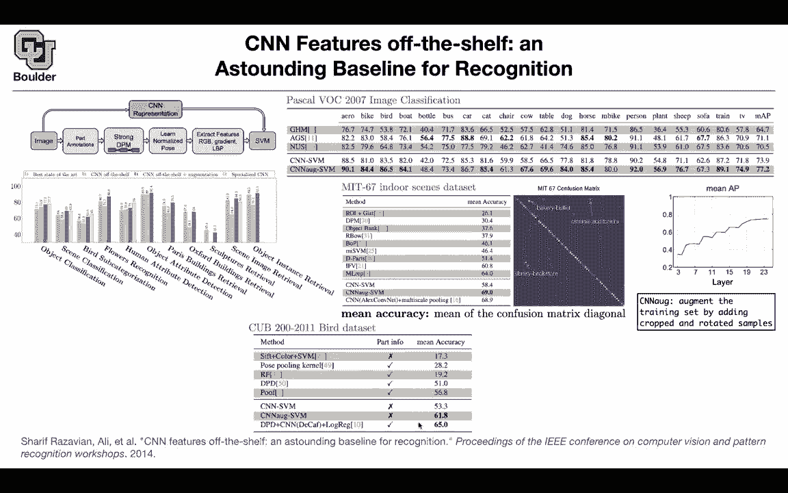
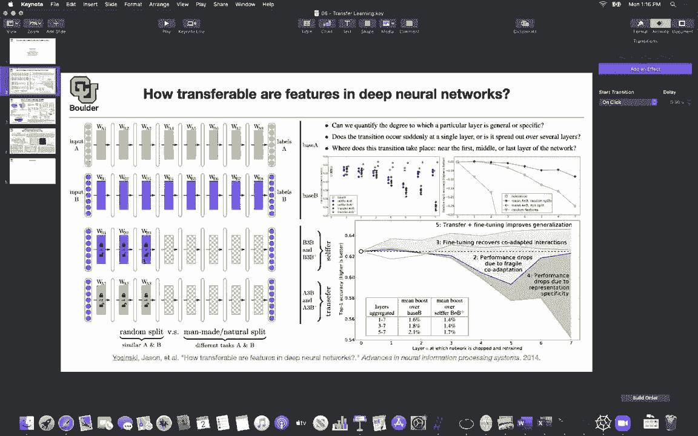

# P59：L29.2- 卷积神经网络特征解析 - ShowMeAI - BV1Dg411F71G

[Music]，the other one that took this，a little bit further to new domains is，cnn features。

of the shell so you're going to use cnn，features without any fine tuning。

and it's going to give you a baseline so，previously，in computer vision you would take an，image。

you would do some part annotation strong，vpn，learn normanized pose extract features。

gradients lbm etc lbp etc，and then at the end you do your support。

vector machine so there was a lot of，handy engineering，going on here now the idea is that you。

can bypass the entire thing within，cnn and you can apply to different，domains。

you can do object classification and，from left to right，we are going further and further away。

from the original task，that the network was trained on so these，cnn features。

are being trained on imagenet which was，the object classification task。

now you can do object classification，scene classification，bird subcategory flower recognition。

human attribute detection object，attribute detection，paris buildings retrieval export。

buildings retrieval sculptures scene，image retrieval，and object instant retrieval so you are。

going further and further away from the，original task，and whether it is vertical lines or。

vertical bars，this is the best previously reported，state of the art。

the green ones cnn features of the shell，sometimes，it is worse but it is competitive to。

doing all of this hard work，and then you have you can have cnn，official features。

plus some data augmentation and you can，get a little bit of boost。

out of data augmentation and there are，also some specialized，cnn architectures for these tasks and。

because they are specialized they are，most of the time gonna do the best but。

still we are having a very good baseline，taking an image pushing it through a cnn。

and getting some features，and then feeding it to a support vector，let's。

start with the image classification，but what we are doing now is changing，the data set rather。

than imagenet we are using pascal voc，and the task is also slightly different。

in each image you could have multiple，categories，that's why accuracy is normally a good，metric。

and you're going to use average，precision per category，or mean average precision for the entire。

categories i'm going to tell you about，the details of the mathematical，formulation of。

average precision later on when we do，object detection，but for now it is worth noticing that。

the task is slightly different there，could be multiple objects。

in one image and the cnn support vector，machine，with the augmentation is doing best on。

almost all of the categories，except a few and in total that's doing，the best so that's this part。

object classification you can have，indoor，scene classification so indoor scenes。

are important for robots，and let's see again the cnn，sbn with augmentation is doing the best。

and let's take a look at the confusion，matrix，the algorithm these features are。

confusing a bakery with a buffet，a cinema with an auditorium and a，library with a bookstore。

so even the mistakes are not that bad，and as i said cnn alt，stands for you have some data。

augmentation going on，like cropping and rotating your samples，for bird subcategories。

we saw this in the previous paper also，we are seeing it help here as well。

decaf is the previous paper and these。

augmented cnns are doing，as good these ones were using part，information。

this one is not what else you can have，human attributes，this is the next task and the attributes。

are whether you are dealing with a male，or whether that person has a long hair。

whether they have glasses hat so these，are really different from what we saw in，imagenet。

which was categories of uh you know，different，is this person wearing a t-shirt do they。

have long sleeves，are they wearing shorts jeans long pants，etc and the last one is object v3 ball。

for object retrieval you take two，objects push them through your neural，network。

you take the features you compare the l2，distance，between the features and that's going to。

give you a measure of closeness，between two images now that you can。

compare two images you can compare，one image to an entire data set so what，is the task。

you want to do search but you you don't，know how to describe your search。

but you have an image you want to bring，up all of the，images that are similar to the image。

that you have at your hand，that's going to be called object，retrieval and you have different data。

sets for it，export 5k battery 6k sculptures，and etc these are handy engineered，features。

and cnn features are doing pretty good，so these features are transferable where，were the。

features learned from originally for all，of these cases，uh what do you mean is it like last time。

where，um you did a like a big training on，alexnet or you did a big training excuse。

me on them imagenet，and then fixed all those weights and，then used it as a feature generating。

network for some other，and，it，okay actually imagenet is gonna be what，we're gonna use。

for transfer landing and what is the，objective function，then in the original one is it still。

just image classification on imagenet，yes so that's the objective okay so you，learn your features。

from object image classification，using imagenet that's going to give you，your cnn。

and that's going to be your feature，extracted yeah and then you use those，features to。

do all these other things okay exactly，and this was without any fine tuning of，the original。

cnn you can also free up some of these，parameters to be learned，to be fine-tuned that one is also。

transfer learning。

like here you can have a lock on them or，you can release the lock。

and let those weights be trained and we，know that if you，let it fine tune you're gonna get a。

boost in terms of。