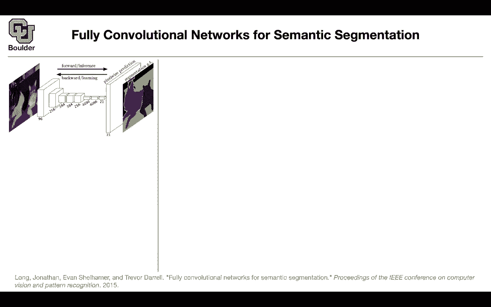
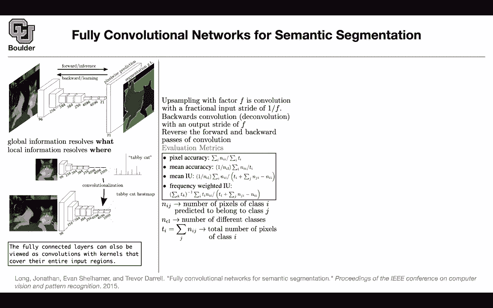
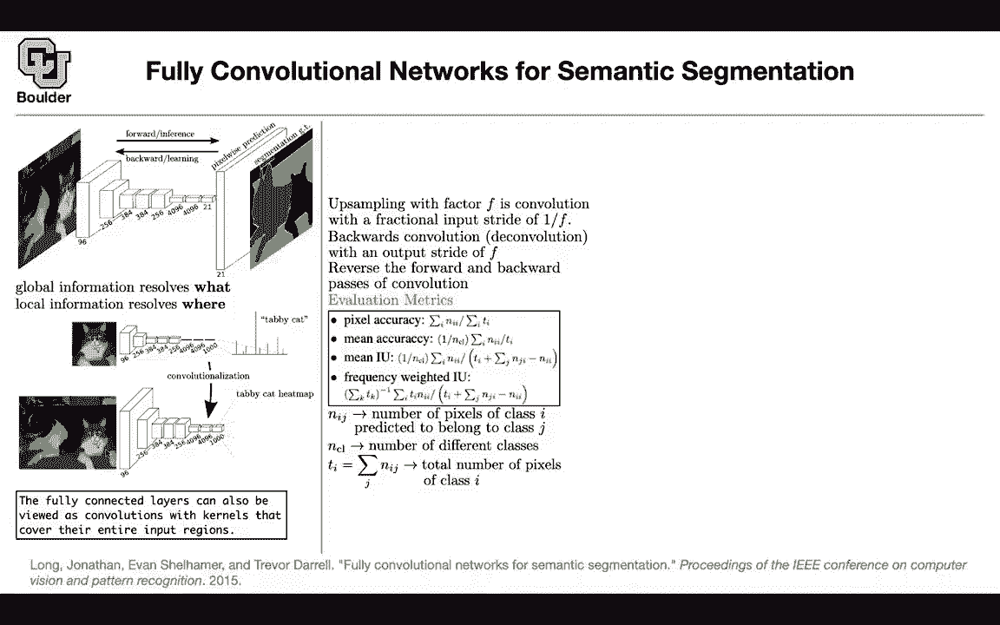

# 【双语字幕+资料下载】科罗拉多 APPLY-DL ｜ 应用深度学习-全知识点覆盖(2021最新·完整版） - P60：L29.3- 全卷积网络 - ShowMeAI - BV1Dg411F71G

so let's do semantic segmentation，and it's a natural continuation to。

what we just saw about transfer learning，and i mentioned the rest of this course，learning。

literally you rarely train your networks。

from scratch，because it is time consuming and you，need to have a lot of data。

and let's start with the semantic，segmentation task，some of the applications are going to be。

for robots，and for self-driving cars and what is，the task。

you have an image and in the end you。

not only want to know what is inside，that image，that's a cat that's a dog but you want。

to know where they are located。

so now our labels all are a little bit，different。

our ground truth and labor labeling task，is a little bit different previously。

labeling images was easier，why because all you needed to do is to，have a human。

take a look at this image and say there，is a cat there is a dog that's it。

but now the labeler has to go。

and color code the part where the cat is，located，sorry the dog is located the part where。

the cat is located，and i guess that's a table probably and，some other objects。

in the domain so the labeling is harder，and whenever the labeling is harder。

you're gonna have fewer data，so the size of the data for semantic，segmentation is。

smaller than image classification so，that's one problem，and that's why we are going to use。

transfer learning and the other problem，goes，when you want to deal with the neural。

network and how you want to design it，previously we only needed to worry about。

what the what of an image，what is in this image and that was，global information now we also need to。

worry about，local information and our neural network，should be able to resolve。

not only what but also where where in，the image is my cat where in the image。

is the dot，so that's a harder task for two reasons。

one you have fewer data，and the other one is that you're，interested in the where of the。

object so that's a fundamental feature，of dealing with semantic segmentation。

and all of the contributions that we are，going to see，are going to be trying to deal with。

these problems let's start with the。

first one，if we connected the fully convolutional，network。

so we want to do transparent learning，previously，it。

and look at the cat only and we would，push it through a bunch of。

up with。

our fully connected networks and，that one was going to give us this score，for。

different categories and the dominant，one was the one that we are interested。

for instance is the tabby cast。

so this paper came and said you can。

ones，as convolutions and we know that we can，do that because。

this could be a convolution and it's，looking at the entire。

image。

for the entire tensor before it so the，fully connected ones，could be treated as convolutions now you。

can take a look at your entire data set，once you treat them as convolution you。

can treat you can，take a look at your entire image you，don't have to focus on the。

image，push it through your convolutions and we，know that convolutions。

they do not depend on the resolution of，the input image。

because you have a filter and then，you're sliding it over your。

image so the size of the input image，doesn't matter for a convolution。

once you do that rather than ending up。

with a single number here you're gonna，end up with a feature map。

so previously it was one by one now you，have a feature。

map now what is interesting you can，replace the last guy where you had one。

thousand labels now you can replace it，with 21 labels，why is that because the data set that。

we're going to work with，has only 21 labels 21 of these。

cats and dogs and table etc so you don't，need all 1000 you need only 21。

up until this point of the network you，can just copy and paste from your。

imagenet network so that's just copy and，paste and reinterpreting the。

weights the fully connected layers as，convolutions，it's just a reinterpretation nothing。

fancy going on，the rest of it are going to be the ways，that we are going to learn so we are。

going to end up with 21，categories that's going to give us the，what of the image。

now we need to worry about the wear of，the image and as i said they're fully，connected layers。

we can view them as convolutions with，kernels。

that cover their in entire input regions，now let's worry about the where for the，where we have to。

go the inverse of a convolution so we，have to be convolved，and we know that the inverse of a。

convolution is not that complicated，when we were going forward we were doing。

a convolution for instance from 96，and this resolution we were going to a。

lower resolution using a convolution，but the backward pass was giving us the。

deconvolution，we were going from a lower resolution to，a higher resolution。

using a deconvolution operation and，that's going to be the backward pass。

of a convolution i'm going to give you，the exact formula for this in the next，slide but for。

now we need to up sample from a low，resolution。

feature map to a higher resolution one，and that we can do with a。

convolution with a fractional input，strike so，rather than your stride being one two or，three you're。

striding fractionally it means that，you're reusing your weights。

that's nothing but the backward，convolution and that's gonna be a，deconvolution。

these names are gonna be you're gonna，hear about these names。

in different papers interchangeably，so that's just the reverse of a。

forward and that's gonna give you the。

backward pass of the convolution so，these are nothing fancy i'm gonna give。

you the exact mathematics of it，in the next slide but for now we need to，up sample。

and that's going to give us the where，what is our evaluation matrix i'm going。

to talk about the loss function in the，next slide。

but how are we going to evaluate whether，our algorithm is doing a good job or no。

you can take a look at the pixel，accuracy。

let me bring this up n i j so we are，gonna have a matrix。

on on the rows you're gonna have，the correct class i on the j you're。

gonna have the predicted class，and that's sort of like a confusion，matrix。

and on the i j entry of that matrix。

you're computing the number of pixels，that are uh pixels of class i。

that are being predicted to be to belong，into class j。

that's going to give you an ij so you're，just counting and that's going to give。

you your pixel accuracy。

and what is ti ti taught is the total，number of pixels。

of class i so you're just summing，over j and that's going to give you a，total number of pixels。

in class i now you can have your pixel，accuracy you can define it now。

you can take a look at the diagonal of，that matrix。

you sum it and then you can divide it by，the total，number of pixels and that's going to。

give you a pixel accuracy，so this is clear you can have mean，accuracy。

again it's a diagonal divided by the，total number of pixels belonging to that，class。

this one was for one class now you can，divide it by the total number of classes。

in your entire data set and that's going，to give you your mean accuracy。

you can have intersection over union and，mean intersection over union。

this part is intersection over union and，i，is the intersection and the union there。

is a summation over j，going on in ti and these are all of the。

entries in your matrix，but you are counting the diagonal twice。

so you subtract it once，that's going to give you the union and。

mean because you're doing it over all of。

mean of，intersection over union rather than。

having one，over n cl as a weight for each one of，these。

terms in the summation you can have a，frequency weighted。

intersection over union so that's going，to give you ti，now your rate is going to be ti divided。

by the summation of tkx，rather than this is good when your data。

is imbalanced that's a good matrix，when your data is imbalanced and cross。

class you can have ti divided by this。

summation of，tk as your frequency i think i'm gonna，stop here。

and uh for those of you who have，questions you can stay and ask。

and the ones who want to leave you can，leave could you explain how。

we're recasting the con uh，sorry the fully connected layers as，convolutions。

as convolutional layers um let's take a，look at this。

256 and it's gonna have。

a height and a bit yeah before you push，it through a comp，we were fully connected what would you。

do you would flatten this，and then multiply that by the weight or，equivalently。

you couldn't flatten you could keep that，in its form。

and reshape your weights because in the，end what you're doing。

is just uh the inner product of two，tensors your filter。

as a tensor and your input features as，another tensor and you're doing an inner，product。

so you can get rid of that flattening，now you have。

a convolution with a filter size that is，equal to the entire。

input okay it means that your，convolution is going to have a kernel。

that is of a size equal to this，box here to the entire input box and。

that's how you are going to interpret，a fully connected layer as a convolution。

and the rest of them are。

the same from this point to the next one，is just easy。

and you could also think of that as like，doing，flattening the the the tensor and then。

doing the fully connected layer，and then just repackaging it back up。

into，the shape tensor you want it to be it's，but it's just easier to do it the other。

way，yes because you want it to be efficient，as well and the other point is。

i guess you're not summing and the other，point is uh。

you want it to be automatic if you have，a fully connected layer here。

then what goes in the fully connected，is has to be of a particular size after。

flattening it has to have their，size that the fully connected layer。

likes but if you interpret it as a，convolution。

you can enlarge your image and we know，that convolutions don't depend。

on the size of the input image okay，yeah so the fully connected one is a。

matrix vector multiplication，and whenever you are doing a matrix。

vector multiplication，uh the sizes need to match up otherwise。

it's a linear algebra thing it's not，gonna compute it for you it's going to，give you an error。

your code but if you treat it as a，convolution now。

convolutions don't depend on the size of，the input because，you take a filter and then you slide it。

over your image。

and that's why you have a resolution for。

this 4096 layer，there is a resolution the resolution is，not one you have a。

resolution for it because you have a，convolution you have a kernel that's。

that you're sliding over here i'm。

interpreting it as mostly just，getting rid of the sum right is that，correct you just kind of do an。

element-wise，product and then keep the dimensions the，same is that。

true you have to get rid of the，flattening step。

right yeah because if you were to sum，over that，resolution then you would get the same。

thing as you would with the fully，connected right，this summation is just what you get out。

of matrix vector multiplication，but so but if you did this thing where。

you have convolutional layers at the end，and then say in that first one of。

uh dimension with 4095 or 96 channels。

if you just each channel if you just did，like global ad，average or i guess not global average。

pooling but if you just summed up across，the the height and width of that channel。

the output would be the same。

as you would have in that 4096 vector，for the fully connected right yes。

so i think now we are confusing，the global average pooling with the。

fully connected layers，no no sorry that was just my mistake i，was just i just。

good，but the summation doesn't exist anymore。

it's just over your filter，so the way you are going to interpret，this is that you have a filter。

with a kernel size equal to the input。

resolution that's how you accompl，convolutionalize，you get rid of the flattening and then。

you have a single，kernel i mean multiple kernels actually。

4 096 kernels with a filter size that is，equal to。

the entire resolution of your input，features。

so does the resolution decrease from 256，to，4095 from that like from those two。

layers，yes and the resolution is always，decreasing。

from this to the next one to the next，one and then it's going to be equal。

and then the resolution increases again。

but what's going to happen，here is that because your input image is，bigger。

you're going to have a bigger resolution，here so the resolution that you get。

is dependent on the size of the input，image but if you have a kernel that's，the same。

height and width as that previous layer，then wouldn't the output just be the。

same height and width as well。

it's the same height and width，corresponding to this part of the image。

this one is 256 by 256 and that's going，to give you。

this size for your channel at that，kernel size。

you can apply to other regimes okay，you can also think of it this way the，the field of view。

cat。

the field of view for each single one of，these，is gonna be the cat but then if you。

choose another，point another pixel that's going to be。

another part of your image，so that's going to be a different part。

