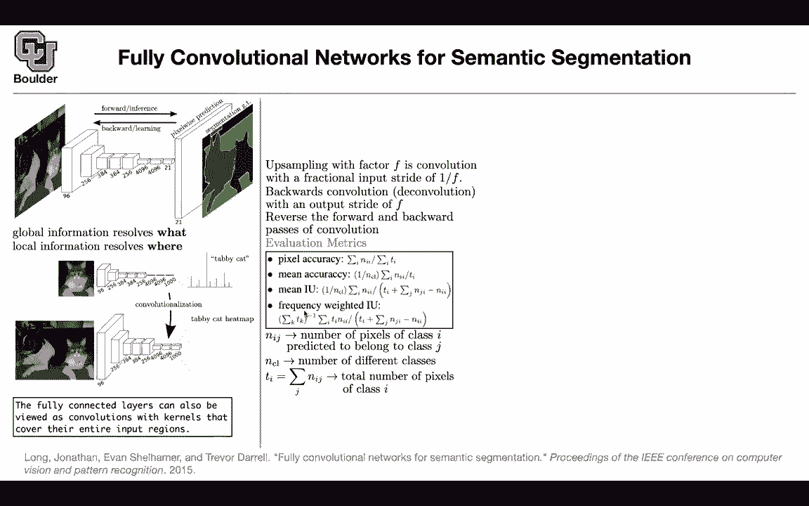
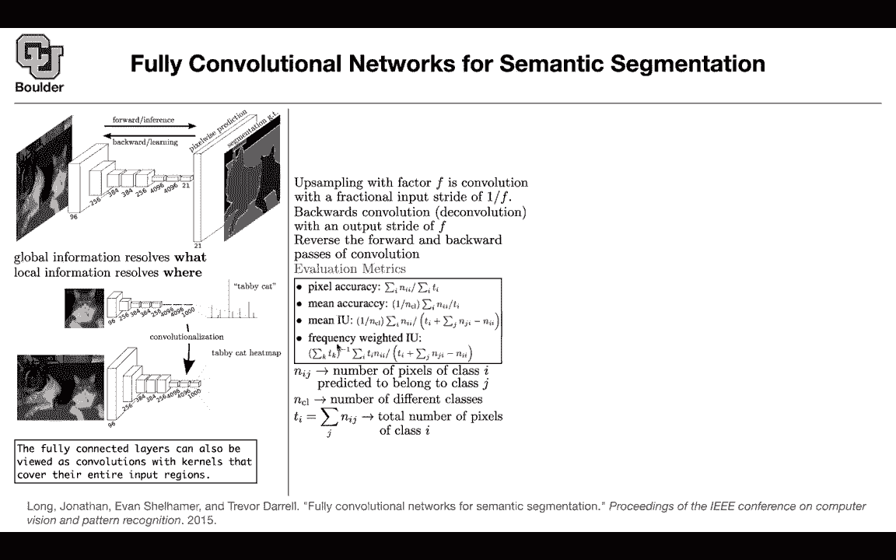

# 【双语字幕+资料下载】科罗拉多 APPLY-DL ｜ 应用深度学习-全知识点覆盖(2021最新·完整版） - P61：L30.1- 全卷积网络 [续] - ShowMeAI - BV1Dg411F71G

um do you have any questions about last，session i have a quick question。

sure um hopefully this is quick but i，just wanted to，make sure i understand a fully。

convolutional network，so my question is um when they，when you or the paper says。

you have a kernel that is the same，dimension as，the input that means the kernel is the。

same dimension as the input，when you have an input image in your，original，a。

lower resolution image of a cat but then，when you，take this larger image that has like a。

cat and a dog，input。

in that case because the input is like，larger is that。

did that make sense to that machine，so i guess you are talking about this。

part of the network you are not talking，about the original image。

yeah it in like yes for this tensor，you have a kernel that is of this size。

and maybe we can just say the height and，width is like 10 by 10，just for having a number of uh alex。

alexnet，or vgg because they had a fully。

connected layer at the end。

like these layers they were they had to，crop their images to a particular size，like 224 by 224。

if your size is 224 by 224。

then you're gonna end up with a low，resolution。

feature map at the last convolution，this is the output of your last，convolution yeah。

now here you're gonna have a kernel that，is of this size。

yeah actually you're gonna have 4096，kernels。

each one have two sizes and then the，rest of it is the inner product of those，channels and these。

and then that's going to give you these，numbers it's going to give you 4096，numbers。

and in that case it's only going to be a，one by one。

um like it's only one dimensional in，terms of like，like it's only f4 yeah resolution in。

terms of resolution，you can think of it as it is one by one，by。

4096 yeah okay the answer of that size。

but then the original image，now could be of any resolution because，we created this。

as a convolution as long as it's bigger，than the original resolution though。

okay。

you can do zero padding or same padding，or，different types of padding or you do，reflection。

but yes you are right it has to be，bigger and usually our images are bigger。

in terms of size and if they are not we，are going to resize them but。

yes now if this is our original image we，have multiple，objects sitting inside it now we want to。

have a statement annotation map，for the cat and the doc and there is。

always this trade up，when you want to do semantic，segmentation between。

what and where we have to shrink the，resolution。

and increase our number of channels，because that's going to help us identify。

what is inside that image，to identify the where we have to up，sample。

and we have to make sure that we are not，losing much of the local information。

so it's a balance any other questions。

okay perfect so last session we covered，up on the lab point and then we said now。

that you have 21 classes，that you can identify from it's time to，up sample。

and you can do that using a，deconvolution，sometimes they call it convolution with。

a fractional strike，or fractionally strided convolutions or。

a striated convolution as，they're all the same names you can have，deconvolutions。

and whatever that is it's nothing but，the reverse of the forward and backward。

passes through a convolution and we know，that we have to backward pass。

through any convolution even these ones，and that's going to be the backward pass，is going to。

increase the resolution i'm going to，tell you what these operations are。

exactly in terms of the mathematics of，it but this is nothing complicated。

but so far when we were doing，image classification we had only one，number。

to say how good our model was how good，our model is。

and that was uh classification accuracy，so a big part of any machine learning。

framework，is its evaluation you need to have key，performance indicators you're going to。

be able to say，this model is better than the other，model so that's a major part of your。

deep learning frameworks whatever that。

you want to do you need to ask what is，your evaluation matrix so what are the。

major components in a deep learning。

framework and machine learning in，general，it starts with data you write a model。

you can also call this prior data。

model you try to model the data then you，write down the loss function。

that's very important then you do，training，and then you have to do evaluations so，evaluation is。

very important so whenever you read any，papers。

ask yourself these five questions what，is the data，what is the model what is the loss。

function what is the training，how do they train their model what type。

of optimizer they are using what type of。

fiber parameters were the optimizers，and the other one is evaluation metrics。

so what is our evaluation metric here，it's going to be pixel accuracy mean。

accuracy，mean intersection over union and，frequency weighted。

intersection over units so you're going，to have a confusion。

matrix like matrix where the entries the，iphone j，entry is going to be the number of。

pixels of class，i that are being predicted to belong to，class j。

so you're going to count these numbers，but now you have to do it per pixel。

throughout your entire data set to give，you a matrix，and once you have that you can write。

down your pixel accuracy mean accuracy，intersection over union and frequency。

weighted intersection，so these are going to be our metrics to，compare a model versus the other。

or to choose our hyper parameters like，how deep our network should be how why。

should it be etc，so is this clear so this was just a，quick recap of what we covered。

last session any questions about the，evaluation metrics okay perfect。

let's see how the model is doing you can，have different backbones。

you can have alexnet you can have vgg16，and google maps。

learning，so we are cutting our network at some，point right after。

this last layer and the rest of it we，are learning。

and perhaps we are doing some fine，tuning on the，alexnet learned on imagenet so we are。

doing transfer learning here，with our backbone being alexnet or vgg16。

or googlenet，and we are comparing mean intersection。

over unit so it turns out that vgg16 is，doing the best，but then when you look at the forward，time。

it's not as efficient as the other two，and this is just telling you how deep。

the networks are how many parameters，they have，this one has the fewest parameters and。

is a little bit，faster a little bit slower than alexa。

and rf stands for receptive field that's，the receptive field size i'm going to。

give you an a precise definition of，receptive field，in future slides and this is the maximum。

stride，it means that if your original image。

has some height and some bit as its。

resolution you're doing a down sampling，of 32，after all of these convolutions are done。

but then we have to go ahead and try to，solve the where of the problem，by。

going down in terms of the resolution，now it's time to address the aware of。

the problem we don't want to lose，too much local information so let's say，this is your vggt16。

or this is your convolutional neural，network you have your，original image as soon as you push it。

through a convolution，or a couple of convolutions your，resolution is gonna go down when one。

when you push it through another，completion，your resolution is going to go down and。

then in the end that's going to be your，resolution，and we said the maximum stride is 32。

so you lost 32，in terms of your resolution so this，image，is 32 times smaller than the other image。

than the other tensor，and what you can do now is you do an up，sampling。

using a backward convolution and this is，what we were reporting。

these numbers that you see here they are，coming from that round。

but to address the aware of the problem，you can take，the layer before the output of the layer，before。

for instance pull five pull four you，copy it here，you take the output of convolution seven。

and you increase the resolution you up，sample it，by two and you're gonna get two feature。

maps that you can concatenate now，now to get to the original size of the，image you need to do。

one up sampling that has 16。 so you do，16 times of sampling you can do a。

similar thing for your pool 3，sample，here，and you up sample convolution seven by。

four and you copy it here and then you，concatenate them，and you do a deconvolution layer which。

is gonna do eight times，up sampling to get the original，resolution so the idea is that。

there is more local information in pool，3，compared to cool 4 and compared to pool，5。

 and we want to use that information，to help us localize our objects so what，is the effect。

if you have only fully connected network，with 32 up sampling，get。

as the outcome of your segmentation this，is the ground truth。

so somebody labeled our data and gave us，that fully connected 16。

is going to give you more details and，fully connected，network 8 is going to give you even more。

details it's not going to be perfect，it's not going to be your ground truth，but it's actually。

not that so that's a way of dealing with，the local，information and the where of the object。

and how do you compare these how do they，compare to each other。

in terms of pixel accuracy mean accuracy，mean intersection over union。

and frequency weighted intersection，union，the fully connected network fully，convolutional network。

with eight of sampling which is this one，is giving you the best result regardless，of the metrics。

and let's see some failure cases for the，network，for instance here you are not able to。

identify those cars，and maybe it has to do because it has to，do something with those objects being。

very small，so the scale matters，you can also look at this one it's a，boat and。

uh with sign these are not human，these are just life vests and the。

network is identifying them as human，so that's another failure case of a。

network so whenever you write a good，paper，you need to brag about your results and，at the same time。

show the failure cases and that's why，this paper is really good。

because they are being honest and we can，apply the method on the pascal voc 2011。

these are actually when they submitted，their method for，the competition and these are the。

results that they're getting on the，computation，and that's the inference then any。

questions before i move to the next one，yeah so these um sort of upsampled，not。

combined right those are just different，things they tried，uh actually fcn16。

has two branches so it has both of them，and fc and，a it has all three of these okay so they。

are combined at the at the very end，like in some way yeah cool and just make，sure the。

so when you have the like two times calm，seven and the four times that means。

you're using that exact same layer，uh to do your deconvolution right。

exactly so you're taking two three you，bring it here，but now they have to have the same。

resolution you bring，pull four but then you have to up sample，as。

two three and because our strides are，two，these uh cells are gonna。

merge into one so you need to up sample，by two，to get the resolution after three and。

you up sample by decomposition or just，interpolation，you can actually do it by linear。

interpolation okay，i have a question about how they're，producing，the the 16x and 8x upsampled。

predictions from the the pooling layers，and the up-sampled pooling and，convolutional layers。

in the network so you are not sure about，these parts，yes right are they averaging the pixels。

before upsampling or is that part of the，upsampling，process so what you can do is take this。

feature map，the problem is that they are not showing，the channel so you're gonna have a。

couple of channels，you're gonna have a bunch of other，channels for column seven。

you concatenate them now you're gonna，have a tensor，that has this size for its resolution。

and a bunch of channels，now you can do a deconvolution on that，okay。

same thing here you do a deconvolution，like this so they're being，concatenated by channel i see yes。

okay thanks and because you want to，concatenate，they need to have the same resolution。

otherwise you can't contact me。