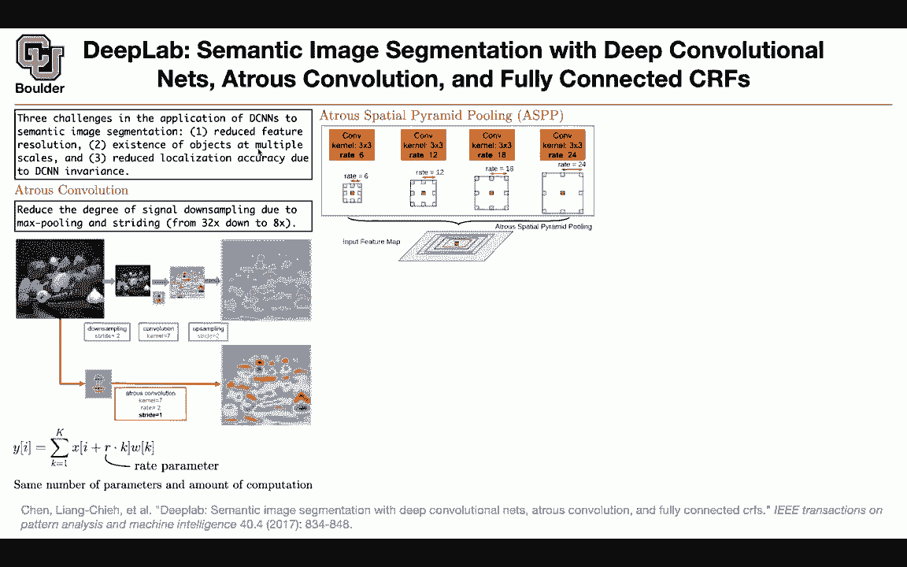
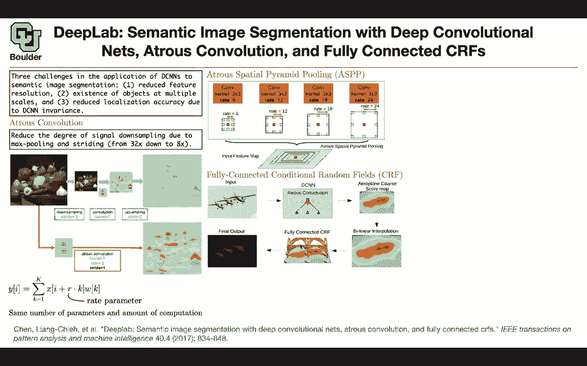
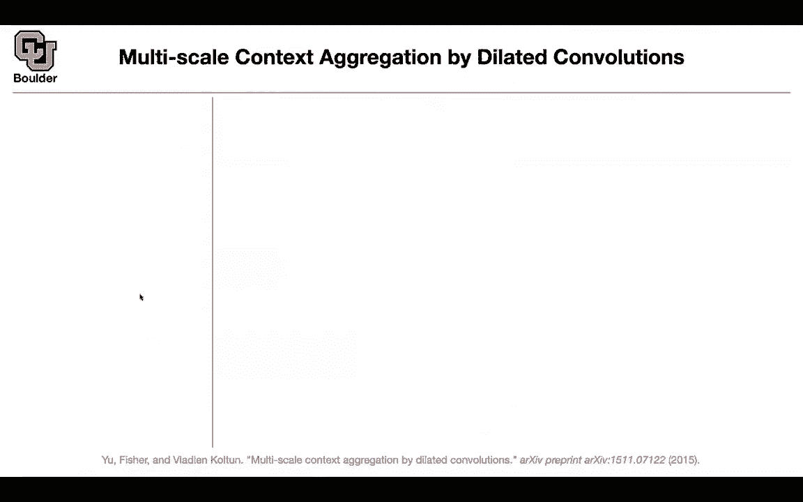

# 【双语字幕+资料下载】科罗拉多 APPLY-DL ｜ 应用深度学习-全知识点覆盖(2021最新·完整版） - P64：L31.1- DeepLab [续] - ShowMeAI - BV1Dg411F71G

last session we started with deep lab，and then，in general we are going to be facing，three challenges。

when you want to do semantic，segmentation one is，you are going to end up with a reduced。

feature resolution，if you want to do transfer learning，because the problem。

with semantic segmentation is that，if you have enough data probably you，don't even need to。

reduce your feature resolution you can，just train，a neural network a bunch of convolutions。

without any striding at all but the，problem is that we don't have enough，data。

why because labeling images，for the sake of segmentation is，time consuming is more expensive than。

labeling，the objects inside an image so we want，to do transfer learning therefore we are，going to。

take a network that is trained on，imagenet，for classification task and try to。

modify it for semantic segmentation，so we are going to end up with reduced，feature resolution。

the other reason that you end up with，reduced feature resolution is that you，want to。

take into account the what of the，picture what is inside that。

image so you want to have a global sense，of the image as well，so it's not only about the data it's。

also about trying to identify the，objects as a whole，inside an image so that's one problem。

the other problem is that you could have，objects have multiple scales some。

objects are small some objects are，bigger，and you want your network to be able to。

identify objects at different scales，and the other one is uh you're gonna，lose。

some localization accuracy because these，neural networks，have their own specialty convolutions。

have their own invariances，for instance they are locally invariant，to translations。

so you're going to lose some accuracy，because of localization，because of these invariances to deal。

with the first problem，you can use atrocious convolutions these，are convolutions when you introduce。

holes inside your kernel，and the objective is that you want to，reduce。

the degree of signal sampling for，instance you can reduce it from。

32x down to 8x so you're gonna lose，less information through down sampling，but how does it work。

uh let's say you have an image and if，your stride is two，you're gonna end up with a downsampled。

image now you can have a kernel，this is just a stupid kernel for，visualization purposes。

so there is nothing special about this，kernel you take that，and you convolve it with the down sample。

image，and let's say your channel has a size of，seven and in the end you're gonna。

end up with uh the convolved image，with the kernel now you can up sample it。

so rather than doing that you can do，address convolutions，how does it work at stands for it's a。

french word，and it means holes you can introduce，holes，inside your kernel that's going to give，you。

one，now you can do a regular convolution，with your image，with that kernel size and the rate is。

two because we introduced，a zero between every two pixel of our，kernel。

and the stride is still one and you，don't need you don't need to。

do down sampling anymore and then you，end up with a，better looking feature map so there are。

two ways to think about atlas，convolutions，one is that you start with a small。

convolutions and small convolution，kernel，and introduce zeros inside your kernel。

or you can implement it more efficiently，by keeping the kernel to have that same，size。

but then you're gonna your take your，pixels，every other pixel and that's gonna give，you this formula。

so you can have your input image at this，pixel，and every other pixel i don't know every，r pixels。

you're gonna convolve it with your，original kernel，so this is just for the sake of。

efficiency when you implement it，so you have two routes to implement it，one is。

introduce zeros in your convolution and，then do a regular convolution with your，image。

or you can say you are introducing zeros，in your image，or you're jumping pixels in your image。

the cool thing about apple's，convolutions，is that they're going to have the same。

number of parameters，so you didn't increase the number of，parameters it's the same number of。

parameters，and it's the same number of computation，but it's going to give you a。

bigger receptive field you're going to，be able to look，at a larger portion of your image okay。

that's going to take care of the reduced，feature resolution，and how are we going to take care of。

multiple scales you can take care of，multiple scales by having different，rates。

for your atrocious convolutions so if，your rate is six you're gonna，consider every six pixels apart。

you can have a rate of 12 rate of 18，rate of 24。 so each one is as if you're。

looking at your image in different，resolutions if you look at it in a。

smaller resolution you're identifying，bigger objects，if you look at it in smaller resolutions，you're。

looking at it looking at your image，locally that's going to help you，identify smaller objects。

so this is for large objects this is for，small objects and you can combine all of，them together。

with a simple concatenation so you first，do your convolution，at those convolutions with these raids。

you're gonna end up with a bunch of，feature maps，and then you're gonna concatenate all of。

them together and that's what a，spatial pyramid pulling is and it's。

called a pyramid because it looks like a，pyramid。

that's gonna help you take care of，multi-scale，[Music]，to take care of the reduced localization。

accuracy，because of convolutional neural networks，in variances，you can do a post-processing step so。

this is after the trending is done，this is when you want to do your，inference your predictions。

and then you're going to use a fully，connected，conditional random field but what is，that。

first let's take the big picture，into consideration you have an input。

image you do your actual convolutions，you end up with a course score map。

you can do bilinear interpolation to go，back to the original。

scale of your image and this is when the，conditional random field is gonna come。

in to help you identify these objects so，i think if we go to the math it's gonna，become more clear。

what exactly this conditional random。

field is doing，what is the final objective we have a，bunch of pixels。

let's just flatten them so you have，fixer 1，pixel 2 pixel 3 pixel i don't know 1000。

1001 etc so we flattened our，prediction and each pixel we need to，assign to it。

a label is it a background is it's pixel，and airplane，etc what comes out of our model is a。

probability，of this pixel being a background or this，pixel being。

an airplane we want to find x we want to，find the labels，we want to know at this location is it a。

background or is it an airplane，so our task is to do a label assignment，for each pixel。

so we want to optimize over x how are we，going to do it we are going to introduce，an energy function。

and in your energy function one thing，that is important to you。

is the probability we want to minimize，the negative of the log of the，probability of the label。

i is pixel i is one of these pixels，let's say a pixel here x is going to be，the corresponding label。

that we want to find so that's our，unknown，it's either an airplane or it's either，background。

or other objects or other categories，p is coming from the predictions。

of our deep neural network so p we know，because we trained it it has a bunch of。

parameters but we joined it，now the parameters are fixed because we，want to do inference。

if x is x is a number，it could be one two three four five six，up until。

i don't know 21 maybe there are 21，objects，in your image or there are 21。

categories for each pixel now this is a，number，let's say your number comes out to be，20。

 you go ahead and read the 20th，entry of your p because p is a，multi-valued。

probability distribution so you're going，to read that probability value。

you could use a log and multiply by，negative，and it's as if you are maximizing the。

probability of that pixel，so if you do that then if you forget，about this term。

you are just finding you are just，reporting，the pixel you are reporting a label。

for pixel i that's going to maximize the，probability so you're just going to look。

at the probabilities that your network，is outputting and choosing the maximum。

so this pixel is going to have，i don't know with some probability being，a。

an airplane and let's say the，probability of it being a background is，bigger than。

an airplane so your energy function，without these terms is gonna output。

the background because it had a bigger，probability so so far it makes sense。

what is the objective of the other term，the other term is to take into account。

that the neighboring points matter if，you are within this object。

the likelihood of you suddenly becoming，a background is very low it should be，very low。

and we want to incorporate that into our，model that's why you're gonna introduce，this term。

theta i j and that's going to take into，account，the proximity of these points and two。

pixels are close to each other，if their locations are close to each，other so p i p。

j stands for the pixel rotation or their，colors，are close to each other their red green，blue values。

are close to each other so if you are，close to each other you're going to give，it a bigger weight。

you want to inherit some of the，properties of your local neighbors。

and if they are far from each other，they're going to not affect each other，that much。

if two pixels are far from each other，this weight is gonna be small。

so that term is gonna be small and then，you're gonna end up with。

the probabilities only and mu is just an，indicator function，if those two pixels are the same then mu。

is gonna be one otherwise it's zero，that's how you're gonna find x。

so mathematically it should be clear but，computationally it's it's gonna be a，very tough task。

solving this problem but apparently，there is a nice algorithm。

nice and fast that's able to solve this，problem very fast，that's why it's feasible you can use it。

at the output of，the predictions of your network any，questions about crfs。

i had a question about just the，dimensions of this thing the。

the capital p of x i is vector valued um，with the dimensions being the number of。

classes possible right yes and then so，theta i it has the same dimension as p。

or is theta i one entry and theta，is the same dimension as p i is counting，your pixel。

p is a vector and p of，x i is a scalar depending on，x i so x i you can think of it as the，index。

of your vector it's going to identify，which element of the，capital p we are looking at yeah okay。

for example，i could so you're gonna pick up the，100th element，of，x i is scalar。

okay that's a scalar this is also a，scalar and then，i was curious what the rationale behind。

having the，the w1 exponential which involves，both like the distance and the color，difference。

but then also doing the w2 exponential，which again，incorporates the pixel position distance。

uh so you are introducing more，parameters so these stigmas are going to，introduce。

uh the it's the scale，of uh it's basically telling the，exponential。

how it is decaying how fast this decay，so you're gonna have，three different hyper parameters so it's。

gonna give you more flexibility，to focus on the pixel positions and to。

focus on the pixel positions and the，colors，okay i guess i guess that makes sense。

you want to know like if they're just，close by each other，but also if they're close by each other。

and of similar color，yes and then is i i，capital i sub i is that also a scalar or。

is that like an indicator variable is，that just 1 2，3 if it's a red green blue or is that。

the amount of red，between like 0 and 256 or whatever it is，no it is the amount of。

red green blue so it's a vector okay，of three real numbers okay it's three，real numbers。

in the range of um like whatever the，the pixel color could be like zero，through 255 if you're doing。

like the normal coloring yes or if you，to one，okay uh this makes sense thank you any，other questions。

so we introduce three concepts and，they're going to be used in，other papers as well these are。

fundamental concepts，one is convolutions with holes，attributes convolutions。

the other one is the spatial pyramid，cooling，for multi-scaling and uh crx it's a。

post-processing step，to take care of the loss of the accuracy，that you have because of your neural。

network being invariant to，tiny perturbations is the actress，spatial pyramid pulling um a way。

of kind of um or a substitute for，a standard convolution where you take。

like the convolution with this rate six，or eight 12 right 18，and rate 24 um in serial。

and then add them together at the end no，it's not，it's a different thing it has the same。

computational cost，but it's going to give you the，flexibility in the field of view。

okay so it's a way of generalizing a，three by three convolution or i guess。

just changing it so that it has a wider，field of，um vision yes exactly so each out。

each output pixel can see like a 25 wide，window or whatever 24 wide window。

instead of a three wide window，yes so another way to think about it。

you can it's as if you're inputting to，your network，images of different resolution you can。

have a high resolution image you can，reduce the resolution push it through。

your combination reduce the resolution，another time push it to your company but，rather than。

pre-processing your image you can，actually apply that，inside your neural network and now you。

are just pushing one image，and then a network is knowing what to do，any other questions。

okay perfect let's see some results so，those results you're gonna see in。

self-driving cars the way that i'm，going about this course is that i'm，trying to。

there is a huge hype about deep learning，for instance if you google this paper。

or if you google cp cityscapes you're，going to find very nice，videos on youtube of what the。

applications are，but that's and that's an easy task for，you to get absorbed into the hype。

i want us to go in a little bit deeper，are doing，because if you only look at the results。

they look really impressive，but how did they get there so let's see，this is an image。

that's the ground truth those are the，labels，this is the prediction of the model，before。

conditional random fields and this is，after conditional parameters。

i think the image is too small for you，to see the differences，but for instance here you have some。

pixels that are getting classified to，some other class but things are going to，become more。

clear if you have a key performance，indicator，i think these are mean intersection over，union。

numbers on pascal voc，data you can have attributes spatial，pyramid pulling s is having。

6 12 18 and 24 for its rates，l is a larger field of view that's going，to have 12。

24 two times these so the exact numbers，you can，get from the paper but it has a larger。

field of view and b for crf and crf is，helping all of them，you。

get better results and you can look at，mean intersection，over union that's your baseline if you。

do multiscale，you're going to get 71。27，if you train it on a different data set。

so these are just more data you are，going to increase the accuracy。

not the accuracy mean intersectional，reunion the performance，if you augment your data if you。

have a large field of view if you add，asbp，and if you add crm so you're gonna have。

a better performing，algorithm any question so far why is，large field of view only used in that，one。

instance is it just that that one data，set has a bigger resolution。

oh this large window view is another，paper oh okay，and they're comparing their performance。

they say that aspp is gonna do，he's gonna take care of large window。

view so in the large field of view paper，i'm guessing they did data augmentation。

and they used the coco training set and，the msc，yes and that's the number they are，reporting。

now if you remove that change your，method to aspp，any other questions so we introduced，three topics。

actress convolutions pyramid cooling and，crs，and we are gonna build on actual。

convolutions in the next paper。

one nice one last question about that um，really quickly the the heat maps are，showing the values。

of theta or the energy function these。