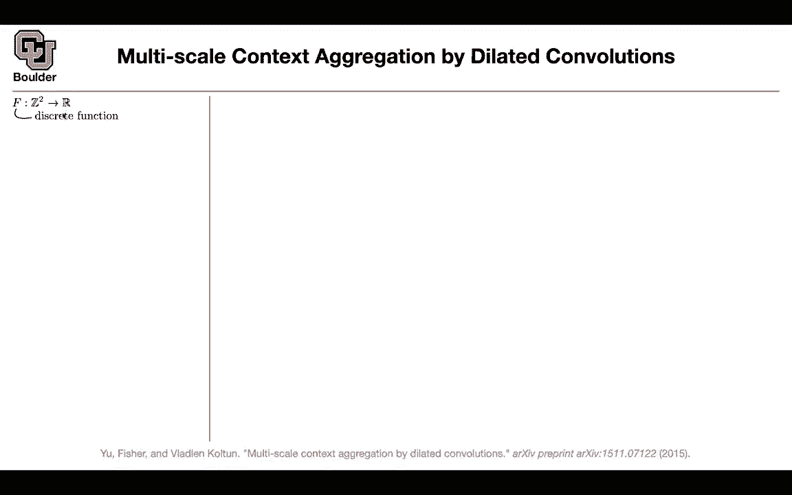
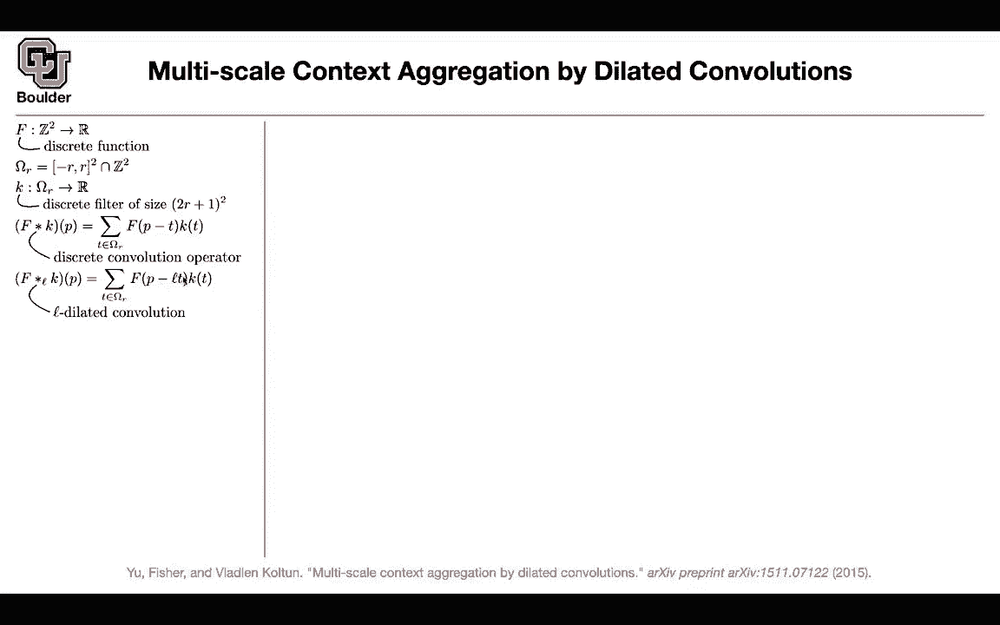
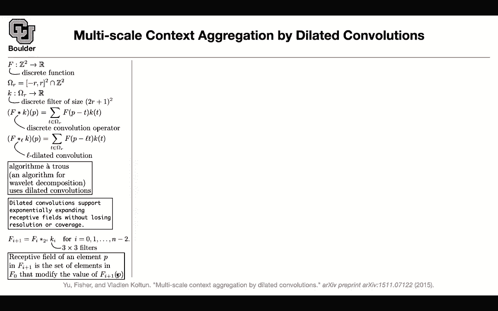

# 【双语字幕+资料下载】科罗拉多 APPLY-DL ｜ 应用深度学习-全知识点覆盖(2021最新·完整版） - P65：L31.2- 扩张卷积 - ShowMeAI - BV1Dg411F71G

Let's do multiscale context aggregation and we are going to use dilated convolutions which are basically alluuous convolutions convolutions by wheat holes。

 so you're going to see that word being interchangeably used but let's start with a little bit of not because I think it's a nice way to connect the dots let's say you have a discrete function and that's your image your image could be thought of as a discrete function from your pixel locations to your values could be R3 red green blue or it could be R like D data set that you had。

So it could be a single channel but it's a discrete function。

 we are going to define our domain for the kernel and it's going to be from negative R to r square intersection with z squared so it's a small window in your space your kernel is going to be a function from this space to R and how many discrete filter values you're going to have the discrete size is going to be2 r plus one it's going to r plus a zero number that you have and you have a height and a width and that's going to give you square you can think of a discrete convolution I think all of us know what convolution is because some of us have math backgrounds almost all of us so this is how we remember convolutions so that's a nice way to connect the dots you want to know the pixel value after the convolution at this particular pixel and then you're going to evaluate your function your input around a neighborhood of your peak。

So and then multiply by the can。

Another way to think about dilated convolution is that you're going to multiply your T by by an L that's your rate how far to the left and how far to the right you want to look and how much your how many pixels of your skiping ats convolution is actually the algorithm was first designed for waveleticcoms and they were using dilated convolution but nowadays people just use atlus convolution so that's not a big deal what you can do with at convolutions or dilated convolutions is that you can have exponentially expanding receptive fields so what is a receptive fields first how we're going to get exponentially expanding you can get it this way you start with your input image you have a dilation of let's say two to the power zero so your dilation factor is one so this is just the usual convolution and you're dilated with a。

You canvol it with a three by three filter then you take the output of that now you increase your dilation rate。

 you make it two， then you go to the next layer， you make it two to the power2 that's going to be four two to the power three that's going to be eight etc you get the idea and I promise to give you the exact definition of a receptive field and this is where we are gonna see the exact definition if you have a particular pixel P this set of elements in your original image that modify the value of this pixel is the receptive field so is is clear so you take a pixel at the layer that you are currently at at the feature map of layer I plus one and then you go back to your original image and try to identify which pixels are modifying this value or which pixel are modifying are responsible for modifying this value。

🎼So Theodore is asking2 to the power I is the dilation rate1 before yes exactly so that's a dilation rate so this like star sub two to the I is just a address convolution with that rate exactly so notation wise this is the convolution with this rate and to be precise this is the actual receptive field size after doing these operations one after another but rate of one rate of two rate of four rate of two to the power I and that's going to give you this receptive fields so that's the window of your image that you're looking at and the other thing is that because you're sliding these windows you're going to take a look at all of the pixels in your original eventually and then I'm guessing we have to do normal stuff with padding or zero padding or like reflections on the boundaries Yes of course and that kind of just depends on what you want to do exactly and this should answer your question this is the receptive fields or the first layer。

This is the receptive fields for a next layer and this is the receptive field for the layer after this one has a rate of a dilation rate of one now these one has a dilation rate of two and these one has a dilation rate of four any other question and yes the recursion matters you're going from one layer to the next one and you're looking at windows of three by three so these are all the pixels that are gonna affect your second layer these are all the pixels that are going to have an effect on a pixel in your third layer etc so if you change any of these the pixel value in the third layer is going change and that's going to give you a receptive field but this is powerful stuff dilated convolutions let's see how you can use it in a neural network architecture your dilation factors all of the convolutions are three by three except for the last one the dilation factors are going to be one dilation rates are going to be one1。

2。

or816 and then one etc Some of the layers are gonna be activated by your re except for the last one and you can take a look at the re field this is three by3 that one is5 by5 This is5 by5 because you have a three by3 convolution and then the next one is also also3 by3 that's going to give you a5 by5 now this one is where you're gonna get your nine and then 17 by 1733 by 33 etc and you're gonna have two architectures in terms of your channels you can have a basic channel and that's going be the same channel number of channels for all of your layers or you can have different channels2 c2 c4 C8C16 C etc that's cool this is a practical issue you're trying to train this network and then sometimes you don't get good results when you go to the computer you have a brilliant idea。

You see it's beautiful but then you take it to the computer and things are not gonna to converge with deep learning you guys have to be very patient Perhaps you have to play along with your initialization Perhaps you have to make some modifications to your activation so these small changes are really important when it comes to deep learning and we are gonna see it here as well one way to initialize is to use the identity initialization if you are not using residual connections these identity initialization is behaving similarly to a residual connection and it's gonna to make your layers closer to identity at least initially during training what you do is you take the channel dimensions let's say channel dimension a for the input channel dimension B for the output that has to be a one if these two are the same otherwise it's a zero so that's an indicator function and the other one is when you come。

ピ。You are going have an identity if you're on the diagonal of your k otherwise it's a zero I think we are over time I'm going to stop here for those of you who have questions you can stay unasked some of your classes you can now I have a question so the goal with this this dilated convolutions is to increase the receptive field like we that's we in this figure C like because we see that the receptive field is almost the entire original image that's a good thing is that correct yes so it's going to give you more of the global context of the image okay and so what what's the downside of like between figures A and B why don't we just increase the the rate so that we we get up to。

A higher receptive field faster if that makes sense So one way to increase your receptive field is to stick to three by three convolutions and then you keep repeating it in your layers eventually you're gonna have a receptive field as big as the original image but then now your network is going to be very deep and the deeper your network the harder it is going to be to train it the other problem that that approach is going to have is so you are going reduce the resolution if you use a strides and that's going to end up with you only picking up the global objects and you're going to end up with a lower resolution the deeper you go in your network probably you're gonna to have a bunch of strides and then that's going to give you a lower resolution and then you have to resolve it to the original if you go very deep with three by three convolution so ats convolutions are going to help you go less deep。

Yeah， and get that larger receptive field earlier。 Yes， we get it earlier。 and then you。

You don't lose much local information but so what's preventing you from having like a stride of or sorry a rate of like nine at the first layer so that we we jumped right up to a receptive field a larger receptive field I guess the way that this is working is really smart your first one has a dilation factor of one the next one is double that but if you make it triple or four times you're going to end up with a bunch of holes here yeah it makes sense you'd be like losing too much information sort of yes so that's exactly what we were discussing with the other Okay if suddenly it's too big then you're gonna have a bunch of holes okay that your convolutions are not looking that yeah okay thank you。

