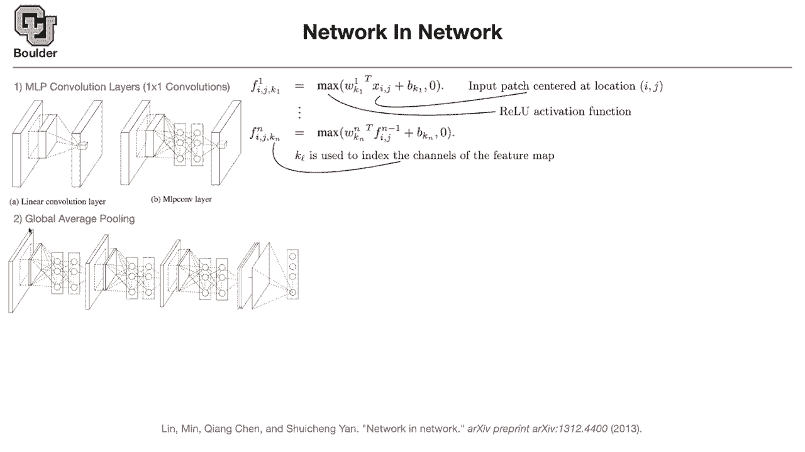

# 【双语字幕+资料下载】科罗拉多 APPLY-DL ｜ 应用深度学习-全知识点覆盖(2021最新·完整版） - P6：L3.2- Network in Network - ShowMeAI - BV1Dg411F71G

so there is this paper networking，network，which i really like and it started，many of the ideas。

that modern neural networks are using，but it's not getting as many attention。

as the other ones are getting，because there is this challenge，in computer vision on imagenet dataset。

and the papers that do a great job and，beat，the other neural networks on that。

challenge are gonna get cited，without anybody reading them okay，but this net this paper。

has very nice ideas that other paper in。

uh one of them was this。

they wanted to put a network the the，general idea is that they wanted to put。

a network inside another neural network，so they started with a linear，convolution layer。

which is basically you have a filter you，dot product it with，that portion of your image or that。

portion of your input，and then in the end you're gonna get a，neuron here sitting here。

they said between this layer and the，other one，we want to put a neural network and they。

an mlp a multi-layer perceptron a。

fully connected neural networks so there，is nothing special there。

it's the basic the most basic type of。

neural network that they can find，they wanted to put it here and they。

later on they understood that what they，were doing，so many modern networks used one by one。

convolution for。

various reasons for various reasons but，these guys wanted to have a networking。

network，and how does it work you have an input，batch。

centered at location i and j so this is，your input batch。

center that location i and j，and then you put everything inside the，vector so。

that's input patch you're putting it，inside a vector。

and then correspondingly you're gonna。

have a bunch of weights。

that's your filter，and then you multiply these two together，add them up。

add the bias do your value。

activation rectify，rectified linear units which is just。

maximum of these guys and zero，and as i said many of most of the。

operations in deep learning are just，point wise。

this is just a number，it is either positive or negative if it，is positive you keep it if it is。

negative you ignore，it that's going to be your value，and that's going to give you your first，layer。

the output of your first layer and what，is k here。

k is indexing the channel so，that's one of your filters you can have，multiple filters。

so this is one filter if you add another，filter that's gonna give you another。

dimension here on the channel dimension，so you're increasing the channel。

dimension k is counting the channels。

now you can put everything channel wise。

in a vector that's going to give you。

for instance f1 which is a vector，now you multiply it by a bunch of，weights at the bias。

value that's going to give you the next，layer and so on，that's what they wanted to do but。

in the end it ended up being just a one。

by one convolution，so the idea of one by one convolution。

was first introduced in networking，network。

to the best of my knowledge what is the，other idea。

so that's their network a bunch of。

networking networks，in the end if you remember we had fully，connected layers。

they said those fully connected layers，are not necessary。

you can just average out these are your，filters。

out，that's going to give you a number you。

put it here，the second channel is going to give you。

an average you put it here the third one，here and then。

the last guy here so rather than。

flattening out a convolution，you just average it and then put it。

different dimensions，and then the rest of it is just。

one layer of。

soft max which is going to give you the，probabilities and then you can do your，classification。

so the idea of global average pulling，and one by one convolutions was。

introduced in this paper，one cool thing about global average。

pooling，is that you are getting rid of those。

fully connected layers in the end。

and it has another application，this is good for stopping regularization。

so it's gonna do regularization for us，another application is that now。

this averaging is gonna get rid of the。

here so the dimensions of the image，doesn't matter。

that much anymore so it has two，have any。

questions i would be happy to answer，about dropouts。

about one by one convolution and about，global average pooling，and if anybody wants to leave you're。

more than they'll continue，thank you professor。

no problem so would you mind just uh。

once。

yes of course thank you。

so in the end of whatever operations，that you had you're gonna end up with a。

tensor okay and your tensor。

is gonna be。

it's gonna have a height it's gonna have，a，width and it's gonna have the number of。

channels that you have，one channel two channel three channel up。

the thing is that you take one of these，channels。

and then you average those numbers。

and put those numbers here and your，averaging is going to be 1。

and then the summation over，whatever pixel value that you have here。

does that make sense yeah and。

and you're using um so like throughout，the whole，network you're using these one by one，convolutions。

and then global average pooling is just，this last sort of。

step exactly okay so you have regular，convolution here。

and then one by one calculations here，and then a regular convolution one by。

one regular，one by one and in the end average。

