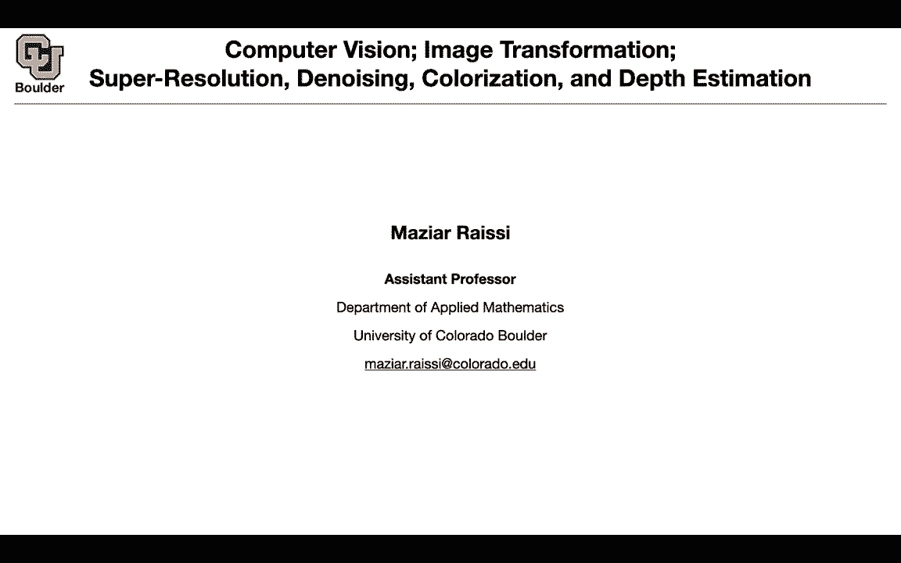
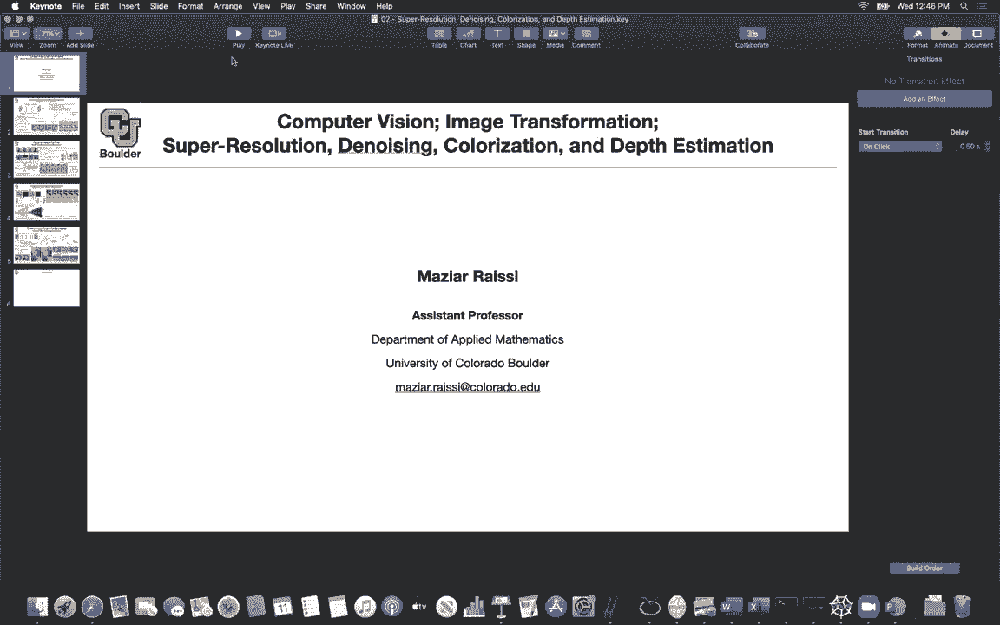
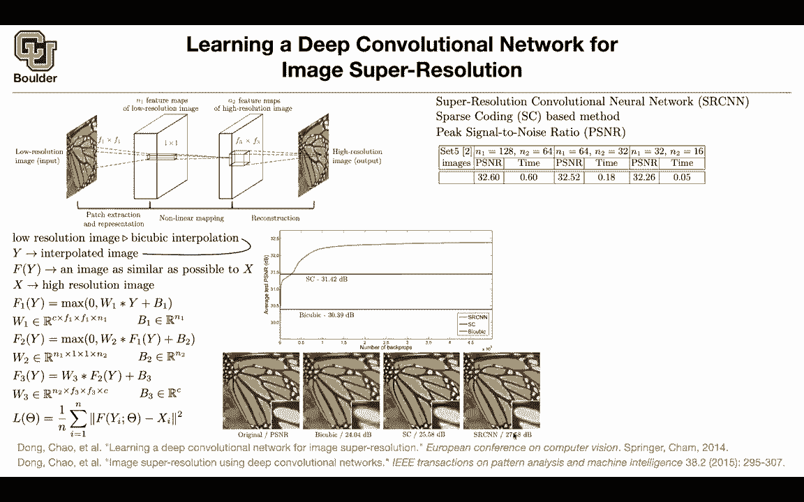

# 【双语字幕+资料下载】科罗拉多 APPLY-DL ｜ 应用深度学习-全知识点覆盖(2021最新·完整版） - P70：L33.1- 超分辨率卷积神经网络 - ShowMeAI - BV1Dg411F71G

Any questions about last session。

So last session we finished up semantic segmentation and we finished with this paper that was combining the encoder decoder structure of a unit and the actual separable convolutions and the idea was you wanted to do semantic segmentation basically pixel wise classification now were going to change the tone a little bit and consider somewhat more classical problems in computer vision for instance super resolution it's a classical problem denoing colorization the estimationimation and these methods have applications in in games in video games video gaming that's one application for instance you might have a low resolution image and it's a low resolution rendering of your 3D environment now what you can do is。

Have a neural network in between that's taking a low resolution image and making it super super resolution。

 basically increase the resolution， and then it's going to increase the quality of your video games。

 and that's actually what NviDdia is doing for there。

Deep learning super sampling and super resolution。 That's exactly what they do for denoising。 Again。

 you're gonna have applications in exactly like three children is saying what is the LSs。

 That's exactly what that is。 The other one is denoising when you do your ray tracing of your 3D environment。

 You're gonna to end up with a noisy image of the environment。

 but you cannot show your gamers noisy image because they cannot play the game。

 they're not going to be happy about your product。 So you have to denoise it and basically you have a noisy image。

 you want to transform it into a noless image。 Sam thing for colorization and depth estimation is gonna have applications for self driving cars。

 You want to know how far that object is from your car etc。

 So there was a question what does the LSS stand for。

It just stands for deep learning super sampling thank you， Kevin。

 and the other application could be for these days that we are all。

For instance and we are giving our we are having our meetings over Zoom and the idea is that you want to transfer through the internet a low resolution image and then have some post processing on the computer of the person who installed Zoom for instance to do the super resolution then it's going to increase the quality of the images while making it cheaper to transfer one image to the other end from one user to the other user so these are the applications。

And let's start with the first paper that tried to consider solving this problem using deep learning prior to deep learning people will were doing a three step process they would extract some patches from their image they would then create a representation of those patches then they would take those representations and the patches and push it through a nonlinear mapping and then in the end they would do a reconstruction step so these paper came along and said you can replace all three of those steps with convolutions we know that convolutions are gonna extract patches on the round this is gonna to be a sliding window of your input image so the patch extraction is straightforward with convolutions the representations we are going to learn it with a bunch of weights or a bunch of filters for instance your filter could be offsize F1 by F1。

By N1。 And that's going give you。Your feature maps and that's going to give you the representations that you are looking for then now linear mapping is a one by one convolution that's going to give you a bunch of transformed feature maps。

 let's say you have N two of them。And then the rest of it is reconstruction What is the value of these pixel you're going to take towards those features and then convulve it with a filter and then that's going to give you your high resolution image Now what you're going do is feed this with data and you need to come up with an appropriate loss function so let's try to make things more rigorous more mathematical so your first low resolution image first you need to do an interpolation on it for it to have the same number of pixels as your output so that's the first step you take your low resolution image you pipe it。

 you push it through byline by cubic interpolation and that's going to give you why your interpolated image and this is why what you want to do is this network is going to give you a nonlinear function that's going to give you f of Y and F of Y is going to be your superres image and therefore you want it to be as close as possible to your high resolution image to the one that you。

I know you're used to X going through a nonlinearity and then giving you Y。

 but notation wise Y is going through a bunch of nonlinearity and it's giving you something similar to X。

 So let's see what is the patch extraction step that's just your convolving your input with your filter and then applying in the Ra activation So that's for F1 F2 is gonna get the output of F1 convolveed with a bunch of weights Now this time these are just1 by1 convolutions and then do you do R that's the nonlinear mapping for the reconstruction there is no nonlinearity you just convolve it with the output of F2 and then add your biases and that's gonna to give you F3 and the entire thing is gonna be your nonlinear function What is your last function you have a bunch of parameters theta these theta are w3 W2 W1 B1 B2 and B3 your function is。

tries by theta it's taking as input a low resolution image and then you want it to be as close as possible to your high resolution image and by the way。

 generating data for the super resolution task is very simple。

 You start with a high resolution image and then you make it low resolution that's it。

 you start with X and then you make it low resolution So it's easy to lose information and then you're going to lose information So generating input output with data for this task is very easy as long as you have high resolution images you can train this with as many data as you want So there is no transfer learning going on here because you have enough data So a bunch of jargons SCNN stands for the method in this paper。

 super resolution convolutional network Sprse coding is an alternative method prior to deep learning and the way that you measure how good your predictions are how good your algorithm is performing。

Is usings peak signal to noise ratio and this has a formula very close to your loss function and there is debate。

 whether this is the correct way of measuring how good an algorithm is doing or no。

 but we don't want to worry about the debates in this class。 we're just going to use that。

 But there is a high correlation between this loss function and the evaluation metric So how is the algorithm doing it's giving you 32。

6，32。5 32。26 for peak signal to noise ratio and what is changing from one panel of this table to the other one is the number of feature maps and 1128。

64 or different sizes。 So the smaller your network。

 the faster it's going be So this is really fast to do your super resolution。

 And how do you compare to the previous state of the art prior to deep learning This is by cubic interpolation This is。

Se coding and this is the deep learning method and what you are reporting is peak signal to noise ratio and qualitatively this is how the predictions are going to look like that's the original image and we are going to zoom in onto this part of the image。

Because we want to focus on how good the algorithm is doing in super resolving so we have to zoom in on parts of the image。

 This is by cubic， this is a sparse coding， and this is what the deep learning message is doing S our CNNN。

I asked you about the generation of the low resolution from an original high resolution。

 do you do that just by I guess averaging like maybe a two by two pixel into one sparse pixel or do you do subsampling and just throw out every other pixel left and right and off the bottom throw it out。

It's very simple you just you pick some of the pixels and you you pick it。

 you keep it and then you drop the rest and then you just make those pixels bigger and then you have the same image okay yes so that's pretty straightforward it's not that complicated and then it's easy to lose information。

The the bi cuubic here in this table of the errors it has constant errands because the bicuubic interpolation formulas deterministic so it doesn't depend on anything else right no there is no optimization going on these are the iterations of the optimization so there are a bunch of other methods that you're comparing with and you can have SCnn you can actually train SCnn and images in imagenet and you have a lot of images in imagenet and you don't care about the labels you don't care whether it's a dog whether it's a cat whether it's a building you don't care you just take the input image and then you make it low resolution that's going to give you the input output the data' familiar with signal the noise or what is what is considered the noise in this case you can think of your low resolution images as noisy versions of your high resolution image because at one location。

Where you have information in the high resolution image the value is not the same if you just copy and paste it here it's just gonna to be a different value so you can think of low resolution as noisy images as well it just doesn't have the correct value if you look at the point here is not going to have the correct value if you copy and paste from your low resolution image so the noise the noise itself would be the difference between the high resolution and the low resolution if you just copied it with the four neighbor cells back up to the dimension of the high resolution and took it a pointwise difference Yes so that's going to be your noise Okay okay and then you can qualitatively compare the prediction of this model and previous state of so this is the first paper。

To the best of my knowledge， that's using a convolution on neural network for these tasks with some success。

