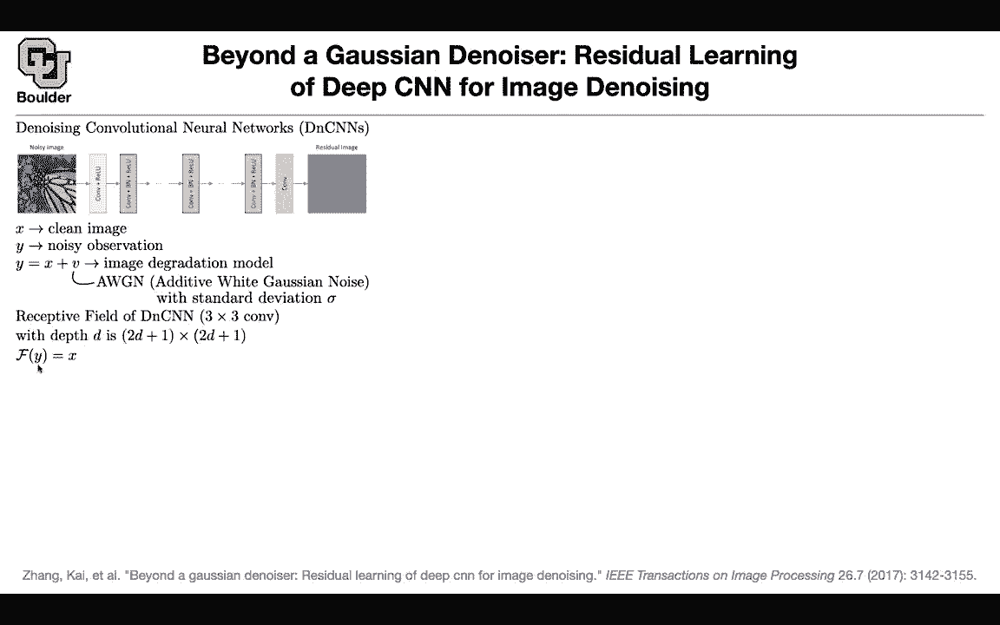

# 【双语字幕+资料下载】科罗拉多 APPLY-DL ｜ 应用深度学习-全知识点覆盖(2021最新·完整版） - P73：L33.4- 去噪卷积神经网络 - ShowMeAI - BV1Dg411F71G

let's see another paper for image denoing， so the idea is the same rather than the same as before rather than learning a fully- nonlinear function from one input image to the denois image you can actually learn the residual and the residual image learning this one is much simpler so it's the same idea as before and what is the math behind it。

 there is a clean image， there is a noisy observation you could have additive y Gausian noise this is the assumption that other methods made but you don't have to make this assumption as we are going beyond the Gausian denoisr so you don't have to make this assumption but then the idea is that you can actually learn the residual mapping rather than putting your network on F that's mapping Y to X Y is the noisy version x is the clean image you can put it on the residual mapping and try to learn the residual and。

You change your loss function to learning the residual so that's just the math to give you why your data is going to be why I minus X and we know that that's just the residual and we are gonna to learn the residual and these are some qualitative examples and apparently the method is not that sensitive to a stochastic gradient decentcent or Adamam or other choices of optimizers you can be noiseis it for instance this could be the output of a ray tracing algorithm you have your 3D environment you do your ray tracing and that's going to be your image you don't want to show that to your customers so you first be noiseisy and then you show that what is cool is that and we have this discussion that what is the relationship between thenoising and super resolution。

They are or debing they are the same in the eyes of this algorithm they they are all just denoing and you can see that's the image on portions of it you're doing Gaussian you're adding Gaussian noise on portions of it you're reducing the resolution and on portions of it you're doing deepbing you're compressing it in Jpeg format these are the residuals you can see that the noise pattern is totally different from the Gaussian noise pattern this is definitely non Gaussian this is Gaussian and this is something different and then the same network is gonna denoise it and here is another example any questions in those two figures at the top when it says with or without R is that referring to some kind of reinforcement learning they're using noise residual this is transfer R is transfer residual I think they're just looking at using their method versus now。

residualYes in okay and then the other one is with Nor without so apparently with residual and we patch norm the red curves are doing the best if you think that peak signal to noise ratio is the correct matrix。

Any other questions This could also be used in like you were talking about Zoom and I know like Skype does the same thing when they're doing video compression it's usually losty and that's why you end up with like a blurred video feed and so couldn't you put this on the back end like on my computer after receiving a video stream from you as blur or or noise and do this to it Yes before I answer your question we are out of time they once you want to leave and have other meetings they can leave and they want to want to stay and asked I'll be around Yes to answer a question there is actually a new by N video and they claim that their method of compressing images is much better than doing it in normal way I don't know whether they're using what they're using but yes you are right you can use it for that application for Zoom or Skype or etc。

ex only other time I've seen denoising is with like Gaussians smoothing for time series and I know there then you have the problem that if you did want to have something with a step in it like if the signal actually had a step it would then lose that sharpness and I'm guessing that's the same thing that happens with images like this image of the castle where it goes from the roof to the sky there should be a very steep edge and did they talk at all about like the behavior of edges in this case and with this algorithm like is it better in that regard to I think the previous one doing a job the edges and edge and then this brought up the one last question had which was looking at these these errors versus depth charts it looks like there's an early optimum around like。

of 10h or 12 ish and then it drops and then it comes back up later and it makes me think of a lot of these like early stopping algorithms when you're doing training and you stop when you hit a plateau and start getting worse and how would you know that things aren't going to get better later or like in this case it seems like like if you go up to a depth of 12 and things start getting worse as you go up to 15 it's hard to believe that things would get better later on I think you're confusing the depth with the training steps for early stopping you're actually gonna look you're gonna be patient a little bit before you stop。

You're going to follow your training， your evaluation metric on your validation data set and you're going to watch it for a while and if it's going down you're going to stop it or if it's going up depending on what you want to do of your metric。

But here it's a different story it's about the depth so after the earliest stopping whatever retreat that they' are using it's after that they come up with a single number for peak signal to noise ratio and they are they are reporting and the other thing is that these analysis and deep neural networks are not that stable as you want them to be compared to other methods yes they are going to go down they're going to go up but you look at the trends and you do it for different scales for instance scale factors these systematically studies depend on the initial configuration of your rates and biases they depend on the random seed on your computer etc。

The question I had was looking at theseum you're talking about these like dead feature maps in the top left the things that are blacked out that means that when you do back propagation once they're zeroed out they have zero gradient and they're never going to change from zero right that's hard to say because that depends on your batch。

Maybe a different batch goes in and then they're going to activate again， okay。

Is it true in a general sense that the feature maps which are closer to zero or uniformly zero aren't they always just going to generate zero activation and so therefore the actually reduced the。

These speech maps that you're saying， they go onto this image。

 they depend on that image change the image you're going to get zero somewhere else got it so those those are not。

Values of the weights， but the values of the activation once the image has pushed through yes， okay。

 but if you were looking at the weights， if you were looking at the the the weights of one of the layers and they are all zeros。

 is it true then that they're going to stay zero forever not necessarily。

No because the rate might be zero， but the gradient of the loss with respect that rate might be on zero non zero got it yeah App so you need to look at the grade yeah okay thank you that's that's all I've got。

Any other questions？