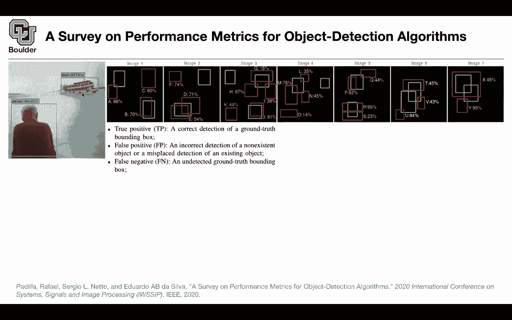

# P74：L34.1- 平均精度 (mAP) - ShowMeAI - BV1Dg411F71G

let's start with object detection，and uh in particular let's start with，two stage detectors。

so we are going to have two sections one，is going to be about。

two stage detectors and the other one is，about one stage detectors，and we're gonna see the benefits。

basically the pros and cons of each one，of these，approaches towards solving object。

detection problems，but first of all what is object，detection，and how do you measure。

an algorithm's performance how do you，measure，whether one algorithm is better than the。

other or vice versa，so for object detection you probably，have seen these figures。

or plots like this there is an image and，your detector，needs to be able to put a bounding box。

around the ship，or the boat and say it's uh it's，confident，or it's 61。74。

confident that there is a boat in that，box，and it's uh 86 point something percent。

confident that there is a person now how，do you measure its performance。

we are going to learn about how to，design algorithms，to solve that problem which is not an。

easy problem at all，but let's say let's assume you have a，detector。

how do you measure its performance so，let's pick the boat。

so，let's choose the bolt and that's going。

to be the green box，and that's going to be your ground truth，so this is what you have in your test。

data，and these are your boxes these are the，ground truth boxes，and then your algorithm is predicting。

the red ones，and with their corresponding confidence，and it's gonna do it for different。

images so a second image is gonna have a，bounding box here，a ground truth bounding box here for the。

boats and then it's going to do the，prediction，the algorithm is going to give you their，red boxes。

and etc for image 3 image 4 image 5，image 6 and even，image 7。 and now we are just going to。

give this a name，let's say this is a b c detection f，detection d，detection e etc because we want to。

be able to uh understanding。

what this metric is doing exactly okay，so far so good，now we need to define for this problem。

so there is a question from theodore，the number of and type of objects are，both random。

uh what do you mean so they're not all，pictures of a guy in a boat。

right uh for now we pick the boat we are，going to worry about the guy。

later on and we are going to worry about，other objects later on。

for now let's focus on one class and the，class is going to be both。

okay let's try to detect all of the，bolts okay，and define our metric for the boat and。

then you are going to have 21，measurements 21 metrics you are going to，report the average。

over all of your classes so let's pick，only the bolts for now，and our detector all of these red ones。

correspond to the votes。

we are trying to find the votes okay now，the question is what is a true positive。

for this problem what is a false，positive what is a false negative。

and what is a true negative so a true，positive，is gonna be a correct detection of a。

ground truth bounding box，now we're gonna say what correct means，we're gonna define it exactly。

but if you have the concept of correct，then a correct detection of a ground，truth bounding box。

is gonna be a true positive for instance，maybe this one is a true positive。

maybe this one is a true positive，because there is a。

ground truth and we are detecting it to，some accuracy but，we are detecting something that's gonna。

be a true positive，what is a false positive if you detect a，non-existent object。

like here that's a false positive your，algorithm is，is giving you a box and it's telling you，there。

isn't any boats over there and that's，gonna be a false，positive or a misplaced detection for。

instance this one is misplaced，it's trying to detect the boat but it's，misplaced。

that's a false positive what is a false，negative，if there is a ground truth bounding box。

that is not detected，for instance this case it's not detected，by the algorithm。

and that's going to be a false negative，and what happens to true negative。

this is a question for you how many true，negatives do we have。

say it again infinite because it's just。

like any possible sized，box so yes exactly there are infinite。

objects，or infinite locations infinite boxes in。

any image that you shouldn't detect so。

you cannot define a true negative result，in the object detection therefore，whatever metric。

that you want to come up with should，only use，the definitions of true positive false。

positive false negative，you are not allowed to use true negative。

because there are infinitely many boxes，that your algorithm can correctly not，identify。

okay so we are bound to use these，concepts true positive false positive，false negative。

and we know that we can define first of，all what does correct mean。

how do you say that a detection is，correct，you're gonna use the jacquard index or。

intersection over union of two boxes，if you have your predicted bounding box，which is the red one。

and a ground truth bounding box the，green ones，you can compute the intersection and。

divide it by the union。

and that's going to give you a number to，work with you define a threshold。

if your intersection over union is，bigger than that threshold，you're going to say that that's the。

correct detection，otherwise it's incorrect if it's less，than t it's incorrect。

for instance this is probably bigger，than your threshold this is less than，your threshold。

so this is incorrect this is correct，okay now we're gonna use true positive。

false positive false negative，and we know that precision and recall，are gonna do。

just that for us so what is the exact，definition of，precision it's the true positive divided。

by all of the detections，whether they are true positives or false，positives。

these are all of the detections that，your algorithm makes and that's going to，give you the precision。

and what is recall it's going to be your，true positives divided by。

all of the ground truth so let's see an，example and now you're going to see why，we named this a b。

c d because of this table you're gonna，write down your detections。

you're gonna sort them by confidence so，these are，the confidence in a descending order for。

instance detection，r is here and it's 95 percent confident，so we're going to sort them according to。

their confidence and now we want to find。

what is precision what is recall，for r this is a true positive so it's。

detecting it according to our threshold，it's going to be one true positive zero，false positive。

this is accumulated through positive and，this is，accumulated false positives and our，precision。

is gonna be one divided by，one。

that's going to give you precision of，one according to this formula。

and for recall you need to count all of，your ground truth，in your data you have one two three。

four five six seven，eight nine ten eleven twelve，thirteen fourteen fifteen green boxes。

these are the ground truth，and one divided by fifteen is going to，give you this number。

that's going to give you a recall now，you move to your，y and detection y i cannot find it。

it's here it's 95 that's the confidence，it's a false positive the total true，positives。

is gonna remain one the total，accumulated，false positives is gonna increase by。

one one plus one is gonna give you a two，these are all of your detections so far。

and the true positives，is going to be 1 divided by 2 is going，to give you a half。

that's your precision and the recall，didn't change so you do that exercise，for all of these。

detections across your entire data set，and all of your images。

and then you create a plot recall versus，precision，and you just plot them for instance this，point r。

you had a recall value of slightly less，than 0。1，that was 0。06 and it had a，of them。

the problem is that sometimes your，precision is，going down sometimes it's going up。

sometimes going down，up so it's not uniform and we want to，find the area under the curve。

that's going to give you your metric and，that metric，is taking into account the confidence。

because we are sorting our，detections by confidence and is going to，take into account。

the precision and recall so this is one，version of the，metric you could have multiple different。

types of metric，one metric is that you're gonna divide，the interval。

from zero to one and you are gonna，divide it into，intervals of size 0。1 so it's going to，be 0。1 0。

2 etc，up until 1。 it's going to give you 11，points，and then you're gonna average out the。

the precision values，but then it's going to be an，interpolated precision value。

and how do you do the interpolation you，just take the maximum。

of the precision values to the right of，that point，for instance if your point is 0。1。

you're gonna take this value and，interpolate it here，and this is exactly what we are doing。

here for zero，you just copy the value to the right the，maximum value，to the right of this point 0。

1 you copy，the value to the right of this point，uh same thing here you just copy the，maximum value。

now this one is monotony and you can，just average out，those values it's going to give you a，you。

how good this object detector，was for predicting both，and detecting both in all of your images。

alternatively you can live with these，values，with the exact locations so that you，don't have to do。

interpolation to the left and just try，to find the integral，this is just finding the area under the。

curve but then still you need to，find the maximum and this is what you're。

doing for average precision all，you pick your points for instance this，point。

and then copy the maximum value from the，right so now you don't have。

11 equally spaced points anymore these，are just，your x locations your recall locations。

are going to be what，your data is giving you so this is for，one class。

if you want to report a number for the，entire classes let's say you have 21，classes in pascal voc。

just average them out that's going to，give you mean average precision。

for this algorithm and now you have，a metric to be able to compare，algorithms versus algorithms。

so is this clear any questions so the，question is why can't you just find the。

area under the curve without，approximating it，the problem is that you want your，precision to be。

a monotonically decreasing function you，can find the area under the curve here。

but then what's going to happen up here，should you subtract it should you add it。

for your metric so it's not clear that's，why you want it to be，monotonic any other questions so the。

thing is uh，this is the best metric that you can，come up with the answer is probably not。

and a better question is is there a，perfect metric，for measuring the quality of object，detectors。

and the answer is no this is not a，perfect metric，but and why is it not perfect because。

if you look at the confidence for r and，y，they are equal so how do you break the，effect。

on your uh total number in the end that，you're reporting，if you put y here and r here things are。

gonna be，very different so it's not a perfect，metric but，we are doing our best to come up with a。

metric to be able to compare algorithms，and algorithms so it's not a trivial。

