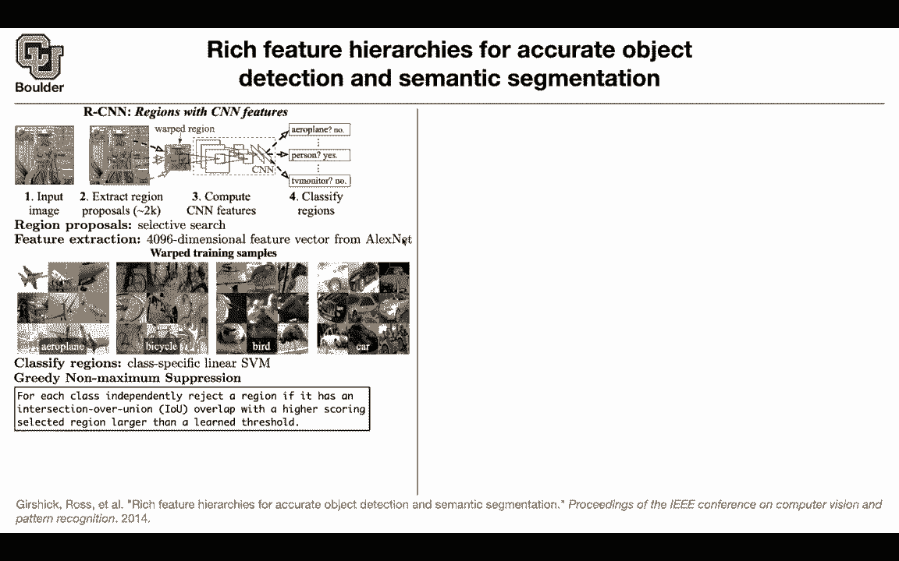
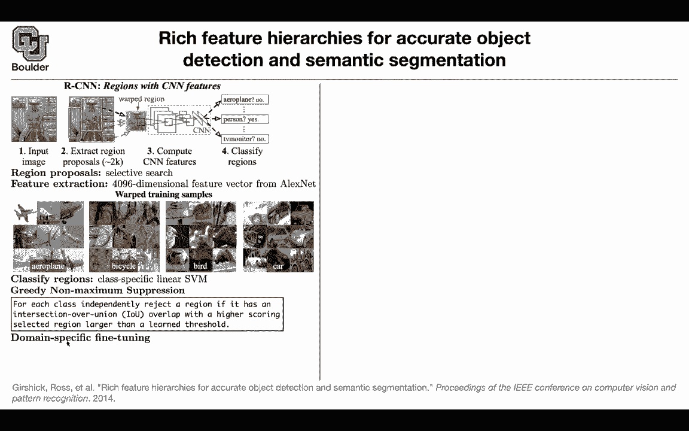
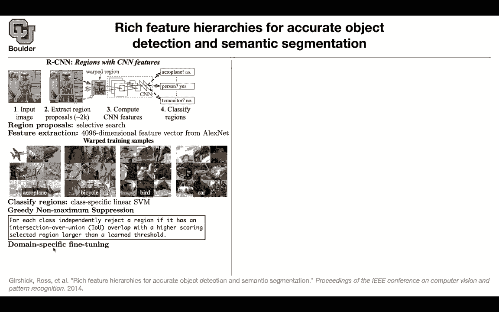

# 【双语字幕+资料下载】科罗拉多 APPLY-DL ｜ 应用深度学习-全知识点覆盖(2021最新·完整版） - P75：L34.2- R-CNN - ShowMeAI - BV1Dg411F71G

Let's move on。 So far， we assume that we know the algorithm。 we have an object detector。

 but even coming up with those object detectors is not trivial。

 It's not like what we were doing with image classification to have an end to an algorithm。

 So our deep convolutional neural networks are gonna be a small part of the overall object detection system。

 And let's start with our CNN。 This is the first paper。

One of the first papers that tried to solve the object detection problem using convolution on neural networks and it's a multi stage algorithm。

 it's not a single stage， it's going to have multiple stages。

And let's go through those stages one after the other first there is an external algorithm that's going give you your region proposals。

 This has nothing to do with deep learning so you have an algorithm is cheap relatively cheap and it's gonna give you these boxes that you can leave it so given those boxes it's gonna to give you I dont know millions of boxes per image you take each one of those boxes you warp the image inside that box and why do you warp it because at that time the convolutional neural networks where only able to work with a fixed size with a rectangular image if you remember imagenet no sorry Alexnet it had I think it was 2 to24 by 2 to24 the pixel size so you take your image you warp it to have that corresponding size and then here is where the neural network coming where the convolutional neural network they're gonna to use it as a。

extractor you take that image， you push it through your convolution and neural network and you are gonna to end up with a feature per each pounding box。

 you're gonna have a feature So for every single image in your training data set you're gonna have thousands or millions of feature vectors I in the end you're gonna have a classifier and it's gonna be a pair class classifier it says is there an airplane yes or no。

 is there a person yes or no， so that's the job of the classifier for instance for Pascal VC you're gonna have to anyone classifier and these are trained differently that break the parts and going into more details for region proposals you can use selective search and if you guys are interested I highly encourage you to watch a couple of videos about selective search watch the read the corresponding paper but it has nothing to do with deep learningar and later on you are actually going replace。

With neural networks， but if you're interested in general machine learning you can actually go ahead and read a prepath paper that's going to give you these yellow boxes and these is going to give you the proposals and it's going to give you 2000 proposals per image and the feature extractor is actually an Alexnet and it's gonna after you push the image the warp image through Alexnet you're going to end up with a 4096 dimensional feature vector and let's take a look at the couple of examples after warping so after warping these are your airplanes and as you can see this is just part of your airplane it's focusing on one part of it because of the bounding boxes because of the region proposals these are all of the airplanes that's a bicycle it's focusing only on the wheel。

These are the birds these are the cards so this is what happens after the waring this classifier is a support vector machine and it's gonna be you're gonna have 21 classifiers and the task of these classifiers is saying is there an airplane yes or no is there a person yes or no TV monitor yes or no etc so that's gonna to be a support vector machine and let's say you already trained your SVM you already fine tuned this feature extractor and now you want to run your algorithm let's not worry about training let's say see on training and let's just try to use it in production your feature your region proposal is going to give you 2000 regions per image now out of those 2000 you cannot report all of them you're only allowed to report a few of them so we have to do we have to select some of them to report to the user and the algorithm that you' are going to use is going to be greedy nonmaxim。

Sparation this is where those confidences or the scores reported by your SVM are going to become important you pick a class let's say in the previous paper it was a both let's pick the class votes and for that there is going be 2000 regions and you want to select a few of them what you do is going to take a look at the intersection over union and if the intersection overun of a region is overlapping with another region that has a higher score and if the overlap is bigger than a threshold you're just going to drop that box you're just going to remove it。

 you're going to suppress it and this is where the scores matter that are coming out of your SVn so any question so far am I going too fast no questions so a combination of intersection over union and your scores is going to help you suppress most of these proposals now the question is how are you going。

Train for sure we are doing transfer learning here so our Alexnet is pretrained on imagenet data but now we have a new data set it's a different it's different from Alexnet so we need to do some fine tuning on the feature extractor on these convolution on neural networks and we also need to train 21 support vector emissions so how are we going to train them what is the data。

The data for fine tuning the convolutional neural network are going to come from your boxes from your regions and sometimes your regions are going to include an airplane actually all of these are including an airplane and sometimes it's not going to include an airplane it's going to include a sky or it's going to include a background or it's going to include another object the question is how we're going to label these so now to train or fine tune these CNN。

 we need to have data， our data are gonna the input data is clear。

 they are in the form of war images， the corresponding label we don't know so we need to find an automatic way of labeling these regions and these are already labeled correctly these are airplanes bicycles for cars and there are many other regions that are being discarded。

 they're being the negative cases these are the positive cases and there are many negative cases that we have to include。

our training to fine tune this CNN and this is domain a specific fine units so you trained something on AlexN now you need to find unit on your current data and here is where you're gonna have a 21 way classification we are not going to use that classification but we are just using it to get better features so if this one has nothing to do with SEN this is just for fine tunening this CN to give us better features for this particular data set for Pascal VC for instance。

 so this is how you're going to train that fine tune that you're going put a 21 way classification layer at the end you're going to write down your crossantropy loss function As for the data any region proposal that has an intersection over union overlap with a ground truth that is bigger than or equal to 0。

5 that's going to become a positive case for instance yes， there is an airplane here。

Otherwise it's negative it's something else for instance it's the background so that's going to give you a training data so here is again this concept of intersection over union that's helping us to label a region proposals these marked images and that's the way that you're going train is 21 big classifier once a training is done you're going to end up with some features that you can actually fit into your SVM okay whether the data for your SVM then anything again you're going look at intersection over union any region that has an intersection over union with ground truth box corresponding with airplane for instance that's going to be a negative example and as for the positive examples you can actually look at the original ground truth bounding boxes those green and pounding boxes is from the previous slide those are going to be a positive example and anything in between you just don't include it in your training。

Negative examples， these are positive examples， now you can train your support vector machine。

You can train 21 of it okay we brought apart every single part of ourC and let's see how we perform so we went into a lot of trouble defining mean average precision now we have a single number for us to be able to compare all of these algorithms prior to deep learning and the deep learning ones I'm going to tell you what is B B is for bounding box and you can actually do a bounding box regression at the end to make your bounding boxes is to adjust them and put them in the correct location I'm going to go into details later on and per class it's actually doing a good job these are the average precisions per classes and there is67891011121314151617181920 classes and there is a background class so there is an total 21 classes there is a cool idea in this paper。

It has nothing to do with detections or maybe it has something to do。

 but it's a nice idea to visualize what the algorithm is thinking what a convolutional neural network is thinking about and the idea is very neat you can actually single out a particular unit it's a particular number in one of your feature maps it's just one of your units in the network and think of it as if it's an object detector and the core of the objects are going to come from the value that that unit holds at that point in time so what you can do is call your region proposal it's going to give you I don't know1 million proposal per image now you can look at。

That's the value of that particular unit and that's going to be able to help you score all of these1 million boxes that are being proposed and then you can pick 16 top values for different images and then just report them and these numbers that you see is the actual activated value of that unit of that particular unit this is per unit what you see here are three selected or three represented feature maps and I think it's after25 it's layer25 I think the size of that is going to be6 by6 by 256 and we are picking three of those two256 feature maps and out of those we are going to pick a single unit and look at the activations of that unit to score these boxes these proposals and and then we are just going to report the top values so it turns out that this unit is focusing on the faces of people。

This unit is focusing on the numbers and this unit is focusing on the spec reflection so this is neat you can actually visualize your features like this this is an alternative way of visualizing in addition to what we already covered previously for visualizing features of the neural network of a convolutional neural network to be precise and I said I owe you something I owe you this bounding boxes let's try to do a bounding box regression let's say this is your ground through bounding box this is the proposal and these values we know we know G we know p these unknown and we want to adjust P a little bit slightly so that it's as close as possible to G so we want to make some modifications to the current proposal so we need to parameterize it appropriately and our parameterization for the predictions is going be this Dx d and Dw and DH px we know。

PW we， PY we P we， so we are making our changes relative to the center of the proposal and relative to the width and height of the proposal because these values have to be normalized they cannot taking they cannot be taking infinite as it range so we need to limit the amount of changes that we want to make so we are our network is going to output these and how is it going to do you take a bounding box proposal let's say these proposal here you push it through your neural network it's going to give you a bunch of features you add some parameters。

 this part you know this is fixed and then you add some parameters that's gonna to output thex d by Dw and BH for instance you could go from dimension4096 it's actually25 so the dimension is much bigger but then you can do a linear combination and project that huge dimension。

Into four dimension the X D， D W and DH and then you do your regression。

 you try to match these modifications， the X D D W and DH and the corresponding ground truth that you can compute from this and this is how you're going adjust your bounding boxes and this is an extra step on top of what you do in RCNF to do your bounding box regression think you are finishing right on time for those of you who have questions you can stay and ask the ones who want to leave more downright to。

