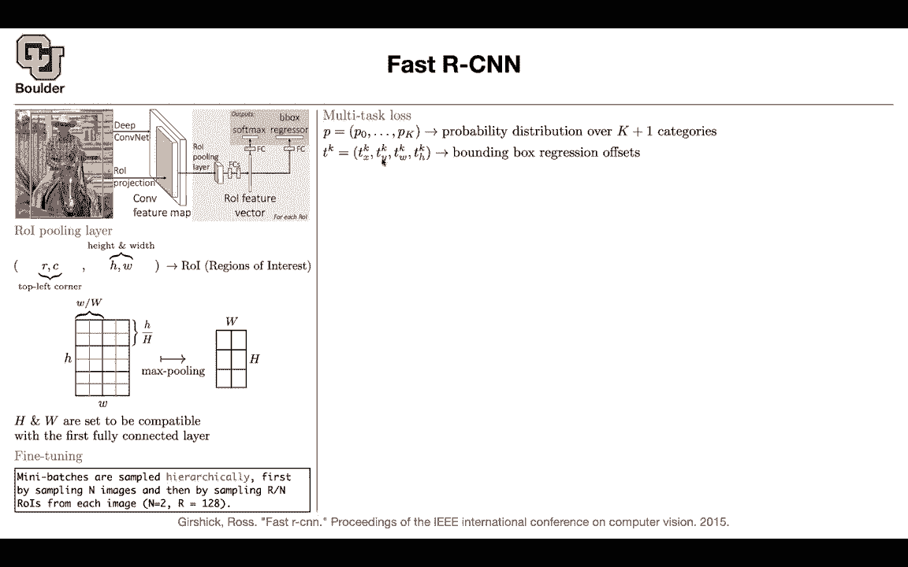
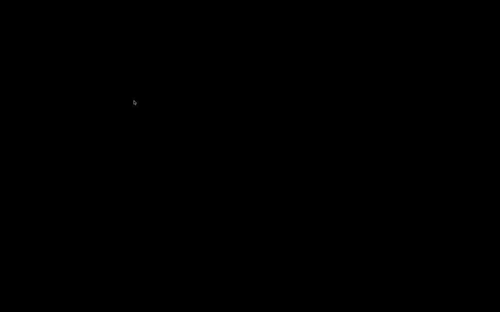

# 【双语字幕+资料下载】科罗拉多 APPLY-DL ｜ 应用深度学习-全知识点覆盖(2021最新·完整版） - P77：L35.2- Fast R-CNN - ShowMeAI - BV1Dg411F71G

com，computations so that was the idea，that you can actually save a lot of，computations before。

your feature map you could do it with a，spatial pyramid pooling，or you can do it with an roi pulling。

layer，i'm gonna tell you what that is and，there was also another part。

in our cnn that we didn't like we have，these，per class svms and we can actually get，rid of that。

as well and we can have an end-to-end，system，that's going to do soft max。

classification for us and bounding，box regression so let's see what is roi，pooling。

we know that there is some region，proposal，algorithm that's proposing regions to us。

let's take one of those regions on the，original image，and then you can just project do a。

projections and that's going to give you，a region，on your convolutional feature map and。

this is very easy to compute，we know what convolution we are using，and。

we can actually find the coordinates of，this box or this region on the feature，map。

so the coordinates finding the，coordinates is straightforward。

it's just simple mathematics now you're，gonna end up，with the top right the coordinates of。

the top right corner，it's gonna be r and c so we're gonna end，up i guess。

the top right is here that's going to，give you a top right corner and then。

you're going to have a height and a bit，for your region of interest so that's，interest。

so it's going to have a height let's，take a look at it it's going to have a，bit。

this point here is the top left corner，what you're going to do is divide your。

region of interest into bins it's the，same as before，but you did only once compared to the。

previous one that was doing it multiple，times you do it only once。

so all you need to specify is this h and，w，and then the rest of it is max boiling。

your max pull these four，pixels into one pixel here your max pool，the other four。

you put it here etc and that's going to，give you the roi pulling layer。

so that's going to give you this feature，or these feature maps，and the rest of it is straightforward。

because，this has a fixed dimension it's always h，and w，you can flatten it and push it through。

your fully connected，networks you're gonna end up with a，bunch of features。

that you can push through a fully，connected to give you the softmax。

and then you can push it through another，fully connected to give you the bounding，box regressor。

so that's just roi pulling that's the，pooling layer it's very similar to a。

special pyramid cooling but you only，have one，pyramid you specify h and double so this。

idea we saw it before，and h and w you're gonna specify，depending on。

whatever fully connected dimensions，that you have in the rest of your。

network now how do you fine-tune the，network，you have multiple heads how do you train。

that how do you train this fully，connected network fully connected，networks。

and how do you fine tune the features，or the weights and biases of your。

convolutions to save even more time，you're gonna sample two images and then。

in each of those two images you can，sample，128 divided by two regions。

regions of interest and that's going to，give you your mini batch。

yes you might think that there is a lot，of bias coming out of only two images。

but it turns out that in practice it's a，much，faster algorithm and you're not，sacrificing。

that much in terms of your uh training，accuracy in the end，in terms of your loss it's going to。

follow the same pattern，what is the alternative you can sample，100 128。

images and then have only one region of，interest，per image and that could be your mini。

batch yes there is there seems to be a，lot of bias，but in practice the algorithm was。

working with only two images，and uh 128 divided by two，samples very much what is your loss。

you're gonna have a multitask loss，one part of your loss is coming from the，classification。

the other one is gonna come from the，bounding box regression if you remember。

for our cnn you needed to have per，class support vector machines now you，can have only。

one multi-class predictor，and you're going to have k plus one，category k categories。

plus the background now you're gonna，have a，bounding box regressor and these。

bounding box regressors are gonna give，you。

height，and this is exactly the same as before。

this is exactly what we saw here，for our bounding box regressors so we，are going after t x d。

y d w and t h which are，what we are regressing over it's a，transformation。

and it's a small modification to the box，that we started with，but then you're gonna have multiple。

boxes，that are being predicted these are，multiple boxes，per category so these are four numbers。

one two three four and then you're gonna，have，k of them so it's gonna be four times k，bounding boxes。

that are being predicted actually k，bounding boxes but then，you're parameterizing each one of them。

with four variables so it's going to，give you four，times k variables that your fully。

connected network is predicting，and as i said these are categories，specific bounding box，this。

you need to label each one of those，region of interests，and we have 120 of them 28 of them per。

our mini batch，how do we label them we know the ground，truth class。

we know the coordinates of the ground，truth bounty box，these are our targets and then we are。

going to have a loss function，giving us classifying uh，actually the classification loss。

function so there is nothing special，about it，it's after the soft max it's a。

cross-entropy loss then you're gonna，have a localization loss，because we know our ground truth。

bounding box regression targets，and then we are only doing we are only，including。

including the bounding box regressor for，non-background objects so if an object，is found。

a background u is zero then you don't，you don't include it，and it makes sense because you don't。

want to identify the millions of boxes，that you are not interested in。

so whenever u is 0 you just don't，include it and u being 0，corresponds to background and p。

0 corresponds to the background class，that's our classification laws。

for localization loss you're gonna do a，regression，this is smooth l1 locally is gonna be l2。

but then it's gonna be l1 when you are，far from your points and this is more，robust to outplayers。

because you're gonna have a lot of，outliers when you do，your regression and the reason is that。

these boxes are not in the correct place，and there is their range is infinity，practically。

it could be as large as uh it could be，very large，and the reason for that is these。

bounding boxes are usually in the wrong，place，and some of them are i don't know。

somewhere here and then you're trying to，push that towards，the ground through so there is a huge。

difference between the two，so you don't want uh to penalize too，much。

those outliers and that's why you're，going to use this loss，locally it's just l2 and。

far from a particular neighborhood it's，going to be l1，and it's just less sensitive to outliers。

how do you backpropagate any questions，so far，so the output is going to be sort of。

variable length right there's going to，be like，many p's and many keys because there。

could be a bunch of boxes in the same，image，depth，so it's always going to have this。

dimension this soft max is going to，output，k plus 1 values it's going to output。

this b and the bounding box regressor，is going to output four times。

k values and then how does it work if，there's like two bounding boxes of the，same class。

so that one if you remember in our cnn，paper，there is a post-processing step and。

that's non-maximum separation，so this paper was very influential it's，very important。

and you are going to do a greedy，non-maximum separation you're going to。

look at the intersection over union，and you're going to look at the score。

and we're going to keep the highest，scores，for the ones that have the biggest，intersection available。

right but this one had a the idea is，that if two boxes，have intersection over union of bigger。

than a threshold，then you're going to keep the one with，the highest score and that's how you're。

going to take care of，if your algorithm proposes two boxes，before one class。

and it's going to be taken care of as a，post processing step，during inference so we don't take care。

of that during training，does that answer your question yeah i'm。

still i'm still a little confused how，i'm looking at like the the output is k，by four。

so how could it output like two two sets，of four，for the same class that's okay it's，gonna output it。

but then you're gonna have the，corresponding complement some of those，boxes。

if there is no dog in this image，the corresponding confidence for a box。

that's predicting a dot is going to be，very low，and then the non-maximum operation is。

going to take care of，it's going to kill it because it's not，that confident。

and what you're saying is that you're，not going to have two bounding boxes。

for one class you could have that but，then uh，the non-maximum stop correction is going。

to take care of yeah yeah that's，i guess what i mean but is that is that，before this tk vector。

it's after the training is done when，you're doing training，you know your ground truth so you know。

that there is a box here，that's going to be you know its，coordinates and then your algorithm is。

going to predict many of those boxes，and then some of them you're gonna，analyze towards。

the ground truth and you know the，corresponding class so this is exactly。

what's gonna happen during training，but then once the training is done some。

of these p's are gonna have a huge value，some of these speeds are going to have a。

low value indicating that there is no，dock in your image，and then there is going to be a lot of。

bounding boxes which we are going to get，rid of，in the non-maximal separation oh because。

this is the output for a single，suggested roi，uh yes so per each image you're gonna，have。

let's say 2000 proposals uh，i think the confusion is coming from the，difference between training。

and inference yeah sorry but i think，that if，um like each roi gives you a vector of。

your confidence and a vector of offsets，then that that sort of answers my。

question i think that's what was，confusing，yes so exactly each and everything yeah。

you can pass in two basically，suggestions，and they'll each have the same class and。

that's how you take care of it at，runtime，because you have two separate p vectors，exactly。

okay cool sorry thank you so one region，of interest goes in，and then out comes k probabilities。

and four times k boxes so in the end if，you have 128，proposals you're gonna have 128。

times k probabilities and then you're，gonna have 128 times four，times k boundary boxes got it okay。

yeah i was imagining this is the output，per image but yeah okay that makes it，really clear。

yeah this is the output region of，interest cool thank you，any other questions now how do you back。

propagate，through a region of interest pulling，layer each x i that i'm denoting here，corresponds to。

one of the pixels here so that's your x，i y，our j is gonna correspond to。

your points here after the max boolean，after your roi cooling layer，j is the j output and r。

is denoting which region you were in so，you're gonna have a sub window。

r of r and j and that's gonna correspond，to this sub window，and then what you're gonna do is you're。

gonna do a max polling and that's，that's exactly the max pooling formula。

you're gonna choose the maximum x from，your region，and then you're actually choosing the。

index let's say this index is the one，that you chose，and then y of r and j one of these。

values is gonna be，the value of x at the particular，location，that was giving you the maximum now you。

want to know what is，your loss with respect to x i the，problem is that。

uh you're gonna have you might have，multiple r's，and j's where this x i is contributing。

because there might be overlap，there might be a slight overlap and。

that's how you're gonna take care of the，overlap，if i is you're gonna do a summation。

you're gonna know what is the，optimal index and if your index is equal，to that。

this value is gonna be a one otherwise，it's gonna be a zero，it's not contributing and then you can。

just back propagate this way，you know these gradients actually you。

know these gradients and then you can，back propagate and compute it that's how。

you're going to take care of back，propagation。

and the problem was that a single x i，outputs，so now the training is done the back。

propagation recovered it，we want to go towards inference and we，want to be as fast as possible。

there's a trick that you can do whenever，you have a matrix，these matrices you know their values now。

they are fixed，the training is done you can do a，singular value decomposition。

and then keep only the dominant terms，the dominant，singular values then you're gonna have。

less computations，and that's gonna help you reduce the car，stuff you're fully connected。

networks and slightly reduce the，convolutional cost because convolutions，are already。

good enough you're sharing a lot of，parameters and you're，sharing a lot of computation so that's。

for inference to make things faster，and how fast did we actually get in，training，you got 18。

3 times faster，with spm and without with svd and，without svd，your test speed got 98 times faster。

and 169 times faster and why did it get，faster because you're sharing，a lot of computation for your。

convolution this part is not shared，this is per each region but then this，part is shared。

you just do one compilation and then，you're done i think we are finishing，right on time。

