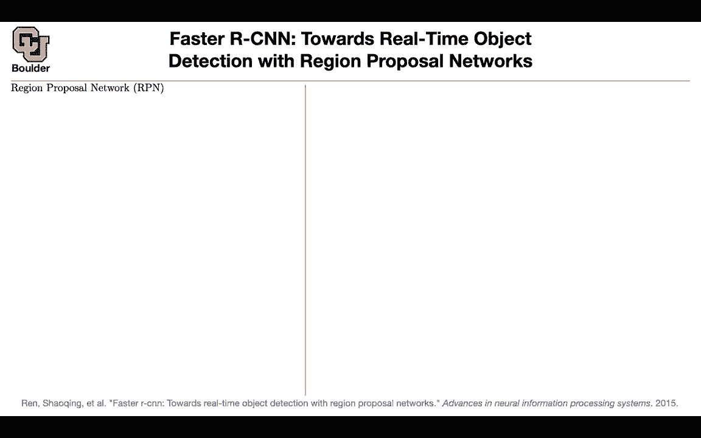
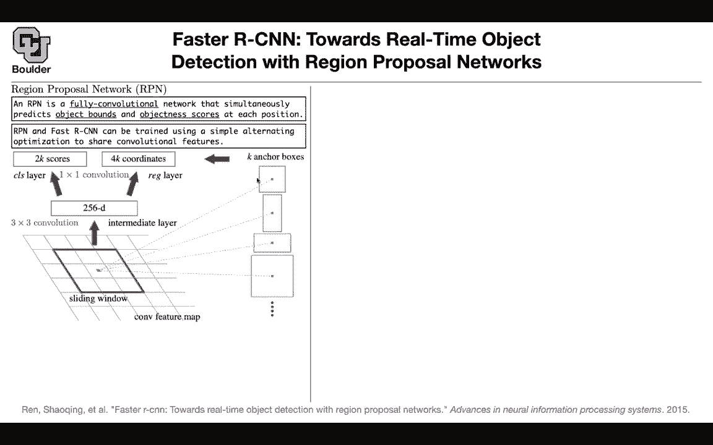
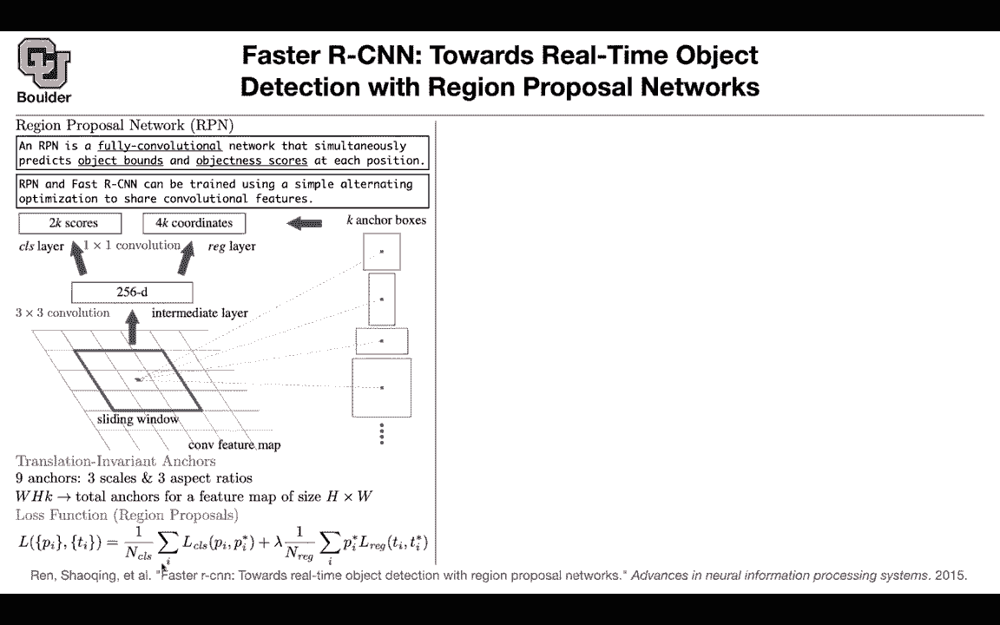
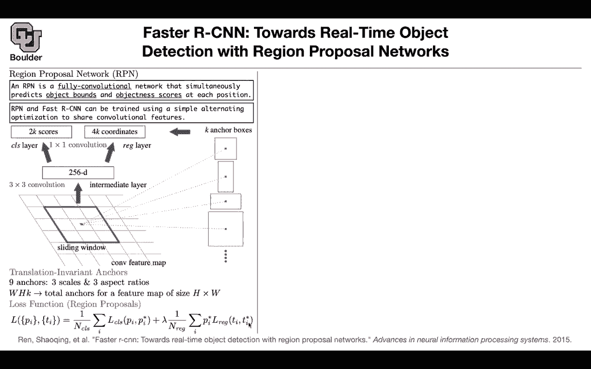
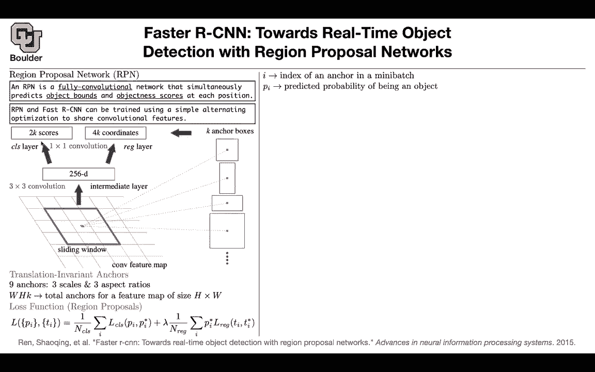
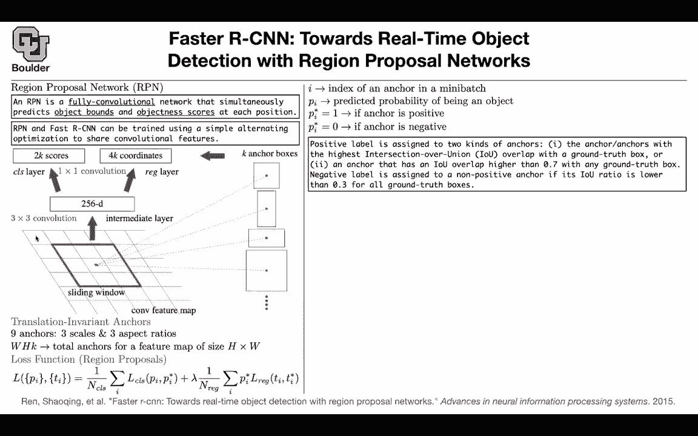
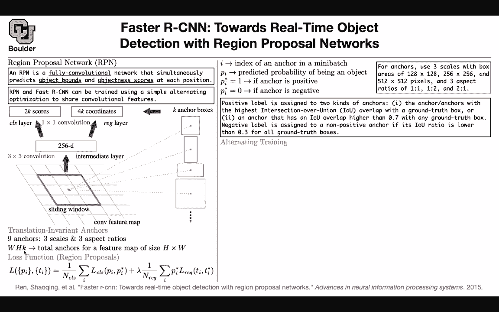

# 【双语字幕+资料下载】科罗拉多 APPLY-DL ｜ 应用深度学习-全知识点覆盖(2021最新·完整版） - P78：L36.1- Faster R-CNN - ShowMeAI - BV1Dg411F71G

Let's have a quick recap of what we covered so far。

 We defined what object detection is and we defined how to one way of measuring the performance of different object detection systems。

 then we introduce an algorithm and in that algorithm we had multiple steps we had an algorithm。

 which had nothing to do with deep learning。 it was selective search that was giving us proposals。

 proposeing regions to us， then we had to take that region， warp it。

 push it through a neural network， get the features and then give the features to a bunch of classifiers and in that particular case they were support vector machines to be able to classify what is the object inside these box inside this proposed box then in the next paper we saw that warping images is not necessary if you change your backbone slightly and try to share parameters。

You don't need to warp and at the same time you can share a lot of computations and therefore you can save a lot of computations and make things faster。

 rather than taking a box， cropping it and warping it and pushing through pushing that image for those regions multiple times through a convolution。

 you can actually share most of the computations。And the way that you do it is with a spatial pyramid pooling and then the next paper came along and said you don't even need these support vector machines。

 you can have it end to end by having multiple heads coming out of out for your predictions one head is doing the classification one head is doing the pounding box regression and then you can have a multitask loss and try to optimize that so this is what we covered so far and after doing that things started to get much faster things were getting much faster it was possible to put these systems and apply them in real time for videos think it was for videos it could be 60 frame per second so things has to be really fast but then something was is still a buttonneck in terms of computations we needed to share some more computations and that is these regions the region proposal algorithm for the region proposals。

We were using selective search this next paper came along and said we can actually have a neural network proposing to you what regions to use and that's going to be a region Pro network and we are going to use the shorthand acronym for it RPpN but what is it it's a fully convolutional neural network and it's gonna predict bounding boxes and I give you object bounds and it's going to tell you is there an object within this box or no。

 so it's exactly what selective search was doing so not only it's going to give us the boxes it's going to give us an objectness score as well and what we are going to do is try to share as many parameters as possible between the region proposal network and fast our CNN because in the end we want to have a fast system we want to share computations when it comes to inferencefers training might be a little bit more complicated but once these networks are trained infer。

You're going to be really fast so。

And the way that we are gonna to train them is an alternating optimization scheme。

 And I'm going to tell you precisely what that is later on。

 But this is the big picture of what we are anticipating。

 So let's say you take an image you push it through your convolutions。

 And you end up with a convolutional feature map。 So that's going be a tensor it's gonna have a height and a width and a bunch of channels let's say you're gonna have 2256 channels and it's gonna have a resolution。

 let's say H times W。 What we are gonna do is put a sliding window on that convolutional feature map and then each window is gonna correspond to multiple boxes and these are gonna be anchor boxes of different sizes and different aspect ratios。

 So each point here on the feature map is going correspond to perhaps nine boxes on the original image。

 And then as you keep sliding that。

Window， you're gonna end up with a lot of boxes。 These are your anchors and now you want to adjust these anchors。

 If you want to adjust the anchors， you want to know how much I need to shift the left side to the left or to the right how much should I adjust the top boundary etc。

 And that's why you're gonna have a regressor network and that's exactly what we had before it's very similar to what we had before and then it's gonna to predict four coordinate for these boxes for adjustments to these boxes。

 and then you're gonna have k of those because you have k anchors and at the same time you have k anchors and you want to know in this box that I'm drawing is there an object or no that's why you have to here I it an object or no So you only have two classes there is either an object or there is no object The cool thing is that these operations you can implement them using convolutions This is just。

3 by three convolution and the other ones you can implement them as one by one convolutions and we know that convolutions are really efficient。

 they are gonna to share a lot of computations and you can take this feature map。

 push it through a bunch of convolutions and get your scores and coordinates So what are these anchors you're going have nine anchors and they are going have three different scales and these scales are relative to the size of the image that's going in and you're gonna have three different aspect ratios maybe you have a ratio of one and one maybe you have a ratio of two and one or you have a ratio of one and two and you have boxes of different sizes this is one size this is another size etc and you're gonna have nine of them you're gonna to have nine per each of these points per each pixel per each pixel in your feature map and how many other if the width and the height of the feature map you do not。

By w an H per each point per each pixel you're gonna to have k anchor boxes and that's going to give you the total of your anchor boxes W times h times k So you're going have that many anchor boxes that then you're going to adjust according to your regressor So what is the loss function for this region proposal network you' are going have a classification loss according to these scores I there a box or no box and then you're going have a classification loss I is denoting your anchor boxes in your mini batch of data。

 So let's say there are 10 images in your batch and per each image you're going to have this many anchor boxes So this summation is over I your anchor boxes and per each anchor box there is either an object in there or there is no object in there that's going to give you a classification loss and then you're going have a regression loss per each。

Anchor but then you're only gonna include the ones that have an object inside them So pi star is either a0 or a1。

 it's an indicator if it's one there is an object in this box if it's zero there is no object and if there is no object in this box there is no reason to include it in your regression and N is the number of boxes that you're taking into account in your mini batch So as I said I is the index of an anchor in a mini batch Pi is a predicted probability coming out of your neural network。

 Pi star is an indicator anchor is positive it means that there is an object inside the anchor anchor is negative it means that there is no object in there but how do you come up with the data for it you're gonna look at the intersection over union of your ground truth all of the anchors that have an intersection over union with a ground truth bond bounding box and that intersection over union is the highest。

Is gonna be a positive anchor， regardless of how big that IOU was。

 Any anchor with an IOU overlap with a ground truth box of bigger than 0。

7 is gonna be a positive one。 If an anchor has an IO lower than 03 with all of the ground truth。

 that's gonna be a negative。 So you have positive cases， you have negative cases。 Therefore。

 you can train it。 So there's a question from Jacob。

 Does this mean that we should have the image so that each pixel so that at each pixel。

 we have the same set of anchor boxes center on all of the relevant pixels or would we just trucate the anchor boxes for edge pixel。

So the question is what happens when this dot is around the boundary what are you gonna do then there is gonna be anchor box and some part of that box is going to be outside of your image So you're just gonna set that to zero whenever you don't have any data that's gonna be zero that's gonna be zero padding Doess that answer your question Okay perfect and what are the scales that was a very timely question What are the scales corresponding to your anchor boxes These are the scales1 to any8 by1 to any8256 by 256 and 512 by 512 pixels these are the different sizes and as for the aspect ratios you're gonna have one。

1，1，2 and 21 similar to what you have here This is one1 This is one2 and this is21 Any question so far before I go to the training step How do we actually train this network I have a quick question Yes if if we have。

These three set scales and these three set aspect ratios Does that mean k is nine Like we have those combinations exactly yes。

 so k can't be K is like fixed at nine always you have no Is you have nine anchors per each pixelel in your feature map and that's gonna give you a total of w times H times k total anchors per each image I there a reason they leave I mean。

 it seems weird to leave k like general like this if it's gonna be fixed like do they look at like more scales and more aspect ratios Yes definitely so you can play around with k Okay so that would be a hypergrammeter that you can play around maybe you want to include four scales Okay maybe you want to include more aspect ratios but the more of these you include the more costly your algorithm is gonna be Yeah。

 that makes sense there is a tradeoff's gonna give you more accurate predictions。

Probably but it's gonna to be more costly So how do we train this alongside our fast R CNNn It's going to be a multistep training process because in the end。

 we want to share parameters between the region proposal network and fast R CNN first of all。

 you're gonna initialize your region proposal network with an imagenet pretrained model so that's going to be transfer learning you are transferring your learnings from imagenet to RPpN and then you're going to fine tune end to end the region proposal task so you're going to use this loss function to train your region proposal network now you don't need selective search anymore that's going to be your region proposal algorithm perfect it means that you can go to the second step and use the regions proposed by the region proposal network to train your fast R CNN because we know that fast R CNN dependinged on region proposals and the way that you。

're going initialize faststar CNN is using Inet so you're doing two transfer learnings here from Inet to RPpN and from Inet to Faststar CNN。

 But now these are two separate network because they are trained differently according to different losses what you're going to do now is you're going to use this detector network faststar CNN and you're going to use the weights and biases of this network to initialize your RPN network So now you're doing a transfer learning from faststar CNNN to RPN but what you're going do is you fix the shared convolutional layers and youre only fine tuning the head So you're only fine tuning these part of the network And now you have your RPN you're going use your RPpN to keep proposing regions for your faststar CNN。

 but then you're going keep the shared convolutional layers and then you're gonna to fine tune the fully the head of your faststar CNN Now what you just did is you are sharing the。

al layers。 And the only thing that's not shared and is task is specific is the head of these two networks。

 And that's it。 You have two networks。 They are sharing most of their operations。

 One of them is proposing regions for the other one to use。

 And this is exactly what's gonna to happen in your inference。 And that's why it's much faster。

 And here are some qualitative examples of identifying persons， boat， person in a box and cat dog。

 etc。 So now everything is deep learning now， there is no reason to use support vector machines。

 There was no reason to use selective search。 So is is clear。Sorry if I miss this。

 what's the architecture of the RPN what type of network is it that doesn't really matter because what matters here is the is what is important for creating a region proposal network so it doesn't matter what happens before the convolutional feature maps Oh I see so you just take any take your favorite network to get the features and then add those few layers on top of it exactly but whatever that's happening before you get your convolutional feature map is shared between region proposal network and fast CNN cool。

The rest of it could be any network that you trained on imagenet， it could be a Resnet。

 it could be different architectures， any other questions。

 So this is a massive project and that's a tough problem to solve And you see there was a lot of moving pieces into the puzzle。

