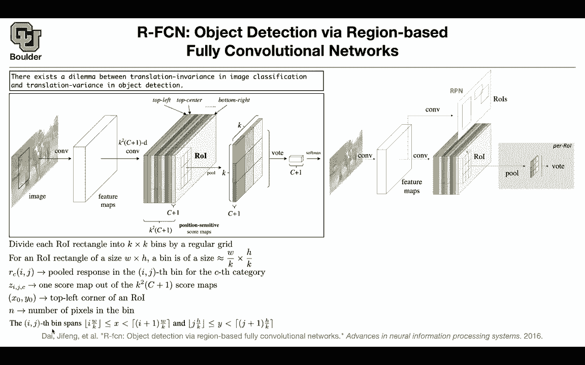

# 【双语字幕+资料下载】科罗拉多 APPLY-DL ｜ 应用深度学习-全知识点覆盖(2021最新·完整版） - P79：L36.2- R-FCN - ShowMeAI - BV1Dg411F71G

so what else can we do，to improve the performance of the，algorithm so far。

let's go back to this picture we took，care of the region proposals we took，care of warping。

we are sharing a lot of computations in，our cnns，we got rid of this pair class support。

vector machines，what else can we do to improve the，performance。

we can go here and we see that there are，some computations here，that probably we can save and there。

there are actually，more computations here these are fully，connected networks。

in your fast or cnn and it would be good，to share computations even after。

even after these convolutional feature，maps in this，greg box we know that most of the。

computations are shared，and only one image goes in but then，you're going to have。

multiple uh regions of interest that you，are then pulling，pushing them through convolutions and。

then getting yourself max and，bonding boxes but it would be good if，you could share。

computations here but there is a problem。

there is a dilemma，and the dilemma is that in image，classification。

we are looking for translation in，variance。

but in object detection translation，matters，so it's going to be translation variance，because。

that object could be located in，different parts of your image。

and if you shift your image a little bit，and you're still using the old bounding，boxes。

you're making error so the idea is that，you want to，replace the fully connected networks。

with convolutional networks，because that's going to be much faster，but then there is a problem。

because convolutional net neural，networks are translation invariants so，to fix that problem。

maps。

you're going to have a positive position，sent to sensitive score maps。

because you want to be sensitive to。

translation，to the position in your image you have a，convolution it's going to give you a。

bunch of feature maps，you take those feature maps you're going，to have a convolution。

that's going to increase the size of，your feature map，to be k squared by c plus one。

c is the number of classes one is the，background。

and k is the size of your。

this，that the entire thing but then you're。

gonna interpret each part differently，you're gonna interpret this yellow part，as。

top left then top center so that one is，gonna correspond to。

top left top center and this one is，bottom right，and each one is color coded。

appropriately what you're going to do is，when you're doing your pulling you only，pull。

from the features that you associated，with top left。

so you're only going to pull here and，put your values here，and then in the end there is going to be。

a voting and then there is going to be a，soft match，giving you the classes there is no need。

for a fully connected network。

so yeah this is score maps they are，coming out of your。

feature maps out of a convolution okay，and we are focusing only on the。

fast rcnn part of our network we know，that there is going to be a region。

proposal network that's proposing，regions for。

the detection network but that part，is what we just covered in the previous。

paper so that part is the same as before，the contributions are here you want them。

to be，you want your convolutions to be，position sensitive to be sensitive。

these are。

left，relatively speaking on the top center。

etc so let's be a little bit more，precise，about what's happening mathematically。

you can divide，each of your regions of interest into k，by k bins。

for instance you can have three by three，beans。

now if your region of interest has size，w by。

h each one of your bins is going to be，of size，w by k and h by k now what you need to。

know，is the pooled response in the i j。

pin for the seed category so what you，want to know。

is the response in the i，j bin for one of these。

slices for one of the c categories。

and we know that you're gonna have ks，squared，times c plus one position sensitive，score maps。

and you can each element of that is，going to be z。

i j and c for that particular class，and let's say x 0 y 0 is the top left，corner。

n is the number of pixels in each pin，then you can actually。

know what is the xy coordinates of the i，j spin and that's going to give you x。

that's going to give you the y，coordinate，each one is going to have a size of w。

divided by k，for x and the other one is going to have，a step size of。

h over k and all of these x and y's are，going to be within that pin。

now here is the key to translating this，figure。

the response at the i j，bin for class c is going to be the，summation。

of all of the pixels within that pin，and they are coming from your position。

sensitive score maps and that's why x0，and y0 matter。

because it's going to give you the top，left corner，that you're going to start with and then。

you're going to divide it by n。

because it's average pooling and that's，how you get your。

responses what you can do now is you，vote。

out，or you can take the maximum so these are，position sensitive scores。

and in the end you're going to have a，soft max predicting your classes so is，everything clear。

the entire idea was you wanted to，replace your fully connected。

networks with convolutions because they，are more efficient，but the problem with convolutions was。

that their translation invariant，and you want to make them sensitive to。

the position，you want to make them somehow，translation variant and that's how。

you're going to do it，you're going to say it matters to me，whether we are on the top left corner of。

our feature map。

in the region of interest or top row，center corner etc。

so all that's happening is that。

you are pulling pair each，sub-block of your channels here and then，you're just。

putting them putting those values here，any questions。

so could you repeat that last thing you，just said because，it seems sort of just like a max pooling。

i'm。

struggling to see the the differences so，no it's not a max building。

it's uh an average building or an，average pooling yeah，happening so your average pulling only。

on the part，that corresponds to the features color，coded by this yellow or。

this blue color dark blue color，oh so it's like a it's like an average。

pulling over the channels，instead of the the spatial dimension。

no it's actually the spatial dimension，it's x and y within that b。

what is channel specific see what do you，need in the end。

you're gonna need c is gonna count，numbers，from one up until c plus one so it's。

gonna do the slices of this，feature map for you and these are，actually called responses。

so you are doing a c of those c，plus one of those that's what c is。

counting then you know，then you need to know what value。

you are putting inside each one of these，bins what is the i。

j entry of this what is the first，and first what is the first and second。

what is the first and the last。

what value are going are you gonna put，on the top left of this。

and the value that you're getting it's，gonna be a single value，and it's gonna come out of doing an。

average，over these score maps and the yellow。

ones are coming from doing an，average on the yellow。

slices of your position sensitive score，so there is a single value。

peri channel per each，get it。

so is this clear now yeah thank you，and once you get these nine numbers in。

the end you want to have a single number，to push through your softmax and then。

these guys are gonna vote，you can for instance add them up and the。

one that's dominating is gonna give you。

more contribution to yourself max，it means that the positions matter now。

boxes，it's the same it's the same as before in，the end you're gonna end up with some。

numbers，squared。

because you need k squared of them，and there is four coordinates for each。

bounding box and then you can do a，bounding box regression，so these bounding boxes are also。

position sensitive for instance in this，case you're gonna have，nine of them times four coordinates。

and that's gonna be the output in the，end and how does it compare。

now you can see the difference between，faster or cnn。

and rfcnn we know that for this one i，need to go back，to this figure the depth of this network。

and the amount of computation that you，are not sharing。

when you are using faster or cnn is 10，with rf cnn。

you don't need to do any non-shared，operations，and that's going to save you both in。

training time and in testing time，and it's going to give you slightly。

better accuracy not accuracy mean，average over in average precision and，then you can。

also play around with the number of。

region of interest and this goes back to，the question that we had on the previous，paper。

about how many region of interest this，network is going to propose to us。

and how that's gonna affect the accuracy，you see that uh。

going to 2000 region of interest，is not even possible for faster or cnn。

it's too computationally expensive，but at least here you are getting some。

results and apparently it's not helping。

that much，apparently going 300 region of interest，was enough。

but the more important fact is the，training the trending and，testing time you're saving a lot of。

computations i think you're finishing，right on time，for those of you who have questions。

you're more than welcome to stay and ask，i'll be around and the ones who want to。

