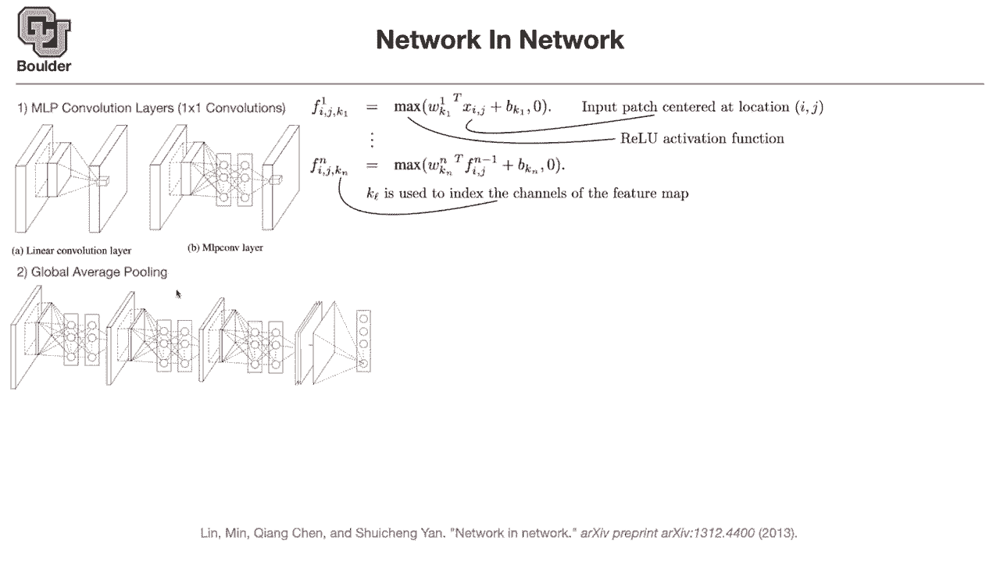
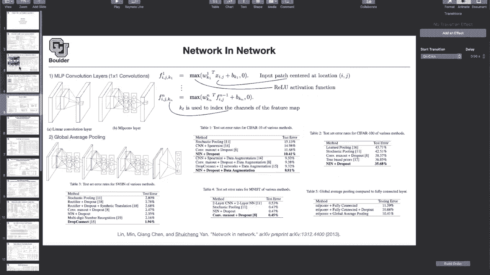
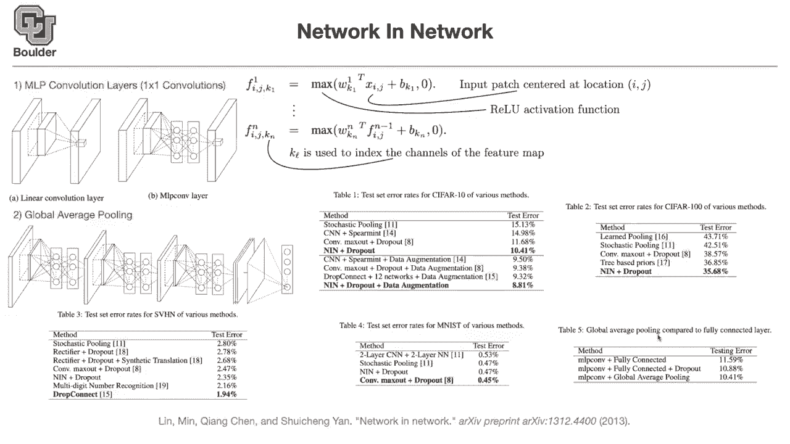

# 【双语字幕+资料下载】科罗拉多 APPLY-DL ｜ 应用深度学习-全知识点覆盖(2021最新·完整版） - P7：L4.1- Network in Network [续] - ShowMeAI - BV1Dg411F71G

so last session we talked about dropout，and then we moved on to networking，network。

so for networking network we said that，this was the，first work that i started to introduce。

one by one started to use and introduced，one by one convolutions。

and many people after that paper are，using one by one convolution，in their works for various reasons。

but these guys wanted to have a network，inside their network，and they wanted to do fully connected。

and at that time，after writing the paper or during，writing it they noticed that。

multi-layer perceptrons if you put them，after your convolutions are just going。

to end up being one by one convolutions，they also introduce global average，pooling and they replaced。

the last layer if you remember from，alexnet，the last couple of layers were fully，connected。

they said you don't need to do that you，can just，uh average your pixel，values per channel。

and those are gonna give you your，vector the one that you want to work，with in the end。

and use it for classification purposes，the cool thing about global average，pooling。

is that now your entire，structure is independent，of the resolution of the input image。

the convolutions are local and you're，just shifting it over your。

image and they don't depend on the size，of the input image，the filters they have their own sizes。

they share parameters and in the end the，problem was the fully connected layers。

for the fully connected layers you，needed to have，a specific size so that once you flatten，it。

you end up with uh i don't know，200 2048，dimensions so the problem was。

at the last layers global average，pooling is going to take care of that。

any questions about one by one，convolutions and，global average bullying is everything，clear。

it seems to me like a one by one，convolution is just taking a matrix and，scaling by a。

constant or how is it different than，that。

so one by one convolutions i introduced，[Music]。

them，i think in the second or the third，session of our class。

so this is a one by one convolution each，image，or each input is gonna be a tensor。

it's gonna have a height and width these，are your pixels，and it's gonna be the number of channels。

that's the input to one by one，convolution the output is gonna be，having the same number of pixels。

so now it's just a matrix multiplication，to go from dimension c to dimension f。

but it's being done point-wise any other，questions，the question is for the global pulling，does it。

have to be average pulling or could it，for the final layer，it has to be global average pooling。

because it's a global operation，if you find the maximum value of your，channel you're losing a lot of。

information，and you're doing it over small window，end up destroying too many too much，information。

but when you are doing it globally，i would recommend using averaging。

does it answer your question any other，questions so they report some results，on c410 c410 images are。

low resolution they are 32 by 32，and you have 10 classes india，this max out paper i would recommend。

reading it，and these are the results of networking，network，plus dropout and they are getting，10。

41 percent error rate，so data augmentation i think we are，going to be able to cover it today。

in one other paper but if you add it to，most of these，methods the test error rate is going to。

go down，including networking network，c4 100 is similar to c410，but it has 100 classes rather than 10。

and you can imagine the more classes you，have，the harder the task is if you have only，two classes。

and if you have a coin that you toss it，your error rate is going to be 50，percent 50，if you have。

10 classes then your error rate，of a coin flip of a 10-sided coin，is going to be 110。

 it's going to be，for c410 it's going to be 1 100，basically one person at the time you're。

going to be correct，by random and if you have 1 000 classes，like imagenet that's a harder task。

so and again these papers are good，reading material，learn pulling stochastic pulling con max。

and if you don't know what these numbers，are you can，refer to the paper i'm taking that table。

from that paper，and then it's reference 16，of the paper down here there is straight。

view house numbers，and drop connect is actually the one，that's winning。

on this data set and networking network，is here，the other one is mnist so usually。

these are the data sets that are smaller，size，compared to imagenet and if you're，developing a method。

and you want to try out your ideas，you're going to try out your ideas on a，smaller。

data set because now your networks are，your，results faster but then once you're。

happy with your ideas，you test it on imagenet i mentioned that，global average pulling。

you can compare it to fully connected，layers you can actually use it to。

you can actually use it to regularize，your neural network，it is even do it is doing even。

better than when you have dropout，so replace your fully connected layers，with dropout。

and dropout with global average pulling，and you can see that your error rate is，going down。

on the test data so it's helping your，method，of，effect as well not only it allows you to，have。

a different resolution，for your input images it also，regularizes your，method your neural network。

