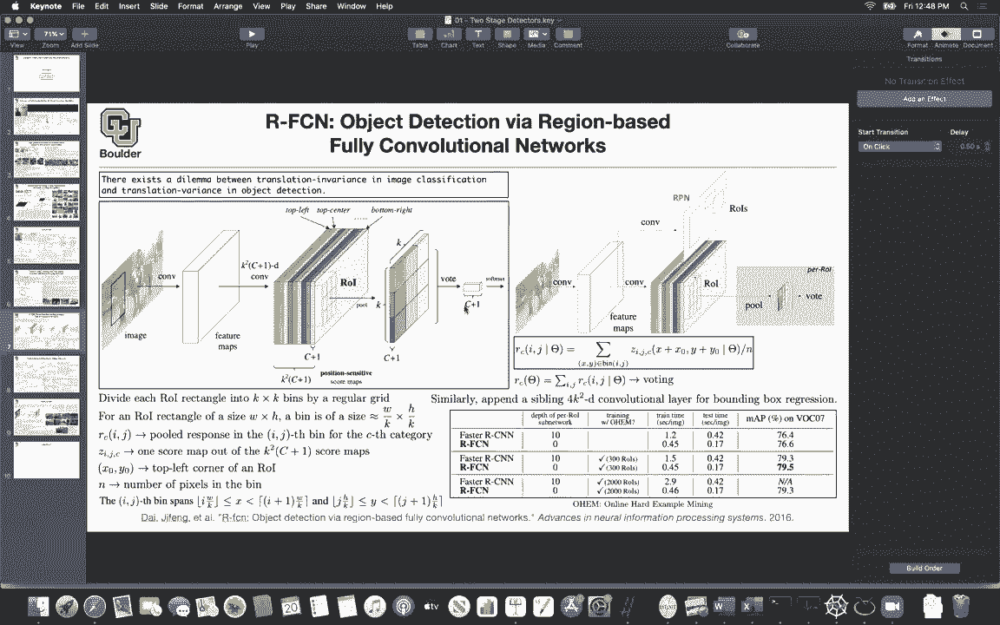
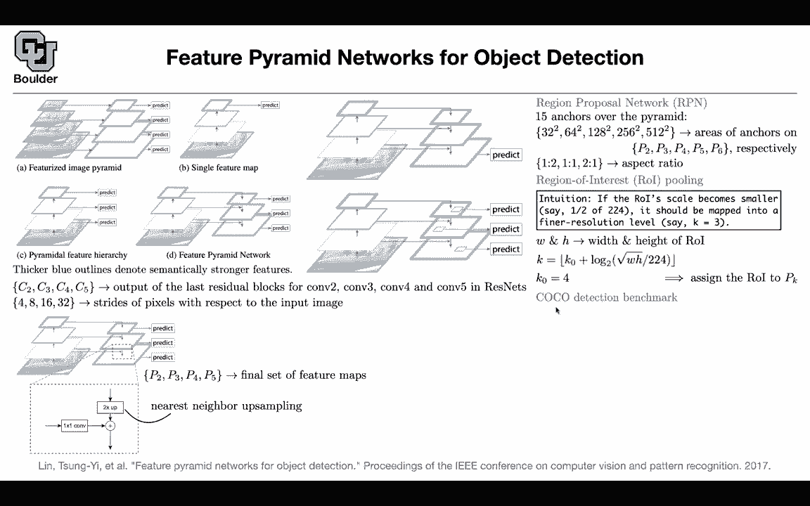

# P80：L37.1- 特征金字塔网络 - ShowMeAI - BV1Dg411F71G

just a quick recap of what we did so far，for object detection we are still doing。

two stage detectors we started with a，metric，and then we said you can try to that's a。

complicated problem，object detection so one approach，to try to solve this problem。

is a divide and conquer method so you，divide the problem into。

pieces and then you concur one at a time，so the first stage was to extract the，regions。

then warp the regions push them through，your cnn，get some features and then do。

per class classification and the，algorithm worked，but there was still a lot of room for。

improvement like there was no need for，this warping stage there was no need for。

support vector machines，and there is actually no need for an，external。

algorithm like selective search to，propose regions for us and each paper，that came after this。

was addressing one of these problems so，the first one was saying you don't need，to work。

and actually you can save a lot of，computations by，sharing computations then。

there is also no need for the support，vector machines you can have a，multi-task loss。

the next one came along and said there，is no need for，uh bounding box proposal we can actually。

use neural network to do that and that，was the regen proposal network。

and then this last one was actually to，were doing，in this uh fully connected part of your。

network the head of，head，replace it with the convolution and，there is no need for。

any neural network so you can have a，depth of zero，so no neural network for your。

region of interest so basically there is，no computation at all，and the。

bounding box regressor that's it and，that's how you get the softmax，but they had a challenge and the。

challenge was if you want to do that if，you want to get rid of，the head of uh fast or cnn。

then everything is going to be，convolutional and it's going to be。

translation invariant but for object，detection，translation matters it matters where the，object is。

that's why you needed to have position，sensitive score maps，so these have to be sensitive to the。

location of the object is it on，top right top left where is it and even，after all of these。

trouble if you look at small images，small objects in your images big objects，in your images。

and medium size image objects there is，still，room for improvement because your。

algorithm might miss，small objects and the bounding box is，not being accurate。

and that's the topic of the next paper，one solution for it，for you to be able to look at different。

scales in your image，is to actually input multiple images of，different scales。

of it's the same image but it's gonna，have different resolution。

and by doing so you're gonna be able to，focus on larger objects，on your small images and on smaller。

objects on your，larger scales and then you push it，through your，neural networks and then you do your。

predictions but then somebody might say，why do you need multiple images there is。

already a feature and this is called，image pyramid，there is only a pyramid structure within。

the layers，of a deep neural network so you have a，high resolution image。

and then each one of these feature maps，are going to be，of lower resolution so you might be able。

to use，to do prediction on all of these and，that could give you。

multiple resolution that's a good idea，but there's a problem and the problem is，that。

the thicker blue lines that you see here，they denote that the features at that，layer。

are semantically stronger so the，features at the first few layers。

are focusing on the edges or color etc，but the ones to at the end have meaning，for instance。

they have some features encoding the，existence of a，of an object of a cat a dog etc。

so they are discriminative so the ones，on top，are semantically stronger so this idea。

needs some adjustments and we need to，make these，features or feature maps semantically，stronger。

and the way you do it is by inheriting，from，the layer above so you're gonna have a。

bunch of up resolutions going on，and then somehow inherit the features，that you learned。

from the lower resolution feature maps，and then try to make these features，feature much stronger。

and then you can do your predictions now，all of these are going to be。

semantically strong and at the same time，they're going to give you a pyramid。

to work with and the pyramid is going to，give you multiple scales。

so that's the big picture and once you，do that you're going to put your，bounding boxes。

or your region proposals regions of，interest，on different scales now you can do，predictions at。

per each small box，or region of interest that you have to，do your detections this is going to be。

objects of smaller size and these are，going to be objects of bigger size。

okay let's go a little bit into details，so as far as the notation is concerned。

let's say c2 c3 c4 and c5，are the outputs of the residual blocks。

corresponding to conv 2 conf 3 con 4 con，5，in a residual network so each one of。

these are going to be of lower，resolution，compared to the original image c2 is，going to be。

4 times smaller than the original image，c3 is going to be eight times smaller c4，16 and c5。

32 smaller and this is actually the，total stride，at that particular layer now the，question is。

what is this operation how do you，inherit those features，those features are you concatenating。

what are you doing，so let's focus on that part we want to，come up with，p2 p3 p4 and p5。

and they correspond to this semantically，stronger，versions of c2 c3 c4 and c5。

and these are the ones that we are going，to end up working with from layer。

above all you need to do is you do an up，sampling，because now you want these two feature。

maps to have the same resolution，so you do an up sampling and it could be，as simple as。

a nearest neighbor of sampling from c，this is going to be c let's say c4。

the other problem is that make maybe the，number of channels are going to be，different。

therefore you're going to need to use a，one by one convolution，to adjust the number of channels and。

then once you adjust the number of，channels，once you do your up sampling you can add，them together。

and then go to the next step try to make，p5 semantically more stronger so that's，the idea。

now the question is we know that the two，stage detectors，are gonna have two stages the first one。

is proposing，or，those regions roi pooling region of，interest pulling。

for region purpose on network you're，gonna have 15，anchors previously you have nine anchors。

now you're gonna have 15 anchors，the question is where are you gonna put。

these anchors are you gonna put them，on one of these on all of these。

and how do you spread them if you，decided to put the anchors。

on all of these p two p three p four and，p five，so what you're gonna do is you're gonna，put uh。

anchors that have areas of 32 squared，on p2 the ones that have areas of 64。

squared on p3 etc so you're gonna have，five of them，per each of these semantically stronger。

feature maps，and then you're gonna have three aspect，ratios the aspect ratios being equal。

or not equal three times five，is going to give you 15 anchors per each，of these feature maps。

so your region proposal network needed，anchors，and these are the anchors now your。

region proposal network is going to be，able to do its job，as before once it is trained it's going。

to be able to，regions，are going to be consumed by the object，detector。

which is in the form of fast rcn，but there is still the question of。

if the region proposal network proposes，a region then，to which uh feature map are you gonna，assign。

that proposed region because you're，gonna need to，pull information from one of these。

which one of these arrows are you going，to use so you need to assign。

the proposed region to one of these for，you to be able to，do your pulling operations so forget。

about the intuition，for a second and let's just look at the，mechanics。

you're going to have a region of，interest of size，w by h and the question is to which one，of these。

p one p two p two p three p four p five，or p six are you gonna assign this。

let's say k zero is four so if，w times h its square root is 224。

log two is gonna be zero so you're gonna，assign this，map，this one corresponds to con4 so you have。

a region，you have a box on your original image，now you're assigning it。

to the fourth one now let's say，w times h it's a square root，is one half of 224 that's why you have。

the log two here，then this is going to be negative one，and then you are assigning。

that region of interest to p3，because it's gonna be four minus one，it's gonna give you three。

so you're assigning it to easily it，means that now you're pulling your，information from。

p3 and that's the intuition if the，region of interest scale becomes smaller。

then you're going to map it to a level，below you'll start with four then you go，to three。

two and if it's bigger it's two times，bigger you're gonna assign it to，uh p5 p6 etc so。

is this clear or i don't know if we're，going to talk about this next but。

are the the prediction heads the same as，the，what we saw in the previous paper it's。

not the previous paper，but the one before it okay but you can，actually use what you learned。

from the previous paper on top of this，yeah for you to save more computations，you can use that。

but it's very similar to faster rcna the，only thing that you're changing。

is that you want to look at multiple，resolution multiple scales，and that's going to help you detect。

objects at different scales，even the small ones okay let's see some，results。

on microsoft cocoa so far we were doing，pascal vlc，microsoft cocoa is another set of，benchmark。

for object detection systems and，let's compare this to faster or cnn。

with their residual network as its，baseline，for，that case they are coming from c4 and。

there is no lateral or，top-down connections like these ones or，that ones。

that's your average piece average，precision，at 0。5 0。5 is，the intersection of our union and。

the cool thing about microsoft cocoa，benchmark is that it has，specialized metrics for small objects。

medium sized objects and large objects，and this is the total one。

and that paper was not reporting these，numbers，so you can copy and paste the same，baseline and then。

you retrain your networks you can use，con4，like what we saw here。

we can use c4 or you can use c5 and it，turns out that，using c4 is better now you also have。

these numbers，that you can start comparing to now the，feature parameter network。

is going to not only use c4 c5 it's，going to use，use，the semantically a stronger version of。

them it has lateral，top down connections and it's doing，overall，very good on the small objects and。

medium sized objects，it's doing much better than before but，you lost。

some uh average precision for larger，objects，so there seems to be a trade-off between。

the small objects medium size，objects and large objects if your，algorithm focuses on small objects。

then you might miss some information，maybe your，bounding boxes are not in the correct，location。

on larger objects but it still overall，is doing much better，than before and it's uh as fast as。

uh the previous versions why because，you're only pushing one image，through your network rather than。

multiple images，at different scales and how does it，compare with the rest of the。

methods out there these two works they，are actually using，image pyramid they're pushing multiple。

images，through the network and even competing，with those that are pushing multiple。

images using image pyramids，these are doing very good on the small。

and medium sized objects and overall，and on larger objects these two methods，are doing better。

but they are using image pyramids what，accounts for，this this model performing so much。

better than those other two，that are still using like in this other，ones using resnet。

as well and image pyramid maybe it's，here，okay they're just a larger network yeah，this one is。

using resnet101 this one is also using，resin upon，one but there is a there's a bunch of。

parameters here，okay uh any questions，i'm confused about the top table there's。

the line with the star，like the bass line from head all and，then the a。

bass line on kong four and it looks like，it's exactly the same thing。

and why are the numbers different then，these guys have a better implementation。

compared to that one so it's just a，matter of implementing it better，and based on the same better。

implementation，they are comparing it to feature pyramid，network。

so they are not comparing themselves to，the baseline they made some improvements。

and now they are using them okay and，they also didn't have these numbers。

they were not reporting it at that time，by better implementation do you just，mean like。

the the details of i don't know，initialization，and epoch numbers and all of that yes，and training。

and okay you're learning great etc，it's not it's not the architecture is。

any different they just trained it a，little differently，minor，modifications to the architecture but。

yeah because if you want to compare，future pyramid network with that one。

it's probably not a fair comparison yeah，so you first improve it and then you。

