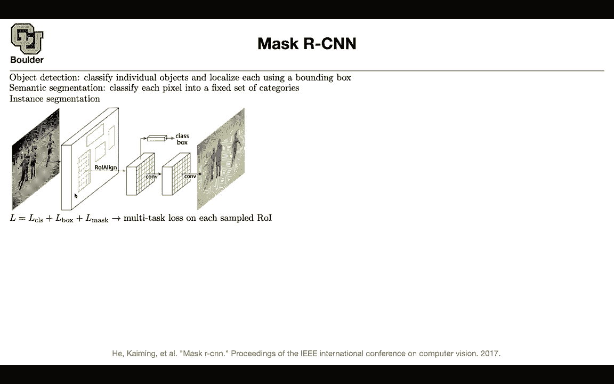

# 【双语字幕+资料下载】科罗拉多 APPLY-DL ｜ 应用深度学习-全知识点覆盖(2021最新·完整版） - P81：L37.2- Mask R-CNN - ShowMeAI - BV1Dg411F71G

Let's do Master or CNN。

And this is the last paper that we are going to cover for two stage detectors and then we are going to go into one stage detectors later on either this session or next session with object detection what you were doing was classify individual objects and at the same time local localize them using a bounding box we also saw semantic segmentation and that was you are classifying each pixel into its corresponding category with mask or CNN you can combine the two and that's going to be called instance segmentation let's see an example this is an image if you want to do object detection then it's going to put bounding boxes around your objects and that's all。

If you want to do semantic segmentation it's gonna classify this pixel on this person and one pixel and the other person as the same class it's a person regardless with instant segmentation yes this is a person that's a person but that's a different person and that's what you want to do these are all people this is a different person compared to the other one and this one there is also one behind them etc and they could be overlapping over each other so that's not an easy task so how are were going to approach it and what are the difficulties you might say okay we solve the bounding parts problem so we are going to push it through our network we are going to have a region of interest we are going to do our pooling and then we can do our classification and bounding bug prediction and then you might say I'm going to add another a bunch of other layers to do semantic segmentation。

P each box okay that's the big picture， but what are the details and what are the difficulties You're saying that you're going to put a multitask loss on each one of these sampled regions of interest actually your region of interests here and you're gonna have a multitask loss we know how to handle the classification that's going to be faster R c and the bounding boxes so we solve these problem now what is the loss of the max mask you're gonna have a mask branch and it's going to output a K by m squared dimensional output so what is k K is the number of classes person cat dog background etc So that's your classes and then you're gonna to output a mask of M by m resolution and that's where you're getting your K times m times m so that's going to be your Km square dimensional vector。

Now what is the task what is a mask you're going to use a pair pixel sigmoid so in that box that you have here and per each pixel you have m squared of them object K either exist or it doesn't exist so these are independent tasks if object K exists it's not going to decrease or increase the probability of another object existing or not existing so these are binary classification that's why you have a sigmoid it's not a soft mask and then once you do that you're going to get the average binary crossantropy loss for the mask。

 but there is still another catch during training you don't want the objects that don't exist in your box to have any impact on your parameters through the gradient that's why you're gonna only look at your region of interest the the corresponding。

groundround truth class it's K it's small K it's not in capital K and then your L mask has k is squared km squared outputs so you're only looking at m squared of them and then you're going to include that in your loss the other capital K minus one classes are not going contribute to L mask and because they are zero in your loss they're their gradients are going be zero and therefore they're not going adjust your parameter during training only the boxes that exist are going have an impact but during inference per each pixel you're gonna pick you still need all of these you still need to predict all of them but then per each pixel you're gonna pick the maximum sigmoid value and then you can also use CRF etc to make your predictions better but there is a difference between how you train and how you do your prediction That's why you need K times m squared outputs for your mask。

Branch and because it is individual your network is going to have a much easier task solving independent problems rather than one complicated problem that is intertwined so any questions about this so the idea is we know how to solve our classification problem we know how to put bounding boxes and now we know how to do our segmentation for each bounding box so I highly encourage you to just Google this paper and watch some nice videos on YouTube about what it can do this method。

For now we still have another difficulty previously we were doing ROI pullinging here。

 you had this box on your original image then you would find the corresponding pixelel or the corresponding pixels on your feature map after all of your convolutions are done and then you find the top left corner top right corner etc and then you draw your box and it's going to be aligning with the features with the pixels on your feature map on your convolution of feature map in the end so this is another precise location there is some quantization going on。

This one has the precise location for the box， but once you project it into your feature map you want these sites to be aligning with your pixels and to respect the resolution at that feature map so you're doing some quantization and that quantization is deadly for this algorithm because you want to exactly know where this box is where this particular instances and then try to segment it it wasn't that deadly for classification or box because all you need two was a box but now you need your pixels to be accurate so you need to have accuracy at the level of pixels so how do you take care of it you don't quantize the idea is that don't quantize let X be the continuous coordinate for this box but how are going achieve it x is actually the coordinator of these box is over there but then when you were projecting it you are doing some quant。

Let's say your resolution from your original image to the feature map dropped by 16 then you would need to turn that into an integer and that's going to be your quantization so youre missing some of your floating point and your box is not in the exact location that it needs to be that is ROI pullinging so the idea is that you need to avoid any quantization for the Roi boundaries and the boundaries of your bins so what is Roi align doing that you start with x and then you find these locations of your bins now you have a bunch of bins per each bin you're gonna to sample four points so per each bin you sample four points then you're gonna to on those points you're gonna to do biline interpolation and we learned about biline interpolation in spatial transformer network so you're going to do a biline interpolation and then you're gonna know the exact。

Some values。

But in the end per each bin you need a single number so what you do is you aggregate the results。

 you either find the maximum perish bin or you abooriggial so now you are not sacrificing the location of these bounding boxes so is everything clear any questions so we had two problems to solve one was what is the loss of your mask and how do you solve the problem that these locations are not accurate your boxes are not accurate enough for a segmentation task they are accurate for a bounding box prediction task but they are not accurate locations for a segmentation task and that's how you solve both of the problems you solve you know what is the loss of your mask now you know that you need to replace your ROI cooling with another operation you can call it ROi aligned and now you solve both of the problems。

In terms of the details you can have two versions of the algorithm depending on what backbone structure you're gonna to use for your underlying network。

 if it's resNe or if it is featured chrom network the previous paper and then all you do is the first part is the same as before so this gray box is the same as before what you do is you add the mass branch and then you're preding 80 classes these 14 by 14 is the actual resolution is M that you see here per each box per each region of interest so here are some qualitative results these are different people and they're colored differently these are different bottles they're colored differently and detected correctly and then that's a table the backpack different people different umbrellas。

 different people different animals different bottles etc so you can apply this method。

To get another application by reframing the problem and that human pose estimation human pose estimation is important for multiple applications one of them is video games so you want to know what are the key points in one person's body and then you can translate the movement of that person there is a camera it could be the videocam of your computer that's translating the actual locations of these key points left shoulder right elbow etc and translating them to an animated object inside your gaming environment so you jump up and down in front of your webcam and then it's going to be translated into actions of your animated version it could be another application it could be in the movie industry and we know that Hollywood is a massive market gaming is also。

Massive market probably as big as Hollywoodllywood or perhaps be so what modifications do you need to make to mask or CNN What is going be your mask now the mask is you're gonna have one hot mask it's going be one at only let's say the right shoulder that's your mask and then it's going to be zero all over the body so that's a one hot mask it's one on the knee and then zero everywhere else and then you're going to have k masks and these are going to correspond to the key point locations on our body that's one modification so you change your labeling you change how you're coming up with your one hot masks the other change that you need to make is with mask or CNN you need k binary masks now you're going have this was a binary problem now you're going to change that you're going going to change the sigmoid to a soft mask and then it's going give you。

Give you the K masks so there is going to be competition between left shoulder and right shoulder in your last function now and this is going to be pair each bounding box you are predicting all of the k classes any questions about this I think it's clear perfect I think we are out of time for those of you who want to stay and ask questions you can stay and asked they once you want to leave you can leave next session we are going to move to one stage detectors。

