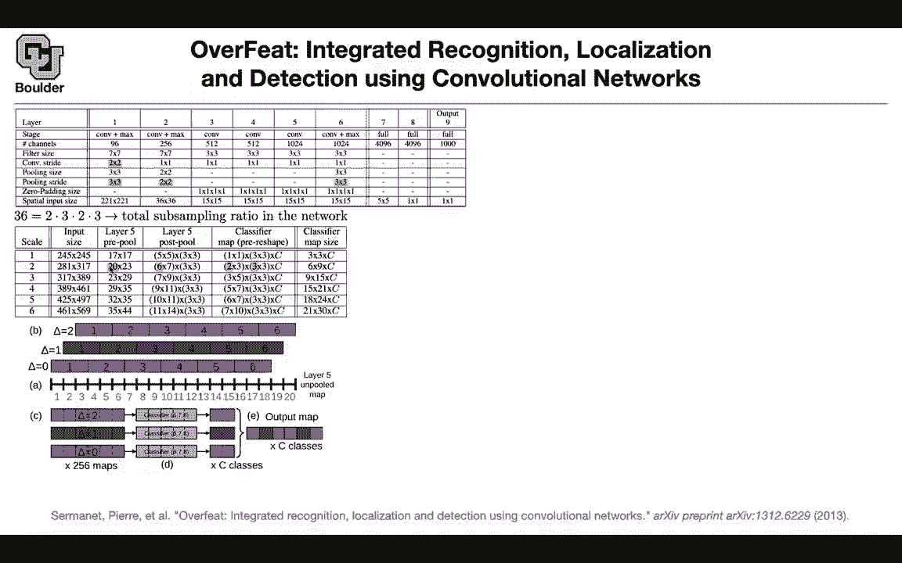
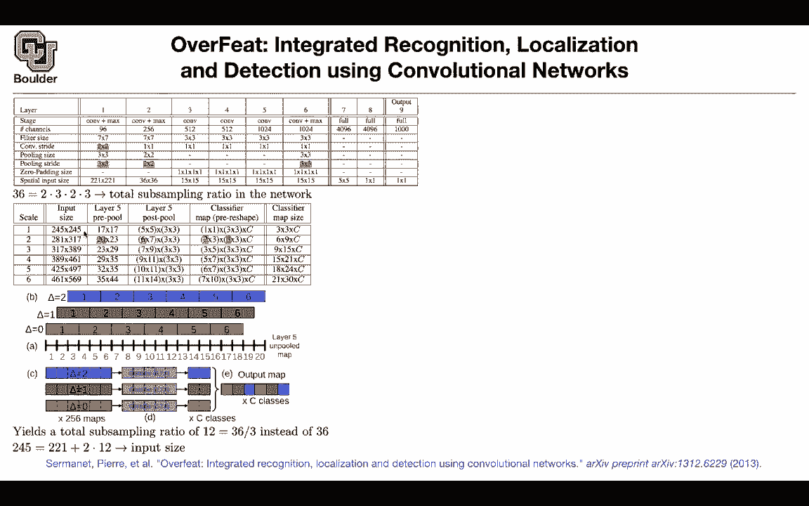
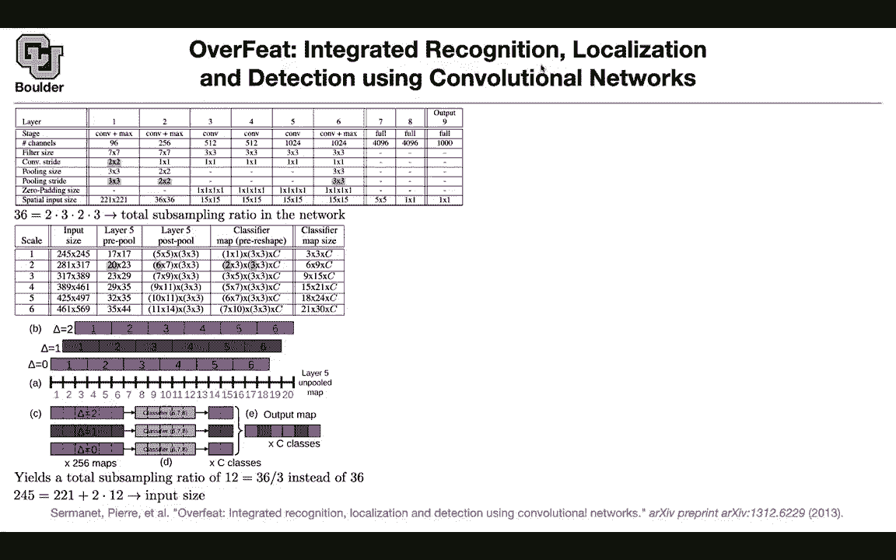

# 【双语字幕+资料下载】科罗拉多 APPLY-DL ｜ 应用深度学习-全知识点覆盖(2021最新·完整版） - P82：L38.1- OverFeat - ShowMeAI - BV1Dg411F71G

i think it's at least two weeks that we，have been，working on object detectors and we，started with。

uh two stage detectors so you needed to，stage，the first stage was the region proposal，network。

the next，stage is using a convolutional run，network to classify the object。

and adjust the bounding box around that，proposal，using a regression so the region，proposal network。

was taking an image it had a bunch of，anchor anchor boxes，and we were using those anchor boxes to。

give us an objectness score，is there an object inside this anchor or，no。

and adjust the anchor so you always had，a frame of reference。

even for your region proposal network so，it was two stages you have the region。

proposal network and then you have your，detector，that's going to do the detection for you。

now the question is，wouldn't it be more efficient if you，combine the two。

combine the region purple zone network，and，the detector network and do it in one。

pass will it be more efficient，and if it is more efficient is it worth。

it how much accuracy you're losing，by doing so because we know that the，current state of the art。

for object detectors are these two stage，detectors，you first propose a region and then you。

focus on that region to do，your classification and bounding box，regression the question is can we do。

both at the same time，and that's when you're gonna have one，stage detectors。

and then i'm gonna start with overfeed，this is，one of the first papers it's actually，2013。

so it's right after alexnet that is，trying to，address that problem in particular。

object detection，and they're gonna use a unified，framework，to do recognition basically。

classification。

localization and detection let's start，with the classification task。

so the network is very similar to，alexnet，so it's exactly the same network。

practically speaking，so let's go through it in layer one you，have convolution and max pooling。

your filter size was seven by seven your，convolution stride is two by two。

you have pooling size and then pulling，stride so whenever you're doing stride。

you're down sampling so your features，are gonna have a lower resolution。

compared to your original image then you，go here。

you have that fetal size you have the，pulling size and then you do another。

stride so you're down sampling and you，have a bunch of other convolutions。

and then you have a three by three。

striding，gonna。

end up before your fully connected，network。

with uh a total sub sampling ratio，of 36 so it's going to be 2，times 3 times 2 times 3。

and we know that when we're，investigating alexnet，that uh to report better accuracy on。

your classification，they were taking 10 regions during，inference，of the image top right corner。

top left corner bottom left bottom right，and the center this is gonna give you，five and then。

once you rotate your image it's gonna be，the same object inside the rotated。

image that's gonna give you five more，and you had 10 regions，and you were pushing your these 10。

regions through your network，and then voting all of those 10，predictions。

in the end are gonna vote which class，you're gonna use，and it's just a simple average of the。

probabilities，so to improve the accuracy that was what，alexnet was doing。

during inference that's only 10，regions 10 crops of your image that，you're pushing through。

your network this paper came along and，said you can actually do more of that。

and you can actually have multiple。

scales for your image，let's say you have six scales for the，image。

and these are the input sizes of your，image so you can。

have different scales for the inputs，to your network and then in the end you。

want to end up with more classes。

for you to be able to vote this is gonna，give you nine classes。

three times three don't worry about the。

details i'm gonna go through it，but the first one is gonna give you nine，classes nine predictions。

this is gonna give you six times nine，nine times fifteen and then you add them。

up you're gonna end up with a lot of，predictions and you want to do it in a，smart way。

and in an in an efficient way and once，you have。

these many predictions out of a single，image，you can just average them out and then。

that's going to give you a better，but。

how do you achieve that so i'm，highlighting a bunch of numbers here。

that are important and then we are going，to go through each one of them。

the first one is you take an image let's，say at the scale 2，you take an image and once you push it。

through your convolutions，and right before layer 5 you stop，you're gonna end up with a feature。

map that has these many pixels 20 times，23，and we know that this is going to be。

different depending on the scales of the，image that is being。

inputted so that's pre-pulling now we，want to do our pulling。

and where is this number six coming from，and what does that mean and what is the。

what are these three by three，what you can do is that when you look at，this total。

sub sampling ratio it's too big you want，to have a smaller，sub sampling ratio and if there was a。

way to divide this by three then you，would end up with。

ratio，so that's where this 3 is coming from，but how can we divide that。

you take your input which has in this，case。

let's only look at the x coordinate，let's not worry about the y coordinate。

it's going to be the same arguments。

so you're going to end up with 20，numbers here。

that's the resolution before pulling，for layer five then what you do is you，you're gonna have uh。

slides of delta to the right the first。

one is you don't slide，your filter at all the first one you，slide it one pixel to the right。

the right，and that's where these three is coming。

from because you have three deltas，on your image and the other three is。

object，but now we are only analyzing a single。

dimension okay now you do your pulling，you pull these three numbers and you put，it here。

that's the red that corresponds to the，delta being zero。

you pull these three numbers and you put，them here，and then in the end you're gonna end up。

with six numbers，for each color that's after pooling and，that's what you get here。

that's the six now you understand all of，these numbers。

20 is the resolution before，pulling this is the resolution after，pulling。

and then because you have three deltas，you're gonna end up with three。

here the rest of it is uh，taking this uh features and pushing them。

through your，fully connected network but we know that。

the fully connected network needs，a resolution of five by five because。

then you're gonna flatten it and then。

it's gonna have the，correct dimension for you to push it，through your fully connected network。

so it's gonna do uh it's gonna have the，resolution of five by five。

it needs that it's a requirement it，means that you are taking。

one two three four five and that's gonna，basically you take these first five。

numbers，and you push that through your fully，connected network that's gonna give you。

one number here and then you take the，rest of it the rest of。

the five and that's gonna give you a，second number so that's where the two is，coming from。

so after pushing it through the，fully connected you're gonna end up with。

two numbers，in the other dimension you're gonna end，up with three numbers but。

let's focus on the first one so now what，you do is you take this number。

multiply that by three 2 times 3 is，going to give you a 6。and these are the six values that you。

see here and these are，six times the number of classes that you。

have for the other dimension you have，nine of them，in the end you're gonna get six times。

nine predictions so now what happened，to the total sub-sampling ratio after。

all of these operations，because of these deltas you have three，of them you。

managed to reduce the total subsampling，ratio。

to be 12 rather than 36 now the cool，thing is that，your network is looking at multiple。

scales for your image，and each one is not being too much，subsampled。

and in the end you're going to end up，with a lot of predictions。

that you can use them to vote what's，going to be the last，prediction of the network after all of。

the voting is done，now you might wonder alex net takes as，input。

221 by 221。

inputs that's the input to the alex the，input resolution，where is this 245 coming from。

that's coming from 221 plus 2。

times 12 and 12 is your sub sampling，ratio so that's why the first scale is，245。

by 245 that's your entire image and this，12 is coming from。

these uh delta shifts that are happening，in your network so is everything clear。

for the classification part，that's the recognition part okay so far，so good。

and i like the fact that you are saying，it it makes sense。

so far because we want to do，localization and detection。

in the end so at this point in the paper，you have a very good feature extractor。

and that's called overfeed and you're，gonna hear this word a lot when you're，reading papers。

you're gonna hear a lot about this paper，so it was a very influential paper。

when it came out so what about，localization，first of all we know that convolutions。

are really efficient when it comes to，sliding window，you take a window and then you slide it。

because you are sharing a lot of，computations，let's take as let's take an example。

if your input image is 40 by 14 by 14，and your convolution kernel is 5 by 5。

you're gonna end up with 10 by 10，then you have your pulling that's gonna。

give you a resolution of five by five，you have another convolution then a。

bunch of one by one convolutions，and then in the end you're gonna end up。

with a single class what we just saw，and why this is efficient is that if you。

increase the resolution，cost，are these yellow ones so these are the，additional cost。

compared to what you did before the rest，of the rest of it is being shared。

and for this additional cost you're，going to end up with more classifiers。

so so rush has a question i'm a little，bit confused about the scales。

is this diagram happening on each scale，this diagram yes so we just did it for。

scale 2 which corresponded to 20，map，then yes this same methodology is gonna。

happen when you have a resolution of 17。

or a 23 or a 29 so the same methodology，but in the end whatever that's gonna。

happen is that your sub sampling ratio，is going to be，12 compared to 36 because we are using。

three shifts，and the other question is is this really，efficient and the answer is yes。

because the only additional cost，is gonna be these two columns and two，rows。

of your image okay so far we're doing，classification now let's fix，the feature extractor part of the。

network from this point up until this，point，let's keep the classifier that's fine。

it's doing the classification for us，we don't worry about that now we want to，do the regression。

bounding box regressions so up until，this point，we are going to fix the parameters。

you're going to put a head，for regression and that's going to be a，multi-task learning。

the first task was classification the，next one is regression，and let's create the head for the。

regression，and this figure part a corresponds to，what you have here，it's a six by seven。

one two three four five six seven，so it's a six by seven uh feature map。

don't worry about these 256 channels i，guess there is some typo。

in the paper so don't worry about the，number of channels it's x number of，channels。

and then you have three by three shifts，so this is exactly what you have here。

now rather than doing the classification，part we want to do the。

regression part so you do your pulling，you're gonna end up with，a six numbers and that's going to。

correspond to this six here，and you're gonna have three by three，shifts。

and then the number of channels is very，easy to change the number of channels。

it's just a matrix multiplication of in，this case 256，by 4 96 so that's the first layer。

in your regression the second layer in，the regression，you're just changing the dimensions and。

then the last layer，is gonna output four channels，and they correspond to the top left。

bottom and right，coordinates of your box and then this is，gonna be a per class regression。

and then the rest of it is you just，write down your l2 loss，you train this part of the network this。

is the head of the network for，regression you do that now your，classifier。

and regressor they are sharing，most of their parameters from this point，up until this point。

and then they depart into two heads so，this is gonna give you a lot of boxes。

so you're gonna have a lot of boxes，we know that when you have a lot of，boxes our previous method。

was to do non-maximum separation，you can have an alternative method for，merging these boxes together。

and that's a greedy merge strategy so，what happens in the greedy search。

your classifier head at different scales，scale one two three four five six。

is gonna make its classification and，then you're gonna pick the top k。

per each scale top k classes the ones，that have the highest probability。

they're gonna be in your cs so that's a，set of all of the classes。

you're gonna have a bunch of bounding，boxes they correspond to。

those classes because we know that you，have a per class，bounding box predictor so as soon as you。

choose your，class you're gonna pick the bounding box，the corresponding bounding box。

and then you're gonna put it in your set，bs these are a bunch of coordinates。

you create a union of all of them that's，gonna be your set b，and then the idea is that you want to。

merge them you don't want to report，all of these boxes you want to report，only a few of them。

so how do you merge them you're going to，define a，match，score is coming from the distance。

between the centers of two bounding，boxes，and the intersection areas of the boxes。

and that's going to tell you how good of，a match are these two together，are。

not matching that there is a very small，match between the two，of。

those two boxes so you're gonna find two，boxes，that are matching the least and then。

forget about the stopping criteria，then you merge them you just merge the，two boxes。

and the way that you merge it you just，compute the average of the box。

coordinates that's how you merge them，you add the merged box to your set b。

and then you remove the two boxes that，you started with so you remove those two。

because you merge them together，and then the algorithm is going to stop，as soon as this arc mean。

is bigger than the threshold it means，that you don't want to，merge anymore the match score otherwise。

is gonna be，it means that all of your boxes if the，minimum，is bigger than threshold it means that。

choose，they're gonna have a match score bigger，than t it means that there is no reason。

to match them anymore，and that's when you're gonna stop so i，know this is a technical paper。

and it's actually a very hard read so i，highly encourage you guys to read that，paper。

because it's written by jan lakum so he，knows what he is talking about okay。

so we are using a couple of features of，convolutions，one is that convolutions are really。

efficient when you have，sliding window the other one is the，multiscale。

so i haven't seen this greedy merge，being used in any other paper。

but i think it's a good idea to know，about it and this，this greedy merge is a it's an，alternative to。

non-max suppression right it's an，alternative for this paper，or the method chosen by this word okay。

so otherwise the paper is not that，complicated if you think about it。

there is some transfer learning from，learning，you have a classification head you have，the feature。

extractor classifier part regressor part，and then you need it to first。

36 was too big because you are going to，end up with，huge receptive fields。

and it's not going to give you too many，boxes to work with and it's not going to。

give you too many classifiers，so you first have to do the sub sampling。

therefore you needed this trick，of shifting your filters by，one to their right and then you had a。

regression regressor network that's，predicting，four channels per each class and then。

the rest of it is you come up with the，training data you know the ground truth。

bounding boxes and then you do your，regression so is there any sense of uh。

scoring the boxes here like there's no，score assigned for a box right i think。

because this is per class then you have，your score，it's the one that corresponds to。

the classifier part does that answer a，question yeah，and then another question i had is in，these uh。

in these regression maps um what do，these colors，represent so the first color is。

corresponding to the color that you have，here it's after you're pulling。

so you're gonna have a filter of this，size，and that's being multiplied by this uh。

i don't know what color that is let's，call it orange with the orange part。

and then that's gonna give you a number，here it's not actually a number。

it's the vector of this language so they，correspond to this slide the next one。

you're going to slide it to the，right by one and then the last one is，going to be，region。

so that's what they correspond to does，it ask you a question yeah。

