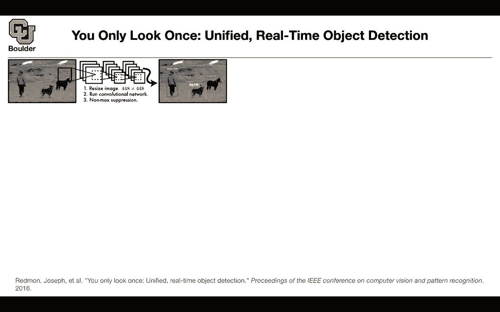

# 【双语字幕+资料下载】科罗拉多 APPLY-DL ｜ 应用深度学习-全知识点覆盖(2021最新·完整版） - P83：L38.2- YOLO - ShowMeAI - BV1Dg411F71G

okay i'm sure many of you have heard of，yellow，you look only once and with one stage，detectors。

you're more going after efficiency you，want your detector to be real time。

compared to two stage detectors with two，stage detectors，you started with something that you。

wanted to be very accurate，with one stage detectors you want to，start with something that is very。

efficient you want it to be real-time，and by the end of these slides when i。

finish all of them you're gonna see that，the two methods are，actually converging to each other but。

they are approaching the same problem，from two different perspectives，one is from the perspective of。

efficiency the other one is from the，perspective of accuracy，so it's gonna have three stages you're。

low it's gonna have，you first resize your image then you run。

your convolutional network and then you，do your non-max operation。

so this is the key figure in the paper，so you start with the s by s grid。

on your input image you have s。

regions here yes beans there，then what your network is gonna do is，gonna predict the bounding boxes。

and the corresponding confidence you're，gonna have a classifier，per each region which is a class。

probability map，and the plot that i'm showing is for，both of them is for inference we don't。

worry about training for now，if you have that bounding boxes plus，their confidence。

and if you know the class probability，math you can multiply them together，and pick the most probable。

bounding boxes and just report them so，you just multiply this by that and。

that's going to give your final，detection，and this is happening during inference。

behind。

s，now you want to see what is our training，data if the center，of one of your ground truth objects。

falls into a cell that cell is gonna be，a positive it's gonna be responsible for。

detecting that object，so that's how you're gonna that's the，rule that you're gonna use to define。

your training data，if the box for this dot if its center。

falls within let's say this cell that，cell is gonna be responsible。

for detecting that dot each cell is，gonna predict，case，so it's gonna predict two bounding boxes。

and a corresponding，confidence score so what is the conflict，of the score。

at least what is the trending data for，it is the probability，of the object times the intersection。

over unit of ground truth，and the predicted uh bounding box so，that's。

what the network is gonna output it's，gonna output the confidence，so what does this mean what is the。

confidence mean，it means how confident your model is，that this box let's say the box that is。

responsible for the dodge contains a dot，contains any object an object so it，doesn't have to be a。

dot it could be any object and at the，same time it's a measure of how accurate。

it thinks the box is because of the，intersection of a unit so that's the，confidence。

first it tells us that there is an，object what is the probability that，there is an object。

and at the same time how accurate the，box is，so that's the confidence score now we。

want to go towards the，regression part you have the center of，the box。

and that's going to be x and y and these，are really important this is。

relative x and y is relative to the，bounds of the grid cell，so if your cell is defining your。

coordinate system，then in that coordinate system you are，defining x and y so x and y。

is a pixel in this coordinate system but，w。

image，so they are in the scales of the entire。

image，and then each grid so not only it's，going to predict，the bounding boxes and the confidence。

it's going to create the class，probability。

and it's just the way you interpret it，is that if there is an object。

condition on there being an object what。

class that is i know that there is an，object in this，region or in this cell if i know that。

there is an object what is its class。

dot，so if you interpret these predictions，this way this way，and then you can multiply the confidence。

by the class probability map，this is the confidence this is the class，probability。

and then you're going to end up with the，class specific confidence score，dot。

not any other object so what is your，network structure。

in the end your network is gonna output，a tensor it's gonna take an input image。

and it's gonna output s by s and they，correspond to these grids，it's gonna output b boxes。

each box is gonna have its coordinates，x y w and h and then a confidence。

that's where you get this pi and then，it's gonna output c，classes c conditional class probably and。

that's corresponds to each one of these，classes for now it's a red but during。

training it could have been anything，it could be any of those c classes so。

that's what your network is outputting，okay now we know what is our data。

we know what is our model now we need to，know how to train it，and the training is just regression。

based everything is regression，mean squared error you have your x i，this is the ground truth。

this is the prediction of the model that，corresponds to the center，you have y i y hat i these are。

the ground truth minus the prediction，then you are，doing it for all of these s by s grid。

or all of the great points in your grid，you're gonna have a squared of them。

then you're gonna have b boxes，for each grid and then one ij of object。

is gonna tell you is there an object，this is condition，and there being an object in the i，cell。

and there are only two boxes there，itself and if it doesn't exist you just，don't。

analyze it so that doesn't include in，your loss okay that's for the x and y。

for the center of your box，for the width and height you need to you，could do w i minus w i hat。

but then your algorithm is not going to，converge the reason is，small changes to big boxes are，small。

root，is gonna try to do that it's not perfect，but it's trying to do that。

so a change on a big box is a different，is a smaller change compared to the same，change。

on the smaller box okay then you have，that if there is an object in there。

that term is going to be included in，your objective function，then if there is an object there is a。

class corresponding to it，and this is your confidence because it。

is being interpreted as a confidence，not as a probability you can use a，regression loss。

otherwise you would need to do，cross-entropy but now，because these are confidence predictions。

you just do that，and this is condition on there being an，object this is condition on。

no object it means being background so，you're gonna have a prediction for your，background as well。

and what else is left then you need，you need to do another regression for，these class probabilities。

you could do a cross-entropy loss but，you might as well use the mean square，class。

this is perish class because you know，that per each，grid you're gonna have a vector and c is。

just picking out that，entry of the vector and then that's，gonna help you do a regression on this。

class probably，that's your entire loss if lambda，coordinate lambda coordinate and lambda。

nu object or old equal to one，your algorithm is not going to converge，why is the reason。

the reason is that there are a lot of，negative examples，there are a lot of boxes with no objects。

background，that you don't care about but if you add，them all together。

then your loss is gonna be tilted toward，those，negative objects the ones that you don't。

want to detect so what you do is you，reduce this value and then increase the，other ones。

the earlier one is five this is just to，try to balance the，they are。

compared to each other what is the，trade-off between doing a regression on，the coordinates。

versus some object that don't exist the，background，if you don't do this this turn is going。

to dominate because you have a lot of，blocks，per your grid there is grid and then you，have 20。

classes because that is pascal usc and，this term i explained，if if an object appears in cell i。

this indicator function is one otherwise，it's zero，and this other term denotes that the j。

bounding box predictor in cell i is，responsible for that prediction。

so this is where you're training data，and how do you identify what is positive。

and negative is coming into picture，and the way that you do it you look at，the intersection，lot。

when you do yolo but what did you miss，the amount of boxes being predicted，correctly。

so it reduced from 71。6 to 65。5，but then something interesting happens，your network is making。

less errors for the background class，it turns out that faster cnn is making a。

lot of errors for the background it's，identifying，something on the background that doesn't。

exist it's just background okay，i think we are finishing right on time。

for those of you who have questions you，can stay i'll ask and they also want to，leave it。

i'll be around so this um the c sub i，is that the class score yes so c。

sub i is the class score and then how，does that work for the，confidence for each grid per each box。

you have a confidence okay and then when，you have the no，object why does your class score show up。

in that loss，uh this part yeah you are still，predicting a，value for yourself and your box。

but that could be a background these are，where you put your negative if you。

include only positive examples，then your network is not trending at all，because it needs to see all。

what is a good it needs to be penalized，when it's making mistakes。

and then you need to know what is a，mistake you need to tell your network，what is a mistake。

that's why the negative examples matter，does that make sense，yeah and then are we going to spend uh。

more because，we still don't know really how forward，passes is done。

um so is there another like class on，this uh，network or what do you mean like how do，we get。

our how do we do like what's the，architecture for，generating these uh bounding boxes oh。

yes they are using，uh dark nets but uh that one i'm gonna，show you in the last slide。

it's gonna be low version three i'm，gonna use that slide to give you the，architecture。

okay cool but for this paper what，mattered，all，regression based and how you design your。

network which is not that hard you can't，have any any，convolutional neural network and then in。

the end you're outputting these many，numbers，i see yeah i'd always confuse dark net。

and yolo but i guess，yellow is sort of built on top of dark，net。

and it has a special loss a yellow has a，special loss yes，and the other one is it's a single stage。

detector，and and the idea is this sliding window，so you have boxes that are being。

slid over your image so there is no，region proposal network and uh。

yes and the last function and the last，function we are flexible we can change，it。

yeah and then so going back to the the，sbs，grid so each just to make sure i have，this down each grid。

or each cell inside that grid generates，two bounding boxes，but that bounding box can extend outside。

of like looking just at this picture，like the bounding box can be bigger than，the the actual。

cell right exactly so x and y，the center of the boxes are，and，right。

so multiple cells may uh may output the，same bounding box，yes when it comes to prediction yes but。

during training，that's why you have this one of，objective and running logic。

i assume that's when the training is。