# 【双语字幕+资料下载】科罗拉多 APPLY-DL ｜ 应用深度学习-全知识点覆盖(2021最新·完整版） - P84：L39.1- SSD - ShowMeAI - BV1Dg411F71G

okay any questions about last session i，had a question about uh，this uh yolo paper yes um。

when so like on the bottom left when，it's talking about sort of the overall。

process um when when we say，if the center of an object falls into a，grid cell。

that grid cell is responsible for，detecting that object，um i guess like does each。

grid cell i don't know could you just，explain that a little more i'm confused。

like what each grid cell is doing maybe，uh so each grid cell，let's take this one is predicting。

the coordinates for d boxes，so let's say it's predicting two boxes，so it's。

it has two boxes associated with it each，box，is gonna have four coordinates。

x y w and h and then it has，a confidence score is there an object。

here or no and then at the same time，it's going to predict c classes。

it's going to predict a vector of，probabilities，given that there is an object in this，box。

what object that is so that's what each，cell is doing，this is during inference so each box。

for instance let's take this car here，let's take this the center of that that，cell。

it's predicting two boxes for two of，these boxes that you see。

is being predicted by this guy and then，the confidence is being denoted by。

the thickness of the lines thickness of，the edges，so it's predicting that and then at the。

same time this part，is predicting even given that there is，an object。

in this box what is its class and this，is the，best class and then you just multiply。

this by those boxes，and then do non-maximum suppression kill，most of those taxis and then you're。

gonna end up with a single box so that's，during in parents，you need something to train this what is。

data，perish box we know that there is no，object here，you shouldn't be responsible for this，dog here。

or the bike or the car so that that's a，negative example，but this box here is responsible for。

predicting the car，you're labeling your data so that one is，going to be。

labeled with a car and then that's the，one that is going to enter in your，objective。

and so the idea is that on test data，the network like if this image with the，dog in the car。

was a test image the network would be，able to identify that there was a dog。

object and then it would be able to，associate the center of that，object with a certain squid cell。

and then only look at that grid cell for，the bounding box so no。

this part that i'm saying if the center，of an object，falls into a grid so that's only for。

instance that's for，training only or yeah sorry yeah this is，only for training。

okay current is very straightforward，each of these guys is going to predict。

these many numbers d times 5 plus c，and then the rest of it is just，multiplying these two together。

okay even if okay so even like some，some grid cell at the bottom right where，there is no object。

would still be presenting b for b，bounding boxes，for for each class exactly so there is a。

box here it's being predicted，and it has a corresponding class but。

then the non-maximum solution is going，to kill it，okay yes once one problem is that。

the confidence is very low and that's，gonna kill the bots，okay doing non-maximum separation and。

then together all of the grid cells for，the dog are like，combining to get one final sort of。

bounding box for the，dog overall even though there's multiple。

grid cells that are predicting bounding，boxes there，exactly so in the end after this step。

you're going to end up with a bunch of，boxes，yeah and their corresponding class，probability。

and as you can see here you're just，multiplying them together，then it's going to give you a class。

specific confidence score，so how confident is this predictive box。

that there is a dog in there and once，you have that information that's enough，input input。

to your non-maximum separation okay，that's during，parents but what you're seeing here is。

for training yeah，yeah because this is the method of，labeling your data。

what is your data what is the，corresponding data how do you want to，train it。

and then we also have another trouble is，that many of these boxes that you see，here。

there is no object in them you have，class imbalance，and many of them are just not。

responsible for any object，that's why you have to downgrade the，laws for。

those many examples those many boxes，that there is no object in that。

during training but once the training is，done the rest of it is very simple。

each grid is going to predict a bunch of，boxes the corresponding components you，multiply。

and then you do non-maximum operation，and that's why it's fast。

yeah yeah so it doesn't have two stages，yeah so just this also means that。

there's a maximum number of，objects right because we can't get any，more than。

s times s times b boxes right，yes so this is the maximum number of，boxes that you've got。

s times s times b pair each image，and that's actually a very great point。

this is a good segue to the next paper，what if you want to look at multiple。

scales and at the same time you want to，end up with，more boxes what would you change and i'm。

sure many of you have heard about，ssd single shot multi-box injector。

at least it's one of the benchmarks，in mlperf so machine learning，performance。

and that's where these companies and，then，they compete whether their algorithm is，better than them。

another algorithm whether their hardware，their，implementation is better so ssp is one。

of those benchmarks，and let's see how it is different and，how does it push the state of the art。

so the objective with ssp at that time，2016，was that you had faster rcn and then you，had yellow。

yellow is very fast but it's not that，accurate，and then you have faster rcnn which is。

really accurate but，is not as fast as yolo so they wanted to，come up with。

an algorithm that has the best of the，two volts it's faster，and you'll know and it's more accurate。

than faster rcns so it has to be，single stage so it's gonna be a single，stage algorithm。

but how does it build upon the ideas in。

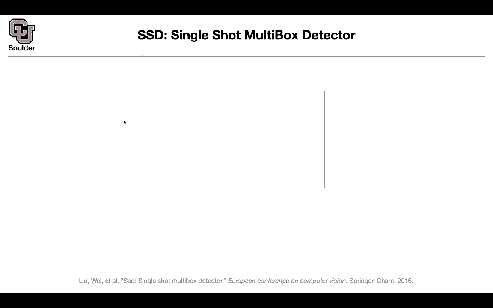

yellow，so let's not worry about this figure for，now let's worry about these ones so i'm。

gonna go from，bottom to top because we covered yellow，another way to think about。

yellow we saw previously that on the，original image，we were creating uh a seven。

by seven grid if i go back，this s was 7 and that's your grid，s by s but you are doing it on the。

original image，another way to think about it is that if，you push it through your network。

in the end you're going to end up with a，7 by 7 by 30，feature map and these are going to be。

responsible for your boxes every pixel，in your feature map is going to，correspond to a cell。

on your original image and what is this，num where is this number 30 coming from，30 is coming from。

uh you have this is seven by seven，then b is two two times five is ten。

and you have 20 classes that you're，predicting that's going to give you 30。so that's exactly。

the output of your yoga it means that，you're going to have 98。

boxes per image i don't think it's class，it's 98 boxes per，image and then you do non-maximum。

separation and this is during inference，an image goes in you're going to end up。

with 98 boxes you do not maximus，operation and then you report your。

results so the idea of ssd is that，not only you can look at this feature。

map but you can look at other feature，maps，in your base network and let's say your。

base network is bgd16，so you can look at multiple feature maps。

in your layers at different depths one，of them could be this，38 by 38 by 512。

this is gonna give you 38 by 38 boxes，and let's say each one is predicting，four or six boxes here。

you have four boxes perish pixel，actually you have two boxes for each，pixel here you can have。

four or six and that's exactly what you，see here each，feature map each pixel in your feature。

map is gonna，predict four boxes or six boxes and，these are at different scales。

so one of them is at a feature map of，eight by eight the other one is at a。

feature map of four by four this could，be at a feature map of 38 by 38，then 19 by 19 10 by 10。

5 by 5 3 by 3 and then the last one，in the end you're gonna end up with more。

boxes a thousand seven hundred and，thirty two boxes，and then you can do non maximum。

operation on that so these have the，higher，mean average precision compared to，yellow。

at the same time it's faster so is，everything clear so far，yes no okay perfect so this is going to。

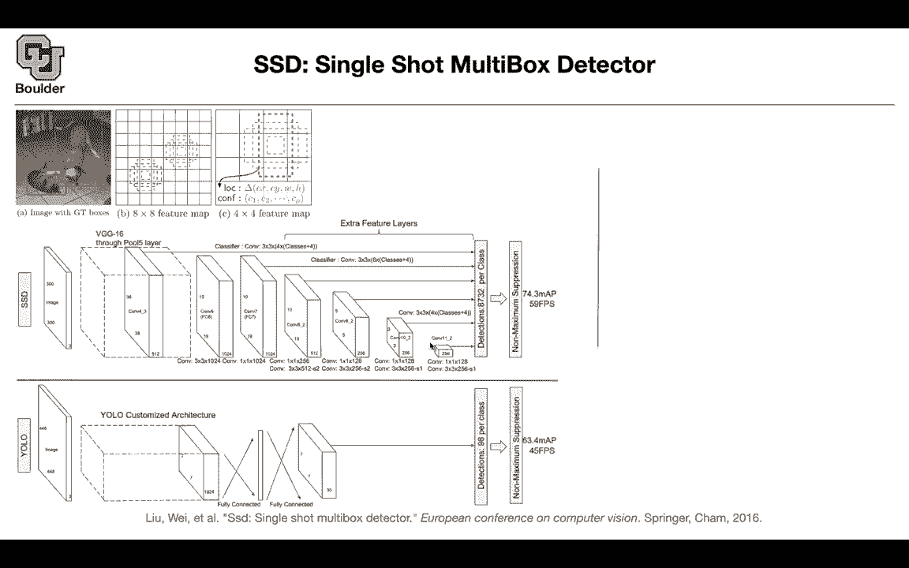

give us more boxes to work with，at different scales because we know that。

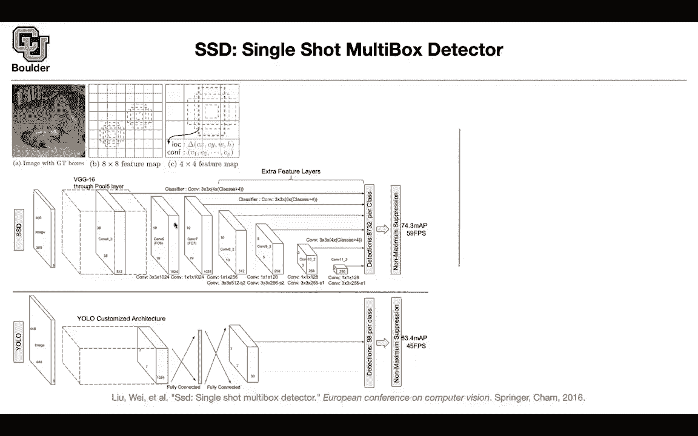

each feature map is，looking at different scales in our image，the receptive fields are different。

this last one is probably looking at the，entire image，and this one is looking at portions of。

the image so where is this，8732 coming from，there are four boxes that are being，predicted。

and this is four times 38，by 38 these are the number of boxes from。

this layer the number of boxes from this，layer，is 6 times 19 by 19。

the ones from here is 6 times 10 by 10，the next one is so you figure whenever。

on the arrow there is no nothing written，it's just what you copy and paste from。

top so it's going to be six times five，times five，plus four times three times three。

and then this last guy is predicting，four boxes，with a huge field of view and that's，gonna be。

four times one by one and in the end if，you add them up it's gonna give you 8732。

okay that's one contribution you're，predicting more boxes，the other contribution is when you look。

at the loss function，previously we're doing a regression for，classification or for our confidence。

uh now we can do actually，a cross-entropy loss for the，classification part and the regression。

part is，the bounding box regression is the steel。

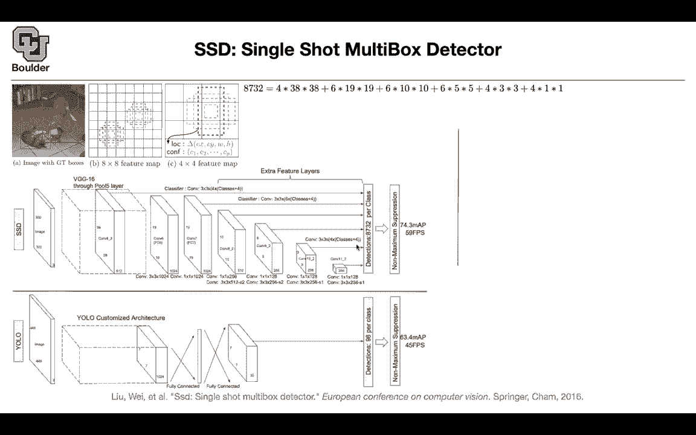

regression so that's going to be our，training objective，let us start with this part with the。

localization，part of the last one this is the ground，truth box。

this is the predictive box and these are，the four parameters。

of the boxes and then x is an example is，an image，and that's going to give you the loss of。

the localization you have to balance the，trade-off between localization and。

your confidence which is a soft max，and then you have the number of matched。

default boxes and if you look，this box here is being matched to the，dock。

these two boxes here are being matched，with that and the rest of them are，negative examples。

that's how you trade it this is the，softmax loss and，we learned about smooth l1 loss and。

this is more robust to outliers the，problem with these bounding box。

predictions is that you're going to end，up with a lot of outliers so you need to，have。

a regression loss that is sensitive that，is not that sensitive to outliers。

so what's happening here is that you，have l one loss，far from zero and then near zero it's。

going to be l2，so there's a smooth transition from l1，to l2，and then l1 again so it's not growing x。

quadratically far from zero it's linear，okay。

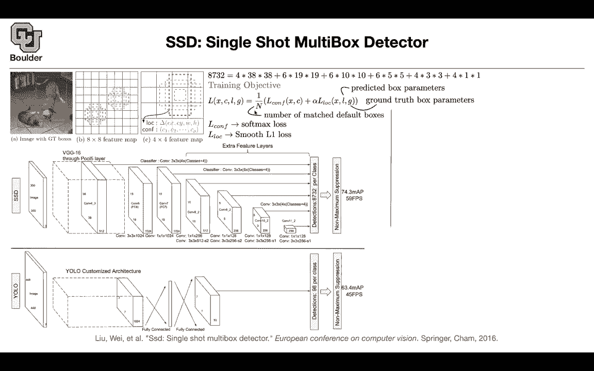

that's your training objective and even，if we go back。

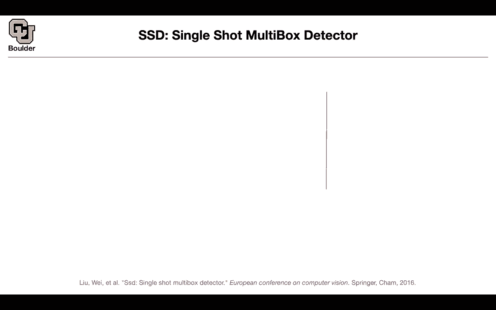

we had to deal with the same problem，in yellow as well in the loss function。

we have to take a square root of the，width and the height of the entire image。

and that's exactly the same problem，because the small change the same change，on that big box。

is relatively smaller control compared，to the same change，on a smaller box that's why you did you。

have to do this，that's not the best way out of it but it，at least mitigates the problem。

so you're having the same issue here and，it's just meter。

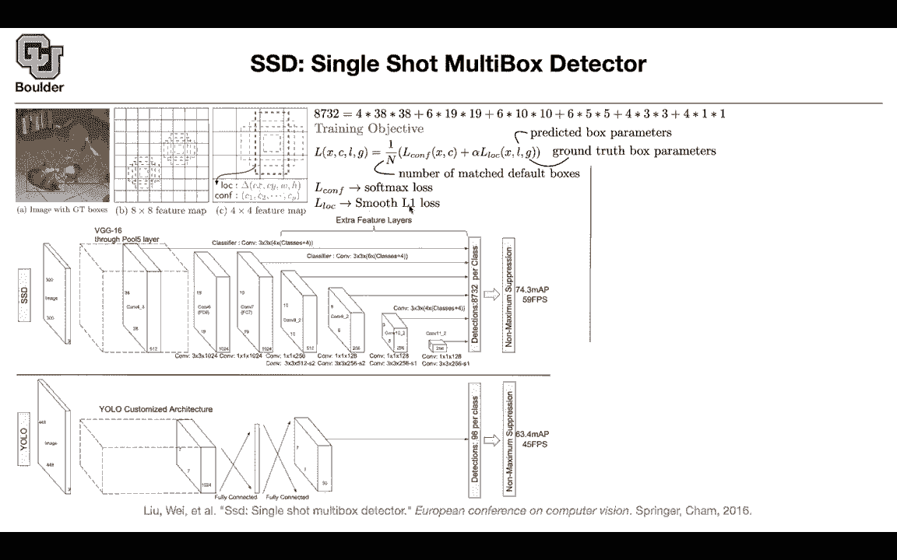

you're dealing with l1 so it's linear，outside the，outside the neighborhood so what are。

these default boxes，where are they coming from what are，their scales and。

to which layer are we associating them，one，this is two this is three this is four。

this is five this is six，you choose a minimum scale let's say，points。

zero two you choose a maximum scale，let's say zero，nine and then you linearly interpolate，from。

zero point two until zero point nine so，these are going to give you your scales。

and then each one is gonna be associated，with a different layer。

for layer one you have the minimum scale，and then for the last layer you have，your maximum scale。

these are the sizes of these boxes and，as you can see，for instance is eight by eight feature。

map you are scaling it to have the same，size as your original image。

so that these boxes are having the same，size or similar size，related to the original image it means。

that the deeper you go into your，network like you this last one you're，gonna have a huge box。

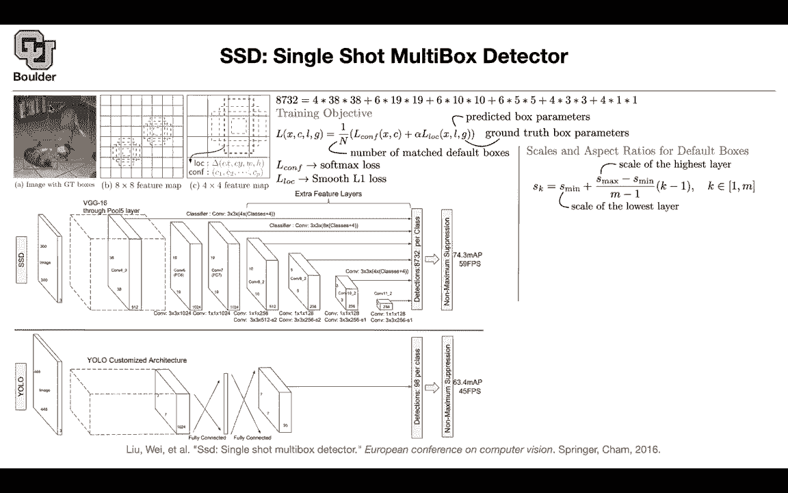

the image，so is the intuition there that at lower，layers you're looking at。

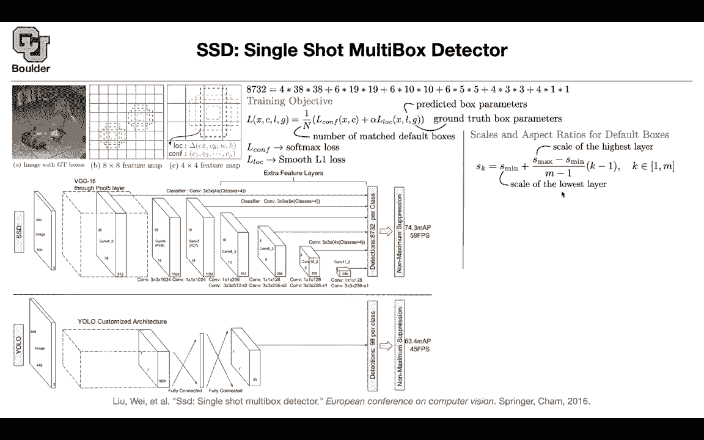

larger scales than or sorry i guess，higher layers further in the network。

you're looking at larger scales。

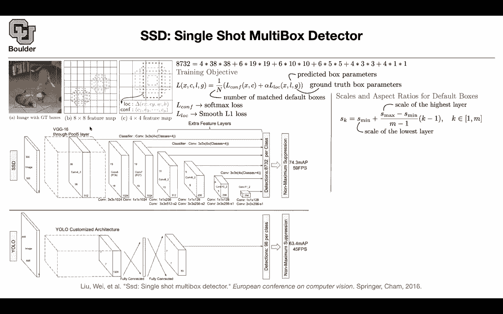

exactly so earlier in the network you're，looking at the smaller scales。

and when you go deeper you're looking at，larger screens，or larger objects in your image and。

that's how you associate them you have，different skates，and then for aspect ratio you pick a。

number from one two three or one half or，one third，these are going to be your aspect ratios。

this is one two，three four five numbers so these are，gonna give us，five boxes per each。

feature map and then the width and the，height this is how you come up with them。

you have your scale at this feature map，you know your aspect ratio。

and basically if you divide that number，by this number，this square root is going to go away and。

then you have these，aspect ratios the width is the same as，the height。

the width is twice as big as the height，three times bigger than the height。

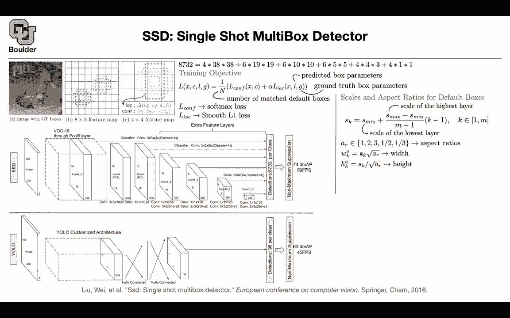

or the height is bigger than they read，by two or three。

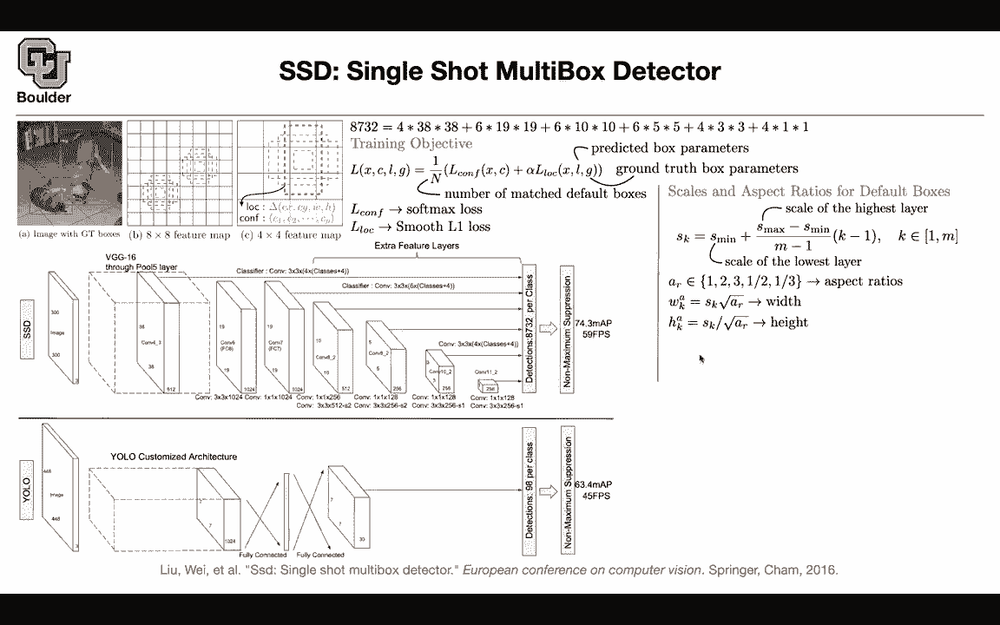

so that's how you interpret this and，then there is another，scale and that's gonna correspond to，one。

and this is just another state from one，layer to the other one because there is。

gonna be a transition，and you don't know which layer to，associate that box to。

you come up with the same aspect ratio，state，three，four five and six parties pair each，which are not。

these are your default boxes but then，how do you get these four。

most of them are six this is six pack，six bucks six packs，you have a bunch of fours here they。

correspond to when you don't when you，remove，three and one third once you have your，boxes then。

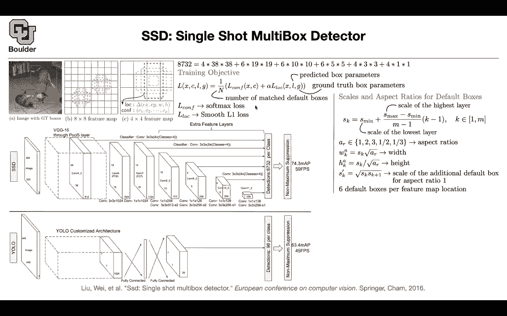

you train them once the training is done，you do your prediction，and then you do your non-maximum。

operation and how does it compare to the，landscape，so faster our cnn is proposing 300 boxes。

and these are different backbones which，16，versus zf zf is the paper that was，visualizing。

using the convolutions we have different，mean average over，mean average precision and these are the。

number of frames per second，that the faster our cnn can process，seven and 17。

yellow is much faster it's 45 frames per，second and 155 frames per second。

but it has a lower mean average over，precision，and these are different versions of ssd。

these are probably deeper and wider，and in the end this is the case that we，considered 8732 boxes。

this is as fast as yellow and it's more，accurate than，faster rcm now you can play around with。

the number of boxes，actually the depth and the height of，your network so one way to make these。

networks faster is to use your gpus it，means that if you increase your test，back sides rather than。

pushing one image at a time push eight，images，at the same time these are gonna be。

processed in parallel，that's going to give you higher frames，per second and you see the mean average。

over precision，mean average precision is the same it's，time，wait so professor you said um the the。

one third and three aspect ratios just，get taken out，for certain layers yes is that just，because。

it's less useful with those layers or，why is that i think it's，if you have 38 by 88 and then you。

multiply it by six and，probably it's a lot of boxes it's gonna，make your network slower。

and we see that effect here if you have，more boxes your network is slower。

yeah that's one reason any other，questions，so these default like we always have the。

same default boxes，and then we're just selecting default，boxes that we think，we're not。

regressing for these these bounding，boxes we're just like，picking a box from our default set if it。

matches，so it's similar to the idea of anchor，boxes，that we saw in faster rcn okay your。

network is gonna predict，the coordinates that that is gonna，adjust。

these boxes okay so it'll adjust it but，it'll kind of base it off that。

that baseline yes and this is another，thing that's different，from yolo yeah it's actually predicting。

there are two boxes，and it's just predicting two of them，okay but here you have。

anchor boxes and that's another reason，that this network is more accurate。

because it's borrowing your ideas from，faster or cnn also，okay and your study is also right about。

why we don't do aspect ratios three and，one over third，one answer was the computational cost。

and the other one is that at these small，scales，you probably don't need that many of。

them i guess i meant the larger scales，like when we're deep enough that the，filters are only。

uh two by two right by three，are，yeah，and any other questions before i move to，the next one so。

we saw that borrowing ideas from like，anchor boxes，from uh faster or cnn was being helpful。

