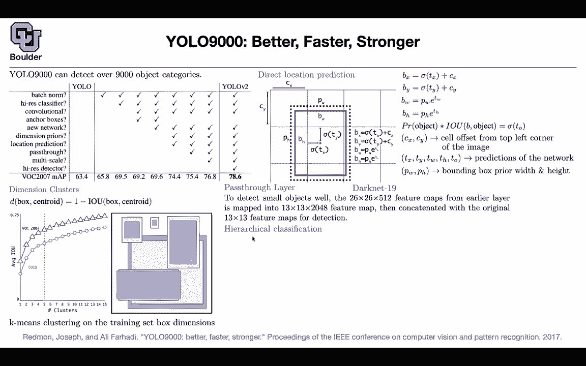

# 【双语字幕+资料下载】科罗拉多 APPLY-DL ｜ 应用深度学习-全知识点覆盖(2021最新·完整版） - P85：L39.2- YOLO9000 - ShowMeAI - BV1Dg411F71G

and can you alone 9000 and it was a，bunch of。

little improvements to yellow so the，next three papers i'm gonna go through。

them really fast because these are small，ideas，these are not big ideas but these are。

ideas that already exist and you already，learned about them，one impressive thing about yolo 9000。

is that it has a very large vocabulary，it's 9 000 object categories so it can，be take over。

9000 object categories what you saw。

previously what there，was 30 objects or it could be 80 objects。

this is 9000 objects，the question is how do they do it the，other one is。

faster stronger etc but let's see why，some of the improvements are very simple。

improvements，you do batch norm and then you increase，your mean average over precision。

mean average precision sorry the other，observation is that，done，on images that are 224 by 224。

that's useful for your classification，but then when you were doing testing。

you would apply the same convolutional，network。

on higher resolution images the idea is，that it's better to，train your classifier on the high。

resolution images to begin with。

so if you do that you're gonna get 69。5，then we saw a bunch of other ideas the。

major one is anchor boxes we saw that，anchor boxes was helping faster our cnn。

and it was helping，and it was helping ssd so the idea was。

that let's use that，and let's see what we come up with and，then they had a drop。

in their mean over mean average，precision，then they change their network and they。

get 69。6，and then they go ahead and say let's，choose our。

anchor boxes in a smarter way maybe，using k，means and have some priors on those，bounding boxes。

and then do location prediction i'm。

gonna tell you what is dimension priors，what is location prediction。

precisely then you get a huge boost and，then there is no need for anchor boxes。

because these dimension priors。

are going to be your anchor boxes then，we are going to learn about pass-through。

that improve it a little bit then you，look at multiple scales，like what ssd was doing and then you。

have your high resolution detector，in the end you get 78。6 so the point was。

that yes ssd is good but we can be，better，with some modifications with some。

adjustment to the network，and to the framework so these are not，big adjustments these are。

small adjustments but once you do them。

one after another it's gonna yield a，huge benefit，so what is dimension cluster you look at。

your training data，the boxes in your training data you look，at the coordinates。

you do clustering on them and then these，are going to be your。

default boxes so you do a clustering on，the coordinates of the boxes in your。

training data the blue one corresponds，to the boxes in。

cocoa microsoft cocoa and the white ones，correspond to pascal vlc and they are，pretty similar。

but slightly different in terms of size，scale aspect ratio。

but then these are going to be your，dimension dryers and then what you do is。

just you do k-means clustering。

these are gonna give you a better prior，compared to anchor boxes。

so that's why you remove anchor boxes，and for clustering the distance that you，use。

is not the euclidean distance but it's，coming from，intersection over unit so for doing k。

means you need a distance，to do clustering and that distance is，this distance。

because we know intersection of the，union is important okay that's one，change。

you do location prediction you have a，box，and then what you do is you look for。

the。

of your cell cx and cy and then you want，to know what is the center，of your box and then rather than。

learning that distance，you learn t x and t y and you push them。

through a sigmoid，what else these are gonna give you your，centers and then for。

bit and the height you just do it，relative to your。

your，bounding boxes and then for object ness。

or confidence that there is an object in，this box，you do the same thing rather than。

predicting this you predict t，o so rather than predicting this term。

b h b y etc you are predicting t。

o t h t w t，y and t x the rest of them you know c。

x and c y is the offset from the，coordinate，of the actual image this is what the，network predicts。

and pw and ph are。

coming from these priors which could act，as your anchor box，okay so you are just making tiny。

adjustments to the anchor box，the other change was dark net i'm gonna。

tell you what is darkness in the last。

paper，the other changes pass through layer，what happens in the pass through layer。

you want to look at smaller scales and，smaller objects as well。

so you take a feature map from a lawyer。

by，512 you can rearrange your tail。

your terms to make it 13 by 13 by。

2048 basically you are dividing this by，two dividing that by two and。

pushing those terms to your feature maps，that's gonna give you 13 by 13。

and this number is just four times 512，and then you just concatenate it。

with the next layer so that's a pass，through layer。

and the cool thing about 9000 and the，cool method is this hierarchical，classification。

this is a fine-grained type of a dog you，can say。

i have norfolk carrier what is the，probability of being it being a norfolk，carrier。

condition that i know that it's interior，then you multiply that by。

dog，and then we know that huntington it's。

gonna end up being a mammal，object。

so you break down your probabilities，that way，and that's gonna enable you to do fine。

fine-grained，predictions and what you do is these are，all soft max so you have different。

softmax，per each node of your tree so you can，create a tree。

starting from a physical object and then，going down to。

then，in the end you have your leaf in your。

tree and then maybe in，one of your data sets one of the objects，your algorithm is not sure。

what type of a drug it is but at least，it can tell you that that's a dog。

and in some cases it's gonna know it's a，norfolk carrier dog and then it's gonna。

classify this as a norfolk。

terrier dot okay but then you don't have，enough data in cocoa，combine。

the two data sets cocoa and imagenet so，the blue ones that you see are in coco，these are big classes。

chat dot car airplane house plant，in imagenet you have fine fine details。

fine grain details for instance a，persian cat or a tabby cat，or a biplane jet airbus stealth fighter。

etc，so you combine the two and then you do，joint classification and detection。

on imagenet data and on cocoa data，and for that you it's a paragraph in the，paper。

you can read that in the end that's，going to enable you to do 9000，predictions okay tiny details。

but in the end it's going to give you a，huge performance gain，and a lot of objects that you can。

predict yeah take a look at the images，in the paper but now you can see that，that's a。

type of a dolphin and this is the skin，dive and these are not，part of the labels that you're gonna。

find in cocoa，this special type of a dolphin that's a，skin dye。

probably the category that you have in，coco is that that's a person。

okay so this is really impressive being，able to do 9 000，categories locating them and classifying。

them i'm going to stop here，and if there are any questions we can，discuss it the next two papers are。

really quick。