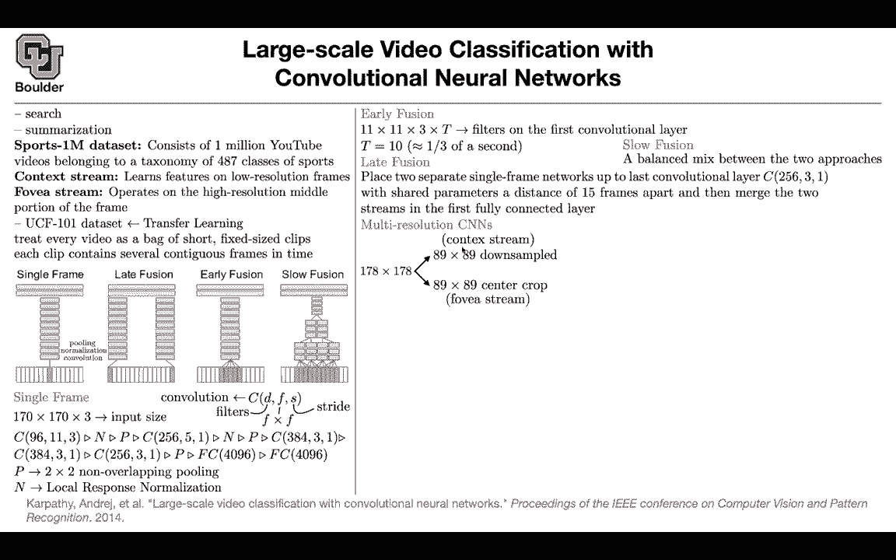

# 【双语字幕+资料下载】科罗拉多 APPLY-DL ｜ 应用深度学习-全知识点覆盖(2021最新·完整版） - P88：L40.3- 视频分类 - ShowMeAI - BV1Dg411F71G

let's first go to videos and let's say，your task is，a classification somebody gives you a，video。

and you want to classify it why is it，important it is important because。

one application is going to be searched，the video goes on in，class。

comes out like what action is happening，in this video now that you have a text。

it's going to be very easy to do a，search，let's say now you want to look for all。

of the videos that correspond to，soccer or basketball then you can do an，easy search。

on your videos the other one is，summarization like，what is happening in this video what is。

the what is the video about，then you can get a summary of the video，and what is different。

from a video compared to an image you，can treat a video，as a bag of short clips and then each，clip。

is gonna have a bunch of consecutive，frames so it's gonna be a bunch of。

consecutive images so that's the type of，data that you're gonna work with。

this paper is gonna introduce a new data，set that supports，one million data and these videos you're。

gonna fetch them，actually they fetch them from youtube，it's one million youtube。

youtube videos and we know that each，youtube video is gonna have its own。

caption you do some claim cleaning of，the data，to come up with 487 classes。

of the types of sports that these videos，are going to correspond to okay。

creating a data set is tough and that's，one data set，sports 1 million then the network。

that you're we're gonna work with is，gonna have two streams，one is a context stream so don't worry。

i'm gonna go through what is a context，stream and what is a phobia stream。

but the idea is that the context stream，is gonna look at low resolution frames。

and the four-year stream is gonna look，at high resolution，middle portion of the frame i'm gonna go。

through the details，so don't worry about it it's just to，give you the big picture。

and then we do some transfer learning so，you you train your network and。

support 1 million data set and then you，do your transfer，learning and then you apply this is a。

classical，action recognition data set for videos，ucf，101 and 101 stands for you have 101，classes。

but it has a smaller size compared to，a one million data set for this sports，okay so。

some transfer learning is gonna happen，here as well and what is a video。

you're gonna treat every video i don't，know it's gonna be a five。

minute video on youtube and then you're，gonna treat that，as a bag of shorter and fixed size。

clips if you have a classifier that's，able to classify your clips。

then classifying the video is gonna be，easy，why because you have a bag of，predictions。

and then those predictions are gonna，vote for instance you can do an average。

of the probabilities and then you can，get the prediction for the entire video。

and each clip is gonna contain，several contiguous frames in time。

so it's gonna be a spatial temporal time，series the space is，the space are the images or the frames。

and these are gonna be in time you have，a bunch of frames in time so one idea。

for doing a classification on a video，is to look at only one frame only a，single frame。

in your clip and then apply your，usual convolutional network and then do，your prediction。

so forget about the rest of the forget，about the time just look at one image。

one frame and then do your cnn on that，and the red box here corresponds to a，convolution。

this is going to be a normalization，layer and then you have a pooling layer。

so the blue one is pulling，the green one is normalization and then。

you have convolution so that's going to，be a baseline，you can have three other methods。

and i'm gonna go through the details of，each one one after another so it's not，that hard。

but let's see what's happened for a，single frame you take a single frame，it's gonna be。

170 by 170 by three color channels，you push that through your convolutional，network。

i'm going to tell you what it is what，this is so c，is a convolution the first number that，you see。

is going to be the number of filters，that you have 11，is going to be your filter size it's。

going to be 11 by 11，and three is a strike so you take your，image push it through a convolution。

and this operation here think of it as a，pipe operation so first you do，convolution。

then you do your normalization then you，do your pulling，this is exactly what happened up until。

this point then you have another，convolution，with this many filters this filter size，that is right。

so that's going to be your entire，network in the end you have a fully，connected layer。

that's this yellow box and now they're，fully connected and then you do your。

prediction the next one is going to be，487，classes or 101 classes so up until this。

point is the part that you're going to，transfer，the last layer is the head of your。

network depending on your data set okay，that's a single frame。

far so good and the p operation that you，see is，two by two non-overlapping cooling by，is two。

and we covered local response，normalization，it was the first one of the first ideas，that we covered。

actually you don't even need that this，could be a bash normalization。

layer but we know what is a local，response，normalization the idea was used in。

alex net paper and that's our single，frame for early fusion，this network your first layer is gonna。

be a convolution，and each kernel is gonna have this size，it's gonna be 11 by 11 by three。

because you have three input channels，and then you just add，the time dimension okay these are each。

one of your filters and then you're，going to have i don't know，96 filters and we know that a filter。

does a very simple operation，you take your filter you multiply it by，the corresponding。

frames and pixels in your image，and then you just add them up that's，just what the convolution is。

it's very simple you take your it's a，dot product of your filter and。

the corresponding small window in your，image，and that's the window that we're going。

to use in the time，there is no sliding happening in time，space。

okay there is a 11 by 11 sliding that's，happening，on your image but you always have these，t。

consecutive frames that are going，through your network，going into your network is this just。

like a three-dimensional convolution，essentially，where that extra dimension is are，multiple frames。

it's slightly different from 3d，convolutions，why because this last dimension is space，so。

you are not sliding this over your time，okay，take one slice from this time to the，next time，fixed。

so you don't slide it from left to right，yeah okay，so yes it's very similar to 3d，convolutions but。

in time you're not sliding it's always，your input，that's early fusion and the rest of it。

once you use you're gonna end up with，96 dimensions that you can put through，the next layers。

so the rest of it is the same only your，the first layer，changes that's why it's early late，fusion。

you're gonna put one network in the，beginning，one network at the end it's the same。

network and then in the end you're just，gonna concatenate them and push them。

through your fully connected network and，up until this，point is the same network as the single。

frame network，and this is where you're gonna cut and，then concatenate so this is the layer。

that you're gonna cut，c256 three one c256，three one and this low fusion is just a。

com combination of these two，you can have one two three，four frames then you're gonna have a。

completion filter similar to what you，have for early fusion，and then you can have multiple of them。

and then you combine and in the end you，do your，fully connected okay so first of all now。

it's time for these two concepts，context stream and phobia stream for the，context stream。

you're gonna take your entire image，and down sample it to 89 by 89。

resolution so the context stream is，looking at the entire image，and the center crop is just a high。

resolution，crop from the center of your image so，this one is going to preserve the，resolution。

it's going to look at the fine details，in space。

this one is going to look at the entire，picture this one is going to see the。

context this one is going to see the，details and then you're going to have，two streams。

one is looking at your context sorry，this is looking at the context。

this is the entire image and the other，one is looking at the center crop so。

what happens in terms of accuracy，the single frame with multi-resolution，this is multi-resolution。

is actually doing very good change for，the 2。4，accurate when you consider only one，image。

and if you are happy with five images，and then your prediction being。

included in those five images it's gonna，be 78，this is for a clip this is for the，clips。

so you do that for multiple clips and，then you just vote，so taking into account the video is。

helping then apparently，among early fusion late fusion and a，slow fusion。

slow fusion is doing the best and it's，not decisive which one of these two，we're gonna。

choose if you are interested in clip，then，the single frame multi-resolution is。

doing the best but then if you're，interested in the entire video。

this one is being the best and why is，time why time matters，let's look at this video the true。

underlying class is，juggling club the single frame，predictions are acrobatic。

being just one three slides i don't even，know what that means and then unicycle。

but then when you include the video and，make it motion upper，basically include time then it's gonna。

perfect，any questions so in the next session，we're gonna continue with videos。

for a while and then uh i think monday，next week or，friday this week we are gonna start with，3d data。

because the world around us is 3d it's，not always about，cameras images videos you can have。

different types of instruments，collecting data around us，like lidar data and that's going to give。

you point cloud data，and then we should be able to work with，that as well i think we are finishing。

right on time，if there are any questions you are more，than welcome to stay and ask。

i'll be around and the ones who want to，leave you can be i was just curious if。

we were going to talk about，in this sort of next bit with video or，with 3d data。

if we're going to talk about like，recurrent networks using recurrent，networks。

for uh classification and such yes at，least in one of the papers，we're gonna talk about regard but。

recurrent networks，they have applications mostly natural，language processing。

and they are actually getting outdated，that i，saw he's in speech speechly。

really sorry go ahead that's going to be，next semester，so we are going to see a lot of lstms we。

call neural networks，next semester do you is there a reason，you don't see him as much i mean because。

i would imagine，that i mean taking advantage of the like，to temporal dependence。

in video with recurrent networks would，be really helpful and that's sort of，is that sorry。

one problem with required neural，networks is，that they are not gpu friendly it's not。

easy to parallelize them it's a，sequential process，that's why these days people are people。

are moving towards attention networks，and transformers because those types of，networks you can。

do operations in power they're，gpu-friendly，but mathematically there is nothing。

wrong with that they are powerful they，have a，hidden dimension that's accumulating。

observations in time so that's really，powerful，and i don't see any reason for not using。

that besides trainability，essentially besides being fast yeah okay，thanks yeah uh are we gonna cover。

any um any networks that use complex，value data uh no but，that's also really important because if。

you think about who yeah，you're gonna easily end up with complex，values。

yeah yeah exactly so very important，is there is there a good paper to go to，for a reference on that。

i don't know on top of my head i，remember a couple of years ago i saw。

on networks doing that okay certainly，not urgent，i'm just interested no that's really。

