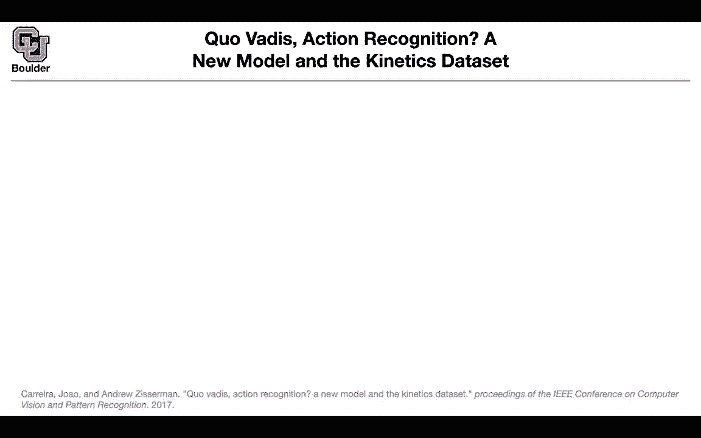
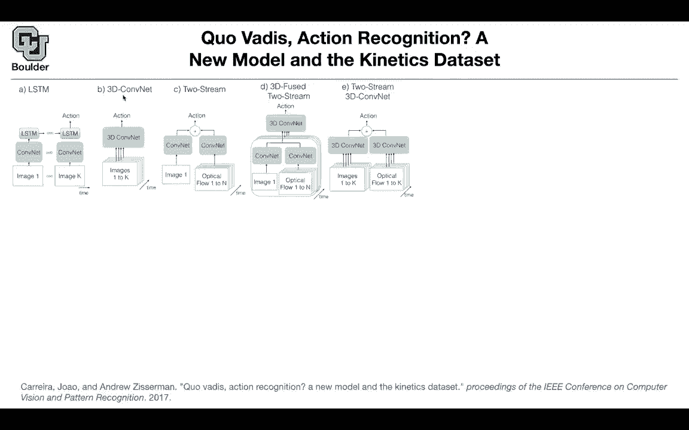
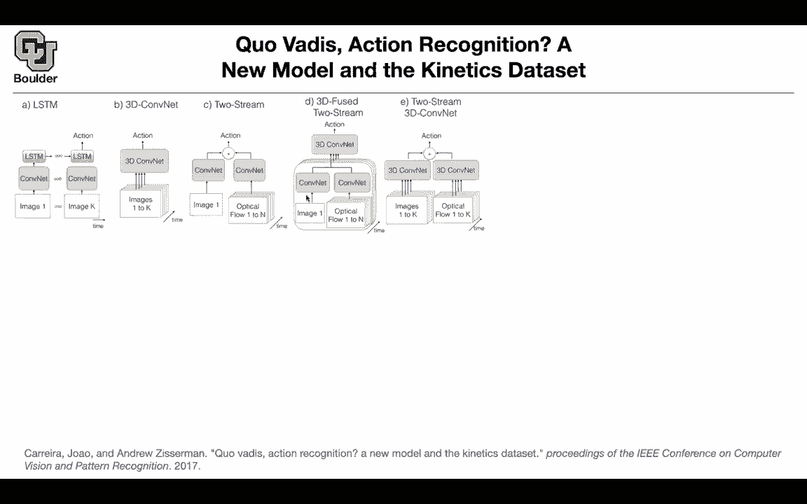
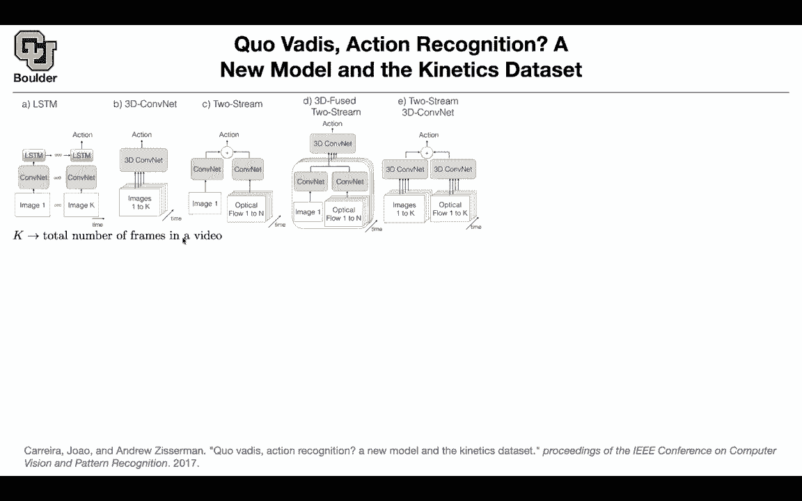
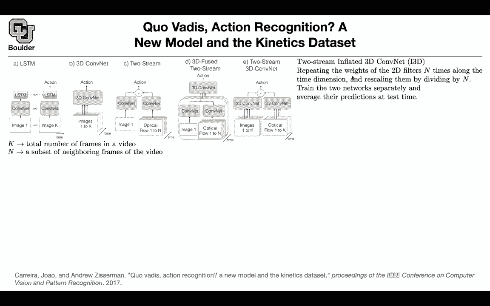
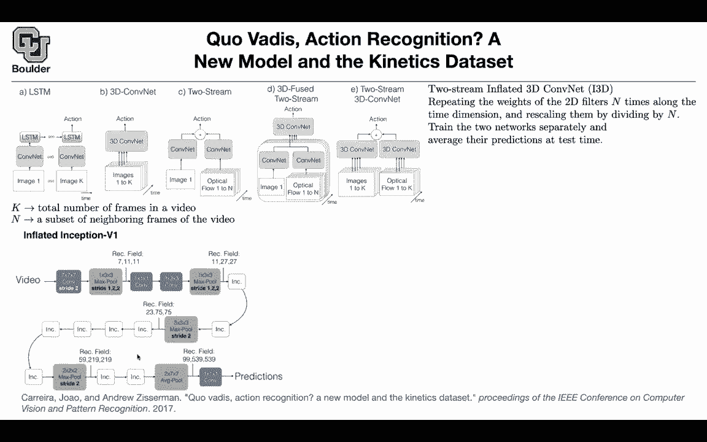

# 【双语字幕+资料下载】科罗拉多 APPLY-DL ｜ 应用深度学习-全知识点覆盖(2021最新·完整版） - P91：L41.3- Inflated 3d ConvNet (I3D) - ShowMeAI - BV1Dg411F71G

okay in that case let's move to the next，one it's covadis，action recognition cova this is latin。

for where are you going where are you，going action recognition。

from that title you think that that's a，review paper。

and i don't usually go through review，papers because。

that's going to give us a superficial，knowledge but this is different。

because it's introducing a new method。

after going through，an overview of other papers it。

introduces a new method，okay i know that last session somebody。

that，yes there are some papers that are using，it and the problem with。

rnns and lstns is that they are，you。

through your convolution you get your，lstm up until this point。

everything is uh parallel but then to go，to the next step，you need to know the outcome of your。

lstms so that's where，things are going to become sequential，and this is not parallelizable。

in time and we know that for videos we，need them to be fast because these are。

much bigger data sets compared to a，single image，each one of your data is going to be。

multiple images okay，so that's your lstm the 3d content is。

what we just covered，you just put a 3d convolution over your。

stack of images to do your action，recognition。

you can do two stream this one recovered，right at the beginning of this session。

so there's an image there's a。

convolutional network and there is the，optical flows，going through a parallel convolution and。

in the end they are gonna vote。

you can do the same thing you can，combine this idea。

and the two stream idea and apply it for，different frames in time once you do。

that in the end you're gonna get a bunch，of features，and on top of that you can do 3d。

convolution so the 3d convolution idea，is coming from here，and the two stream idea is coming from。

the previous paper，and this is the new method that this，paper is advocating。

you have multiple images you have the，corresponding optical flows。

you push them through 3d convolution，rather than 2d convolution。

you push the optical flows do a parallel，3d convolution，and then you combine and i report your。

classic，classification score so what is k k。

is the total number of frames and n。

frames，that you're using for your optical flow，because we know that。

these don't have to be the same this，could be one image and then you can have。

n this is this corresponds to l from the，previous paper，this is the number of frames that you。

use for your optical flow so what is，this method called。

it's going to be called i3d inflated，3d and what do we mean by inflated。

you can treat a video or an，image a single image as a video how。

you just replicate the same image over，and over again。

so that's gonna be a very boring video，you're just looking at one image。

evolving over time but that's going to，be your video，and you can have a 2d convolution on。

that this is equivalent。

to having 2d filters 10 times。

along the time dimension and then you're，just rescaling the weights。

by n you're just dividing by n because，you have n frames，and they're the same frame that's a。

boring frame，and uh that's a boring video you start，with a。

convolutional neural network perhaps，trained on，imagenet these are going to give you。

your 2d filters，now you need to copy it you need to，inflate it。

to three dimension how do you do it you，just copy it，and then divide each one by n that's。

be your，sets。

is big，it's coming from youtube videos and you。

have many of them，but then ucf 101 is a small data set。

you need to be able to do transfer，learning from whatever that we learned，from 2d convolutions。

to 3d that's why you start with a 2d，convolution。

that's going to give you a bunch of 2d，filters and then you inflate it in time。

you just copy it n times and divide each，weight by n，and then one other modification to what。

we saw earlier，is that you have two networks and you，train them separately。

rather than at the same time you train，this one。

separately this branch you train the，second branch over，time separately and then in the end you。

vote，for the prediction at this time so is，everything clear。

so far so is it clear how you clear。

create inflated 3d convolutional，networks，this is good because now it's very easy，to initialize them。

you initialize them using a 2d，convolution you initialize your weights，smartly。

basically you are doing your transfer，learning from two dimensions to three，dimensions。

okay in terms of architecture you're，gonna use an，inception architecture a video goes in。

and then the only，catch is when you're doing your your uh。

3d convolutions they don't necessarily，have to be symmetric。

this could be a three by three，convolution in space，but then you can have a one by one。

convolution in。

time why is that because you usually，have many more pixels than。

time steps so you need to paste this，field of view。

smartly so after this operation your，field of view is going to be 7 in time，and 11 by 11。

space then you paste them smartly there，is gonna be one by one。

three three three and then your max。

one pixel in time and three by three，windows in space。

then your receptive field is gonna be 11，in time and 27 by 27。

in space so you paste them out so that，in the end。

you don't blow out in terms of your time，dimension，and basically looking at a bunch of zero，padded。

uh frames in your time so you just have，to pace it out in time。

so are these parameters pretty sensitive，to the length and frame rate of the，video。

um for a given length if you have a high，frame rate，don't mean maybe you're not zero padding。

so much at the end there，yes that's correct okay but uh we saw。

even in the first paper that the video，you're gonna break it down into clips。

and age clip is probably having 199。

frames in it okay and then in the end，your entire video you're just gonna use，these clips to vote。

it's a bag of clips why is that because，this is gonna become。

extremely computationally ex expensive。

putting，a video on a gpu is gonna consume a lot。

of memory，and your batch size is gonna be very，small it's gonna be probably one video。

or two videos that you can fit on your，gpu so there are some。

constraints that we have to deal with，makes sense，and then we are going to use an。

inception module these modules that you，see here，inc are your inception module there is。

nothing special about them，it's what we covered for 2d now you have，a third dimension。

there is a data set introduced by these，guys。

in another paper it's much bigger than，the benchmarks in your video data set。

and it's going to be action classes a，list of action classes。

and they cover person actions it's a，singular。

like drawing drinking laughing punching，so these are your labels it could be。

person person actions，like hugging kissing shaking hands etc。

or it could be a human object，interaction like。

opening a present mowing lawn washing，the dishes etc，so these are your labels there are going。

to be 400 human action classes，in total and you're going to have 400 or，more clips。

per class if you multiply these two，you have。

in your data set in terms of state of，the art，we saw some of these papers already see，3d we saw it。

and we saw that to a stream fusion，we saw two stream and whenever you see i。

3d that's this method and the best，results are，coming out of pre-training on the entire。

kinetics data set there's also a mini，kinetic，data set the best ones are coming out of，pre-training。

and then training on the target data set，ucf 101 or，time，for those of you who have questions you。

can stay and ask and the ones who want。