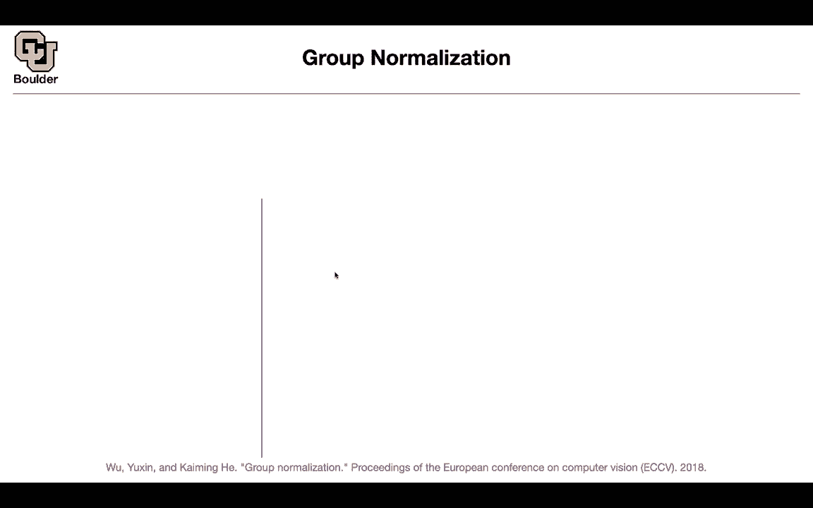
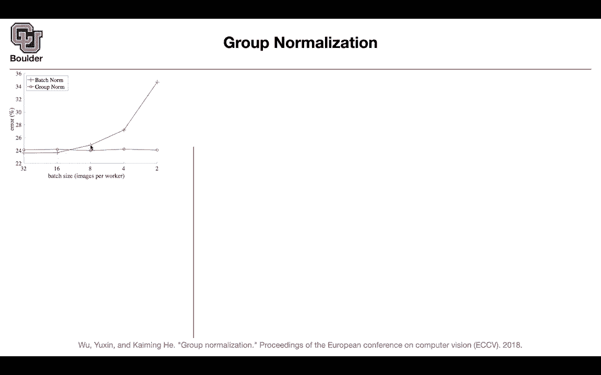
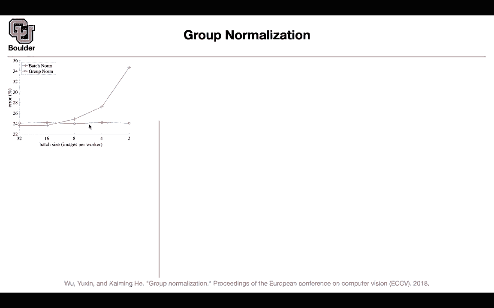
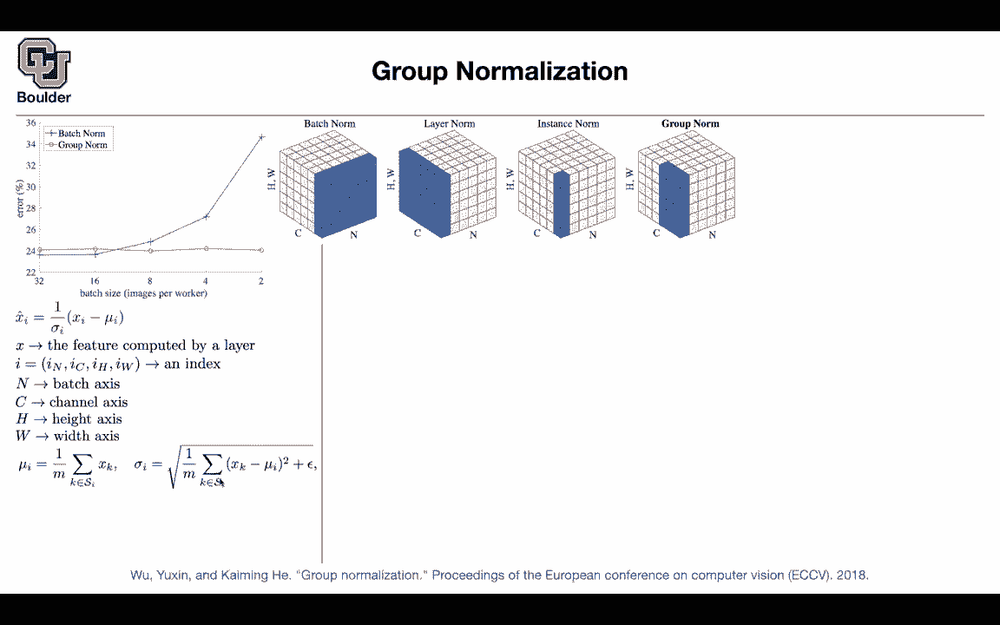
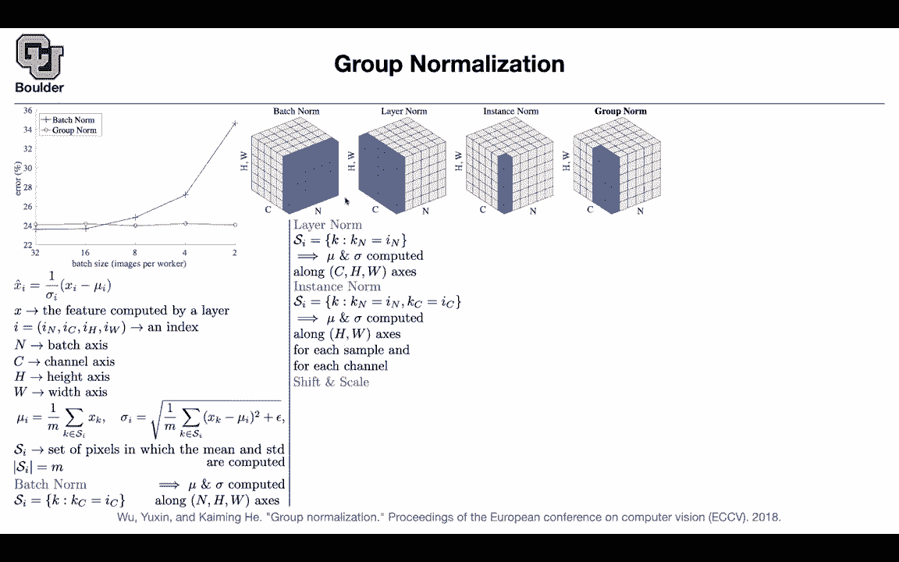

# 【双语字幕+资料下载】科罗拉多 APPLY-DL ｜ 应用深度学习-全知识点覆盖(2021最新·完整版） - P93：L42.2- 组归一化 - ShowMeAI - BV1Dg411F71G

[Music]，we learned about batch normalization，very early in the semester there are。

other types of normalizations，putting，group normalization here as the last。

slide for a video，that。

yes it is really powerful and it's going，to give you a state of the art results。

for as long as your batch size is，reasonable，at least 32 images you're processing 32。

images at a time，but then when you go to problems。

such as object detection segmentation。

or when you go to videos usually your，batch size is around，two you cannot process more than two。

videos it's not gonna，fit on your gpu your batch size is small。

either because it doesn't fit on your，make，if you remember when we were doing，object detection。

we are processing two images at a time。

but in each image，you have multiple bounding box uh。

proposal purpose regions it was our，choice，but sometimes it is not our choice we。

are limited by the constraints，of the memory in our gpu etc so。

small，for instance when we were doing object，detection we were doing transfer。

learning，we trained our network on imagenet，we had the batch norm on so it was，training。

those gammas and sigmas they shoot，unscathed in your batch node。

we're training them but then when you。

were doing transfer learning to your，object detection，you were fixing those parameters you。

were freezing them，when you were doing transfer learning so，those two parameters are not going to be。

learned anymore，why because your batch sizes are small，because your data set is。

smaller et cetera so you are freezing，those parameters and there is no reason，that those shift。

and scale that you learned on imagenet。

is going to be the correct ones for，pascal voc。

or microsoft cocoa okay it would be，good to have a normalization method，that's batch independent。

those statistics that you obtain are，independent of your batches。

group normalization is one such method，what is the effect。

if you have 32 batches 32 images，per each worker it could be per each。

gpu so each worker here is a gpu if you。

have 32 for your batch size，you're getting very good error rates。

and this is for imagenet and this is，just an experiment to show。

size，and let's track the blue curve if you，use 16。

for your bag size you're still not bad。

but as you go to lower path sizes or，smaller bite sizes。

your error rate is gonna go up，significantly okay if you process two。

images period gpu then in the end，your error rate is around 35 percent，compared to 24 percent。

but then group normalization is not that，sensitive to，the batch size and but if your batch is。

big enough batch normalization is still，better than group normalization。

but what is this group normalization and，how does it compare to the rest of the，normalizations。

that exist in the literature this is a，very good plot，each image is gonna have a height and a。

bit dimension，that's our z axis in this plot it's，going to have a。

c dimension the channel and it's going，to have a bash dimension。

what batch normalization does it's going，to，compute the averages the status，statistics mean。

and standard deviation by。

looping over the bash dimension and the，height and the。

dimension so the resolution so i noticed，to be。

one and you are not running into trouble，in your codes，it's because there is still a height and。

a width dimension。

that you are computing your statistics，from otherwise。

the variance of if you didn't have this，height and width，the variance of a single batch is going。

to be zero，and you're dividing by zero in your，batch normalization and you would。

run into a lot of trouble so yes you can，have batch size of。

one for images if you have a third，dimension the height and width and the。

beat so that's batch normalization，there is layer normalization this one is，not going to。

be sensitive to your batch size because。

you are computing your statistics，across the channel dimension and the。

height and the width dimension，you compute the statistics and then you，divide you。

subtract the mean from each pixel in，this image，and then divide by the standard。

deviation that's going to be layer，normalization but，layer normalization is not going to give。

you good performance for images it is，usually，used for recurrent run letters there is。

instance normalization，this is when your statistics are coming。

from batch size being one，so from one instance this is exactly，what what they just described here。

because you have a third dimension the，height and the width the dimension of，the pixels。

you can compute your mean and a standard，deviation without this height and width，you're into drop。

and what is group normalization it's，something between。

and actually before i go there the，applications of instant normalization。

is for generative others or neural，networks，we are probably going to cover them in，the next semester。

so that's a technique for gas and then，there is group normalization。

it is something between layer nor，and instance norm you create a bunch of。

groups，per your channel dimension for instance，in this case you have two groups。

and each one has three members per the，channel dimension。

and then you compute your statistics，here that's grouped by，group normalization and it seems to be。

effective but。

let's go through batch normalization and。

master，perspective i'm gonna go through it，really fast because these we covered。

you want to normalize your x i your，input。

so you're gonna subtract the mean and，you're gonna divide by the standard。

deviation and this is gonna happen。

regardless of the method this is your，normalization scheme。

x is your feature what is i，i is a multi-dimensional index。

and it's going to index the n dimension，the batch dimension，it's going to index the channel。

the b，and n is your batch axis is the channel，axis。

h is the height axis and w is the v，taxes。

so you have multiple axis here you，compute the mean and a standard，deviation。

for all of these methods you compute the。

mean over，a subset of these points per each。

pixel and you compute the standard，deviation the only difference。

between these methods is s i okay，use。

to compute your mean and a standard，deviation and what is m。

m is the size of its i m is the size of，this set，so what is s i for batch normalization。

your k，it's the set of all of the k's and your，k is going to be a。

similar vector to i to your index it's，going to have k。

n k c k h k w，and then you are fixing the k。

c dimension k c should be equal to i c，and the rest of them are free。

so given ic you can compute this uh。

s i set and that's going to give your，batch node，what does this mean you're computing。

your statistics。

mean and sigma over all of the other，dimensions。

other than c you're computing a launch n。

h and w so that's exactly，what is being denoted here in this case，ic was one。

but your ic could be this is slice，and then you are doing your statistics。

you are computing your statistics on，this，index so that's patch norm layer norm。

the set is different，s i is going to be different now you are，fixing your i。

n dimension it's better to think of it，this way that now you are computing your，statistics。

over the channel dimension of the height，and the width damage，so these two dimensions these three。

dimensions for instance norm you're，fixing，two indices and then you're computing。

your statistics on the rest so you're，completing your statistics over。

your pixels only and then for all of，these methods，including group normalization you're。

going to do a shift and scale，these are going to be some additional。

parameters gamma and beta，and these are per channel so these are，vector。

that have the dimension of your channel，of the channel dimension。

and we know why we add them because，after you subtract the mean and divide，by the standard deviation。

then everything is going to be mean zero，and they're gonna have a standard，deviation of one。

so you want to add some parameters to be，learned for group norm your si is going，to change。

you fix the batch dimension so you are，not doing any。

statistics along your batch dimension，but then you are turning your。

kc and ic and you are doing it per group，g is going to be the number of groups。

that you have for instance it could be，32 groups。

in our case it was two group c over g is，going to give you the number of channels。

per group in this case you have three，channels，per group and you have two groups and。

this is just telling you that。

i'm doing my summation over all of。

casey's that satisfy this property i，have within my groups，and it's better to think about it this。

way that you're doing your summation，over the，height and the width dimension as well，as a group。

of c over g channel a group of three，channels。

in the example level how do you code it，in terms of law。

you can have a similar code in pytorch，or mxnet，or chainer etc you need to give it the。

gamma and beta these are the ship，and scale epsilon is just small number。

because we don't want to divide by zero，and。

you compute your mean and，command。

and then you're gonna tell it which，dimension you're computing those。

statistics from and you reshape it and。

then multiply gamma and alpha，so that's how you're going to implement。

that and it's just a matter of reshaping，your inputs basically you're dividing。

your channel dimension。

and then you're dividing it into a g。

and c divided by g so you're adding one，dimension to your tensor。

and then you do your averaging over this，dimension c over g，h and w and then you reshape it back so。

what is the effect，if you apply it on imagenet this is bash。

norm this is layer norm，this is instance norm this is group norm。

and each one of them is going to lose。

some accuracy for you it's going to give，you a higher error。

instance norm is the worst layer norm is，still not that great but group norm is。

not losing that much，it's losing only 0。5 percent。

but as you change your batch size from，32。

to 16 to 8 then you're gonna see the，advantage，from group norm for smaller batches you。

can apply to detection，and segmentation so that was a，classification task。

this is the detection and segmentation，now the cool thing is that for。

cocoa you can let this be time gamma be，learned，from cocoa dataset previously if you。

were using batch norm，you have to fix you have to freeze gamma。

and beta now you can let them be learned，and then you can apply that to video。

data and it's a video classification，task and kinetics data，and then you can process smaller number。

of clips，per gpu if you use batch node you're，going to have a significant。

drop in your performance but if you use，group norm for these small clip sizes。

these are basically your back sizes，these two curves are on top of each，other。

more or less and the variations that，you're seeing is because of。

noise in the training any questions so，we learned two powerful techniques today。

one was the non-local operations，non-local blocks，and the other one is that it's not。

always the case that batchmore，is the best method that's gonna depend，on your。

network and your batch sizes if your，device challenges are small。

and you're dealing with images and your，task is probably detection segmentation，or video。

perhaps going with norm is a better，choice compared to passion，and just uh i guess maybe clarify。

that's normal all or sorry uh larger，batches are always，advantageous just because it uh。

allows more parallelization so you can，speed up training，is that correct yes as long as you can。

put them on your gpu，yeah or gpu yes okay because you can，parallelize them and process them。

they can do data parallelism that's one，reason the other reason is。

probably the gradient estimates that，you're gonna get is gonna be more，accurate。

but at the same time it's a trade-off，it's always a trade-off if your batch，size is too big。

you are reducing a lot of the noise and，we know that these noises are。

usually useful for your neural network，to regularize，because it's not always the case that。

you want to push your，loss function to its global minima，you want to find good local minima。

that's going to help your network，generalize，on your test data and usually the noise。

the regularization that's，introduced because of the noise in your，batches and in your gradients。

they're helpful but sometimes they can，hurt if the batch serve is very small。

they can start to hurt and this can，happen because of your video。

your videos are going to be a bunch of，images，and we know that that's just more memory。

because these are bigger，they consume bigger chunks of your，memory per。

each data point maybe the entire dataset，is smaller，but each data point is heavy in terms of。

its memory，consumption so next section we are going，to do 3d data these are going to be。

point cloud data，have，any structure so far our data has a，structure there's a batch dimension a。

channel dimension height and width，dimension and we can put that。

on a grid the point cloud they're not，gonna have any，grid it's just gonna be a set up a bunch。

of points，in your space and i think with that i'm，gonna finish。

today's session i'm gonna be around if。