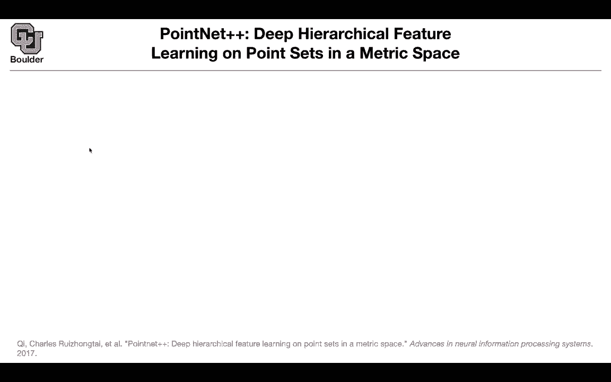
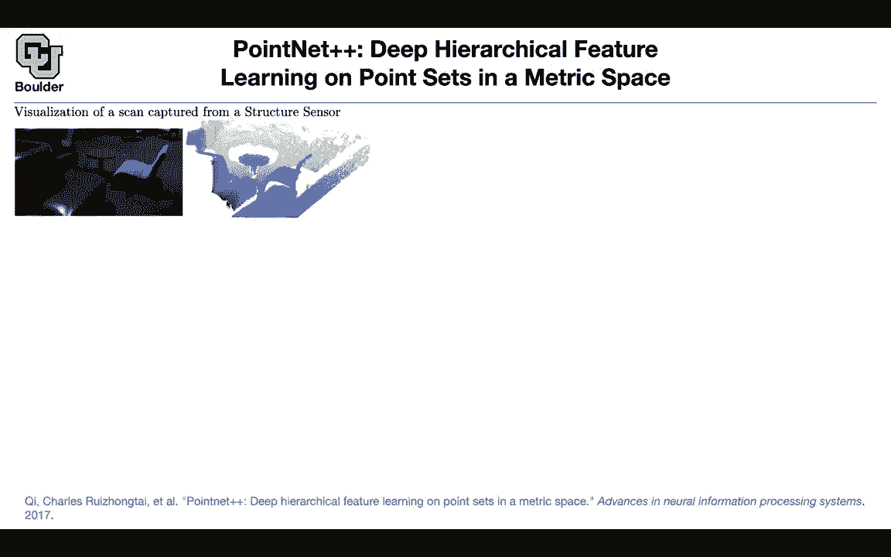
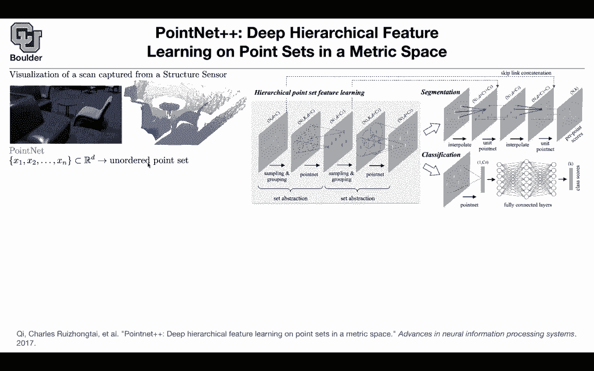
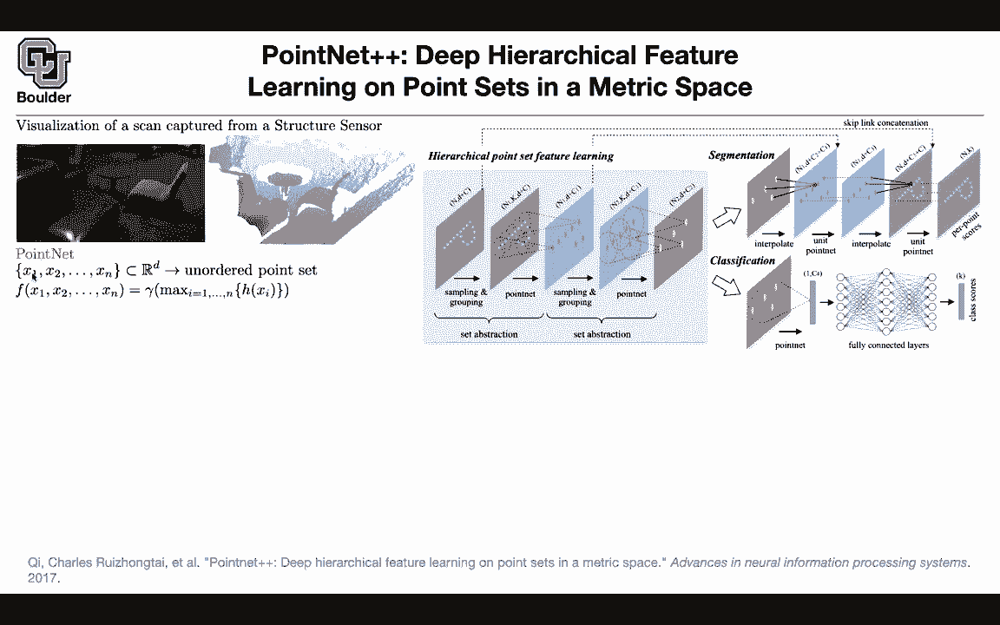
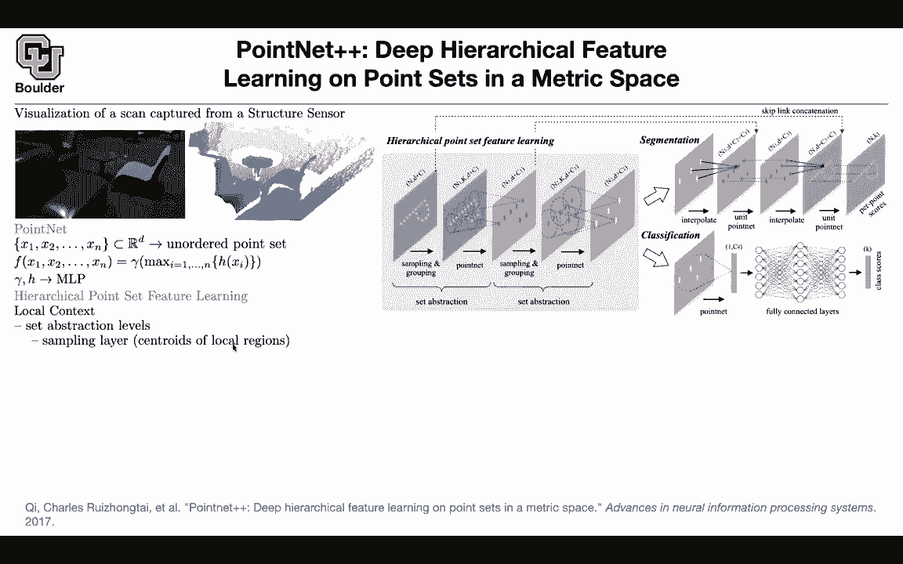
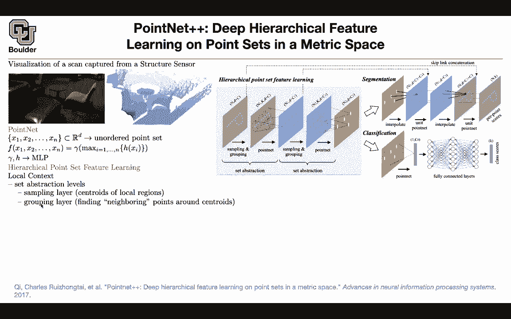
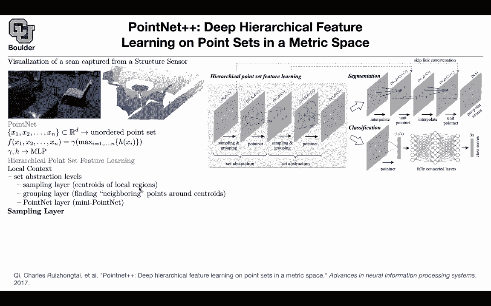
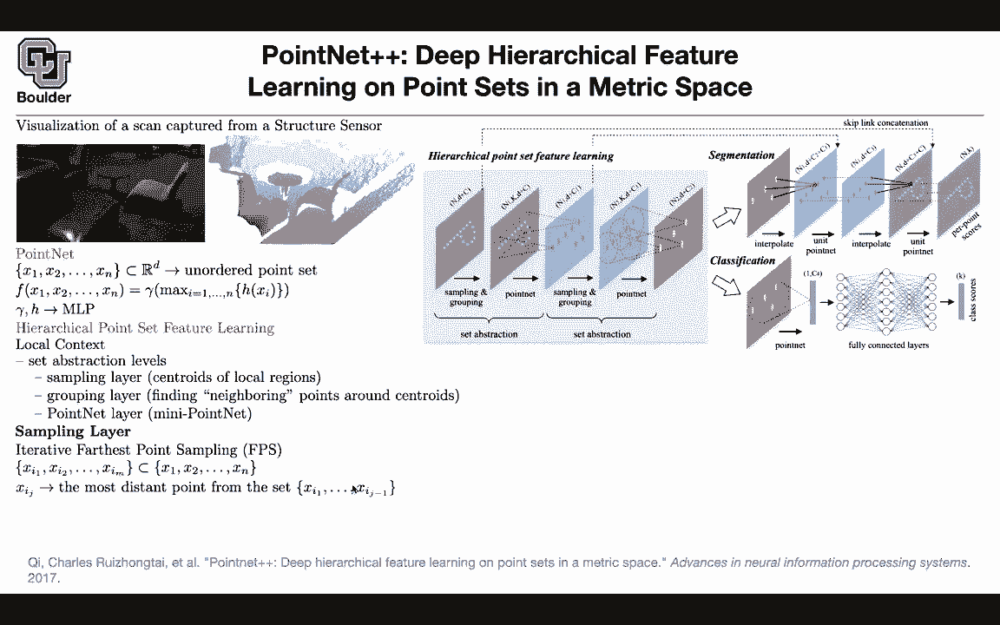

# P95：L43.2- PointNet++ - ShowMeAI - BV1Dg411F71G

so the next paper pointnet plus plus，is trying to address that problem to。

include some local features，and then because you want to include。

more local features things are going to，get more complicated，in terms of the method okay let's go。

over that so you can get your data from，structure sensors as well just google。

this and then you're gonna see some，cool technology behind it but for us，it's just a point cloud。

cloud，it's the same view but then from two，different，types of sensor one is a camera one is a。

structure sensor，and immediately you're gonna see some。

problems one is that locally，sometimes some points are absent the，resolution at。

some areas are really high but in some，other，areas it's very low or it's actually，absent。

like here so the method that you're，gonna devise。

account，so i'm gonna have this picture around，we're gonna refer to this a couple of。

times so let's go through the math，and let's start with the previous paper，pointnet for pointnet。

you had a bunch of points for instance，these are the points in your。

set，it's just a set of points and what point，that was doing。

was taking each one of these points，pushing them through the same function。

it was mlp multiple layers of that and，then in the end you had a maximum。

over your points and then you took that，max，and you pushed it through another，function another mlp。

and that gave you your features so what，are we going to do with the hierarchical。

points at feature learning we need to，take into account the local context。

that's the whole idea of pointnet plus，plus there is going to be a set。

abstraction level the set abstraction，level is going to have a sampling。

step which is about finding the。

centroids of your local regions，it's about finding these small dots。

you're going to have a grouping layer，which is going to find the neighboring，points around your。

centroids so it's going to give you，these negative points and then the next。

idea is that you take your pointnet，from the previous paper and then you，apply that locally。

to get your features n is the number of，points in your，point cloud these three if you have a。

three-dimensional，point or set of points and then c could，be any other features。

that you have that's why you have b plus，layer，first you need to find the centroids of。

your local regions，to find the centroids you're going to，use farthest point sampling。

what is that in the end you want to end，up with a subset of，your point clouds you want to end up。

with a subset，so how does farthest point sampling work，let's say you collected you found your。

subset and you found j minus one of them，so now the size of your subset is j，minus one。

now you want to add another point to，this so basically you're gonna start，with one point。

then you add the second point the third，point the fourth point，until you have uh i guess k points。

so that's gonna be the actually，endpoints so the size of this set is，gonna be。

m and it's going to be a subset of your，point cloud so you want to choose。

m points to be your centroids you start，with a set，now you want to add the next point this。

is going to be the most。

distance point from your set your，current set，this is good because it's now gonna span，your space。

nicely and it's actually doing better，than clustering，so that's gonna give you m centroids。

that's your sampling layer for grouping，layer，you need to find neighboring points。

around these centroids，and let's say k is the number of points，in the neighborhood。

of your centroid so it's going to be the，number of points，around each one of these centers but k。

could change from one center to the next，centroid，basically from one local area to the。

next local area，so k is centroid dependent k is a，function of。

your points your centroid and because of，the structure，of our data that sometimes it is sparse。

sometimes it is dense，it turns out that using bulk query is，better than k-nearest neighbor because。

for k-nearest neighbor you're going to，fix your，k and then maybe for this point some。

points here are going to be included in，your k-nearest neighbor and。

this is a totally different object，compared to the flow okay。

this is the table that's a floor so ball，query is working so，you're just gonna specify the radius。

around your centers and because you have，a metric space，you can measure the distance between any。

two points and then you can define your，radius，and that's why you're gonna have。

different k so now we know what is n，we know what is d we know what is c we，know what is k。

we know what is n one and one is m here，it's the number of centroids that we，came up with。

now we can apply point net so cavina is，asking the radius seems。

like it would be very application sensor，dependent，uh yes so the problem is uh。

your k is gonna be one of the hyper，parameters，of your model and remember you are。

always dividing your data into，training validation and testing，these sorts of parameters like the。

radius of the，wall you're gonna fine-tune using your，validation data does that answer your，question。

yeah that makes sense and it's exactly，one of those application studies。

that you're gonna do what happens if i，change k is the method sensitive to k。

is it not okay are your results gonna，break down because，you chose your k in a smart way because。

you were looking your，altered data and then you found out that，some magical k is gonna work okay。

then around each neighborhood you're，gonna apply as，mini pointnet it's gonna be not the full。

point net from the previous paper，but it's gonna be a smaller shallower，network but there is a catch。

because you are doing parameter sharing，for this point net network。

and you want to share parameters locally，it's better to work with。

relative coordinates and it's going to，be relative to the to your centroids。

any other point here it's going to be in，the coordinate，system defined by your centroids how do。

you do that these are your centroids，and let's say you have c of them in this。

case you have and one of them，and i know sometimes these papers are，sloppy in their choice of。

notation but it's all right so this is，going to be and one of them，these are your centroids and then。

because you want to write your points，in this coordinate you just subtract。

that just subtract the centroid，point，that you are currently considering now。

that they are in relative coordinates，these networks these smaller networks，can share parameters。

the same way that convolutional neural，networks are sharing parameters。

locally it's the same weight and bias，that you're，sliding over your image but now it's。

going to be over this，point cloud and then you keep repeating，that then you go to the next layer。

and then you keep repeating that step，you sample，then you group your pointnet and then，you end up。

with some features at the end that you，can either use for classification。

or segmentation classification is the，easiest，now you end up with a bunch of points，you can put。

everything in one bin you apply your，your point net on top of that。

you end up with a bunch of features you，this is，this gamma function this yes you push it。

through a fully connect，network and then you end up with a bunch。

of scores now the cool thing is that，your method is taking into account the，local。

regions but there are a bunch of，problems one is that，your density of the points are，non-uniform。

sometimes it's very dense sometimes it's，extremely sparse，and sometimes it is less sparse so this。

is very non-uniform it's not a uniform，data set to take care of that you can，either。

do multi-scale grouping so you look at，multiple scales，you do your pointnet plus plus in。

multiple scales basically you have，multiple case it's going to give you a。

bunch of features and then you can get，connected the problem with this approach。

is that it's going to be slow，because the bigger the size of your all。

the more computations you need to do and，then you can，the other option is that you can have。

multi-resolution grouping，rather than doing this per layer you can，divide that into two layers。

the first layer is going to look at，local neighborhoods，of smaller size smaller k or smaller，radius。

and then the next layer is going to look，at the entire，the result of your previous layer and。

that's going to give you a，multi-resolution grouping，and this one is faster compared to this。

one that's，one ingredient for taking care of the，sampling density，another one is a data augmentation。

method what would you do，to augment this data to make it less，sensitive to the sampling density。

you have a bunch of point clouds first，you pick a point set let's say the point。

set corresponding to a mod，and then you draw a random number theta。

from uniform distribution from zero to p，that's gonna give you a theta。

this dropout is different from drop out，that we are used to，that dropout was was for dropping，points。

use，theta to randomly drop uh，points in your point clouds with，probability。

theta so you're only keeping the ratio，of theta of your points so you first，pick a。

subset from your set of point clouds，basically you first choose a point cloud。

for that you pick a parameter，at random and then that data is gonna，determine the。

dropout ratio what ratio of these points，you're gonna keep so it's a data，augmentation method。

and you use that for classification you，can use that for segmentation。

but for segmentation let's take a look，at this you have a bunch of points now。

now you need to go back to the original，resolution，in terms of the number of points how。

would you go from，this lower resolution to this resolution，so you want to go。

the reverse of this route so you want to，increase your resolution。

the number of points in your point cloud，the way that you're going to do it。

you're going to need to do some sort of，interpolation，there is a point here and then you want。

to interpolate its value，and you can look at the neighborhood，points from the previous layer。

so you need to do some sort of，interpolation at the same time you can。

copy and paste this is the unit idea you，them here，you have c1 features here you can just，next。

for the previous one you can just copy，and paste but what is this interpolate，doing。

your interpolation is just uh inverse，distance，baited interpolation because you have。

your distances these are your distances，between points，you can define wi and the rest of it is。

these values from the previous layer，at these points are gonna give you the。

value at the next point so it's just an，interpolation，and the cool thing is that these values。

are going to sum up to 1。 that's，wix divided by the summation，as you add them up all together it's。

going to give you，a value of 1。 so that's your，interpolation for doing the segmentation。

