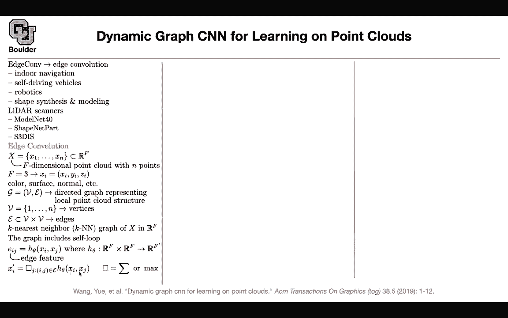

# P96：L43.3- 动态图形卷积网络（DGCNN） - ShowMeAI - BV1Dg411F71G

So there is another paper that I want to cover and we have around 10 minutes to do so and that's TGCnN。

 it's also really powerful for working with point clouds and 3D data So you're gonna see H conf that's just edge convolution and these are the applications indoor navigations self-driving vehicles。

 robotics shapes， things is is modeling etc。 the data could be in the form of lightar scanner。

 some data sets that you can actually do exploratory data analysis on them。

 So we saw a lot of other data sets other than image in this course Then there is edge convolution。

 let's see what that is we have a point cloud and let's say each one of these points in your point cloud or F dimensional this could be X Y z coordinate or they could be color surface normal etc。

 we are gonna create on fly some dynamic graphs and each graph。

You're gonna denoted by its vertices and its edges。 The vertices are gonna be your points。

 So these are that's easy。 These are your points。 The edges are gonna be connections between the points and how do you come up with that。

 You do K nearest neighbor So once you do your K nearest neighbor is going to give you your edges And in addition to K nearest neighbor there is also a self look So each point is connected to itself and we are gonna look at some edge features So you're gonna have two points X and Xj in your data in your point cloud is's not the data is's just one element of your data So X and Xj are gonna be two points in your point cloud and then we need some edge features is's gonna be EIj because you have two points I and J is gonna be parameterized It's gonna give you some edge features。

 The question is what is H。 That's one question the other question is how are you gonna aggregate these features these edge features that you're obtain。

And you have multiple options for this。 You can have the summation or maximum for this operation and let's see what we are doing。

 We want to know the value of our output at index I we are gonna take as input our X It's a point in our point loud and then we know it's neighborhood because of our edges So this point is going to be connected to some other point and because we already constructed it our edges。

 we can do a summation or a maximum around that point so it's very similar to convolution it's local you can have various choices for H and this is square notation which is summation maximum or other options if you want to have a standard convolution you would have M filters Xj is a vector C time is a vector of the same size once you multiply them together It's the dot product。

You're doing a summation of a neighborhood points around your index I around your point I and that's going to give you features for the next layer this is a standard convolution for pointNe the previous paper are H of X and Xj was just a function of XI and then in the end you have a global average pullinging over your points or global max pullinging for point CNN it's a function of its neighbors Xj and then you're going have a Gaussian kernel and a Gaussian kernel we know that if you're very far from zero the kernel is going to go to zero if you're around zero it's going to be a value of one and then you have a pairise distance within your points the further least two points are from each other then they're going to have less effect on each other and that's going to give you method called point CNN you can have another eruption you look at your Xjs in the coordinateator of your X。

And these are local information It's also not only you want to include local information when you deal with point clouds。

 you want to encode global information as well， so it's better for your function H of beta to be not only a function of in local coordinates but also a function of the global coordinate of the current point that you're dealing with and in the end the DgcnN paper DgCn method is going to include it's going to choose its H according to this function you first multiply your X by a vector then you can have M of them it's similar to your convolution and then it's not only a function of X the global information but also a function of the local information the distance of Xj from XI and that's going to give you your H features and then in the end you're just going to use max so you're going to do a maximum pullinging of the neighbors of the I the I point and then why is it dynamic because you're gonna。

Create your graph on the fly in a dynamic fashion so you're gonna to dynamically construct per each layer your k nearest neighbor and that's why this is the bottleneck of this method it's gonna be slow because of the K nearest neighbor operation and let's go over the data sets modelnet has this many meshes of CA geometries and it's going have 4D categories so you have 4D glasses shapenet is a part segmentation data set it has this many shapes you're gonna have 16 object categories in total and you're gonna have 50 parts for your annotation Stanford large scale 3D indoor spaces data set S 3DIS it has 3D scan point clouds of six indoor areas there are gonna be 272 rooms in total and the semantic categories there are 13 of them and there are like board bocasets。

Chair ceiling beaman and then plus clutter objects stuff this is pointnet it's having some confusion between classes this is dtCn and that's your ground truth so it's a powerful method the only button that is dynamically constructing knrous neighbor and in terms of implementation the way that you implement that is let's say there are K neighbors for each point I first you create these edge cons edge con features and that's gonna have a dimension of your points then you have K neighbors and then each one is gonna have a n for its features because youre gonna to take those points and push them to do a bunch of MLP that's how you're gonna implement that so these are just MLlP and then once this is done then neighbors are computed you do a pulling and the K dimension and the dimension corresponding to your to your neighbor so it's very easy to implement this once you know your edges。

Due to using Ken nearest neighbor， it's very easy to do that pool and implement that。

I guess I'm finishing right on time， I'll be around if you have any questions。

