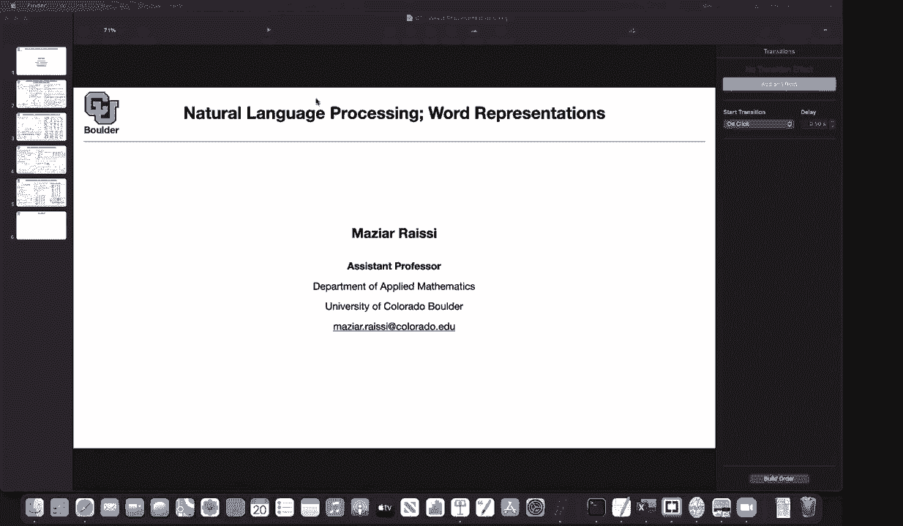
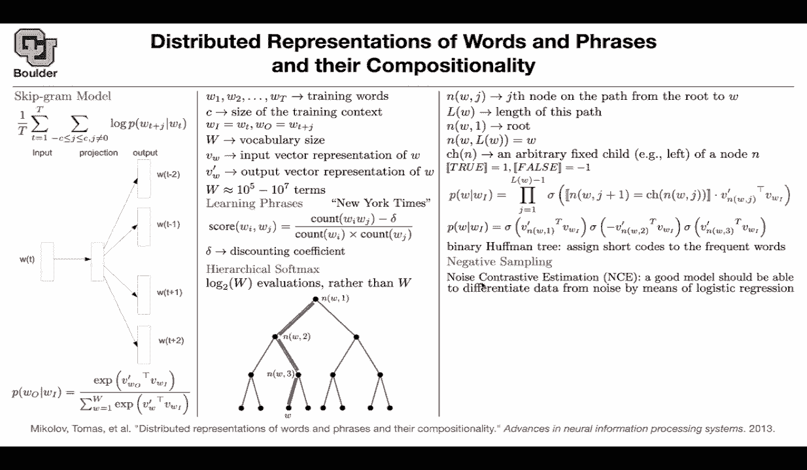

# 【双语字幕+资料下载】科罗拉多 APPLY-DL ｜ 应用深度学习-全知识点覆盖(2021最新·完整版） - P97：L44&L45- Word2Vec - ShowMeAI - BV1Dg411F71G

So let's start with natural language processing And whenever you want to start with natural language。

 the question is， how are you going represent the words in the language for us as human。

 we understand what a word is and we understand it in an intuitive fashion But when you want to talk to a computer the computer needs to know what is a word and how to represent it The computers only understand numbers and I'm going to start with these paper distributed representation of words and phrases and their compositionality and it's going lead to word to which So we are gonna to transform a word to a vector Now heres a question for you how would you represent distributed or of or words or and phrases in a computer representation makes me think of mapping into matrices。

 Okay so first thing first， you are creating a dictionary Okay that's good。

And in your dictionary you could say this is my first word， this is my second word。

 this is my third word fourth， five now these are numbers yes， one，2， three， four， five。

 six up until the side of your vocabulary， but is this a good representation know because the computer will see number six get in number one for example。

 so I'll assume that yeah so on yes， thats one problem the other problem is。We usually as human。

 understand words in context， so it matters where distributed is sitting。It matters where there is。

 it matters where compositionalities in a sentence。

 its neighborhood words matter if you're representing with one，2，3，4，5，6， yes。

 you are representing your words， but the problem is and number two doesn't know should it be related to number 1。

000 in the vocabulary because it is closest to that or no。

So that's the type of problems that we want to address another type of representation that you see a lot for words is that if this is your first number you can create a very long vector having the size of your vocabulary let's say you have 1 million words or 1000 words in your vocabulary and then the first entry is one the other entries are zeros these are called one hot vectors the second word is going to be there is a one and the second entry of that vector and the rest of them are zeros but again this has the same problem it has actually one more problem the first one is that it's not talking to the words in its context and the other problem。

Is that these are usually very long vectors， so it's gonna to be a 1000 dimensional or 1 million dimensional vector with a lot of zeros so we are looking for a different way。

 Our problem is that we want to include the context and we want to have a shorter vector so we are looking to represent each word with a vector of numbers't another problem be with like changing vocabularies like as new as new words enter the English language like how do you add that into our existing embedding with one hot vector is then you'd have to I guess extend them all Yes。

 that's also a great point and we are gonna try to address that in the next papers so yes。

 that's also a very important。Comment， but for now。

 our problem is trying to represent them with vectors unless lets get started with the skip grant model。

In machine learning and deep learning you usually have four components， one is your data。

 the other one is your model， what type of model you are writing。

 the other one is fitting the parameters of the model to the data that's called training and for training you need to write a very good loss function so the question is what is your loss function and in the end once you train your machine learning algorithm or deep learning algorithm。

 the question is how do you evaluate it， how good is your machine learning framework。

 how good are the word representations that you're coming up。So I keep this in mind。

 so there are going to be four components， the first one about data。

 what type of data do we have can somebody answer。So your data is going to be you scraping the web。

For instance， it could be all of the documents。On Wikipedia or all of the documents on the internet。

All of the news documents， all of the comments that people are writing for reviews of an Amazon product。

 etc ce， these could be your data okay so these are a bunch of sentences so your data is in the form of a bunch of sentences and your sentences are something like this it's a set it's a sequence of words so the order matters so that's your corpus that's your data that' your corpus the model that you are writing you are trying to represent each word with a vector that are model。

And what is going be our last function This is gonna be your last function for escape parameter model。

 What does it say， It says that you pick a word WT is a word in your entire corpus。

 So there is a question does the order really matter 100% you can switch a few words and the sentence will have the same meaning So that's correct also it's not perfect and that's why it's a hard problem It's unlike what we are used to in usual scientific computing where things are perfect here there are no perfect solutions。

 It's not going to be 100%。 Okay that's an answer your question。

 So let's see what this loss function is telling us It is telling us that you pick a word。

 let's say representation and your problem is to predict the words to the left of it or to the right of it。

 Maybe you take this word and you want to predict the words to the right。

 maybe two of them and two words to the left。So that's going to be your context so you pick a word and you want to predict a bunch of other words in the context T is going to be a word in your corpus small T and then you are going up until capital T that's the entire size of your data set it's all of the words that are appearing in the corpus okay so you are doing an average over all of your data。

All of the words in your data。 And then your problem is to model this probability。

 and you want to increase the probability of the words that are in the context。And at the same time。

 try to decrease the probability of the words that are not in the context Yes so that is this summation log is not going to change anything。

 it's an increasing function， so if you maximize this function you are maximizing the probability and the question is why average because you usually there is usually the assumption on your data that they are identically and independently distributed。

 So if you want to write down the probability of your entire corpus there is going to be a product over your entire corpus。

 but once you take the log of the product you're going to end up the summation of the logs okay log of product is equal to summation of logs doesn't answer your question that's why you're getting the summation and this one over t is just a constant so it doesn't change the maximum value by context so there is a question what do you mean by context is。

See the window of words you want to predict in the sentence Yes。

 so I guess this figure is gonna make things more clear。

 you pick a word maybe these words here that's going to be your work and then your problem is that you want to predict the words next to it the words in its context so maybe you want to predict of and representation and you want to predict and and phrases so does an answer question Acer and there is another question is the mean counterpart of the geometric average as if we took the product instead so yes。

 whenever you want to maximize the likelihood you can either maximize the likelihoodli which is going to be the product of a bunch of probabilities or you can equivalently maximize the log of the likelihood and whenever you take the log it's going to turn product into sumations okay。

So that's a problem but I didn't tell you what the model is I told you what is the loss function Now now the question is how we're gonna model this probability we need to introduce parameters we need to parameterize our words so let's try to do that we are gonna represent each word in our vocabulary so w is the size of our vocabulary and we are representing each word with a vector we are representing distributed by a vector maybe it's 100 dimensional vector and it can take real values so it's a 100 dimensional vector Wi is is just an index okay in the dictionary maybe distributed is the 100th word in our dictionary so we are associating a vector to that word and that's the input word so wi is exactly this W T here is exactly this WT here that's the input and then we are gonna have another vector representation because we want to give。

model a little bit more flexibility for it to be able to optimize You are gonna to associate another vector for the output works and the output could be this work here。

 if you multiply two vectors together you're gonna to end up with a number this is a dot product whenever you multiply two vectors together you' are going to get and if you do it a dot product you're gonna to get a single scalar so this is just a single scalar the problem is this is another probability this can take a value from negative infinity to positive infinity but we want to turn that into a probability and the probability is going to take values that are positive so if you want to make something that is from negative infinity to positive infinity and make it positive you usually take an exponential the exponential is going to make it positive okay the first problem is solved then a probability is always from zero to one that's why you are dividing。

By a term that is bigger than the en numerator so this is your denominator that's your numerator and this is called a softmax this function that I'm writing here exponential divided by this summation of all of the words in our vocabulary is going give you a softmax This is gonna to be a value from zero to one and now this is a probability and one thing is worth noting that you have w words in your vocabulary so you have a vocabulary size and at the same time you have a corpus size so I don't want you to confuse those two together this is your data set size。

 this is your vocabulary size your data set could be in the order of billions of words or keys in the order of billions and w could be in the order of 100 or millions okay that's the number of words that you're gonna have W the question is what is v prime it just another vector it' just another。

V prime is another vector the same way that V was a vector V prime is a vector。

 Okay so now this is a probability。 You can plug it in there and then you try to maximize that while you maximizing over。

 you are maximizing over V and exactly the question that we just have v prime。

 So you're maxing these are the parameters of your model V and v prime And the question is what is transpose the transpose is you have a columnwise vector and you're making the row vice So this is a row。

 this is a column vice vector after transposing it's going to become a row vice vector and then you're gonna to multiply that by a columnwise vector and then it's going to give you a single number。

 This is one by 100。 the other one is 100 by one if you want to think in terms of matrices。

 and then that's going to give you a single scalr。 But the problem is that the scalar is from negative infinity to positive infinitefin and by taking an exponential and dividing it by the sum。

Of the other exponentials in your vocabulary， you're turning that into a probability so these are your training words and that's exactly what I just mentioned T could be the size is actually the size of your entire dataset set withs all of the words in your dataset set sees the context how many words to the left and how many words to the right Are you looking at W I is exactly W T W O is one of these。

It could be any of them， so it's w T plus J and J could be negative2 negative11 or2 W is your vocabulary size Vw is the input vector representation for W for instance。

 if your W if your word is compositionality V W is going be its vector itss corresponding vector So each word is gonna have its corresponding vector So there is a question what is a dimension of the vector V that depends It's a choice that you make you can it could be 100 dimensional 256 dimensional or it could be 1024 dimension It's a choice that you make and there is another question from dens if P of W O conditioned by W I is equal to one does that mean W I is always followed by W O。

So there is a difference， what you're looking at is first of all。

 it's never going to happen that it's going to end up in one in your data set。

But there is a difference between what is happening in your data and the model that you're writing for the data Maybe there is a word in your corpus that is always followed by De or preceded by that but thens that's what your data is telling you that's what the statistics of the data is but this P that we are writing here is a model for the data it's never gonna to be perfect but first you write a model and then you plug in your data inside your model that's going to give you your likelihood that you are maximizing I once you maximize that you're going to end up with your vectors so does that answer your question so there is another question I do not understand the model's diagram given a word you are predicting the probability of its context words exactly so given a word you want to write a model for the probability of its context words given the input。

you want to write a model for the probability of the output work in the context once you write a model。

 once you parameterize it， you can start try to maximize your likelihood or minimize your last one。

And there is another question but the context size would be fixed。 Yes。

 each model that you write is gonna have a bunch of parameters。

 So these are universal or machine learning any model that you write is gonna have a bunch of parameters it's gonna have a bunch of hyperparameter and what is a hyperparameter。

 this context， the choice of C it could be1，2，3，4 is a choice that you make Okay so C is a hyperparameter V and V primes are parameters of the model now the question is how do you set the parameters you set the parameters by maximizing your life okay how do you set C you set it by choosing a validation dataset set So you usually divide your data into training validation and testing and training data you are gonna train your parameters so always associate training data with parameters。

The hyperparmeter you're gonna to use your validation data to set them so you can choose what is C depending on your validation data and then before you put your model。

 your machine learning model into production you test them That's why you need to add some test data you first test it and then you put it into production。

 So that's how things are going to work， you use your validation data set to set C。

 you use the training data to come up with the best word vector representations。

 and then once you have an algorithm that's giving you the word representations。

 you can put it into production But first you need to test it what is the reason for taking the log of the probabilities That's a great question and the answer is sitting right here you have an exponential once you take its log the log is gonna to cancel the exponential and then you're gonna end up with a nicer objective function you minimize or maximize So does that answer your question Yes it's only because we。

Using Somax exponential， we usually use softmax， but it's usually easier to take the log。

 It's going to put your values in a nicer position so it's gonna to make the objective function easier to optimize So by taking log you're making life easier So there is a difference between the theory and the practice So once you sit behind the computer or deep learning you're gonna to keep staring at your loss function going down。

 you're gonna to get used to it and then sometimes your model doesn't converge for numerical reasons and one of the numerical reasons is that you're not taking the log and another reason for taking the log is that it's gonna to turn a bunch of product into a summation and once it turns into a summation。

 you can do a stochastic rather than decent so rather than doing the summation over your entire data set let's say you want to write a forlook that has the size of your entire data it's going to be billions of words on the internetax okay。

Cp it's going to take you forever to computer summation that's why you usually do it in mini batches you don't care all you need to know is a gradient length with respect the parameters of the model and you want to have an estimate for the gradient because then you want to do the gradient decentcent okay then you can do 10 sentences at a time and then try to optimize 10 sentences at a time and then computing these summations are going to be much cheaper so there are two reasons about I told you a couple of reasons for why you need to use log。

Let me read the chat again and see what other questions there are so yes in this case we are maximizing the likelihood is it so that's the question yes so we are maximizing the log of the likelihood and then there is another question from because so would every possible word have a probability at position Wi so the position Wo and Wi are exactly there is a one to one correspondence in your vocabulary between for instance the word distributed and number 123 so there is a one by one correspondence between these integers and the words in your vocabulary so this is always a 100 word in your vocabulary okay and W and Wi are the indices correspond to these words does that answer your question sort of I'm just wondering so you' are you just basically calculating a probability for every other word in your training。

WsSp off the word the current index Yes exactly so you modeling let's say you have the word representation for distributed and then you have a word representation for representations So these are two words in your vocabulary and then you have a corresponding VW for that word you have a V distributed V representation V of V words so for each word in your vocabulary you have a vector now you want to turn those vectors into probabilities if I give you this word here can you tell me what was the word next to it what was the word right left to it two words left with it or the word right next to it so that's the model that you are writing does that answer your question Yes thank you so the question is what does maximizing the likelihood mean maximizing the likelihood is equivalent to maximizing the log of the likelihood。

minimizing the loss is going to correspond to minimizing a negative of the log of the logic。

 so that's what it means And what is the output， the outputs are these probabilities That's your output This is your loss function and then the output of the entire algorithm is going to be a bunch of work vectors Okay let's continue So we are going to have an input vector representation for each word in our vocabulary。

 we are going to have an output vector representation for each word in our vocabulary these two could be equal。

 they don't have to be different but if you make them different it's going to give the model more flexibility and in the end we are going to choose one of them we are going to say okay we are going to represent distributed by V of distributed rather than be trying of distributed once the model is trained we are going to end up with a vector representation for each work What is a typical size for W。

At least for this paper， this was in 2013 it's around 10 to the power5 or 10 to the power7 that's a typical size of w so we had a vector representation until now for each word somebody might say I might have a phrase like New York Times if you。

呃。Break New York Times into New York Times when you are doing your training。

 then this is going to have a different meaning compared to what we are used to so New York Times is a journal is a newspaper that's what we associate in our minds to this phrase but then if you break it apart New York Times it's going to lose its meaning entirely so this what I'm going。

Tell you here is just trying to add a bunch of phrases to our vocabulary so we want to treat New York Times as a word as a single word and the stages that I'm going to tell you right next to it is just a preprocessing step on your data okay we are going to associate a score to each pair of words。

 each pair of consecutive words that are appearing in our corpus for instance New York this could be new this could be York then you're going to do count you go in your entire data set and count the number of times that these two words are appearing next to each other like in this case and the number of times that are that they are appearing in different locations inly you count them that's going to give you a score and if this score is bigger than a threshold you're gonna to include New York in your。

Pigctionary Okay， so this is a preproing step。 It doesn't have anything to do with our model。

 It's a preproing step。 Can I ask real quick， is that count of W I WJ term I that like dependent on order So that's different than WJ W I Yes。

 so it's different Okay we are not considering your new。

 we are considering New York Okay cool they so far so good。

 you count them and it's easy to count you going your data set and then just say count the number of times that New York appears in the corpus and then you can do a simple count and then if it' bigger than the threshold you're gonna include New York as one of your words Yes。

 this is a pair of words， but it could have a meaning of its own So we are including that and many of the words are gonna be below the threshold we are not appearing next to each other so we discard them This always one round we are gonna do。

Another round of the same thing。 Okay， now in our dictionary。

 we have the words Newo York and New York。 So we compute a score for New York Time So now WI is representing New York and WJ is going to be times again。

 you do the count。If it's bigger than the threshold。

 you are going to include that in your vocabulary， otherwise you discard it and it turns out that if you do it for a couple of rounds。

 it's a good algorithm for giving you these phrases so now we are increasing the size of our vocabulary not only we started with 1 to the power5 or 10 to the power seven terms we are adding a bunch of phrases to our vocabulary is this just TFIDF no it's different from TFIDF。

So TFID if you usually use it for classification。 you're gonna go over that so don't worry about it by different。

 And what is delta That's a great question and delta is just a discounting coefficient So in the end what's gonna happen This is gonna be bigger than a equal to a threshold let's call it T let's multiply count W I count Wj by T and keep it to the right side So now you're just putting some flexibility for the model。

 you don't want this inequality that you're writing to be too strict so it's just a discounting factor and again it's another hyperparameter。

 The delta is a hyperparameter sees a hyperparameter the size of your vocabulary is another hyperparameter So these are the hyperparameters of your model Okay perfect but we have attached There is a problem We have a problem and can somebody tell me what the problem is and it has to do with the computational cost。

What is wrong with this model that you're writing so what is wrong with this probability mathematically everything is fine but computationally there is a problem yes exactly so that's a great point so you guys are mentioning that when W is big and W is literally really big okay it's order of millions and above when W is big you're going to have to write a forlook to compute this summation each time that you haven't have a word in your corpus so this is computationally expensive computing that。

You're going to do a lot of forlooks， your for loop is going to do a lot of iterations of order of millions and billion okay so this is expensive this is not a problem when you are doing classification for maybe images when you have maybe 1000 images to classify a month but here is a problem this is big and then it's going to make your algorithm very slow。

So there is a way to turn to reduce the cost from W to log2 of w and whenever you see log2 there is the trait where that is usually a tree and that's going to be a tree so you're going to create a tree and then log two is coming from having two branches each time okay but how is it going to give us the probability now how is it going to help us reduce the cost so just keep this figure in mind and let me tell you what is Nw1 and W2 andw3 Nw1 is the first node and the path from the root to the word that we are interested in L of w is the length of this path so the length of this path is is4 actually so it's going to be3 plus1 so that's the length of the path Nw1 is the root of the path Nw4。

Is the word that we are interested in so you have NW1 N W2 and W3 and W4 let's say CHM is always the left child So this is you fix a child and for now let's fix it to be left So C of M anymore you know this is gonna be the one to the left of it and we are gonna turn true and falses with this double bracket into ones and negative ones and then we are gonna to write down our probability So this is our probability this is what we are interested in this is our probability This is our probability Here is another formulation of our probability first of all why is it more efficient don't worry about the terms here Why is it more efficient because we are doing now a product so you're gonna have a for loop that is gonna have this many iterations in it Lw iteration and Lw is exactly what you have here it's a log true of w so these are equal LW the length。

Of your path is going to be logged2 of your W， okay。

 and now let's try to expand this for an example for this example that we have here。

And let's say you want to know the probability of W given an input for the inputs word。

 you have a vector W VI you take W sorry V WI you take V WI multiply by the vector here for this node so now each node is gonna to have its own vector representation you multiply it once and this is gonna tell you should I go to the left should I go to the right this probability here and sigma is just a number from0 to one it's a sigmoid function should I go to the left should I go to the right with what probability are we going to the left with what probability are we going to the right same thing here with what probability are we going to the left what the right with what probability are we going to the left or right so I guess I'm going continue this next session but for now we have three more minutes and this is enough time to tell you why do you have a negative sign here and why do you have positive。

S here and where they are coming from the positive sign is for going to the left。

 the negative sign is is for going to the right and there is a cool property of the sigmoid function that sigmoid of x is equal to sorry one minus sigmoid of x is equal to sigmoid of negative x that's why you have a negative sign here Basically this is one probability and then the other one is one minus the other probability So this is probability this is one minus probability and it makes sense it is either to the left or right。

 it's one minus the probability of going to the left and this child here is just a mathematical formulation of coming up with these pluses and minuses because on this path from the root to the node to the word we are going one time to the left。

So that's a left child， that's a positive， then you're going to the right， that's a right child。

 that's a negative。That's why you get a negative here and then you go to the left and that's going to model the probability and it's going to have the cost of log2 of w it's going to have the cost of this help think we are out of time for those of you who want to leave you are more than welcome to leave and for those of you who want to stay and ask questions Ill be around and there are actually some questions in the chat Thank you。

That's a great question the question is does it matter how the tree is structured？

The answer is yes and no for no， it doesn't matter how you create this tree is that you're always going to end up this cost it's gonna to be log 2 of w so it doesn't matter。

 you just create a tree and it's going to give you this cost if you want to do better than log2 of W Yes。

 it matters maybe you can assign shorter path to more frequent words in your documents okay and then it's going to be much shorter for the for those path and then it's going be much faster for the frequent ones exactly so it's gonna to be called halffman encoding and it's actually what you are gonna to cover nextation it's going to be binary halfman tree so you're going assign shorter code to more frequent words perfect。

Did I miss any questions have I answer it all of them There was a question in there about what the nodes are but I guess the answer is that they aren't anything what only matters are like the the leaf nodes yes。

 in the end what's gonna matter is these VW Is but then that's actually a good question we are sort of trading of computation you're doing less computation for more parameters So now you're associating more parameters each one of these nodes is gonna to have its own parameters the prime of node so his idea we're grouping words together So we're almost having the number of words or getting rid of like half of them and then the next node or even like further narrowing it down so you're just kind of instead of checking the probability of every word you're kind of checking the probability of groups or words Yes。

 that's a very good way of put on it by going to the left of these at this node。Going to the left。

 you don't have to consider the ones you right of it。 So you don't have to do any operations on them。

 So you got rid of that。 And then by going to the right here。

 you're getting rid of the ones to the left。that's where computational savings are coming from how do you build the tree so it' properly each subtre is like a proper is the right group of words so there are actually algorithms for giving you the halfmat treat and binary trees in general so about to solve problem in computer science there are algorithms thats going to compute。

You give it your entire data set actually your entire wy and then it's going to create a tree for you okay so don't worry about that is this probability formula with the product from one to Lw minus1 is it dependent on the fact that the tree that you build is a proper like binary search tree or would any arbitrary ordering allow that formula so any binary tree is going give you that and it's going to solve your problem but then it can make it more efficient doing countries and I had a second question did the word embeddings only exist at the bottom layer and everything until then is I guess I'm confused about what is stored at like NW2 and NW3 So at NW2 what is stored is it still a vector of the same size let's say your size is 100？

This is going to be a 100 dimensional vector， but this is going to be V prime for these nodes。

 you have V primes。For your words， you're gonna have these。

And the ones that the V primes are kind of like just I guess computational intermediates and we don't we don't use them actually this thing has been trained exactly so that's a great one once the training is done all you need to store and give your customers are these V of ws so you give them an embedding matrix corresponding to very kind that makes sense Thank you。

Why is the vocabulary size different from the I mean。

 the number of training words because the same word， for instance。

 distributed could appear in this sentence or another sentence in your document。

 that there could be many sentences that can have the word of in。

That's why basically training words are just all their terms like tokenized terms exactly yes。

 okay so it's going to be you go through your document sentence by sentence and word by word and we're going to have a corpus it's a large corpus of all of the documents for instance。

 on Wikipedia and you go line by line oh I've saw this word and I'm seeing it again in this sentence I'm seeing it again in another side。

That's where this summation is coming， so you could use the same input word multiplely。Okay， and。

 I mean， in this probability function that we have written in initially under this objective function that we have written。

 how are we encoding that a particular word was at a distance of， say， two words from W T。I very。

 So we are not。 This model is。It doesn't matter whether it's the second or to the left or the first one to the left。

 it matters only that it's in the context， but that's a great point that we're making。

There are actually models that take that into account。

 but this is just a starting point for us Thank you Any other questions Thank you。

Let's get us started I'm going go through the same topic I'm going go through it a little bit faster just to remind ourselves of what we are trying to do we started with a skipgram model so for each word in our vocabulary we are going have a vector representation actually two vector representation one is the input vector representation and one is the output vector representation these are the parameters of our model now whenever you're doing machine learning and deep learning you need to write a loss function and this is our last function we want to maximize the probability of the words that are appearing in the context of the word that we are interested in for instance if you're interested in WT and the word is representation you want to increase the probability of distributed of words etc and at the same time decrease the probability of the words that do not appear in the context so that's your last function once you minimize this last。

With respect to the word representations， then in the end you're going to be able to represent each single word in your vocabulary with a vector that knows about its neighborhood words and that's how the meaning is going to get transferred transferred from one document to the next document and each word is going to have its own meaning depending on the context around it。

So I mentioned that you can represent the words in your dictionary as numbers， this is number one，2。

345678910 another way to represent it is you have a long vector of the size of your vocabulary and the first entry for let's say they were distributed is one and the rest of them are zeros and this is going to be called one hot vector so there is only one hot location that it is one and the rest of it is zeros for one hot vector the question is is is the input word and projection the one hot vectors so yeah that's where I'm trying to go with this figure。

What does this projection mean Because in this figure you're seeing the word projection。

 but what does it mean So each word is going to be a1 hat vector and wherever you have the location corresponding to this word there is going to be one Otherwise it's going to be zero。

 for instance， if representations is a word in your vocabulary and let's say it is the 121 word in your vocabulary there is going to be a one at the 121 location of that vector and then it's going to be zeros everywhere。

That's how you are representing wTs so you can represent wTsza you can think of them as either indices。

1，2，3，4， five， six， etc， or you can think of them as10 vectors okay if you take a 10 vector and multiply by a matrix of your word embeddings that's going to get projected into the word vectors that we're interested in and because it's a 10 vector it's going to choose the corresponding column of that。

Word embedding matrix。 So whenever I say word embedding that corresponds to your dictionary Okay and that's exactly what we are looking after。

 We are looking for。 We are looking for vector representations for our words。

 So there are two ways to think about it。 And that's why we call it projection because you' are actually multiplying a very long vector that is a sparse by a matrix and then you are projecting it into a lower dimension Okay for instance。

 Wt could be 1 million dimensional which is a sparse vector。

 and then you are multiplying it by a matrix and then projecting it into maybe 100 dimensions okay from 1 million dimension。

 you are going to 100 dimension but in the end， don't worry about that in the end。

 you can think of them as indices and for each index。

 youre gonna have a vector regardless of how you came up with this vector。

 you came up with it through a matrix vector multiplication or。

camee up with it with just indices for each word， for each index。

 you're going to have a vector for distributed， you have a vector corresponding to distributed and these are now full vectors。

 They are not sparse okay。These are not one hot vectors anymore now you have an input representation。

 you have an output representation corresponding to this word and this word。

And you can think of this dot product as a distance， so this is what I didn't tell you last session。

 but you can also think of it as a distance this is not the Euclidean distance but you can think of it as a distance so you are sort of computing the distance between two words and you can think of this as coine similarity distance you are computing the distance between two words this word and that word and then you are turning that into probabilities using the softmax operation so this softmax is going to turn a number that is from negative infinity to positive infinity to be from zero to one that's cool and another properties is if you do a summation over all of your inputs over all of your output vectors over all of your output indices then the numerator and denominator are going to cancel out it's going to become one it means that the summation is also one so not only it gives you a。

Is going to give you a probability distribution over your words that's why if you increase one of these probabilities。

 you are decreasing the rest of them because they have to add up to one there are a bunch of positive numbers from0 to1 they add up to one if you increase one of them the rest of them should compensate for it and go down that's how if you increase the probability of the words in the context of representations if you increase the probability of these word and the other words the probabilitybabilities of the rest of the words in your vocabulary that are not appearing in the context are going down because they have to add up to one and there is a difference between your corpus this is the entire corpus and these are all of the words that are appearing in your corpus and let's say that's the size of t sees the size of your context so this is a hyper parameterameter。

The size that you choose for these vectors is another hyperparameter and the size of your vocabulary。

 what words do you want to include in your vocabulary is another hyperparameter that you can choose and the parameters are these V and V primes and if you want to relate Wi and WO with this figure WI is these WT and WO is any of these outputs。

And the size of your vocabulary is usually much smaller than the size of your corpus because the same word can appear in multiple sentences and in multiple documents this is the input representation so for each word you're going to have an input representation and output representation in the end you can either choose Vw as your word representations once the training is done or you can use v prime or you can add them and divide them by two and that could be your representation So are the parameters that were learning using this loss function are they the like matrices that give us the input to input vector representation and input to output can you say it again what do you mean Well so like in this like deep learning model like the parameters that were updating according to that loss function in the top left are they。

For example， the matrix that takes our one hat vector and transforms it into into whatever projection we want Yes。

 so you can think of it that way as well Okay so let's say you have a dictionary of words and let's sort them and let's say the entire dictionary that you're going have are these words distributed representation of words and phrases and their compositionality Okay so and is appearing twice so we're going to include only once so this is the first word1。

2，34，5， six，7 so I'm ignoring and here7 and8 okay that's your vocabulary and let's you can assume that you can have a matrix these are your rows one2。

 three，4， five，6 etc and then for each row you're gonna have a vector you're going have a vector corresponding to the first row a vector corresponding to the。

And now if you stack everything on top of each other that's gonna to give you a matrix so you can either think of it in terms of matrices or you can think of it in terms of individual vectors how many columns would have that's a hyperparameter that you choose that's a great question That's the dimensionality reduction that you're doing here that's a hyperparameter you can have 100 you can have 256 you can have 1024 etc but if you want to reduce the dimension you necessarily want it to be less than the number of rows No it's actually yes。

 it's gonna to be less than the number of rows because the number of rows is the size of your vocabulary it's W and then you want to project from a very long vector to a shorter vector maybe 100 or 256 doesn't answer your question and yes。

 saggy is right the matrix that we are explaining is the layer parameters so these are your word representation。

Each row of that matrix is going to be a representation of that corresponding word。

 so is everything clear now？I think that's clear and just one other question about that like there's two sort of like in the simplest model there would be sort of two there would be the the matrix to project our input word into some input vector representation and then there would be another matrix to project that input vector representation into our output vector representation Yes。

 that's exactly right So you're gonna have one matrix here you can call it a capital V matrix and the entries of that capital V matrix are these small V wis and then the output matrix is gonna be v prime and its entries。

 its rows are these vectors Okay thanks so yes。And there are a couple of questions on the chat so the embedding matrix starts with random values Yes。

 so the embedding matrix starts with random values and then throughout the training they're gonna by maximizing your likelihood in the end you're going to end up with meaningful word representations initially they are random and there is a question so one row per word but the column number is variable exactly so you're gonna have one row per word and the column number is what you choose is the dimension of these vectors and yes the embedding matrix starts with random values but then you do the optimization and then they're going go in the correct location they're gonna have meaning a question in regards to the embedding I've seen a bunch of visualization that you can visualize the worlds next to each other on it to de plane I'm wondering how big is the dimension。

That you actually use in I guess the industry。That depends that depends on your corpus size。

 the more words that you have， the more words in your corpus， the the bigger the size of your corpus。

 the larger you can set these the dimensionality of your vector representations it could be 100 it could be 256 1000 to 24 and you can double that each time okay I think it's around 1000 to 24 recently that people are using but it could even get bigger depending on the size of your corpus any other questions okay so this was another way of looking at the same context from last time so last time I thinking of these wTs as indices now I'm thinking of them as 1 hot vectors and what you're learning is these matrix that is doing the projection you can call it V and then there is going to be another matrix that is doing that is increasing the dimension this one is decreasing the dimension the other one is increasing。

dimension back to 10 vectors， but when you want to implement it， this is exactly what you do。

 you're going to think of WTs as indices because you don't want to store long and large sparse matrices and vectors。

 okay。Because the number of words in your vocabulary could be a lot。

And then we are actually adding even more words to our vocabulary for instance something like New York Times has its own meaning if you break it apart like New York Time。

 then it's going to be meaningless it's the phrase the entire phrase that has a meaning and the way that you do it is you do this is just a preprocessing step on your data you go through your corpus。

 you look at the words that are next to each other， you count them。

 you divide them by their individual appearances and then you put a threshold if this is bigger than a recall to that threshold you include that pair of words as a single word in your in your vocabulary so you're going to have an additional row in your word embedding matrix for that word and then you do it a couple of passes if you do it a second pass you're going to get New York Times but the other problem the problem is that's computing this softmax is very costly you're going to have to write a for loop。

That war loopbe is going to have 10 million iterations and you're doing it per each word per each input word per each pair of input and output word。

 So it's gonna to be a lot of war loopbes it's very slow there is a way to reduce the computational cost from W to log 2 of w and whenever you see log2 there is a tree behind it so that's a tree So one thing that we are doing here is trading of computational cost for more memory previously per each word you have a word vector now not only for each word you have a word vector but for each node in your graph you're gonna have a vector and these are going to be your V primes So let's go through this tree a little bit what is n and is going represent your node W is going tell us that we are interested in this word and J is going to tell us what node on the path are we on on the path to。

W Rvion for instance NW1 is the first one and W2 is the second one and W3 and Nw4 is the last guy the word that you're interested in L W is the length of your word so I'm going answer your question shortly the question is what does a node represents I'm going to tell you shortly so LW is the length of this graph and in our case it's going be123 and plus1 so it's going to be4 Lw is4 and W1 is the root and W4 is the actual word that we're interested in that's the last node that's your leaf of the three CN n is your node C is a particular child that you choose maybe your favorite child is your left child so you choose it that's a convention and you fix it so let's say it's our left child is there reason we don't zero。

Not really you could it might actually be better because if you zero index and W3 is the word that you're interested in。

 but we are going to take care of that by subtri the one later on and then you have it these double brackets they are just turning true and falses to ones and negative ones this is the functionality of these double bracket Why did I go through that pain of introducing that notation because in the end you want to represent a probability in a mathematical way and that's a mathematical formulation but let's go through the intuition through these example at each note you have the choice you can say I'm going to flip a coin and then if the coin is coming up ahead I'm going to the left if it's coming up tail I'm going to the right and the probability of going to the left is going be a sigmoid the sigmoid function is a function that is like S it takes value from。

0 to one， so it's basically mapping negative infinity to positive infinity to a number from0 to1 Okay so that's our sigmoid function。

 We take the dot product of the input word this is exactly what we are doing here as well the dot product of the input word but this time you're going to multiply it by the representation by the vector representation of this node and then you push it through a sigmoid function and that's going to give you the probability of going to the left I guess that's going to answer your question what does a node represent we are gonna to have a representation for each node because it's going to give us the probability it's gonna to help us decide whether we should go left or whether we should go right and if we go left then this half of the graph we can just ignore so you're ignoring half of your words right away you don't need to consider them so half of your dictionary。

 the size of your dictionary is now reduced by half so it's massive and that's where the。

Additional gain is coming from So as soon as you decide to go left。

 you're going to ignore everything to the right now for the next round on the path from the root to the word because the path is going to the right we need to know what is the probability of going to the right the probability of going to the right is one minus the probability of going to the left but there is a nice probability for sigma it function and that is one minus sigma of x is equal to sigma of negative x that's why we are putting sigma of negative x here This is basically equal to one minus sigma of this term that's why we are introducing this double bracket notation because it's going to tell us should you put a plus one here or a negative one here Now you put a negative one there that's going to give you a probability of going to the right So now the probability of going to the left at。

This node is very similar to what we did before because we are going to the left there is a plus one here and in the end the probability of seeing this word is the multiplication of a bunch of sigmoid so what is the probability of going left what is the probability of going right what is the probability of going left multiply them together and that's going to give you the probability of ending at this leaf node now the question is how do we make this tree it doesn't really matter no matter how you build a tree as soon as you have a tree you are going to reduce the computational cost from w to log two of w so it doesn't really matter how you build the tree but if you build it smartly you can be lucky or in expectation get better performance then log two of w so in expectation you can get better performance if you assign shorter routes shorter。

Two more frequent words because these words that are appearing more frequent you're gonna to see them more so for them you're taking shorter path to compute the probabilities and for the ones that are seeing less frequently you're taking a longer path but that's okay because you see them less frequently it's not going to affect your computational cost that much in expectation okay whenever you're studying the computational cost of an algorithm you can look at the worst case scenario。

 the best case scenario and the average case scenario so the average case scenario is actually better than like to if you do binary half entries so there is a question okay so there is another question so on the root we keep the most frequent word no it's not on the root all of the words are at the leaf then nodes are just there to help you decide should I go to the left or should I go to the right so you're not putting any words on your notes you are putting your。

Wors here at your leaves after the tree Does't answer your question So why are you sacrificing some of the basically your trading of computational efficiency for memory efficiency so now you have to store vector representations for each one of your nodes so you need to store v prime of Nw1 v prime of Nw2 you know those learned yes they are learned these are parameters Okay so it's initially initialize so that has like an even probability and then over time we want to according to that loss function we update it appropriately exactly yes that's correct any other questions it feels like there still there will still be 10 to the bar five times10 to the bar five if the number of words in the vocabularies 10 by5 times will calculate the probability right because theyre calculating P。

Of a given word， given an input word， that isn't changing。No， that's not changing。

 so there is there is gonna be this summation steel which you can do mini batchching。

 so I'm not worried about that summation。 there is gonna be this summation that you still need to do per each input word you're gonna have let's say four output words so you still need to do that summation but then this summation here we are getting rid of it rather than doing a for loop with w iterations you can do a for loop with log to w iterations so that's what we are reducing Does that answer your question it turns out that you can actually do better than this by sacrificing it doesn't have to be exact probabilities for this algorithm to work you can have approximations to this probability and we can actually do better you can reduce the cost even further and we're going to see how there is this idea of negative sampling and negative sampling says its actually an old idea it's noise。

Conive estimation and C and the idea is that a model or a good model should be able to tell the difference between noise and data by using only logistic regression and logistic regression is a classical machine learning algorithm It was a prerequisity for discourse but even if you don't have that I'm going to explain it in the next line。

 but the big picture is that a good model for those of you who know logistic regression you should be able to differentiate data from noise and that's exactly what we need that's see why in the end we are interested in the log of P of Wo given Wi so we are interested in that you can try to do this you can try to increase the probability So this is just a probability after words that are appearing in the context So you're increasing those probabilitybabilities so this is data this WO is data because it is in the。

extSo let's say you choose representations as your input word。

 your output word is distributed because it is in the context that's a positive example。

 that's data and because it is data we want to increase its probability so we want to increase the probability of data to positive examples but then if you show an algorithm only positive examples it's not going to know when it's making mistakes so the algorithm needs to learn from its successes and its failures so we need to tell it what's a failure so how do you tell it what's a failure you go in your corpus you choose a random word that random word its probability of showing up in your context is very low so that probably a negative examples so we are going to show it noises so we are going to show it positive examples and negative examples you're increasing the probability of positive examples and decreasing the probability of negative examples。

So this minus sign is helping you decrease those probabilities and these are negative examples so show it a couple of positive examples。

 show it a couple of negative examples and the algorithm should be able to differentiate positive versus negative and then you can just optimize it and now what is the cost now per each log of Pw given wI the cost is just the four loop of size k and K you choose it could be as low as 10 examples or 100 negative examples okay so you show it one positive example and a couple of negative examples and how do you choose your noise you can look at the unigram distribution what is a unigram a unigram is just your words for instance distributed representation of words and phrases these are your unigrams a bigram is every pair of words distributed representation。

ations of of words words and and phrases so you're going to take a look at all of the words and then you can create a histogram of how many times the word of appeared in your corpus how many times the word words appeared in your corpus that's going to give you a distribution you can sample from that。

 but it turns out that you need to down weight the more frequent words in your dictionary in your corpus because usually they don't convey much information like and of there and these are not that much informative compare to distributed representations and compositionality or phrases the power three over4 is another hyperparameter that you choose so this model has a lot of hyperparameters there is one here you can choose K the size of your input and output vector representations that's another hyperparameter so these are。

Choices that you're making That's a great question Why don't we just preprocess the corpus in the first place to remove words like and of etc even if you remove words of words like of and etc that was just an example that I was saying even if you remove them there is still going be some words that are more frequent in your vocabulary that are appearing a lot of times in the corpus okay that's for taking care of them and what you just said is very important there is going to be an imbalance between rare words for instance the name of a person it could be a rare words or some words that are like New York Times that could be a rare word it's not appearing that many times that depends on the context and you're gonna to have some frequent words and there is usually an imbalance with them so there is another technique whenever you choose a word for training you're going to discarded with some probability。

That is a function of the frequency of that word in your corpus the more frequent the word is this is going to increase the denominator is increasing the numerator is just the number that you're choosing let's say10 to the power negative5 another hyperparameter if this increases the frequency of a word if a word is more frequent this is going to go toward zero and then the probability of dropping that word is going to increase so you're going to drop the words it's as if you're preprocessing your corpus okay so the more frequent word is the higher it probability of dropping so the question is should we drop it before this yes。

 so whenever you choose a word you're going to drop it with this probability and as I said the threshold is 10 to the power negative5 and the frequency is just the frequency and so whenever you write a machine learning algorithm you need to know what is your data。

You need to write a model to explain the data， you need to write a loss function to minimize or youll need to have an objective function to maximize。

And at the same time you need to somehow evaluate it how can I tell that this word vector representation is a good one How can we judge its quality Yes。

 you just told me a lot of math but what you actually come up with is it actually good how can I evaluate it so evaluation is very important in machine learning okay how are we going to evaluate this there is this task of syntactic and semantic analogies so this is actually a test for some of you that took GR you need to know this word is related to that word and this is similar to the relationship of another word to what and that's the question that you're going ask your algorithm now that you have vector representations and let's say your analogy task is Berlin to Germany is similar to France to what that's the question that you're asking Berlin to Germany is similar to France to what and。

The answer is Paris and the algorithm should be able to tell us Paris and the number of times that is successful compared to the times the number of times that is not successful is going to give you a metric to evaluate the goodness of your algorithm okay is this a way to see so we're basically looking for the distance between Berlin and Germany to be similar to the distance between France and another a world exactly now that's before before this trouble before having a vector representation for your words there was no way for the computer to be able to compare these okay but now there is chance you look at Berlin Berlin is an index in your dictionary you look up Berlin in your word representation or your word embedding matrix that's going to give you a vector now that you have a vector distances make sense for computers okay？

Now you have a bunch of numbers you can subtract the vector representation of Germany from Berlin at France and then compare the distance between this vector and another vector and you're looking for a word in your dictionary so you're going to go through your dictionary and choose the one that is minimizing this distance and it turns out that yes the algorithm is most of the time successful it's going to give you Paris okay so that's actually a good algorithm Any questions before I move on Yeah so do you compare every world in the last part vector W or do you just calculate the distance between Berlin and Germany and then find the distance from France of all of those worlds that are that distance so this is what you're going to do you're going to create a vector representation for Berlin you're going to subtract the vector representation of Germany from Berlin you're going to add the vector representation of France to whatever that you had。

read and then the word that you're interested in should be closest to this and that's the one that you're going to report and by the way this is a semantic analogy task you can have syntactic analogy tasks as well and there is a question from Sabrina theoretically this could work for any language yes so this can work for any language for Chinese or any other language and there are actually papers that are doing that actually the second speaker in the that we have invited is an expert for multilingual national language processing so if you're interested in that you should attend that one any other questions I just wanted to check my understanding for given this hierarchical softmax during back propagation the only nodes we need to update or the only vectors we need the update are the ones along the given path is that correct Yes and those you know because you know your training。

DaSo these are going get updated per back propagation Okay you're right I think we are finishing right on time for those of you who have questions and want to stay and ask I'll be around and for those of you who want to leave you have classes etc you can leave now someone asked earlier about visualization and I was curious if you could use something like TsN for visualizing like the output of this network like。

Related words or related words having like related similar vectors in this like visualization space。

 if that makes sense Yes absolutely， this is very nice now now that you turn your words to vectors。

You can do whatever that you want to do with them whenever you have a vector you can do operations on it。

 for instance you can do TsNE etctera and try to visualize these vectors and you can actually visualize this in a nice way you can have arrows and you can say okay these types of words are closer to each other and those types of words are creating a cluster so there are these nice visualizations and TSNE would allow you like embed that in a lower dimensional space and take a look at it yes so you can actually perfectly it's perfectly fine you can look at the words in your dictionary and try to plot them and some nice patterns are going to come out of that。

So the question is when we are done learning the vectors internally in the tree how do we extract the vectors for the leaves Oh these these are the parameters that you know so in the end what you're gonna end up it are a bunch of Vs and for each word you're going have a V1 V2 v3 v4 V5 v6 V7 V8 and a bunch of V primes on your notes So the V primes you can discard and v's you're gonna keep because these are these vector representations in the end Okay perfect any other questions now the V primes relating to the frequency of the world so you'll know to go left right you mean here I think so actually you can take to construct your binary halfman tree you can look at the frequency of the words and then the more frequent ones are going have shorter path。

But what I just told you in this slide is that there are three ways to write down your loss function。

 One was this， which is very slow。 there is going to be the hierarchical softm。

 which is helping us a little bit but not too much。

 but then there is negative sampling which is going to help us a lot。

 This is actually what you're going to use in practice This is the fastest This is not perfect。

 there is approximations going on here， but this is good enough to give you good representations and the cost is very low。

 it's just a forlook over k items。We could use both though right I mean you could use negative sampling in a hierarchical softmax or no Well the negative sampling already takes into the hierarchical right the hierarchical softmax no。

 no， it's not doing it So this is very simple it's a binary classification task you're doing you're differentiating between data versus noise Oh this is data because it appeared in the context this is a positive example This is a negative example So you show it a bunch of positive and negative examples So no there is no tree going on here Can we use them both simultaneously you could but I don't see why would you do that because this is already fast enough Okay okay。

 this is really fast it's just extremely fast it's better than log 2 of w in the negative sampling for example。

 if we were looking at the title we are looking at the word distributed then if our context is I don't know C is。

Then positive examples would be representation and of and negative examples would be everything outside of that exactlyact yes you're correct so representation and off are in the context of distributed these are positive examples and anything else you're going sample from them at random you're gonna sample maybe two of them or three of them and show it to the algorithm so when you do this for a word would you look at just the single instance of the word would you look at maybe all instances of the word in your entire corpus it's gonna be your entire corpus so you go your you go through your corpus in an order let's say you pick a word in the first sentence of the first document you look at its neighborhoods and write down that loss function for it and then you add to it a bunch of you go to the next word you do the same thing and the thing is that these WT could be appearing in different document I in different。

Okay， so you could be seeing that multiple times Does that answer your question Yeah。

 thank you I was wondering so in the softm we basically get a probability of a word being in the context of another word in the negative sampling we have a model that will learn its parameters that does the same thing using noise。

 is that correct Yes， so that's correct Okay so how do we I guess how do we do we have to rebuild the data set for turning that model or in it all part of the process。

So let's see the difference between the Sgram model。

 the hierarchical softmax and negative sampling so here you're only showing it positive examples you don't need to show it negative examples why because underneath there is this constraint on the objective that if you increase the probability of the ones in the context the ones that are not in the context are going to go down automatically because those probabilities have to add up to one okay same thing here these probabilities they are going to add up to one the proof is a little bit more complex but they are going to add up to one it's going to give you a probability distribution but for negative sampling you need to show it negative examples if you show it only positive examples it's just going to increase the probability of positive examples towards one and then nothing is going to happen the algorithm is not going to learn anything okay so for these two cases this case and hierarchical softmax。

You don't need to show it negative examples Does it answer your question Thanks so。

 So how do we so do we have to start by training this negative sampling logistically regression model first。

So in practice， what the algorithm is going to end up using is this negative sampling and that's what is going to give you word to V algorithm。

 so the algorithm that we have is word2 VC and it's going to use negative sampling。

 but they had to go through this pain to tell you that this is just an approximation so we are sacrificing something。

So I'm just a bit confused so we're using the loss function to see how good our model is but then we're introducing another model which is the negative sampling to this model to simplify the softmax so I wasn't sure if do we have to turn the negative sampling model first and then turn the the initial skip model it's all part of the process No so I guess there is a confusion here the skipgramm model is this figure and there is gonna be one over t that's your loss function of this summation that summation is still there so you are looking at the context and then there are three ways to represent log of P of w given the other W okay this is the first way this is the second way the hierarchical softmax which is this formula here and there is a third way which is an approximation and we are going to use the third way in practice so the negative sampling is just。

Part of our loss function。 that's part of your loss function。 Yes。

 so you're write down that and log of Pf w T plus J given WT is this term here。 So do we okay。

 so so we learn the loss function while will training the model No。

 you're not learning the loss function。 Your loss function is fixed。

 That's your loss function what you're learning are these double these vs your vector representations。

So how do we get the noise， how do we know how to choose the noise？

The noise distribution is exactly I guess it was you who mentioned it anything that's not in the context is going to be a word that's noise so for instance this phrases here is noise for the word distributed okay the way that you sample it is this is your sampling probability you just sample at random according to this distribution that's going to give you a noise distribution。

It makes a lot of sense， so do you have to keep a data set of which words are in the context of other words and which words are part of the noise distribution exactly yes。

 and you can actually do it on the fly you pick this word you know its context so that's a positive example and you sample an other word from your corpus that's going to be a negative example you know that compositionality is not in the next sentence next to distributed。

It could be so you could be making mistakes and that's why it's an approximation Okay maybe in one of your corpus in one of the sentences is one in one of your documents。

 you have distributed compositionality but this is a statistical framework Okay it's not kind of be perfect so do you only use a sentence at a time for the noise distribution you use a sentence at a time or multiple sentences at a time you do it in mini batches Okay cool sort so you don't have to do the summation over your entire corpus you can do your summation 10 sentences at a time or 100 sentences at a time etc。

I think I got it。 Thanks a lot。 Yeahep， any other questions。 Thank you。 Yeah。

 when you say syntactic evaluation， would that look like for instance。

 go to going is similar to dance to and the answer is dancing Okay okay。

 that's you like dance or go minus going plus dance and you would hope they would come up with dancing exactly yes。

 okay perfect it's gonna actually come up with that that we're gonna see nextation thank you Yeah。

 actually， and so the goal of this model is simply to understand word representation and word phrases Yes。

 so the goal is you want to find a way for computers to understand words and their meaning for instance。

 their semantic similarity or or syntactic similarity between words okay。

So the end resolve of this is just the model can make analogies between words and that shows that it is as a strong grasp of what how words are similar Yes。

 what is the similarity between words how they are related and that's exactly whats humans do so we don't understand words as single tones we understand them in context for instance bank could have different meanings according to the context it could be where you put the money or it could be near the beach or near the sea it could have different meanings。

Depending on the context So if you want then would you hope that if you compared like bank to money who would be similar to something I mean could you make that comparison and see if it would get the contextual thing you're comparing it to Yes but then these are all examples that you are taking your algorithm on but you want your algorithm to be good on average that's why you have a data set it's going to be a test data set that you're going to test a performance of your algorithm and then it's going to be I don't know 80% accurate so 80% of the times it's correct and to20% of the times it's failing so it's a statistical algorithm it's not going to be perfect even humans are not perfect if you think about it they're going to make mistakes。

Okay， thank you so much yeah no problem see you later see you。

