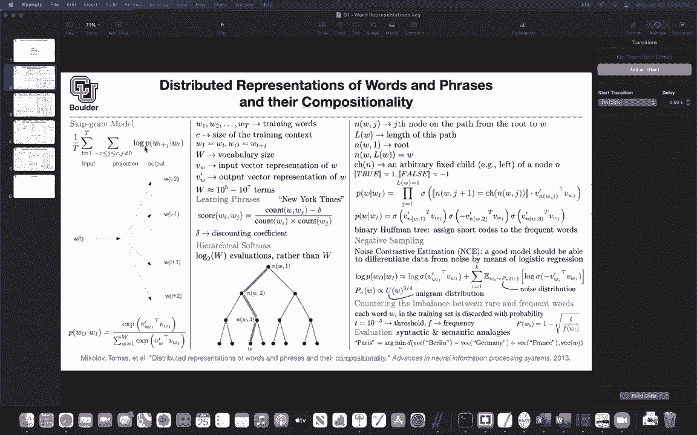

# P98：L46.1- Word2vec - ShowMeAI - BV1Dg411F71G

Let's get us started。 So what have we covered so far we wanted to represent each word by a vector。

 so we want to come up with vector representations for words in our dictionary and in the end the task is something like this the similar word when they come to syntactic or semantic analogies。

 you want your word vectors to be able to deal with them。

 basically put words that are semantically similar or syntactically similar close to each other。

 So that's the final objective for word representations or at least one way to test whether you actually learn anything whether your words learned any meaning and for doing that we were using the skipgram model。

 So this is the skipgram model a word goes in and you are predicting its context So a word goes in and you are predicting the context words and you had three options for your loss function youre in。

entire loss function is going to look like this That is a escape ground model now the question is how are we going to represent the probability or the log of the probability and we had three options to represent that one is the softm which is going to be very slow given the size of our vocabulary being in the order of 10 millions and above。

You can use hierarchical softms， so these are alternatives。

 you can either use this or hierarchical softms or you can do negative sampling and they are being sorted according to their cost So this is the most costly。

 This is a little bit less costly it's log2 of w rather than W and the cost of negative sampling is k。

 It's a higher parameter that you choose。It could be10 so this is the fastest and in practice this is actually what is being implemented in the algorithm。

 So for the word to V algorithm， this is the one that is being used in practice so any questions before I move to the next so this is a continuation of what we just saw so these two papers they are going to give you word to V it's the algorithm that is going to convert your words to vectors。

There is actually an alternative way of doing it rather than using the skipgram model。

 which is I give you a word， you predict the words in the context。

 you could alternatively use continuous bag of words Cp continuous bag of words and it's exactly the opposite direction of the skipgram model for the continuous bag of words。

 I give you the context and the task is for you to tell me what is the word in that context what is the target word what is the word in the middle and the way that it works is that youre going if you think of these as one0 vectors you're going to multiply that and project it multiply that by matrix。

That's gonna to be the matrix of your word embedding。

 and then it's gonna to get projected into a lower dimension。

 but then if you do that you're going to end up with one，2，3，4 vectors。

 but in the end you need only one vector So you just add them up you just add those vectors together。

 They have the same dimension you can add them so you're adding four vectors and that's going give it a vector after the projection。

 you're going to do another matrix vector multiplication to go back to the original one hot vector dimension Basically this is gonna be the size of your vocabulary and that's your continuous bag of words Why do we call it back of words because you are just summing them up you' are putting everything in one back you just sum them up That's why it's a bag of words and the rest of it is you just write down your log of the probabilities and then you maximize it It's very similar to before and we are interested in tasks like this。

 This is a syntactic task。 What is the relationship。Between small and smallest given biggest and big。

 So there is a question。 So just to make sure I understand in continuous bag of words。

 we take the context words and predict the probability of seeing a single word。

 but in the skipgram model we take a single word and predict the probability of single context words exactly so you're putting it exactly correctly。

 the task that we saw in the previous slide was a semantic task。 This is a syntactic task。

 the relationship biggest to big is similar to small to what and then you're going to be able to answer questions like this it's going be the smallest。

And these are syntactically correct。 and what is this distance。

 The distance that we are going to use is the cosine similarity distance。

 So this is the cosine similarity distance。 So there is a question what's the benefit of using continuous bag of words over Sgram we are going to see we can answer those sorts of questions empirically and we are going to see when they have advantage over each other。

 I'm going to go through that shortly。 There is another this is semantic。

 It means that your algorithm is getting the meaning of the words Bur to Germany is equal to France to what and that's going to give you Paris and this is called whenever you have vectors for your words。

 you can do addition， you can do subtraction， We can compute the distance that's why it is important to for your computers to see words as vectors and then they are going to be able to work with them so what type of other examples do we have for。

Semantic and syntactic so these are semantic Athens degrees is similar to Oslo to Norway so you're gonna to create a dataset like this and then you're gonna at that data this is gonna to be your test data set to evaluate the performance of your algorithm How many times did it get these outcomes correctly Norway is above a real etc。

 so it's gonna make mistakes it's a statistical framework but on average how many times was it successful in solving that problem and the other ones are syntactic for instance it could be adjective to averb converting from adjective to adverb apparent to apparently is similar to rapid to rapidly etc ce。

 easy easiest lucky， luckiest work works speak speaks now let's now that we have a test data let's evaluate the performance of continuous bag of words and Scra and compared to some previous state。

but for us， it's more important to compare continuous bag of words to skipgram。

 So for semantic accuracy， the task above these are semantic。

 the continuous bag of word is24% of the time correct So out of 100 examples that you show it to any four of them it's gonna give it the correct answer and the escapegram model is gaining you 55 So it turns out for solving semantic tasks the escapegram model is doing better。

 but when you go to a continuous bag of words， the continuous bag of words。

 when you go to syntactic accuracy， the continuous bag of word is doing better than skip cr It seems somewhat strange to compare the two methods given that they I mean there's sort of quite different like one has four inputs in this case and the other one has only one and you are on the right track you are telling me implicitly that if I give you。

For context is it's an easier task to to predict the word in the middle compared to if I give you a single word。

 it's harder to predict the context。 So yes， that's correct。

 And that's why the skip ground model is giving you more meaning for your words compared to syntax then and overall these two models are doing much better than RN language model and neural network language model the previous state of the art and there are some other examples for instance。

 France to Paris is similar to Italy to Rome， Japan to Tokyo。

 Florida to Tallahassee So you give it France， Paris。

 Italy and it's giving you wrong you give it France， Paris， Japan and it's giving you Tokyo etc。

 I it common that in like。Data sets used to train these models that will give you such a table for evaluation。

 Yes， for evaluating your word vectors， these are the types of methods that you're gonna evaluate though So that one I'm going to leave it out to you。

 So now this is part of your exploratory data analysis Okay okay and then there is a question about do people still use continuous bag of words。

 skipgram today or are there better methods wondering because the paper is from 2013 No people actually use continuous bag of words and skipgram model even today。

 So we are gonna to cover and there is a mention of Bt we are gonna cover language models later on and then you're gonna see what is the difference functionality。

 Why people use a language model and why people use word vector representation So no people actually use word vectors event today Okay and no you cannot replace it with a language model。

And even for language models like birth and G， the first layer is always going turn the10 vector to a word vector representation that could be trained on the fly or it could be initialized with these word vectors okay so we are going to cover that So and yes。

 people use it and I want you to learn it and no it's not outdated okay so with this sort of model be used more for maybe like like when you're typing in a search and like the predicted next words show up as opposed to like interpreting like a block of text what you're explaining is more language models okay you give it the previous words and the task is to predict the next word and those are sequential language model but B is a denoising language model you're going to learn about it So we are going to go into details but no this is these papers that I'm covering with continuous bag of word。

And skipG they have applications all over the place okay so they're very important the loss for continuous back of word is very similar to the loss for skipgram so it's going to be exactly this but now you don't have that context you you are conditioning on multiple inputs W t minus1 w T t minus2 t minus1 t plus one t plus2 so your're conditioning on multiple words so this summation goes away and then the rest of it is you have the log of that okay any other questions so far so good。

Do have a question actually， Yes， I'm wondering if it's harder to train skipgramm because you're trying to predict four different words then see about because you're predicting one word。

 It seems to be a harder task because you have only one input and you're predicting the four words four context It seems to be a harder task So does it take like far more time to actually train the model to which similar accuracy。

 no， I don't think so， because in the end what you're gonna do is you're gonna take pairs of words It's gonna to be wt WT -1 Wt WT -1。

 etc。 Okay so what does a test look like for the skip brain model for like testing the output for that。

 So this is exactly what I was explaining here Okay it turns the word stuff but yeah yeah。

 and then it's gonna have applications all over the place。

 You're gonna sit it's going to show up constantly we are going use word embedding。

 We are going use a word embedding， We are gonna to use a word embedding。

It's got to be the first sentence in every single paper that you read， okay， it's fundamental。

