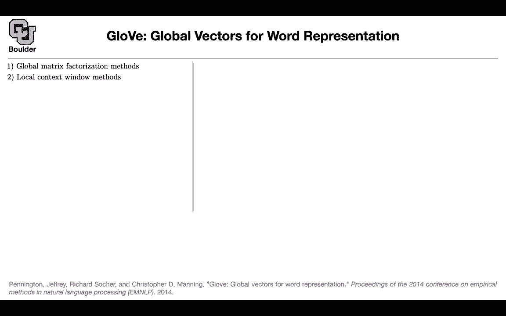
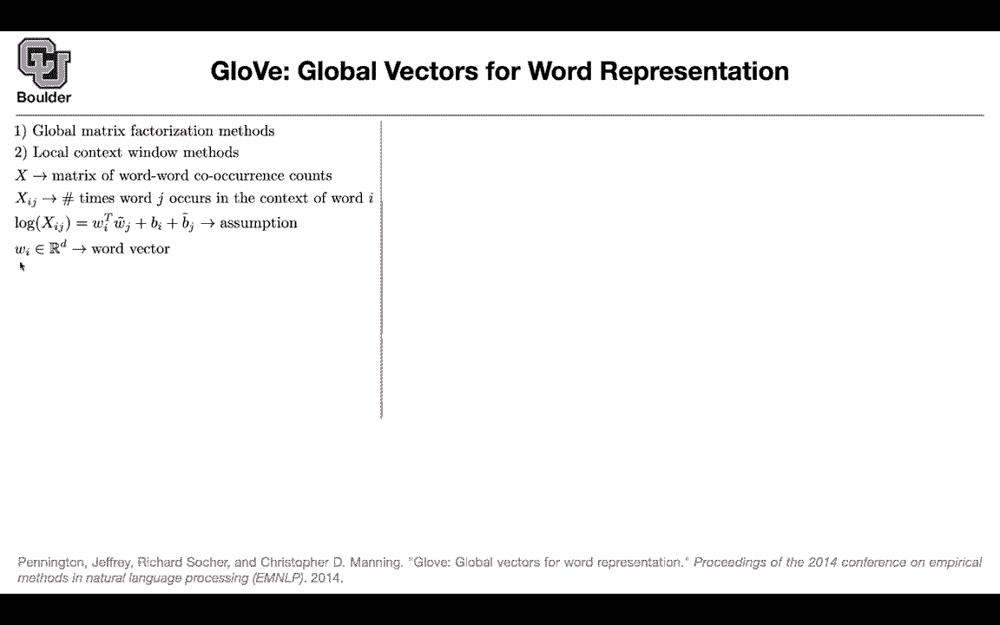
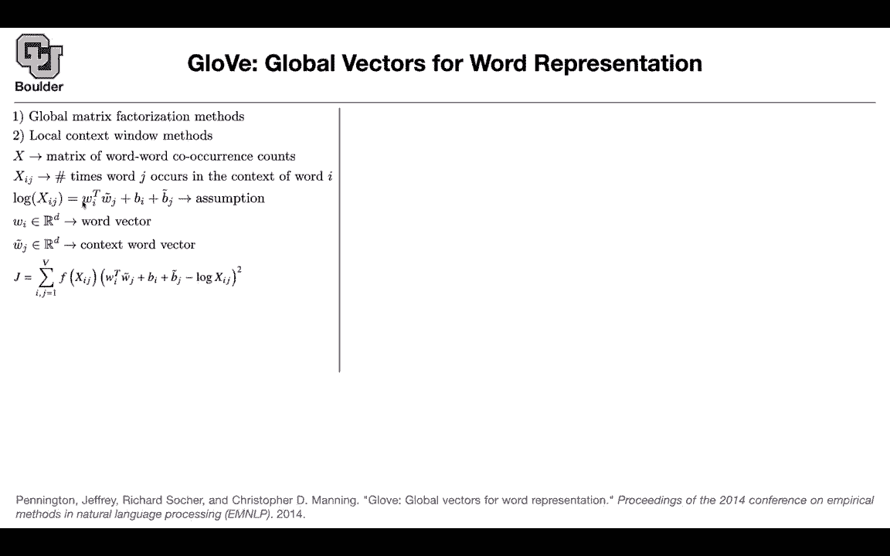
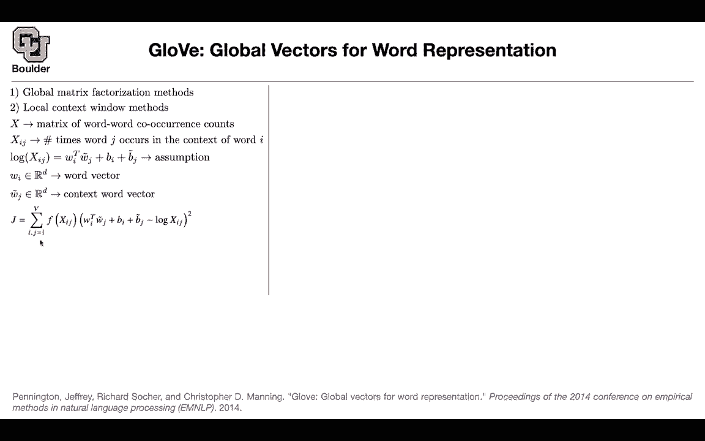
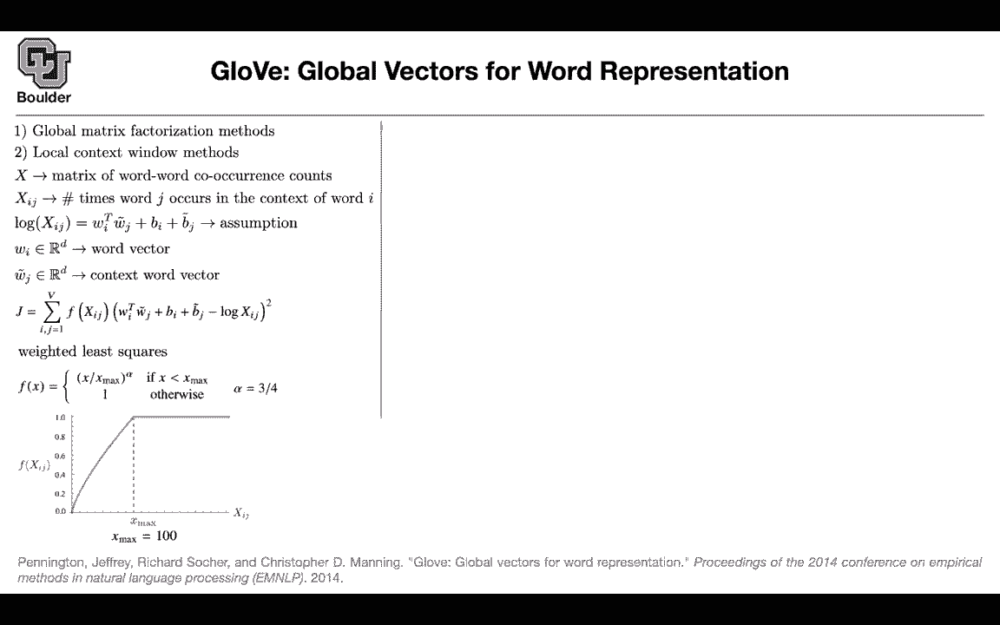
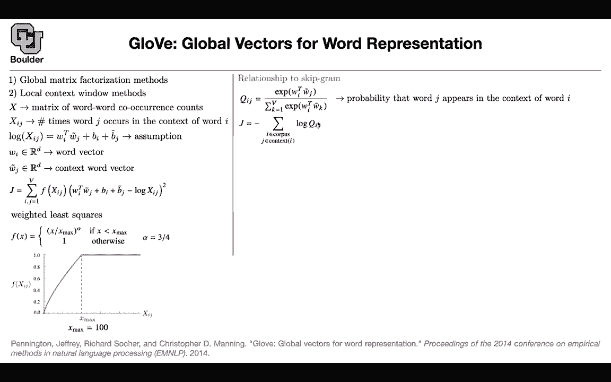
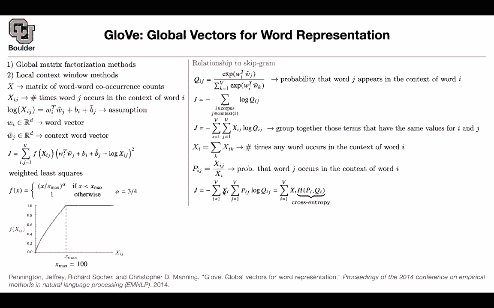
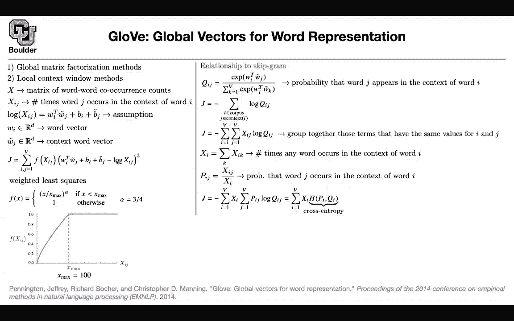
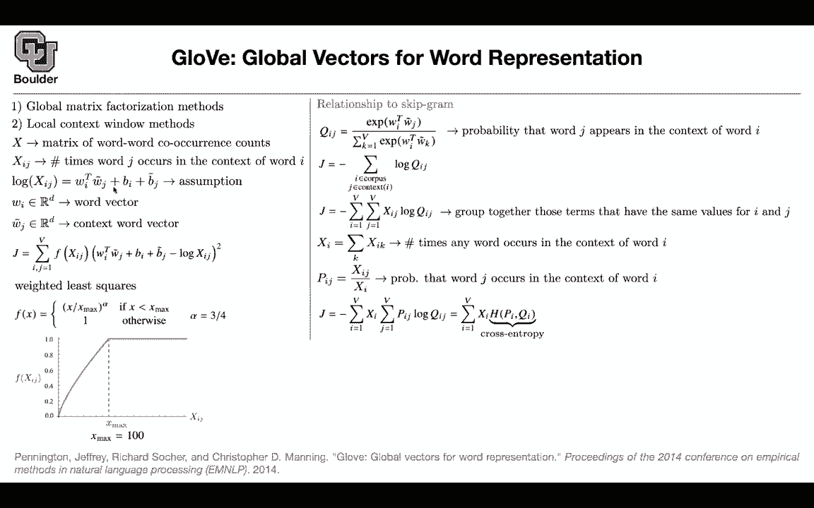

# P99：L46.2- GloVe - ShowMeAI - BV1Dg411F71G

There is another way。 There is a competitor and that's G。 The first one was word wait。

 The competitor is G。 The idea behind G is very simple and you're gonna to see it its extremely simple。

 You're going to do minus squared error as simple as that。

 but then it is really powerful and let's go through it。

 the idea is that you want to combine global matrix factorization methods and local context window methods。

 So what we just saw with continuous bag of words with the skipgram。

 they are local context window methods So you give it a local context and then it's going to do its operations on it and then you can have a global matrix factorization。

 What is that you're going to create a matrix of words that are appearing in each other's context。

 So the rows are going to be words the columns of your matrix are going be words。

 and there you're just going count the number of times that these two。

Words are appearing next to each other in your corpus and that's going to give you a global matrix。

 and this is exactly what I just explained。 You create x。 it's a matrix of word word coance counts。

 how many times did G coaccured with global in your corpus How many times global coaccurd with glove etc。

 and you are going to keep counting So it's a statistical methods you' are just counting。

 It's nothing complicated， and then we're going to create x。

 So X Ij is the number of times that word J is occurring in the context of word I we are going to take a log of X Ij and we are gonna parameterize that So log of Xj we are gonna parameterize it we are going say this an assumption that you are making for your model and then this assumption is gonna to make sense as I go more into details So you have vector wi for input vector you can have。

WJ for the output vector you multiply them together that's going to give you a single number and then you add two other numbers to it B I and Bj so by global there is a question with what does factorization mean factorization means what we are exactly doing here so your' factorizing it in terms of vectors that's what factorization means and global means that you are computing your global statistics and putting it in a matrix。

And by co occurrenceance， we mean it has to be in the context So it's gonna to look again in a window。

 for instance， global is in the context of glove vector it could be in the context of glove and then maybe from this point on they are not in the context So you're gonna choose a number it's similar to what we saw with so does the matrix value depend on the context length exactly yes。

 it depends on the context length and the question is with the skip gram a word has the same vector always with continuous bag of words the word vector changes No。

 that's not correct for both of them each word for both skip gram and continuous bag of words the word vector you're gonna have。

One word vector per each word。

Okay now we are going to represent log of X Ij with the vector with the dot product of two vectors and then we are going to add two biases and exactly w Is are going to be our word vectors so these are going to be our word vectors and W J tilde is the context word vectors so we are just naming these this is our word vector this is our context word vector Now what you're going to do the last function that you're going to write for glove is very simple you want this identity to hold so you say w I transpose w tilde j plus pi plus B tilde j minus log of Xj So these are the righthand side minus the lefthand side squared they have to be close so you want to minimize the penalty the difference between these two and then at the same time you are putting some weight so it's going to be a weighted regression you are putting some weights on the import。

of every two words and I'm going to tell you why you're doing this and what type of f you're going to choose but then you're going to do a summation over all of the words in your vector so you're going to have two four loops for I and J and you're going to go from1 to capital V and capital v is the size of your vocabulary and this is a weighted least square this is the weight that you're going to choose do remember in a skipgram model we had to take care of the more frequent words in our dictionary and down weight them because usually when you do the histogram of your words they're going to have a fat tail so there are some very important words that are not that much frequent and if you don't do this weighting you're never going to see those words in your algorithm you're going to rarely see them during training and then you're not doing your method is not going to be able to。

Asociate meaning to those words， So yeah that's a problem。

 It's a power law distribution that the words in your vocabulary are going to follow。

 they're going to be fat。

And this is the type of weight that you're going to use how does it look like if two words appear in each other's context a lot you're going to ignore that so you're going to cap it because if it is very frequent you already learned it you saw it a lot of times during your training so you're down weighting that and there is going to be an x max and the maximum is a hyperparameter that you choose and this is basically your weighting function that you're going to use and you're associating more weight it's better than the linear relationship here you're associating more weight to your less frequent word and this alpha surprising turns out to be the same number that we chose here as well it's surprising that this is happening but both of the methods are using the same number and that's giving them the best word vectors I that power of three quarterss theoretically inspired or just through experimentation。

Through experimentation， trial and error。 So a lot of you learning is trial and error。

Okay。And then even these 100 is trial and error and they are going to use it using their validation data they look at the performance of their word vectors under validation and then they're going to choose these two numbers No there is no theory behind it How does it relate to a escapegram that's a great question to answer How does it relate to a escapegram model for the Sgram model we had this Qij which was the softmax the exponential of Wi transpose Wj tilde and then you had the softmax and that so this you remember that's the way that you modeled your probability So now for now let's call it QIJ Now the objective function for Sgram was that you wanted to maximize the log of these probabilities and this also you remember this is the first line of the loss function that I wrote down Now youre just replacing that with QIJ I is in your corpus。

It's a word in your corpus and J is gonna to change in the context and this minus sign is because in machine learning we like to minimize。

 So it's exactly the same objective function。 Now we are going to go ahead and group things together because if you look here in this loss function here。

 we have a summation over I and J。 and now we want to have a similar formulation to our loss function。

 we are going to say if we group things together， we can start using this global matrix matrix of word word cocurance counts。

 This log of Q Ij is the same as above。 This is all of the words and we are just grouping together the number of times that two words that are appearing in the same context it's gonna increase this value。

 it's no one， it would be 2，3，4，5 up until 100 or even further it's exactly the same loss but now you're using this global matrix。

 It's a matrix of counting word co。

Rather than doing summation over your corpus and the context， you can do this。

 It's just a reformulation of your loss。 and X。 if you do a summation over k is the number of times that any word occurs in the context of I what we are going do。

 we are going to create pij， which is X divided by X。 So now it's the relatively important。

 and you can call this the probability that word J is occurring in the context of word I。

 So now you're turning your counts into probabilities。 Now let's rewrite this last function again。

 we are going to take X out， this pij has X in it。 So if you have X times X is's going to give you X。

 basically X times pi is going to give you X。 So it's exactly this formula above。

 But now the cool thing is that you can take X out and represent this with your probabilities。

 Now this term here， is the definition of。

Crossenttropy， so you have two distributions， P and QI and you're computing the crossantropy between that and the cross entropy。

 you can think of it as a way of measuring the distance between two distribution。

 So now you're measuring the distance between Q and P。

 And then this X here is just a weight that you're using。

 So now you're starting to see the similarity。 There is a weighting here。 There is a weighting here。

 This is weighted crossantropy。 This is weighted least squares。

 and there is nothing special about crossantropy。 You can replace that with minus squared error。

 So that's the idea。 that's how they are similar。 Theyre not equivalent but they are similar rather than using the minus squared error as your distance you're using the crossantropy。

 Any questions。 You have a question。 I'm trying to understanding tuition behind using subtracting the log of X in J。

I get that Wi times Wj will give you since it's a dot product a high value will give you how similar the words are and I get that you had the bes but what's the intuition behind subtracting a log of some frequency value can you point me to your question is it here Yeah so it's left yeah so J Yeah so here a little lower J equals the idea so what's the intuition behind subtracting log of Xj Oh so we are going make an assumption we are going to represent log of Xj by Wi transpose Wj and these are the parameters of our model Okay now if this is your assumption if this is your model then the intuition for this is clear because you are taking this term subtracting from it the log of Xj and then you want this to be as close as possible to each other it's not going become equality but。

I become very close so that's the intuition the intuition is coming from the assumption that you' are making see these are the same terms WI transpose Wj it's here B is here Bj is here and then minus log of Xj is here Okay so you just assume that the log of X Ij which is the log of how many times a word appeared with another word is how similar they are Yes and the cool thing is that these numbers are from negative infinity to positive infinity and the log is gonna turn counts which are positive numbers to have values from negative infinity to positive infinity Okay sorry go ahead。

Or equivalently you could have said X Ij is equal to exponential of this because you want your counts to be positive。

 your counts cannot be negative and that's the tuition behind log。

 take what's the question I was gonna ask if there is an intuition behind this assumption like this form with these like two biases in these two W vectors I that just it turns out that you could have gotten away without these biases but their existence is giving you your model more flexibility these are just more parameters that are helping your model So you could just add on more and more parameters which would like theoretically give your model not really usually in neural networks in linear regression let's forget about neural networks even for linear regression you have the weight times your input plus a bias and that bias is sort of acting as the mean of these log values So you're sort of subtracting the mean okay。

Okay， any other questions and this is a symmetric relationship If you look at it from the I perspective。

 you have W I P and if you look at it from the J perspective。

 you have B tilda J and W tilda J So it's a symmetric representation and your matrices are symmetric the number of times that this guy is appearing in global context is equivalent to the number of times that G is appearing in global or global in glove So this Bj tilda is for you to be symmetric and then the bias is to take care of the mean of your distribution Any other questions I there a reason why we're trying to we're trying to estimate the log of Xj with this this linear model is there a reason we're trying to do that instead of just X with log Well yes。

 this is exactly what I just said if you do Xj without a log then the。

Value on the left is always positive。 It's a count。 It's 1，2，3，4，5，0。 It's always positive。

 but the value on the right is going to become negative and sometimes positive。

So whenever you want to turn and value that goes from negative infinity to positive infinmity to be positive if you take an exponential。

 it's a trick in deep learning you're going to use it a lot any other questions。

So the only reason we use log is to fix the light side to be positive Yes exactly okay and let's see the performance for semantic and syntactic and total and compare them to continuous bag of words and skipgramm and these are the performance for semantic G is doing the best for syntactic still continuous bag of words is the best and total G is doing the best so there seems to be a tradeoff between these algorithms it's not like one is better than the other maybe for some of your downstream tasks having a good meaning in your words is very important to you so you're gonna to use glove or skipgram or maybe it's very important for your algorithm to be able to get the syntax is correct maybe one application is autocor when you're typing emails or in word okay for those types of applications maybe syntax is more important than semantic。

So usually a good paper is gonna study the details of the algorithm so they're going to change one thing。

 two things， three things and then try to study what happens if I change that what happens if I don't do that So these are called appellationation studies So a good paper should do that all the time and this is a good paper one question is what vector dimension should I use what should be the dimension D of my vectors you can keep studying it dimension1 upon the 100200 300 etc and then the performance is gonna plateau at some point overall the red one and then the syntax semantic is always better than syntactic as you increase a dimension and the accuracy is going up and up and at some point you're gonna to saturate so there is no point increasing your dimension perhaps beyond 600 for setic context you can have either。

symmetric context or asymmetric context for symmetric context。

 you' are looking at the words to the left and to the right and for assymmetric you are always looking at the words to the right。

 for instance those are your context and now you are studying the window size so as you change your window size you're getting better at semantic compare to syntactic and for assymmetric context is the same pattern but then you're pushing it to the right a little bit how does the training time compare to continuous bag of words and skipgram here you're comparing glove to continuous bag of words and then the training time is in terms of hours the more you let your glove model to train the better accuracy you're gonna get similarly for versus skipgram the more you let it train the better it's getting this figure is saying that if you train it for six hours then the word vectors。

You're getting out of glove is better than continuous lack of words I think we are over time for those of you who want to leave we can leave for those of you who want to stay and ask more questions I'll be around question in regards to the relationship to skipca so I'm just trying to understand the concept so Q is is it a softm softmax Yes so this is softm and then J is basically G the loss function that we're trying to reduce Yes j is your last function and then what do we do from then。

From here onwards。From this line to this line rather than doing your summation over your corpus and your context。

 you're going to group things together wherever you' are doing multiple computations you're going to group them together because it's going to be the same value but then you're doing it multiple times and then you can group them together by this count matrix if you're repeating this log of QIJ and then you're summing it summing over it multiple times you can compute it only once and then multiply it by the number of times that you did that operation that makes sense and then then what do we do。

And then you turn these XIjs to probabilities because in the end we wanted to come up with the crossantropy between cues because cues are probabilities Xjs are not we can turn them into probabilities by dividing by the total number of times that any word is appearing in the context okay and that shows us how similar skipgramm is to glove Yes so it shows us that even for glove you have a weight but then this weight we were choosing it smartly if you remember we were getting rid of some of our words on the fly so this is not a linear weighting even for glove it's gonna even for continuous bag of words and skip gram your weighting is gonna to look something like this in practice。

 but now this is your weight mathematically that's your weight so there is an analogy there this is a distance measure this is another distance measure rather than using crossanthtropy you could use that。

Okay， I think I get it perfect。 Any other questions。

 I had a quick question So in this method instead of instead of like looking at either the context only or like a single word only we're sort of doing both simultaneously I that correct Yes。

 so that's correct So you're gonna to create a matrix that is summarizing your entire data set you don't go word by word you create a matrix and then you just do count how many times in my entire corpus。

 the word vector appeared in the context of global this is x this is your word I。

 this is word J and then you just count it this is one time then maybe in another sentence they are appearing in the same context then you did counting and then in a mini batch here would just be like a fraction of V of your total vocabulary So yeah for mini batching you're gonna sample from this matrix X Okay so youre。

sample a bunch of input words， a bunch of output words。

 and then you just sum over them and try to minimize that。 So yes， you can do minibaing on this。

 Okay what is D again， it's the word vector， but for some reason I thought that the word vector is relating to how many vocabulary words you have So no this you mean this dimension。

 Yes yeah， I was thinking about that as the one hot vector。 if you have 100 words。

 you're gonna have 100 dimensions for some reason this is actually the projection。

 so it's a protection。 So that's the lower dimensionality after the one hot vector Yes。

 so this is the lower dimension。 Okay this can take values in its entries。

 it doesn't have to be either0 or one， it could be any number from negative infinity Yeah。

 that makes sense because it's just a lower dimensional vector of the one hot encoding。

 and these are the parameters of your model W W the Ij cool thanks a lot。Yes。

 any other questions I have a question Sure in the graph of accuracy versus training time the X axis shows iterations over the glove model and I was just wondering what part of the model is actually changing over each iteration over each iteration your the model doesn't change but these parameters get updated Okay。

 the more you let train it's getting better actually thank you Sure thank you Yeah， you're welcome。

