# P10：L8.2- 自注意力机制 (Self-attention) 2 - ShowMeAI - BV1fM4y137M4

那這個self-attention，我們上週已經跟大家操作過，怎麼根據input sequence，得到其中一個output，self-attention要做的事情，就是給一排input的vector。

得到另外一排output的vector，那我們上週已經操作過說，其實上上週啦，上上週已經操作過說，怎麼根據input的這一排vector sequence，得到B1，好那我們就停在這邊。

如果上上週的東西，你沒有聽到的話，那剛剛好我們來講一下，怎麼從這一排vector得到B2，其實從這一排vector得到B1，跟從這一排vector得到B2，它的操作是一模一樣的，所以我們再講一次。

怎麼從input的vector得到B2，等於是幫大家複習，上上週說過的東西，那這邊要強調一點是，這邊的B1到B4，他們並不需要依序產生，必須要算完B1再算B2，再算B3再算B4，B1到B4。

他們是一次同時被計算出來的，好那怎麼計算這個B2呢，那我們現在的主角呢，就變成A2，A2會乘上一個transform，就你把A2乘上一個matrix，變成Q2，然後接下來呢，你會根據Q2。

去對A1到A4這四個位置，都去計算attention的score，那怎麼計算attention的score呢，你就把Q2跟K1，做個這個double order。

你把Q2跟K2也做個double order，你把Q2跟K3也做double order，你把Q2跟K4也做double order，得到四個分數，你得到這四個分數以後。

你可能還會做一個normalization，比如說solvemax，然後得到最後的attention的score，那我們這邊呢，用alpha prime來表示。

經過normalization以後的attention score，好那得到這個attention的分數以後，得到這個alpha21，alpha22，alpha23，alpha24這四個數值以後。

接下來我們拿這四個數值來做什麼呢，我們把這些數值，分別乘上V1，V2，V3，V4，把alpha21乘上V1，把alpha22乘上V2，把alpha23乘上V3，把alpha24乘上V4。

然後全部加起來就是V2，或者是我們把V2的式子列在這邊，V2是怎麼來的呢，V2就是把V1到V4，把V1乘上alpha，這邊每一個V1到V4，都有一個對應的alpha，alpha21到alpha24。

把每個V1都乘上alpha，全部再加起來就得到V2，所以我們這邊就再跟大家操作了一下，V2是怎麼被計算出來的，同理呢，你就可以由A3乘一個transform得到Q3，然後就計算V3。

從A4乘一個transform得到Q4，就計算V4，所以現在你就知道說，怎麼從A1到A4計算出V1到V4，好那剛才講的是，是這個self-attention運作的過程，那接下來呢，我們從舉證懲罰的角度。

再重新講一次，我們剛才講的self-attention，是怎麼運作的，好那self-attention是怎麼運作的呢，我們現在已經知道說，A1到A4，他們每一個A，都要分別產生QKB。

所以A1要產生Q1 K1 V1，A2要產生Q2 K2 V2，以此類推，每一個A都產生QKB，如果要用舉證運算，表示這個操作的話，是什麼樣子呢，我們每一個A AI都乘上Q這個，都乘上一個舉證。

我們這邊用WQ來表示他得到QI，每一個A都要乘上WQ得到QI，那這些不同的A，你可以把他合起來，當作一個舉證來看待，什麼意思呢，A1乘上WQ得到Q1，A2乘上WQ得到Q2。

一樣A3 A4也都乘上WQ得到Q3 Q4，那你可以把A1到A4拼起來，看作是一個舉證，這個舉證我們用I來表示，這邊這個I這個大寫的字母I，他代表的是一個舉證，那這個舉證有四個column。

他的column就是A1到A4，那I乘上WQ就得到另外一個舉證，我們用大Q來表示他，這個大Q就是Q1到Q4，你把Q1到Q4這四個factor拼起來，就是大Q的四個column，所以我們從A1到A4。

得到Q1到Q4這件事情，這個操作其實就是把一個叫做I的舉證，I這個舉證他裡面的column，就是我們SELF ATTENTION的INPUT，A1到A4把I這個舉證，乘上另外一個舉證WQ。

那WQ其實是NAML的參數，他是等一下會被認出來的，把I乘上WQ得到大Q，這個大Q的四個column就是Q1到Q4，那接下來怎麼產生K跟V呢，他的操作跟Q是一模一樣的，我們就不要再細講。

免得你覺得很無聊，所以A乘上WK就會得到這個K這個factor，那我們把這個INPUT的四個factor，A1到A4拼起來，當作是一個舉證叫做I，把I乘上一個舉證WK，WK就得到另外一個舉證大K。

大K的四個column就是這四個key，K1到K4，那同理V呢也是一模一樣的操作，我們已經知道說AI乘上WV會得到VI，也就是說把A1到A4拼起來得到I，I乘上舉證WV會得到V這個舉證。

V的舉證四個column，就是這邊四個代表value的factor，所以每一個A怎麼得到QKV呢，其實就是把輸入的這個factor sequence，乘上三個不同的舉證，你就得到了Q得到了K跟得到了V。

這個是怎麼從A得到QKV，那接下來呢，我們說下一步是什麼，下一步是每一個Q都會去跟每一個K，去計算inner product去得到attention的分數，那得到attention分數這件事情。

如果從舉證操作的角度來看，他在做什麼樣的事情呢，你就是把Q1跟K1做inner product，得到α11，所以α11就是Q1跟K1的inner product，那這邊呢我就把這個K1。

他背後的這個向量，把他畫這個倒下來的啦，把他畫成比較寬一點，代表說他是transpose，希望你可以了解我的意思，所以Q1乘上K1的transpose，也就是Q1跟K1做inner product。

得到α11，同理α12就是Q1跟K2做inner product，α13就是Q1跟K3做inner product，α14就是Q1跟K4做inner product，那這個四個步驟的操作。

你其實可以把他拼起來，看作是，看作是舉證跟向量相乘，什麼意思，這邊Q1乘K1，Q1乘K2，Q1乘K3，Q1乘K4，這四個動作，你可以看作是我們把K1到K4拼起來，當作是一個舉證的四個row。

那把這個舉證呢，乘上Q1得到另外一個向量，你把Q1乘上由K所組成的這個舉證，就得到另外一個向量，這個向量裡面的值，就是Attention的score，α11到α14，所以你把Q1乘上這個舉證。

你就得到α11到α14，好那我們剛才有講過說呢，我們不只是Q1要對K1到K4計算Attention，Q2也要對K1到K4計算Attention，那怎麼把Q2對K1到K4計算Attention呢。

你就把Q2呢，放在這邊，本來是只有Q1要乘上K1到K4，我們現在把Q2也乘上K1到K4，得到α21到α24，那怎麼拿Q3去做Attention，怎麼拿Q4去做Attention呢。

我們現在的操作是一模一樣的，你就把Q3乘上K1到K4得到Attention，你把Q4乘上K1到K4得到Attention的分數，所以這些Attention的分數是怎麼來的，你可以看作是兩個舉證的相乘。

一個舉證它的row就是K K1到K4，另外一個舉證它的column就是Q，就是Q1到Q4，乘上K所形成的舉證乘上Q所形成的舉證，就得到這些Attention的分數，所以這邊就寫說。

K的transpose，我們假設這個K它的column呢，就是K1到K4，所以在這邊相乘的時候呢，我們要對大K這個舉證做一下transpose，K的transpose乘上Q就得到一個舉證，叫做A。

那A裡面存的就是Q跟這個K之間的Attention的分數，那麼說我們會對Attention的分數呢，做一下normalization，比如說你會做softmax，你會對這邊的每一個column。

每一個column做softmax，讓每一個column裡面的值呢，相加是1，那我們之前有講過說，其實這邊做softmax不是唯一的選項，你完全可以選擇其他的操作，比如說redo之類的。

那其實得到的結果也不會比較差，反正我們這邊呢，就是把A呢，通過了softmax以後，他得到的值有點不一樣啦，所以我們用A'來表示，通過softmax以後的結果，好那接下來呢，我們已經計算出A'以後。

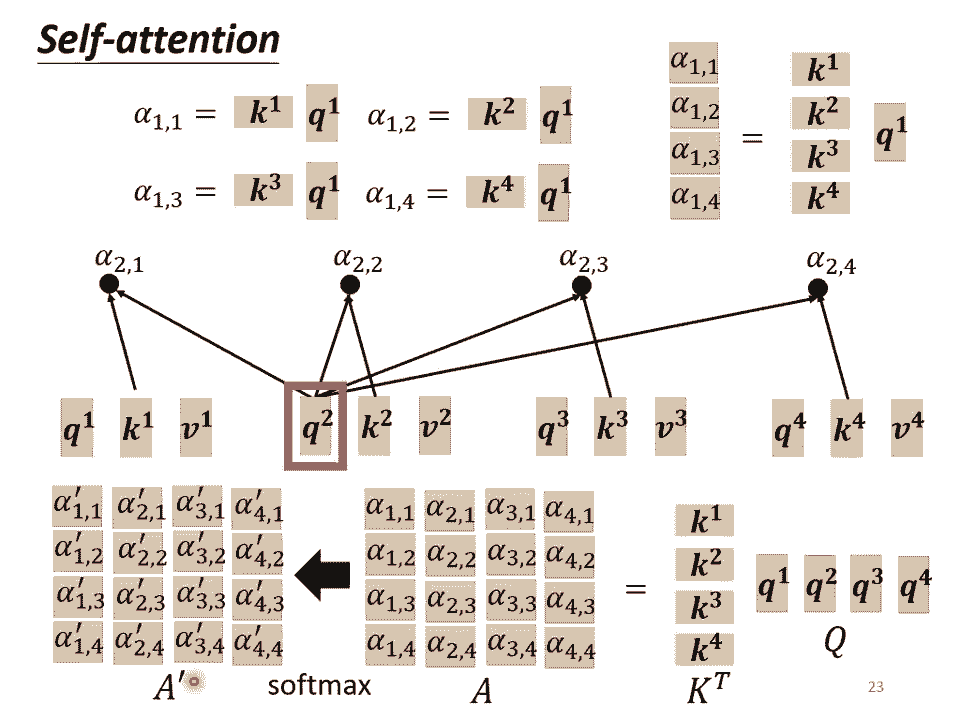

接下來呢，接下來下一個步驟，我發現我這個投影片上有一個小小的bug，這個bug是什麼呢，這個bug呢，就是這邊應該是'而不是head，這邊應該是'而不是head，本來最早是寫成head啦。

那我現在把它改成'，讓這個地方沒有改過來，好那我們把這個V啊，V1到V4啊，乘上這邊的alpha以後，就可以得到B，得到B，那這個B呢，是怎麼被計算出來的呢，你就把V1到V4拼起來，你把V1到V4。

當成是V這個矩陣的四個column，把它拼起來，然後接下來呢，你把V乘上A'的第一個column以後，你得到的結果呢，就是B1，如果你熟悉線性代數的話，你知道說，把這個A'乘上V。

這個你就是把A'的第一個column，乘上V這一個矩陣，你會得到你output矩陣的第一個column，而把A的第一個column乘上V這個矩陣做的事情，其實就是把V這個矩陣裡面的每一個column。

根據A'這個矩陣裡面的，每一個column裡面的每一個element，做weighted上就得到B1，那就是這邊的操作，把V1乘上weight，把V2乘上weight，把V3乘上weight。

把V4乘上weight，全部加起來得到B1，如果你用矩陣操作的角度來看它，就是把A'的第一個column，乘上V就得到B1，然後接下來呢，就是以此類推啦，接下來就不需要再跟你詳加說明。

免得你覺得這一段非常的肉，就是以此類推，把A'的第二個column乘上V，就得到B2，A'的第三個column乘上V就得到B3，A'的最後一個column乘上V，就得到B4。

所以我們等於就是把A'這個矩陣，乘上V這個矩陣，得到O這個矩陣，O這個矩陣裡面的每一個column，就是self-attention的輸出，也就是B1到B4，所以其實整個self-attention。

我們在講操作的時候，我們在最開始的時候跟你講的時候，我們講說我們先產生了QKB，然後再根據這個Q去找出相關的位置，然後再對V做weighted sum，其實這一串操作，就是一連串矩陣的乘法而已。

怎麼說呢，我們再複習一下，我們剛才看到的矩陣乘法，I是什麼，I是我們的input，是self-attention的input，是一串的vector，是一排的vector，這排vector拼起來。

當作矩陣的column，就是I，所以I是self-attention的input，那這個input分別乘上三個矩陣，WQ WK跟WV，得到大Q大K大V這三個矩陣，接下來呢。

大Q乘上K的transpose，QKB都算出來了嘛，你把Q乘上K的transpose，得到A這個矩陣，A的矩陣，你可能會做一些處理，得到A'，那有時候我們會把這個A'呢。

叫做attention的matrix，然後接下來呢，你把A'再乘上V，就得到O，O就是self-attention這個layer的輸出，所以self-attention，輸入是I，輸出是O。

那你會發現說，雖然self-attention這邊，做了一個很複雜的操作，但是其實啊，self-attentionlayer裡面，唯一需要學的參數，就只有WQ WK跟WV而已。

只有WQ WK WV是未知的，是需要透過我們的訓練資料，把它找出來的，所以WQ WK WV是未知的，是需要被找出來的，但是其他的操作，都沒有未知的參數，都是我們人為設定好的。

都不需要透過training data找出來，只有WQ WK WV，是透過training data找出來的，好那這整個就是self-attention的操作。

從I到O就是做了self-attention。

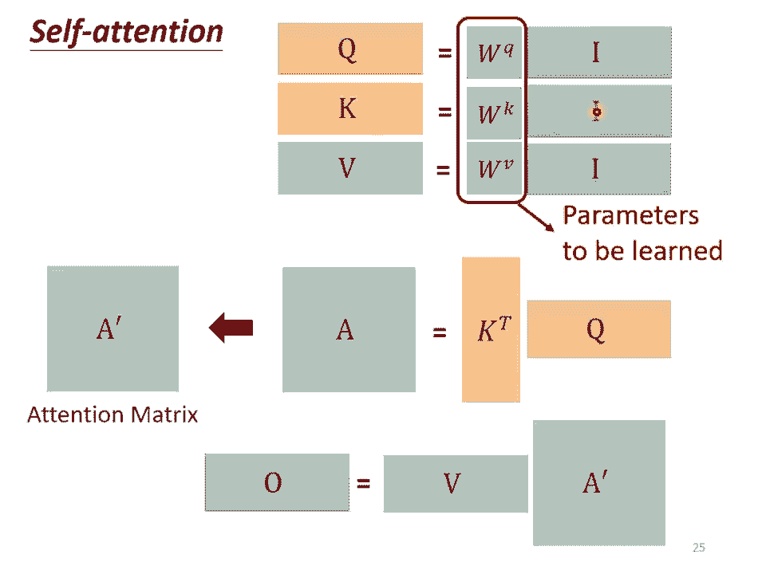

而在self-attention呢，有一個進階的版本，叫做Multi-head self-attention，那Multi-head self-attention呢，其實今天的使用是非常的廣泛的。

那在作業4裡面呢，助教原來的code是有Multi-head self-attention，它的head的數目是設成2，那剛才助教給你提示說，把head的數目少一點改成1。

其實就可以過median的baseline，但並不代表所有的任務，都適合用比較少的head，有一些任務比如說翻譯，比如說語音辨識，其實用比較多的head，你反而可以得到比較好的結果。

那至於需要用多少的head，這個又是另外一個hyperparameter，也是你需要調的，那為什麼我們會需要比較多的head呢，你可以想成說相關這件事情。

我們說我們在做self-attention的時候，我們就是用Q去找相關的K，但是相關這件事情，有很多種不同的形式，有很多種不同的定義，所以也許我們不能只有一個Q，我們應該要有多個Q，不同的Q負責不同的。

不同種類的相關性，所以假設你要做multi-head self-attention的話，你會怎麼操作呢，你可能會這麼操作，你先把A乘上一個矩陣得到Q，接下來你再把Q乘上另外兩個矩陣，分別得到Q1跟Q2。

那這邊還有，這邊是用兩個上標，I代表的是位置，然後這個1跟2代表是，這個位置的第幾個Q，所以這邊有QI1跟QI2，代表說我們有兩個head，我們認為這個問題，裡面有兩種不同的相關性。

所以我們需要產生兩種不同的head，來找兩種不同的相關性，那既然Q有兩個，那K也就要有兩個，那B也就要有兩個，那怎麼從Q得到Q1Q2，怎麼從K得到K1K2，怎麼從B得到B1B2，那其實就是把Q把K把B。

分別乘上兩個矩陣，兩個矩陣兩個矩陣，得到不同的head，就這樣子而已，那所以對另外一個位置，也做一樣的事情，另外一個位置AJ輸入以後，他也會得到兩個Q兩個K兩個B。

那接下來怎麼做self-attention呢，跟我們之前講的操作是一模一樣的，只是現在呢，一那一類的一起做，二那一類的一起做，也就是這個Q1，他在算這個attention的分數的時候。

他就不要管那個K2了，不要管K2，他就只管K1就好，只管K1就好，所以QI1就跟KI1算個attention，QI1就跟KJ1算個attention，也就是算這個double。

然後得到這個attention的分數，然後今天在做weighted上的時候，也不要管V2了，也不要管V2了，看VI1跟VJ1就好，所以你把attention的分數乘VI1。

把attention的分數乘VJ1，然後接下來就得到VI1，那得到VI1以後呢，這邊只用了其中一個head，那你會用另外一個head，也做一模一樣的事情，所以Q2只對K2做attention。

Q2只對K2做attention，他們在算weighted上的時候，只對V2做weighted上，然後接下來呢，你就得到BI2，如果你有多個head，有8個head有16個head，那也是一樣的操作。

那這邊呢，是用兩個head來當作例子，來給你看看有兩個head的時候，是怎麼操作的，現在得到BI1跟BI2，然後接下來呢，你可能會把BI1跟BI2把他接起來，然後再通過一個transform。

也就是再乘上一個矩陣，然後得到BI，然後再送到下一層去，那這個呢，就是Multi-head attention，一個這個self-attention的變形，好那講到目前為止啊，你會發現說。

self-attention的這個layer，他少了一個，也許很重要的資訊，這個資訊是什麼呢，這個資訊是weighted的資訊，你想想看，對一個self-attention而言。

對一個self-attention layer而言，每一個input，他是出現在sequence的最前面，還是最後面，他是完全沒有這個資訊的，對不對，你可能會說。

剛才不是說input就是有位置1234嗎，但是那個1234，是我們畫在投影片上的時候，為了幫助大家理解所標上的一個編號，你想想看對self-attention而言，那個位置1跟位置2。

跟位置3跟位置4有任何差別嗎，完全沒有任何差別對不對，這四個位置的操作，其實是一模一樣的，對他來說，Q1到跟Q4的距離，並沒有特別遠，1跟4的距離並沒有特別遠，2跟3的距離也沒有特別近。

對他來說就是天涯落壁林，所有的位置之間的距離都是一樣的，沒有任何一個位置距離比較遠，也沒有任何位置距離比較近，也沒有誰在整個sequence的最前面，也沒有誰在整個sequence的最後面。

但是這樣子設計可能會有一些問題，因為有時候位置的資訊也許很重要啊，舉例來說我們在做這個POS tagging，就是詞性標記的時候，也許你知道說動詞比較不容易出現在句首，所以如果我們知道說。

某一個詞彙他是放在句首的，那他是動詞的可能性可能就比較低，會不會這樣子的位置的資訊往往也是有用的啊，可是在我們到目前為止講的，self-attention的操作裡面，他根本就沒有位置的資訊。

所以怎麼辦呢，所以你做self-attention的時候，如果你覺得位置的資訊是一個重要的事情，那你可以把位置的資訊把它塞進去，怎麼把位置的資訊塞進去呢，這邊就要用到一個叫做。

Positional encoding的技術，這個技術是這樣子的，你為每一個位置設定一個vector，叫做Positional vector，這邊用1i來表示，上標i代表的是位置。

每一個不同的位置就有不同的vector，就是1 1是一個vector，1 2是一個vector，1 2 8是一個vector，不同的位置都有一個他專屬的1，然後把這個1加到ai上面，就結束了，就結束了。

你等於就是告訴你的self-attention，位置的資訊，如果他看到說ai好像有被加上1i，他就知道說現在出現的位置。

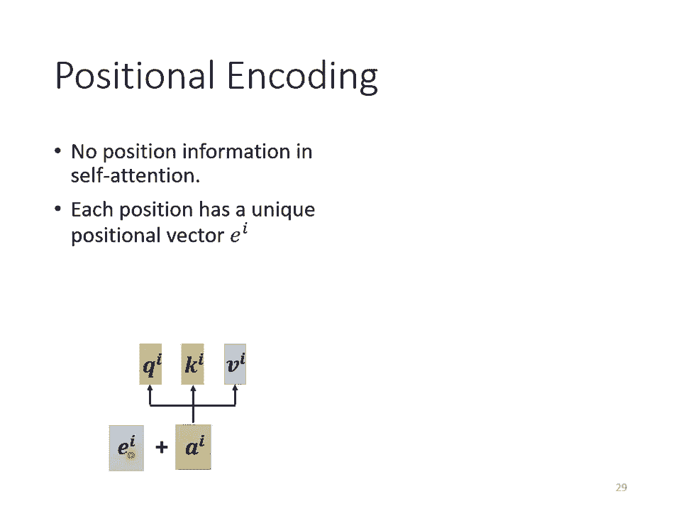

應該是在i這個位置，那這個1i長什麼樣子呢，最早的這個transformer，叫做attention is all unique那篇paper裡面，他用的1i長的是這個樣子的，這邊這個圖上面呢。

每一個column就代表一個1，第一個位置就是1 1，第二個位置就是1 2，第三個位置就是1 3，以此類推，所以他就是把這邊這個向量，放在第一個位置，把這個向量加到第二個位置的a上。

把這個向量加到第三個位置的a上，以此類推，每一個位置都有一個專屬的1，希望透過給每一個位置不同的1，你的model在處理這個input的時候，他可以知道現在的input，他的位置的資訊是什麼樣子。

那這樣子的positional vector，他是handcrafted的，也就是他是人設的，那人設的這個vector有很多問題啊，就假設我現在在定這個vector的時候，只定到128。

那我現在sequence的長度如果是129怎麼辦呢，不過今天在最早的那個，attention is all unique paper裡面，比較沒有這個問題啦，他這個vector是透過某一個規則所產生的。

透過一個很神奇的，sin cos 的function所產生的，那當然你又會有新的問題，為什麼是sin跟cos呢，為什麼不是別的東西呢，為什麼一定要這樣產生。

handcrafted的這個positional vector呢，其實你不一定要這麼產生，這個positional encoding，仍然是一個上代研究的問題，你可以創造自己新的方法。

或甚至positional encoding，是可以根據資料學出來的。

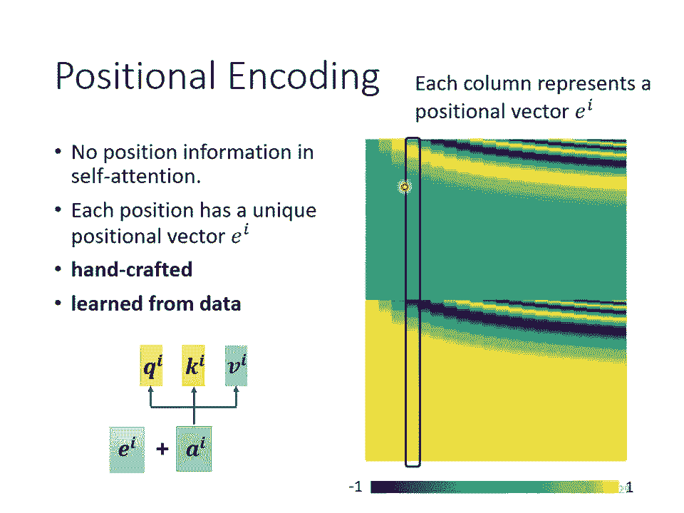

好 那有關positional encoding呢，你可以再參考一下文獻，這個是一個上代研究的問題，比如說我這邊引用了一篇，這個是去年放在archive上的論文，所以你可以想見，這其實都是很新的論文。

裡面就是比較了跟提出了新的positional encoding，比如說這個是最早的positional encoding，它是用一個神奇的sin function所產生的。

那如果你的positional encoding，你把positional encoding裡面的數值，當作network參數的一部分，直接認出來，看起來是這個樣子的，這個圖是橫著看的。

它是每一個row代表一個position，所以這個是最原始的，用sin function產生的，這個是認出來的，它裡面又有神奇的做法，比如說這個是用RNN生出來的。

positional encoding是用RNN生出來的，這篇paper提出來的叫做floater，是用一個神奇的network生出來的，總之你有各式各樣不同的方法。

來產生positional encoding，那目前我們還不知道哪一種方法最好，這是一個上代研究中的問題，所以你不用糾結說，為什麼sinusoidal最好，你永遠可以提出新的做法。

好 那這個self-attention當然是用得很廣啦，我們已經提過很多次transformer這個東西，那我們大家也都知道說，在NLP的領域有一個東西叫做BERT。

BERT裡面也用到self-attention，所以self-attention在NLP上面的應用，是大家都二手能詳的，但self-attention不是只能用在NLP相關的應用上。

它還可以用在很多其他的問題上。

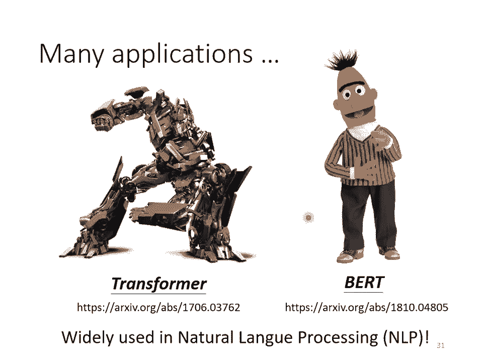

比如說在做語音的時候，你也可以用self-attention，不過在做語音的時候，用self-attention你可能會希望對self-attention，做一些小小的改動，舉例來說，因為一般語音的。

如果你要把一段聲音訊號，表示成一排像量的話，這排像量可能會非常的長，因為我們之前有說過說，在做語音辨識的時候，你要把聲音訊號表示成一排像量，而每一個像量其實只代表了，10ms的長度而已。

所以如果今天是1ms的聲音訊號，它就有100個像量了，5ms的聲音訊號就500個像量了，你隨便講一句話都是上千個像量了，所以一段聲音訊號，你要描述它的時候，這個vector的sequence它的長度。

是非常可觀的，那可觀的sequence，可觀的長度會造成什麼問題呢，你想想看我們今天在計算這個，Attention Matrix的時候，它的complexity是長度的平方。

你要計算這個Attention Matrix A'，你需要做L乘以L次的Inner Product，那如果這個L的值很大的話，它的計算量就很可觀，如果L很大的話，你也需要很大的memory。

才能夠把這個矩陣存下來，所以今天如果在做語音辨識的時候，你講一句話，那一句話所產生的這個，Attention Matrix可能會太大，大到你根本就不容易處理，不容易訓練，所以怎麼辦呢，在做語音的時候。

有一招叫做Truncated Self-Attention，Truncated Self-Attention，做的事情就是，我們今天在做Self-Attention的時候，不要看一整句話。

我們就只看一個小的範圍就好，至於這個範圍應該要多大，那個是人設定的，那為什麼我們知道說，今天在做語音辨識的時候，也許只需要看一個小的範圍就好，那就是取決於你對這個問題的理解，也許我們要辨識這個位置。

有什麼樣的phoning，這個位置有什麼樣的內容，我們並不需要看整句話，只要看這句話，跟它前後一定範圍之內的資訊，其實就可以判斷，所以如果在做Self-Attention的時候。

也許沒有必要看過一整個句子，也許沒有必要讓Self-Attention，考慮一整個句子，也許只需要考慮一個小範圍就好，這樣就可以加快運算的速度，這個是Truncated的Self-Attention。

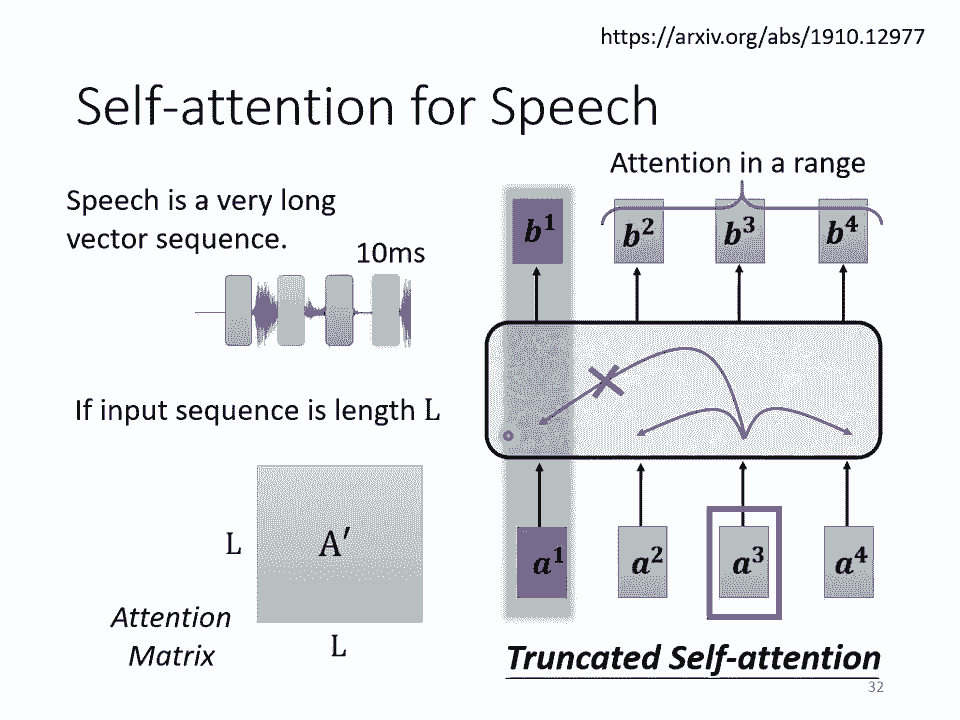

那其實Self-Attention還可以被用在影像上，Self-Attention怎麼被用在影像上呢，那到目前為止我們在講Self-Attention的時候。

我們都說Self-Attention適用的範圍，是輸入是一排像量的時候，輸入是一個Factor Set的時候，它適合使用Self-Attention，那我們之前在講CNN的時候，我們是跟大家說影像。

一張圖片我們把它看作是一個很長的像量，那其實一張圖片我們也可以換一個觀點，把它看作是一個Factor Set，怎麼把一張圖片看作是一個Factor Set呢，這個是一個解析度5x10的圖片。

那這張圖片可以看作是一個Tensor，這個Tensor的大小是5x10x3，3代表RGB這三個Channel，那你可以把每一個位置的Pixel，看作是一個三維的像量。

所以每一個Pixel其實就是一個三維的像量，那整張圖片其實就是5x10個像量，所以我們其實可以換一個角度來看影像這個東西，影像這個東西其實也是一個Factor Set。

它既然也是一個Factor Set的話，你完全可以用Self-Attention來處理一張圖片，那有沒有人用Self-Attention來處理一張圖片呢。

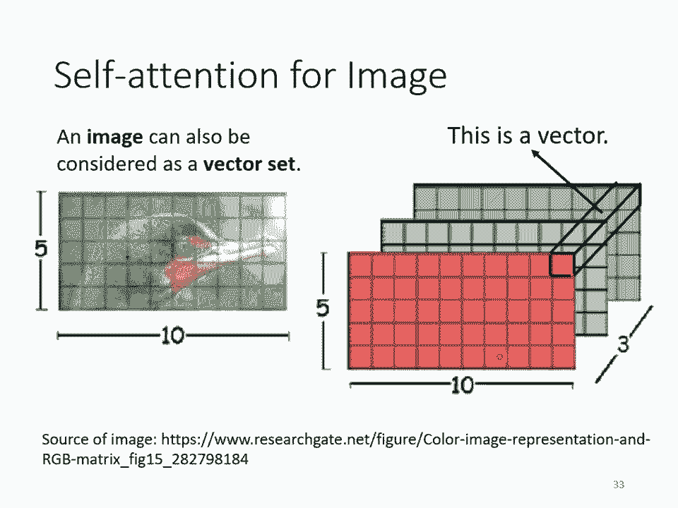

這張圖片是有的，那這邊就舉了兩個例子來給大家參考，那現在把Self-Attention用在影像處理上，也不算是一個非常石破天驚的事情，那我們可以來比較一下。

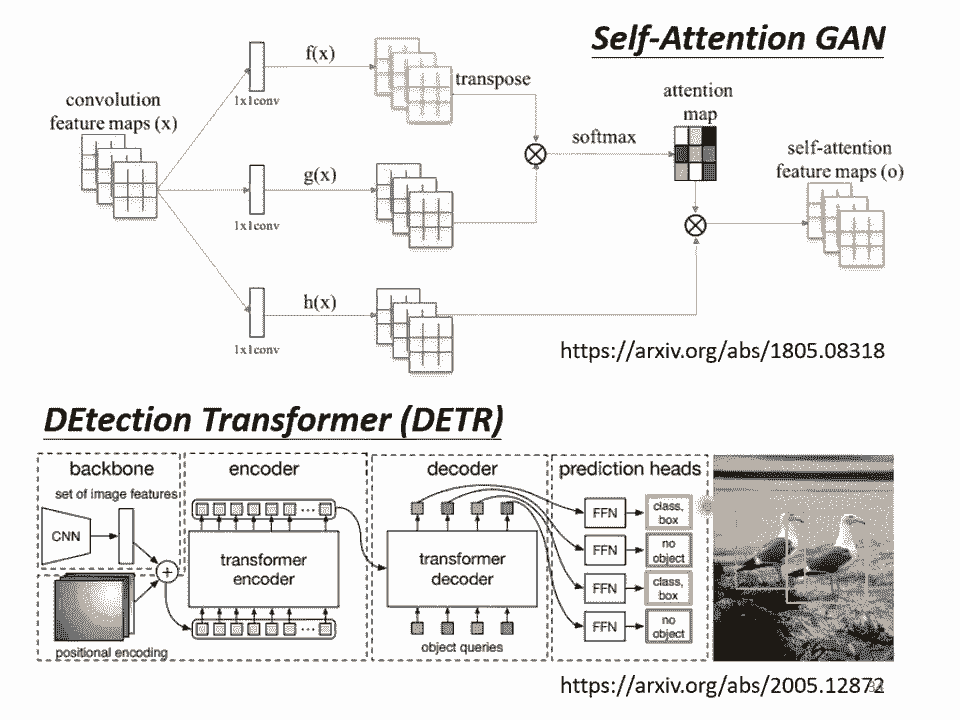

Self-Attention跟CNN之間，有什麼樣的差異或者是關聯性，如果我們今天是用Self-Attention來處理一張圖片，代表說假設這個是你要考慮的Pixel，它產生Query。

其他Pixel產生Key，你今天在做Inner Product的時候，你考慮的不是一個小的範圍的資訊，而是整張影像的資訊，但是今天在做CNN的時候，記不記得我們上上週講的。

CNN會畫出一個Receptive Field，每一個Filter 每一個Neural，都是考慮Receptive Field範圍裡面的資訊，所以如果我們比較CNN跟Self-Attention的話。

我們可以說CNN是什麼，CNN可以看作是一種簡化版的Self-Attention，因為在做CNN的時候，我們只考慮Receptive Field裡面的資訊，而在做Self-Attention的時候。

我們是考慮整張圖片的資訊，所以CNN是簡化版的Self-Attention，或者是你可以反過來說，Self-Attention是一個複雜化的CNN，在CNN裡面我們要畫定Receptive Field。

每一個Neural只考慮Receptive Field裡面的資訊，而Receptive Field的範圍跟大小是人決定的，我記得我們上上週還花了一些時間講一下說。

Receptive Field有什麼樣可能的設計，而對Self-Attention而言，我們用Attention去找出相關的Pixel，就好像是Receptive Field是自動被學出來的。

Never自己決定說Receptive Field的形狀長什麼樣子，Never自己決定說以這個Pixel為中心，哪些Pixel是我們真正需要考慮的，哪些Pixel是相關的。

所以Receptive Field的範圍不再是人工畫定，而是讓機器自己學出來，這邊講的是Self-Attention跟CNN的關係。

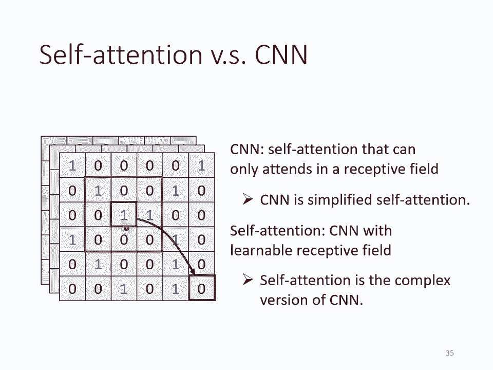

其實你可以讀一篇paper，叫做On the Relationship Between Self-Attention and Convolutional Layer。

在這篇paper裡面會用數學的方式嚴謹的告訴你說，其實這個CNN就是Self-Attention的特例，Self-Attention只要設定合適的參數，它可以做到跟CNN一模一樣的事情。

所以CNN它的function set長這個樣子，而Self-Attention它的function set長這個樣子，所以Self-Attention是更flexible的CNN。

而CNN是有受限制的Self-Attention，Self-Attention只要透過某些設計、某些限制，它就會變成CNN，那這也不是很舊的paper，你發現它放到網路上的時間是19年的11月。

所以你知道這些我們今天上課裡面講的東西，其實都是很新的資訊，既然CNN是Self-Attention的一個subset，Self-Attention比較flexible。

那記不記得我們在講overfitting的時候，我們講說比較flexible的model，比較需要更多的data，如果你data不夠就有可能overfitting，而小的model。

而比較有限制的model，它適合在data少的時候，它可能比較不會overfitting，那如果這個限制設得好。

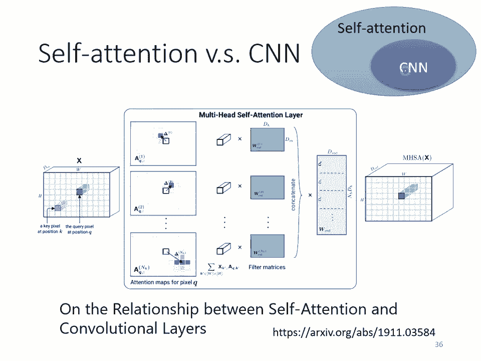

也會有不錯的結果，如果你今天用不同的data量，來訓練CNN跟Self-Attention，你確實可以看到我剛才講的現象，那這個實驗結果來自於。

An image is worth 16x16 words，這個是Google的paper，它就是把這個Self-Attentionapply在影像上面，那其實把一張影像拆成16x16個patch。

然後它把每個patch就想像成是一個word，因為一般我們這個Self-Attention，比較常用在NLP上面嘛，所以它就說想像每個patch其實就是一個word。

所以它就取了一個很fancy的title，叫做一張圖呢，值16x16個文字，那這個橫軸是什麼，橫軸是訓練的影像的量，那你發現說對Google來說，所謂的資料量比較少，也是你沒有辦法用的資料量啦。

這邊有10個million，1000萬張圖是資料量比較小的setting，然後資料量比較大的setting呢，有3億張圖片，在這個實驗裡面呢，比較了Self-Attention，是淺藍色的這條線。

跟CNN是深灰色的這條線，那你就會發現說，隨著資料量越來越多，那Self-Attention的結果呢，就越來越好，最終在資料量最多的時候，Self-Attention可以超過CNN，但在資料量少的時候。

CNN它是可以比Self-Attention，得到更好的結果的，那為什麼會這樣，你就可以從CNN跟Self-Attention，它們的彈性來加以解釋，這個Self-Attention它彈性比較大。

所以需要比較多的訓練資料，訓練資料少的時候就會overbeating，而CNN它彈性比較小，在訓練資料少的時候結果比較好，但訓練資料多的時候，它沒有辦法從更大量的訓練資料，得到好處。

所以這個就是Self-Attention跟CNN的比較，那你可能問說，那Self-Attention跟CNN誰比較好呢，我應該選哪一個呢，事實上你也可以都用對不對，在我們作業室裡面。

如果你要做Strong Baseline的話，就特別給你一個提示，就是用Conformer，裡面就是有用到Self-Attention，也有用到CNN，好那我們來比較一下。

Self-Attention跟RNN，RNN就是Recurrent Neural Network，那其實在這門課裡面呢，我們現在就不會講到，Recurrent Neural Network。

因為Recurrent Neural Network的角色，很大一部分都可以用，Self-Attention來取代了，所以在這門課裡面，我們就不會再特別把RNN拿出來講，但是RNN是什麼呢。

假設你想知道的話，那這邊很快的三言兩語把它帶過去，RNN跟Self-Attention一樣，都是要處理Input是一個Sequence的狀況，那在RNN裡面呢，這是你的Input Sequence。

你有一個Memory的Vector，然後你有一個RNN的Block，這個RNN的Block呢，它持Memory的Vector，持第一個Input的Vector，然後Output一個東西。

然後根據這個Output的東西，我們通常叫做這個，這個Hidden的Layer的Output，然後通過這個Fully Connected的Network，然後再去做你想要的Prediction。

那RNN這個Module呢，接下來當第二個，這個Sequence裡面，第二個Vector作為Input的時候，你會把這個Vector，第二個Vector當作Input，你會把前一個時間點吐出來的東西。

當作下一個時間點的輸入，再丟進RNN裡面，然後再產生新的Vector，再拿去給Fully Connected Network，做你想要做的事情，然後第三個Vector進來的時候，你把第三個Vector。

跟前一個時間點的輸出，一起丟進RNN，再產生新的輸出，然後在第四個時間點，第四個Vector輸出的時候，把第四個Vector，跟前一個時間點產生出來的輸出，再一起做處理，得到新的輸出。

再通過Fully Connected的Layer，這個就是RNN Recurrent Neural Network，那你會發現說，它跟Self-Attention做的事情，其實也非常像。

它們的Input都是一個Vector Sequence，Self-Attention Output是另外一個Vector Sequence，這裡面的每一個Vector。

都考慮了整個Input的Sequence以後，再給Fully Connected的Network去做處理，那RNN呢，它也會Output另外一群Vector，這另外一排Vector。

也會給Fully Connected的Network，做進一步的處理，那Self-Attention跟RNN有什麼不同呢，當然一個非常顯得意見的不同，你可能會說，這邊的每一個Vector。

它都考慮了整個Input的Sequence，而RNN每一個Vector，只考慮了左邊已經輸入的Vector，它沒有考慮右邊的Vector，那這是一個很好的觀察，但是RNN其實也可以是雙向的。

所以如果你RNN用雙向的RNN的話，其實這邊的每一個Hidden的Output，每一個Memory的Output，其實也可以看作是，考慮了整個Input的Sequence。

但是假設我們把RNN的Output，跟Self-Attention Output拿來做對比的話，就算你用Bidirectional的RNN，還是有一些差別的，對RNN來說。

假設最右邊這個黃色的Vector，要考慮最左邊的這個輸入，那它必須要把最左邊的輸入呢，存在Memory裡面，然後接下來都不能夠忘掉，一路帶到最右邊，才能夠在最後一個時間點被考慮。

但對Self-Attention來說，沒有這個問題，它只要這邊輸出一個Query，這邊輸出一個Key，只要它們Mesh的起來，天涯落壁林，你可以從非常遠的Vector。

在整個Sequence上非常遠的Vector，輕易的抽取資訊，所以這是RNN跟Self-Attention，一個不一樣的地方，還有另外一個更主要的不同是，RNN今天在處理的時候。

你Input一排Sequence，Output一排Sequence的時候，RNN是沒有辦法平行化的，你要先產生這個向量，接下來才能產生這個向量，才能產生這個向量，才能產生這個向量，所以RNN。

它今天Input一排Vector，Output另外一排Vector的時候，它沒有辦法一次處理，沒有辦法平行處理所有的Output，但Self-Attention有一個優勢，是它可以平行處理所有的輸出。

你今天Input一排Vector，在Output這四個Vector的時候，這四個Vector是平行產生的，並不需要等誰先運算完，才把其他人運算出來，Output的這個Vector。

裡面的Output這個Vector，Sequence裡面每一個Vector，都是同時產生出來的，所以在運算速度化，運算速度上，Self-Attention會比RNN更有效率，那你今天發現說，很多的應用。

都往往把RNN的架構，逐漸改成Self-Attention的架構了，如果你想要更進一步了解，RNN跟Self-Attention的關係的話，你可以看下面這篇文章，Transformers R/RNN。

裡面會告訴你說，Self-Attention，你加上了什麼東西以後，其實它就變成了RNN，你發現說這不是很舊的Paper，這個是去年的六月，放到Archive上，所以今天講的，都是一些很新的研究成果。

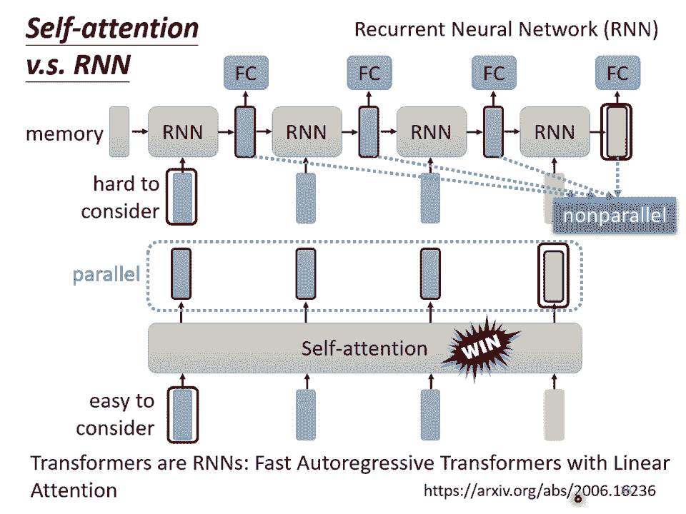

好那RNN的部分呢，我們這門課就不會提到，假設你對RNN有興趣的話，以下呢，是這一門課之前的上課錄影，那RNN的部分，因為這次不會講到，所以特別有做了英文的版本，RNN是中文英文版本。

都同時有放在YouTube上面的。

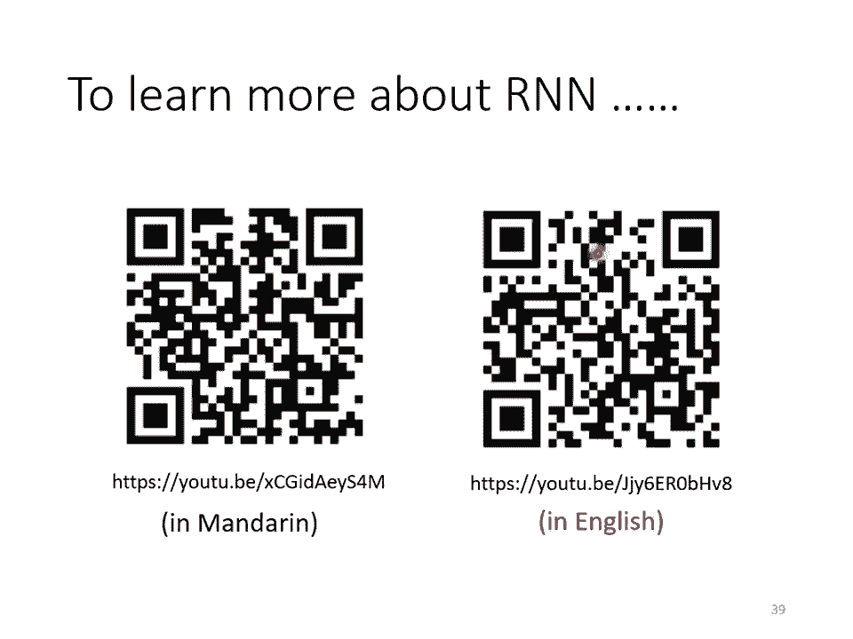

好最後呢，Self-Attention，也可以被用在Graph上面，那記得我們在這一堂，這一份投影片一開始的時候，就有跟你說過說，Graph也可以看作是一堆Vector，那如果是一堆Vector。

就可以用Self-Attention來處理，所以Self-Attention，也可以用在Graph上面，但是當我們把Self-Attention，用在Graph上面的時候，有什麼樣特別的地方呢。

在Graph上面呢，我們不只有每一個Node，我們每一個Node，可以表示成一個向量，但我們不只有Node的資訊，我們還有Edge的資訊，我們知道哪些Node之間，是有相連的。

也就是哪些Node是有關聯的，我們知道哪些向量間，是有關聯的，那之前我們在做，Self-Attention的時候，所謂的關聯性，是Neo自己找出來的，但是現在既然有了，Graph的資訊。

有了Edge的資訊，那關聯性也許就不需要，透過機器自動找出來的，這個圖上面的Edge，已經暗示了我們，Node跟Node之間的關聯性，所以今天當你把Self-Attention。

用在Graph上面的時候，你有一個選擇是，你在做這個，Attention Match計算的時候，你可以只計算，有Edge相連的Node就好了，舉例來說在這個圖上，Node 1跟Node 8有相連。

那我們只需要計算，Node 1跟Node 8，這兩個向量之間的，Attention的分數，那1跟6有相連，所以只有1跟6之間，需要計算Attention的分數，1跟5有相連，所以只有一跟五。

需要計算Attention的分數，2跟3有相連，所以只有2跟3，需要計算Attention的分數，以此類推，那如果兩個Node之間沒有相連，那其實很有可能就暗示，我們這兩個Node之間，沒有關係。

既然沒有關係，我們就不需要再去計算，它的Attention Score，直接把它設為0就好了，因為這個Graph，往往比如說是，人為根據某些，Domain Knowledge建出來的。

那Domain Knowledge已經告訴我們說，這兩個向量彼此之間，沒有關聯，我們就沒有必要，再用機器去學習這件事情，那其實當我們把，Self-Attention按照我們這邊講的。

這種限制用在Graph上面的時候，其實就是一種，Graph Neural Network，也就是一種GNN，我知道GNN現在也是一個，很Fancy的題目，那我不會說Self-Attention。

就要囊括了所有GNN的，各種變形啦，但打Self-Attention，用在Graph上面，是某一種類型的。

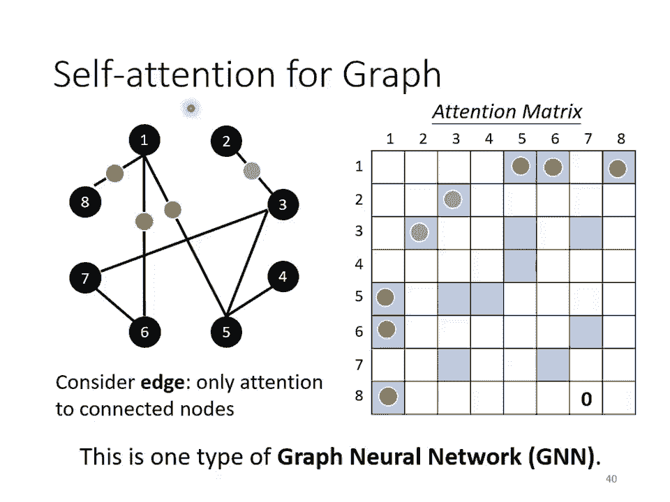

Graph Neural Network，那這邊呢，一樣我們也沒有辦法細講啦，GNN這邊坑也是很深啦，這邊隧也是很深，那就放一下助教之前，上課的連結，大概花了快3個小時。

在講Graph Neural Network，而且其實還沒有講完，就告訴你說，這個Graph Neural Network，也是有非常深的技術，這邊隧也是很深。

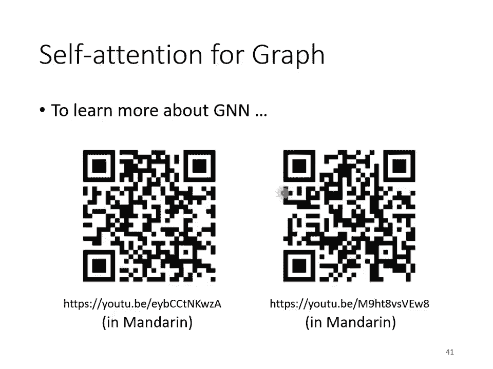

這不是我們今天這堂課，可以講的內容，好那其實這個Self-Attention，它有非常非常多的變形，你可以看一篇paper，叫做Long Range Arena，裡面比較了各種。

不同的Self-Attention的變形，因為Self-Attention，它最大的問題就是，它的運算量非常的大，所以怎麼樣減少，Self-Attention的運算量，是一個未來的重點。

可以看到這邊有各種，各式各樣Self-Attention的變形，那Self-Attention最早是用在，Transformer上面，所以很多人講Transformer的時候，其實它指的就是。

這個Self-Attention，有人說廣義的Transformer，指的就是Self-Attention，那所以後來各式各樣的，Self-Attention的變形，都叫做是什麼Former。

比如說Linformer，Performer Reformer等等，所以Self-Attention的變形，現在都叫做XX-Former，那可以看到說呢，往右代表它運算的速度，所以有很多各式各樣。

新的XX-Former，它們的速度會比原來的Transformer快，但是快的速度，帶來的就是Performance變差，這個縱軸代表是Performance，所以它們往往比原來的。

Transformer、Performer差一點，但是速度會比較快，那到底什麼樣的Self-Attention，才能夠真的又快又好，這仍然是一個上代研究的問題，如果你對Self-Attention。

想要進一步研究的話，你還可以看一下，Efficient Transformer，什麼在這篇Paper，Mangrid跟你介紹，各式各樣Self-Attention的變形，那這個就不是我們這一門課。

可以講的東西了，我們就停在這邊。

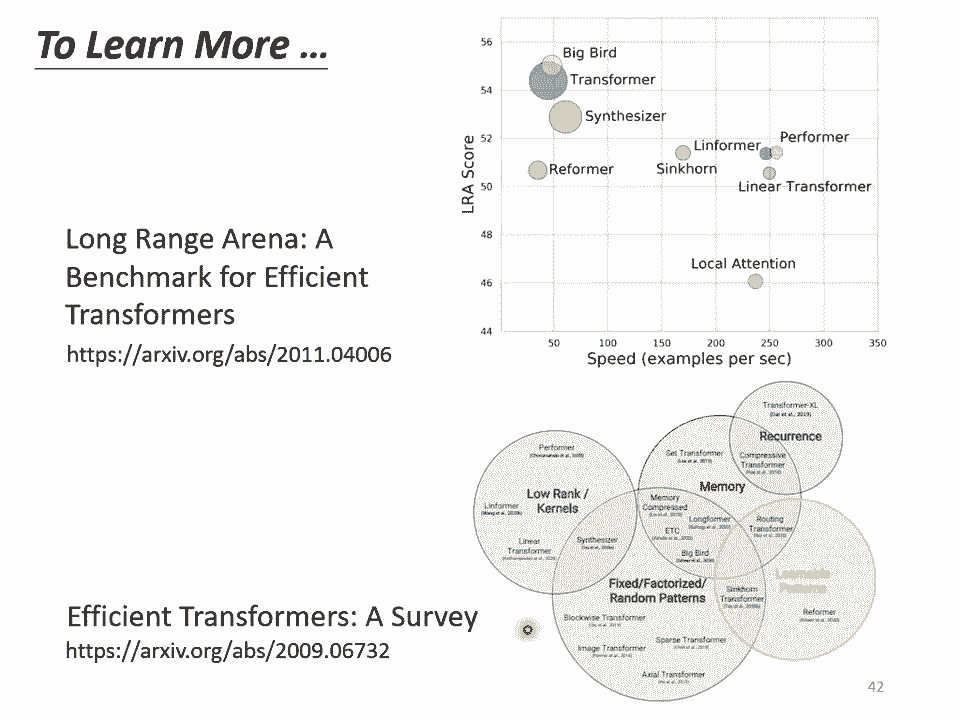

好那接下來呢，就是看一下各位同學，有沒有問題想要問的，大家有問題想要問的嗎，線上有問題想要問的嗎，以後我們就是放這一頁Q&A的時候，就是讓大家問問題的時候，那這樣之後呢，助教要把，你知道這個影片。

我們要拿去找人聽打，聽打以後還要做翻譯，然後之後這個Q&A這個部分，在聽打的時候，就會不用聽打，就不聽打，所以特別放一頁投影片，這樣以後助教比較知道，哪個地方就不用聽打，沒有問題這樣子。

好如果大家沒有問題的話，那我們在這邊呢，還是先下課十分鐘，我們就十分鐘以後再回來。

