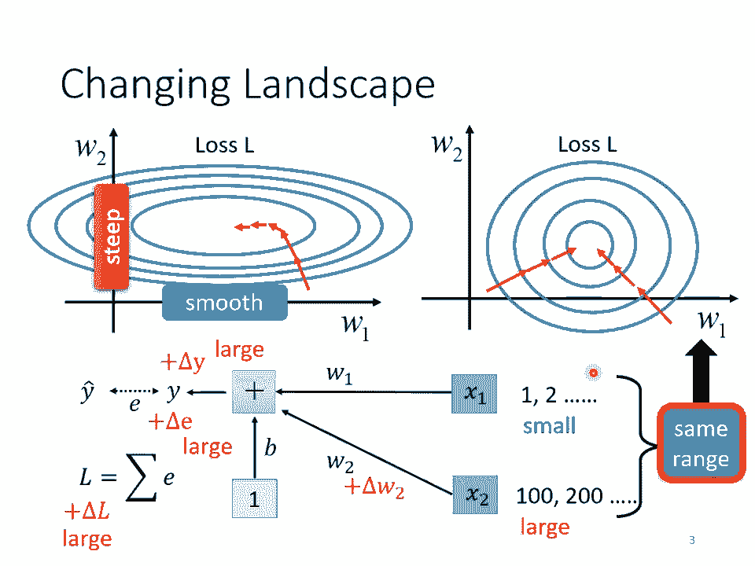
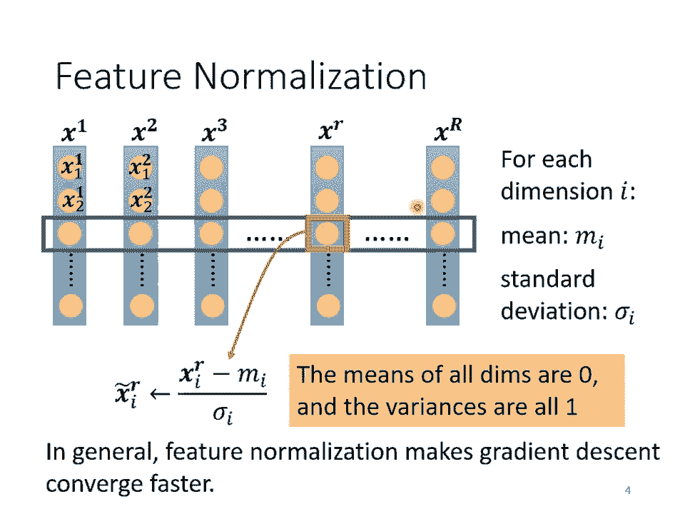
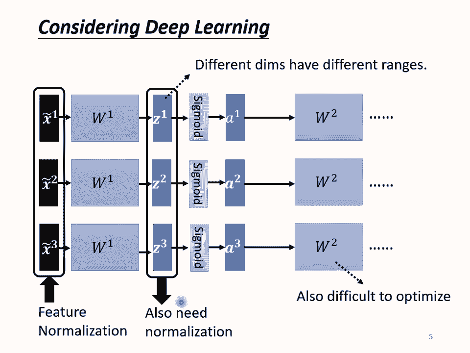
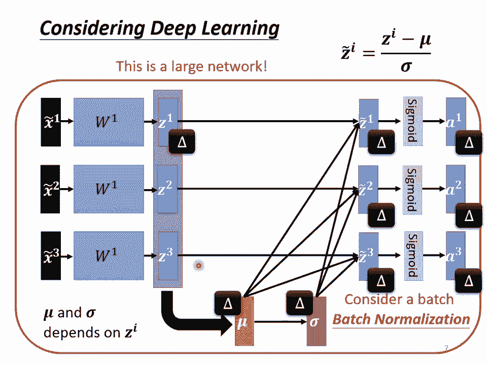
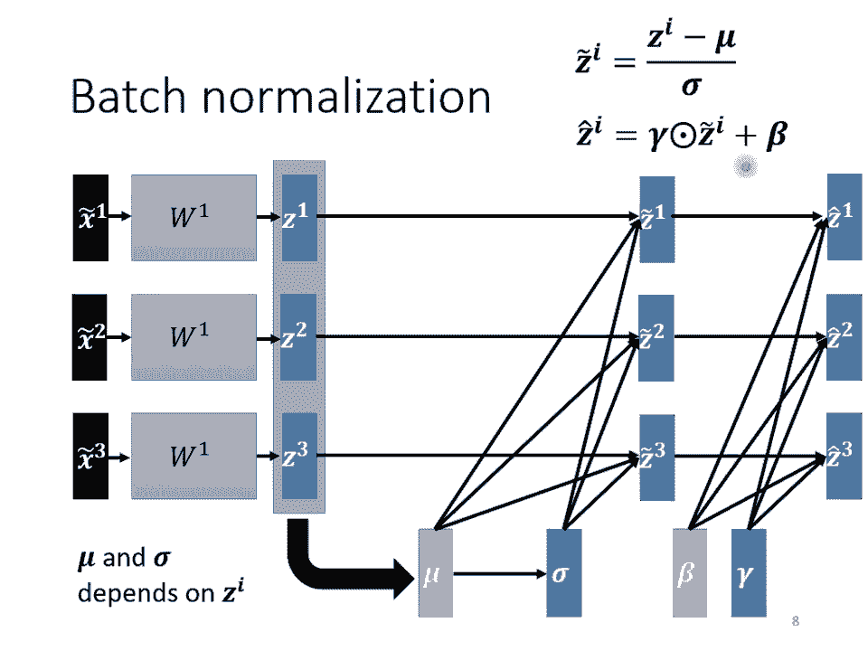
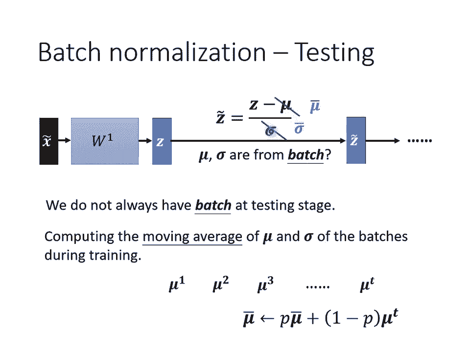
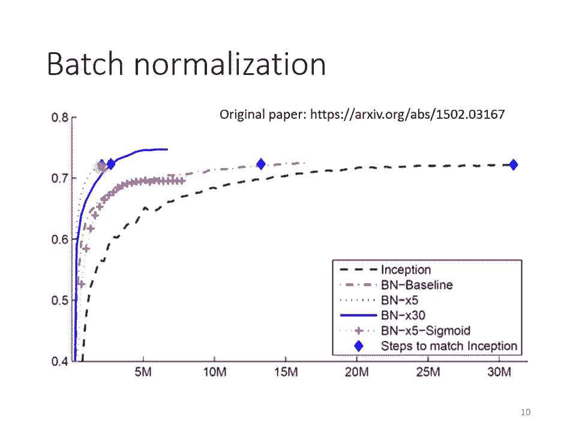
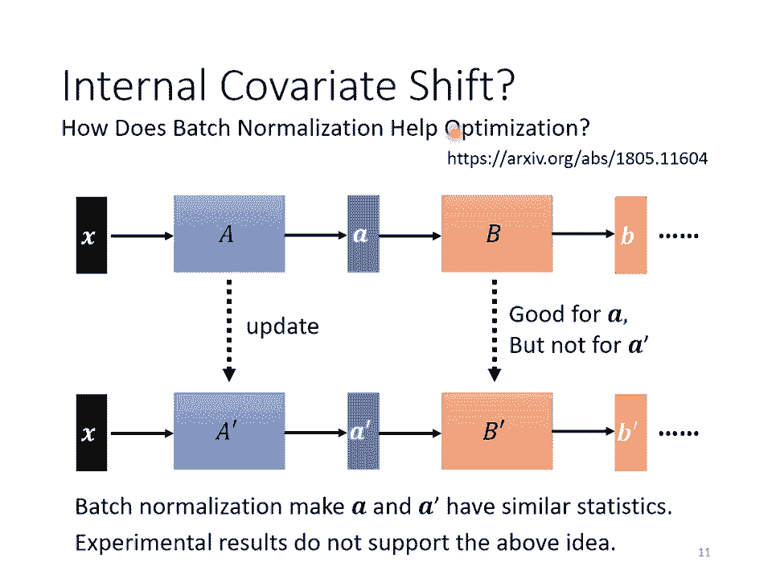
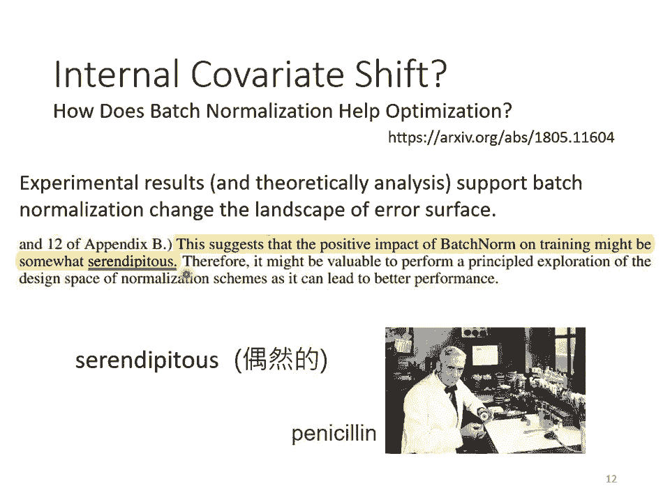
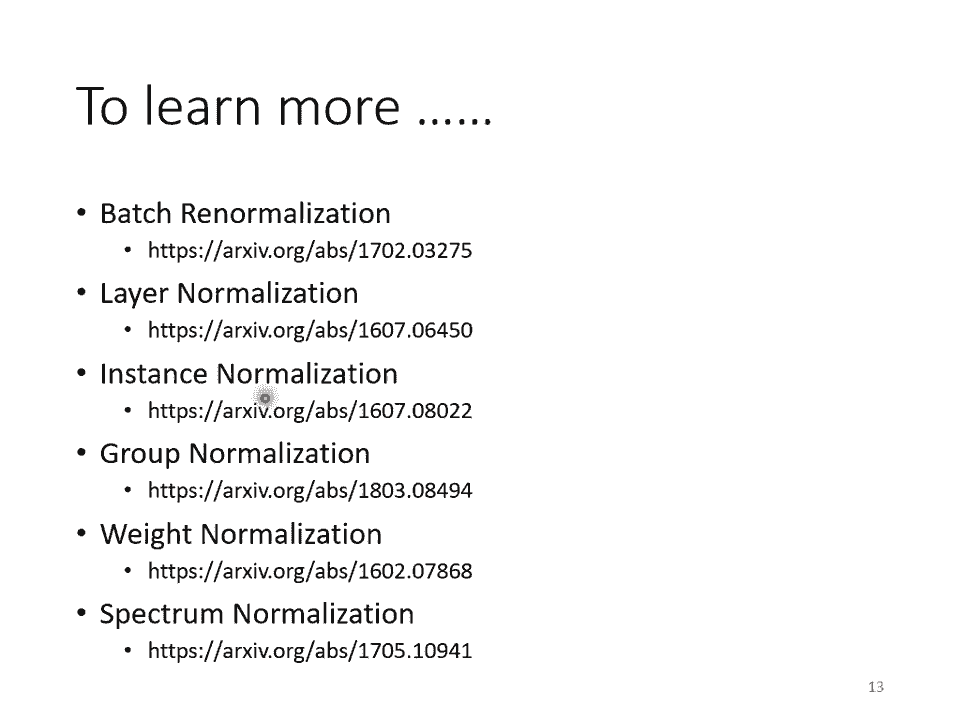

# P11：L10- 网络训练5：批次标准化简介 - ShowMeAI - BV1fM4y137M4

(觀眾)，好，我們要來上課了嗎？這一段是想跟大家簡短的介紹一下Batch Normalization的技術，那因為上課的內容想要配合作業的關係，所以我們會先把作業需要的。

比如說Self-Protection就先講一講，然後我們在比較覺得進度跟得上的時候就講一些Training的Tips，所以這樣有點，可能有點散亂啦，就Training的Tips散佈在課程的各個地方。

但Training的Tips這種東西啊，如果真的想講的話是永遠都講不完的，這個Tips實在是太多了，所以我們就有空的時候就講一些Tips，那我們這邊要講的是Batch Normalization。

那這個時候講Batch Normalization是最合適的，因為Batch Normalization你在作業3是用得上的，而且作業3助教的程式裡面其實就有Batch Normalization。

那在做CNN的時候，今天做影像處理的時候，今天Batch Normalization往往可以帶來蠻大的幫助，所以我們正好，你準備要來做作業3了，所以我們來講一下Batch Normalization。

這邊是一個很快的介紹Batch Normalization這個技術，那你記得我們之前才講過說，我們能不能夠直接改Aero Surface的Landscape。

我們覺得說Aero Surface如果很崎嶇的時候，它比較難Train，那我們能不能夠直接把3產品讓它變得比較好Train呢？Batch Normalization就是其中一個把3產品的想法。

那我記得我們在講Optimization的時候，我們一開始就跟大家講說，不要小看Optimization這個問題，有時候就算你的Aero Surface是Convex的，也就是它就是一個腕的形狀。

都不見得很好Train，那我們舉個例子就是，假設你的兩個參數，他們對Loss的斜率差別非常大，在W1這個方向上面，你的斜率變化很小，在W2這個方向上面，斜率變化很大。

你今天如果是固定的Learning Rate，你可能很難得到好的結果，所以我們才說，你需要這個Adaptive Learning Rate。

你需要用這個Added等等比較進階的Optimization的方法，才能夠得到好的結果，那現在我們要從另外一個方向想，直接把難做的Aero Surface把它改掉，看能不能夠改得好做一點。

那在做這件事之前，也許我們第一個要問的問題就是，有這種狀況，W1跟W2他們的斜率差很多的這種狀況，到底是從什麼地方來的，那我們這邊就是舉一個例子，假設我現在有一個非常非常非常簡單的Model。

它的輸入是X1跟X2，X1跟X2它對應的參數就是W1跟W2，它是一個Linear的Model，沒有Activation Function，W1乘X1，W2乘X2，加上B以後就得到Y。

會計算Y跟Y hat之間的差距，當作1，把所有Training Data的1加起來，就是你的Loss，那你希望去Minimize你的Loss，那什麼樣的狀況，我們會產生像上面這樣子。

比較不好Train的Error Surface呢，我們來看一下這個W1，如果今天W1有改變的時候，它對Loss的變化，我們要怎麼看呢，當我們對W1有一個小小的改變，比如說加上Delta W1的時候。

那這個L也會有一個改變，那這個W1呢，是透過W1改變的時候，你就改變了Y，Y改變的時候就改變了E，然後接下來就改變了L，所以當W1改變的時候，L就跟著改變，那什麼時候W1的改變會對L的影響很小呢。

什麼時候W1這邊的變化，在Error Surface上的斜率會很小呢，一個可能性是當你的Input很小的時候，假設X1的值都很小，假設X1的值在不同的Training Example裡面，它的值都很小。

那因為X1是直接乘上W1，如果X1的值都很小，W1有一個變化的時候，它對Y的影響也是小的，對E的影響也是小的，它對L的影響就會是小的，所以如果W1接的Input，它的值都很小。

那就會產生這邊的這樣的Case，你在W1上面的變化，對L的影響是小的，反之呢，如果今天是X2的話，假設X2它的值都很大，假設X2的值都很大，當你的W2有一個小小的變化的時候，雖然W2這個變化可能很小。

但是因為它乘上了X2，X2的值很大，那Y的變化就會很大，那E的變化就會很大，那L的變化就會很大，那就會導致我們在W這個方向上做變化的時候，我們把W改變一點點。

那我們的Error Surface就會有很大的變化，所以你發現說，今天在這個Linear的Model裡面，當我們Input的Feature，每一個Dimension的值啊，它的Scale差距很大的時候。

我們就可能產生像這樣子的Error Surface，就可能產生不同方向，它的斜率非常不同的，它的坡度非常不同的Error Surface，所以怎麼辦呢？我們有沒有可能給不同的Dimension。

Feature裡面不同的Dimension，讓它有同樣的數值的範圍，如果我們可以給不同的Dimension同樣的數值範圍的話，那我們可能就可以製造比較好的Error Surface。

讓Training變得比較容易一點，那怎麼讓不同的Dimension有類似的有接近的數值的範圍呢？

其實有很多不同的方法，那這些不同的方法啊，往往就合起來統稱為Feature Normalization，那我以下所講的方法，只是Feature Normalization的一種可能性。

它並不是Feature Normalization的全部，你可以怎麼做呢？你可以說，假設S1到SR，是我們所有的訓練資料的Feature Vector。

我們把所有訓練資料的Feature Vector通通都集合起來，那每一個Vector呢，X1裡面就有X上標1下標1，代表X1的第一個Element，X上標2下標1就代表X2的第一個Element。

以此類推，那我們把同一個Dimension，不同筆資料，不同Feature Vector，同一個Dimension裡面的數值，把它取出來，然後去計算某一個Dimension的Mean。

那我們現在計算的是第I個Dimension，它的Mean就是NI，那我們計算第I個Dimension的Standard Deviation，我們用Sigma I來表示它。

那接下來我們就可以做一種Normalization，那這種Normalization其實叫做標準化，其實叫Standardization，不過我們這邊等一下就統稱Normalization就好了。

那我們怎麼做Normalization呢？我們就是把這個X啊，把這邊的某一個數值啊，減掉這個Dimension算出來的Mean，再除掉這個Dimension算出來的Standard Deviation。

減掉Mean，除掉Standard Deviation，得到新的數值，叫做X~，那得到新的數值以後，再把新的數值把它塞回去，那接下來我們就把這個數值都塞回去，那接下來我們就把這個數值都塞回去。

那接下來我們就把這個數值都塞回去，那接下來我們就把這個數值都塞回去，那接下來我們就把這個數值都塞回去，那接下來我們就把這個數值都塞回去，那接下來我們就把這個數值都塞回去。

那接下來我們就把這個數值都塞回去，那接下來我們就把這個數值都塞回去，那接下來我們就把這個數值都塞回去，那接下來我們就把這個數值都塞回去，那接下來我們就把這個數值都塞回去。

那接下來我們就把這個數值都塞回去，那接下來我們就把這個數值都塞回去，那接下來我們就把這個數值都塞回去，那接下來我們就把這個數值都塞回去，那接下來我們就把這個數值都塞回去。

那接下來我們就把這個數值都塞回去，那接下來我們就把這個數值都塞回去，那接下來我們就把這個數值都塞回去。

那接下來我們就把這個數值都塞回去，那接下來我們就把這個數值都塞回去，那接下來我們就把這個數值都塞回去，那接下來我們就把這個數值都塞回去，那接下來我們就把這個數值都塞回去。

那接下來我們就把這個數值都塞回去，那接下來我們就把這個數值都塞回去，那接下來我們就把這個數值都塞回去，那接下來我們就把這個數值都塞回去，那接下來我們就把這個數值都塞回去。

那接下來我們就把這個數值都塞回去，那接下來我們就把這個數值都塞回去，那接下來我們就把這個數值都塞回去，那接下來我們就把這個數值都塞回去，那接下來我們就把這個數值都塞回去。

那接下來我們就把這個數值都塞回去，那接下來我們就把這個數值都塞回去，那接下來我們就把這個數值都塞回去，那接下來我們就把這個數值都塞回去，那接下來我們就把這個數值都塞回去。

那接下來我們就把這個數值都塞回去，那接下來我們就把這個數值都塞回去，那接下來我們就把這個數值都塞回去，那接下來我們就把這個數值都塞回去，那接下來我們就把這個數值都塞回去。

那接下來我們就把這個數值都塞回去，那接下來我們就把這個數值都塞回去，那接下來我們就把這個數值都塞回去，那接下來我們就把這個數值都塞回去，那接下來我們就把這個數值都塞回去。

那接下來我們就把這個數值都塞回去，那接下來我們就把這個數值都塞回去，那接下來我們就把這個數值都塞回去，那接下來我們就把這個數值都塞回去，那接下來我們就把這個數值都塞回去。

那接下來我們就把這個數值都塞回去，那接下來我們就把這個數值都塞回去，那接下來我們就把這個數值都塞回去，那接下來我們就把這個數值都塞回去，那接下來我們就把這個數值都塞回去。

那接下來我們就把這個數值都塞回去，那接下來我們就把這個數值都塞回去，那接下來我們就把這個數值都塞回去，那接下來我們就把這個數值都塞回去，那接下來我們就把這個數值都塞回去。

那接下來我們就把這個數值都塞回去，那接下來我們就把這個數值都塞回去，那接下來我們就把這個數值都塞回去，那接下來我們就把這個數值都塞回去，那接下來我們就把這個數值都塞回去。

那接下來我們就把這個數值都塞回去，那接下來我們就把這個數值都塞回去，那接下來我們就把這個數值都塞回去，那接下來我們就把這個數值都塞回去，那接下來我們就把這個數值都塞回去。

那接下來我們就把這個數值都塞回去，那接下來我們就把這個數值都塞回去。

那接下來我們就把這個數值都塞回去，那接下來我們就把這個數值都塞回去，那接下來我們就把這個數值都塞回去，那接下來我們就把這個數值都塞回去，那接下來我們就把這個數值都塞回去。

那接下來我們就把這個數值都塞回去，那接下來我們就把這個數值都塞回去，那接下來我們就把這個數值都塞回去，那接下來我們就把這個數值都塞回去，那接下來我們就把這個數值都塞回去。

那接下來我們就把這個數值都塞回去，那接下來我們就把這個數值都塞回去，那接下來我們就把這個數值都塞回去，那接下來我們就把這個數值都塞回去，那接下來我們就把這個數值都塞回去。

那接下來我們就把這個數值都塞回去，那接下來我們就把這個數值都塞回去，那接下來我們就把這個數值都塞回去，那接下來我們就把這個數值都塞回去，那接下來我們就把這個數值都塞回去。

那接下來我們就把這個數值都塞回去，那接下來我們就把這個數值都塞回去，那接下來我們就把這個數值都塞回去，那接下來我們就把這個數值都塞回去，那接下來我們就把這個數值都塞回去。

那接下來我們就把這個數值都塞回去，那接下來我們就把這個數值都塞回去，那接下來我們就把這個數值都塞回去，那接下來我們就把這個數值都塞回去，那接下來我們就把這個數值都塞回去。

那接下來我們就把這個數值都塞回去，那接下來我們就把這個數值都塞回去，那接下來我們就把這個數值都塞回去，那接下來我們就把這個數值都塞回去，那接下來我們就把這個數值都塞回去。

那接下來我們就把這個數值都塞回去，那接下來我們就把這個數值都塞回去，那接下來我們就把這個數值都塞回去，那接下來我們就把這個數值都塞回去，那接下來我們就把這個數值都塞回去。

那接下來我們就把這個數值都塞回去，那接下來我們就把這個數值都塞回去，那接下來我們就把這個數值都塞回去，那接下來我們就把這個數值都塞回去，那接下來我們就把這個數值都塞回去。

那接下來我們就把這個數值都塞回去，那接下來我們就把這個數值都塞回去，那接下來我們就把這個數值都塞回去，那接下來我們就把這個數值都塞回去，所以這邊Z1啊。

它本來如果我們沒有做feature normalization的時候，你改變了Z1的值，你會改變這邊A的值，但是現在啊當你改變Z1的值的時候，μ跟σ也會跟著改變，μ跟σ改變以後。

Z2的值、A2的值、Z3的值、A3的值，也會跟著改變，所以之前啊我們每一個X1Δ、X2Δ、X3Δ，它是獨立分開處理的，但是我們在做feature normalization以後。

這三個example它們變得彼此關聯了，我們這邊Z1只要有改變，接下來Z2、A2、Z3、A3也都會跟著改變，所以這邊啊其實你要把，當你有做feature normalization的時候。

你要把這一整個process，就是有收集一堆feature，把這堆feature算出μ跟σ，這件事情當作是network的一部分，也就是說你現在有一個比較大的network。

你之前的network都只吃一個input得到一個output，現在呢你有一個比較大的network，這個大的network它是吃一堆input，用這堆input在這個network裡面要算出μ跟σ。

然後接下來產生一堆output，那這個地方比較抽象，不知道大家有沒有希望你聽得懂，如果你覺得有困惑的話，你可以等一下詢問或者是在討論板上發問，那這一段呢我覺得只可繪意不可言傳。

不知道你聽不聽得懂這一段的意思，現在不是一個network處理一個example，而是有一個巨大的network它處理一把example，用這把example還要算個μ跟σ得到一把output。

那這邊就會有一個問題了，因為你的訓練資料裡面你的data非常多啊，現在一個data set benchmark top都上百萬筆資料啊，你哪有辦法一次把上百萬筆資料丟到一個network裡面。

你這個GPU的memory根本無法，這個沒電了，好麥克風沒電了，好，那你那個GPU的memory根本沒有辦法，把整個data set的data都漏進去啊，所以怎麼辦，在實作的時候。

你不會讓這個network考慮整個training data裡面的所有example，你只會考慮一個batch裡面的example，舉例來說你batch設64。

那你這個巨大的network就是把64筆data讀進去，算這64筆data的μ，算這64筆data的σ，對這64筆data都去做normalization，因為我們在實作的時候。

我們只對一個batch裡面的data做normalization，所以這招叫做batch normalization，這個就是你常常聽到的batch normalization。

那這個batch normalization顯然有一個問題就是，你一定要有一個夠大的batch，你才算得出μ跟σ，可是你今天你batch size1，那就沒有什麼μ跟σ可以算，你就會有問題。

所以這個batch normalization是適用於batch size比較大的時候，那我們因為batch size如果比較大。

也許這個batch size裡面的data就足以表示整個Corpus的分布，那這個時候你就可以把這個，本來要對整個Corpus做feature normalization這件事情。

改成只在一個batch做feature normalization，做為approximation。

好，那在做batch normalization的時候，往往還會有這樣的設計，你算出這個Zθ以後，接下來你會把這個Zθ再乘上另外一個向量叫做γ，這個γ也是一個向量。

所以你是把Zθ跟γ做element wise的相乘，把Z這個向量裡面的element，跟γ這個向量裡面的element兩兩做相乘，再加上β這個向量得到Z hat。

而β跟γ你要把它想成是network的參數，它是另外再被認出來的，那為什麼要加上β跟γ呢，那是因為有人可能會覺得說，如果我們做normalization以後，那這邊的Zθ它的平均就一定是0。

那也許今天如果平均是0的話，就是給network一些限制嘛，那也許這個限制會帶來什麼負面的影響，所以我們把β跟γ加回去，然後讓network現在它的hidden layer的output。

不需要平均是0，如果它想要不平均不是0的話，它就自己去認這個β跟γ來調整一下輸出的分布，來調整這個Z hat的分布，但講到這邊又會有人問說，剛才不是說做batch normalization。

就是為了要讓每一個不同的dimension，它的range都是一樣我們才做這個normalization嗎，現在如果加去乘上γ再加上β，把γ跟β加進去，這樣不會不同dimension的分布。

它的range又都不一樣了嗎，有可能，但是實際上你在做的時候，實際上在訓練的時候，這個γ跟β的初始值，你會把這個γ的初始值就都設為1，所以γ是一個裡面的值，一開始是一個裡面的值全部都是1的向量。

那β是一個裡面的值全部都是0的向量，所以γ是一個one vector都是1的向量，β是一個zero vector裡面的值都是0的向量，所以讓你的內容在一開始訓練的時候。

每一個dimension的分布是比較接近的，也許訓練到後來，你已經訓練夠長的一段時間，已經找到一個比較好的，error surface走到一個比較好的地方以後，那再把γ跟β慢慢地加進去。

所以加batch normalization，往往對你的訓練是有幫助的。

好 那接下來就要講testing的部分了，剛才講的都是training的部分，還沒有講到testing的部分，testing有時候又叫inference，所以有在文件上看到有人說。

做個inference，inference的就是testing，這個batch normalization在inference，或是testing的時候呢，會有問題啊，會有什麼樣的問題呢。

在testing的時候，當然如果今天你是在做作業，我們一次會把所有的testing的資料給你，所以你確實也可以在testing的資料上面，製造一個一個batch，但是假設你真的有系統上線。

你是一個真正的線上的application，你可以說我今天一定要等30，比如你的batch size是64，我一定要等64筆資料都進來，我才一次做運算嘛，這顯然是不行的，對不對 如果你是一個線上的服務。

一筆資料進來，你就要每次都做運算，你不能等說我累積了一個batch的資料，才開始做運算，但是在做batch normalization的時候，我們今天呢，一個x delta。

一個normalized score的feature進來，然後你有一個z，你的z呢，要減掉μ跟除σ，那這個μ跟σ是用一個batch的資料算出來的，但如果今天在testing的時候，根本就沒有batch。

那我們要怎麼算這個μ，跟怎麼算這個σ呢，所以真正的這個實作上的解法是這個樣子的，如果你看那個pytorch的話呢，batch normalization在testing的時候。

你並不需要做什麼特別的處理，pytorch幫你處理好了，pytorch是怎麼處理這件事的呢，他說在training的時候，如果你有在做batch normalization的話。

在training的時候，你每一個batch計算出來的μ跟σ，他都會拿出來算moving average，什麼意思呢，你每一次取一個batch出來的時候，你就會算一個μ1。

取第二個batch出來的時候你就算一個μ2，一直到取第一個batch出來的時候你就算一個μt，接下來你會算一個moving average，也就是呢，你會把你現在算出來的μ的一個平均值，叫做μbar。

乘上某一個factor，那這個也是一個常數，這也是一個constant，這也是一個hyperparameter，也是需要調的那一種啦，那在pytorch裡面，我沒記錯他就是0。1，我加b就是0。1。

然後加上1-p乘上μt，然後來更新你的μ的平均值，然後最後在testing的時候，你就不用算batch裡面的μ跟σ了，因為testing的時候，在真正application上也沒有batch這個東西。

你就直接拿μbar跟σbar，也就是μ跟σbar在訓練的時候，得到的moving average，μbar跟σbar，來取代這邊的μ跟σbar，這個就是batch normalization。

在testing的時候的運作方式。

好那這個是從batch normalization，原始的文獻上面，截出來的一個實驗結果，那在原始的文獻上，還講了很多其他的東西，舉例來說，我們今天還沒有講的是。

batch normalization用在CNN上，要怎麼用呢，那你自己去讀一下原始的文獻，你會告訴你說batch normalization，如果用在CNN上，應該要長什麼樣子。

好那這個是原始文獻上面，截出來的一個數據，那這個橫軸呢，代表的是訓練的過程，縱軸呢，代表的是validation state上面的accuracy，那這個黑色的虛線是。

沒有做batch normalization的結果，他用的是Inception的network，就是某一種network架構啦，也是以CNN為基礎的network架構，總之黑色的這個虛線。

代表沒有做batch normalization的結果，然後如果有做batch normalization，你會得到紅色的這一條虛線，那你會發現說，紅色這一條虛線，他訓練的速度。

顯然比黑色的虛線還要快很多，雖然最後收斂的結果，就你只要給他足夠的訓練的時間，可能都跑到差不多的accuracy，但是紅色這一條虛線，可以在比較短的時間內，就跑到一樣的accuracy。

那這邊這個藍色的菱形，代表說這幾個點的accuracy是一樣的啦，那紅色的大概在一半以內的時間，相較於沒有做batch normalization，只需要一半或甚至更少的時間，就跑到同樣的正確率了。

那這邊還有別的線啦，這邊有一個粉紅色的線，粉紅色的線是什麼呢，粉紅色的線是sigmoid function，sigmoid function一般的認知，我們雖然還沒有討論這件事啦。

但一般都會選擇relu，而不是用sigmoid function，因為sigmoid function他的training是比較困難的，但是這邊想要強調的點是說，就算是sigmoid比較難搞的。

加batch normalization，還是trained起來，那這邊沒有sigmoid沒有做batch normalization的結果，因為在這個實驗上作者有說。

sigmoid不加batch normalization，根本連trained都trained不起來，那這邊還有這個藍色的實線，藍色的實線跟這個藍色的虛線呢，是把learning rate設比較大一點。

乘5就是learning rate變原來的5倍，然後乘30就是learning rate變原來的30倍，那因為如果你做batch normalization的話，那你的error surface呢。

會比較平滑比較容易訓練，所以你可以把你的比較不崎嶇，所以你就可以把你的learning rate設大一點，那這邊有個不好解釋的奇怪的地方就是，不知道為什麼learning rate設30倍的時候。

是比5倍差啦，那作者也沒有解釋啦，你知道做deep learning就是，有時候會產生這種怪怪的，不知道怎麼解釋的現象就是了，不過作者就是照實把它做出來的實驗結果，呈現在這個圖上面。

好 接下來的問題就是，batch normalization，他為什麼會有幫助呢，在原始的batch normalization那篇paper裡面，他提出來一個概念叫做。

internal covariate shift，covariate shift這個詞彙是原來就有的，internal covariate shift我認為是。

batch normalization的作者自己發明的，他認為說今天在train network的時候，會有以下這個問題，這個問題是這樣，network有很多層，X通過第一層以後得到A。

A通過第二層以後得到B，那我們今天計算出gradient以後，把Aupdate成A'，把B這一層的參數Update成B'，但是作者認為說，現在我們在把BUpdate到B'的時候。

那我們在計算BUpdate到B'的gradient的時候，這個時候前一層的參數是A，或者是前一層的output是a，那當前一層從A變成A'的時候，它的output就從a變成a'。

但是我們計算這個gradient的時候，我們是根據這個A算出來的，所以這個Update的方向，也許它適合用在A上，但不適合用在A'上面，那如果做batch normalization的話，我們會讓。

因為我們每次都有做normalization，我們就會讓A跟A'，它的分布比較接近，也許這樣就會對訓練有幫助，但是有一篇paper叫做。

How does batch normalization help optimization，他就打臉了internal covariance shift的觀點，在這篇paper裡面。

他從各式各樣的面向來告訴你說，internal covariance shift，首先它不一定是train network時候的一個問題，然後batch normalization它會比較好。

可能不見得是因為它解決了internal covariance shift，那在這篇paper裡面呢，他做了很多很多的實驗，比如說他比較了訓練的時候，這個A的分布的變化發現。

不管有沒有做batch normalization，它的變化都不大，然後他又說，就算是變化很大，對training也沒有太大的傷害，然後他又說，不管你是根據A算出來的gradient。

還是根據A'算出來的gradient，方向居然都差不多，所以他告訴你說，internal covariance shift，可能不是training network時候最主要的問題。

它可能也不是batch normalization會好的一個關鍵，那有關更多的實驗，你就自己參見這篇文章。

好那，為什麼batch normalization會比較好呢，那在這篇How does batch normalization help optimization，這篇論文裡面，他從實驗上也從理論上。

至少支持了batch normalization，可以改變error surface，讓error surface比較不崎嶇這個觀點，所以這個觀點是有理論的支持，也有實驗的佐證的，那在這篇文章裡面呢。

作者還講了一個非常有趣的話，他說他覺得，batch normalization的positive impact，因為他說如果我們要讓network，這個error surface變得比較不崎嶇。

其實不見得要做batch normalization，感覺有很多其他的方法，都可以讓error surface變得不崎嶇，那他就試了一些其他的方法。

發現說跟batch normalization performance，差不多甚至還稍微好一點，所以他就講了下面這句感嘆，他覺得說這個positive impact。

of batch norm on training，可能是somewhat serendipitous，怎麼是serendipitous呢，這個字眼可能可以翻譯成偶然的。

但偶然並沒有完全表達這個詞彙的意思，這個詞彙的意思是說，你發現了一個什麼意料之外的東西，舉例來說，盤尼西林就是意料之外的發現，大家知道盤尼西林的由來就是，有一個人叫做佛萊明，他本來想要培養一些葡萄球菌。

但是因為他實驗沒有做好，他的葡萄球菌被感染了，有一些黴菌掉到他的培養皿裡面，那發現那些黴菌會殺死葡萄球菌，所以他就發現了盤尼西林，所以這是一種偶然的發現，這篇文章的作者也覺得。

batch normalization，也像是盤尼西林一樣是一種偶然的發現，但無論如何。

它是一個有用的方法，好那其實batch normalization，不是唯一的normalization，normalization的方法有一把啦，那這邊就是列了幾個比較知名的。

我們來來參考一下，好那講到這邊，不知道有沒有同學有問題想要問的呢，線上有問題想要問的嗎，好，好如果沒有的話，因為講到這邊剛好告一個段落，雖然這堂課比較短，但我們還是休息十分鐘，我們十分鐘後再回來。

