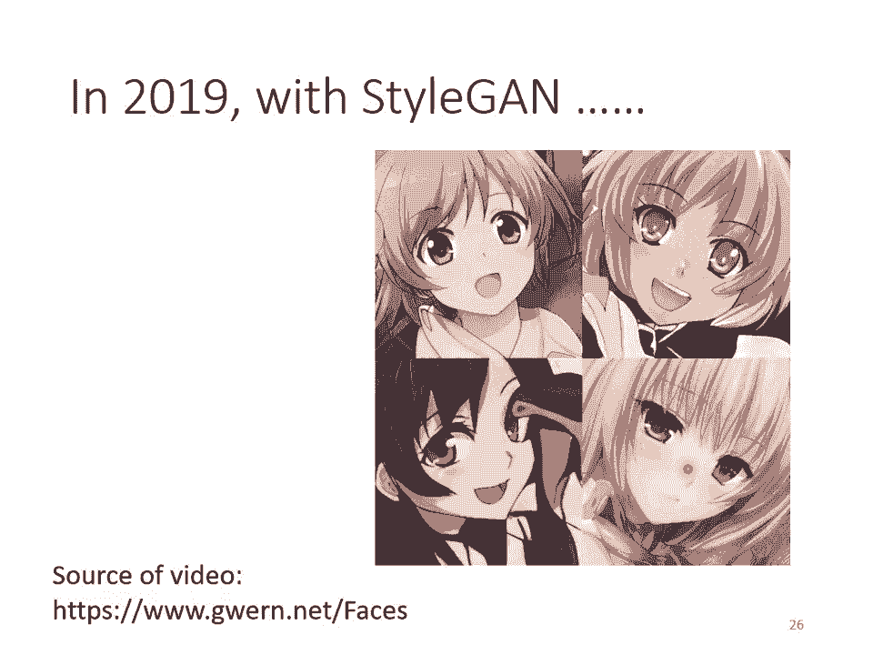
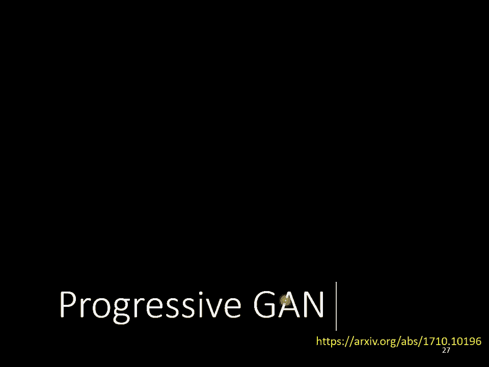
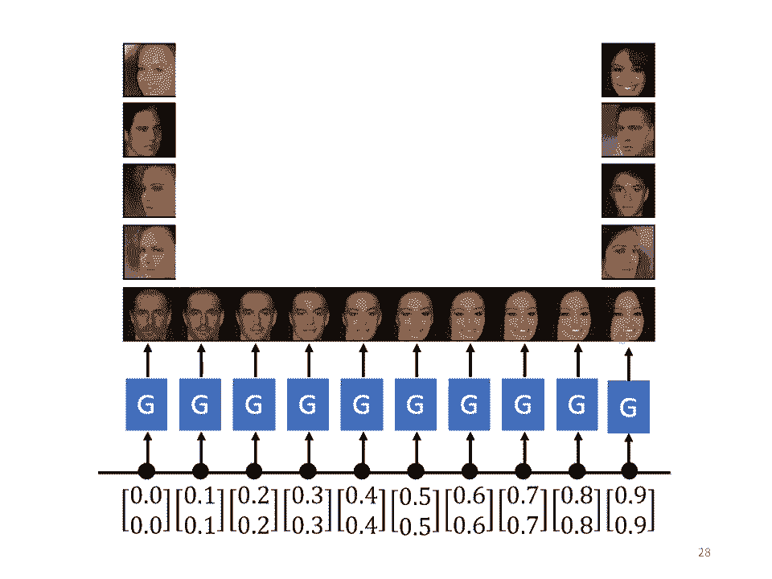
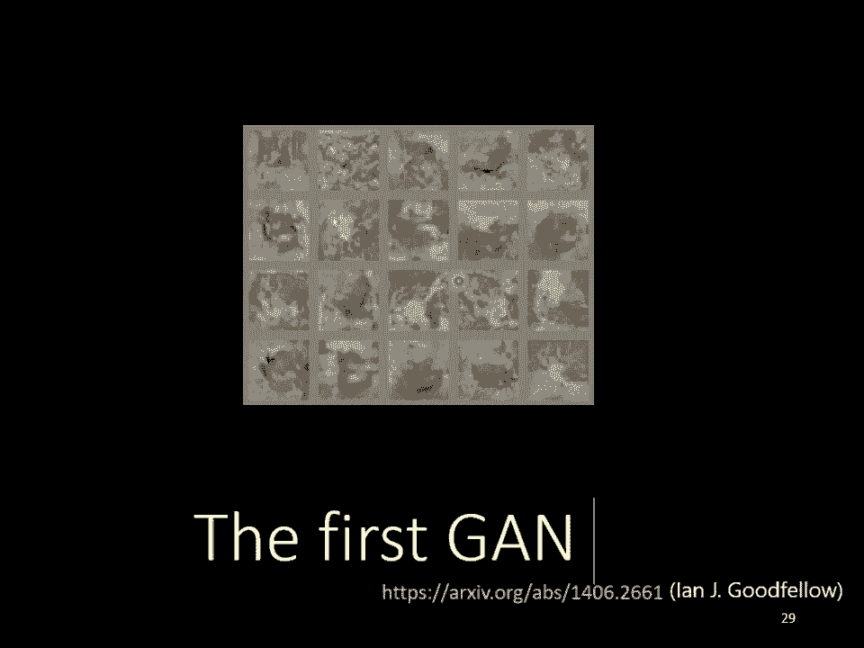

# P14：L12.1- 生成式对抗网络1：基本概念介绍 - ShowMeAI - BV1fM4y137M4

好，各位同學大家好，那我們來繼續上課吧，接下來我們要進入一個新的主題，我們要講生成這件事情，生成有什麼樣特別的地方呢？到目前為止，大家學到的network都是一個function，你給他一個x。

就可以輸出一個y，我們已經學到各式各樣的network架構可以處理不同的x不同的y，我們已經學到輸入的x如果是一張圖片的時候怎麼辦？我們也學到輸入的x如果是一個sequence的時候怎麼辦？

我們也學到輸出的y可以是一個數值，可以是一個類別，也可以是一個sequence，我們目前有講過的network架構，其實應該可以涵括多數你日後會遇到的問題了，接下來我們要進入一個新的主題。

這個新的主題是要把network當作一個generator來用，我們要把network拿來做生成使用，那把network拿來當作generator來使用有什麼樣特別的地方呢？特別的地方是。

現在network的輸入會加上一個random的variable，會加上一個z，那這個z是從某一個distribution sample出來的，所以現在network不是只看一個固定的x得到輸出。

它是同時看x跟z得到輸出，那你可能會問說，network怎麼同時看x跟z呢？那這個有很多不同的做法，就看你怎麼樣設計你的network架構，舉例來說你可以說，x是個向量，z是個向量，兩個向量直接接起來。

變成一個比較長的向量，就當作network的input，這樣可以嗎？這樣可以，或者是假設你的x跟z正好長度一模一樣，把它們相加以後當作network的input，這樣可以嗎？這樣可以，那z特別的地方是。

它是不固定的，每一次我們用這個network的時候，都會隨機生成一個z，所以z每次都不一樣，它是從一個distribution裡面sample出來的，那這個distribution這邊有個限制是。

它必須夠簡單，什麼叫夠簡單呢？所以這邊夠簡單的意思是，我們知道它的式子長什麼樣子，我們可以從這個distribution去做sample。

舉例來說這個distribution可以是一個Gaussian distribution，你知道Gaussian distribution的式子。

你知道怎麼從Gaussian distribution做sample，它也可以是Uniform distribution，那Uniform distribution的式子你一定知道。

你也知道怎麼從Uniform distribution做sample，所以這個distribution的形狀，你自己決定，你只要記得說它是簡單的，你能夠sample它的，就結束了。

所以每次今天有一個x進來的時候，你都從這個distribution裡面做一個sample，然後得到一個output，隨著你sample到的z不同，y的輸出也就不一樣，所以這個時候。

我們的network的輸出不再是單一一個固定的東西，而變成了一個複雜的distribution，同樣的x作為輸入，我們這邊每次sample到不一樣的東西，通過一個複雜的network轉換以後。

它就會變成一個複雜的分布，我們的network的輸出就變成了一個distribution，那這種可以輸出一個distribution的network，我們就叫它generator，接下來我們就是要講。

怎麼訓練出這種generator，那在講怎麼訓練generator之前呢，我們第一個想要回答的問題是，為什麼我們需要訓練generator，為什麼我們需要generator，輸入x輸出y。

這樣固定的輸入跟輸出關係不好嗎？為什麼需要輸出是一個分布呢？所以以下就舉個例子來跟你說明，為什麼輸出有時候需要是一個分布，那這邊舉的例子是video prediction，就是給機器一段的影片。

然後它要預測接下來會發生什麼事情，那這個例子是我從上面這個GitHub的連結找到的，那在這個連結裡面，它要做的事情呢，是去預測小精靈這個遊戲，接下來的遊戲畫面會長什麼樣子，不知道小精靈是什麼的人呢。

這個就是小精靈一個真實的遊戲畫面啦，那要怎麼做到video prediction呢，那你就給你的network過去的遊戲畫面，然後它的輸出就是新的遊戲畫面，下一秒的、下一個時間點的遊戲畫面就結束了。

要得到這樣的訓練資料一點都不困難，你只要不斷的去錄製有人在玩小精靈的畫面，然後你就可以知道說，給定這三個friend，接下來會發生什麼事，你的訓練資料裡面有嘛，你一定有一堆錄製的影片，你就知道說。

給定過去的資訊，接下來會發生什麼事，你就可以訓練你的network，讓它輸出的y跟我們的目標越接近越好，就結束了，有人可能會問說怎麼輸出一張圖片，一張圖片就是一個很長的相量啊。

所以你只要讓你的network可以輸出一個很長的相量，然後這個相量整理成圖片以後，跟你的目標越接近越好，就結束了，其實在這個GitHub裡面呢，它不是直接把整個畫面當作輸入啦。

它是從畫面裡面只切一小塊當作輸入，就是它把這整個畫面切成很多塊，然後分開來處理，不過我們這邊為了簡化說明，就當作network是一次輸入，整個螢幕上的畫面，好，但是這樣會有什麼問題呢？

如果你用剛才的方法，用我們學過的network training的方法，supervised learning，train下去，你得到的結果可能會是這個樣子，這個是機器預測出來的結果。

所以你看有點模模糊糊的，而且中間還會變換角色，那神奇的是，那個小精靈啊，走著走著，居然就分裂了，它走到轉角的時候，你看，它走到轉角的時候，就分裂成兩隻了，走到這邊，又再分裂成兩隻了，然後有時候走著走著。

還會消失，為什麼小精靈走著走著，就分裂了呢？那因為今天呢，對這個network而言，在訓練資料裡面，同樣的輸入，有時候同樣的轉角，有時候小精靈是往左轉，有時候小精靈是往右轉的，這樣，這兩種可能性。

同時存在你的訓練資料裡面，你在訓練的時候，今天你的network，得到的訓練的指示是，給定這一段輸入，那今天得到這一筆訓練資料，那它就要學到，給定這一段輸入，輸出應該要往右轉，給定這些訓練資料。

有時候你會看到的是向左轉，那機器就會學到，給定這一段輸入，它要向左轉，但是這兩種訓練資料，很有可能同時都存在你的訓練機裡面，所以你的network學到的就是，兩面討好，因為它需要得到一個輸出。

這個輸出同時距離向左轉最近，同時也距離向右轉最近，那怎麼樣？同時距離向左轉最近，向右轉最近呢？也許就是同時向左也向右轉，所以你的network，它就會得到一個錯誤的結果，向左轉是對的，向右轉也是對的。

但是同時向左向右轉，反而是不對的，那有什麼樣的可能性，可以處理這個問題呢？一個可能性就是，讓機器的輸出是有機率的，讓它不再是輸出單一的輸出，讓它輸出一個機率的分布，當我們給這個network。

一個distribution的時候，當我們給這個network，input加上一個z的時候，它的輸出就變成了一個distribution，它的輸出就不再是固定的，我們希望訓練一個network。

它可以知道說，它的輸出的這個分布，包含了向左轉的可能，也包含向右轉的可能，舉例來說，假設你選擇你的z，是一個比如說binary的random variable，它就只有0跟1，那可能各佔50%。

那也許你的network，可以知道說，z sample到1的時候就向左轉，z sample到0的時候就向右轉，這樣子就可以解決，這個世界有很多不可預測的東西，這樣子的狀況，那什麼時候。

我們會特別需要處理這種問題呢？什麼時候我們會特別需要，這種generative的model呢？當我們的任務需要一點創造力的時候，任務需要一點創造力這件事情，是比較擬人化的講法，更具體一點的講法就是。

我們想要找一個function，但是同樣的輸入，有多種可能的輸出，而這些不同的輸出，都是對的，那同樣的輸入，有多種不同可能的輸出，你就需要，就每個人都可以各自發揮嘛，就算是人來處理這個問題。

可能每個人的答案也都不一樣，這個時候我們就說，讓機器具有創造的能力，那我們舉一個例子，舉例來說，畫圖這件事情，可能就需要一些創造力，舉例來說，假設叫一個人，畫一個紅眼睛的角色，那每個人可能畫出來。

或你心裡想的動畫人物，可能都不一樣，有哪些角色是紅眼睛的呢？舉例來說，庫拉皮卡是紅眼睛的，他是骷髏塔族的，骷髏塔族人憤怒以後呢，就會有紅眼，那灰夜呢，也是紅眼睛的，那是因為呢。

庫拉皮卡從黑暗大陸回來以後，就用他在黑暗大陸得到的資源，成立了四公集團，灰夜其實是庫拉皮卡的子孫，到他那一代呢，火紅眼變成是顯性的，不用生氣火紅眼也會顯現出來，所以庫拉皮卡跟灰夜呢，他們都有火紅眼。

所以同樣要畫一個紅眼睛的角色，每個人心裡想像的紅眼睛的角色，都是不一樣的，那這個時候，我們就需要讓機器能夠，讓我們的model能夠，output一個distribution，那還有什麼樣的例子。

會需要用到創造力呢，舉例來說，對話這件事情，假設你要訓練一個聊天機器人，可能就需要一些創造力，舉例來說，假設你跟另外一個人說，你知道灰夜是誰嗎，其實有很多不同的答案對不對，灰夜他是秀枝院的學生會部會長。

最近跟會長做了一些，不可描述的事情，我沒有說是什麼事情，所以也不算是爆雷，但是我們知道說，灰夜其實還有另外一個成就，其實雖然說，灰夜這個動畫還沒有完結，但是他的後傳其實已經演完了，後來白銀一年早逝。

所以灰夜就把自己的頭髮染白，他為了想要離開傷心的地球，就坐著太空船到另外一個星球，另外一個星球呢，也有一些原始的生命，那些生命跟人類長得也是挺像的，他們還過著農耕的生活。

然後灰夜看到其中一個小國的國王呢，長得跟白銀有點像，所以他就跟那個小國國王在一起，他們生下了一個小孩，就是六道仙人，於是就開創忍者時代，真是可喜可賀，所以我們今天學到什麼事呢，我們今天就是學到說。

這個灰夜大小姐這個動畫，他真是一個了不起的動畫，他其實是在兩部大長篇中間的小品，他既是獵人的後傳，也是火影忍者的前傳，這三個故事是可以串在一起的，就是這麼回事，所以我們對機器說一句話，問他說灰夜是誰。

其實每個人也可能都有不同的答案，這個時候我們就需要，Generative的model，那Generative的model，其中一個非常知名的呢。

就是Generative Adversarial Network，它的縮寫呢，是GAN，那我們這堂課呢，主要就是介紹Generative Adversarial Network。

那在介紹Generative Adversarial Network之前呢，我們就遇到一個問題啊，就是GAN要怎麼念呢，Google小姐念起來是這個樣子的啦，GAN GAN GAN，就歌暗四聲啦。

就是這麼回事，好，那這個歌暗四聲呢，這個GAN呢，它其實有很多各式各樣的變形，你可以在網路上呢，找到一個GAN的動物園，找到一個GAN的ZOO，那個GAN的動物園裡面呢，收集了超過500種以上的GAN。

那你知道每次，有人發明了一個新的GAN的時候呢，他就會在前面加一個英文的字母，那但是你知道英文的字母是有限的啊，很快的英文的字母就被用盡了，舉例來說，在GAN的動物園裡面，至少就有六種的SGAN。

它們都是不同的東西，但它們通通被叫做SGAN，甚至還發生了這樣子的狀況，有一篇paper，他提出來的叫做，Variational Autoencoder GAN，照理說應該縮寫成AEGAN。

或者是AGAN，但是作者呢，加了一個註解說，哎呀AEGAN被別人用了啦，所有的英文字母，看起來都被別人用了啦，我只好叫做AlphaGAN，因為說GAN人實在太多了，所以就會發生這種狀況。

而且你還可以跟你的同學比說，誰可以記得最多GAN的名字，然後從A念到Z，那我們現在等一下要舉的例子，就是要讓機器生成，動畫人物的，二次元人物的臉，等一下我們舉的例子呢。

是Unconditional Generation，什麼叫Unconditional Generation呢，就是我們這邊先把X拿掉，那之後我們在講到。

Conditional Generation的時候，我們會再把X加回來，這邊呢先把X拿掉，所以我們的Generator，它輸入就是Z，它的輸出就是Y，那輸入的這個Z是什麼呢，我們等一下都假設Z呢。

是一個Normal Distribution，Z是從一個Normal Distribution，Sample出來的向量，那這個向量呢，通常會是一個，Low Dimensional的向量。

它的維度其實是你自訂的啦，你自己決定的啦，那通常你就訂個，50啊100啊這樣子的大小，但是它是你自己決定的，而你從這邊Z呢，從這個Normal Distribution裡面呢，Sample一個向量以後。

丟到Generator裡面，Generator就給你一個對應的輸出，那我們希望對應的輸出，就是一個二次元人物的人臉，那到底Generator，要輸出什麼樣的東西，才會變成一個，二次元人物的人臉呢。

其實這個問題，沒有你想像的那麼困難，一張圖片就是一個，非常高維的向量，所以Generator實際上做的事情，是產生一個非常高維的向量，舉例來說，假設這是一個64x64，然後彩色的圖片。

那你的Generator輸出，就是64x64x3，那麼長的向量，把那個向量整理一下，就變成一張二次元人物的臉，這個就是Generator要做的事情，當你輸入的向量不同的時候，你的輸出就會跟著改變。

所以你從這個Normal Distribution，Sample Z出來，Sample到不同的Z，那你輸出來的Y都不一樣，但我們希望說，不管這邊Sample到什麼Z，輸出來的都是動畫人物的人臉。

那講到這邊可能有同學會問說，這邊為什麼是Normal Distribution呢，不能是別的嗎，可以是別的，這邊選別的，你其實也會問同樣的問題，就是了啦，那我的經驗是。

不同的Distribution之間的差異，可能並沒有真的非常大，不過你還是可以找到一些文獻，試著去探討，不同的Distribution之間有沒有差異，但是這邊其實你只要選一個。

夠簡單的Distribution就行，因為你的Generator，會想辦法把這個簡單的Distribution，對應到一個複雜的Distribution。

所以你可以把選擇Distribution這件事情，交給你的Generator來處理，那這邊我們在等一下的討論裡面，都假設是一個Normal Distribution就好了。

好那在GAME裡面一個特別的地方就是，除了Generator以外，我們要多訓練一個東西，這個東西叫做Discriminator，那這個Discriminator是做什麼的呢。

這個Discriminator它的作用是，它會拿一張圖片作為輸入，那它的輸出是什麼呢，它的輸出是一個數值，這個Discriminator本身呢，也是一個Neural Network。

它就是一個Function，它輸入一個東西，會輸出一個東西，它輸入一張圖片，它的輸出是什麼，它的輸出就是一個數字，它輸出就是一個Scalar，這個Scalar越大就代表說，現在輸入的這張圖片。

越像是真實的二次元人物的頭像，舉例來說，這個是二次元人物的頭像，那就輸出1，假設1是最大的值，這個也是畫得很好的就輸出1，這個不知道在畫什麼就輸出0。1，這個不知道在畫什麼就輸出0。1。

這是Discriminator的工作，至於Discriminator的Neural Network的架構，這也完全是你自己設計的，所以Generator它是個Neural Network。

Discriminator也是個Neural Network，它們的架構長什麼樣子，你完全可以自己設計，你可以用CNN，你可以用Transformer，都可以只要你能夠產生出你要的輸入輸出，就可以了。

在這個例子裡面，像Discriminator因為輸入是一張圖片，你很顯然會選擇CNN，對不對，CNN在處理影像上非常大的優勢，既然輸入是一張圖片。

那Discriminator很有可能裡面會有大量的CNN架構，至於實際上要用什麼樣的架構，這完全是問你自己，你完全可以自己決定，那GEN的基礎的概念是什麼呢，為什麼要多一個Discriminator呢。

這邊就講一個故事，這個故事跟演化是有關的，這是什麼呢，這不是一片枯葉，它其實是枯葉蝶的女胎，那枯葉蝶長得跟枯葉非常像，它可以躲避天敵，那枯葉蝶的祖先呢，其實也不是長得像枯葉一樣。

也許他們原來也是五彩斑斕的，那為什麼他們變得長得像枯葉一樣呢，是因為有天擇的壓力，這個不是普通的麻雀，這個是波波，它不是普通的麻雀，那這個波波會吃枯葉蝶的祖先，在天擇的壓力之下呢，枯葉蝶就變成棕色的。

那波波呢，它只會吃彩色的東西，它看到彩色的東西，知道是蝴蝶就把它吃掉，看到棕色的東西呢，那個波波就覺得是枯葉，就可以騙過它，所以枯葉蝶的祖先，在天擇的壓力之下呢，顏色就變成是棕色的，但是波波呢。

也是會演化的，所以波波呢，波波為了要吃到這些枯葉蝶呢，你用偽裝成枯葉的枯葉蝶呢，所以它也進化了，波波進化以後就是比比鳥，這個是比比鳥，那比比鳥呢，它在判斷一個蝴蝶能不能吃的時候，是用比較高明的手段。

它不會只看顏色，它會看它的紋路，它知道說沒有葉脈的是蝴蝶，有葉脈的才是真正的枯葉，在天擇的壓力之下，枯葉蝶就產生了泥太，產生了葉脈，想要騙過比比鳥，但是比比鳥它也有可能會再進化，比比鳥進化是什麼呢。

比比鳥進化就是大比鳥，知道嗎，這個是大比鳥，那大比鳥可能可以分辨，這個枯葉蝶跟枯葉的不同，那這個是演化的故事，對應到Gan呢，枯葉蝶就是Generator，那它的天敵呢，就是Discriminator。

那現在我們Generator要做的事情，是畫出二次元的人物，那Generator怎麼學習畫出二次元的人物呢，它學習的過程是這樣子，第一代的Generator，它的參數幾乎是，它的參數完全是隨機的。

所以它根本就不知道要，怎麼畫二次元的人物，所以它畫出來的東西，就是一些莫名其妙的雜訊，那Discriminator接下來呢，它學習的目標是，要分辨Generator的輸出，跟真正的圖片的不同。

那在這個例子裡面，可能非常的容易，對Discriminator來說，它只要看說，圖片裡面有沒有兩個黑黑的圓球，就是眼睛，有眼睛就是真正的二次元人物，沒有眼睛就是Generator產生出來的東西。

那接下來Generator就調整它裡面的參數，Generator就進化了，它調整它裡面的參數，它調整的目標是為了要騙過Discriminator，假設Discriminator判斷一張圖片。

是不是真實的依據，看的是有沒有眼睛，那Generator就產生眼睛出來，給Discriminator看，所以Generator產生眼睛出來，然後它可以騙過第一代的Discriminator。

但是Discriminator也是會進化的，所以第一代的Discriminator，就變成第二代的Discriminator，第二代的Discriminator會試圖分辨。

這一組圖片跟真實圖片之間的差異，它會試圖去找出這兩者之間的差異，舉例來說，它發現說這邊產生的圖片都是比較簡單的，舉例來說都沒有頭髮也沒有嘴巴，那這些圖片是有頭髮也有嘴巴的。

接下來第三代的Generator，就會想辦法去騙過第二代的Discriminator，既然第二代的Discriminator，是看有沒有嘴巴來判斷，是不是真正的二次元人物。

那第三代的Generator就會把嘴巴加上去，Discriminator也會逐漸的進步，它會越來越嚴苛，然後期待Discriminator越來越嚴苛，Generator產生出來的圖片。

就可以越來越像二次元的人物，那因為這邊有一個Generator，有一個Discriminator，他們彼此之間是會互動，那在最早Gan是Ian Guffalo propose的。

Gan的paper是發表在14年的NIST，那最早在Gan的原始的paper裡面，把Generator跟Discriminator當作是敵人，如果你有看很多網路文章的話。

他都會舉例說Generator是做假鈔的，然後Discriminator是警察，警察要抓做假鈔的人，然後假鈔就會越來越像，然後警察就會越來越厲害等等。

因為覺得Generator跟Discriminator，中間有一個對抗的關係，所以就用了adversarial這個字眼，adversarial就是對抗的意思。

但是至於Generator跟Discriminator，他們是不是真的在對抗呢，這只是一個擬人化的說法而已，甚至之前余仁傑他的網路文章，就是寫說我們不可以虐待人工智慧，我們不可以讓人工智慧在鬥技場裡面。

彼此互相殘殺，這個是不道德的，我們應該要釋放這些Generator跟Discriminator，但他們是不是在對抗，其實就只是人類的比喻啦，那你也可以說他們其實是，亦敵亦友的合作關係。

所以Generator跟Discriminator的關係，用動畫來說就是寫作敵人念作朋友，就跟近藤光還有他死亮一樣，或者是跟Naruto跟Sasuke一樣，那接下來就實際上從演算法來講一下。

Generator跟Discriminator是如何運作的，那以下呢就是正式來講一下，這個演算法實際上是長什麼樣子，Generator跟Discriminator他們就是兩個內握。

那內握在訓練前你要先初始化他的參數，所以我們這邊就假設說，Generator跟Discriminator他們的參數，都已經被初始化了，好 初始化完以後，接下來你訓練的第一步是。

定住你的Generator，只Train你的Discriminator，那因為一開始你的Generator的參數，是隨機初始化的，如果你又固定住你的Generator，那他根本就什麼事都沒有做啊。

他的參數都是隨機的啊，所以你丟一堆像量給他，他的輸出都是亂七八糟的圖片，那其實如果Generator的參數是初始化的話，你連這樣子的結果都產生不出來，他產生出來的就很像是電視機壞掉的那種雜訊。

那你從這個Gaussian Distribution裡面呢，去Random Sample一堆Vector，把這些Vector丟到Generator裡面，他就突出一些圖片，那一開始這些圖片。

會跟正常的二次元人物，非常的不像，好那你會有一個Database，這個Database裡面有很多二次元人物的頭像，那這個去網路上爬個圖庫就有了，這個不難收集，那你從這個圖庫裡面呢。

去Sample一些二次元人物的頭像出來，接下來你就拿真正的二次元人物頭像，跟Generator產生出來的結果，去訓練你的Discriminator，那Discriminator他訓練的目標是什麼呢。

他訓練的目標是要分辨，真正的二次元人物，跟Generator產生出來的二次元人物，他們之間的差異，我講得更具體一點，你實際上的操作是這個樣子，你可能會把這些真正的人物都標1。

Generator產生出來的圖片都標0，接下來對於Discriminator來說，這就是一個分類的問題，或者是regression的問題，如果是分類的問題，你就把真正的人臉當作類別1。

Generator產生出來的這些圖片當作類別2，然後訓練一個classify就結束了，或者是有人會把它當作regression的問題，那你就教你的Discriminator說，看到這些圖片你就輸出1。

看到這些圖片你就輸出0，都可以，Discriminator就學著去分辨，real的image跟產生出來的image之間的差異，但是實際上怎麼做，你可以當作分類的問題來做。

也可以當作regression的問題來做，那第二步，我們訓練完Discriminator以後，接下來定住Discriminator，改成訓練Generator，怎麼訓練Generator呢。

比較擬人化的講法是，我們就讓Generator想辦法去騙過Discriminator，因為剛才Discriminator已經學會分辨，真圖跟假圖的差異，真圖跟生成的圖片的差異。

Generator如果可以騙過Discriminator，他可以產生一些圖片，Discriminator覺得是真正的圖片的話，那Generator產生出來的圖片，可能就可以以假亂真。

但實際上這個欺騙這件事情，是怎麼操作的呢，那他實際上的操作方法是這個樣子，你有一個Generator，Generator是一個向量作為輸入。

從Gaussian Distribution Sample出來的向量作為輸入，然後產生一個圖片，接下來我們把這個圖片丟到Discriminator裡面，Discriminator會給這個圖片一個分數。

那Generator他訓練的目標，就Discriminator的參數是固定的，我們只會調整Generator的參數，Generator訓練的目標，是要Discriminator的輸出值越大越好。

那因為Discriminator，他本來訓練的時候，他的訓練的目標，他可以做的事情就是看到好的圖片，就給他大的分數，如果Generator可以調整參數之後，輸出來的圖片。

Discriminator會給予高分，那意味著Generator產生出來的圖片，是比較真實的，或者是講得更具體一點，實際上你的操作是這個樣子，Generator是一堆內臥，不是一堆內臥。

是一個內臥裡面有好幾層，然後Discriminator也是一個內臥，裡面有好幾層，我們把Generator跟Discriminator，直接接起來，當作一個比較大的內臥來看待，舉例來說。

Generator如果是五層的內臥，Discriminator如果是五層的內臥，把他們接起來，就把它當作是一個十層的內臥來看待，而這個十層的內臥裡面，其中某一層，某一個Hidden Layer。

他的輸出很寬，他的輸出的Dimension，就跟圖片裡面Pixel的數目，乘三是一樣的，你把這個Hidden Layer的輸出，做一下整理以後，就會變成一張圖片，所以這整個大的內臥裡面。

其中某一層的輸出，就是代表一張圖片，那我們要做的事情是什麼呢，我們要做的，這整個巨大的內臥，他會吃一個向量作為輸入，然後他會輸出一個分數，那我們希望調整這個內臥，讓輸出的分數越大越好，但是要注意一下。

我們不會去調，對應到Discriminator的部分，我們不會去調，這個巨大內臥的最後幾層，為什麼不調最後幾層呢，你可以想想看，假設調最後幾層的話，這整個遊戲就被Hack了，假設你要輸出的分數越大越好。

我直接調，最後Output Layer那個Neuron的Bias，把它設成1000萬，那不是輸出就很大了嗎，所以Discriminator這邊的參數，是不能動的，我們只調Generator的參數。

那這邊呢，至於怎麼調Generator的參數呢，這個訓練的方法，跟我們之前訓練一般的內臥，是沒有什麼不同的，我們之前說訓練內臥的時候，就是定一個Loss，然後你用Gradient Descent。

讓Loss越小越好，那這邊呢，你也有一個目標，只是這個目標呢，不是越小越好，而是越大越好，那當然你也可以把這個目標，就Discriminator Output成一個負號，就當作Loss嘛。

你可以把Discriminator Output成一個負號，當作Loss，然後Generator訓練的目標，就讓Loss越小越好，或者你也可以說。

我們就是要讓Discriminator Output的值，越大越好，然後我們用Gradient Ascent，不是Gradient Descent，而是讓Loss越小越好。

Gradient Ascent會讓你的目標函數，越大越好，我們Gradient Ascent去調Generator，讓Discriminator的輸出越大越好，這是同一件事。

這邊訓練Generator的方法，也是用Gradient Descent Base的方法，跟我們之前在訓練一個，一般內臥的時候，是沒有什麼差異的，好，所以現在講了兩個步驟，第一個步驟。

固定Generator訓練Discriminator，第二個步驟，固定Discriminator訓練Generator，接下來呢，接下來就是反覆的訓練，Discriminator跟Generator。

訓練完Discriminator以後，固定住Discriminator訓練Generator，訓練完Generator以後，再用Generator去產生更多的，新的產生出來的圖片。

再給Discriminator做訓練，訓練完Discriminator以後，再去訓練Generator，反覆的去執行，所以你是訓練一陣子Discriminator，訓練一陣子Generator。

訓練一陣子Discriminator，再訓練一陣子Generator，Generator跟Discriminator，他們是反覆的去進行訓練，當其中一者進行訓練的時候，另外一個就固定住。

那你期待Discriminator跟Generator，都可以做得越來越好，好，那我們作業呢，其實下一個作業就是要做，動畫人物的人臉生成啦，那你可能會問說，到底可以做到什麼樣的程度呢，以下的結果。

是我在17年的時候做的，我自己試著train了一下GAM，看看GAM是不是真的可以產生，二次元的人物，那我訓練了，我把那個Generator呢，update了100次以後。

所謂Generator update100次，意思是說，就是Discriminator train一下，Generator train一下，Discriminator train一下。

Generator train一下，這樣往返100次以後，得到的結果是這樣子，嗯？不知道在做些什麼，但我接下來呢，就再等了一下，train1000次，就Discriminator跟Generator。

各自訓練這樣反覆1000次以後，機器就產生了眼睛，機器知道說，人臉就是要有兩個眼睛，所以它就把眼睛標上去，訓練到2000次的時候，你發現嘴巴就出來了，訓練到5000次的時候，已經開始有一點人臉的樣子了。

而且你發現說，機器學到說動畫人物啊，就是要有那個水汪汪的大眼睛，所以它每個人的眼睛呢，都塗得非常的大，都有反白代表說反光，是水汪汪的大眼睛，這個是訓練10000次以後的結果，你看形狀已經有出來了。

只是有一點模糊，很多地方有點暈開的感覺，好像是水彩畫的樣子，然後接下來，這個是update20000次的結果，這個是update50000次的結果，後來就停在50000次的地方，其實你在作業裡面。

是有機會做得比這個結果更好的，這個是助教制學生的時候，做的結果，如果是最好，可能可以做到這個樣子，你會發現說這些人物都還不錯，只是有一些比較，還是會有偶爾會有一些崩壞，乍看之下，可能比一些做畫畫風。

會崩壞的動畫公司，比如說魅飛魅，做得還要好一些了，那其實如果你有好的資料庫的話，那當然我們提供給大家的資料，是做不到這個地步的，如果你有真的非常好的資料的話，也許你可以做出，真的很好的結果。

我在網路上找到了一個，這樣子的結果，這個是用style game做的，用style game做起來，可以做到這個樣子，我覺得非常驚人，這些都是用game產生出來的人物，這邊他還產生了異色頭。

我不知道算是畫錯，還是他刻意要產生異色頭，異色頭，一眼白眼一眼血輪眼，這樣子的概念。

除了產生動畫人物以外，還有一點可以產生真實的人臉，有一個技術叫做progressive game，他可以產生非常高清的人臉。

這邊考一下大家，這邊有兩排人臉，你覺得上面這一排，是機器產生的請舉手，有一些同學，手放下，你覺得下面這一排，是機器產生的請舉手，比較多手放下，其實上下兩排都是機器產生的。

所以這個顯然progressive game，還有辦法產生假亂真的人臉，甚至之前，有一個新聞我不知道是不是真的，有一個新創公司，他裡面有很多人，但大家發現，裡面那些人的頭像有點怪怪的，有人說那些頭像。

其實是用game生成的，那並不是真正的人物，那個公司沒有那麼多人，所以用game生成一些假人的照片，當作是假的員工，那你可能會問說，要產生人臉有什麼用呢，我去路邊拍一個人，產生出來的照片。

不是更像真的嗎，但是用game你可以產生，你沒有看過的人臉，舉例來說，用game你可以做到這樣子的事情，我們剛才說game這種generator，就是輸入一個像量，輸出一張圖片。

那你不只可以輸入一個像量，輸出一張圖片，你還可以把輸入的像量，做內差，做interpolation，把輸入的像量做內差，以後會發生什麼事呢，你就會看到兩張圖片之間，連續的變化，舉例來說，你輸入一個像量。

這邊產生一個，看起來非常嚴肅的男人，你輸入一個像量，這邊產生一個笑口敞開的女人，那你輸入這兩個像量中間的interpolation，他的內差，你就看到這個男人，逐漸的笑了起來，或者是呢。

這邊有更多的例子，你輸入一個像量，這個輸入的像量，這邊是假的啦，但這邊產生出來的圖片是真的，你輸入一個像量，這邊產生一個往左看的人，你輸入一個像量，這邊產生一個往右看的人，你把往左看的人，跟往右看的人。

做interpolation，會發生什麼事呢，機器並不是傻傻的，把兩張圖片疊在一起，變成一個雙面人，而是機器知道說，往左看的人臉，跟往右看的人臉，介於他們中間的，就是往正面看，你在訓練的時候。

其實並沒有真的告訴機器這件事，但機器可以自己學到說，把這兩張臉做內差，應該會得到一個往正面看的人臉，那說到Gan，剛才已經講過說，Gan是Ian Guffalo，在14年的時候提出來的。

那你可能有聽過那個故事是，不知道是不是真的，是一個傳說，Ian Guffalo去酒吧，然後看到兩個人吵架，於是就有了Gan的靈感，然後回家第一次實作，就成功了，然後就結束了，就投了一個paper。

但是他所謂的成功，其實是長這個樣子的，在14年的時候，我第一次看到這個結果的時候，覺得哇靠，還真的可以產生圖片，太厲害了，當然如果從今天的角度來看，你會覺得說，這樣你也算是有成功嗎。

今天比如說你用BigGan。

產生出來的圖片，可以做到像這個樣子的結果，這些圖片都是機器生成的，但仔細看一下，還是可以發現一些破綻，舉例來說這隻狗，他多了一個腳，或者是這個杯子，他左右沒有很對稱，他有點歪歪的。

但這些圖片都是機器生成的，那有時候機器，也會產生一些幻想中的角色，舉例來說，機器就產生了一個網球狗，他就產生一個網球狗，把狗跟網球融合在一起，他會產生幻想中的角色，這個就是頂天。

那講到這邊正好告一個段落，有關Gan的理論的部分，我們會下一堂課再講，我們這邊先再休息10分鐘，我們10分鐘後再回來，现在正在正式开销。

