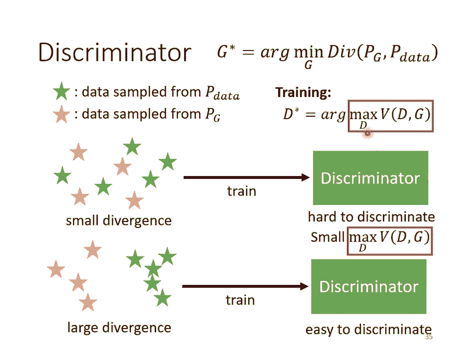

# P15：L12.2- 生成式对抗网络2：理论介绍与WGAN - ShowMeAI - BV1fM4y137M4

剛才用了一堆比喻，告訴你GAN是怎麼運作的，也實際上告訴你GAN的操作是怎麼操作的。接下來我們要講一點理論的部分，講一點農場文不會講到的部分，告訴你說實際上為什麼GAN的這一番操作。

為什麼這個generator跟discriminator的互動可以讓我們的generator產生像是真正的人臉的圖片，這背後的互動在做的到底是什麼樣的事情。那我們先來弄清楚我們今天訓練的目標到底是什麼。

你知道我們在訓練network的時候，你就是要訂一個loss function嘛，訂完以後用gradient descent去調你的參數，去minimize那個loss function，就結束了。

那在這個generation的問題裡面，到底我們要minimize的或者是我們要maximize的到底是什麼樣的東西呢？我們要把這件事弄清楚，才能夠做接下來的事情。那在generator裡面。

我們到底想要minimize或者是maximize什麼樣的東西呢？我們想要minimize的東西是這個樣子的，我們有一個generator，給他一大堆的vector。

給他從normal distribution sample出來的東西，丟進這個generator以後，會產生一個比較複雜的distribution。這個複雜的distribution，我們叫他Pg。

然後我們有一堆的data，這個是真正的data，真正的data也形成了另外一個distribution，叫做pdata。我們期待Pg跟pdata越接近越好。

如果你一下子沒有辦法想像這個Pg、pdata是怎麼一回事的話，那我們用一維的狀況來跟大家說明。假設generator的input是一個一維的向量，generator的output也是一維的向量。

我們的真正的data也是一維的向量。那我們的normal distribution就長這個樣子，沒有問題。丟到generator以後，這邊這每一個點，假設你輸入五個點，這邊這每一個點，他的位置會改變。

你就產生一個新的distribution。那可能本來大家都集中在中間，通過這個generator，通過一個network裡面很複雜不知道做了什麼事情以後，這些點就分成兩邊。

所以你的distribution就變成這個樣子。而pdata是指真正的資料的分布，真正的資料的分布可能長這個樣子，他分兩邊的狀況是更極端的，左邊的東西比較多，右邊的東西比較少。

那你期待左邊這個分布跟右邊這個分布越接近越好。如果寫成式子的話，你可以寫成這個樣子，這邊這個div of pg 跟 pdata。

他指的意思就是pg 跟 pdata這兩個distribution之間的divergence。那divergence這邊指的是什麼意思呢？divergence這邊指的意思就是。

你可以想成是這兩個distribution之間的某種距離。如果這個divergence越大，就代表這兩個distribution越不像，divergence越小。

就代表這兩個distribution越相近。divergence就是衡量兩個distribution相似度的一個measure。然後我們現在的目標是要去找一個generator。

所謂的找一個generator，實際上骨子裡做的事情是找一個generator裡面的參數，找一組generator裡面的參數。generator也是一個network。

裡面有一大堆的weight跟bias，找一組generator的參數，他可以讓我們產生出來的pg 跟 pdata之間的divergence越小越好。我們要找的就是這樣子的generator。

我們這邊把它寫作Gspot。所以我們這邊要做的事情跟一般的train network其實非常的像，我們第一堂課就告訴你說，我們定義了loss function，找一組參數。

minimize loss function。我們現在其實也定義了我們的loss function，在generation這個問題裡面。

我們的loss function就是pg 跟 pdata的divergence，就是他們兩個之間的距離，他們兩個越近，就代表產生出來的pg 跟 pdata越像。所以pg 跟 pdata。

我們希望他們越相像越好，所以我們希望pg 跟 pdata的divergence越小越好，我們要做的事情就是找一個距離，讓divergence變得最小。但是我們這邊遇到一個困難的問題，怎麼樣困難的問題呢？

這個loss我們是可以算的，但是這個divergence要怎麼樣算呢？你可能知道一些divergence的式子，比如說KL divergence，比如說JS divergence。

這些divergence用在這種continuous distribution上面，你要做一個很複雜的，在實作上你幾乎不知道要怎麼算的積分。我們根本就無法把這個divergence算出來。

我們算不出這個divergence，我們又要如何去找一個g，去minimize這個divergence呢？這個就是GaN所遇到的問題，這就是我們在train這種generator的時候會遇到的問題。

而GaN是一個很神奇的做法，它可以突破我們不知道怎麼計算divergence的限制。

所以我們現在遇到的問題就是，不知道怎麼計算divergence。而GaN告訴我們的就是，只要你知道怎麼從Pg和Pdata這兩個distribution sample東西出來。

就有辦法算divergence。你不需要知道Pg跟Pdata實際上的formulation長什麼樣子，你只要能夠sample，就能夠算divergence。而Pg跟Pdata是可以sample的嗎？

是可以sample的。怎麼從真正的data裡面sample出東西來呢？你就把你的圖庫拿出來，從圖庫裡面隨機sample一些圖片出來，你就得到Pdata了。

那怎麼從generator裡面產生一些東西出來呢？那你就把你的generator，從normal distribution sample出來的vector，丟到generator裡面。我們剛才說過說。

你這邊的distribution，你拿來sample這個distribution，要是簡單的，要是你有辦法sample的，所以我們選normal distribution。我們是知道的。

是有辦法sample的，我們從normal distribution裡面sample一堆vector出來，丟給generator，讓generator產生一堆圖片出來。

這些圖片就是從Pg sample出來的結果。所以我們有辦法從Pg做sample，我們有辦法從Pdata做sample。接下來，Gan這整個系列的work就是要告訴你說。

怎麼在只有做sample的前提之下，我根本不知道Pg跟Pdata實際上完整的formulation長什麼樣子，在只能做sample的前提之下，居然就算出了，居然就估測出了divergence。

那這個就是要靠discriminator的力量。我們剛才講過說discriminator是怎麼訓練出來的呢？我們有一大堆的real data。

這個real data就是從Pdatasample出來的結果。我們有一大堆generated data，generated data就可以看作是從Pgsample出來的結果。

根據real data跟generated data，我們會去訓練一個discriminator。訓練的目標是看到real data就給他比較高的分數。

看到generated data就給他比較低的分數。我們剛才就說discriminator訓練的目標就是要分辨好的圖跟不好的圖，分辨真的圖跟生成的圖，所以看到真的圖給他高分，看到生成的圖給他低分。

那實際上剛才講的，你也可以把它寫成式子，把它當作是一個optimization的問題。這個optimization的問題是這樣子的，我們要訓練一個discriminator。

這個discriminator可以去maximize某一個function，這邊叫做objective function，就是我們要maximize的東西，我們會叫objective function。

而如果要minimize，我們就會叫他loss function。我們現在要找一個d，他可以maximize這個objective function。

這個objective function長什麼樣子呢？這個objective function長這個樣子。我們有一堆y，他是從p data裡面sample出來的，也就是他們是真正的image。

而我們把這個真正的image丟到d裡面得到一個分數再去load。那另外一方面呢，我們有一堆y，他是從pg，從generator所產生出來的。這些圖片也丟到discriminator裡面得到一個分數。

再去load1-d(y)。那我們希望這個objective function b越大越好。我們希望b越大越好，意味著我們希望這邊的d(y)越大越好。我們希望y如果是從p data sample出來的。

他就要越大越好。我們希望說如果y是從pg sample出來的，他就要越小越好。那我們就去最大化b這個式子，找一個d可以maximize這個objective function。

我們其實就是讓d(y)越大越好，讓這邊的d(y)，也就是generator生成的圖片的值越小越好。discriminator output的值越小越好。

那這件事情其實又等同於你可能覺得沒事突然寫出這個式子有點奇怪。那你不一定要把這個objective function寫成這個樣子，他完全可以有其他的寫法。那最早年之所以寫成這個樣子是有一個很明確的理由。

有一個很明確的動機，是為了要把discriminator跟binary的classification，跟分類，跟二元的分類扯上關係。怎麼說呢？

事實上這個objective function他就是cross entropy成一個負號。我們知道我們在訓練一個classifier的時候，我們就是要minimize cross entropy。

所以當我們maximize這個objective function，maximize cross entropy成一個負號的時候，其實等同於minimize cross entropy。

也就等同於是在訓練一個classifier。所以這個discriminator真的做的事情，如果discriminator做的事情是去maximize這個objective function。

那這個discriminator其實可以當作是一個classifier。他做的事情就是把藍色這些點從p data sample出來的真實的image當作class1。

把從pg sample出來的這些假的image當作class2。有兩個class的data，訓練一個binary的classifier，訓練完就等同於是解了這個optimization的問題。

那這邊最神奇的地方是以下這句話。這一個式子，這個紅框框裡面的數值，他跟js divergence有關。事實上有趣的事情是，我覺得最原始的Gantt的paper。

他的發想可能真的是從binary classifier來的。一開始是把discriminator寫成binary classifier，然後有了這樣的objective function。

然後再經過一番推導以後，這個objective function，他的maximum，就是你找到一個d可以讓這個objective function，他的值最大的時候。

這個最大的值跟js divergence是有關的，他們沒有完全一模一樣。所以顯然一開始並不是針對js divergence設計的，而是經過一番推導以後，發現他們是非常有關聯的。至於實際上的推導過程。

你可以參見原始Ian Goodfellow寫的文章，其實裡面的推導過程，我覺得寫得算是蠻清楚的。真正神奇的地方就是，這一個objective function的最大值，他跟divergence是有關的。

所以我們剛才說，我們不知道怎麼算divergence，沒關係，train你的discriminator，train完以後，看看他的objective function可以到多大。

那個值就跟divergence有關。

這邊我們並沒有把證明拿出來跟大家講，但是我們還是可以從直觀上來理解一下，為什麼這個objective function的值會跟divergence有關呢？這個直觀的理解並沒有很困難，因為你可以想想看。

假設Pg跟Pdata，他的divergence很小，也就是Pg跟Pdata很像，他們差距沒有很大，他們很像Pg跟Pdatasample出來的藍色的星星跟紅色的星星，他們是混在一起的。

這個時候discriminator來說，discriminator就是在train一個binary classifier嘛，discriminator來說，既然這兩堆資料是混在一起的，那就很難分開。

這個問題很難。所以既然這個問題很難，你在解這個optimization problem的時候，你就沒有辦法讓這個objective的值非常的大。所以這個objective。

這個v的maximum的值就比較小，所以小的divergence對應到小的objective function的maximum的值。所以不是objective function的值本身。

是objective function在窮舉所有discriminator以後可以得到的最大的值。如果今天你的兩組data很不像，他們的divergence很大。

那對discriminator而言就可以輕易地把他分開。當discriminator可以輕易地把他分開的時候，這個objective function就可以衝得很大。

所以當你有大的divergence的時候，這個objective function的maximum值就可以很大。當然這邊是用直觀的方法來跟你講的。詳細的證明請參見GaN原始的paper。

裡面做了一些假設，比如說discriminator的capacity是無窮大等等的假設以後，可以做出這個maximum的值跟divergence相關的推導。

所以我們說我們本來的目標是要找一個generator去minimizePG跟PData的divergence的值，那我們卡在不知道怎麼計算divergence。那我們現在要知道。

我們只要訓練一個discriminator，訓練完以後，這個objective function的最大值就是這個divergence，就跟這個divergence有關。

那我們何不就把紅框框裡面這一項跟divergence做替換呢？我們何不就把divergence替換成紅框框裡面這一項呢？所以我們就有了這樣一個objective function。

這個objective function乍看之下有點複雜，它有一個minimum又有一個maximum，所以你不小心就會腦筋轉不過來。

我們是要找一個generator去minimize紅色框框裡面這件事，但是紅框框裡面這件事又是另外一個optimization problem。

它是在給定generator的情況下去找一個discriminator，這個discriminator可以讓v這個objective function越大越好。然後我們要找一個g，讓紅框框裡面的值最小。

這個g就是我們要的generator。而剛才我們講的這個generator跟discriminator互動，互相欺騙這個過程，其實就是想解這個有minimize又有maximize。

這個minmax的問題，就是透過下面這個我們剛才講的gain algorithm來解的。至於實際上為什麼下面這個algorithm可以解這個問題，你也可以參見原始的gain的paper。那講到這邊。

也許你就會問說，為什麼是jsDivergent，而且還不是真的jsDivergent，這跟jsDivergent相關而已。

怎麼不用真正的jsDivergent，或不用別的比如說ailDivergent，你完全可以這麼做。你只要改了那個objective function，你就可以量各式各樣的divergence。

至於怎麼樣設計objective function，得到不同的divergence，那有一篇叫做FGAME的paper裡面，有非常詳細的證明，他有很多的table告訴你說，不同的divergence。

要怎麼設計他的objective function，你設計什麼樣的objective function，去找他的maximum value，就會變成什麼樣的divergence。他在這篇文章裡面。

都有詳細的記載。所以一開始有人會覺得說，gain之所以沒有很好train，也許是因為我們沒有在真的minimizejsDivergent，但是有了這個FGAME的paper以後，他就告訴你說。

我們有辦法minimizejsDivergent，但就算你真的可以minimizejsDivergent，結果也還是沒有很好，gain還是沒有很好train。

所以gain是以不好train而聞名的，所以俗話就說，no pain， no gain，我們就要講一些gain訓練的小技巧。gain有什麼樣訓練的小技巧呢？其實gain訓練的小技巧非常非常多。

我想了很久以後，我們只挑一個最知名的來講，這個最知名的，很多人都聽過，(電話響聲)，這個最知名的，很多人都聽過的WGAN。這個WGAN是什麼呢？在講WGAN之前。

我們先講jsDivergent有什麼樣的問題。在最早的GAMES說，我們要minimize的是jsDivergent。那選擇jsDivergent的時候會有什麼問題呢？

在講jsDivergent的問題之前，我們先看一下pg跟pdata有什麼樣的特性。那pg跟pdata有一個非常關鍵的特性是，pg跟pdata他們重疊的部分往往非常少。怎麼說呢？這邊有兩個理由。

第一個理由是來自於data本身的特性。因為pg跟pdata他們都是要產生圖片。那圖片其實是高維空間裡面的一個低維的manifold。怎麼知道圖片是高維空間裡面低維的manifold呢？因為你想想看。

你在高維空間裡面，隨便sample一個點，他通常都沒有辦法構成一個二次元人物的頭像。所以二次元人物的頭像的分佈，在高維的空間中其實是非常狹窄的。所以二次元頭像的分佈，這個圖片的分佈。

其實是高維空間中的低維的manifold。或者是，如果是以二維空間來想的話，那圖片的分佈可能就是二維空間的一條線。二維空間中多數的點都不是圖片，就高維空間中隨便sample一個點都不是圖片。

只有非常小的範圍sample出來，他會是圖片。所以從這個角度來看，從資料本身的特性來看，PG跟PData，他們都是low dimensional的manifold。用二維空間來講。

PG跟PData都是二維空間中的兩條直線。而二維空間中的兩條直線，除非他剛好重合，不然他們相交的範圍幾乎是可以忽略的。這是第一個理由。也許有人說。

也許圖片根本就不是low dimensional的manifold，那會不會第一個理由就不成立了呢？那我給你第二個理由。第二個理由是，我們從來都不知道PG跟PData長什麼樣子。

我們對PG跟PData分佈的理解，其實來自於sample。所以也許PG跟PData，他們是有非常大的overlap的範圍。但是我們實際上在了解PG跟PData，在計算他們的divergence的時候。

我們是從PData裡面sample一些點出來，從PG裡面sample一些點出來。如果你sample的點不夠多，你sample的點不夠密，那就算是這兩個divergence實際上。

這兩個distribution實際上有重疊，但是假設你sample的點不夠多，對discriminator來說，他也是沒有重疊的。就是這個藍色的分佈跟紅色的分佈明明是有重疊的。

但如果你從藍色的分佈sample一些點，紅色的分佈sample一些點，你又sample的不夠多，你根本就可以畫一條楚河漢界，把紅色的點跟藍色的點完全的分開來，然後說紅色的點。

他的分佈就是在楚河漢界的右邊，藍色的點就是在左邊，他們完全是沒有任何重疊的。所以以上給你兩個理由，試圖說服你說PG跟PData這兩個分佈，他們重疊的範圍是非常小。

而幾乎沒有重疊這件事情，對於JS divergence會造成什麼問題呢？JS divergence有一個特性，是兩個沒有重疊的分佈，JS divergence算出來就永遠都是log2。

不管這兩個分佈長什麼樣子。所以兩個分佈只要沒有重疊，算出來就一定是log2，不管他們長什麼樣子，算出來都是log2。所以舉例來說，假設這是你的PData，這是你的PG，假設他們都是一條直線。

然後中間有很長的距離，你算他們的JS divergence是log2。假設你的PG跟PData其實蠻接近的，中間的間隔其實是比較小的，算出來結果還是log2。除非你的PG跟PData有重合。

不然這個PG跟PData只要他們是兩條直線，他們這兩條直線沒有相交，那算出來就是log2。假設這個case算出來是log2，這個case算出來也是log2。但是明明這個case就比這個case好啊。

中間這個case，中間這個generator，明明就比左邊這個generator好啊，但是你不知道。明明藍色的線就跟紅色的線比較近啊，但是從JS divergence上面，看不出這樣子的現象。

那既然從JS divergence上看不出這樣子的現象，你在training的時候，你根本就沒有辦法把這樣子的generator，update參數變成這樣子的generator。因為對你的loss來說。

對你的目標來說，這兩個generator是一樣好，或者是一樣糟的。那以上是從比較理論的方向來說明，如果我們從更直觀的實際操作的角度來說明，你會發現當你是用JS divergence的時候。

也就假設你今天在train一個binary的classifier，去分辨real的image跟generated的image，你會發現實際上你通常train完以後，正確率幾乎都是百分之百。為什麼？

因為你sample的圖片根本就沒幾張啊。對你的discriminator來說，你sample256張real的圖片，256張fake的圖片，他直接用硬背的都可以把這兩組圖片分開，知道說誰是real的。

誰是fake的。所以實際上如果你有自己train過game的話，你會發現如果你用binary的classifiertrain下去，你會發現你幾乎每次train完你的classifier以後。

也就你train完你的discriminator以後，正確率都是100%。我們本來會期待說這個discriminator的loss，也許代表了某些事情。

這個binary classifier loss也許代表某些事情，這個loss越來越大代表問題越來越難，代表我們的generated的data跟real的data越來越接近。實際上你在實際操作的時候。

你根本觀察不到這個現象，這個binary classifier訓練完的loss根本沒有什麼意義，因為他總是可以讓他的正確率變到100%，兩組image都是sample出來的。

他硬背都可以得到100%的正確率，你根本就沒有辦法看出你的generator有沒有越來越好。所以過去，尤其是在還沒有Wgame這樣的技術。

在我們還用binary classifier當作discriminator的時候，train game就很像巫術、黑魔法，你根本就不知道你train的時候有沒有越來越好。所以怎麼辦呢？那時候的做法就是。

你每次update幾次generator以後，你就要把你的圖片print出來看，然後你就要一邊吃飯一邊看圖片生成的結果，然後跑一跑就發現，哇，壞掉了，然後卡掉重做這樣子。所以以前你根本就沒有。

不像我們在train一般的network的時候，你有一個loss function，然後那個loss隨著訓練的過程會慢慢慢慢變小，那你就會看說loss慢慢變小。

你就放心知道你的network有在train。當然會不會overfitting是另外一件事，至少他在training data上有越來越好。但是對game而言。

本來我們期待classifier的loss可以提供一些資訊，但是當你的classifier是一個簡單一般的binary classifier的時候，他訓練的結果就沒有任何資訊。

你每次訓練出來正確率都是100%，你根本不知道你的generator有沒有越來越好，變成你只能夠用人眼看，用人眼守在電腦前面看，發現結果不好，卡掉，重新用一組hyperparameter。

重新調一下network架構重做。所以過去訓練game是有點辛苦的。

那既然是JS divergence的問題，於是有人就想說，那會不會換一個衡量兩個distribution的相似程度的方式，換一種divergence就可以解決這個問題了呢？

於是就有了使用VersusStandDistance的想法。那VersusStandDistance這邊有一個冷知識，就是這個W，其實這邊是念ver，不是發W的音，不是念VersusStand。

而是念VersusStand。那這個VersusStandDistance是怎麼計算的呢？VersusStandDistance的想法是這個樣子，假設你有兩個distribution。

一個distribution我們叫它P，另外一個distribution我們叫它Q。VersusStandDistance它計算的方法，就是想像你在開一台推土機，推土機的英文叫做EarthMover。

想像你在開一台推土機，那你把P想成是一堆土，把Q想成是你要把土堆放的目的地。那這個推土機把P這邊的土挪到Q所移動的平均距離，就是VersusStandDistance。在這個例子裡面。

我們假設P都集中在這個點，Q都集中在這個點。對推土機而言，假設它要把P這邊的土挪到Q這邊，那它要平均走的距離就是D。所以在這個例子裡面，假設P集中在一個點，Q集中在一個點，這兩個點之間的距離是D的話。

那P跟Q的VersusStandDistance就是D。那因為在講這個VersusStandDistance的時候，你要想像有一個EarthMover，有一個推土機在推土。

所以其實VersusStandDistance就叫EarthMoverDistance。但是呢，如果是更複雜的distribution。

你要算VersusStandDistance就有點困難了。怎麼說呢？假設這是你的P，假設這是你的Q。假設你開了一個推土機，想要把P把它重新塑造一下形狀，讓P的形狀跟Q比較接近一點。那有什麼樣的做法呢？

你會發現說，你可能的Moving Plan，就是你把P重新塑造成Q的方法，有無窮多種。你可以說，我把這邊的土搬到這裡來，我把這邊的土搬到這裡來，把P變成Q。

那你也可以捨近求遠說，我把這裡的土搬到這裡來，把這裡的土搬到這裡來，捨近求遠一樣還是可以把P變成Q。所以當我們考慮比較複雜的distribution的時候，把P變成Q的方法是有非常非常多不同的方法的。

你有各式各樣不同的Moving Plan。用不同的Moving Plan，你算出來的距離，你推土機平均走的距離就不一樣啊。在左邊這個例子裡面，推土機平均走的距離比較少。在右邊這個例子裡面，因為捨近求遠。

推土機平均走的距離比較大。難道這個P跟Q之間的Vessel Stand Distance，會根據你的不同的方法，不同的推土機行進的方法，就算出不同的值嗎？

為了讓Vessel Stand Distance只有一個值，所以這邊Vessel Stand的定義是窮取所有的Moving Plan，然後看哪一個推土的方法，哪一個Moving的計劃。

哪一個推土的計劃可以讓平均的距離最小。那個最小的值才是Vessel Stand Distance。所以會窮取所有把P變成Q的方法，然後看哪一個推土的平均距離最短。

選最短的那個距離當作是Vessel Stand Distance。所以其實要計算Vessel Stand Distance是挺麻煩的，你會發現說，光我只是要計算一個Distance。

我居然還要解一個Optimization的問題，解錯這個Optimization的問題，才能算Vessel Stand Distance。

好，那我們先不講怎麼計算Vessel Stand Distance這件事，我們先來講假設我們能夠計算Vessel Stand Distance的話，它可以帶給我們什麼樣的好處呢？那假設Pg跟Pdata。

他們的距離是D0，那在這個例子裡面，Vessel Stand Distance算出來就是D0。在這個例子裡面，Pg跟Pdata，他們之間的距離是D1，那Vessel Stand算出來的距離就是D1。

那假設D1比較小，D0比較大，那算Vessel Stand的時候，這個Case的Vessel Stand就比較小，這個Case的Vessel Stand就比較大。所以我們就可以知道說。

由左向右的時候Vessel Stand是越來越小的，所以如果你觀察Vessel Stand的話會知道說，從左到右，我們的Generator越來越進步。但是如果你觀察Discriminator。

而且你觀察不到任何東西，對Discriminator而言，這邊每一個Case算出來的Jace Divergence都是一樣的，都是一樣好或一樣差，但是如果換成Vessel Stand Distance。

由左向右的時候，我們會知道說，我們的Discriminator，我們的Generator，做得越來越好。所以我們換一個計算Divergence的方式。

我們就可以解決Jace Divergence有可能帶來的問題。

這讓我想到什麼呢？這又讓我想到一個演化的例子，就是眼睛的生成。右邊這個是人類的眼睛，人類的眼睛是非常複雜的。有一些生物，他有非常原始的眼睛，比如說有一些細胞具備有感光的能力，這可以看作是最原始的眼睛。

但是這些最原始的眼睛，怎麼變成最複雜的眼睛呢？這對人類來說其實覺得非常難想像，這麼簡單只是一些感光的細胞，在皮膚上經過突變產生一些感光的細胞，聽起來像是合理的。但是天擇突變。

怎麼可能產生這麼複雜的器官呢？怎麼產生眼睛這麼精巧的器官呢？如果你直接覺得說，從這個地方就可以一步跳到這個地方，那根本不可能發生。但是中間其實是有很多連續的步驟的。

從感光細胞到眼睛，中間其實是有連續的步驟的。舉例來說，感光的細胞可能會出現在一個比較凹陷的地方，皮膚凹陷下去，這樣感光細胞就可以接受來自不同方向的光源。後來覺得說，乾脆把凹陷的地方蓋起來。

後來覺得蓋起來的地方裡面可以放一些液體，最後就變成了人的眼睛。從這邊跳到這邊這一步非常大，但是這邊每一小步都可以讓生命存活的機率變大，都可以讓生命繁衍下去的機率變高。

既然這邊每一個步驟都可以讓生命繁衍的機率變高，那生命就可以從左邊一直演化到右邊，最終產生複雜的器官。而我覺得對於當你使用WGAN。

當你使用Versus Stain Distance來衡量你的Divergence的時候，其實就製造了類似的效果。PGE0跟P-DATA非常的遙遠，你要它一步從這裡跑到這裡，一步從這裡跑到這裡。

讓PGE0跟P-DATA直接Align在一起，是不可能的，可能非常的困難。對JS Divergence而言，它需要做到直接從這一步跳到這一步，它的JS Divergence的Low才會有差異。

但是對W Distance而言，你只要每次有稍微把PGE往P-DATA挪近一點，W Distance就會有變化。W Distance有變化。

你才有辦法Train你的Generator去Minimize W Distance。所以這就是為什麼，當我們從JS Divergence換成Versus Stain Distance的時候。

可以帶來的好處。好，那WGAN實際上就是用，當你用Versus Stain Distance來取代JS Divergence的時候，這個GAN就叫做WGAN。那接下來你會遇到的問題就是。

Versus Stain Distance要怎麼算呢？P-DATA跟P-G，它的Versus Stain Distance要怎麼計算呢？Versus Stain Distance是一個非常複雜的東西。

我光要算個Versus Stain Distance，還要解一個Optimization的問題，實際上要怎麼計算？那這邊就不講過程，直接告訴你結果。解下面這個Optimization的Problem。

解出來以後，你得到的值就是Versus Stain Distance，就是P-DATA跟P-G的Versus Stain Distance。那這邊我發現我犯了一個小小的錯誤，是什麼樣小小的錯誤呢？

就是這邊的X可能都把它改成Y，會跟前面的投影片比較質啦。所以這邊的X在前面的投影片裡面，其實都是Y，他們指的都是一張圖片，而不是他們指的都是Navwall的輸出，而不是Navwall的輸入。好。

那這個式子裡面有什麼樣的東西呢？我們就觀察一下這個式子。裡面有說，X如果是從P-DATA來的，那我們要計算它的D(X)的期望值。X如果是從P-G來的，我們計算它的D(X)的期望值，但是前面存上一個不好。

所以如果你要Maximize這個Objective Function，你會達成什麼樣的效果？你會達成，如果X是從P-DATA Sample出來的。

D(X)就Discriminator的Output要越大越好。如果X是從P-G從Generator Sample出來的，D(X)也就是Discriminator的Output應該要越小越好。

但是這邊還有另外一個限制，它不是光叫你把這裡大括號裡面的值變大就好，還有一個限制是，D不能夠是一個隨便的Function，D必須要是一個One-Lipsed的Function。可能會問說。

One-Lipsed是什麼東西呢？如果你不知道是什麼的話，也沒有關係，我們這邊你就想成D必須要是一個足夠平滑的Function。它不可以是變動很劇烈的Function。

它必須要是一個足夠平滑的Function。那為什麼足夠平滑這件事情是非常重要的呢？我們可以從直觀來理解它。假設這個是真正的資料的分布，這是Generated資料的分布，如果我們沒有這個限制。

只看大括號裡面的值的話，大括號裡面的目標是要這些真正的值，它的D(X)越大越好。那要讓Generated的值，它的D(X)越小越好。如果你沒有做任何限制，只單純要這邊的值越大越好，這邊的值越小越好。

在藍色的點跟綠色的點，也就是真正的Image跟Generated的Image，沒有任何重疊的情況下，你的Discriminator會做什麼？它會給Real的Image無限大的正值。

給Generated的Image無限大的負值。所以你這個Training根本就沒有辦法收斂，而且你會發現說，只要這兩堆Data沒有重疊，你算出來的值都是無限大，你算出來的這個Maximum值都是無限大。

這顯然不是我們要的，這不就跟JS Divergence的問題一模一樣嗎？所以這邊你需要加上這個限制，其實你要加上這個限制以後，你這個Maximum的值才會是Vector State Distance。

才是做W-Gain。那為什麼加上這個限制就可以解決剛才的問題呢？因為這個限制是要求Discriminator不可以太變化劇烈，它必須要夠平滑。那今天如果你要求你的Discriminator夠平滑的時候。

假設Real Data跟Generated的Data他們距離比較近，那你就沒有辦法讓Real的Data值非常大，然後Generated的值非常小。因為如果你讓Real的值非常大。

Generated的值非常小，他們中間的差距很大，那這個Discriminator變化就很劇烈嘛，它就不平滑了，它就不是One Distance了。那為了要是One Distance。

這邊的值沒辦法很大，這邊的值沒辦法很小。如果Real跟Generated的Data差距離很遠，那他們的值就可以差很多，這邊算出來的值就會比較大，你的Vector String Distance就比較大。

如果Real跟Generated很近，就算他們沒有重合，因為有了這個限制，有了這個寫在Max下面的One Distance Function的限制。

因為有One Distance Function的限制，所以Real Data的值跟Generated Data的值就沒有辦法差很多，那算出來的Vector String Distance就會比較小。

那接下來的問題就是，怎麼做到這個限制呢？怎麼確保Discriminator一定符合One Distance Function的限制呢？最早剛提出WGAN的時候，其實沒有什麼好想法，只知道寫出了這個式子。

那要怎麼真的解這個式子呢？有點困難，所以最早的一篇WGAN的Paper，最早使用Vector String的那篇Paper，他說了，他做了一個比較Rough，比較粗糙的處理方法，他是說。

我就Train一個Network，那Train一個Network的時候，如果我Train的參數，我就要求它Bound在C跟-C之間，如果超過C。

就Gradient Descent Update以後超過C就設為C，Gradient Descent Update以後小於-C就直接設為-C。

那其實這個方法並不一定真的能夠讓Discriminator變成One Distance Function，但你可以想像說，這個方法也許真的可以讓我們的Discriminator比較平滑。

但他並沒有真的去解這個Optimization的Bubble，他並沒有真的讓Discriminator符合這個限制。所以接下來就有其他的想法啦，有一個想法叫做Gradient Penalty。

Gradient Penalty是出自ImproveWGAN這篇Paper，那ImproveWGAN這篇Paper是說，假設這個是你的Real Data的分布，這個是你的Fake Data的分布。

那我在Real Data這邊取一個Sample，Fake Data這邊取一個Sample，兩點連線中間再取一個Sample，我要求這個點，它的Gradient要接近1。那你可能會覺得說。

不知道在說些什麼這樣，這件事情的關係跟這個限制的關係到底是什麼呢？那就詳盡ImproveWGAN的Paper。那其實我覺得你現在也不一定要真的非常較真說。

這件事情Gradient Penalty跟這個限制之間的關係，因為其實有更多其他的方法真的可以去解這個問題。那其實後來ImproveWGAN之後，還有什麼Improve的ImproveWGAN。

真的有這篇Paper，他就是把這個限制再稍微改一改，又有另外一篇Paper就叫Improve的ImproveWGAN。那今天其實你有一個方法，真的把D限制讓它是One List Function。

這個叫做Spectral Normalization，那我就把它的論文放在這邊給大家參考。那如果你要Train真的非常好的Gantt，你可能會需要用到Spectral的Normalization。

講到這邊，正好告一個段落，那我看也快6點20了，我們就停在這邊好了。我們就看看大家有沒有問題要問，那如果你沒有問題的話，你就可以先離開了。好，請說。(觀眾)，好，我們從實作跟理論兩個方向來考慮。

如果今天我們看的是理論的話，理論是要量現在的Generator Output跟真正Data之間的距離，所以你不需要去管之前的東西，你只要看現在的Generator Output就好了。

這個是理論上的做法。但是實作上，你確實可以把過去的資料也加進來。那過去的資料加進來的好處可能是，我現在Generator只Generate一部分的資料。

那過去的資料比較多的都已經Generate在那裡了，那我把過去的資料再加上來，我資料比較多，也許我訓練出來的結果會比較Robust。所以把過去的資料加進來，這樣子的想法是真的有人會做的。

算是一個Train-Gantt的Tip。而且其實這邊你有沒有發現一個問題就是，我們今天因為我們說我們Train那個Discriminator，Maximum的值就代表了我們的Divergence嘛。

那其實照理說我們每次Discriminator應該都是重Train的，對不對，我們每次就是重新去Initialize一個Discriminator，重新去訓練，但是在實作上沒有任何人是這麼做的。

因為實際上我們在Update Discriminator的時候，我們並沒有辦法真的跑很多Iteration，本來理論上應該是跑跑跑，跑到Discriminator真的收斂為止，但實際上沒有人要這麼做。

因為你每次如果Discriminator都要跑到收斂，才Update一次Generator，太花時間了，沒有人這麼做，所以變成實際上的做法都是Discriminator只Update幾次。

就要輪到GeneratorUpdate，所以Discriminator其實Update的次數是非常的少的，我們並沒有辦法真的去Maximize那個Objective Function。

所以變成說我們Discriminator都不是重頭Train的，它的參數都是從前一個Iteration繼承過來的，它都是從前一個Iteration再重新Train起。

所以這裡就是有很多理論跟實作上有歧異的地方。這樣有回答到你的問題嗎？好，就大家有事就可以先走啊，如果有問題的話就歡迎你留下來問。好，你還有沒有問題想問呢？大家有問題要問嗎？欸你說？(觀眾問)，沒。

先想一下，我剛才忘了附訴剛才那個同學的問題，那同學的問題是說，我們在訓練Discriminator的時候，能不能夠用之前Generator Sample出來的資料？(觀眾問)，好，沒關係，你慢慢來。

大家有事就可以先離開，沒有關係。(觀眾問)，欸欸，你請說啊。(觀眾問)，欸，找到一個比，我們要做的是Divergence的function其實是已經訂好的。

就比如說JsDivergence或是Wdistance，那個是我們事先訂好的。我們Training的目標是在這個固定好的Divergence的，讓它生成出來的東西跟自己要靠近。可是你剛才不是說。

因為這個Divergence其實比較難，或者是你生成出來的東西比較難，如果都可以計算的話，那我們就直接用傳統方法讓它生成出來的東西要遠遠的靠近。那就是今天要解釋的原因就是因為我們沒辦法直接計算。

所以我們等於是要找到一個Divergence的近伏，一個可以計算的近伏。就是這樣，就是這樣。(觀眾問)，你是說，我們剛才在講W-Gain的時候，我猜你就是指這一頁投影片，這個東西是什麼對不對？

這個東西解完，就這個Maximum的值，就是Versus and Distance。(觀眾問)，對，就是你把D圈完，然後這邊會得到一個Value嘛。

這個Value就是Versus and Distance。