# P17：L12.4- 生成式对抗网络4：CycleGAN - ShowMeAI - BV1fM4y137M4

好，那有關Gan的最後一段，我們要講一個Gan的神奇應用，這個是什麼樣神奇的應用呢？這個是把Gan用在Unsupervised Learning上。

你常常聽到說有人說Gan可以用在Unsupervised Learning上，現在就要告訴你說，這個Gan怎麼用在Unsupervised Learning，到目前為止。

我們講的幾乎都是Supervised Learning，我們要訓練一個Network，Network的輸入叫做X，輸出叫做Y，我們需要成對的資料，才有辦法訓練這樣子的Network。

但是你可能會遇到一個狀況是，我們有一堆X，我們有一堆Y，但X跟Y是不成對的，在這種狀況下，我們有沒有辦法拿這樣的資料來訓練Network呢？那像這種沒有成對的資料，我們就叫做Unlabeled資料。

沒有標註的資料，那至於怎麼使用這些沒有標註的資料呢？其實在作業3跟作業5裡面都提供給你兩個例子，那我們就把這個怎麼用沒有標註的資料。

怎麼做Semi-Supervised Learning這件事情放在作業裡面，那如果你有興趣的話，就可以來體驗一下，Semi-Supervised Learning到底可以帶來多大的幫助。

但是不管是作業3的Pseudo-Labeling，還是作業5的Back-Translation，這些方法或多或少都還是需要一些成對的資料，在作業3裡面，你得先訓練出一個模型。

這個模型可以幫你提供Pseudo-Labeling，如果你一開始根本就沒有太多有標註的資料，你的模型很差，你根本就沒有辦法產生比較好的Pseudo-Labeling。

或做Back-Translation，你也得有一個Back-Translation的Model，你才有辦法做Back-Translation，所以不管是作業3還是作業5的方法，都還是需要一些成對的資料。

但是假設我們遇到一個更艱鉅的狀況，是我們一點成對的資料都沒有，那要怎麼辦呢？那你可能會問說，什麼時候會一點成對的資料都沒有呢？我永遠可以找個工讀生還是或多或少幫我標一點資料吧。

只是可能不一定可以標很多而已，什麼時候會完全沒有成對的資料呢？我們這邊舉個例子，舉例來說，影像風格轉換，假設我們今天要訓練一個Deep Neural，他要做的事情是把X-Domain的圖。

X-Domain的圖我們假設是真人的照片，Y-Domain的圖是二次元人物的頭像，真人的頭像轉成二次元人物的頭像，這個叫做影像風格轉換，真人的頭像是X-Domain，二次元人物是Y-Domain。

把X-Domain的東西轉成Y-Domain的東西，這個是影像風格轉換，在這個例子裡面，我們可能就沒有任何的成對的資料，對不對？如果你要產生成對的資料，那你得先，比如說幫新元結衣拍個照片。

然後再把新元結衣二次元的版本畫出來，你才有辦法訓練內臥，那這個顯然實在是太昂貴了，工讀生也沒辦法做這件事情，所以影像風格轉換，你可能一點成對的資料都沒有，在這種狀況下，還有沒有辦法訓練一個內臥。

輸入一個X，產生一個Y呢？這個就是GAME可以幫我們做的事情，那接下來我們就是要看看，怎麼用GAME在這種完全沒有成對資料的情況下進行學習，好。

這個是我們之前在講Unconditional Generation的時候。

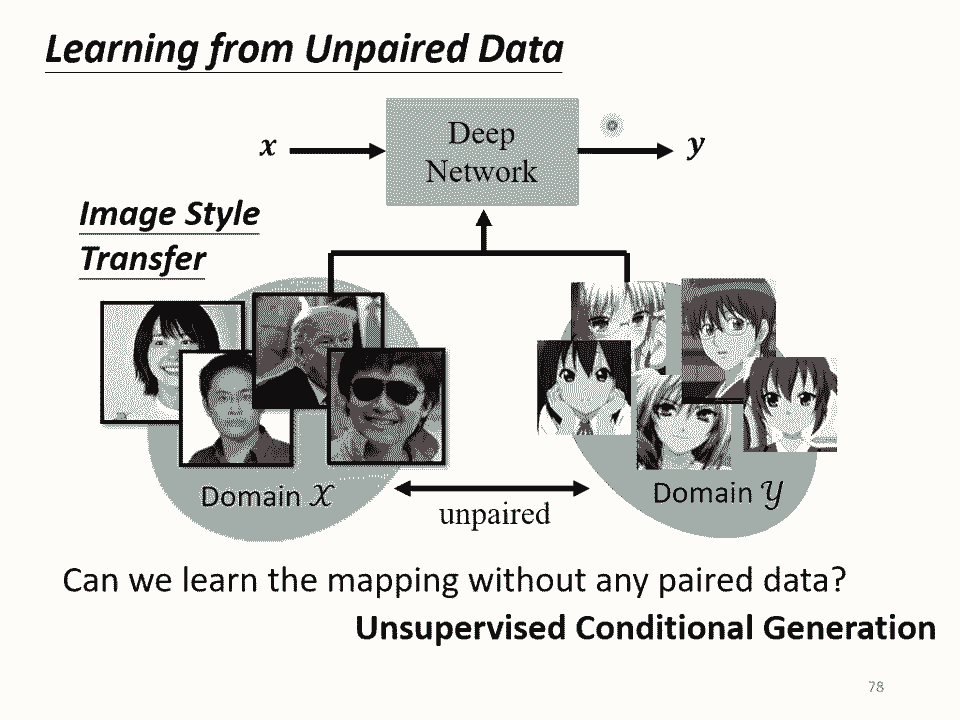

你看到的Generator架構，輸入是一個Gaussian的分布，輸出可能是一個複雜的分布，現在我們再稍微轉換一下我們的想法，輸入我們不說它是Gaussian的分布。

我們說它是X-domain圖片的分布，那輸出我們說是Y-domain圖片的分布，我們有沒有可能訓練這樣一個Generator，輸入是X-domain圖片的分布，輸出是Y-domain圖片的分布呢？

如果可以做到的話，其實就結束了，這個問題就結束了，就做出來了，你就訓練出一個Network，你可以給它一個X-domain的東西，讓它把它轉成Y-domain的東西。

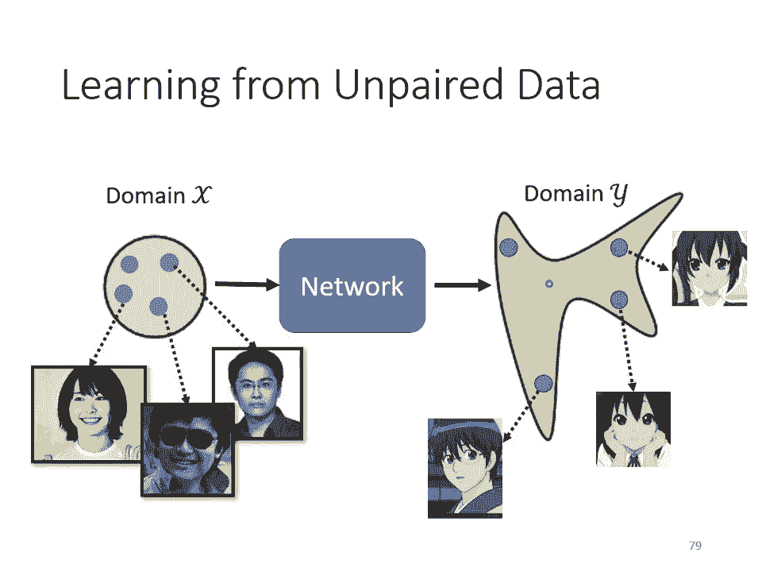

那有沒有辦法做這件事情呢？乍聽之下，好像沒有很難，你完全可以套用原來的GAME的想法，在原來的GAME裡面，我們說我們從Gaussian Sample一個向量，丟到Generator裡面。

那我們一開始也說，其實不一定要從Gaussian Sample，只要那個distribution是有辦法被Sample的就行了，我們選Gaussian只是因為Gaussian的formulation。

我們知道我們可以從Gaussian Sample，那我們現在如果輸入是X-domain的distribution，我們只要改成可以從X-domain Sample，就結束了。

那你有沒有辦法從X-domain Sample呢？可以，你就從人臉的照片裡面，真實的人臉裡面隨便挑一張出來，這是一個死臭栓仔，然後就結束了，你就可以從X-domain Sample照片出來。

你把這個照片丟到Generator裡面，讓它產生另外一張圖片，產生另外一個distribution裡面的圖片，那怎麼讓它變成是Y-domain的distribution呢？

那就需要養上一個Discriminator，那這個Discriminator給它看過很多Y-domain的圖，所以它能夠分辨Y-domain的圖，跟不是Y-domain的圖的差異。

看到Y-domain的圖就給它高分，看到不是Y-domain不是二次元人物就給它低分，那就這樣，結束了，那你說這個跟原來的Game的訓練有什麼不同？沒什麼不同，如果你想要自己在作業裡面做一下的話。

就記得說本來在作業裡面呢，這個Gaussian這個Generator的Input，你那個Sample是從那個Gaussian Distribution Sample出來。

現在記得換一個Sample的方法，從真人的人臉裡面Sample一張圖片出來，好像就結束了，但是你再仔細想想看，光是套用原來的Game訓練Generator跟Discriminator，好像是不夠的。

怎麼說呢？因為我們現在的Discriminator它要做的事情，是要讓這個Generator輸出一張Y-domain的圖，那Generator它可能真的可以學到輸出Y-domain的圖。

但是它輸出的Y-domain的圖，一定要跟輸入有關係嗎？你沒有任何的限制要求你的Generator做這件事啊，你的Generator也許就把這張圖片當作一個Gaussian的Noise。

然後反正它就是看到不管你輸入什麼，它都無視它，反正它就輸出一個像是二次元人物的圖片，Discriminator覺得它做得很好，其實就結束了，對不對？所以如果我們完全只套用一般的Game的做法。

只訓練一個Generator，這個Generator的Input Distribution從Gaussian變成X-domain的Image，然後訓練一個Discriminator，顯然是不夠的。

因為你訓練出來的Generator，它可以產生二次元人物的頭像，但是跟輸入的真實的照片，沒有什麼特別的關係，那這個不是我們要的，那怎麼辦呢？怎麼解決這個問題？怎麼強化輸入與輸出的關係呢？

那這個Generator完全無視輸入這件事，你會發現說我們在Conditional Game的時候，是不是也看過一模一樣的問題呢？在講Conditional Game的時候。

我們有特別提到說假設你的Discriminator只看Y，那它可能會無視Generator的輸入，那產生出來的結果不是我們要的，但是這邊如果我們要從Unpaired Data學習。

我們也沒有辦法直接套用Conditional Game的想法，因為在剛才講的Conditional Game裡面，我們是有成對的資料，我們可以用這些成對的資料來訓練Discriminator。

但今天現在我們沒有成對的資料了，我們根本沒有辦法拿出成對的資料，來告訴Discriminator說，怎麼樣的X跟Y的組合才是對的。

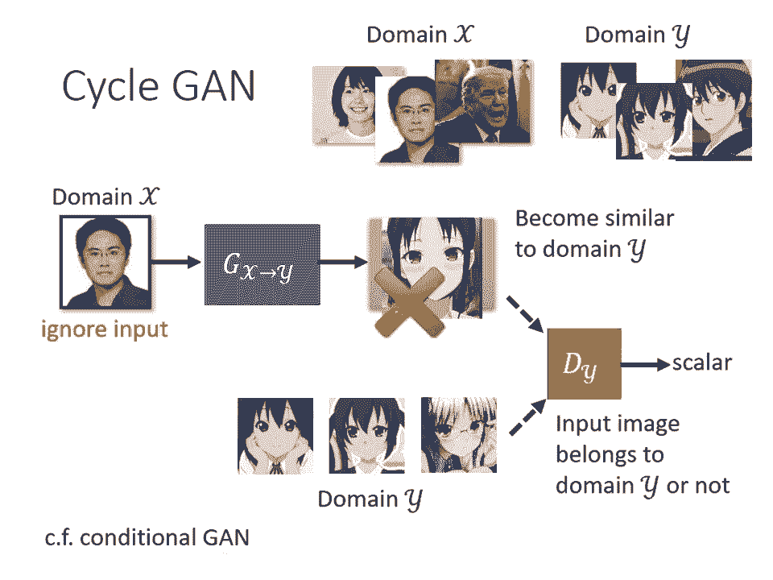

我們沒有這種資料了，怎麼辦呢？那這邊就用了一個想法叫做Cycle Game，在Cycle Game裡面我們會train兩個Generator，第一個Generator。

它的工作是把X-Domain的圖變成Y-Domain的圖，第二個Generator，它的工作是看到一張Y-Domain的圖，把它還原回X-Domain的圖，在訓練的時候，我們今天增加了一個額外的目標。

就是我們希望輸入一張圖片，從X-Domain轉成Y-Domain以後，要從Y-Domain轉回原來一模一樣的X-Domain的圖，經過兩次轉換以後，輸入跟輸出要越接近越好。

你說怎麼讓兩張圖片越接近越好呢？這個很簡單啦，就是一個圖片，其實就是一個向量對不對，兩張圖片就是兩個向量，這兩個向量之間的距離，就是讓這兩個向量之間的距離越接近越好，就是要讓兩張圖片越向越好。

因為這邊有一個循環，從X到Y再從Y回到X，它是一個Cycle，所以叫做Cycle Gain，這個要讓輸入經過兩次轉換以後，變成輸出，輸入跟輸出越接近越好，這叫做Cycle的Consistency。

所以現在這邊我們有三個Level，第一個Generator，它的工作是把X轉成Y，第二個Generator，它的工作是要把Y還原回原來的X，那這個Discriminator，它的工作仍然是要看。

藍色的這個Generator，它的輸出像不像是Y Domain的圖，那加入了這個橙色的，從Y到X的Generator以後，會有什麼不一樣的地方呢，對於前面這個藍色的Generator來說。

它就再也不能夠隨便亂做了，它就不能夠隨便產生亂七八糟，跟輸入沒有關係的人臉了，這邊假設輸入一個死臭酸宅，這邊假設輸出的是灰夜，對另外一個，不知道這是誰的，它是灰夜，這樣子好嗎，知道嗎 它是灰夜大小姐。

然後對第二個Generator來說，它就是吃這張灰夜作為輸入，它根本無法想像說，要把灰夜還原回死臭酸宅，它根本不知道說原來輸入的圖片，長什麼樣子，所以怎麼辦呢，對第一個Generator來說。

為了要讓第二個Generator，能夠成功的還原原來的圖片，它產生出來的圖片，就不能跟輸入差太多，所以這邊是一個死臭酸宅，這邊輸出至少也得是一個，戴眼鏡的男生的角色才行吧。

所以這邊是一個戴眼鏡男生的角色，這個是星巴，然後呢，這個第二個Generator，才能夠把這個角色還原回原來的輸入，所以如果你加Psychogang，你至少可以強迫你的Generator。

它輸出的Y-Domain的圖片，至少跟輸入的X-Domain的圖片，有一些關係，但講到這邊呢，你可能會有的一個問題就是，你這邊只保證，有一些關係啊，你怎麼知道，這個關係是我們要的呢。

機器有沒有可能學到很奇怪的轉換，輸入一個戴眼鏡的人，然後這個Generator學到的是，看到眼鏡就把眼鏡抹掉，然後把它變成一顆紙，然後這個Generator，第二個Generator橙色的學到。

就是看到紙就還原回眼鏡，這樣還是可以滿足Psychoconsistency啊，還是可以把輸入的圖片，變成輸出的圖片啊，我舉一個更極端的例子，假設第一個Generator學到的就是，把圖片反轉，左右翻轉。

第二個Generator，他也只要學到把圖片左右翻轉，你就可以還原了啊，所以今天如果我們做Psychogang，用Psychoconsistency，似乎沒有辦法保證，我們輸入跟輸出的人臉。

看起來真的很像，因為也許機器會學到很奇怪的轉換，反正只要第二個Generator，可以轉得回來就好了，那會不會有這樣的問題發生呢，確實有可能有這樣的問題發生，那有什麼樣特別好的解法呢。

目前沒有什麼特別好的解法，但我可以告訴你說，實際上你在使用Psychogang的時候，這樣子的狀況沒有那麼容易出現，所以你實際上使用Psychogang，你會發現輸入跟輸出，往往真的就會看起來非常像。

而且甚至在實作上，在實作的經驗上，你就算沒有第二個Generator，你不用Psychogang，那一般的Gang來做，這種圖片風格轉換的任務，你往往也做得起來，因為在實作上你會發現。

Navigate其實非常懶惰，他輸入一個圖片，他往往就想輸出，他擺Default就是想輸出很像的東西，他不太想把輸入的圖片，做太複雜的轉換，所以什麼眼鏡變成一顆痣這種狀況，他不愛這麼麻煩的東西。

有眼鏡就輸出眼鏡，可能對他來說是比較容易的抉擇，所以在真的實作上，這個問題沒有很大，輸入跟輸出會是像，但是在理論上，好像沒有什麼保證說，輸入跟輸出的圖片，一定要很像。

就算你加了Psychoconsistency，所以這個是實作與理論上，你可能會遇到的差異，總之雖然Psychogam沒有保證說，輸入跟輸出一定很像，但實際上你會發現，輸入跟輸出往往非常像。

你只是改變了風格而已，那這個Psychogam可以是雙向的，什麼意思呢，我們剛才有一個Generator，輸入Y-Domain的圖片，輸出X-Domain的圖片，那我們是先把X-Domain的圖片。

轉成Y再把Y轉回X，在訓練Psychogam的時候，你可以同時做另外一個方向的訓練，也就是你把這個橙色的Generator拿來，給他Y-Domain的圖片，讓他產生X-Domain的圖片，然後呢。

再把藍色的Generator拿來，把X-Domain的圖片，還原回原來Y-Domain的圖片，那你依然要讓輸入跟輸出，越接近越好，那你一樣要訓練一個Discriminator。

這個Discriminator是X-Domain的Discriminator，他是要看一張圖片，像不像是真實人臉的Discriminator，這個Discriminator要去看說。

這個橙色的Generator的輸出，像不像是真實的人臉，那這個橙色的Generator，他要去騙過這個DX，這個綠色的左邊這個Discriminator，這個合起來就是Psychogam。

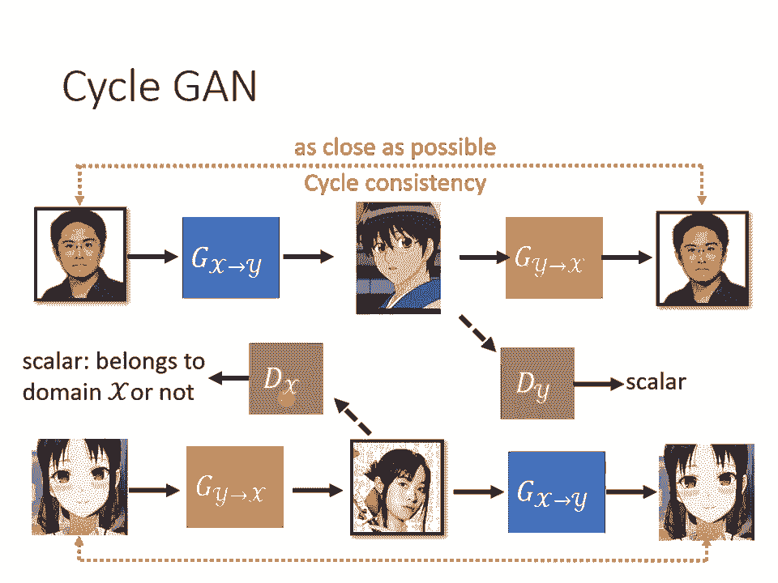

那除了Psychogam以外，你可能也提過很多其他的，可以做風格轉換的Gam，比如說Discogam，比如說Dualgam，跟Psychogam有什麼不同呢，就是沒有半毛錢的不同。

你可以發現Discogam，Dualgam跟Psychogam，其實是一樣的東西，他們是一樣的想法，神奇的事情是完全不同的團隊，在幾乎一樣的時間，提出了幾乎一模一樣的想法，你發現這三篇文章。

放到Archive上的時間，都是17年的3月，17年的4月跟17年的3月，不同的團隊，幾乎在一樣的時間，有了一樣的想法。

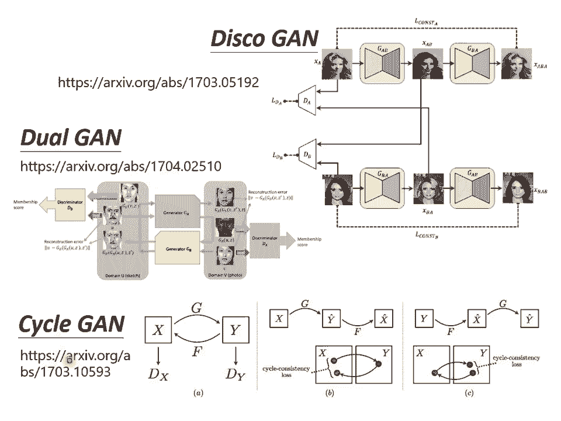

那除了Psychogam以外，還有另外一個更進階的，可以做影像風格轉換的版本，叫做Stargam，Psychogam只能在兩種風格間做轉換，那Stargam他厲害的地方是，他可以在多種風格間做轉換。

不過這個就不是，我們接下來想要細講的重點，我們就停在這個地方。

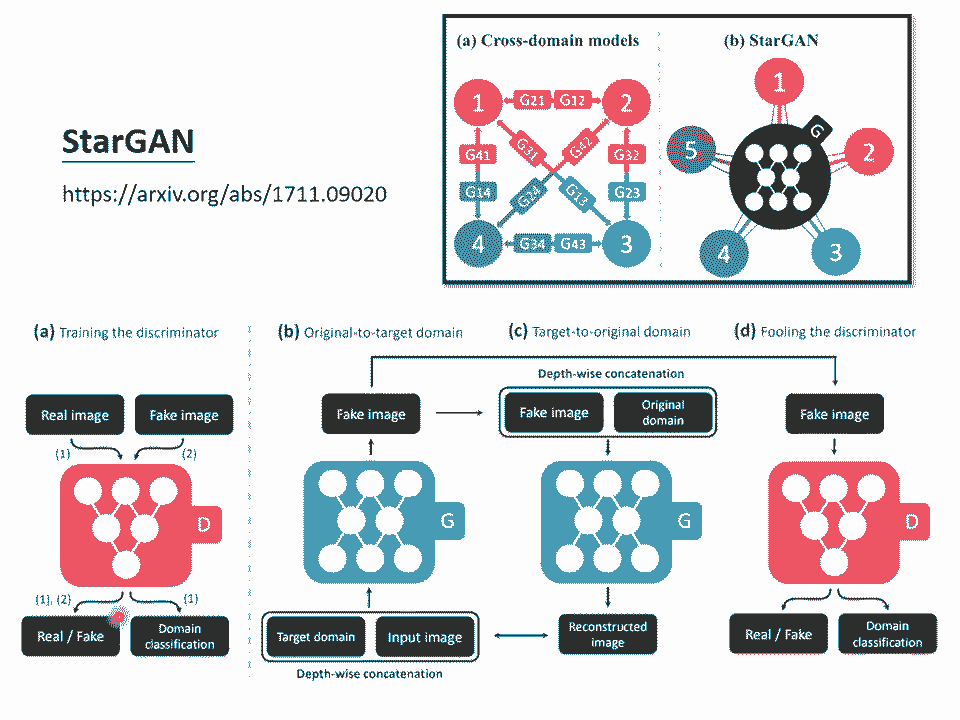

那這個真實的人臉，轉二次元的人物，實際上能不能做呢，實際上可以做了，右上角這邊放了一個連結，這個應該是一個韓國的團隊，他們做了一個網站，你可以上傳一張圖片，他可以幫你變成二次元的人物。

那他們實際上用的不是Psychogam，他們用的是，也是Gam的技術，但是是一個進階版的東西，那我們這邊就不細講，我就把論文的連結放在這邊，給大家參考，那這個網頁做的怎麼樣呢，我就實際測試了一下。

這個不知道大家認不認得，這是新元結衣啦，這個是你老婆這樣，你總該認得吧，那把這個圖片轉成，把你老婆轉成二次元的人物，長成是這個樣子，你老婆二次元長這個樣子，知道嗎，你會發現說呢，機器確實有學到一些。

二次元人物的特徵，比如說把眼睛變大，本來眼睛其實沒有很大，變成二次元人物以後，眼睛變這麼大。

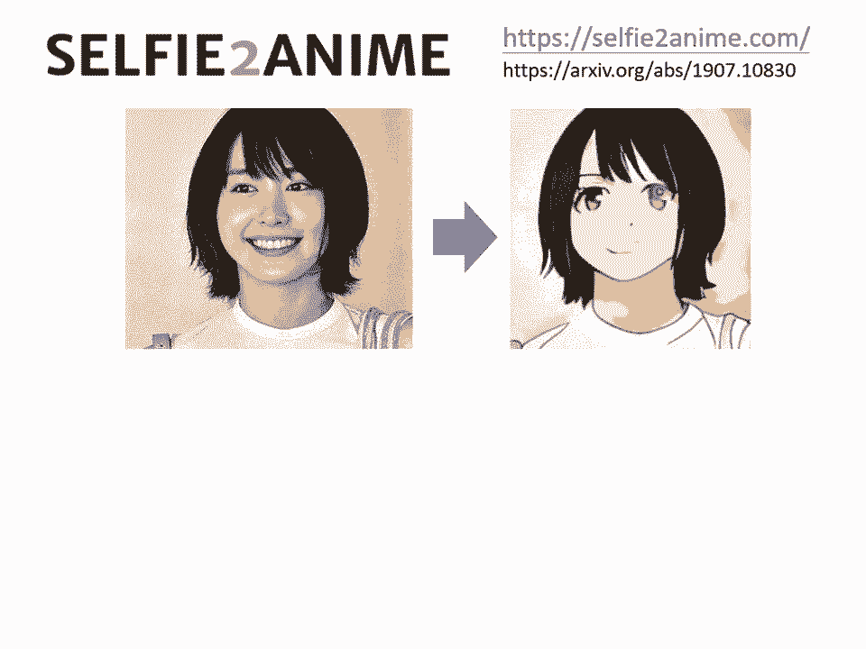

但有時候也是會失敗啦，比如這個是美國前總統，轉完以後，變成這個樣子，兩隻眼睛一眼大一眼小就是了，他不是總是會成功的，那同樣的技術啊，不是只能用在影像上，也可以用在文字上，你也可以做文字風格的轉換。

比如說把一句負面的句子，轉成正面的句子，當然如果你要做一個模型，輸入一個句子輸出一個句子，那這個模型，就是要能夠吃一個sequence，輸出一個sequence。

所以它得是一個sequence to sequence的model，你可能就會用到，我們在作業5裡面的transformer的架構，來做這個文字風格轉換的問題，我們在作業5做的是翻譯嘛。

輸入一個語言輸出另外一個語言嘛，那現在如果要做文字風格轉換，就是輸出一個句子，但輸出另外一個風格的句子，那怎麼做文字風格轉換呢，跟cycle game是一模一樣的，首先你要有訓練資料。

收集一大堆負面的句子，收集一大堆正面的句子，假設你要把負面的句子，轉成正面的句子，那風格轉換問題，就是要負面的句子，轉正面的句子，那就收集一堆負面的句子，收集一堆正面的句子，那這個其實沒有那麼難收集。

你可以就是網路上爬一爬，像我們就是去ptt上爬，然後只要是推文就當作是正面的，虛文就當作是負面的，那就一大堆正面的句子跟負面的句子，只是成對的資料沒有而已，你不知道這句推文，要怎麼轉成這句虛文。

這句虛文要怎麼轉成這句推文，你沒有這種資料，但是一堆推文一堆虛文的資料，你總是可以找得到的，好那接下來呢，完全套用cycle game的方法，那完全沒有任何不同，所以這邊就不需要再細講，很快講過。

有一個discriminator，discriminator要看說，假設我們是要負面的句子，轉正面的句子，那discriminator要看說，現在generator的輸出，實際上不像是真正的正面的句子。

然後呢，我們還要有另外一個generator，要有兩個generator，這個generator要學會把正面的句子，轉回原來負面的句子，那你要用cycle consistency。

負面的句子轉成正面的句子以後，還可以轉回原來負面的句子，那你可能會問說，這兩個句子，他們兩個是句子啊，怎麼算他們的相似度啊，圖片還比較好理解，圖片就是個相量啊，兩個相的距離就是他們的相似度啊。

那兩個句子要怎麼做呢，這個如果你有興趣，再留給你慢慢研究，那這邊還有另外一個問題就是，這個sequence to sequence model，輸出是文字，那可是剛才不是有講說，如果輸出是文字。

接到discriminator會有問題嗎，對 會有問題，這邊你需要用RL硬做。

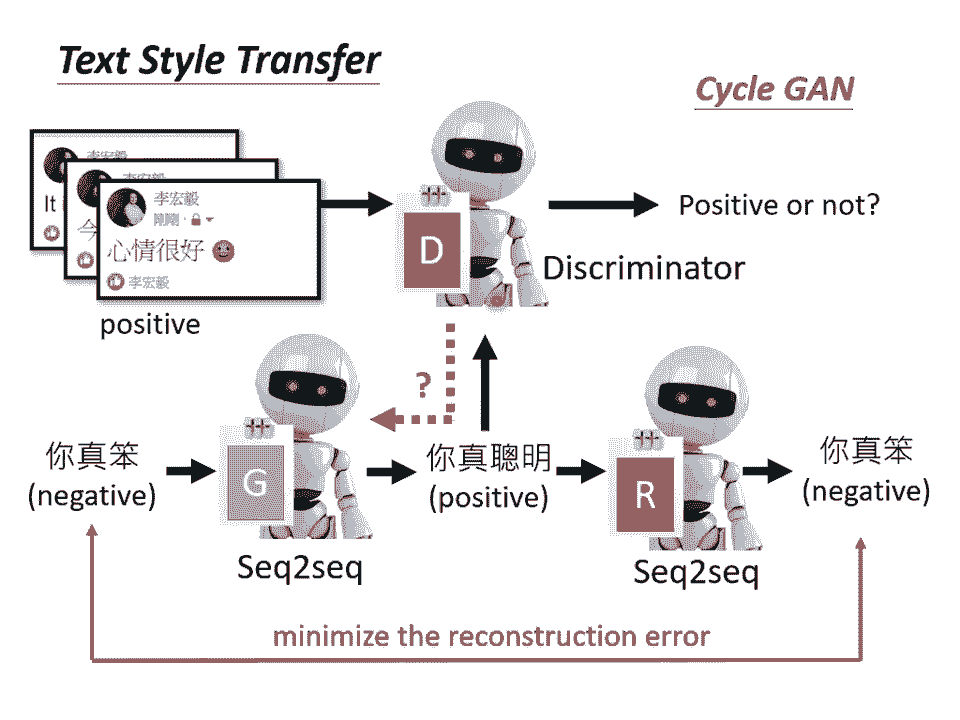

好 那做出來的結果怎麼樣呢，這個是真正的demo啦，就是真的拿PTT的推文，當正面的句子，虛文當負面的句子，那你就可以給他一個負面的句子，他就幫你轉成正面的句子，做起來像是這個樣子，跟他說魏騰沒睡醒。

各種不舒服，他就說生日快樂睡醒超級舒服，或你跟他說，我都想去上班了，真夠賤了，他就說我都想去睡了，真帥了這樣，所以他很厲害啊，他知道上班的相反，就是去睡啊，還挺聰明的，那跟他說暈死了吃燒烤。

竟然遇到個變態狂，他就說哈哈好吃燒烤，居然遇到帥狂，他就把變態狂變成帥狂，他自己發明了一個詞彙，也不知道在說些什麼，但是因為這個訓練，是完全unsupervised，就是給他正面的句子，跟負面的句子。

所以他有時候會犯，非常奇怪的錯誤，比如說我跟他說，我肚子痛得厲害，他就說我生日快樂厲害，那你會發現說機器算犯錯，犯錯是有固定的規則的，你發現胃疼跟肚子痛，只要是腹部有毛病，他轉過來都是生日快樂啊。

不知道為什麼機器覺得說，腹部有毛病的相反，就是生日快樂，那你可能問說，這個系統有什麼用，就是沒有任何用處啦，沒半點用處這樣，但是如果你覺得，你的老闆說話特別壞的話，你就可以把這個系統，裝在你的耳機裡面。

把所有的負面句子，轉成正面的句子，那你的人生可能，就會過得特別快樂一點，那其實啊。

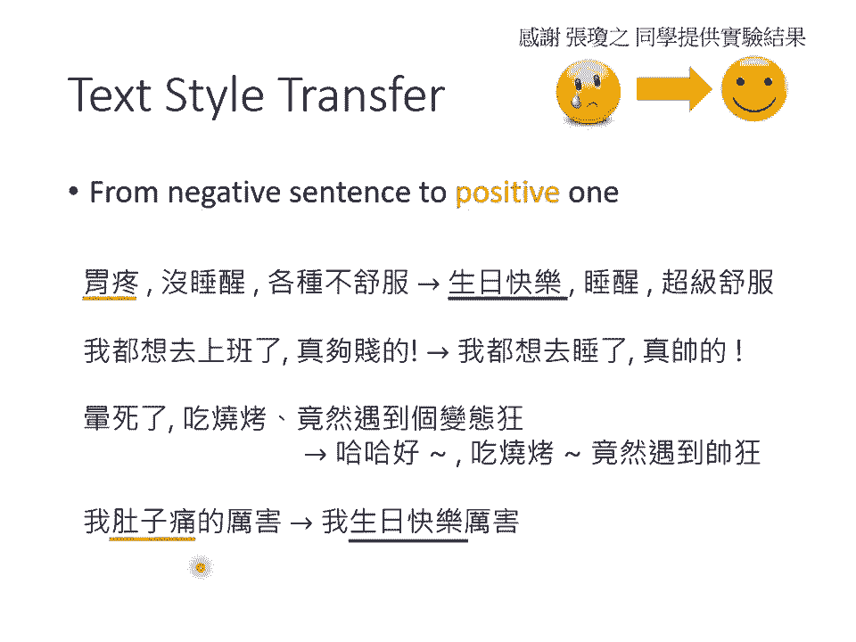

像這種文字風格轉換，還有很多其他的應用，不是只有正面句子，轉負面句子而已，舉例來說，假設我有很多長的文章，我有另外一堆摘要，那這些摘要不是，這些長的文章的摘要，是不同的來源，一堆長的文章，一堆摘要。

讓機器學習文字風格的轉換，你可以讓機器學會，把長的文章變成，簡短的摘要，讓他學會，怎麼精簡的寫作，讓他學會，把長的文章變成短的句子，甚至還有更狂的，同樣的想法，可以做unsupervised的翻譯。

怎麼叫unsupervised的翻譯呢，收集一堆英文的句子，收集一堆中文的句子，沒有任何成對的資料，這就跟你作業5不一樣，作業5你有成對的資料嘛，你有知道說，這句英文對到這句中文嘛。

但是unsupervised的翻譯就是，完全不用任何成對的資料，網路上爬一堆中文，網路上爬一堆英文，用剛才那個psycho game的做法，硬做，機器就可以學會，把中文翻成英文了，你可以自己看一下文獻。

看看說機器做得怎麼樣，那到目前為止，我們說的兩種風格，都還是文字，可不可以兩種風格，甚至是不同類型的資料呢，有可能做，這是我們實驗室最早做的，我們試圖去做，非督導式的語音辨識，就是讓機器聽一堆。

語音辨識是什麼呢，語音辨識就是，你需要蒐集成對的資料，你需要蒐集一大堆的聲音訊號，然後找工讀生幫你把這些訊號標註，機器才能夠學會，某個語言的語音辨識，但是要標註資料，所費不資，所以我們想要挑戰。

非督導式的語音辨識，也就是機器只聽了一堆聲音，這些聲音沒有對應的文字，機器上網爬一堆文字，這些文字沒有對應的聲音，然後用Psychogame，應作看看機器，有沒有辦法把聲音轉成文字，看看它的正確率。

可以做到什麼樣的地步，那至於正確率可以做到什麼樣的地步呢，那我把文獻留在這邊，給大家參考，好那以上就是有關Game的部分。

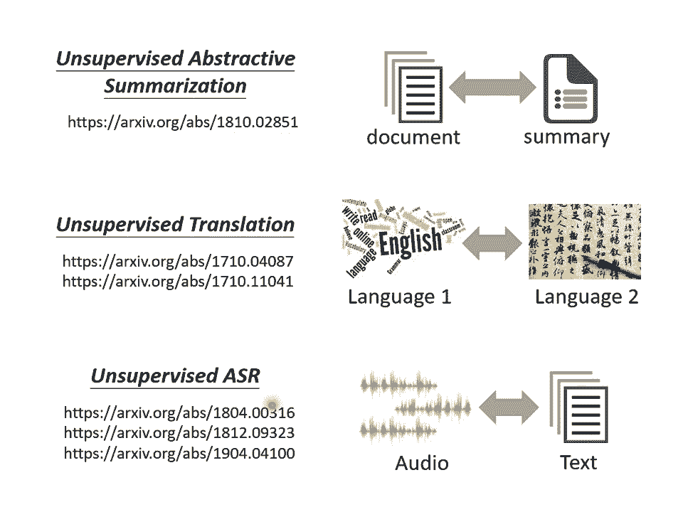

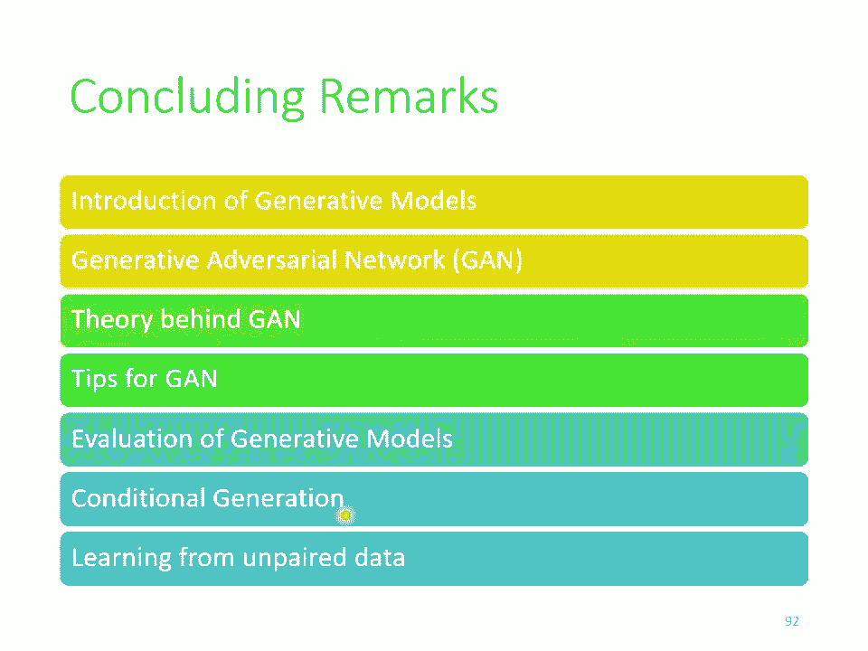