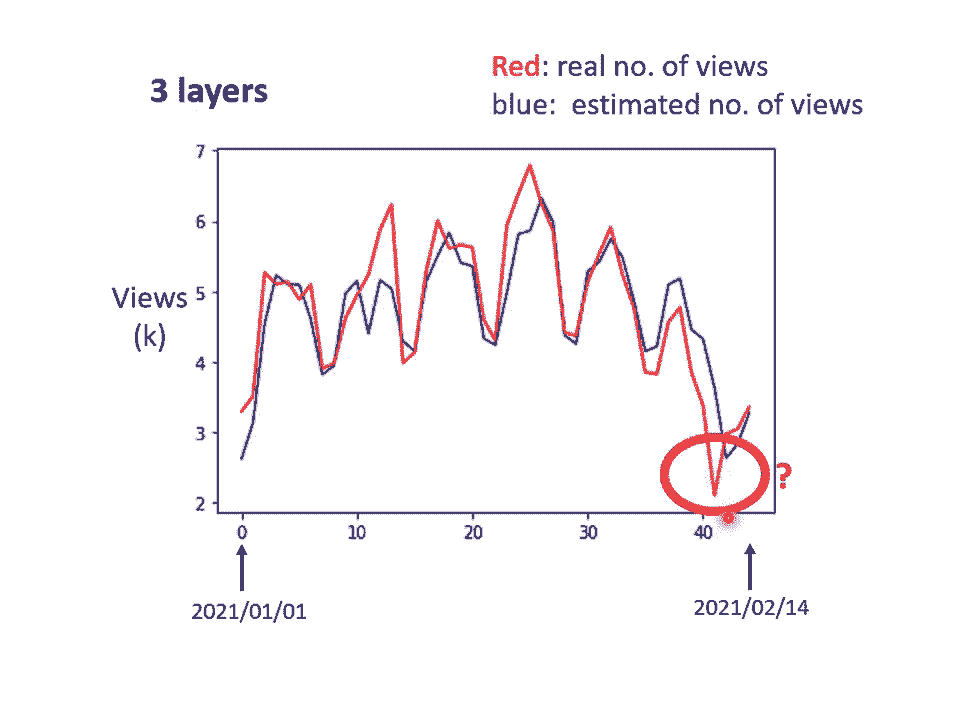

# P2：L1.2- 深度学习基本概念简介 - ShowMeAI - BV1fM4y137M4

in的model也许太过简单了，怎么说它太过简单呢？怎么说它太过简单呢？呃，我们可以想象说X one跟Y，也许它中间有比较复杂的关系，但是对linear model而言。

对linear的 model来说，X one跟Y的关系就是一条直线。随着X one越来越高，Y就应该越来越大，你可以设定不同的W改变这条线的斜率，你可以设定不同的B改变这一条蓝色的直线跟Y轴的交叉点。

但是无论你怎么改W跟B嗯。它永远都是一条直线，永远都是XY越大，Y就越大。前一天观看的人数越多，隔天的观看人数就越多。但也许现实并不是这个样子啊，也许在XY小于某一个数值的时候。

前一天的观看人数跟隔天的观看人数是成正比。那也许当X one大于一个数值的时候，这个物极必反啊，过了一个峰值以后过了一个。假设X one太大，前天观看的人数太高，那隔天观看人数就会变少。

也说不定呢也许X one跟Y中间有一个比较复杂的像这个红色线一样的关系。但你不管怎么摆弄你的W跟B你永远制造不出红色那一条线，你永远无法用linear的 modelel制造红色这条线。所以怎么办呢？

显然linear的model有很大的限制。这种来自于model的限制叫做model的 biasas。那其实我们刚才在课堂开始的时候也叫做也说B叫做bias。那这个地方有一点呃在用词上有一点。

那呃呃所以这边特别强调说呢，这个东西叫做model的 bias，它跟B的这个。不太一样，它指的意思是说，我们今天的这，所以他没有办法模拟真实的状况，所以怎么办呢？

我们需要写一个更复杂的更有弹性的有未知参数的方向。里的 model显然是不够的。啊，那怎么办呢？怎么写出一个更复杂的呃有未知参数的方向呢？我们可以观察一下红色的这一条曲线。红色的这条曲线呢。

它可以看作是一个长数，再加上一群蓝色的这样子的方式。啊这个蓝色的方向它的特性是这个样子的。当呃输入的值当X轴的值小于某一个这个freshhold的时候，它是某一个定值。

大于另外一个freshhold的时候，又是另外一个定定值。那中间呢有一个斜坡，或它是先水平的，然后再斜坡，然后再水平的那它其实有名字，它的名字我们等一下再讲这边我们因为它是蓝色的方向。

我们就先叫它蓝方吧，这样子。好，那所以呢这个红色的线哪，它可以看作是一个长数向加一大堆的蓝方。啊，那这个常数项它的值应该要多大呢？你就看这条红色的线了，它跟X轴的交点在哪里？好。

那这个常数项呢就设跟X轴的交点一样大。那怎么加上这个蓝色的方以后，变成红色的这一条线呢？你看你就这样子加这个蓝色方呢，它的呃这个这个坡度啊，这个斜坡的起点设在红色方的起始的地方。

然后第二个斜坡的终点设在第一个转角处。所以这边红色方个转角，那你就有一个蓝色的方它的斜坡的终点设在红色方的第一个转角。然后呢，你刻意让这边这个蓝色方的斜坡跟这个红色方的斜坡，它们的斜率是一样。

这个时候如果你把零加上一你就可以得到红色曲线，红色这个线段的第一个这个到这个第一个转折点之前的数值好，所以零加上一可以得到红色线段。一个转折点之前的部分。然后接下来再加第二个蓝色的方向，怎么加呢？

你就看红色这个线第二个转折点出现在哪里和，第二个转折点出现在哪里。好，所以第二个蓝色方，它的斜坡就在红色方的第一个转折点到第二个转折点之间，第一个转折点到第二个转折点之间。

你刻意让这边的斜率跟这边的斜率一样。这个时候你把0加1加2，你就可以得到两个转折点这边的线段，你就可以得到红色的这条线这边的部分。然后接下来第三个部分，第二个转折点之后的部分怎么产生呢？

你就加第三个蓝色的方ction。第三个蓝色的functionction，它的这个坡度起始点故意设的跟这个转折点一样。这边的斜率，故意设的跟这边的斜率一样。然后接下来你把0加1加2加3，全部加起来。

你就得到红色的这个线，就得到红色这个线。所以红色这个线可以看作是一个常数再加上一堆蓝色的方。那你仔细想一下，就会发现说不管我画什么样的peacewise linear的 curve。

什么叫做pewise linear的 curve呢？就是你现在这个 curve啊，它是有很多线段所组成的，它是有很多锯齿状的线段所组成的这个叫做peacewise linear的 curve。

那你会发现说这些peacewise linear的 curve。你有办法用常数项加一大堆的蓝色方的组合出来，只是他们用的蓝色方不见得一样，你要有很多不一样的蓝色方加上一个常数以后。

你就可以组出这些peacewise linear的 curve。那如果你今天pacewise linear的 curve越复杂。你的这个转折的点越多啊，那你需要的这个蓝色的方就越多。哦，所以呢。

那那讲到这边，有人可能会说，那也许我们今天要考虑的X跟Y的关系不是pe wise linear的 curve啊，也许它是呃这样子的曲线。那就算是这样的曲线也无所谓。我们可以在这样的曲线上面先取一些点。

再把这些点点起来，变成一个pewise linear的 curve。而这个peacewise linear的 curve跟原来的曲线它会非常接近。如果你今天点取的够多，或你点取的位置适当的话。

你点取的够多，这个pewise linear的 curve就可以逼近这个啊连续的这个曲线，就可以逼近这个不是pewise linear，它是有角度的有弧度的这一条曲线。哦，所以我们今天知道一件事情。

你可以用peacewise linear的 curve去逼近任何的连续的曲线。而每一个pewise linear的 curve又都可以用一大堆蓝色的方组合起来。也就是说我只要有足够的蓝色方把它加起来。

我也许就可以变成任何连续的曲线。好，所以今天假设我们的X跟Y的关系，它也许非常的复杂，那也没关系，我们就想办法写一个带有未知数的方ction。这个带有未知数的方向。

它表示的就是一堆蓝色的functionction，加上一个cast。那我们接下来问的问题就是这个蓝色方，它的式子应该要怎么把它写出来呢？怎么把这个蓝色方的式子写出来呢？也许你要直接写出它没有那么容易。

但是你可以用一条曲线来逼近它用什么样的曲线来逼近它呢，用一个signoid的 function来逼近这个蓝色的方，那signoid function它的式子长的是这个样子的？

它的横轴输入是XY输中是Y输入的XY，我们先乘上一个W再加上一个B，再取一个负号，再取exponial再加一这一串被放在分子的放在分母的地方，好吧。

一除以一加上exent负B加WXY然前面你可以乘上一个constant叫做C。好，那如果你今天输入的这个X one的值啊，趋近于无穷大的时候，会发生什么事呢？如果这一项趋近于无穷大。

那exponential这一项就会消失，那当X one非常大的时候，这一条这边就会收敛在这个高度是C的地方。啊那如果今天X one负的非常大的时候发生什么事呢？如果X one负的非常大的时候。

分母的地方就会非常大，那Y的值就会趋近于D。哦，所以你可以用这样子的一个方来试着画出这一条曲线用这条曲线来逼近这一个蓝色的方。那这个东西它的名字叫做signsignoid是什么意思呢？signoid呃。

如果你要硬要翻成中文的话，可以翻成S型的而这signoid function就是S型的。因为它的是有点像是S型的而且它sign。那这边呃我们之后都懒得把expon写出来，我们就直接写成这个样子。

就是Y等于C倍的signm，然后这个括号里面放B加W乘X one，然后这个B加WX one实际上做的事情就是把它放在exent的指数项前面加一个负号，然后E加exent的B加WX放在分母的地方。

而且上C就等于Y。好所以我们可以用这个sign去逼近一个蓝色的。那其实这个蓝色的比较常见的名字就叫做的s。只是我本来想说一开始我们是先介绍蓝色的才介绍sign。所以一开始说它叫做haringmo。

有一点奇怪。所以我们先告诉你说，有一个signoid function，它可以逼近这个蓝色的function。那这个蓝色的function其实通常就叫做hard的signmo。

那我们今天我们需要各式各样不同的蓝色的方，还记得吗？我们要组出各种不同的曲线，那我们就需要各式各样合适的蓝色的function。而这个合适的蓝色的方，怎么制造出来呢？我们就需要调整这里的B跟W跟C。

你可以调整B跟W跟C，你就可以制造各种不同形状的smoid function，用各种不同形状的smoid function去逼近这个蓝色的方。

举例来说，如果你今天改W会发生什么事呢？你就会改变呃斜率，就改变这个斜坡的坡度，你就会改变斜坡的坡度。如果你动了B会发生什么事呢？你就可以把这个signmoid function左右移动。

那就得把它左右移动。如果你改C会发生什么事呢？你就会改变它的高度。哦，所以你只要有不同的W不同的B不同的C，你就可以制造出不同的signmoid function。

把不同的signmoid function叠起来以后，你就可以叠出各种不同的，你就可以去逼近各种不同的pewise linear的 function。

然后pewise linear function可以拿来近似各种不同的continuous的 function。好，所以今天呢假设我们要把红色的这条线，它的函数写出来的话，那可能长什么样子呢？

我们知道说红色这条线就是零加一加2加3，而这个123呢，他们都是蓝色的方。所以他们的函数就是有一个固定的样子，他们都写作X one乘上W再加上B做signoid再乘上C one，只是一跟2跟3。

他们的W不一样，他们的B不一样，他们的C不一样啊。如果是第一个绿第一个蓝色方，它就是W oneB oneC one。第二个蓝色方选，我们就说他的它用的是WQ与BQCQ。第三个蓝色方向。

我们就说他用的是W3B3C3。好，那我们接下来呢就是把零跟123全部加起来以后，我们得到的函式就长这个样子。我们把一加2加3加起来。

这边就是subion over我们的I呢等于一或2或3好那sion里面呢就是CI乘上signBI加WI乘上XY所以这边每一个式子都代表了一个不同蓝色的方，sub的意思就是把不同的蓝色的方给它加起来。

就是这边svention的意思。然后呢别忘了加一个conant别忘了加一个con，我这边用B呢来表示这个con。哦，所以今天呢我们有一个如果我们假我们今天就写出了一个这样子的方。

如果我们假设里面的B跟W跟C，它是未知的，它是我们未知的参数，那我们就可以设定不同的B跟W跟C设定不同的B跟W跟C，我们就可以制造不同的蓝色的方。

制造不同的蓝色的方向叠起来以后就可以制造出不同的红色的 curve，制造出不同的红色的 curve就可以制造出不同的pewise的 curve就可以去各式各样不同的coninuous的方。

所以我们其实有办法写出一个这个非常有弹性的有未知参数的方啊它长这个样子就是s一堆。但他们有不同的C不同的B不同的比。

好，那所以本来我们是linear的model，Y等于B加W乘上XY，它有非常大的限制，这个限制叫做model的bias。那我们要如何减少model的 bias呢？我们可以写一个更有弹性的有未知参数的方。

它叫做Y等于B加s mentionCIsignoidBI加WIXY就本来这边是D加WXY这边变成BI加WIXY。

然后我们有很多不同的BI有很多不同的WI他们都通过signmore都乘上CI把它同加起来再加B等于Y我们只要带入不同的C不同的B不同的W，我们就可以变出各式各样。

就可以组合出各式各样不同的function。好，那我们刚才其实已经进化到不是只用一个feature啊，我们可以用多个feature。我们这边用J呢来代表feature的编号。局例来说。

刚才如果要考虑前28天的话，Z就是1到28考虑前56天的话，就是1到56。那如果把这个再扩展成我们刚才讲的上面这个比较有弹性的方的话，那也很简单，我们就把sign里面的东西换掉。

本来这边是B加sion over jWJXJ。那这边呢就把这一项放到这个括号里面改成BI加subion over jWIJXJ我们把本来放在这边的东西放到sign里面。

然后呢这个每一个sign的里面呢都有不同的BI不同的WIJ然ign后乘上CI全部加起来，再加上B就得到Y我们只要这边I。DI跟WIJ放不同的值就可以变成不同的方向了。好，那如果讲到这边。

你还是觉得有点抽象的话，如果看这个式子觉得有点头痛的话，那我们用比较直观的方式把这个式子实际上做的是把它画出来，它画出来看起来像是这个样子。好，我们先考虑一下，Z就是123的状况。

就是我们只考虑三个feature。举例来说，我们只考虑前一天前两天跟前三天的case，所以J等于123。好，那所以输入就是X one代表前一天的观看人数X two两天前观看人数X33天前的观看人数。

I是什么？I是呃每一个每一个I就代表了一个蓝色的方。只是我们现在每一个蓝色的方都用一个s墨方来比近似它。好所以每一个I就代表了一个s墨方，或者是代表了一个蓝色的方。好。

那这边呢这个123啊就代表我们有三个signoid function。那我们先来看一下这个括号里面做的事情是什么啊，每一个signmo都有一个括号。那这个括号里面做的事情是什么呢？好。

第一个signI等于一的case啊，就是把X one乘上个wa叫W one one X two乘上另外一个wa叫W one twoX3再乘上个wa叫做他 one3全部把它加起来。

那不要忘了再加一个BB加起来。然后呢这个呃。得到的式子就是这个样子。所以这边我们用WIJ呢来代表在DI个sign里面乘给DJ个feature的wa哦。

第一个feature它就是W one one第二个feature就是乘W one two第三个feature就是乘W13这三个feature123这个W的第二个下标就是123那W的第一个下标呢代表是现在在考虑的是第一个sign function。

那我们有三个signoid function。好，那第二个signoid方呢，我们就不不把它的W写出来了啊，我们就不把它的W放在这个箭头旁边，不然会太紧好。那第二个s function。

它的在括号里面做的事情是什么呢？它在括号里面做的事情就是把XYXY乘上W21，把XQXQ乘上W22，把X3X3乘上W23通通加起来，再加BQ。

第三个sign呢第三个signma在括号里面做的事情就是把123123XYXQX3分别乘上W31W32跟W33再加上B3。好，那我们现在为了简化起见，我们把夸弧里面的数字啊用一个比较简单的符号来表示。

所以这一串东西我们当做RY这一串东西我们当做R two这一串东西我们当我们叫它R3。那这个X oneXQ跟X3和R oneR twoR3中间的关系是什么呢？

你可以用呃矩证跟向量相乘的方法写一个比较简单的简洁的写法。我们刚才已经知道说R oneRQR3也就是括弧里面算完的结果啊，三个括弧里面算完的结果RR twoR3跟所有的三个选X oneXQX3。

他们中间关系就是这样把X oneXQX3乘上不同的位，加上不同的bias，也就不同的B会得到不同的R。

那这一三个4这一连串的运算呢，其实我们可以把它简化。就如果你熟悉线性代数的话，简化成矩证跟向量的相乘。把X1FQX3拼在一起变成个向量。把这边所有的W通通放在一起，变成一个矩阵。

把B one B two B3拼起来变成一个向量，把R oneR twoR3拼起来变成一个向量。那这三个式子你就可以简写成有一个向量叫做X，这个X乘3个矩阵叫做W，这个W里面有9个数值。

就是这边的9个W，就这边的9个位。X先乘上W以后，再加上B就得到啊这个向量。那这边做的事情跟这边做的事情是一模一样的，没有半毛钱的不同，只是表示的方式不一样而已。只是本来写三个数字，里面有一堆加加减减。

有一堆还有什么上标，结果还有什么两个下标，什么，看起来就让人头大，那把它改成线性代数比较常用的表示方式。X乘上矩证W，再加上向量，B会得到一个向量叫做啊。

好，那所以这边这件事情呢，在这个括号里面做的事情呢，就是这么一回事，S乘上W加上B等于R。R呢就是这边的R oneRQR3，我的电脑有点卡哦，违卡这样子没办法控制那滑鼠啊，没关现，我可以控制控制了。

这是R oneRQR3。好，那接下来这个R oneR就R3啊就分别通过signoid function分别通过signoid function。因为我们实际上做的词就是做的事情就是把R one。

取一个负号，再乘再做exential，再加一，然后把它放到分母的地方，一除以一加exential负RY等于AY。然后同样的方法由RQ取得到AQ把R3通过s function得到A3。哦。

所以这边这个蓝色的虚线框框里面做的事情就是从XYXQX3得到了A1AQA3。好，接下来呢呃我们这边呢有一个简有一个简洁的表示方法是我们用R通过一个叫做这个signoid的方。我们用这个这个这个东西。

我们这边呢用这个符号呢来代表通过这个signoid的方。然后呢说我们得到了A这个向量啊就把R oneRR3分别通过signoid方，但我们直接用这个符号来表示它然后得到A one A twoA3。

然后接下来呢接下来哦我们这个signoid的输出还要乘上CI，然后还要再加上B。那我们这边做的事情就是把A one乘C one A two乘CQA3乘C3，通通加起来再加上B，最终就得到了Y啊。

最终就得到了Y。好，那这边呢如果你要向量来表示的话，A oneA twoA3拼起来叫这个向量AC1C6C3拼起来叫一个向量C。那我们这边把这个C呢做transpose，做transpose。好。

那A呢乘上C的transpose，再加上B好，再加上B，我们就得到了Y。

所以这一连串的运算呢，刚才写的那一个我们说比较有弹性的式子，它整体而言做的事情就是X输入是X，我们的feature是X这个向量X乘上矩证W加上向量B得到向量R再把向量R通过s function得到向量A再把向量A跟乘上C的transpo加上B就得到Y哦。

所以这上面这件事情，如果你想要用线性代数的方法来表示它用向量矩阵相等的方法来表示它哎就长了一副这个样。那这边的这个R就是这边的R，这边的A就这边的A，所以我们可以把这一串东西放到这个括号里面。

再把这个A呢放到这里来。所以把相同的东西并起来以后，整体而言就是长这个样子。上面这一串东西我们觉得比较这个呃比较有弹性的这个方。如果你用线性代数来表示它的话，就是下面这个式啊X乘上W再加上B。

通过方乘上C的准加B就得到Y上面这一串就是下面这一串就是我刚才写的那个比较有弹性的function讲来讲去都是一样的东西只是不同的表示方式而已。上面这个是图示化的表示方式，下面这个是线性代数的表示方式。

其实都在讲同一件事情。

好，那接下来啊接下来啊在我们继续讲说要怎么把这些未知的参数找出来之前，我们先再稍微重新定义一下我们的符号。这边的这个X是feature这边的WBC跟B，这边有两个B啊，但是这个这两个B是不一样的。

这边这个是一个向量啊，这边是一个数值，然后你看他们的这个底色是不一样的，这个是绿色，这是灰色，显示他们是不一样的东西。哎，我们把这个黄色的这个这个W把这个B把这个C把这个B统统拿出来集合在这边。

他们就是我们的un node parameter，就是我们的未知的参数。那我们把这些东西通通拉直拼成一个很长的向量。我们把W的每一个ro或者是每一个collon拿出来。

这边不管你是拿弱或拿colon都可以了，意思是一样了，你就把W的每一个collon或每一个拿出来，拼成一个长的向量，把B拼上来，把C拼上来把B拼上来。

这个长的向量我们直接用一个符号叫做谢达来表示它谢达是一个很长的向量，里面的第一个数值我们叫se达 one，第二个叫谢达就这个叫谢达那谢达里面这个向量里面有一些数值是来自于这个矩阵，有一些数值是来自于B。

有的数值来自于C，有的数值来自于这边这个B，那我们就不分了，反正谢达它统称我们所有的未知的参数，我们就一律统称谢达。

好，那这边我们就是换了一个新的，我们就重新改写了机器学习的第一步，我们重新定了一个有未知参数的方选。那接下来我们就要进入第二步和能第三步。那在我们进入之前，我们来看大家有没有问题想要问的。好。

那也看线上人要问问题吧。😊，不是他是说实做上数据很多。预算复张，时间也有限制，所以需要。那过程，希望去找到个。那他像。呃，好，我我试着回答看看。我猜他的问题是说。

我们其实要做opimization这件事，找一个可以让最小的参数。有一个最暴力的方法就是报收所有可能的未知参数的值，对不对？像我们刚才在只有W跟B两个参数的前提之下。

我根本就可以报收所有可能的W跟B的组合。所以在参数很少的情况下，你不甚至你有可能不用 gradient，不需要什么optimization的技巧。但是我们今天参数很快就会变得非常多。

像在这个例子里面参数有一大把有WB有C跟B串起来变成一个很长的向量叫C的。那这个时候你就不能够用报收的方法了，你需要规这样子的方法来找出啊，可以让最低的参数。好，希望这样回答到他的问题。好。

在座的同学有问题吗？请说。可以看到三个时间，那我可以三个。可以非常这是一个唉这个同学的问题是说，刚才的例子里面有三个signmoid。那为什么这三个呢？能不能够4个、5个、6个呢？

可以signmoid的数目是你自己决定的。而且signmoid的数目越多，你可以产生出来的acewise linear的方就越复杂。就是假你做三个signoid意味着你只能产生三个线段。

但是假设你有越多signmoid，你就可以产生有越多线段的peacewise linear的方，你就可以逼越复杂的方。但是至于要举个signmoid，这个又是另外一个par，这个你要自己决定。

我们在刚才例子里面举三个，那只是一个例子，也许我以后不应该举三个，因为这样会让你误以为说是三个signmoid是三个，不是就是说signmoid几个你可以自己决定。好，这样回这大家还有问题想问吗？哎哎。

请说。跟什么sma。好。hard的什么呀诶。首先它的function你写出来可能会比较复杂，你一下子写不出它的function。但如果你要你可以写的出它的function的话。

你其你其实也可以用hard的signmo，一下要用也可以。所以不是一定只能够用呃刚才那个signmo去逼近那个ha。你完全用别的做法。等一下我们就会讲别的做法。好。哎，大还有问题想要问吗？好。

如果目前暂时没有的话，就请容我继续讲下去。那你知道这门课是6点20才下课啦，所以只要讲到6点20前都是可以的那如果你有事想要早点离开，也没有问题，我们课程都是有录音的。

好，那接下来进入第二步了，我们要定lo，有了新的这个model以后，我们lo会不会有什么不同啊？没有什么不同定义的方法是一样的，只是我们的符号改了一下，之前是L ofW跟B。

因为W跟B是未知的那我们现在接下来的未知的参数很多了，你再把它一个一个列出来，太累了，所以我们只接用C达来统设所有的参数，用达来代表所有未知的参数。

所以我现在的lo function就变成L这个lo方要问的就是这个达，如果它是某一组数值的话，会有多不好或有多好。好那计算的方法跟刚才只有两个参数的时候，其实是一模一样。

就你先给定某一组WBCT跟B的值。我先给定某一组达值。假设你知道W的值是多少。只写进去B的只写进去C的值写进去，B的只写进去。然后呢，你把一种featureX啊带进去，然后看看你估测出来的Y是多少。

再计算一下跟真实的label。之间的差距，你得到个一，把所有的误差通通加起来，你就得到你的no。那接下来下一步就是optim optimizationim problem跟前面讲的有没有什么不同呢？

没有什么不同，它是一样的。所以就算我们换了一个新的模型，这个optimization的步骤，optimization的演算法还是规cent，看起来其实没有真的太多的差别啊。

我们现在的se达它是一个很长的向量，我们把它表示成se onese to3。

红等等。我们现在就是找一组赛达，这个赛达可以让我们的los越小越好，可以让lo最小的那一种塞da，我们叫做赛达的大。好，那怎么找出这个C塔萨呢？我们一开始要随机选一个初始的数值，那这边叫做C达0。

你可以随机选。那之后你可能会讲也会讲到更好的呃找初始值的方法。先我们先现在先随机选就好了。好，那接下来呢你要计算为分，你要对每一个未知的参数，这边用C达 oneCWQC达3来表示。

你要为每一个未知的参数都去计算它对L的为分。那把每一个参数都拿去计算对L的唯分以后，集合起来，它就是一个向量。这个向量我们用G来表示它这边假设有1000个参数。

那这个向量的长度就是1000这个向量里面就有1000个数字。这个东西有一个名字，就我们把所把不每一个参数对L的唯分集合起来以后，它有一个名字，这个相当一个名字叫做raio。

那很多时候你会看到规点的表示方法是这个样子的，你把L前面放了一个导三角形，那这个就代表了规点啊，这是一个规点的简写的方法。那其实我要表示的就是这个向量。

L前面发一个导三角形的意思就是把所有的参数C达达就C达三通通拿去对L做为分，就是这个L到三角形的意思。那后面放C达零的意思是说我们这个算为分的位置啊，是在C达等于C达零的地方是在C达等于C达零的地方。

啊我们算出这个规点算出这个区以后，接下来呢我们就要upd我们的参数了，我们就要更新我们参数了。更新的方法跟刚才只有两个参数的状况是一模一样的，只是从更新两个参数可能换成更新成1000个参数。

但更新的方法是一样。本来有一个参数叫C达 one那上标零代表它是一个起始的值它是一个随机。选了其时的值。把这个se达万0减掉learning瑞乘上为分的值，得到se达万万代表谢达万更新过一次的结果。

谢达60减掉为分乘以减掉learning瑞乘上为分的值得到谢达 to万。那以此类推，你就可以把那1000个参数通通都更新了。那这边有一个简写啊，就是你会把这边所我的se达合起来当做个向量。

我们用se达0来表示。这边呢你可以把ning瑞提出来，那剩下的部分为分的部分，每一个参数对L为分的部分叫做规点叫做G啊，所以C达0减掉ning瑞乘上G啊，就得到C达万把这边的所有的这个C达通统集合起来。

把这边所有C达统集合起来，就叫做C达万C达0减掉C达0这个向量减掉ning瑞乘上GG也是一个向量会得到C达万。那假设你这边的参数有1000个，那C达0就是有1000个数值，1000维的向量。

G是1000维的向量。C达万也是1000维的向量。好，那整个操作就是这样了，就是由C达0算规点，根据规点去把C达零更新成C达 one，然后呢再算一次规点，然后呢。

根据规点把se达 one再更新成C达2再算一次规点，把C达 two更新成C达3，以此类推，直到你不想做，或者是你算出来的这个规是零向量是zero vector导致你没有办法再更新参数为止。不过在实作上。

你几乎不太可能做出规点是零向量的结果，通常你会停下来，就是你不想做了。好，那但是实座上了实那这边是一个实座的低票的一。之所以在这边就提他是因为助教的城市里面有这一段了，所以我们必须要讲一下。

免得注看助教城市之后觉得有点困惑。实际上我们在做brilliancent的时候，我们会这么做。我们这边有大N笔资料。我们会把这大N笔资料，分成一个一个的，就是一包一包的东西，一组一组的怎么分随机分就好。

随机分就好。好，所以每个bach里面有大BB资料哦，所以本来全部有大N笔资料，现在大B比资料，一种大BB资料，一种每种叫做bach，怎么分组，随便分就好，随随便分就好。

那本来我们是把所有的data拿出来算一个。那现在我们不这么做，我们只拿一个bech里面的data，只拿第笔data出来算一个，我们这边把它叫L one，那跟这个L的是区别。

因为你把全部的资料拿出来算跟只拿一个拿出来的资料拿出来算它不会一样嘛。所以这边用L one来表示它。但是你可以想象说假设这个B够大，也许L跟L one会很接近，也说不定。好所以实作上的时候。

每次我们会先选个，用这个来算L根据这个L one来算规点，用这个规点来更新参数，接下来再选下一个算出L two根据L two算出，然后再更新参数。

再取下一个算出L3根据L3算出规点再用L3算出来规点来更新参数。以我们并不是拿大L来算。实际上我们是拿一个被算出来的L1L就L3来计算pred点。那把所有的被都看过一次，叫做一个app park。

每一次更新参数叫做一次upate。所以你在文献上常常会有人听到up day这个词汇，常常有人听到app park这个词汇，那upate跟appad是不一样的东西。每次更新一次参数。

叫做一次upate把所有的背都看过一遍，叫做一个ip park。好不要呢为了要那至于为什么要分一个一个bech，那这个我们下周再讲。好，但是为了让大家更清楚认识up跟app的差别，好，这边就举一个例子。

假设我们有1万比data，也就是大N等于1万。假设我们的be的大小是这1，也就大B等于10。接下来问你，我们在一个app中总共upd了几次参数呢，那你就算一下这个大N个ex，1万比ex。

总共形成了几个bech，总共形成了1万除以10也就是1000个 batchch。所以在一个app里面你其实已经更新了参数1000次。所以一个app并不是更新参数一次。在这个例子里面。

一个app已经更新了参数1000次了。啊，第二个例子啊，那就是假设有1000个资料，bech size设100。那且bech size的大小也是你自己决定的。

所以这边我们又多了一个hyperparmeter。所谓hyperparmeter刚才讲过，就是你自己决定的东西。人手设的东西不是机器自己找出来的，叫做hyperparmeter。

我们已经我们今天已经听到了leing是个 hyperperparmeter。呃，几个s more也是一个 hyperperparmeterbech size也是一个hyperparmeter。好。

000个 examplebech size100，那一个appad总共更新几次参数呢是10次。所以有人跟你说，我做了一个appad的训练，那你其实不知道它更新了几次参数，有可能1000次。

也有可能10次取决于它的bch size有多大。

好，那呃我们其实还可以对模型啊做更多的变形。刚才有同学问到说咦这个 hard的signoid嗯不好吗？为什么我们一定要把它换成soft的signoid？

你确实可以不一定要换成有其他的做法。举例来说，这个hard的。我刚才说它的呃函是有点难写出来，其实也没有那么难写出来。它可以看作是两个的加种所谓 unit啊，它就是长这个样子，就是它有一个水平的线。

走到某一个地方有一个转折的点，然后变成一个斜坡。那这种方它的式子啊写成C乘上max0B加WXY这个max0B加WXY的意思就是看零跟B加WXY谁比较大了，比较大的那一个就会被当做输出。

所以如果B加WXY小于0，那输出就是0。如果B加WXY大于0输出就是B加WXY那总之这条线可以写成 max0B加WXY那一条。不同的W，不同的B，不同C，你就可以挪动它的位置，你就可以改变这条线的斜率。

那这种线呢在机器学习里面，我们叫做retify linear unit，它的缩写叫做re路，让它其名字念起来蛮有趣的，他真的就念re路。那你把两个re路叠起来就可以变成hard的signoid了。

对不对？我们把这样子的一个re路叠这样子的一个re路，把它们加起来，哎，它就变成hardsignmo了。所以我们能不能用re路呢？可以好，所以如果我们不要用sign，你想要re路的话。

你就把signoid的地方换成m括号零BI加 overWIX那本来这边只有挨个。但我想说你要两个re路才能够合成一个har。所以这边有挨个。那如果re路要做一样的事情。

那你可能需要两倍的路因为两个re路合起来才是一个hard，所以这边要两倍的re路好所把sign换成re路啊，这边就是把一个式子换的。因为要要要要表示一个这个hard的示那个蓝色的方向，不是这有一种做法。

你完全可以用其他的做法。好，那这个signma或是re路啊，他们在机器学习里面，我们就叫它activation function啊，他们是有名字，他们统称为activation function。

当然还有其他常见还有其他的activation function。那signm跟re路应该是今天最常见的activation function。那哪一种比较好呢？这个我们下次再讲哪一种比较好呢？呃。

我接下来的实验都选择用了re路，显然re路比较好，至于它为什么比较好，那就是下周的事情了。好，接下来呢就真的做了这个实验啊，这个都是真实的数据，你知道吗？真的做了这个实验啊，如果是li的mod。

我们现在考虑56天训练资料上面的lo是0。32K没看过的资料，2021年只要是0。46K。如果用10个re路嗯好像没有进步太多啊，这边呃跟用li是差不多的，所以看起来10个re路不太够。

100个re路就有显著的差别了，100个re路在训练资料上lo就可以从0。32K降到0。28K你100个re路，我们就可以制造比较复杂的曲线，本来li就是一直线。

但是100个re路我们就可以产生100个。

有100个折线的pewise linear function啊，在测试资料上也好了一些。接下来换1000个renew，1000个re在训练资料上lo更低了一些。

但是在没看过的资料上看起来也没有太大的进步。

好，接下来还可以做什么呢？我们还可以继续改我们的模型。举例来说，刚才我们说从X到A做的事情是什么？是把X乘上W加B，再通过s function。不我们现在知道说不一定要通过s function。

通过re路也可以，然后得到A。

我们可以把这个同样的事情呢再反复的多做几次。刚才我们把WX乘上W加B，通过soid function。得到A，我们可以把A再乘上另外一个W派，再加上另外一个B prime。

再通过或路方得到A prime。所以我们可以把X做这一连串的运算产生A，接下来把A做成一连串的运算产生A，那我们可以反复的多做几次，那要做几次。哎，这里又是另外一个perparmeter。

只是另外一个你要自己决定的事情。你要做两次吗？三次吗？4次吗？100次吗？这个你自己决定。不过这边的W跟这边的W派，他们不是同一个参数哦，这个B跟这边B prime它不是同一个参数哦。

我们是增加了更多的未知的参数。

好，那就是接下来就真的做了实验了。我们就是每次都加100个re路。那我们就是input feature，就是啊6056天前的资料。

如果是只做一次只做一次就那个乘上W再加B再通过re路或这件事只做一次的话，这是我们刚才看到的结果。两次哇，这个los降低很多啊，0。28K降到0。18K，没看过资料上也好了一些三层哇，又有进步，从0。

18K降到0。14K。那所以从一层到从就是乘一次W。到通过一次蕊路到通过三次蕊路，我们可以从0。28K到0。14K在训练资料上，在没看过资料上，从0。43K降到了0。38K，看起来也是有一点进步的。

好，那这个是那个真实的实验结果了，就我们来看一下，今天有做通过三次尾路的时候做出来的结果怎么样。那横轴刚才经看过了，就是时间就是日子纵轴是呃观看的人次是千人，红色的线代表的是真实的数据。

蓝色的线是预测出来的数据。那你会发现说哎在这种低点的地方啊，你看红色的数据是每隔一段时间就会有两天的低点就会有两天的低点，在低点的地方呃，机器的预测还算是蛮准确的，它都准确抓到说这两天就是低的。

这两天都是有低的，这两天就是低的，这两天就是低的。那这边有一个神奇的事情。这个机器高估了真实的观看人次，尤其是在这一天，这一天有一个很明显的低谷，但是机器不没有预测到这一天有明显的低谷。

它是晚一天才预测出低谷。那你知道是怎么回事吗？啊。😮，哎，闰年不是，因为还没有到2月28号啊。哎，大家有什么想法吗？啊。😮，对。😡，过年啊这一天最低点是什么？今天最低点都是除细啊，谁除细还学机器学习。

对不对？😊，好，所以对大家对机器来说，你不能怪他他根本不知道除夕是什么。他只知道看前56天的值来预测下一天会发生什么事。所他不知道那一天是除夕，所以不能怪他预测的不准啊，这一天就是除夕。

好，那到目前为止，我们讲了很多各式各样的模型。那我们现在还缺了一个东西，你知道缺什么东西吗？缺一个好名字，你知道这个外表啊是很重要的。一个死错酸仔，穿上西装以后就潮了起来，或者是知习泛侣的。

说他是汉佐将军移成亭和中山晋王之后也都潮了起来，对不对？所以我们的模型也需要一个好名字，其他叫做什么名字呢？这些sigoid或re啊，他们叫做new，我们这边有很多的newon，很多的newon叫什么？

很多的newon就叫做newnewon是什么？newon就是神经元人脑中就是有很多神经元，很多神经元串起来就是一个神经网都跟脑是一样的，接下来你就可以到处骗麻瓜，说看到没有？

这个模型就是在模拟人们脑知道吗？这就是在模。

人啊这个都是人工智慧，然后麻巴就会吓得把钱掏出来这样。但但是啊这个把戏在8090年代的时候已经玩过了这样newural network不是什么新的技术，8090年代就已经用过了。

当时已经把这个技术的名字搞到错掉了那newural，因为之前吹捧的太过浮夸。所以后来大家对 neuralural network这个名字都非常感冒。它就像是个脏话一样。

写在paper上面都注定会被就会注定害你的paper被拒绝。所以后来为了要重振 neuralural network的雄风。所以怎么办呢？需要新的名字怎么样新的名字呢？这边有很多的newural。

每一排 neuralral，我们就叫它一个lay，他们叫 hiddenden layer，有很多的 hiddenden layer就叫做deep这整套技术就叫做deep learning。

然后我们就把deep learning讲完了，就是这个就是这么回事。

就是这样来的。好，所以人们就开始把内神经网络越叠越多，越叠越深。12年的时候，有一个AS类，它有八成，它的错误率是16。4per。两年之后，VGG19成错误率在影像辨视上进步到7。3per。

这个都是在影像辨视上一个这个基准的资料库上面的结果。后来google内有错误率降到6。7per，有22层。但这些都不算是什么recive your内有152层啊，它比101还要高啊。

但是这个recceive内啊，其实要训练这么深的navel是有诀窍的。这个我们之后再讲。但是讲到这边，如果你仔细思考一下我们一路的讲法的话，你有没有发现一个奇妙的违和的地方。

我不知道大家有没有发现什么样违和的地方呢？我们一开始说我们想要用re路或者是signoid去逼近一个复杂的方向。实际上只要够多的re路够多的sign就可以逼近任何的连续的function，对不对？

我们只要够多的sign就可以制造够复杂的现段就可以逼近任何的contin所以我们只要一排路一排够多就足够了那生的意义，到底何在呢？把re反复用，到底有什么好处呢？为什么不他们直接拍一排呢？

直接拍一排也可以表示任何方啊，所以把它反复用没什么道理啊，所以有人就说把deep learning把反复用，不过是个噱头，你之所以喜欢deep learning只是因为deep这个名字好听呢？

re成一排你只可以制造一个肥的跟deep听起来量就不太一deep听起来就比较厉害啊以为是死就就不厉害这样。到底地壳的理由，为什么我们不把nval变胖，只把nl变深呢？这个是我们日后要再讲的话题。

好，那有人就说那怎么不变得更深呢？刚才做到三层应该要做的更深嘛。现在内vo都是叠几百层的，没几百层都不好意思说你在叫做deep learning，对不对？而是要做更深，所以确实做的更深，做四层。

四层在训练资料上，它的lo是0。1K，在没有看过2021年的资料上是如何呢？是0。44K惨掉了，唉怎么会这样子呢？在训练资料上三成比四层差四层比三层好。但是在没看过的资料上四层比较差三成比较好。

在有看过的资料上，在训练资料上跟没看过的资料上，它的结果是不一致的。这种训练资料跟测跟这种训练资料跟没看过的资料，它的结果是不一致的状况啊，这个状况叫做overfi。

那常常听到有人说机器学习会发生overing的问题指的就是在训练资料上有变好，但是在没看过的资料上没有变好这件事情。但是做到目前为止，我们都还没有真的发挥这个模型的力量。你知道我们要发挥这个模型的力量。

呃，2021年的资料到2月14号之前的资料我们也都已经手上有了。所以我们要真正做的事情是什么？我们要做的事情就是预测未知的资料。

但是如果们要预测未知的资料，我们应该选三层的na还是四层的nawork呢？举例来说，今天是2月26号，今天的观看人数我们还不知道。如果我们要用一个newural network。

用我们已经训练出来的newural network去预测今天的观看人数，你觉得应该要选三层的，还是选四层的呢？好，这个我们来问一下大家的意见吧，你觉得应该选三层的同学举手一下啊？好好，手放下，好。

是应该选四层的同学举手一下啊。好好比较少好，至于怎么选模型，这个是下周会讲问题。大家但是大家都非常有 sense，知道我们要选三层的，多数人都决定要选三层的。你可能会说我总么不选四层呢？

四层在训练资料上的结果比较好啊，可是我们并不在意训练资料结果啊，我们在意的是没有看过的资料。而2月26号是没有看过的资料，我们应该选一个在训练的时候没有看过的资料上表现为好的模型。所以我们应该选三层的。

那你可能以为这门课就到这边结束了。其实不是我们真的来预测一下2月26号应该要有的观看次数是多少。好，但是因为其实youtube的统计，他没有那么及时了，所以他现在只统计到2月24号。没关系。

我们先计算一下2月25号的观看人数是多少。这个三层的告诉我说，2月25号这个频道的总。观看人次应该是5250人。那我们先假设2月25号是对的，但实际上我们还不知道2月20号对不对。

因为UQ后台统计的数据还没有出来啊。但我们先假设这一天都是对的，然后再给我们的模型去预测2月26号的数字，得到的结果是3。96K有3960次。那个不为什么这边特别低。

因为模型知道说这个礼拜五观看的人数就是比较少啊，所以他预测特别低，听起来也是合理的。但是你觉得这个预测跟这边的0。38K比起来哪一个会比较准确呢。

你觉得你你你觉得我们我们下周来看看2月26号实际的值是多少。但是你觉得这个值它跟真实值的误差会小于0。38K的同学举手一下。绝对绝对大于0。38K的同学举手一下，哇，手发大家都对我这么没有信心，你这样。

好，我们就来看看这个下一周误差会有多少。但是我想应该是不会准的。因为你看这么多人都觉得误差会大，你们回去每个人都去点那个影片的话，哇，误差就大了。今天讲这么久，其实就是骗大家去点影片而已了唉。

好，那今天其实就讲了深度学习。那今天讲的不是一般的介绍方式。如果小婷一般的介绍方式，过去的课程影片也是有的，我就把连接附在这边。然后深度学习训练会用到一个东西叫bp，其实它就是比较有效率。

上bra点的方法，跟我们今天讲的东西没有什么不同。但如果你真的很想知道bp是什么的话，影片连接也附在这边。好，今天上课就上到这边，谢谢大家，谢谢。😊。

