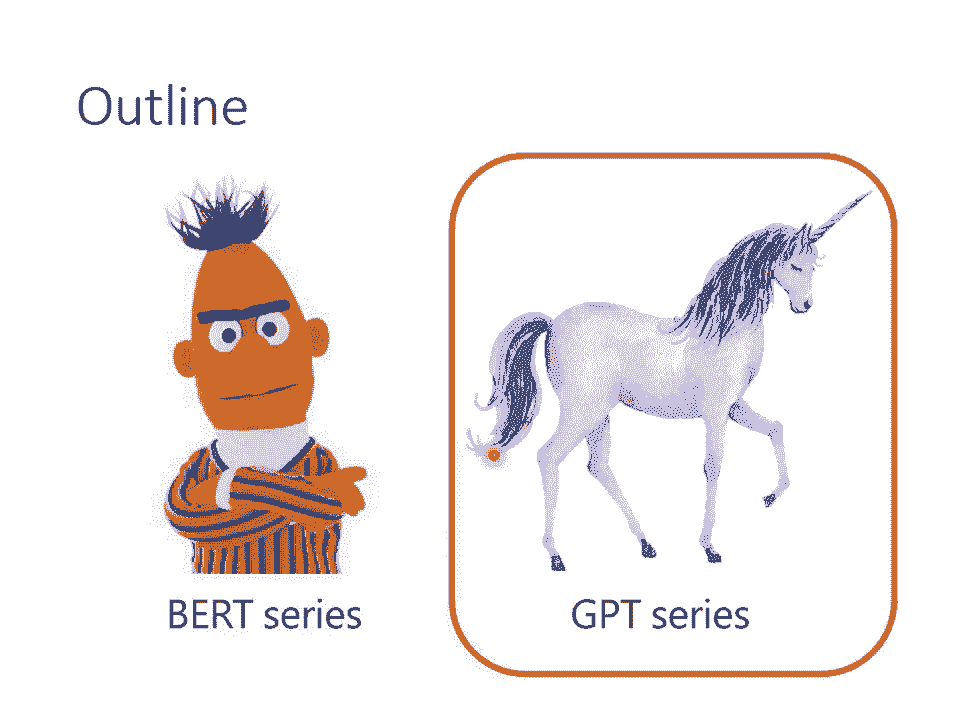
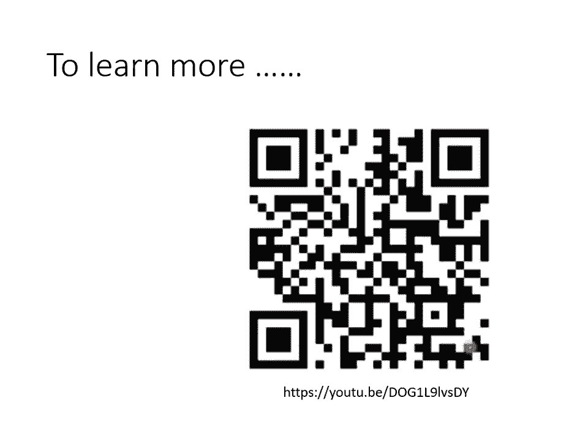
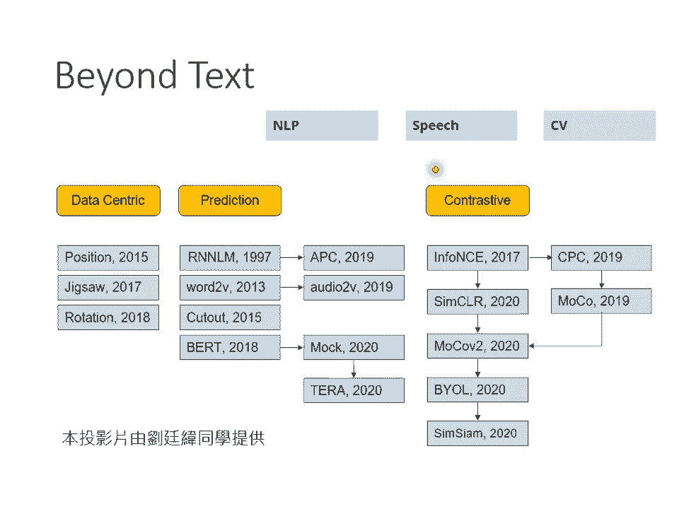
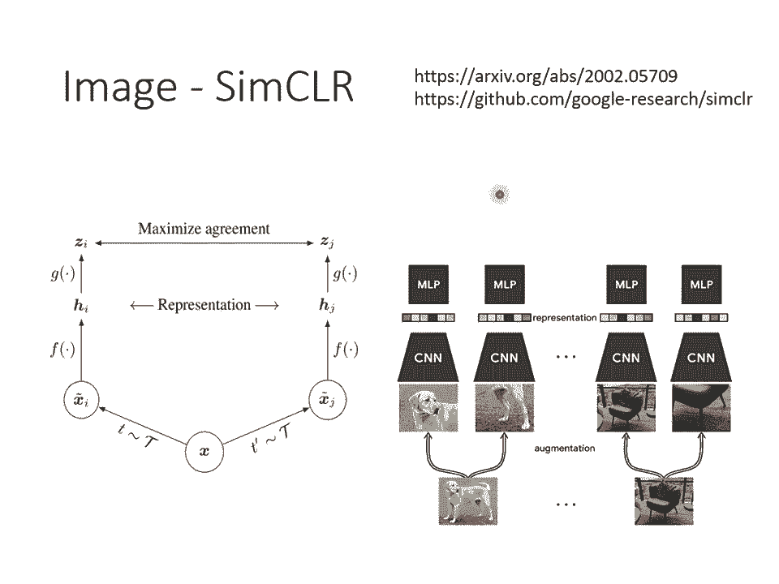
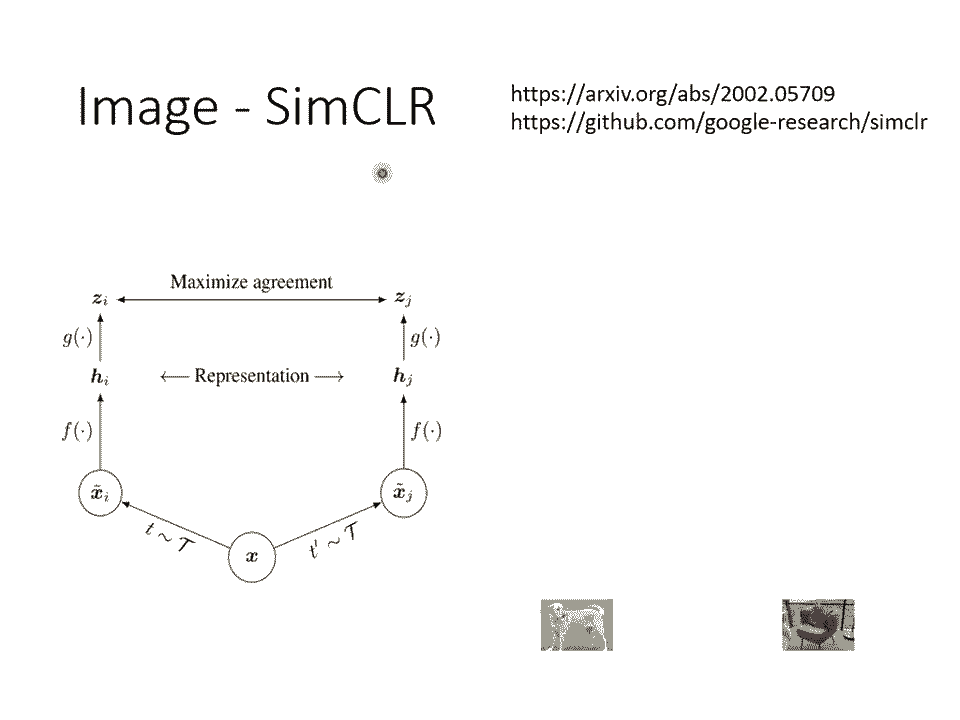
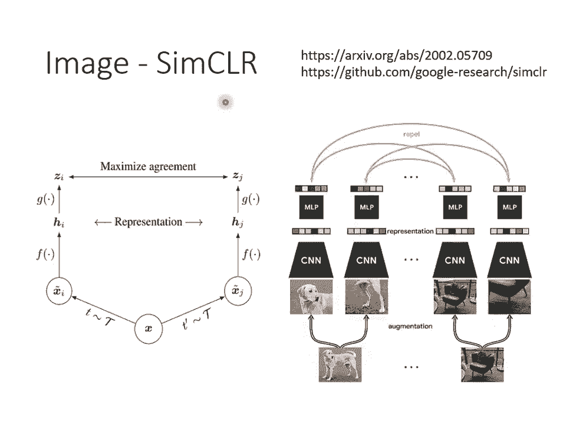
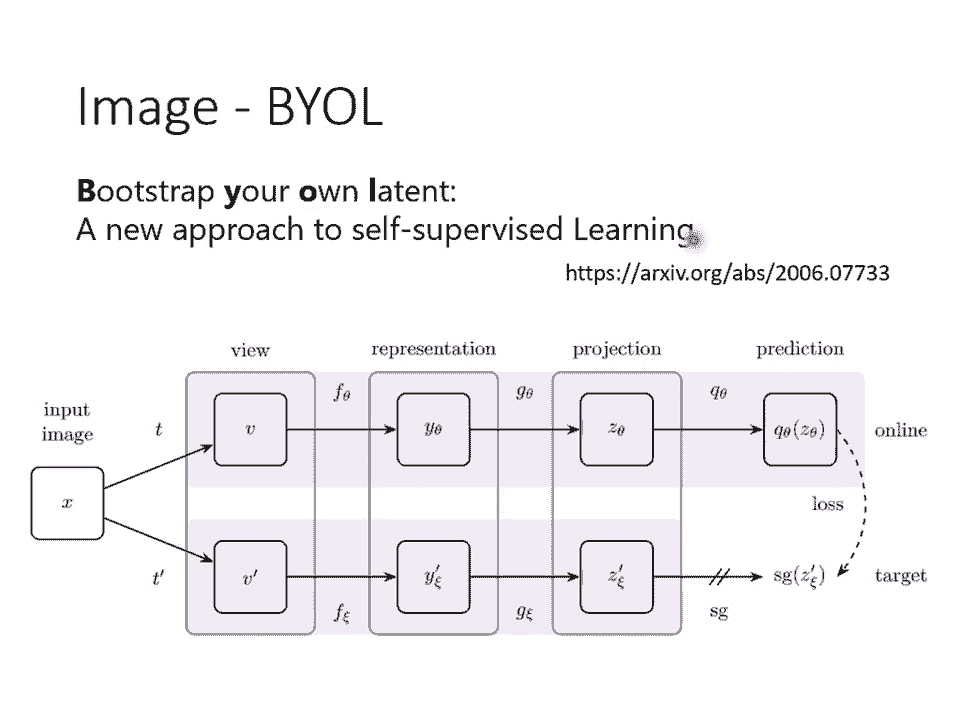
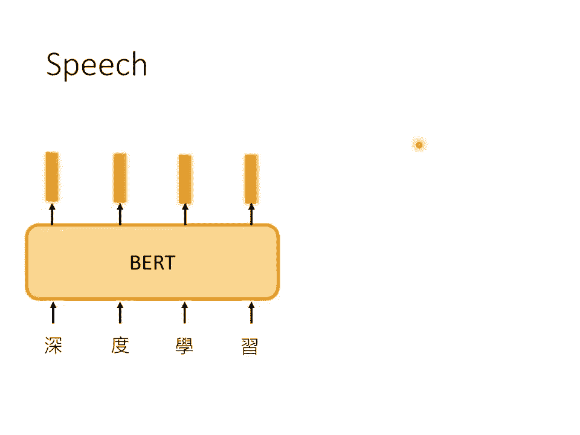
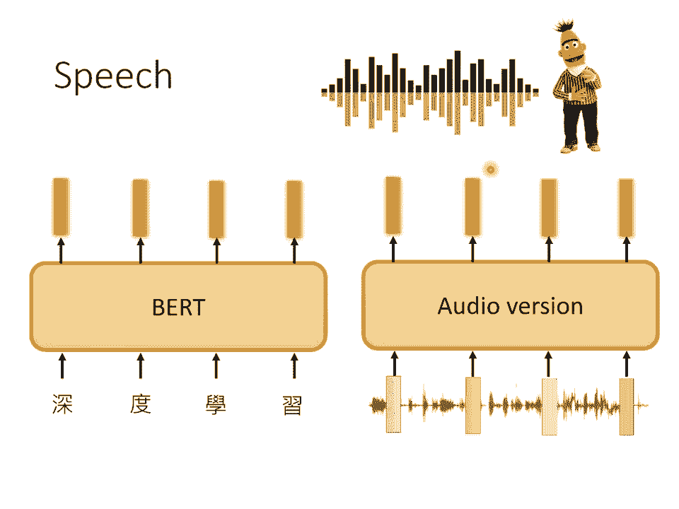
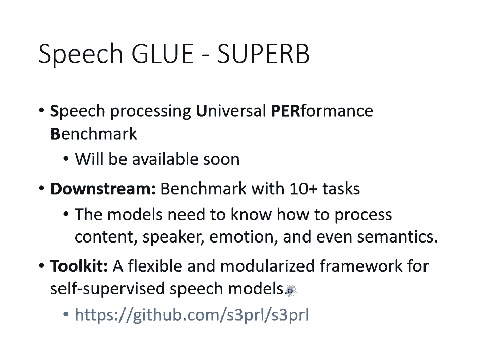

# P21：L13.4- 自督导式学习4：GPT - ShowMeAI - BV1fM4y137M4

上次我們還沒有把Sales Supervised Learning的部分講完，我們講完了BERT，除了BERT以外，還有下一個也是鼎鼎有名的模型，就是GPT系列的模型，那GPT系列的模型做的是什麼呢？

上次我們有說BERT做的是什麼？BERT做的是填空題。

GPT做的事情是什麼呢？GPT就是改一下我們現在在Sales Supervised Learning的時候要模型做的任務，GPT要做的任務是預測接下來會出現的token是什麼，舉例來說。

假設你的訓練資料裡面有一個句子是台灣大學，那GPT拿到這筆訓練資料的時候，他會做什麼樣的訓練呢？他做的事情是這樣，你給他Begin of Sentence這個token。

然後GPT output一個embedding，接下來你用這個embedding去預測下一個應該出現的token是什麼，那在這個句子裡面根據這筆訓練資料，下一個應該出現的token是什麼呢？

下一個應該出現的token是台，所以你要訓練你的模型根據第一個token，根據Begin of Sentence給你的embedding，他要輸出台這個token，如果這個部分詳細來看就是這樣。

你有一個embedding，這邊用H來表示，然後通過一個linear transform，再通過一個softmax得到一個distribution，跟一般你做分類的問題是一樣的。

接下來你希望你output的distribution跟正確答案的cross entropy越小越好，也就是你要去預測下一個出現的token是什麼，接下來要做的事情就是以此類推了，你給你的GPT。

Begin of Sentence跟台，他產生embedding，接下來他要預測下一個出現的token是什麼，那你告訴他說下一個應該出現的token是灣，再反覆繼續下去。

你給他Begin of Sentence台跟灣，然後預測下一個應該出現的token，他應該要預測大，你給他台跟灣跟大，接下來下一個應該出現的token是學，他應該要預測出下一個應該出現的token是學。

那這邊呢，是只拿一筆資料，一個句子來給GPT訓練，但實際上你不會只用一筆句子，你會用成千上萬的句子來訓練這個模型，然後呢，就沒有然後了，就這樣子，說完了，那他厲害的地方就是。

用了很多資料訓練了一個異常巨大的模型，然後看看他會有什麼厲害的地方，那這邊有一個小小的應該要跟大家說的地方是說，這個GPT的模型啊，他像是一個transformer的decoder。

我們知道transformer有encoder有decoder，對不對，這個我們上課的時候都有講過，模型呢，他的架構像是transformer的decoder。

不過要拿掉prose pretension的部分，也就是說你會做那個mask的attention，就是你現在在預測給begin of sentence預測台的時候，你不會看到接下來出現的詞彙。

給他台要預測1的時候，你不會看到接下來要輸的詞彙。

這個就是GPT，那這GPT最知名的就是，因為GPT可以預測下一個token，那所以他有生成的能力，你可以讓他不斷的預測下一個token產生完整的文章，所以我每次提到GPT的時候，他的形象呢。

都是一隻獨角獸，為什麼他的形象是一隻獨角獸呢？因為GPT系列最知名的一個例子，就是用GPT寫了一篇跟獨角獸有關的新聞，就他放一個假新聞，然後那假新聞裡面說，在安迪斯山脈發現獨角獸等等。

一個活靈活現的假新聞，所以大家提到GPT的時候，都會想到那一則假新聞，那為了讓你更清楚了解GPT運作起來是什麼樣子，那這個線上有一個demo的網頁啦，叫做talk2transformer。

就是有人把一個比較小的，不是那個最大的GPT的模型，最大的GPT模型不是public available的，有人把比較小的GPT模型放在線上，讓你可以輸入一個句子，讓他會把接下來的，其餘的內容。

把它補完，他這個運作起來，看起來像是，好，這個就是GPT系列，他可以把一句話補完，那把一句話補完，怎麼把它用在Dunk Dream的任務上呢？舉例來說，怎麼把它用在question answering。

或者是其他的跟人類語言處理有關的任務上呢？GPT用的想法跟BERT不一樣，其實我要強調一下，GPT也可以跟BERT用一樣的做法，大家還記得BERT是怎麼做的嗎？把BERT model拿出來。

後面接一個簡單的linear classifier，那你就可以做很多事情，你也可以把GPT拿出來，接一個簡單的classifier，我相信也是會有效，但是在GPT的論文中，他沒有這樣做。

他有一個更狂的想法，為什麼會有更狂的想法呢？因為首先就是BERT那一招，BERT用過了嘛，所以總不能再用一樣的東西，這樣寫論文就沒有人覺得厲害了，然後再來就是GPT的模型，也許真的太大了。

大到連Finetune可能都有困難，你想想看我們在用BERT的時候，你要把BERT的模型後面接一個linear classifier，然後BERT也是你要train的model的一部分。

所以他的參數也是要調的，所以在剛才助教公告的BERT相關的作業裡面，你還是需要花一點時間來train，雖然助教說大概20分鐘就可以train完了，因為你並不是要train一個完整的BERT的模型。

BERT的模型在之前在做填空題的時候，已經訓練得差不多了，你只需要微調他就好了，但是微調還是要花時間的，因為GPT實在是太過巨大，巨大到要微調他，要train一個APOC可能都有困難。

所以GPT系列有一個更狂的使用方式，這個更狂的使用方式和人類更接近，你想想看假設你去考脫服的聽力測驗，你是怎麼去考脫服的聽力測驗的呢？這個脫服聽力測驗的敘述是長什麼樣子的呢？首先你會看到一個題目的說明。

告訴你說現在要考選擇題，請從ABCD四個選項裡面選出正確的答案等等，然後給你一個範例告訴你說這是題目，然後正確的答案是多少，然後你看到新的問題，期待你就可以舉一反三開始作答，GPT系列要做的事情就是。

這個模型能不能夠做一樣的事情呢？舉例來說假設要GPT這個模型做翻譯，就先打Translate English to French，就先給他這個句子，這個句子代表問題的描述，然後給他幾個範例跟他說。

See Otter然後箭號後面就應該長這個樣子，或者是Plush Giraffe後面就應該長這個樣子等等，然後接下來你問他說Cheese 箭號，叫他把後面的補完，他就可以產生翻譯的結果。

不知道大家能不能夠了解這個想法是多麼的狂，在Training的時候，GPT並沒有教他做翻譯這件事，他唯一學到的就是給一段文字的前半段，把後半段補完，就像我們剛才給大家示範的例子一樣。

現在我們直接給他前半段的文字就長這個樣子，到時候他說你要做翻譯了，給你幾個例子，到時候你說翻譯是怎麼回事，接下來給他Cheese這個英文單字，後面能不能就直接接出法文的翻譯結果呢。

這個在GPT的文獻裡面叫做Fuchsia Learning，但是他跟一般的Fuchsia Learning又不一樣，所謂Fuchsia的意思是說確實只給了他一點例子，所以叫做Fuchsia。

但是他不是一般的Learning，這裡面完全沒有什麼Gradient Descent，我們Training的時候就是要跑Gradient Descent，這邊完全沒有Gradient Descent。

完全沒有要去調GPT那個模型參數的意思，所以在GPT的文獻裡面，把這種訓練給了一個特殊的名字，他們叫做In Context Learning，代表說他不是一種一般的Learning。

他連Gradient Descent都沒有做，當然你也可以給GPT更大的挑戰，我們在考托福聽力測驗的時候，都只給一個例子而已，那GPT可不可以只看一個例子，就知道他要做翻譯這件事。

這個叫One-Shot Learning，還有更狂的是Zero-Shot Learning，直接給他一個敘述說我們現在要做翻譯了，GPT能不能夠自己就看得懂，就自動知道說要來做翻譯這件事情呢。

那如果能夠做到的話，那真的就非常的驚人，那GPT系列到底有沒有達成這個目標呢，這個是一個見仁見智的問題啦。

他不是完全不可能答對，但是正確率有點低，相較於你可以微調模型，正確率是有點低的，細節你就再看看GPT那篇文章，GPT第三代的GPT啊，他測試了42個任務，縱軸是正確率，那這些時線啊。

這三條時線是42個任務的平均正確率，那這邊包括了Few-Shot， One-Shot， Zero-Shot，三條線分別代表Few-Shot， One-Shot， Zero-Shot，橫軸代表模型的大小。

他們測試了一系列不同大小的模型，從只有0。1個Billion的參數，到175個Billion的參數，我們看Few-Shot learning的部分，從20幾%的正確率，平均正確率。

一直做到50幾%的平均正確率，那至於50幾%的平均正確率，算是有做起來還是沒有做起來，那這個就是見仁見智的問題啦，那目前看起來的狀況是，有些任務他還真的學會了，舉例來說，這個加減法，你給他一個數字。

這個加減法，你給他一個數字，加另外一個數字，他這個可以得到正確的兩個數字，加起來的結果，但是有些任務，他可能怎麼學都學不會，比如說一些跟邏輯推理有關的任務，他的結果就非常非常的慘。

那有關GPT-3的細節，這個就留給大家再自己研究，然後這邊有一個過去上課的錄影。

我把連結放在這邊給大家參考，剛才舉的例子，到目前為止我們舉的例子，都是只有跟文字有關，但是你不要誤會說這種，Self-supervised learning的概念，只能用在文字上，在語音。

在CVCV就是Computer Vision，也就是影像，在語音跟影像的應用上，也都可以用Self-supervised learning的技術。

那其實今天Self-supervised learning的技術，非常非常的多，我們講的BERT跟GPT系列，他只是三個類型的，Self-supervised learning的方法的其中一種。

他們是屬於Prediction那一類，那其實還有其他的類型，那就不是我們這一堂課要講的，接下來的課程呢，你可能會覺得有點流水賬，就是我們每一個主題呢，就是告訴你說這個主題裡面有什麼。

但是細節這個更多的知識，就留給大家自己來做更進一步的研究，所以這一頁投影片只是要告訴你說，在Self-supervised learning這個部分，我們講的只是整個領域的其中一小塊。

那還有更多的內容是等待大家去探索的，那有關影像的部分呢。

我們就真的不會細講，我這邊就是放兩頁投影片帶過去。

告訴你說，有一招非常有名的叫做Sincere，他的概念也不難。

我相信你自己讀論文，應該也有辦法看懂他。

那還有很奇怪的叫做Boreal，Boreal這個東西呢，我們是不太可能在上課講他，為什麼呢？因為根本不知道他為什麼會work，就是這個，這是很新的論文，這個是去年夏天的論文。

那這個論文是假設他不是已經發表文章，然後學生來跟我提這個想法，我一定就是不會讓他走，我覺得這不可能會work的，這是不可能會實踐的想法，不可能會成功的，這個想法感覺是一個巨大的瑕疵，為什麼？

他是work的，而且還曾經一度得到State of the Art的結果，Deep Learning就是這麼神奇，好，所以這個呢。

我們也就不細講就跳過去，好，那在語音的部分，你也完全可以使用。

Self-supervised learning的概念，你完全可以試著訓練，語音版的Bird，那怎麼訓練語音版的Bird呢？你就看看文字版的Bird是怎麼訓練的？比如說做填空題，語音也可以做填空題。

也可以做填空題，就把一段聲音序號蓋起來，機器去拆，被蓋起來的部分是什麼嘛，語音也可以預測接下來會出現的內容，像GPT就是預測接下來要出現的Token嘛，那語音你也可以叫它，預測。

叫模型預測接下來會出現的聲音序號，所以你也可以做語音版的GPT，所以你也可以做語音版的GPT，不管是語音版的Bird，語音版的GPT，其實都已經有很多相關的研究成果了，不過其實在語音上啊。

相較於文字處理的領域，還是有一些比較缺乏的東西，那我認為現在很缺乏的一個東西，就是像Groove，這樣子的Benchmark Compos，在自然語言處理的領域，在文字上。

有Groove這個Compos，我們在這一堂課的，這一門課的剛開頭，這個投影片剛開頭就告訴你說，有一個這個基準的資料庫，叫做Groove，它裡面呢有9個NLT的任務，今天你要知道Bird做得好不好。

就讓它去跑，那9個任務再去平均，那代表這個Self-supervised learning模型的好壞，但在語音上到目前為止，還沒有類似的，基準的資料庫，所以我們實驗室呢，就跟其他的研究團隊。

共同開發了一個語音版的Groove，我們叫做Superb，它是Speech-Persisting Universal Performance Benchmark的縮寫，你知道今天你，做什麼模型都一定要。

硬湊梗才行啦，所以這邊也是要硬湊一個梗，它叫做Superb，其實我們已經準備的差不多了，其實網站都已經做好了，等其他團隊的人看過以後，就可以上線了，所以現在雖然還沒有上線。

但是再過一陣子你應該就可以找到相關的連結，在這個基準語料庫裡面，包含了10個不同的任務，那語音，其實有非常多不同的面向，很多人講到語音相關的技術，都只知道語音辨識，把聲音轉成文字。

但這並不是語音技術的全貌，語音其實包含了非常豐富的資訊，它除了有，內容的資訊，就是你說了什麼，還有其他的資訊，舉例來說這句話是誰說的，舉例來說這句話的時候，它的語氣是什麼樣，還有這句話背後。

它到底有什麼樣的語意，所以我們準備了10個不同的任務，這個任務包含了語音不同的面向，包括去檢測一個模型，它能夠識別內容的能力，識別誰在說話的能力，識別它是怎麼說的能力，甚至是識別這句話背後語意的能力。

從全方位來檢測一個Self Supervised能力的模型，它在理解人類語言上的能力，而且我們還有一個Toolkit，這個Toolkit裡面就包含了。

各式各樣的Self Supervised能力的模型，還有這些Self Supervised能力的模型，它可以做的各式各樣語音的下游的任務，然後把連結放在這邊給大家參考，講這些只想告訴大家說。

Self Supervised能力的技術，不是只能被用在文字上，在這個影像上，在語音上，都仍然有非常大的空間，可以使用Self Supervised能力的模型。

可以使用Self Supervised能力的技術，好，那這個Self Supervised能力的部分，這個Birds跟GVT。

我們就講到這邊。