# P23：L14.2- 自编码器2：领结变声器与更多应用 - ShowMeAI - BV1fM4y137M4

好，那我们接下来除了Autoencoder可以用来做Downstream的任务以外，我还想跟大家分享一下Autoencoder其他有意思的应用。

那我跟大家讲这个Feature的Disentanglement。

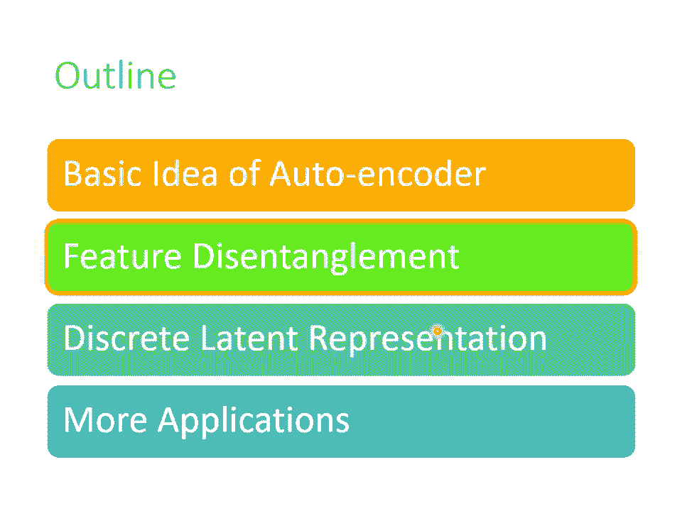

好，Feature的Disentanglement是什么意思呢？什么是Disentangle呢？Disentangle的意思就是把一堆本来纠缠在一起的东西把它解开，这个东西就叫做Disentangle。

那为什么会有Disentangle这个议题呢？我们来想想看Autoencoder它在做的事情是什么，Autoencoder在做的事情是如果是图片的话，就是把一张图片变成一个Code。

再把Code变回图片，既然这个Code可以变回图片代表说这个Code里面有很多的资讯，包含图片里面所有的资讯，举例来说图片里面有什么样的东西啊，图片的色泽纹理啊等等。

Autoencoder这个概念也不是只能用在影像上，如果用在语音上，你可以把C段声音丢到Encoder里面变成项量，再丢回Decoder变回原来的声音，代表这个项量包含了语音里面所有重要的资讯。

包括这句话的内容是什么，就是Content的资讯，还有这句话是谁说的，就是Speaker语者的资讯，那如果今天是一篇文章丢到Encoder里面变成项量，这个项量通过Decoder会变回原来的文章。

那这个项量里面有什么，它可能包含文章里面文句的句法的资讯，也包含了语意的资讯，但是这些资讯是全部纠缠在一个项量里面，我们并不知道一个项量的哪些维代表了哪些资讯。

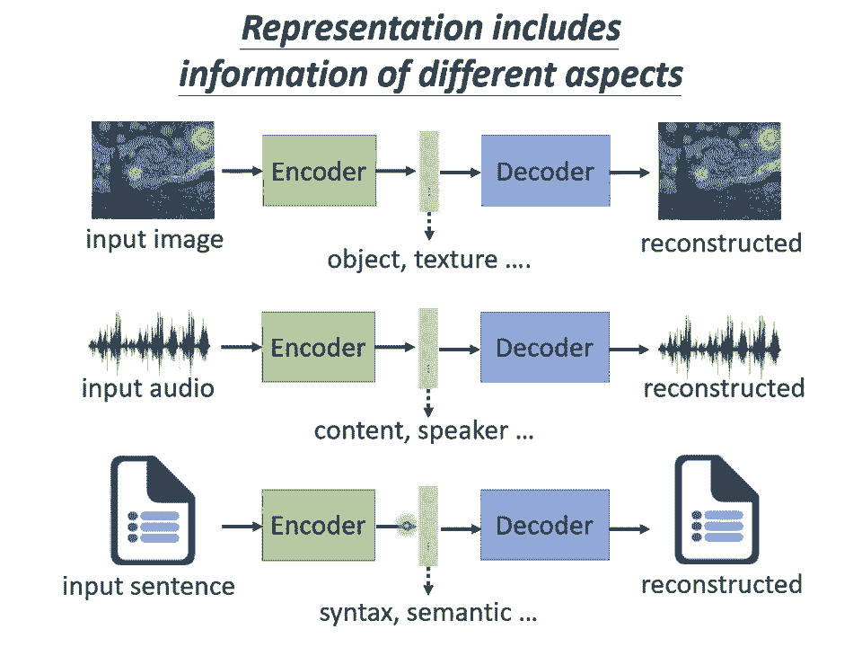

举例来说，如果我们今天把一段声音讯号丢进Encoder，它会给我们一个项量，但是这个项量里面哪些维度代表了这句话的内容，哪些维度代表这句话的语者，也就是谁说的，我们没有这样的资讯。

而Future Disentangle想要做到的事情就是，我们有没有可能想办法在Train一个Autoencoder的时候，同时有办法知道Representation，或又叫做Embedding。

或又叫做Code，它们是一样的东西，我们这个Embedding的哪些维度代表了哪些资讯呢，我们有没有可能做到说Encoder输出一个，举例来说，100维的项量，我们知道说前50维就代表了这句话的内容。

后50维就代表了这句话说话人的特征呢，那这样子的技术就叫做Future Disentangle，那Future Disentangle其实有很多各式各样的技术啦，那实际上是怎么做的，我本来想要讲。

后来犹豫一下，想说我们先不要讲这件事情好了，我们主要就是想告诉大家说，Future Disentangle是有办法做的，那至于实际上怎么做，那这边就列几篇论文给有兴趣的同学参考，如果没有兴趣的话。

你就知道说这件事情是可行的，我们有可能知道Autoencoder里面每一个Dimension代表了什么样的资讯，好，那制作Future Disentangle有什么样的应用呢。

那你可以想想看有什么样的应用啦，这边举一个语音上的应用，这个应用叫做Voice Conversion，那什么是Voice Conversion呢，Voice Conversion的中文叫做余者转换。

所以也许你没有听过余者转换这个词汇，但是你一定看过它的应用，它就是柯南的理结变声器，这个在20年前阿力博士就已经做得很成功了啦，那只是过去阿力博士在做这个Voice Conversion的时候啊。

我们需要成对的声音讯号，也就是假设你要把A的声音转成B的声音，你必须把A跟B都找来，叫它念一模一样的句子，就A说How are you，B也说How are you，A说Good morning。

B也说Good morning，它们两个各说一样的句子，说个一千句，接下来呢就结束了，这是Supervised Learning的问题啊，没有成对的资料，train一个Supervised的Model。

把A的声音丢进去输出就变成B的声音，就结束了，但是如果A跟B都需要念一模一样的句子，念个五百一千句，显然是不切实际的，举例来说假设我想要把我的声音，转成星元结一的声音，我得把星元结一找来。

更退一万步说假设我真的把星元结一找来，它也不会说中文啊，所以它没有办法跟我念一模一样的句子，而今天有了Feature Disentangle的技术以后，也许我们期待机器可以做到。

就给它A的声音给它B的声音，A跟B不需要念同样的句子，甚至不需要讲同样的语言，机器也有可能学会把A的声音转成B的声音。

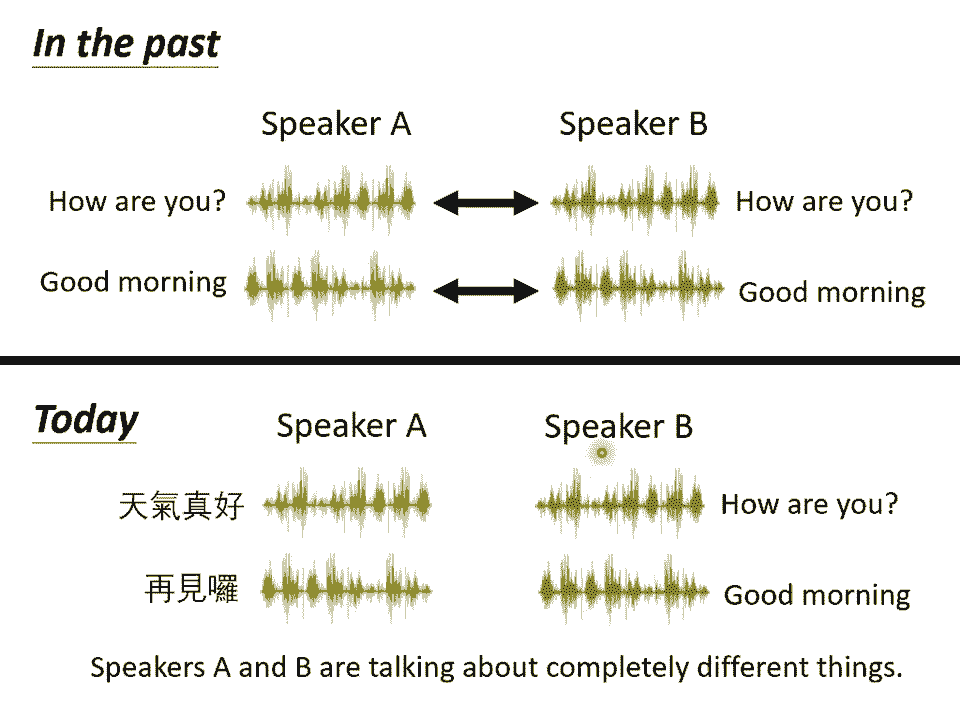

那实际上是怎么做的呢，假设我们收集到一大堆人类的声音讯号，然后拿这堆声音讯号去train一个Autoencoder，同时我们又做了Feature Disentangle的技术。

所以我们知道在Encoder的输出里面，哪些维度代表了语音的内容，哪些维度代表了语者的特征，接下来我们就可以做语音的转换，怎么说呢，因为在Encoder里面，我们已经知道哪些部分代表内容。

哪些部分代表语者，接下来我们就可以把两句话，声音跟内容的部分互换，举例来说，这边是我的声音，我说"How are you"丢进Encoder以后，那你就可以抽出。

你就知道说这个Encoder里面某些维度，代表"How are you"的内容，某些维度代表我的声音，今天你把你老婆的声音丢进Encoder，它就知道某一些维度代表你老婆说的话的内容。

某一些维度代表你老婆声音的特征，接下来我们只要把，我说话的内容的部分取出来，把你老婆说话的声音的部分，声音特征的部分取出来，把它拼起来，丢到Encoder里面，就可以用你老婆的声音，讲我说的话的内容。

这件事情真的有可能办到吗，以下是真正的例子，听起来像是这个样子，"Do you want to study a PhD？"，这个是我的声音，就是问你要不要念博班，人生门课里面，我们就是要冷不防开始。

业配念博班这件事情，把我的声音丢到Encoder里面以后，你可以想象说在Encoder里面，我们知道哪些维度代表了念博班这件事，哪些维度代表了我的声音，为了简化起见，你就想象说它输出100维的相量。

前50维代表内容，后50维代表说话人的特征，接下来这句话是你老婆说的，"你是不是很忙？"，不太确定在说什么，就是日文，不太确定在说什么，把这句话丢到Encoder里面。

一样这个Encoder的输出前50维是日文，后50维代表你老婆说话的特征，接下来就把我的声音的前50维，代表内容的部分取出来，把你老婆的声音丢进Encoder以后，后50维的部分抽出来。

拼起来一样是一个100维的相量，丢到Decoder里面，看看输出来的声音是不是，就是你老婆叫你念博班的声音，听起来像是这个样子，"我没有忘记是哪里的PSP"，你老婆叫你念博班啦知道吗。

还不赶快乖乖签下去，其实反过来也可以啦，就是换成把日文的部分拿出来，把我的声音的特征拿出来，一样串成一个100维的相量，丢到Decoder里面，它听起来就会变成这样，"什么对什么信息？"。

我也不知道自己在说什么就是了，所以确实用Feature Disentangle，你有机会做到Voice Conversion，其实在影像上，在NLP上，也都可以有类似的应用。

所以可以想想看Feature Disentangle，可以做什么样的事情。

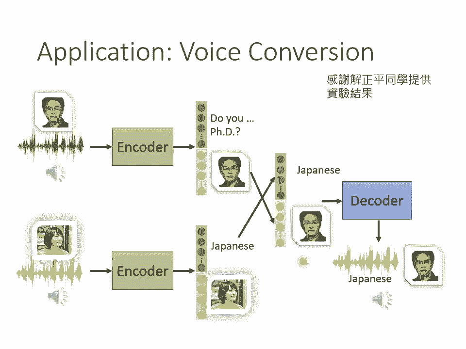

好那下一个要跟大家讲的应用，叫做Discrete Latent Representation。

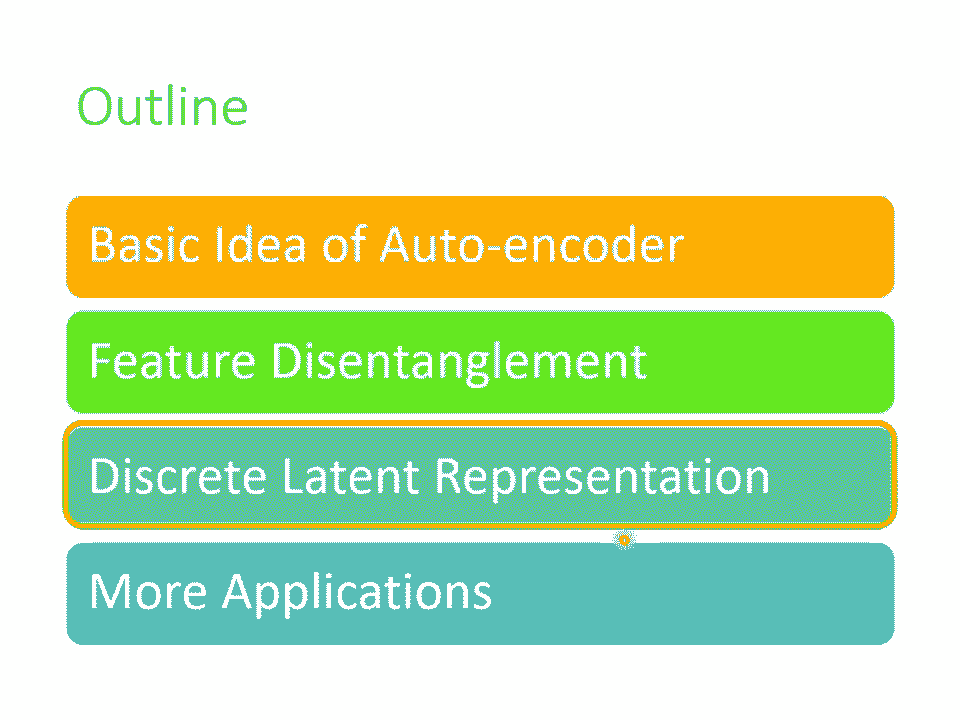

到目前为止我们都假设这个Embedding，它就是一个相量，相量就是一串数字，它是Real Number，那它可不可以是别的东西呢，举例来说，它可不可以是Binary，那Binary有什么好处呢。

Binary的好处也许是说，每一个维度它就代表了，某种特征的有或者是没有，举例来说书的这张图片，如果是女生可能第一维就是1，男生第一维就是0，戴眼镜就是第三维是1，没有戴眼镜就是第三维是0。

也许我们把这个相量这个Embedding，变成Binary的，变成只有0跟1的数字，可以让我们在解释Encoder的输出的时候，更为容易，甚至有没有可能这个相量，强迫它一定要是1 Hard呢。

也就只有一维是1，其他就是0，如果我们强迫它是1 Hard，也就是每一个图片丢进去，你的Embedding里面只可以有一维是1，其他都是0的话，那可以做到什么样的效果呢。

也许可以做到Unsupervised的分类，举例来说，假设你想要做手写数字辨识，你有0到9的图片，你把0到9的图片通通收集起来，train一个这样子的Autoencoder。

然后强迫中间的Latent Representation，强迫中间的这个Code，一定要是1 Hard Vector，那你这个Code正好设个10维，也许每一个1 Hard Code。

就你设10维就有10种可能的1 Hard Code，也许每一种1 Hard Code，正好就对应到一个数字，也说不定，所以今天如果用1 Hard Vector，来当作你的Embedding的话。

也许就可以做到，在完全没有Label Data的情况下，让机器自动学会分类，其实还有其他。

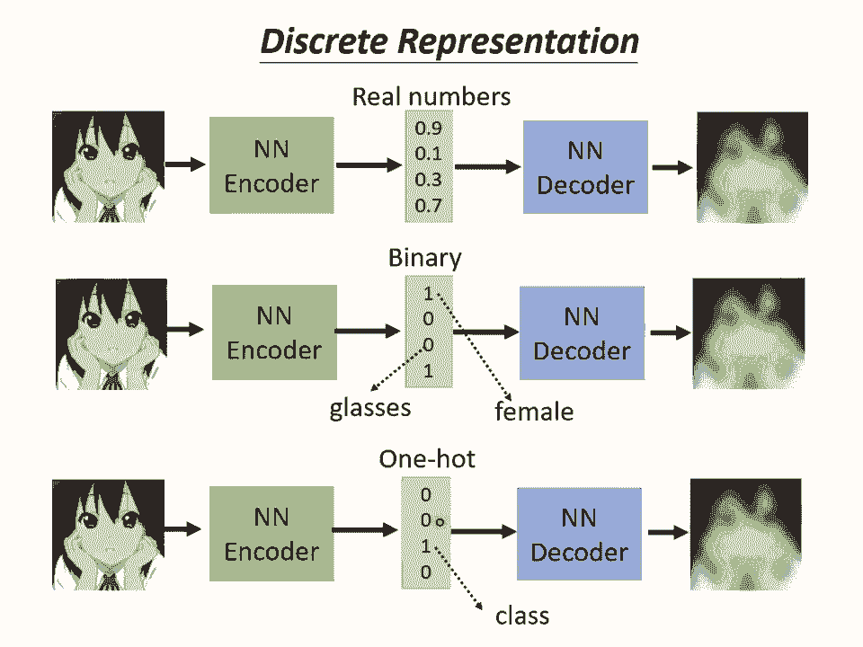

在这种Discrete Representation的技术里面，其中最知名的就是，VQ-VAE Vector Quantized Variable Autoencoder，那VQ-VAE是这样子运作的。

就是你输入一张图片，Encoder输出一个向量，这个向量它是一般的向量，它是Continuous的，但接下来你有一个Codebook，所谓Codebook的意思就是，你有一排向量，这排向量也是认出来的。

你把Encoder的输出，去跟这排向量都去算个相似度，你发现这件事情，其实跟Self-Attention有点像，这个Vector就是Query，这些Vector就是Key。

就是跟Attention是很像的，我们在讲Self-Attention的时候，花很多力气讲Query、Key跟Value，所以这个东西就是Query，这个东西就是Key。

那接下来就看这些Vector里面，谁的相似度最大，你把相似度最大的Vector拿出来，这边就是Key跟Value，等于是共用同一个Vector，如果你把这个Process。

用Self-Attention来比喻的话，那就等于是Key跟Value，是共用同一个Vector，把这个Vector丢到Decoder里面，然后要它输出一张图片，接下来你Training的时候。

就是要让输入跟输出越接近越好，这个Decoder、这个Encoder、这一个Codebook，都是一起从资料里面被学出来的，这样做的好处就是。

你就有Discrete的Later Representation，也就是说这边Decoder的输入，一定是这边Codebook里面，有32个相量的其中一个，假设Codebook里面有32个相量。

那你Decoder的输入就只有32种可能，你等于就是让你的Embedding，它是离散的，它没有无穷无尽的可能，它只有32种可能而已，那其实像这样子的技术，如果你把它用在语音上。

你就是一段声音宣号输进来，通过Encoder以后产生一个相量，接下来你去计算相似度，所以像那个相量拿出来，丢给Decoder再输出一样的声音宣号，这个时候你会发现你的Codebook。

可能可以学到最基本的发音单位，举例来说，这个最基本的发音单位又叫做Phoning，如果你不知道Phoning是什么的话，你就把它想成是KK音标，那你就会发现Codebook里面，每一个Vector。

它就对应到某一个发音，就对应到KK音标里面的某一个符号，这个是VQVAE。

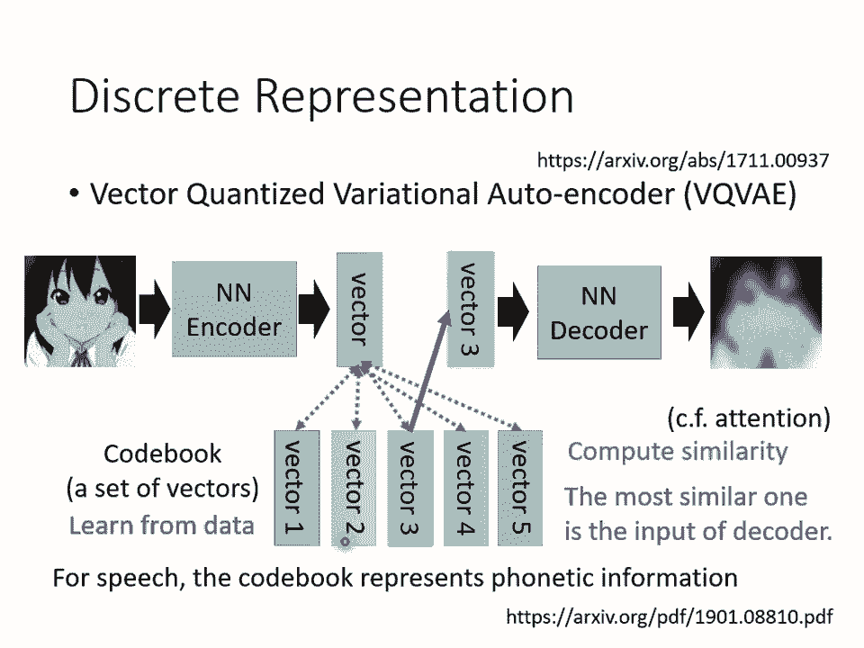

那其实还有更多疯狂的想法，Representation，一定要是相量吗，能不能是别的东西，举例来说，它能不能是一段文字，是可以的，举例来说，假设我们现在要做文字的Autoencoder。

文字的Autoencoder，概念跟语音的影像的没有什么不同，就是你有一个Encoder，一篇文章丢进去，也许产生一个什么东西，一个相量，把这个相量丢到Encoder，再让它还原原来的文章。

但我们现在可不可以不要用相量，来当做Embedding，我们可不可以说，我们的Embedding就是一串文字呢，如果把Embedding变成一串文字，有什么好处呢，也许这串文字就是文章的摘要。

因为你想想看，把一篇文章丢到Encoder里面，它输出一串文字，而这串文字可以透过Encoder，还原回原来的文章，那代表说这段文字，是这篇文章的精华，也就是这篇文章最关键的内容，也就是这篇文章的摘要。

不过这边的Encoder，显然需要是一个，Sequence to Sequence的Model，比如说Transformer，因为我们这边输入是文章嘛，这边输出是一串文字嘛。

这个Encoder输入是一串文字，输出是文章嘛，所以都是输入一串东西，输出一串东西，输入一串文字，输出一串文字，所以Encoder跟Depoder，显然都必须要是一个。

Sequence to Sequence的Model，所以可以想象说，这边是一个你作业，我在训练的Transformer，这个也是另外一个Transformer，它们都是读一段文字，输出另外一段文字。

所以这整个Autoencoder合起来，它不是一个普通的Autoencoder，它是一个Sequence to Sequence，to Sequence的Autoencoder。

它把长的Sequence，转成短的Sequence，再把短的Sequence，还原回长的Sequence，而这个Autoencoder在训练的时候，不需要标注的资料，因为训练Autoencoder。

只需要收集大量的文章，收集大量没有标注的资料，在这边就是大量的文章就可以了，如果你真的可以训练出这个模型，如果这串文字真的可以代表摘要的话，你就是让机器自动学会，做摘要这件事，让机器自动学会做。

Unsupervised Summarization，但是真的有这么容易吗，实际上这样train起来以后发现，嗯 是行不通的，为什么，因为这两个Encoder跟Decoder之间，会发明自己的暗号啊。

所以它会产生一段文字，但这段文字是你看不懂的，你看不懂的文字，这Decoder可以看得懂，它还原得了原来的文章，但是人看不懂，所以它根本就不是一段摘要，所以怎么办呢，再用GAME的概念。

加上一个Discriminator，Discriminator看过人写的句子，所以它知道人写的句子长什么样子，但这些句子不需要是这些文章的摘要，就是另外一堆句子，所以它知道人写的句子长什么样子，然后呢。

这个Encoder要想办法去骗过Discriminator，Encoder要想办法产生一段句子，这段句子不只可以透过Decoder，还原回原来的文章，让Discriminator觉得像是人写的句子。

其他人透过这个方法，就会强迫Encoder，不只产生一段密码，可以给Decoder去破解，而是产生一段人看得懂的摘要，那你可能会问说，这个内网要怎么train啊，这个output是一串文字哦。

那这个文字要怎么接给Discriminator跟Decoder呢，告诉你看到你没办法train的问题，就用RL硬做，这边就是用RL硬做就结束了，所以这个内网后来硬train起来以后呢。

你可能会觉得这个概念有点像Cycle Gain，没错，你可以想，这根本就是Cycle Gain，这是一个Generator，这是另外一个Generator，这是Discriminator。

然后输入跟输出越接近越好，其实这根本就是Cycle Gain，我们只是从Auto Encoder的角度。

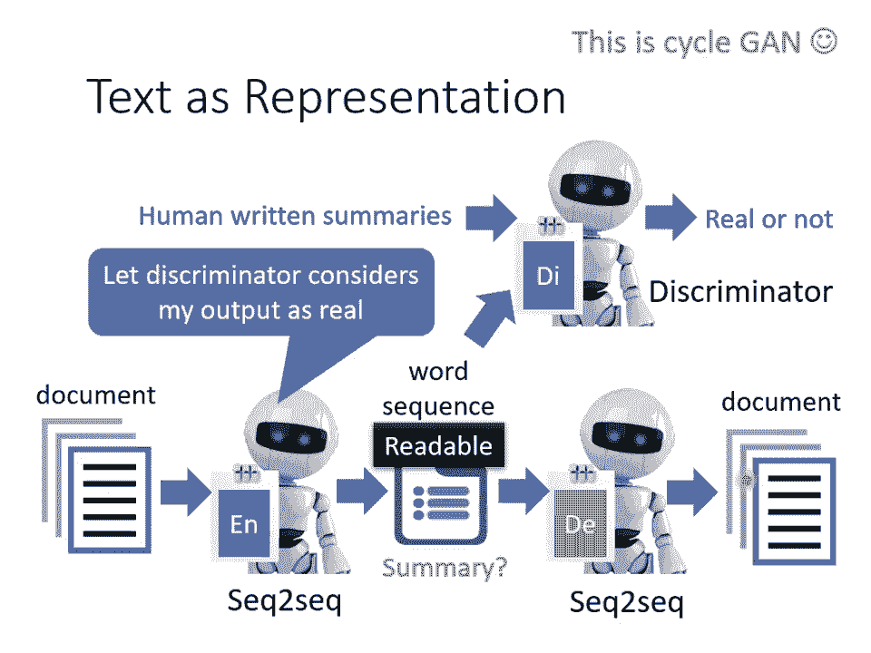

来看待Cycle Gain这个想法而已，好，那实际上做的结果是怎么样呢，以下是真正Nervo输出的结果，你给他读一篇文章，然后他就用Auto Encoder的方法，拿三百万篇文章做训练以后。

然后看看给他一篇新的文章，他可不可以是那个Encoder输出的句子，是不是就是人可以看得懂的摘要，举例来说，给Encoder看这篇文章，他的输出是澳大利亚加强体育竞赛之外的药品检查，看起来还可以。

那这边有一个特别强的啦，就是这篇文章是中华民国奥林匹克委员会，今天接到1992年冬季奥运会邀请函，丢给Encoder之后，他的输出是奥委会接获冬季奥运会邀请函，他知道把奥林匹克委员会。

自己就缩写成奥委会，这个不知道怎么回事，他自己就学到了这件事情，当然很多时候他也是会犯错的，我特别喜欢举这种极其犯错的例子，举例来说，你给他读这篇文章，印度尼西亚苏门达拉岛近日来连降暴雨。

机器产生的灾药是什么呢，Encoder的输出是印尼门洪水泛滥，印尼门是什么东西呢，大概就是印度尼西亚苏门的缩写啦，可能人类写的句子里面常常出现，罗森门、通俄门等等什么门，所以机器觉得。

Encoder觉得，印度尼西亚苏门应该可以缩写成印尼门，那有时候他也会产生莫名其妙的句子，比如说把这篇文章给机器读了以后，Encoder的输出是，合肥领导干部下基层坐稿，迎来送往规定一律解除。

不知道在说些什么，总之是个句子，不知道在说些什么，所以这个例子只是想要告诉你说，我们确实有可能拿一段文字来当作embedding，其实还有更狂的。

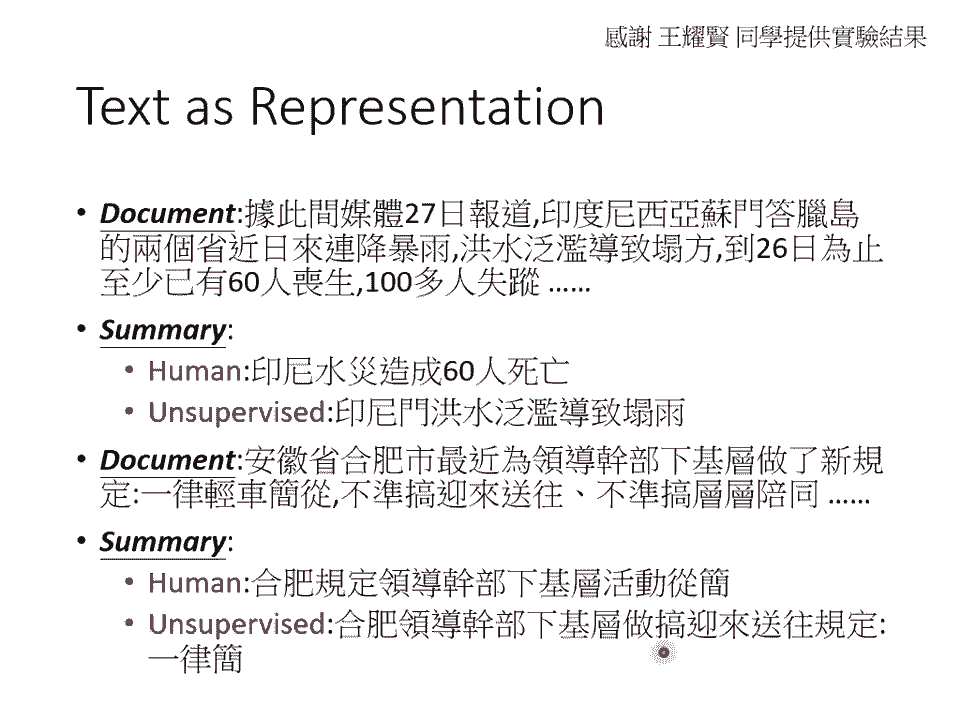

我还看过有拿tree structure当作embedding，就一段文字把它变成tree structure，再用tree structure还原一段文字。

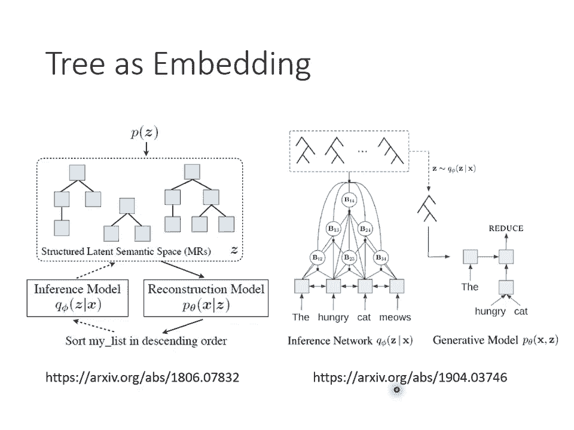

我把reference 贴在这边给大家参考，接下来还有Autoencoder更多的应用。

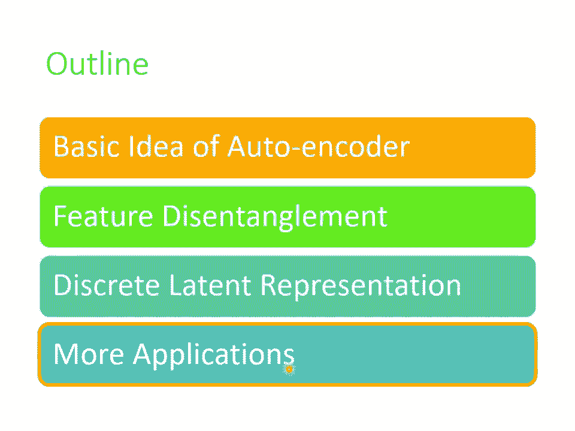

Autoencoder还可以拿来做些什么事情呢，举例来说，我们刚才用的都是encoder，其实decoder也有作用，你把decoder拿出来，这不就是一个generator吗。

我们说generator不是就是要吃一个项量，产生一个东西，比如说一张图片吗，而decoder不正好是吃一个项量，产生一张图片吗，所以decoder你可以把它当作一个generator来使用。

你可以从一个已知的distribution，比如说Gaussian distribution，sample一个项量丢给decoder，看它能不能够输出一张图片。

事实上在我们之前在讲这个generative model的时候，其实有提到说除了game以外，还有另外两种generative的model。

其中一个就叫做VAE Variational的Autoencoder，你看它名字里面都有Autoencoder，显然是跟Autoencoder非常有关系的。

它其实就是把Autoencoder的decoder，拿出来当作generator来用，实际上它还有做一些其他的事情，至于它实际上做了什么其他的事情，就留给大家自己研究。

所以AutoencoderTrend完以后，你也顺便得到了一个decoder，Autoencoder可以拿来做压缩，我们今天知道说你在做图片，我们图片如果太大的话，你会有一些压缩的方法。

比如说JPEG的压缩，而Autoencoder也可以拿来做压缩，你完全可以把encoder的输出，当作是一个压缩的结果，因为一张图片是一个非常高维的项量，而一般我们encoder的输出。

是一个非常低维的项量，你完全可以把那个项量，看作是一个压缩的结果，所以你的encoder做的事情就是压缩，而你的decoder做的事情就是解压缩，那只是这个压缩啊，它是那种loose的压缩。

loose的压缩就是它会失真，因为在Trend Autoencoder的时候，你没有办法Trend到说，输入的图片跟输出的图片，100%完全一模一样了，它还是会有一些差距的。

所以这样子的Autoencoder的压缩技术，你拿这样子的技术来做压缩，那你的图片是会失真的，就跟JPEG图片会失真一样，用这个Autoencoder来做压缩，你的图片也是会失真的。

好那接下来就是我们在作业里面，要使用的技术，在作业里面我们会拿Autoencoder，来做anomaly的detection，那我在规划作业的时候，其实就是想要Autoencoder出一个作业。

那Autoencoder的技术很多，那最后我决定做anomaly的detection，因为这个是你在非常多的场合，都有机会应用到的一个技术，好anomaly的detection，要做的是什么呢。

它要做的事情就是，假设你有一堆的训练资料，这边用X1到Xn来表示我们的训练资料，而anomaly detection，它的中文通常翻译成异常检测，异常检测要做的事情就是，来了一笔新的资料。

它到底跟我们之前在训练资料里面，看过的资料相不相似呢，也就是说你需要找出，你需要有一个异常检测的系统，这个异常检测的系统，是透过大量你已经看过的资料，训练出来的，给它一笔新的资料，如果这笔新的资料。

看起来像是训练资料里面的data，就说它是正常的，如果看起来不像是训练资料里面的data，就说它是异常的，那其实anomaly这个词，有很多不同的其他的称呼，比如说有时候你会叫它outlier。

有时候你会叫它novelty，有时候你会叫它exception，但其实指的都是同样的事情，你就是要看某一笔新的资料，它跟之前看过的资料，到底相不相似，但是所谓的相似这件事，其实并没有非常明确的定义。

它是见仁见智的，会根据你的应用情境而有所不同，举例来说，假设现在你的训练资料，这个都是雷丘，那这个皮卡丘就算是异常的东西，但是假设你的训练资料里面，你所有的动物都是皮卡丘，那雷丘就是异常的东西。

所以我们并不会说某一个东西，它一定就是normal，一定就是anomaly，我们不会说某个东西，它一定是正常或异常，它是正常或异常，取决于你的训练资料长什么样子，或者是说，假设你的训练资料里面。

通通都是宝可梦，那雷丘跟皮卡丘，通通都算是正常的，而可能数码宝贝，哑骨兽，这个知道吗，这应该是哑骨兽对不对，哑骨兽算是异常的，那这个异常检测，有什么样的应用呢，举例来说，它可以来做诈棋侦测。

假设你的训练资料里面，有一大堆信用卡的交易记录，那我们可以想象说，多数信用卡的交易都是正常的，那你拿这些正常的，应用卡训练的交易记录，来训练一个异常检测的模型，那有一笔新的交易记录进来。

你就可以让机器帮你判断说，这笔记录算是正常的，还是异常的，所以这种异常检测的技术，可以拿来做诈棋侦测，或者是它可以拿来做，网路的侵入侦测，举例来说，你有很多连线的记录资料，那你相信多数人连到。

你的网站的时候，他的行为都是正常的，多数人都是好人，你收集到一大堆正常的连线的记录，那接下来有一笔新的连线进来，你可以根据过去正常的连线，推出一个异常检测的模型，看看新的连线，它是正常的连线。

还是异常的连线，它是有攻击性的，还是正常的连线，或者是它在医学上，也可能有应用，你收集到一大堆正常细胞的资料，拿来训练一个异常检测的模型，那也许看到一个新的细胞，它可以知道这个细胞有没有突变。

也许有突变，它就是一个癌细胞等等，那讲到这边，有人可能会想说，Anonymity Detection 异常检测的问题，我们能不能够把它当作一个，二元分类的问题来看，你说你要做诈欺侦测。

你就收集一大堆正常的信用卡记录，一堆诈欺的信用卡记录，训练一个Binary Classifier，就结束了，就这样子，不是吗，比较难点就是你要收资料，但是这种异常检测的问题。

它的难点正在于就在收资料上面，通常你比较有办法收集到正常的资料，你比较不容易收集到异常的资料，你可能有一大堆信用卡交易的记录，但是多数信用卡交易的记录，可能都是正常的异常的资料。

相较于正常的资料可能非常的少，甚至有一些异常的资料，混在正常的里面，你也不太可能，你可能也完全没有办法侦测出来，所以在这种异常检测的问题里面，我们往往假设，我们有一大堆正常的资料。

但我们几乎没有异常的资料，所以它不是一个一般的分类的问题，这种分类的问题，又叫做One Class的分类问题，就是我们只有一个类别的资料，那你怎么训练一个模型，因为你想你要训练一个分类器。

你得有两个类别的资料，你才能训练分类器啊，如果只有一个类别的资料，那我们可以训练什么东西，这个时候就是Auto Encoder，可以派得上用场的时候了，举例来说，假设我们现在想要做一个系统。

这个系统是要侦测说一张图片，举例来说，它是不是真人的人脸，那你可以找到一大堆图片，它都是真人的人脸，那我们就拿这些真人的人脸，来训练一个Auto Encoder，举例来说，这个是你老婆的照片。

你可以在聊天室推，我老婆请侧照，这是你老婆的照片，那你可以拿它来训练一个Auto Encoder，那你训练完这个Auto Encoder以后，在测试的时候，如果进来的也是你老婆的照片。

那因为在训练的时候，有没有看过这样的照片，所以它可以顺利的被还原回来，你可以计算这张照片通过Encoder，再通过Decoder以后，它的变化有多大，你可以去计算这个输入的照片，跟这个输出的照片。

它们的差异有多大，如果差异很小，你的Decoder可以顺利的还原原来的照片，代表这样类型的照片，是在训练的时候有看过，不过反过来说，假设有一张照片是训练的时候，没有看过的，举例来说，这根本不是人的照片。

它是人嘛，它是团长，它是梁公春日，但是它不是真人，它是一个动画的人物，它是二次元的人物，一个二次元人物的照片，输入Encoder再输出Decoder以后，因为这是没有看过的东西。

这是训练的时候没有看过的照片，那你的Decoder就很难把它还原回来，如果你计算输入跟输出的差异，发现差异非常的大，那就代表说，现在输入给Encoder的这张照片，可能是一个异常的状况。

可能是训练的时候，没有看过的状况，所以你就可以看，Recontruction的Loss，这个Recontruction的好坏，来决定说，你现在在测试的时候，看到这张照片，是不是训练的时候。

有看过同类型的照片，这个就是我们，好。

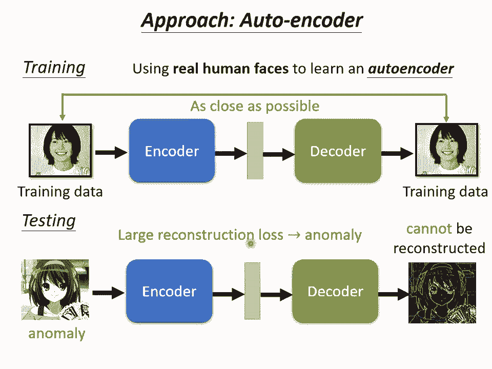

这个就是我们在作业里面，要大家做的事情，这个异常检测，其实也是另外一门学问，我们课堂上就没有时间讲了，异常检测不是只能用，Auto Encoder这个技术，Auto Encoder这个技术。

只是众多可能方法里面的，其中一个，我们拿它来当做，Auto Encoder的作业，因为我相信，你未来有很多的机会，用得上异常检测这个技术，那实际上，有关异常检测更完整的介绍，我们把过去上课的录影。

放在这边给大家参考。

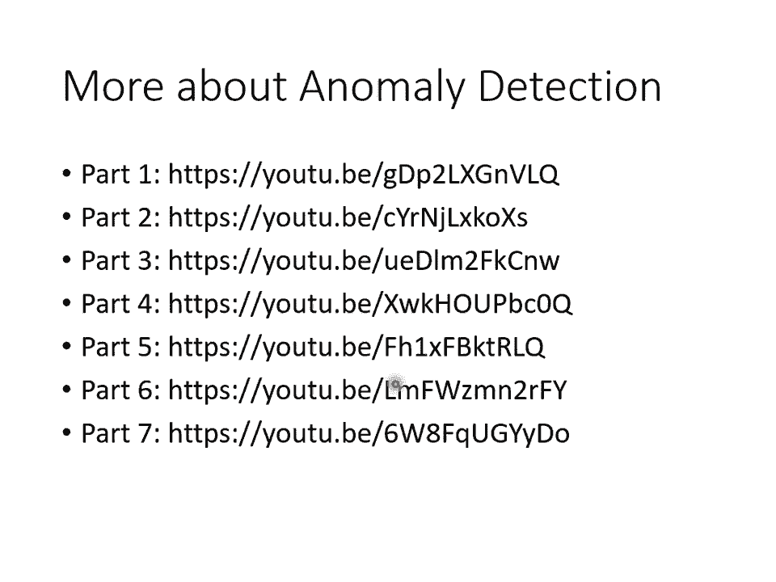

好那以上就是，有关Auto Encoder的部分，在我们请助教来讲作业之前，我们看一下，大家有没有问题想要问，大家有问题想要问吗，没有吗，好如果暂时没有问题的话。

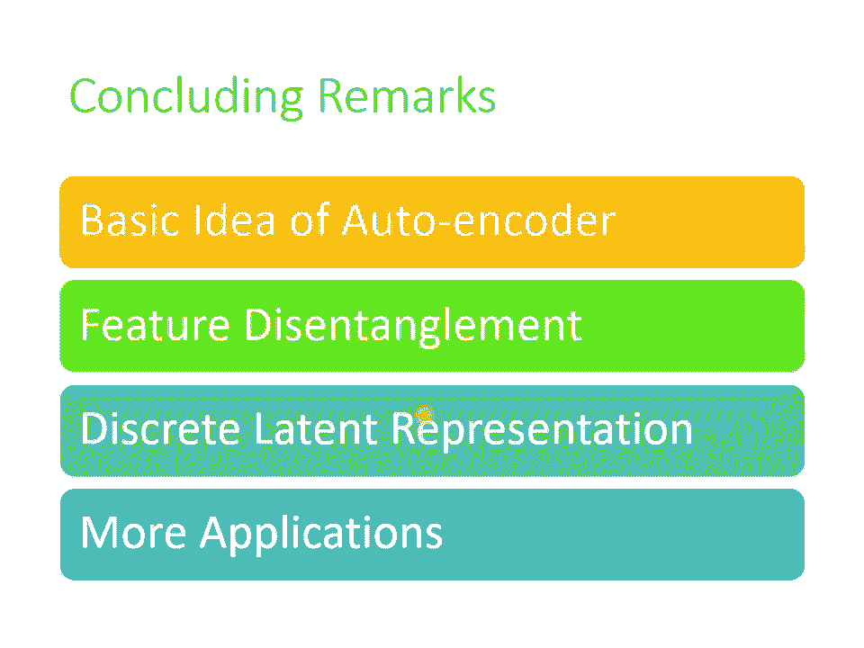

那我们就请助教来讲下一个。