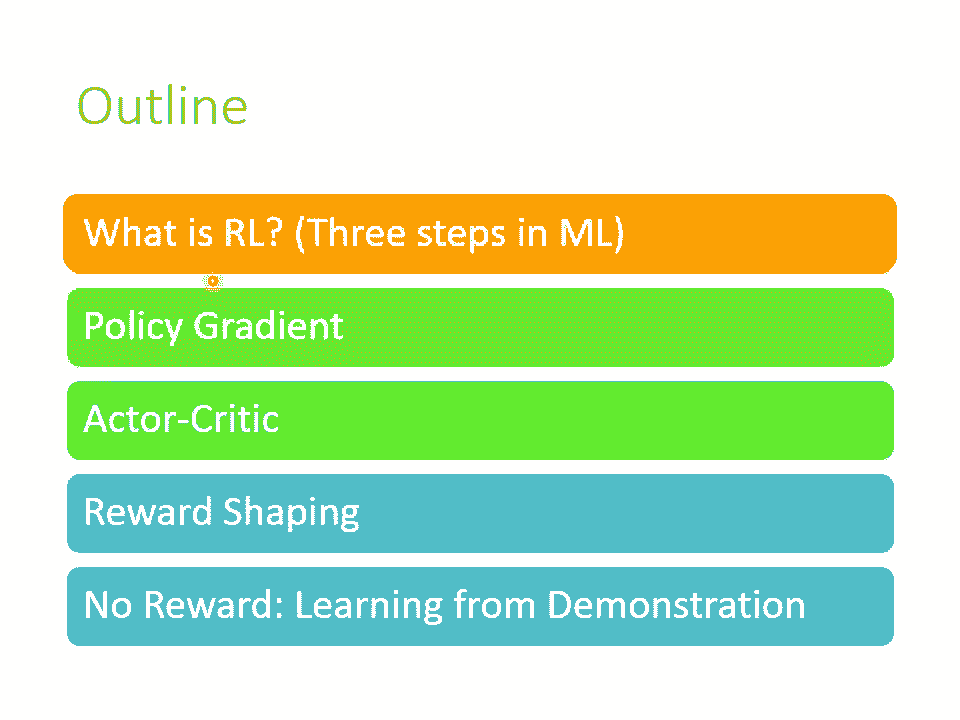
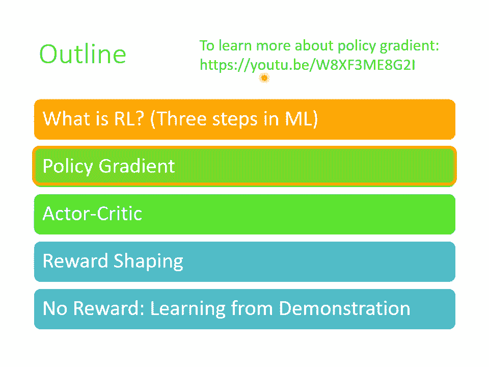
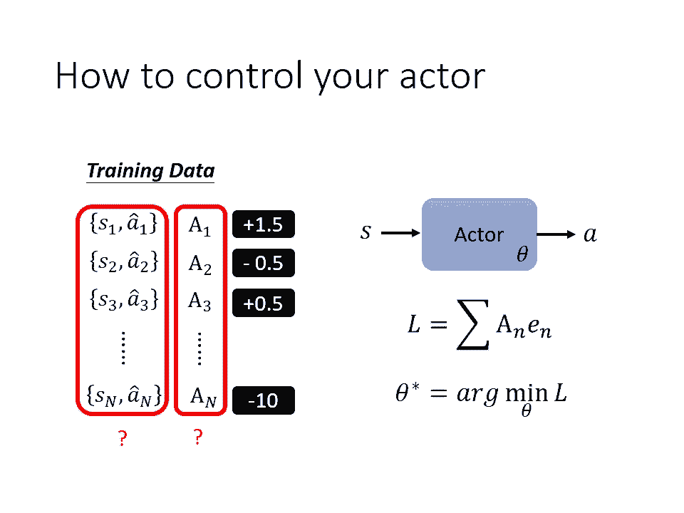

# P29：L18.1- 概述强化学习1：强化学习学习三个步骤 - ShowMeAI - BV1fM4y137M4

好，那我们来上课吧。啊，那这一堂课啊我们要讲的是deep reinforcement learning，也就是RL。那我想这个RL啊 reinforceinment learning呢。

大家一定一点都不陌生。因为你知道很多很很潮的应用阿法go等等啊，它背后呢用的就是RL的技术。那RL可以讲的技术啊非常非常的多，它不是在一堂课里面可以讲的完的。

我甚至觉得说如果有人要把它开成一整个学期的课，可能也是有这么多东西可以讲的。所以今天呢这堂课的目的并不是要告诉你有关RL的一切，而是啊让大家有一个基本的认识，大概知道RL是什么样的东西。

那RL相关的课程，你其实在网络上可以找到非常非常多的参考的资料。那RL如果要讲的非常的监涩，其实也是可以讲的非常的尖涩的。但是今天这一堂课啊，我们。量避开太过理论的部分，我期待这堂课可以让你做到的。

并不是让你听着觉得哇IL很困难啊，搞不清楚在做什么，而是期待让你觉得说啊IL原来就只是这样而已，我自己应该也做得起来。好，希望这堂课可以达到这个目的。好。

那什么是reinforment learning呢？到目前为止啊，我们讲的几乎都是supervised learning。假设你要做一个image的classifier，你不只要告诉机器。

它的input是什么，你还要告诉机器，它应该输出什么样的open。然后接下来呢你就可以train一个image的 classifier。

那在多数这门课讲到目前为止的技术基本上都是基于supervise learning的方法。就算是我们在讲sale superupervise learning的时候。

我们其实也是很类似supervise learning的方法，只是我们的label不需要特别雇用人力去标记，它可以自动产生。或者是我们在讲autoenr的时候。

我们虽然说它是一个unsupervise的方法，我们没有用到人类的标记。但事实上我们还是有一个label，只是这个label不需要耗费人类的力量来产生而已。

好，但是IL就是另外一个面向的问题了。在RL里面，我们遇到的问题是这样子的。我们机器当我们给他一个输入的时候，我们不知道最佳的输出应该是什么。局于来说，假设你要叫机器学习下围棋。

用supervis learning的方法好像也可以做，你就是告诉机器说看到现在的盘是长这个样子的时候，下一步应该落子的位置在哪里。但是问题是下一步应该落子的位置到底应该在哪里呢？

哪一个是最好的下一步呢？哪一步是神之一手呢？可能人类根本就不知道，当然你可以说啊让机器阅读很多职业骑士的棋谱，让机器阅读很多高端骑士的棋谱，也许这些棋谱里面的答案，也许这些棋谱里面给某一个盘是。

人类下的下一步就是一个很好的答案。但它是不是最好。的答案呢我们不知道。在这个你不知道正确答案是什么的情况下，往往就是RL可以派上用场的时候哦。所以当你今天你发现你要收集有标注的资料很困难的时候。

正确答案人类也不知道是什么的时候，也许就是你可以考虑使用RL的时候。好，但是哎我在学习的时候，机器其实也不是一无所知的。我们虽然不知道正确的答案是什么，但是机器会知道什么是好，什么是不好。

机器会跟环境去做互动，得到一个叫做reward的东西，这我们等一下都还会再细讲。所以机器会知道它现在的输出是好的还是不好的那借由跟环境的互动，借由知道什么样的输出是好的，什么样的输出是不好的。

机器还是可以学出一个模型。

好，那接下来呢这是今天这份投影片的alline。首先呢我们会从最基本的IL的概念开始。那在介绍这个IL概念的时候，有很多不同的切入点了。也许你比较常经过的切入点是这样啊。

比如说从mark of decision process开始讲解那我们这边选择了一个比较不一样的切入点。我要告诉你说，虽然呃如果你自己读IL的文献的话，你就觉得哇IL很复杂哦。

跟一般的machine learning好像不太一样哦，但是我这边要告诉你说RL它跟我们这门课学的machine learning是一样的框架。

我们在今天这个这学期一开始的第一堂课就告诉你说machine learning就是三个步骤。那IL呢RL也是一模一样的三个步骤。等一下会再跟大家说明。

好，在今天在在这个本学习这门课的第一开始就告诉你说什么是机器学习？机器学习就是找一个方向。reinforcement learningRL也是机器学习的一种。那它也在找一个方，它在找什么样的方呢？

在reinforment learning里面呢，我们会有一个。还有一个environment，那这个actctor跟environment会进行互动啊，你的这个environment。

你的这个环境呢会给actctor一个observation哦，会给那这个observ呢就是actctor的输入。那actctor呢看到这个ob observationserv以后呢，它会有一个输出啊。

这个输出呢叫做action。那这个action呢会去影响environment呃这个actctor采取action以后呢，environment就会给予新的observ。

然后actctor呢会给予新的action。那这个observation是actctor的输入。那这个action呢是actctor的输出。所以actctor本身呢它就是一个function。

其实actctor它就是我们要找的方啊这个 function它的输入就是环境给他的observ输出就是这个actctor要采取的action。而今天在这个互动的过程中呢。

这个environment会不断的给这个actctor一些reward，告诉他说，你现在采取的这个action它是好的，还是不好的。而我们今天要找的这个actctor啊。

我们今天要找的这个方可以拿observ当做input a当做output的 function，这个方的目标是要去mimize我们可以从environment获得到的reward的总和。

我们希望呢找一个function，那用这个方去跟环境做互动，用observ当做input输出action，最终得到的reward的总和可以是最大的。这个就是IL要找的方。那我知道这样讲。

你可能还是觉得有一些抽象。所以我们举更具体的例子。那等一下要举的例子呢都是用space invader当做例子啦。那space invader就是一个非常简单的小游戏。那呃I呢最早的几篇论文也都是。

玩让那个机器呢去玩这个space invader这个游戏。而在space invader里面呢，你要操控的是下面这个绿色的东西。而，这个下面这个绿色的东西呢是你的太空说，你可以采取的行为。

也就是action呢有三个哦左移右移跟开火，你就是这三个行为。然后你要现在要做的事情呢，就是杀掉画面上的这些外星人了啊，画面上这些黄色的东西，哎，就是外星人了。然后你开火呃，集中那些外星人的话。

那外星人就死掉了。而前面这些东西是什么呢？那个是你的防护罩啊，如果你不小心打到自己的防护罩的话，你的防护罩呢也是会被打掉的那你可以躲在防护罩后面你就可以挡住外星人的攻击。然后接下来呢会有分数。

在荧幕画面上会有分数。当你杀死外星人的时候，你会得到分数，或者是在有些版本的space invader里面呢，会有一个补给包啊，从上面横过去飞过去。那你打到补给包的话，会不会加一个很高的分数啊。

那这个score呢就是reward，就是环境给我们的reward。好，那这个游戏呢它是会终止的那什么时候终止呢？当所有的外星人都被杀光的时候就终止，或者是呢外星人其实也会对你的母舰开火了。

外星人击中你的母舰，你也是会这个你就被摧毁了。那这个游戏呢也就终止了。

好，那这个是介绍一下space invader这个游戏。好，那如果你今天呢要用actctor去玩space invader，大概会像是什么样子呢？现在你的actctor啊 actor虽然是一个机器。

但是它是坐在人的这个位置，它是站在人这个角度去操控遥感去控制那个母舰去跟外星人对抗，而你的环境是什么？你的玩环境呢？是游戏的主机啊，游戏的主机这边去操控那些外星人外星人去攻击你的母舰好。

所以 observationserv是游戏的画面，所以对actctor来说，他看到的其实就跟人类在玩游戏的时候看到东西是一样的啊，就看到一个游戏的画面。那输出呢就是actctor可以采取的行为啊。

可以采取哪些行为通常是事先定义好的，在这个游戏里面就只有向左向右跟开火三种可能的行为而已，那当你的ctor采取向。右这个行为的时候，那呃他会得到reward。

那因为在这个游戏里面只有杀掉外星人会得到分数，而我们就是把分数定义成我们的reward。那向左向右其实并不会是不可能杀掉任何的外星人然，所以你得到的reward呢就是零分。好。

那你采取一个action以后呢，游戏的画面就变了啊，游戏的画面变的时候就代表了有了新的observation进来，有了新的observation进来，你的actctor就会决定采取新的action。

你的actctor是一个function，这个function会根据输入的 observationserv输出对应的action。那新的画面进来。

假设你的actctor现在他采取的行为是开火而开火这个行为正好杀掉一外星人的时候，你就会得到分数。那这边假设得到分数是5分，杀掉外星人得到分数是5分，那你就得到reward等于5啊。

那这个呢就是拿actctor去玩小玩这个呃space invadeva这个游戏的状况。好，那这个actctor呢他想要学习的是什么呢？我们在玩游戏的过程中会不断的得到reward。

那在刚才的例子里面做第一个行为的时候，向右的时候得到是零分。做第二个行为开火的时候得到的是5分。那接下来你采取一连串行为都有可能给你分数。而actctor要做的事情。我们要呃学习的目标。

我们要找的这个actctor，就是我们想要认出一个actctor这个actctor这个方，我们使用它在这个游戏里面的时候，可以让我们得到的reward的总和会是最大的啊。

那这个就是呃拿呃actctor去这个就是IL用在玩这个小游戏里面的时候做的事情。

好，那其实如果把RL拿来玩围棋，拿来下围棋，其实做的事情跟呃小游戏其实也没有那么大的差别，只是规模跟问题的复杂度不太一样而已。啊，那如果今天啊你要让机器来下围棋，那你的actctor就是阿法。

那你要环境是什么？你的环境就是阿法狗的人类对手啊，那阿法的输入是什么？你的这个actctor的输入是什么？你的actctor的输入就是棋盘棋盘上黑子跟白子的位置。那如果是在游戏的一开始。

棋盘上就空空的呃空空如也，上面什么都没有没有任何黑子跟白子好，那这个actctor呢看到这个棋盘呢，它就要产生输出啊，它就要决定它下一步应该落子在哪里。那如果是围棋的话。

你的输出的可能性就是有19乘19个可能性。那这19乘19个可能性，没一个可能性就对应到棋盘。的一个位置。好，那假设现在你的actctor决定要落子在这个地方，那这个结果就会输入给你的环境。

那其实就是呃一个骑士。然后呢，这个环境呢就会再产生新的observation。因为这个呃你是使这个骑士呢，也会在落一子，那现在看到环境又不一样了。那你的actctor看到这个新的observation。

它就会产生新的action，然后就这样反复继续下去，你就可以让机器做下围棋这件事情。好，那在这个在这个下围棋这件事情里面的reward是怎么计算的呢？在下围棋里面。

你所采取的行为几乎都没有办法得到任何reward。在下围棋这个游戏里在下围棋这件事情里面呢，你会定义说如果赢了就得到一分。如果输了就得到负一分。也就是说。

在下围棋这整个呃这个呃你的actctor跟环境互动的过程中，其实只有游戏结束，只有整场围棋结束的最后一子，你才能够拿到reward。就你最后最后actctor下一子下去赢了就得到一分。

那最后他落了那一子以后，游戏结束了，他输了，那就得到负1分。那在中间整个互动的过程中的reward就都算是零分，没有任何的reward。好那这个actctor学习的目标啊，就是要去最大化。

他可能可以得到的reward。

好，刚才讲的也许你都已经听过了。那这个是RL最常见的一种解说方式。那接下来要告诉你说RL跟机器学习的framemework它们之间的关系是什么？

开学第一堂课就告诉给就告诉你说machine learning就是三个步骤。第一个步骤，你有一个function，那个function里面有一些未知数unknown的 variable。

这些未知数是要被找出来的。第二步，定一个lo function。第三步，想办法找出未知数去最小化你的lo。第三步就是 optimizationtim。而RL其实也是一模一样的三个步骤。

我们先来看第一个步骤。第一个步骤，我们现在有未知数的这个function到底是什么呢？这个有未知数的方就是我们的ctor。那在RL里面你的ctor呢就是一个。

那我们现在通常叫它policy的那呃呃在过去啊在还没有把 learning用到RL的时候，通常你的actctor是比较简单的，它不是nave，它可能只是一个lookup table。

告诉你说看到什么样的输入就产生什么样的输出。那今天我们都知道要用来当做这个actctor那这个其实就是一个很复杂的function，这个复杂的方，它的输入是什么呢？它的输入就是游戏的画面，就游戏的画面。

这个游戏上面这个黑子跟呃呃这个这个这个不是下围棋了，所以没有黑子跟白子了啊，那这们如果是拿这个呃玩space invadeva当做例子的话呢，这个。画面上的pixel像素就是这一个actctor的输入。

那它的输出是什么呢？它的输出就是每一个可以采取的行为，它的分数，每一个可以采取的action，它的分数啊，举例来说，输入这样的画面给你的actctor。

你的actctor其实就是一个val它的输出可能就是给向左0。7分向右0点2分开火0点1分。那事实上啊，这件事情跟分类是没有什么两样的。你知道分类就是输入一张图片输出就是决定这张图片是哪一个类别。

那你的naval会给每一个类别一个分数，你可能会通过一个sofm layer，然后每一个类别都会有一个分数，而，这些分数的总和是一。那其实在RL里面你的actctor。

你的y跟分类的那个val其实一模一样的，你就是输入一张图片输出其实最后你也会一个of max layer，然后呢你就会left right跟fi3个a各给一个分数啊，这些分数的总和，你也会让它是一。好。

那至于这个nve的架构呢，那你就可以自己设计了。要设计怎么样都行。比如说呃如果输入是一张图片，哎，也许你就会想要用CNN来处理。不过在住教城市里面，其实不是用CNN来处理了。因为在我们的作业里面。

其实在玩游戏的时候，不是直接让我们的性趣看游戏的画面，让他直接去看游戏，让他直接去看游戏的画面比较难做了。所以我们是让呃你只看这个跟呃现在游戏的状况有关的一些参数而已啊。好。

所以呃在这个助教在这个作业的这个sple code里面呢，还没有用到CNN那么复杂，就是一个简单的con。但是假设你要让你的actctor它的输入真的是游戏画面。哎。

那你可能就会采取这个CNN你可能就用CNN当做你的的架构，甚至你可能说我不要只看现在这个时间点的游戏画面，我要看整场游戏到目前为止发生的所有事情可不可以呢？可以。

那过去你可能会用RNN考虑现在的画面跟过去所有的画面。那现在你可能会想用transformer考虑所有发生过的事情。哦所以的架构是你可以自己设计的。

只要能够输入游戏的画面输出呃类似像类别这样的action就可以了。那最后机器会决定采取哪一个action，取决于每一个action取得的分数。常见的做法是直接把这个分数就当做一个几率。

然后按照这个聚集率几率去simple去随机决定要采取哪一个action。举例来说，在这个例子里面，向左得到0。7分，那就是有70per的几率会采取向左，20per的几率会采取向右。

10per的几率会采取开户。那可能会问说为什么不是用 max呢？为什么不是看left的分数最高就直接向左呢？你也可以这么做，你也可以这么做。呃，但是在助教的城市里面，还有多数I应用的时候。

你会发现我们都是采取simple采取simple有一个好处是说呃今天就算是看到同样的游戏画面，你的机器每一次采取的行为也会略有不同。那在很多的游戏里面这种随机性，也许是重要的哦。

比如说你在做剪刀石头布的时候，如果你总是会出石头就跟小叮当一样，那就很容易被打爆。啊。如果你有一些随机性就比较不容易被打爆。那其实之所以今天的输出是用随机simle的，还有另外一个很重要的理由。

那这个我们等一下会再讲到。好，所以这是第一步，我们有一个方，这个方有unknow的 variable，我们有一个那里面有参数这个参数就是unknow variable就是要被学出来的东西。这是第一步。

好，接下来第二步，我们要定义los在IO里面，我们的los长的是什么样子呢？我们再重新来看一下我们的机器跟环境互动的过程。那只是现在用不一样的方法来表示刚才说过的事情。好，首先有一个初始的游戏画面。

这个初始的游戏画面被作为你的actctor的输入，你的actctor就输出了一个action。比如说向右好，输入的游戏画面呢，我们叫它S one，然后输出了action呢，我们就叫它A one。

那现在会得到一个reward啊，这边因为向右没有做任何事情，没有杀死任何的外星人，所以得到reward可能就是零分。采取向右以后会看到新的游戏画面，这个叫做SQ。根据新的游戏画面，SQ。

你的actctor会采取新的行为。比如说开火这边用AQ来表示看到游戏画面SQ的时候所采取的行为。那假设开火恰好杀死一只外星人和你的actctor就得到re，这个reward的分数呢是5分。

然后采取开火这个行为以后，接下来你又会看到新的游戏画面。那机器又会采取新的行为。那这个互这个互动的过程呢就会反复持续下去。直到机器在采取某一个行为以后，游戏结束了。那什么时候游戏结束呢？

就看你游戏结束的条件是什么嘛。举例来说，采取最后一个行为以后，比如说向右移正好被呃外星人的子弹打中，那你的飞船就毁了，那游戏就结束了。或者是最后一个行为是开火，把最后一只外星人杀掉。

把最后一只外星人杀掉。那游戏也就结束了。就你执行某一个行为满足游戏结束的条件以后，游戏就结束了。那从游戏开始到结束的这整个过程啊，被称之为一个epode。那在整个游戏的过程中，机器会采取非常多的行为。

每个行为都可能得到reward把，所有的reward通通集合起来，我们就得到一个东西叫做整场游戏的totalre。

啊那这个totalre呢就从游戏一开始得到的R one一直得一直加累加到游戏最后结束的时候得到的RT。假设这个游戏里面会互动大题词，那么就得到一个total reward。

我们这边用大R来表示total reward。其实这个totalre又有另外一个名字啊，叫做return嘛。你在这个I的文献上啊，常常会同时看到reward跟return，这两个词会出现。

那reward跟 returnturn其实有点不一样。reward指的是你采取某一个行为的时候，立即得到的好处，这个是reward。把整场游戏里面所有的reward通通加起来，这个叫做return。

但是我知道说很快你就会忘记reward跟return的差别了。所以我们等一下就。不要再用return这个词汇，我们直接告诉你说，整场游戏的reward的总和就是total的re。

而这个total的re啊，就是我们想要去最大化的东西，就是我们训练的目标。那你赶快说哎这个跟los不一样啊。los是要越小越好啊，这个total reward是要越大越好啊，所以有点不一样吧。

但是我们可以说在RL的这个情境下，我们把那个total reward的负号负的total reward就当做我们的lototal reward是要越大越好。

那负的total reward当然就是要它越小越好嘛，就我们完全可以说负的total reward就是我们的lo就是RL里面的lo。

好，那在进入第三步之前，也许我们可以看一下怎么回答。有同学们有没有问题。好。那个哦有同学建议这个休息的时候可以关麦。好，那个呃这个我研究一下要怎么关麦，其实我还不知道怎么关麦。哦，讲理论不好吗？

讲理论没有不好。那你可以看一下过去呃有关RL这个部分的录音。那我等一下在投影片里面其实也有附上相关的录音。那里面是有讲到比较多理论的地方。那我这今天呢我是期待说从呃更浅显的角度呢来跟大家讲RL这件事情。

那你永远可以在过去的上课录音，找到比较偏理论的内容。好，那如果大家暂时还没有其他问题的话呢，我们就继续讲有关optimization的部分。好，那我们再把这个环境跟ag互动的这件事情呢。

再用不一样的图示再显示一次。好，这个是你的环境啊，你的环境呢输出一个observ，叫做S one这个S one呢会变成你的actctor的输入你的actctor呢接下来就输出A one。

而这个A one呢又变成环境的输入你的环境呢看到A one以后又输出S two。然后这个这个互动的过程呢就会继续下去。S two又输入给actctor。

它就输出A two A two又输入给environment，它就输出给它就产生S3啊这个互动呢一直下去，直到满足游戏终止的条件。好，那这个S跟A所形成的这个sequence啊。

就是S oneA one S two A two S3A3这个sequence啊又叫做trajectory。那我们用t呢来表示trajectory。好，那根据这个互动的过程，呃，魔性会得到reward。

你其实可以把reward也想成是一个function。我们这边用一个绿色的方块来代表这个reward所构成的function。这个reward这个 function不同的表示方法了。在有的游戏里面。

也许你的reward只需要看你采取哪一个a就可以决定。不过通常我们在决定reward的时候光看action是不够的。你还要看现在的observ才可以。因为并不是每一次开火，你都一定会得到分数嘛。

开火要正好有集到外星的外线正好在你前面你开火才有分数啊。所以通常reward function在定义的时候，不是只看action，它还需要看observ。

同时看action跟observation才能够知道现在有没有得到分数。而所reward是一个 function而这个reward的 function呢，它拿A one跟S one当做输入。

然后还产生R one作为输出啊，它拿A two跟S two当做输入产生R two作为输出。把所有的R通通集合起来哦，把R one加R2加Rs加到R大T全部集合起来就得到。啊，这个就是totalre。

也就是return，这个是我们要最大化要去mimize的对象。好，那这个optimization的问题它长得是什么样子呢？这个 optimizationtimization的问题是这个样子的。

你要去找一个nal，其实是nave里面的参数，你要去认出一组参数。这一组参数放在actctor里面，它可以让这个R的数值越大越好，就这样结束了，整个optimization的过程就是这样。

你要去找一个呃na的参数让这边产生出来的啊，越大越好。那乍看之下，如果这边的这个environment啊actctor啊跟reward啊，他们都是na的话，这个问题其实也没有什么难的。

这个这个搞不好你现在都可以解，它看起来就有点像是一个recurt这是一个recurt network，然后你的lo就是这个样子。那只是这边是reward是，所以你是要让它越大越好啊。

你就去认这个参数用 gradient你就可以让它越大越好。但是I有困难的地方是这不是一个一般的optimization的问题。

因为你的environment则这边有很多问题导致说它跟一般的naval training不太一样。第一个问题是你的actctor的输出是有随机性的这个A one它是用simple产生的。

一定同样的S one每次产生的A one不一定会一样。所以假设你把environment actor跟rework合起来当做是一个巨大的naval来看待这个nawork不是一般的naval这个nal里面是有随机性的。

这个naval里面的某一个lay是。每次产生出来结果是不一样的。这个内位里面某一个layer是是它的输出，每次都是不一样的。另外还有个更大的问题，就是你的environment跟reward。

它根本就不是na沃啊，它只是一个黑盒子而已。你根本不知道里面发生了什么事情。environment就是。游戏机，那这个游戏机它里面发生什么事情，你不知道你只知道说你输入一个东西，会输出一个东西。

你采取一个行为，它会有对应的回应。但是到底是怎么产生这个对应的回应的。我们不知道它只是一个黑盒子。而reward呢reward可能比较明确，但它也不是一个na word，它就是一条规则嘛。

它就是一个规则，说看到这样子的observ跟这样子的action会得到多少的分数，它就只是一个规则而已，所以它也不是naor。而且更糟而且更麻烦的地方是。

往往reward跟environment它也是有随机性的。如果是在电玩里面，通常rework可能比较不会有随机性的，因为规则是定好的对有一些IL的问题里面re是有可能有随机性的。

但是在vironment里面，在就算是在电玩的这个应用中，它也是有随机性的，你给定同样的呃行为到底游戏机会怎么样回应，它里面可能也是有乱述的，它可能每次回应也都是不一样的。如果是下围棋，你落同一个子。

你落在你若果只在同一个位置，你的对手会怎么样回应，每次可能也是不一样的哦，所以环境很有可能也是有随机性的。所以这不是一个一般的opimization的问题。

你可能不能够用我们这门课已经学过的训练ve的方法来找出这个ctor来最大化re哦，所以I真正的难点就是我们怎么解这个im。的问题，怎么找到一组内work的参数，可以让啊越大越好。其实你再仔细想一想啊。

这整个问题跟ga其实有异曲同工之妙，他们有一样的地方，也有不一样的地方。先说他们一样的地方在哪里？你记不记得在训练g的时候，在训练genator的时候。

你会把genator跟disriminator结在一起，然后你希望去调genator的参数，让disriminator的输出越大越好。今天在IO里面。

我们也可以说这个actctor就像是genatorenvironment跟reward就像是disriminator，我们要去调genator的参数，让disriminator的输出越大越好。

所以它跟g有异曲同工之妙。但什么地方不一样呢？在g里面你的disriminator也是一个newural network。你了解discriminator里面的每一件事情，它也是一个na。

你可以用 gradientant来 train你的genator。让disriminator得到最大的输出。但是在IL的问题里面，你的reward跟environment。

你可以把他们当discriminator来看，但他们不是na，他们是一个黑盒子。这你没有办法用一般 gradientient decent的方法来调整你的参数来得到最大的输出。

所以这是IL跟一般machine learning不一样的地方。但是我们还是可以把IL就看成三个阶段，只是在optimization的时候，在你怎么minimize loss。

也就怎么mimize reward的时候，跟一之前我们学到的方法是不太一样的。

好，那这个就是有关RL的跟machine learningning三个步骤的关系。好，我们看一下大家有没有问题问。嗯嗯。好，有一位同学问说，为什么负的total reward等于lo好。

为什么负的total reward会等于lo呢？我们在training的时候啊，在我们之前讲过的所有的deep learning training里面，我们都是定义了一个lo，要让这个lo呢越小越好。

在RL里面呢，我们是定义了一个total rewardR，然后我们要让那个R越大越好。但是要让R越大越好这件事情我们完全可以反过来说，就是我们要让负的R，就是R乘上一个负号越小越好。

所以我们就可以说R乘上个负号就是RL的most。诶。如果以前学的模型没有固定 random seat话，也算是有随机性吗？呃，这两个随机性是不一样的。呃。

我们在之前的学模型的时候没有固定你是training的时候有随机性，就是你没有固定你可能ize parameter不一样啊，所以你每次训练出来的结果不一样。

但是RL啊是在testing的时候就有随机性的。也就是说不是training的时候，随机性哦，是测试的时候就已经有随机性的。所以如果一般的training来比喻的话，就是你在你确好以后。

你拿这个在的时候，你想要使用它你要把这个使用在testing的状况下，但发现说你给 input，你每次输出都不一样啊，这个才是的随机性所以L说你劝好一个你认好了参数都是固定的但你。

拿这个ctor去跟环境互动的时候，每次的结果都是不一样的，因为你的环境就算是看到同样的输入，他每次给输出也可能是不一样的。哦，所以IL是一个呃随机性特别大的问题了。

所以你可以想见这个作业有可能是呃也确实是特别困难的。不过我觉得一个作业的难度啊呃有时候不好说，因为IL呃如果今天你没有任何网络上参考资料的话，它可能是最难的。但另外一方面。

IL又蛮容易找到哇各式各样的呃一号上的code的。所以我好像又没有那么难。但是IL的随机性是会非常非常大的。就算是同样的，你每次测试的时候，结果都可以是不一样。A one下方写up max是写错了哦。

呃，这个我投影片后来有。可能是有改了一下可能是有改了一下。如果你有不清楚的地方，你再问我好了，就是呃这个呃投影片我刚才在上课前呃改了一下，之后会把新的投影片呢再试出。好。好，大家还有问题要问一下吗？好。

如果大家暂时没有问题的话，那我们就再继续。那我们就是呃在讲到一个段落呢，我们再休息。好，那接下来啊我们就要讲一个拿来解RL拿来做optimization那一段常用的一个演算法。

叫做policy gradient。那如果你真的想知道policy gradient是哪里来的，你可以参见过去上课的录音，对policy gradient有比较详细的推导。

那今天我们是从另外一个角度来讲policy gradient这件事情。

好，那在讲pasy gradient之前呢，我们先来想想看我们要怎么操控一个actctor的输出。我们要怎么让一个actctor在看到某一个特定的observation的时候，采取某一个特定的行为呢？

我们怎么让一个actctor它的输入是S的时候，他就要输出action a ahead呢？那你其实完全可以把它想成一个分类的问题。也就是说，假设你要让actctor输入S输出就是head。

假设head就是向左好了。假设你要让假设你已经知道假设你就是要教你的ctor说看到这个游戏画面，向左就是对的，你就是给我向左，那你要怎么让你的actctor学到这件事呢。

那也就说S是actctor的输入head就是我们的label，就是我们的就是我们的正确答案。然后接下来呢你就可以计算你的actctor它的输出跟之间的cros entropy。

那接下来就可以定义一个lo，假设你希望你的actctor它采取head这个行为的话，你就定一个lo这个lo呢等于cro entropy。然后呢你再去一个，你再去一个。然后这个达呢可以让lo最小。

那你就可以让这个。actctor的输出跟你的光触越接近越好，你就可以让你的actctor学到说看到这个游戏画面的时候，他就是要向左哦，这个是要让你的actctor采取某一个行为的时候，你的做法。

但是假设你想要让你的ctor不要采取某一个行为的话，那要怎么做呢？假设你希望做到的事情是你的actctor看到某一个observ S的时候，我就千万不要向左的话，怎么做呢？

其实很容易你只需要把的定义反过来就好。你希望你的actctor采取 ahead这个行为，你就定义你的大L等于cro entropy。然后你要 minimizeize cross entropy。

假设你要让你的ctor不要采取head这个行为的话，那你就把你就定一个lo叫做负的 cross entropy cross entropy乘一个负号。那你去minize这个 l。

你去 minimizeize这个L就是让 cross entropy越大越好，那也就是让A跟的距离越远越好。那你就可以避免你的ctor在看到S的时候去采取这个行为。

所以我们有办法控制我们的actctor，做我们想要做的事。只要我们给他适当的label跟适当的lo。所以假设我们要让我们的ctor看到S的时候，采取 head看到S的时候，不要采取 a head的话。

要怎么做呢？这个时候你就会说呃呃given s这个serv，我们的光叫做 head s这个的时候，我们有个光处叫做 head。那对这两个光处，我们都可以去计算cro entropy啊。

我们都可以去计算cro entropy1万跟。然后接下来呢我们就定义说我们的lo啊就是1万减一。也就是说我们要让这个case它的 cross entropy越小越好。

那这个 case它的cro entropy越大越好。然后呢我们去找一个去ize得到s呃得到 star那就是一个可以在S的可以在看到S的时候采取 head看到S的时候。采取黑head的黑的。

所以借由很像是在确一个classifier的这种呃呃行为。借由很像是在train一个classifier的这种data，我们可以去控制一个actctor的行为。好，我刚刚讲过这边，有个同学要问问题。好。

有一个同学问了一个非常好的问题，就是如果以alie的游戏来说的话，因为只有射中al才会有reward。这样model不是就会一直倾向于设击吗？对，这个问题我们等一下会来解决它之后，投影片就会来解决它。

然后又有另外一个同学问了一个非常好的问题，就是哇，这样不就回到supervise learning了吗？这个投影片上看起来就是在训练个classifier而已啊，我们就是在训练classifier嘛。

你只告诉他说看到S的时候就要输出看到S的时候就不要输出这不就是supervise learning吗？

这是就是supervise learning这个就是跟supervise learningtrain个 image classifier是一模一样的。

但等下我们会看到它跟一般的supervise learning不一样在哪里。好，那我们就再继续再稍微看一段，我们再休息。啊，那所以呢呃如果我们要训练一个actctor，我们其实就需要收集一些训练资料。

啊，就收集训练资料。说哎，我希望在S one的时候采取Ahead one，我希望在S two的时候不要采取Ahead two。但可能会问说哎这个训练资料哪来的？这个我们等下再讲训练资料哪来的。啊。

所以你就搜集一大堆资料，这个跟圈一个image的classifier很很像的啊，这个S你就想成是image这个A你就想成是label。只是现在有的行为是想要被采取的，有的行为是不想要被采取的。

你就收集一堆这种资料，你就可以去定义一个lo function。有了这个lo function以后，你就可以去去练你的actctor去minize这个lo function就结束了。

你就可以去那个actctor期待他执行我们的行为期待他执行的行为是我们想要的。而你甚至还可以更进一步。你可以说每一个行为并不是只有好或不好，并不是有想要执行跟不想要执行而已。它是有程度的差别的。

有执行的非常好的，有nice to have的，有有点不好的，有非常差的。所以刚才啊我们是说每一个行为就是要执行，不要执行，这是一个bininary的问题。这是我们就用正负一来表示。

但是现在啊我们改成每一个S跟A的 pair，它有对应的一个分数。这个分数代表说我们多希望机器在看到S one的时候，执行A one head这个行为。那比如说这边第一笔资料跟第三笔资料。

我们分别是第正1。5跟正0。5，就代表说我们期待机器看到S one的时候，他可以做A one head看到S3的时候，他可以做A3 head。

但是我们期待他看到S one的时候做A one head的这个期待呢更强烈一点，比看到S3做A3 head的期待更强烈一点。那我们希望他在看到S two的时候，不要做A head。

我们期待他看到SN的时候，不要做A head。而且我们非常不希望他在看到SN的时候做A head有了这些资讯你。一样可以定义一个los function。你只是在你的原来的cro entropy前面。

本来是前cros entropy前面要么是正一，要么是负一。现在改成乘上AN这一项，改成乘上AN这一项告诉他说有一些行为我们非常期待actctor去执行。有一些行为我们非常不期待actctor去执行。

有一些行为如果执行的是比较好的，有一些行为希望呃执尽量不要执行比较好，但就算执行了也许伤害也没有那么大哦，所以我们透过这一个AN来控制说每一个行为我们多希望actctor去执行。

然后接下来有了这个lo以后，一样圈一个劝下去，你就找那个 star，你就有个actctor，他的行为是符合我们期待的了。那接下来的难点就是要怎么定出这一个A呢？这个就是我们接下来的难点就是我们接下来。

要面对的问题。我们还有另外一个面对的问题是怎么产生这个S跟A的pe呢？怎么知道在S one的时候要执行A one或者S two的时候不要执行A two呢？那这个也是等一下我们要处理的问题。好。

我们到这边呢呃我们先看一下有没有同学有问题要问好了。好，目前没有，那现在是5点15分，那我们休息10分钟，我们5点25分的时候再回来。

