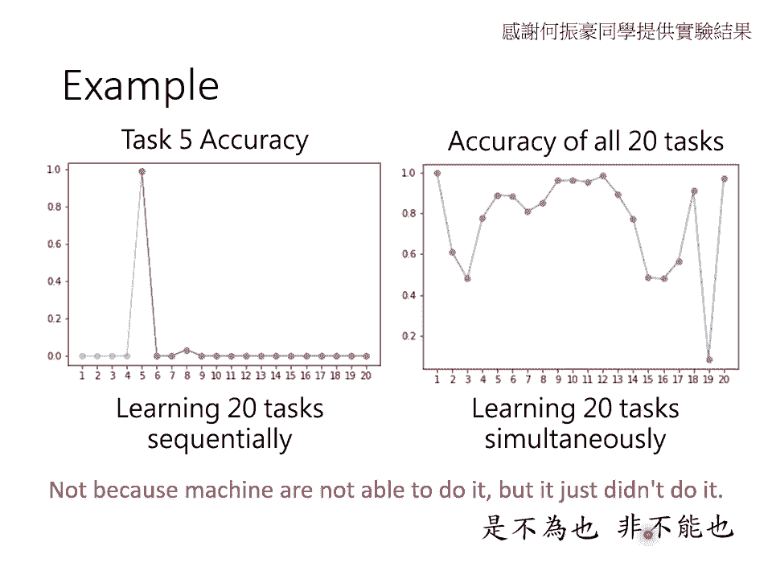
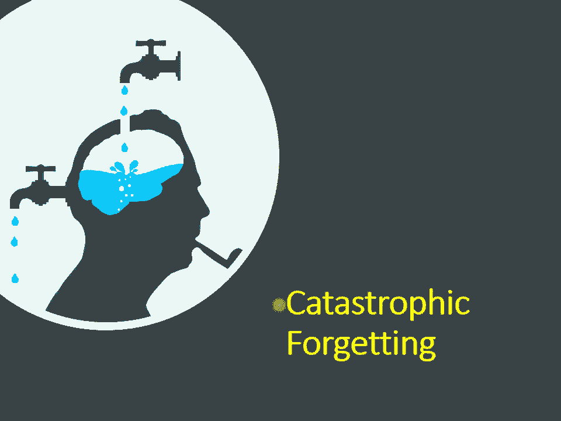
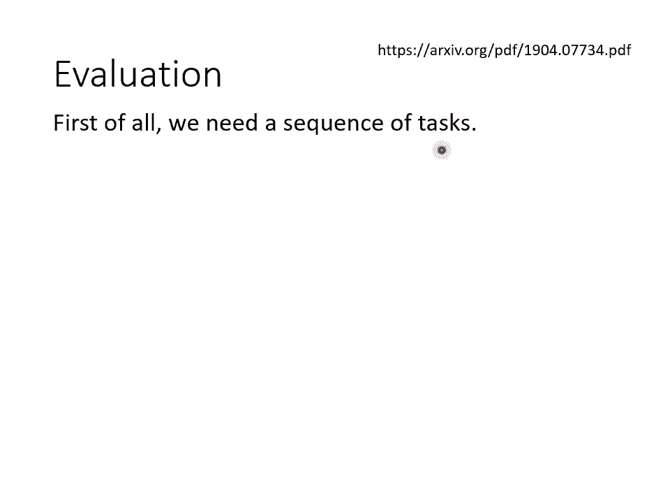
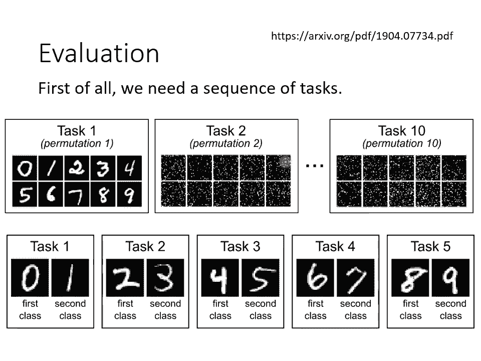
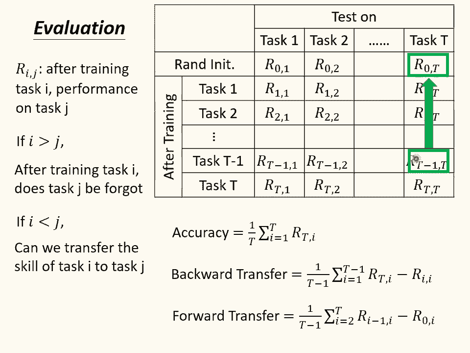

# P34：L20.1- 机器终身学习1：人工智能与灾难性遗忘 - ShowMeAI - BV1fM4y137M4

好，那接下来的课程呢要跟大家讲lifelong learning。那什么是lifelong learning呢？如果你google lifelong learning这个东西啊。

你最有可能找到的不是跟machine learning相关的内容。lifelong learning从它字面上的翻译。你可以知道lifelong learning指的就是终身学习，也就是活到老学到老。

所以如果你用lifelong learning做关键字去google的话，你通常找到的都是有关人类的lifelong learning。人类怎么活到老学到老。

但虽然今天大家关注的主题比较偏向人类怎么做lifelong learning，但是其实机器也需要做lifelong learning。机器可以做liphone learning这件事情呢。

非常接近人类对AI的想象。你知道在还没有修这门课之前，在还没有接触任何 machine型 learningning的内容之前，也许你对AI的想象是这个样子的哦，我们先教机器做某一件事情。

比如说学会做语音辨试啊，那他就会做语音辨试了。接下来你再教他第二个任务教他做影像辨试，他就会做影像辨试了。接下来你再教他做第三个任务，也许是翻译啊，他就会做影像辨试加语音辨试加翻译了。

你不断教他新的技能，等他学会上百万上千万个技能以后，它就变成天网，然后就可以统治人类。我们一般人对AI的想象是AI可以不断的学习新的任务最终越来越厉害，直到人类不能气集的程度。那这个构想。

这个目标就是lifelong learning。那lifelong learning呢常常缩写成三个LLLL啊tripleL不是LOL是LLOL。

那lifelong learning呢也有很多其他很潮的名字，比如说有的人叫他continuouscontinuous learning，有人叫他never ending learning。

听起来都很潮。那一个比较不潮的名字是incremental learning。好，但是你可能会想说lifelong learning这个目标太过远大。我今天又没有要做天网。

那lifelong learning对我有什么意义呢？在真实的application里面，lifeone learning也是pad上用场的。举例来说啊，今天你在实验室里面开发出某一个模型啊。

你在实验室里面收集一些资料，把这些资料呢进行训练，训练出一个模型。模型上线以后，它会取得来自使用者的feback。这时候我们都希望收集资料这件事情可以变成一个循环。我们模型上线以后收集到新的资料。

新的资料就可以让我们来更新我们模型的参数。模型的参数更新以后又可以收集更多的资料，收集更多的资料。模型的参数又可以再次更新，不断更新模型的参数。最终我们的系统就会越来越厉害。

那你可以把旧有的资料想成是过去的任务。啊，新的资料来自于使用者feedback的资料，想成市新的任务。所以这样子的情境也可以看作是lifelong learning的问题。机器不断的在线上收集资料。

用线上收集的资料来更新模型，这本质上就是一个lifelong learning的问题。那lifelong learning有什么样的难点呢？我们不就是让机器不断的看新的资料。

不断的去update它的参数，就做到lifelong learning了吗？那为什么lifelong learning会是一个值得研究的问题呢？那以下举一个简单的例子。

告诉你说lifelong learning的难点出在什么样的地方。假设呢我们现在有两个任务，那第一个任务是要做手写数字辨视，那给他一张非常noisy的image。机器要判断说哦，这里面是图片里。

任务二也是手写数字便识，那只是现在是比较简单的任务，你的图片里面是没有任何杂询的。我们要让机器学会这两个任务。那讲到这边，有人可能会说啊，老师这不算是两个任务了，这个算是同一个任务，不同的doman。

你要这样想也没问题，你也可以想成是同个任务，不同的doman。但其实啊在这个呃我知道说当我说我们要让机器学一连串的任务的时候，在你心里的想象，也许是哎机器先学个语音辨试，再学个影像辨试，再学个翻译。

但其实今天lifelong learning都还没有做到那个程度。一般在lifelong learning的文献上，所谓的不同任务指的差不多就是我这边这种等级啊，通常比较像是不同的doman。

而不是不同的任务。只是我们在这边我们把它当做不同的任务来看待。但就算是呃。非常类似的任务，你在做lion learningning的时候，也会有以下的问题。等下就是来看看有什么样的问题。好。

那我这边我就训练一个非常简单的navel，它只有三层每层50个newral。先在任务一上学一下，在任务一上学完以后，我们得到的结果是这个样子的。任务一正确率90per，就算还没有看过任务2。

任务2也已经得到96per的正确率了啊，这个transfer的结果非常的好，能够解任务一其实就能够解任务2了。好的，任务一学完之后，我们再让同一个模型继续去学任务2。

所谓同一个模型继续去学任务二的意思就是我们在学任务二的时候，并不让并不是让机器从头学起，并不是让机器从一组random initialize参数学起，而是用任务一的资料更新完模型之后。

同一个模型接下来继续用任务二的资料来更新。好，所以听清楚哦，是同一个模型继续用任务二的资料来更新。好，那所以同一个已经学学完任务一的模型，在学任务二会发生什么事呢？这是我们得到的结果。

任务二正确率变变更高了。因为之前根本没看过任务二的资料，就有96per了，看过任务二的资料，当然更厉害，变成97per。但糟糕的事情是，机器忘了怎么做任务一了。他本来任务一有90per的正确率。

在他学会任务2以后，任务一变成只有80per的正确率。他忘记了他过去已经学到的技能。那有人看到这边可能会觉得说哎，老师这有什么好奇怪的呢？你这个naever就是一个小小的naval啊。

那你叫他学任务2嘛，那任务一是之前学的嘛，啊他当然就呃呃他的能力有限啊，他脑脑容量有限啊，学完任务二以后，当然就忘了任务一嘛。但是我接下来告诉你另外一个实验。假设我们把任务一跟任务二的资料直接倒在一起。

会发生什么事呢？假设我们把任务一跟任务二的资料倒在一起，同时去训练这个naval，我们得到的结果是这样子的。任务一可以得到89per的正确率。任务二可以得到98per的正确率。

也就是对这个naval而言，要同时学好任务一跟任务2，它是办得到的。虽然他每一层只有50个newon，但50个newon已经足以让他同时在任务一上任务二上得到这样子的正确率。但不知道为什么。

如果不是同时学任务一任务2，而是先学任务一再学任务2的话，他在学任务二的时候，就会忘记任务一学过的东西了。他有足够的能力把两个任务都学好，但是当你让他一去学习的时候，他没办法记住九的任务。好。

那我看看有没有同学有问题要问的。哎，有同学问说老师是在家里开直播吗？答案是是，我在家里开直播。好。😊，好，那我们就继续我刚才举的例子呢，是影像辨识的例子。那我接下来再举一个这个自然语言处理的例子。

告诉你说，刚才看到的那个状况，它不是一个特例，它是一个非常一般非常常见的现象。这边要举的例子啊，是QA question answer，也就是我们的作业期。在作业期里面，你知道你可以让机器读一篇文章。

问他一个问题，然后他可以回答你的问题。那我们在这边用的啊并不是作业期的资料，而是更简单的QA的任务啊，这个QA的任务呢叫做BABI哦通常就念成baby。那baby是一个非常早的QA的任务啊。

在在人们刚开始研究QA在人类刚开始想要用这个技术解QA的问题之的时候，一开始人们觉得QA的问题太难了。我们要用用 deep learning技术解它感觉非常的困难啊。

所以facebook呢就先定义了20个简单的QA的任务。他们叫做baby。那这些QA的任务啊，不是真实的QA的任务。你如果打开你的作业期的资料跟baby的资料进行比较的话。

你会发现你作业期的资料是远比baby难的多的baby里面的文章都是用某种规则生成的。用某种tlate固定的句型生成的问题也是用固。句型生成的哦，所以baby是一个非常简单的任务，它里面看起来就像这样哦。

就呃mary把蛋糕给了fd啊，fd把蛋糕给了biill，然后bi把牛奶给了jeff，然后问你说啊，谁把蛋糕给了f啊，答案是mary就这么简单，或者是第15个任务里面是呃呃羊会怕狼猫会怕狗。

然后老鼠会怕猫，然后呢呃gtrude他是一个羊，那他怕什么啊怕狼，就这样所以都是这么简单的有这么简单的问题。那今天你一定会觉得说这个问题对我来说不是问题，作业期都学得起来，这么简单的问题。

没有学不起来的道理。不过在当年呢呃能够让机器学会这么简单的问题，人们已经觉得非常震惊的。好，那接下来我们要做的事情是让机器依序学过这20个QA的任务。那一般baby的使用方法是把20个任务通通倒在一起。

让机器一次学20个任务，或者是20个任务就算20个模型。那20个模型各自有不同的技能。那我这边想要做的事情是把20个任务一字排开，让机器从第一个任务学起，学到第20个任务。

那看看他能不能够把20个任务都学会。好，那这边的结果是这个样子，我们这边呢只看任务五的正确率好，所以这个纵轴呢是任务五的正确率。横轴呢是依序学20个任务的过程。好，那呃任务五呢就是这么简单。

就是我们刚才看过的那个蛋糕的例子。好，先让机器学任务一，再学任务2，再学任务3，再学任务4。把这四个任务一序学完。你发现说唉任务五都是正确率都是0啊，把任务一到4都学完任务5正确率都是0。

这件事没什么好惊讶的，因为他还没学到任务5啊，所以他当然不知道要怎么解任务五的问题呀，不叫扼杀位之虐嘛，所以他不会解任务五的问题得到正确率0per，嗯，不不能怪你的model。好，接下来学完任务5以后。

会发生什么事呢？学完任务5以后，正确率直接爆冲变成100percent。因为看过任务五的训练资料了吗？机器知道怎么解任务5，所以任务5正确率变100per。但是当我们继续学剩下的任务的时候。

会发生什么事呢？你发现正确率一阵暴跌。当机器学完任务6之后，任务五的正确率就变0percent了。学完任务7再去测试任务5就变0percent了。机器只要一学新的任务，旧的任务马上就忘的精光。

那你可能会以为说会不会是因为机器就是没有能力多学好几个任务呢？其实不是的，刚才在左边这个图是任务五的正确率，让机器依续学任20个任务。如果我们把20个任务的资料通通倒在一起。让机器同时学20个任务的话。

会发生什么事呢？右边这张图是机器同时学20个任务的结果。那这边的纵轴啊并不是某一个任务的正确率，而是这个对应到一的这个正确率，对应到一这个坐标的正确率就代表第一个任务的正确率，第二个任务的正确率。

第三个任务的正确率，一直到第20个任务的正确率，以此类推。你发现让机器同时学20个任务的时候，当有些任务很难，比如说任务19，机器学不会，但是机器是可以同时学会多个任务的。有好几个任务。

机器都可以得到非常高的正确率。但是这是同时学的状况。但你让机器依序学的时候，他就是学了新的东西，就忘了旧的东西。而右边这个实验告诉我们说，机器明明有能力学多个任务，但是你让他依去学一个一个任务的时候。

他就是不肯把多个任务都学会。所以他明明可以精通多个任务，却不肯做到，他是不是做不到，他是事故为也，非不能也。所以你会发现说当机器依去学多个任务的时候，他就好像是一个脑袋有洞的人啊，他就像左边这个人一样。

新的任务进来旧的东西就掉出去了，他永远学不会多个技能。而这个状况叫做caastrophphy forgetge。

在forgetting前面呢特别加上catatrophic这个形容词，因为forgetting遗忘，可能呃人类也会遗忘啊，所以机器会遗忘，也许不是什么特别惊人的事。但是机器遗忘的程度也未免太过分了。

基本上他根本就学不会新的技能，所以这种遗忘前面加上了一个形容词叫catatrophic灾难性的，告诉我们说这个遗忘不是一般的遗忘，它是灾难性的遗忘。

好，讲到这边呢，我们等一下就会继续来看说怎么解灾难性遗忘的问题，怎么让机器有办法依续学习多个任务。但在我们继续讨论技术之前，也许你会有一个问题。也许你会问说等一下呃。

刚才我们不是看到说只要把多个任务的资料通通倒在一起，机器就可以学多个任务了吗？把多个任务的资料倒在一起，同时学，这个叫做mtyt的training。

multtitask training就可以让机器学会多个任务了。那这个liphone learningar的问题有什么好研究的？但是你想想看到。假设现在我们要让机器学第1000个任务。

你要让机器避免遗忘前面999个任务，你必须要把前面999个任务的资料通通都拿出来。然后呢把它跟第1000个任务倒在一起，把这1000个任务所有的资料通通倒在一起，一起做训练。机器才能同时学会。

同时具有999个呃，就同时同时具有这1000个任务。我们要它学的技能。但是在实物上，这可能会是有问题的。因为如果我们要让机器学第1000个技能，需要前面999个任务的资料。

那意味着机器需要把它一辈子看过的资料通通都背在身上。它必须要把一辈子看过的资料通通都存下来。你可能根本没有那么大的空间可以储存所有的资料。而另外一方面呢，computation也是一个问题。

如果我们今天需要把1000个任务的资料通通倒在一起，才能进行训练，那这个训练的时间可能太长了，1000个任务的资料全部倒在一起可能太多了。那你训练的时间可能会太长，那就没有办法让机器学习多个任务。

所以假设今天机器一定要做mtask learning，才能够学习多个任务的话，那就好像是说有一个人假设我们要叫他上一门新的课，他必须要把他这辈子所有学过的课所有读过的教材通通都再读一遍。

他才有办法学习新的任务。那这样显然非常有没有效率嘛。而且随着你要学的任务越来越多，你训练的时间就会越来越长，你需要储存的资料也会越来越多。哦，所以mtask training。

虽然可以让机器学习多个任务。但是他不是解决lifelong learning最终的solution。那在文献上啊。

通常会把mtask training看作是lifelong learning的upper bound。就是如果我们把所有的资料通统倒在一起，虽然当任务多的时候，这是一个不切实际的做法。

但是它可以让机器学会多个任务。所以把所有的任务倒在一起，一次做训练mtask learning往往视为是lifelong learning的upper bound是lifelong learning没有办法超越的结果。

那所以你在做lifelong learning的研究的时候，你往往会比如说先跑个mtask training的结果，告诉我们说uper bound在哪里。

然后再看看你的lifelong learning的技术，能不能够逼近这个uper bound的结果。好，我们来看一下我们同学有问题。好。

有同学说呢呃mt learning等于是让机器做复习performance当然比较好。对对，我们现在要问的就是在不准复习的前提之下，可不可以不要忘记之前看过的东西。

不要每次学新的东西都一定要复习旧的东西。是好，有同学问说会有这种catrotrophy forget gettingtting的现象，是因为它的lo是根据多个task做调整的吗？呃，呃。

可以说是等一下我们其实会解释catrotrophy forget gettingtting的现象是怎么来的。好，有同学说分别学在做unemble，等一下我会告诉你说下一页。

同学们告诉你说分别学会有什么样的问题。好，有同学说，如果是接着学把旧的parameter改成不好的方向，却没有用原本的lose把它校正回来，是这样吗？哎，对对，没错。

等一下我们就会解释catrotrophyforget为什么会发生。但跟呃呃这位同学他名字是日文的，呃，讲的是蛮类似的。好，我们就继续吧。好。

下一页投影片就是唉那那我们怎么不每一个任务就学一个模型就好了呢？干嘛要那么执着于lifephone learning的问题呢？为什么一定要让一个模型学多个任务呢？

为什么不一个任务一个一个任务学一个模型就好了呢？如果我们只让让每一个任务都分开学一个模型，确实就没有catrotrophyforge的问题，但是我们会遇到的第一个问题是。

假设我们要叫机器学的技能非常非常的多，我们学得天网天网总是要会上亿个技能吧。我们总不能每个技能都有一个模型吧，这样子你可能没有办法把所有的模型储存下来。另外一方面呢如果我们是不同的任务就用不同的模型。

不同任务的资料间就不能够互通有无。他没有办法从其他的任务里面汲取单一个任务所没有办法学到的资讯。且你想想看呃，对人类来说，我们只有一个脑，但这个脑却可以学会多种不同的任务，不断学会新的技能。

我们并不需要每一个任务都用一个呃独立的脑来储存。但是为什么机器不能够做到一样的事情呢？这个就是liphone learning想要探讨的问题，能不能一个模型学多个任务？好，那讲到这边。

有的同学可能会说这个听起来跟transfer learning挺像的哦。transfer learning就是让机器在任务一上学习，希望任务一上学到技能可以transfer到任务二上面去。

但是lifelong learning跟transfer learning虽然他们都是叫机器学多个任务，但他们的关注点是不一样的。在transfer learning里面。

我们在意的事情是机器在第一个任务上面学到的技能能不能够对第二个任务有帮助。所以我们只在意在第二个任务上机器做的好不好。但lifelong learning的关注点是不一样的。

lifelong learning的关注点是当机器学完第二个任务的时候，回过头去，再看第一个任务，它到底还能不能够解第一个任务。哦。

所以虽然lifevelong learning跟transfer learning都会involve两个任务都要考虑两个任务。但transfer learning在意的是新的任务做的怎么样。

而lifelong learning它是在意旧的那个任务做的怎么样。好，那在讲lifephone learning的技术之前呢。

我们来讲一下怎么评估一个lifelong learning的技术做的好不好。当然，要做lifelong learning之前，你得先有一把任务让机器可以依序做学习。

但是其实今天呢如果你看那些lifelong learning的文献的话，所谓这个一把任务往往都是。呃，比较简单的一些任务，一个常见的setting是这个样子啊，你的任务一是做手写数字辨识。

任务2其实还是手写数字便识，但是这些点点这些看起来像是新这些看起来像是呃星星的图，到底是在做什么呢？这些是我们把每一个数字用某一种特殊的用某一种固定的规则，把它打乱。那每一个任务就是把数字做不同的打乱。

就成为不同的任务。那permutation呢还算是比较难的，还有看过更简单的是把所有的数字转往右转15度，算是新的任务啊，往左转15度也算是新的任务。那所以每一个任务都还是数字。

只是呢图片的角度不太一样而已。那这样你也可以来研究lifelong learning。啊，或者是另外一种状况是你的任务一是要让机器呢分辨0跟一任务2是要让机器分辨2跟3任务三是让机器分辨四跟5。

以此类推。但是对机器来说啊，0就是第一个class一就是第一个class，然后二就是第一个class三就是第二个class四就是第一个class5就是第二个class。所以今天你给他一张5。

它是第二它是要判断五属于第二个class，判断三属于第二class，一属于第二个class，然后024属于第一个class，然后依序进行训练。好。

那这个lifelong learning这个作业是选择题了。那助教也有提供一些城市，但是呃这些城市你能够跑过是最好，但我们要的就不是城市的结果，是根据城市的内容问大家一些问题。

那其中一个送分的问题就是会问你说哎，在助教城市里面，所谓的不同的任务是怎么样定义的。好。好，看到同学有一些问题，那我来回答一下。有方法可以让NN加一些约束，让他和原本的参数不要差太多。

让他记得旧的任务怎么做吗？哎，太好了，其实就是这样解的，这这就是等一下lifelong learning的呃其中一个最常用的解法算是被破梗了哈。我们需要的适当机器只有一个使命。好，后面还可打一个叉好。

好，那我们就继续吧。好，那这边呢是有关任务sequ的定义。那再来要讲我们如果有一堆任务的话，我们怎么评估一个lifeon learning的演算法做的好不好呢？啊，你评估的方法是这个样子的。好。

你有一排任务，有一排任务。然后呢，你先有一个随机初始化的参数，把这随机初始化的参数用在这大T的任务上得到大T个正确率你有这大T的任务的testing set，把随机初始化参数用在这大T的任务上。

得到大T的accur。

啊T个accuracy。然后接下来你让model先学第一个任务，学完第一个任务，拿第一个任务的训练资料出来。学完第一个任务以后，在这7个任务上。再去量一次正确率，然后学完第二个任务以后。

再去这第一个任务上再量一次正确率。学到第T减一个任务以后，在这第一个任务上再学一次正确率。学完最后一个任务以后，在这T个任务上再算一次正确率。你会得到这样一个表格。

接下来呢你会用这个表格呢来判断一个life from learning的model做的怎么样。那在这个表格里面呢，每一个数值指的就是某一个任务，它的测试资料的正确率。

那这个表格里面的每一个数值呢都有两个下标哦，I跟J第一个下标代表说呢，这个是训练完第I个任务以后的正确率。第二个下标指的是这是在第这一个任务上的正确率。

比如说R2一的意思就是说现在呢你的model刚学完任务2，它在任务一的正确率上怎么样。R，大T减12的意思就是说呢你的模型刚学完大T减一这个任务啊，在任务二上表现的怎么样。好。

所以如果我们今天看的是I大于J的那一些正确率的话，那意味着什么呢？I是比较后面的任务，Z是比较前面的任务。也就我们要知道我们想要知道的事情是，今天让模型训练完任务I以后。

他在过去已经训练过的任务Z上到底表现的怎么样，它有没有忘记任务Z过去学过的东西。如果今天我们看的是I小于J的那些R的话，那代表什么？代表是说我们刚学完任务I还没去学任务J，但机器会不会就无私自通。

已经会解任务J了呢？这边要看的是机器transfer的能力，在新的没有看过的任务上，transfer的能力怎么样。好，那最常见的评估一个lifelong learning系统的方法。

就是把最后这个ro的正确率加起来就结束了，你就让你的模型依续学过所有的任务到最后一个任务都学完以后，去之前所有的任务上面都算一遍正确率平均起来就代表你的lifelong learning的方法的好坏啊。

当然这个值可能会是最高的。因为刚学完任务第大T。那在任务大T上啊，当然表现最好。那在前面的任务那你的模型就会逐渐忘记第一个任务可能就是忘记了很惨的，完全忘记了，可能正确率是趋近于零的。

第二个任务可能稍微好一点，正确率一两per等等。那把这些所有的正确率平均起来就是评估一个lifelong learning系统的好坏，常见的用法。那其实还有其他的评估方法。

有一个评过方法叫做back word transfer。这个back word transfer呢是拿两个数值出来相减哦，它是拿。T减1去减掉R11拿RT减2去减掉R22，以此类推。

然后把所有的任务都加起来做平均。那这个值呢就是b word transfer。那这个RTone减R11哦，这边是拿RT1减R11或者是RT2减R22RT2减R22，它们到底是什么意思呢？他们的意思是说。

当你的模型先学完任务一的时候，在任务一上的正确率跟学到大T个任务完以后，在任务一上的正确率差多少。当学完任务一的时候，记忆犹新，这个时候正确率是最高的那随着学的任务越来越多哦。

那你的正确率就会不断的递减。那到底会减少多少呢？就我们把这两个R进行相减，可以评估说现在遗忘的程度有多严重。那因为呢机器每次看到新的任务以后，旧的任务就会不断遗忘。

所以你可以想见说RT减一通常是比R11小的了。RT减2通常是比R22小的了。所以如果你是拿RT1减R11RT2减R22的话，你通常得到的值是负的。所背 transfer啊通常算出来的值是负的是小于零的。

如果你今天可以提出一个li learning的方法，它很厉害，它是它的背过 transfer算出来是正的，那你就很厉害了。因为通常背过 transfer都是都是负的。如果你说机器学了新的任务以后。

大家可以触类旁通，把原来的任务一做的更好。他学完新的任务以后，触类旁通，把原来任务二做的更好，那你就你提出来lifephone learning就很厉害了。

一般lifephone learning做不到这件事，通常只要呃这个指标负的太严重就已经很厉害了。好，那还有一种评估方式啊叫做forward transfer。

那forward transfer通常就比较不是lifelong learning的重点。forward transfer想要问的问题是说，今天呢在看过一系列的任务，唉，我这个有点卡顿。

我也不知道为什么，我这个滑硕有点卡顿。好，不过没关系，我现在看看同学有没有问题啊，大家没有问题。好，我们继续讲。好，今天这个for transfer要问的问题是说呢呃在还没有看过某个任务。

只看过其他任务的时候，机器到底已经学到什么样的程度。所以你在做forward transfer的时候，你就是拿。T减ET去减R0T这个R。T减ET去减R0T到底意思呢？他的意思是说。

今天在还没有看到任务大T的时候，只看到任务T1到TT减一啊，只看到任务T1到T减一的时候，你的模型到底可以学出什么样程度的结果啊，这个是forward transfer。好。

那接下来就是准备要进入这个lifelong learning的解法。

